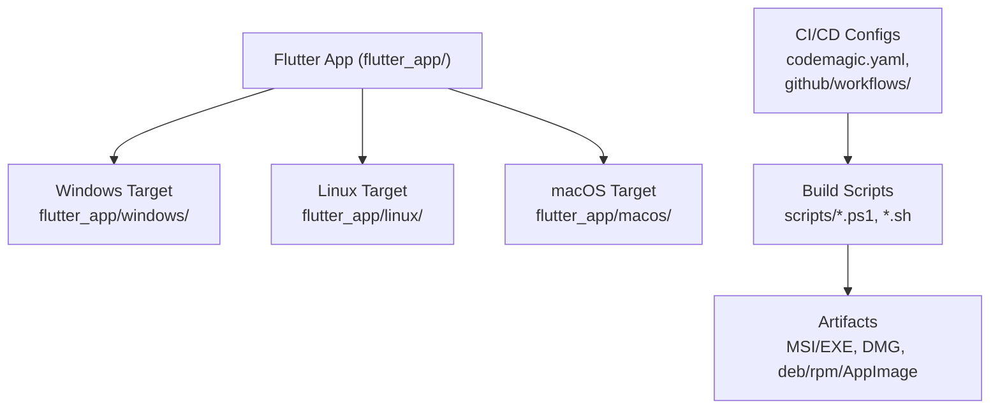
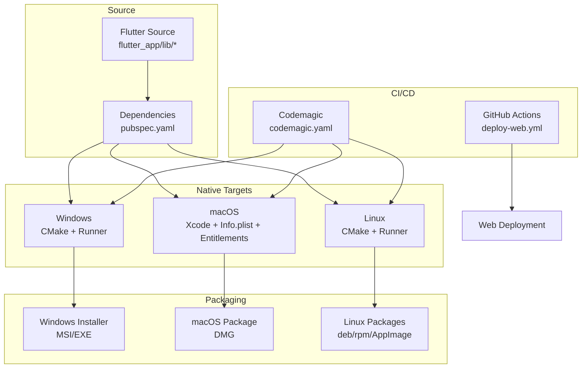
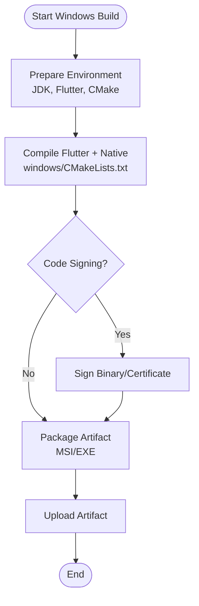
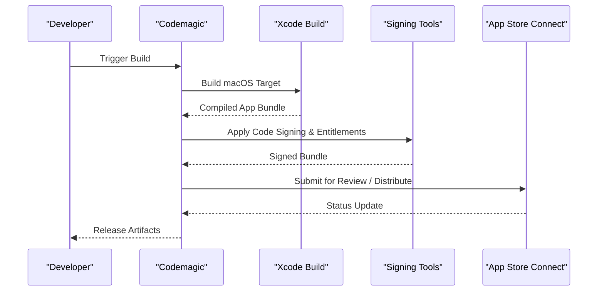
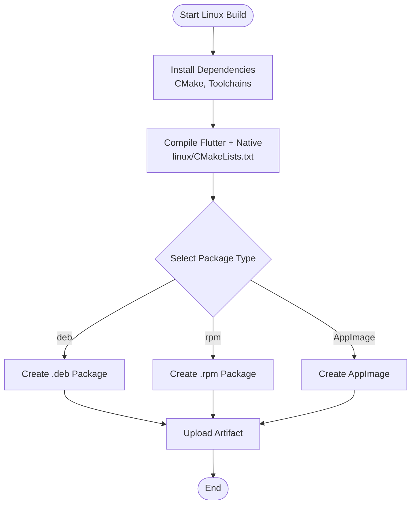
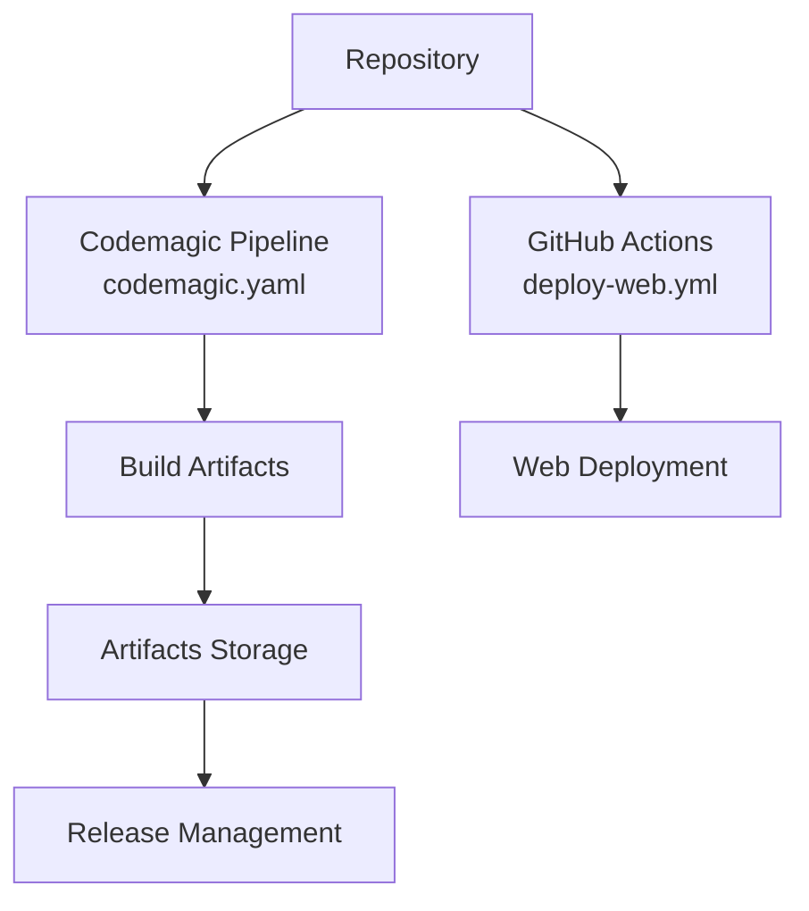
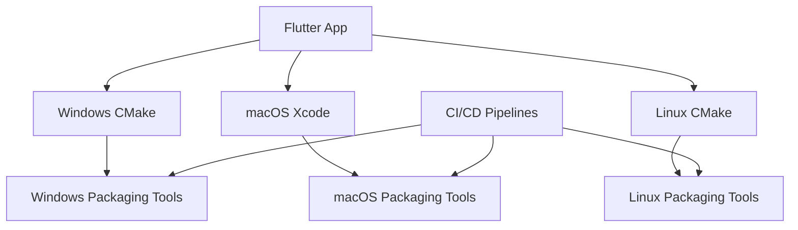

# Desktop Distribution & Packaging

<cite>
**Referenced Files in This Document**
- [README.md](file://README.md)
- [pubspec.yaml](file://flutter_app/pubspec.yaml)
- [CMakeLists.txt](file://flutter_app/windows/CMakeLists.txt)
- [main.cpp](file://flutter_app/windows/runner/main.cpp)
- [my_application.h](file://flutter_app/linux/runner/my_application.h)
- [my_application.cc](file://flutter_app/linux/runner/my_application.cc)
- [CMakeLists.txt](file://flutter_app/linux/CMakeLists.txt)
- [Info.plist](file://flutter_app/macos/Runner/Info.plist)
- [Release.entitlements](file://flutter_app/macos/Runner/Release.entitlements)
- [DebugProfile.entitlements](file://flutter_app/macos/Runner/DebugProfile.entitlements)
- [codemagic.yaml](file://codemagic.yaml)
- [deploy-web.yml](file://github/workflows/deploy-web.yml)
- [build_e_deploy_web.ps1](file://scripts/build_e_deploy_web.ps1)
- [DEPLOY_WINDOWS.bat](file://DEPLOY_WINDOWS.bat)
- [DEPLOY_MAC_LINUX.sh](file://DEPLOY_MAC_LINUX.sh)
- [setup_android_release_signing.ps1](file://scripts/setup_android_release_signing.ps1)
- [ensure_jdk21_toolchain.ps1](file://scripts/ensure_jdk21_toolchain.ps1)
- [enable_windows_developer_mode.ps1](file://scripts/enable_windows_developer_mode.ps1)
- [codemagic_ios_install_signing.sh](file://scripts/codemagic_ios_install_signing.sh)
- [codemagic_ios_prepare_build_ipa.sh](file://scripts/codemagic_ios_prepare_build_ipa.sh)
- [codemagic_ios_validate_export_options.py](file://scripts/codemagic_ios_validate_export_options.py)
- [codemagic_ios_upload_crashlytics_dsyms.sh](file://scripts/codemagic_ios_upload_crashlytics_dsyms.sh)
</cite>

## Table of Contents
1. [Introduction](#introduction)
2. [Project Structure](#project-structure)
3. [Core Components](#core-components)
4. [Architecture Overview](#architecture-overview)
5. [Detailed Component Analysis](#detailed-component-analysis)
6. [Dependency Analysis](#dependency-analysis)
7. [Performance Considerations](#performance-considerations)
8. [Troubleshooting Guide](#troubleshooting-guide)
9. [Conclusion](#conclusion)
10. [Appendices](#appendices)

## Introduction
This document provides comprehensive guidance for desktop distribution and packaging strategies for Gestão Yahweh Premium across Windows, macOS, and Linux. It covers build processes, code signing, security considerations, update mechanisms, CI/CD automation, artifact generation, release management, installer creation, uninstallers, post-installation setup, platform-specific channels, enterprise deployment, testing, and troubleshooting.

The project is a Flutter application with native targets for Windows, macOS, and Linux. Build and packaging are orchestrated via scripts and CI/CD configurations, including Codemagic and GitHub Actions.

## Project Structure
The desktop targets are implemented under the Flutter app directory:
- Windows target files reside in flutter_app/windows
- Linux target files reside in flutter_app/linux
- macOS target files reside in flutter_app/macos

Build orchestration and automation are located at the repository root and within scripts/:
- codemagic.yaml defines Codemagic workflows
- github/workflows/deploy-web.yml contains web deployment workflow
- scripts/ contains numerous PowerShell and shell utilities for building, signing, and deploying

**Diagram sources**
- [CMakeLists.txt](file://flutter_app/windows/CMakeLists.txt)
- [CMakeLists.txt](file://flutter_app/linux/CMakeLists.txt)
- [Info.plist](file://flutter_app/macos/Runner/Info.plist)
- [codemagic.yaml](file://codemagic.yaml)

**Section sources**
- [README.md](file://README.md)
- [pubspec.yaml](file://flutter_app/pubspec.yaml)

## Core Components
Key components involved in desktop distribution and packaging:
- Platform-specific build configuration files (CMake, Xcode Info.plist, entitlements)
- CI/CD pipelines (Codemagic, GitHub Actions)
- Build and packaging scripts (PowerShell and shell)
- Signing and security utilities (iOS/macOS signing helpers, environment preparation)

These components collaborate to produce installable artifacts and manage updates and releases.

**Section sources**
- [CMakeLists.txt](file://flutter_app/windows/CMakeLists.txt)
- [CMakeLists.txt](file://flutter_app/linux/CMakeLists.txt)
- [Info.plist](file://flutter_app/macos/Runner/Info.plist)
- [codemagic.yaml](file://codemagic.yaml)
- [deploy-web.yml](file://github/workflows/deploy-web.yml)

## Architecture Overview
The desktop distribution architecture integrates Flutter’s native targets with CI/CD pipelines and packaging tools:

**Diagram sources**
- [pubspec.yaml](file://flutter_app/pubspec.yaml)
- [CMakeLists.txt](file://flutter_app/windows/CMakeLists.txt)
- [CMakeLists.txt](file://flutter_app/linux/CMakeLists.txt)
- [Info.plist](file://flutter_app/macos/Runner/Info.plist)
- [codemagic.yaml](file://codemagic.yaml)
- [deploy-web.yml](file://github/workflows/deploy-web.yml)

## Detailed Component Analysis

### Windows Distribution (MSI, EXE)
- Build process uses CMake and the Flutter Windows runner to compile native binaries.
- Packaging into MSI or EXE can be performed by external tools invoked from scripts; ensure proper version metadata and icons are set in the Windows resources.
- Code signing on Windows requires valid certificates and appropriate tooling integration within the pipeline.

**Diagram sources**
- [CMakeLists.txt](file://flutter_app/windows/CMakeLists.txt)
- [main.cpp](file://flutter_app/windows/runner/main.cpp)

**Section sources**
- [CMakeLists.txt](file://flutter_app/windows/CMakeLists.txt)
- [main.cpp](file://flutter_app/windows/runner/main.cpp)
- [DEPLOY_WINDOWS.bat](file://DEPLOY_WINDOWS.bat)
- [enable_windows_developer_mode.ps1](file://scripts/enable_windows_developer_mode.ps1)

### macOS Distribution (DMG, App Store)
- The macOS target uses Xcode with Info.plist and entitlements for permissions and capabilities.
- DMG packaging typically involves creating an archive and compressing it; App Store submission requires provisioning profiles and code signing.
- Signing steps are handled by helper scripts that prepare export options and validate IPA before upload.

**Diagram sources**
- [Info.plist](file://flutter_app/macos/Runner/Info.plist)
- [Release.entitlements](file://flutter_app/macos/Runner/Release.entitlements)
- [DebugProfile.entitlements](file://flutter_app/macos/Runner/DebugProfile.entitlements)
- [codemagic_ios_install_signing.sh](file://scripts/codemagic_ios_install_signing.sh)
- [codemagic_ios_prepare_build_ipa.sh](file://scripts/codemagic_ios_prepare_build_ipa.sh)
- [codemagic_ios_validate_export_options.py](file://scripts/codemagic_ios_validate_export_options.py)

**Section sources**
- [Info.plist](file://flutter_app/macos/Runner/Info.plist)
- [Release.entitlements](file://flutter_app/macos/Runner/Release.entitlements)
- [DebugProfile.entitlements](file://flutter_app/macos/Runner/DebugProfile.entitlements)
- [codemagic_ios_install_signing.sh](file://scripts/codemagic_ios_install_signing.sh)
- [codemagic_ios_prepare_build_ipa.sh](file://scripts/codemagic_ios_prepare_build_ipa.sh)
- [codemagic_ios_validate_export_options.py](file://scripts/codemagic_ios_validate_export_options.py)

### Linux Distribution (deb, rpm, AppImage)
- The Linux target uses CMake and a custom runner to generate executables.
- Packaging into deb or rpm requires distribution-specific packaging tools and metadata; AppImage provides a portable format.
- Ensure dependencies are bundled or declared appropriately for each package type.

**Diagram sources**
- [CMakeLists.txt](file://flutter_app/linux/CMakeLists.txt)
- [my_application.h](file://flutter_app/linux/runner/my_application.h)
- [my_application.cc](file://flutter_app/linux/runner/my_application.cc)

**Section sources**
- [CMakeLists.txt](file://flutter_app/linux/CMakeLists.txt)
- [my_application.h](file://flutter_app/linux/runner/my_application.h)
- [my_application.cc](file://flutter_app/linux/runner/my_application.cc)

### CI/CD Pipelines and Automation
- Codemagic orchestrates builds and deployments for mobile and potentially desktop targets through codemagic.yaml.
- GitHub Actions includes a web deployment workflow; additional jobs can be added for desktop packaging.
- Scripts in scripts/ automate environment setup, signing, and publishing tasks.

**Diagram sources**
- [codemagic.yaml](file://codemagic.yaml)
- [deploy-web.yml](file://github/workflows/deploy-web.yml)
- [build_e_deploy_web.ps1](file://scripts/build_e_deploy_web.ps1)

**Section sources**
- [codemagic.yaml](file://codemagic.yaml)
- [deploy-web.yml](file://github/workflows/deploy-web.yml)
- [build_e_deploy_web.ps1](file://scripts/build_e_deploy_web.ps1)

### Code Signing and Security Considerations
- macOS/iOS signing relies on provisioning profiles, certificates, and entitlements managed by helper scripts.
- Windows signing requires trusted certificates and secure storage of private keys.
- Linux packages should avoid embedding secrets and use system keyrings where applicable.
- Validate export options and signatures before distribution to prevent runtime failures.

**Section sources**
- [codemagic_ios_install_signing.sh](file://scripts/codemagic_ios_install_signing.sh)
- [codemagic_ios_prepare_build_ipa.sh](file://scripts/codemagic_ios_prepare_build_ipa.sh)
- [codemagic_ios_validate_export_options.py](file://scripts/codemagic_ios_validate_export_options.py)
- [codemagic_ios_upload_crashlytics_dsyms.sh](file://scripts/codemagic_ios_upload_crashlytics_dsyms.sh)

### Update Mechanisms
- Implement in-app update checks against a secure endpoint returning version metadata.
- For desktop platforms, leverage native update frameworks or custom downloaders with signature verification.
- Ensure rollback strategies and integrity checks are in place.

[No sources needed since this section provides general guidance]

### Installer Creation and Uninstaller Implementation
- Windows: Use MSI or EXE installers with proper registry entries and uninstaller logic.
- macOS: Create DMG with standard installation flow and uninstall script.
- Linux: Provide package managers’ uninstall commands and cleanup scripts.

[No sources needed since this section provides general guidance]

### Post-Installation Setup
- Configure application paths, permissions, and integrations during installation.
- Verify dependencies and prompt users for required actions (e.g., enabling developer mode on Windows).

**Section sources**
- [enable_windows_developer_mode.ps1](file://scripts/enable_windows_developer_mode.ps1)

### Platform-Specific Distribution Channels
- Windows: Microsoft Store, direct downloads, enterprise deployment via Group Policy or SCCM.
- macOS: App Store, direct DMG distribution, enterprise distribution via MDM.
- Linux: Distribution repositories, AppImage hosting, enterprise deployment via package managers.

[No sources needed since this section provides general guidance]

### Enterprise Deployment Scenarios
- Centralized software distribution using enterprise tools.
- Customizable installation parameters and silent installs.
- Compliance with organizational security policies and auditing.

[No sources needed since this section provides general guidance]

### Testing Across Different Environments
- Unit tests for core logic and integration tests for platform-specific features.
- Automated testing in CI/CD pipelines for multiple OS versions and architectures.
- Manual validation of installers and uninstallers on target systems.

**Section sources**
- [ensure_jdk21_toolchain.ps1](file://scripts/ensure_jdk21_toolchain.ps1)
- [setup_android_release_signing.ps1](file://scripts/setup_android_release_signing.ps1)

### Troubleshooting Distribution Issues
- Common issues include missing dependencies, incorrect signing, and permission errors.
- Use logging and artifact inspection to diagnose failures.
- Validate environment setup and toolchain versions consistently across CI and local builds.

**Section sources**
- [DEPLOY_WINDOWS.bat](file://DEPLOY_WINDOWS.bat)
- [DEPLOY_MAC_LINUX.sh](file://DEPLOY_MAC_LINUX.sh)

## Dependency Analysis
Desktop packaging depends on Flutter’s native targets, CMake, Xcode, and distribution-specific tools. CI/CD pipelines coordinate these dependencies and manage secrets securely.

**Diagram sources**
- [CMakeLists.txt](file://flutter_app/windows/CMakeLists.txt)
- [CMakeLists.txt](file://flutter_app/linux/CMakeLists.txt)
- [Info.plist](file://flutter_app/macos/Runner/Info.plist)
- [codemagic.yaml](file://codemagic.yaml)

**Section sources**
- [CMakeLists.txt](file://flutter_app/windows/CMakeLists.txt)
- [CMakeLists.txt](file://flutter_app/linux/CMakeLists.txt)
- [Info.plist](file://flutter_app/macos/Runner/Info.plist)
- [codemagic.yaml](file://codemagic.yaml)

## Performance Considerations
- Optimize build times by caching dependencies and incremental compilation.
- Minimize artifact sizes through compression and stripping unnecessary symbols.
- Use parallel jobs in CI/CD to accelerate multi-platform builds.

[No sources needed since this section provides general guidance]

## Troubleshooting Guide
- Verify toolchain installations and environment variables.
- Check signing certificate validity and entitlements configuration.
- Inspect logs from CI/CD runs and local builds for error messages.
- Test installers on clean VMs to identify environment-specific issues.

**Section sources**
- [DEPLOY_WINDOWS.bat](file://DEPLOY_WINDOWS.bat)
- [DEPLOY_MAC_LINUX.sh](file://DEPLOY_MAC_LINUX.sh)
- [ensure_jdk21_toolchain.ps1](file://scripts/ensure_jdk21_toolchain.ps1)

## Conclusion
Effective desktop distribution for Gestão Yahweh Premium requires careful coordination of Flutter native targets, CI/CD pipelines, and platform-specific packaging tools. By implementing robust signing, security practices, and automated workflows, teams can deliver reliable updates across Windows, macOS, and Linux while supporting enterprise deployment scenarios.

[No sources needed since this section summarizes without analyzing specific files]

## Appendices
- Additional references to platform documentation and best practices for packaging and distribution.
- Links to official guides for Windows MSI/EXE, macOS DMG/App Store, and Linux deb/rpm/AppImage creation.

[No sources needed since this section provides general guidance]