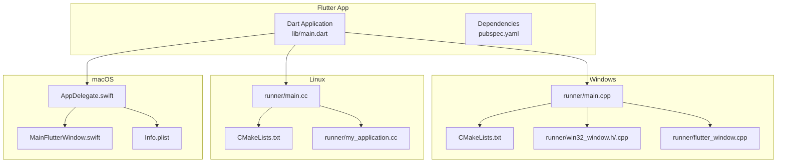
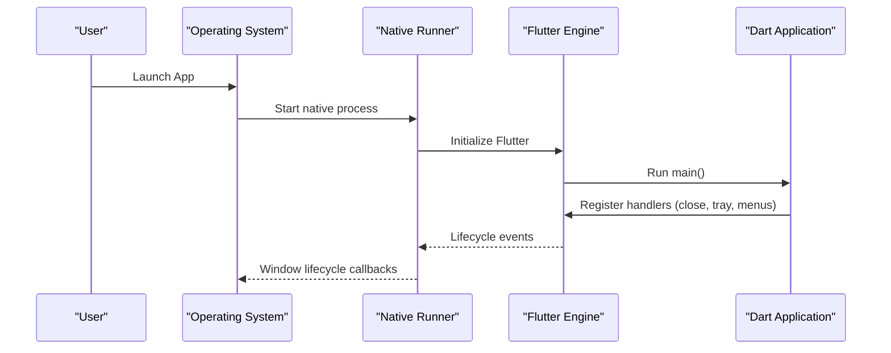
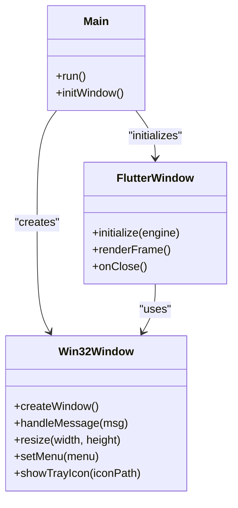
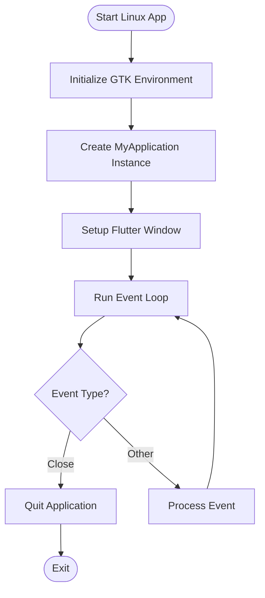
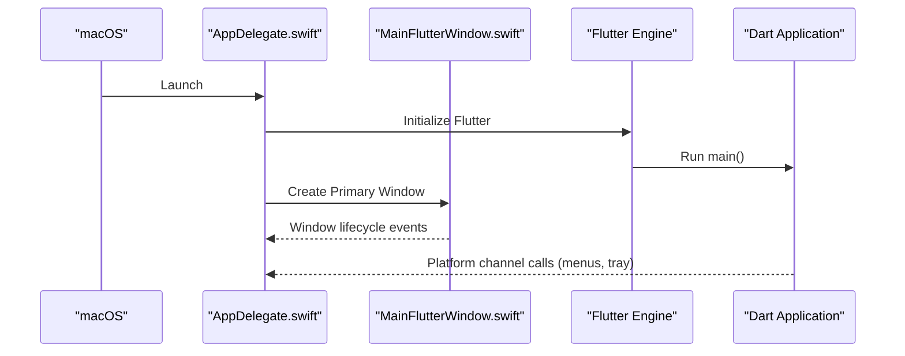
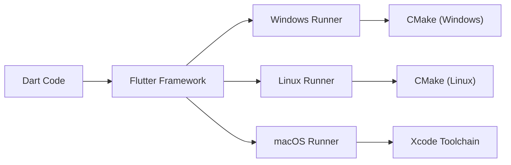

# Desktop Platforms (Windows, macOS, Linux)

<cite>
**Referenced Files in This Document**
- [README.md](file://flutter_app/README.md)
- [pubspec.yaml](file://flutter_app/pubspec.yaml)
- [main.dart](file://flutter_app/lib/main.dart)
- [window_close_handler_io.dart](file://flutter_app/lib/window_close_handler_io.dart)
- [window_close_handler_stub.dart](file://flutter_app/lib/window_close_handler_stub.dart)
- [windows/CMakeLists.txt](file://flutter_app/windows/CMakeLists.txt)
- [windows/runner/main.cpp](file://flutter_app/windows/runner/main.cpp)
- [windows/runner/flutter_window.cpp](file://flutter_app/windows/runner/flutter_window.cpp)
- [windows/runner/win32_window.h](file://flutter_app/windows/runner/win32_window.h)
- [linux/CMakeLists.txt](file://flutter_app/linux/CMakeLists.txt)
- [linux/runner/main.cc](file://flutter_app/linux/runner/main.cc)
- [linux/runner/my_application.cc](file://flutter_app/linux/runner/my_application.cc)
- [macos/Runner/AppDelegate.swift](file://flutter_app/macos/Runner/AppDelegate.swift)
- [macos/Runner/MainFlutterWindow.swift](file://flutter_app/macos/Runner/MainFlutterWindow.swift)
- [macos/Runner/Info.plist](file://flutter_app/macos/Runner/Info.plist)
- [DEPLOY_WINDOWS.bat](file://DEPLOY_WINDOWS.bat)
- [DEPLOY_MAC_LINUX.sh](file://DEPLOY_MAC_LINUX.sh)
- [codemagic.yaml](file://codemagic.yaml)
</cite>

## Table of Contents
1. [Introduction](#introduction)
2. [Project Structure](#project-structure)
3. [Core Components](#core-components)
4. [Architecture Overview](#architecture-overview)
5. [Detailed Component Analysis](#detailed-component-analysis)
6. [Dependency Analysis](#dependency-analysis)
7. [Performance Considerations](#performance-considerations)
8. [Troubleshooting Guide](#troubleshooting-guide)
9. [Conclusion](#conclusion)
10. [Appendices](#appendices)

## Introduction
This document provides comprehensive desktop platform documentation for Windows, macOS, and Linux implementations of Gestão Yahweh Premium. It focuses on native desktop integration, window management, file system access patterns, and platform-specific optimizations. It also covers build processes, distribution methods, and desktop-specific features such as system tray integration, keyboard shortcuts, and native menu systems. The Flutter-based architecture is leveraged to deliver a consistent user experience across platforms while allowing targeted enhancements per OS.

## Project Structure
The project uses a single Flutter application with platform-specific directories:
- flutter_app: Contains the shared Dart code and platform folders (android, ios, web, windows, linux, macos).
- scripts: Build and deployment automation scripts for various targets.
- functions: Cloud Functions and utilities not directly related to desktop runtime.
- Root-level deploy scripts for Windows and macOS/Linux.

Key desktop entry points:
- Windows: CMake-based runner with Win32 window integration.
- Linux: GTK-based runner using CMake and GLib/GTK.
- macOS: Swift AppDelegate and MainFlutterWindow managing app lifecycle and window.

**Diagram sources**
- [windows/CMakeLists.txt](file://flutter_app/windows/CMakeLists.txt)
- [windows/runner/main.cpp](file://flutter_app/windows/runner/main.cpp)
- [windows/runner/win32_window.h](file://flutter_app/windows/runner/win32_window.h)
- [windows/runner/flutter_window.cpp](file://flutter_app/windows/runner/flutter_window.cpp)
- [linux/CMakeLists.txt](file://flutter_app/linux/CMakeLists.txt)
- [linux/runner/main.cc](file://flutter_app/linux/runner/main.cc)
- [linux/runner/my_application.cc](file://flutter_app/linux/runner/my_application.cc)
- [macos/Runner/AppDelegate.swift](file://flutter_app/macos/Runner/AppDelegate.swift)
- [macos/Runner/MainFlutterWindow.swift](file://flutter_app/macos/Runner/MainFlutterWindow.swift)
- [macos/Runner/Info.plist](file://flutter_app/macos/Runner/Info.plist)

**Section sources**
- [README.md](file://flutter_app/README.md)
- [pubspec.yaml](file://flutter_app/pubspec.yaml)

## Core Components
- Window Management:
  - Windows: Win32 window creation and lifecycle managed via win32_window.h/.cpp and flutter_window.cpp.
  - Linux: GTK application lifecycle handled by my_application.cc and main.cc.
  - macOS: AppDelegate.swift initializes the Flutter engine; MainFlutterWindow.swift manages the primary window.
- Close Handling:
  - Platform-aware close behavior implemented through window_close_handler_io.dart and stubs for non-I/O contexts.
- Configuration and Dependencies:
  - pubspec.yaml defines dependencies that may include desktop-specific packages (e.g., tray manager, file dialogs).
  - Info.plist on macOS configures permissions and app metadata.

**Section sources**
- [window_close_handler_io.dart](file://flutter_app/lib/window_close_handler_io.dart)
- [window_close_handler_stub.dart](file://flutter_app/lib/window_close_handler_stub.dart)
- [windows/runner/win32_window.h](file://flutter_app/windows/runner/win32_window.h)
- [windows/runner/flutter_window.cpp](file://flutter_app/windows/runner/flutter_window.cpp)
- [linux/runner/my_application.cc](file://flutter_app/linux/runner/my_application.cc)
- [linux/runner/main.cc](file://flutter_app/linux/runner/main.cc)
- [macos/Runner/AppDelegate.swift](file://flutter_app/macos/Runner/AppDelegate.swift)
- [macos/Runner/MainFlutterWindow.swift](file://flutter_app/macos/Runner/MainFlutterWindow.swift)
- [macos/Runner/Info.plist](file://flutter_app/macos/Runner/Info.plist)
- [pubspec.yaml](file://flutter_app/pubspec.yaml)

## Architecture Overview
The desktop architecture follows a layered approach:
- Dart layer: Shared business logic, UI, and cross-platform APIs.
- Platform layer: Native runners initialize the Flutter engine and manage OS-specific windowing and lifecycle.
- Integration points: File system access, notifications, and system tray are exposed via plugins or platform channels.

**Diagram sources**
- [windows/runner/main.cpp](file://flutter_app/windows/runner/main.cpp)
- [linux/runner/main.cc](file://flutter_app/linux/runner/main.cc)
- [macos/Runner/AppDelegate.swift](file://flutter_app/macos/Runner/AppDelegate.swift)
- [main.dart](file://flutter_app/lib/main.dart)

## Detailed Component Analysis

### Windows Desktop Implementation
- Entry point and windowing:
  - main.cpp initializes the Win32 application and creates the Flutter window.
  - flutter_window.cpp handles Flutter rendering within the Win32 window.
  - win32_window.h/.cpp encapsulates window creation, sizing, and message handling.
- Build system:
  - CMakeLists.txt configures compilation and linking for Windows targets.
- Distribution:
  - DEPLOY_WINDOWS.bat automates packaging and deployment steps.

**Diagram sources**
- [windows/runner/main.cpp](file://flutter_app/windows/runner/main.cpp)
- [windows/runner/flutter_window.cpp](file://flutter_app/windows/runner/flutter_window.cpp)
- [windows/runner/win32_window.h](file://flutter_app/windows/runner/win32_window.h)

**Section sources**
- [windows/CMakeLists.txt](file://flutter_app/windows/CMakeLists.txt)
- [windows/runner/main.cpp](file://flutter_app/windows/runner/main.cpp)
- [windows/runner/flutter_window.cpp](file://flutter_app/windows/runner/flutter_window.cpp)
- [windows/runner/win32_window.h](file://flutter_app/windows/runner/win32_window.h)
- [DEPLOY_WINDOWS.bat](file://DEPLOY_WINDOWS.bat)

### Linux Desktop Implementation
- Entry point and windowing:
  - main.cc sets up the GTK application and integrates Flutter.
  - my_application.cc manages application lifecycle and window configuration.
- Build system:
  - CMakeLists.txt configures GTK dependencies and build targets.
- Distribution:
  - DEPLOY_MAC_LINUX.sh includes steps for Linux packaging and signing.

**Diagram sources**
- [linux/runner/main.cc](file://flutter_app/linux/runner/main.cc)
- [linux/runner/my_application.cc](file://flutter_app/linux/runner/my_application.cc)

**Section sources**
- [linux/CMakeLists.txt](file://flutter_app/linux/CMakeLists.txt)
- [linux/runner/main.cc](file://flutter_app/linux/runner/main.cc)
- [linux/runner/my_application.cc](file://flutter_app/linux/runner/my_application.cc)
- [DEPLOY_MAC_LINUX.sh](file://DEPLOY_MAC_LINUX.sh)

### macOS Desktop Implementation
- Entry point and windowing:
  - AppDelegate.swift initializes the Flutter engine and manages app lifecycle.
  - MainFlutterWindow.swift controls the primary window and integrates with macOS windowing.
- Configuration:
  - Info.plist defines app metadata, permissions, and entitlements.
- Distribution:
  - DEPLOY_MAC_LINUX.sh includes macOS packaging and notarization steps.

**Diagram sources**
- [macos/Runner/AppDelegate.swift](file://flutter_app/macos/Runner/AppDelegate.swift)
- [macos/Runner/MainFlutterWindow.swift](file://flutter_app/macos/Runner/MainFlutterWindow.swift)
- [macos/Runner/Info.plist](file://flutter_app/macos/Runner/Info.plist)

**Section sources**
- [macos/Runner/AppDelegate.swift](file://flutter_app/macos/Runner/AppDelegate.swift)
- [macos/Runner/MainFlutterWindow.swift](file://flutter_app/macos/Runner/MainFlutterWindow.swift)
- [macos/Runner/Info.plist](file://flutter_app/macos/Runner/Info.plist)
- [DEPLOY_MAC_LINUX.sh](file://DEPLOY_MAC_LINUX.sh)

### Cross-Platform Desktop APIs
- Window close handling:
  - window_close_handler_io.dart implements I/O-aware close behavior.
  - window_close_handler_stub.dart provides fallbacks for non-I/O environments.
- Keyboard shortcuts and native menus:
  - Implement via platform channels or desktop-specific plugins declared in pubspec.yaml.
- System tray integration:
  - Use platform channels or plugins to show/hide tray icons and handle context menu actions.

**Section sources**
- [window_close_handler_io.dart](file://flutter_app/lib/window_close_handler_io.dart)
- [window_close_handler_stub.dart](file://flutter_app/lib/window_close_handler_stub.dart)
- [pubspec.yaml](file://flutter_app/pubspec.yaml)

## Dependency Analysis
Desktop builds rely on:
- Flutter framework and platform-specific runners.
- Native toolchains (MSVC for Windows, GCC/Clang for Linux, Xcode for macOS).
- CMake for configuring native builds.
- Optional plugins for tray, file dialogs, and system integration.

**Diagram sources**
- [windows/CMakeLists.txt](file://flutter_app/windows/CMakeLists.txt)
- [linux/CMakeLists.txt](file://flutter_app/linux/CMakeLists.txt)
- [macos/Runner/AppDelegate.swift](file://flutter_app/macos/Runner/AppDelegate.swift)

**Section sources**
- [pubspec.yaml](file://flutter_app/pubspec.yaml)
- [windows/CMakeLists.txt](file://flutter_app/windows/CMakeLists.txt)
- [linux/CMakeLists.txt](file://flutter_app/linux/CMakeLists.txt)

## Performance Considerations
- Optimize window resizing and redraws by minimizing layout recalculations.
- Use platform-native file operations for large I/O tasks where possible.
- Profile memory usage on each platform using platform-specific tools (Visual Studio Profiler, Instruments, perf).
- Leverage caching strategies for frequently accessed data to reduce disk and network overhead.

[No sources needed since this section provides general guidance]

## Troubleshooting Guide
- Common issues:
  - Window not closing properly: Verify close handler implementation in window_close_handler_io.dart.
  - Tray icon not showing: Check plugin configuration and platform permissions.
  - Build failures: Ensure correct toolchain setup and CMake configurations.
- Debugging approaches:
  - Use platform debuggers (VS Code, Xcode, GDB/LLDB).
  - Enable verbose logging in Dart and native layers.
  - Inspect logs from native runners during startup.

**Section sources**
- [window_close_handler_io.dart](file://flutter_app/lib/window_close_handler_io.dart)
- [windows/runner/main.cpp](file://flutter_app/windows/runner/main.cpp)
- [linux/runner/main.cc](file://flutter_app/linux/runner/main.cc)
- [macos/Runner/AppDelegate.swift](file://flutter_app/macos/Runner/AppDelegate.swift)

## Conclusion
Gestão Yahweh Premium’s desktop implementation leverages Flutter’s cross-platform capabilities while integrating deeply with native OS features. By following the documented architecture, build processes, and optimization strategies, developers can deliver robust desktop experiences tailored to Windows, macOS, and Linux. Platform-specific considerations such as window management, file system access, and system tray integration ensure seamless user interactions across all supported operating systems.

[No sources needed since this section summarizes without analyzing specific files]

## Appendices
- Build and distribution scripts:
  - DEPLOY_WINDOWS.bat for Windows packaging and deployment.
  - DEPLOY_MAC_LINUX.sh for macOS and Linux packaging, signing, and distribution.
- CI/CD integration:
  - codemagic.yaml orchestrates multi-platform builds and releases.

**Section sources**
- [DEPLOY_WINDOWS.bat](file://DEPLOY_WINDOWS.bat)
- [DEPLOY_MAC_LINUX.sh](file://DEPLOY_MAC_LINUX.sh)
- [codemagic.yaml](file://codemagic.yaml)