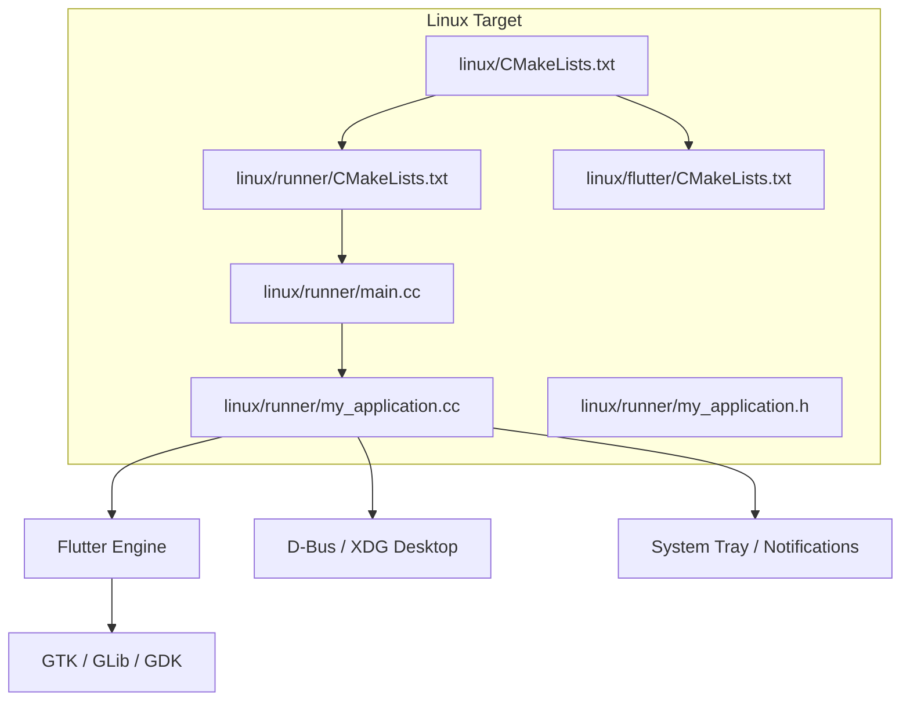
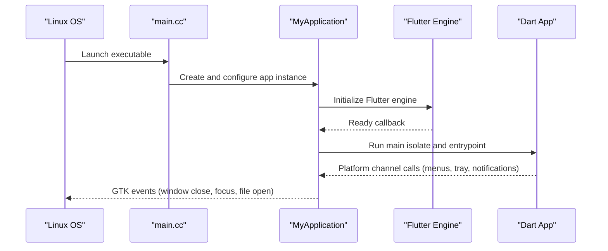
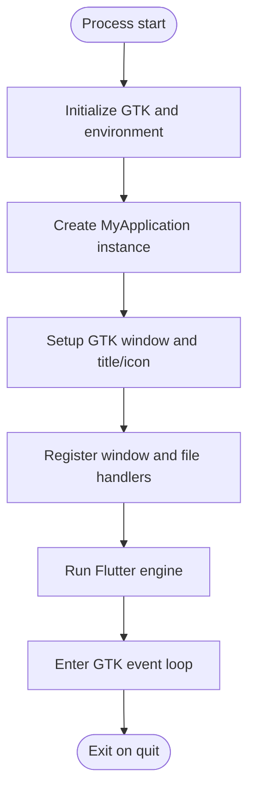
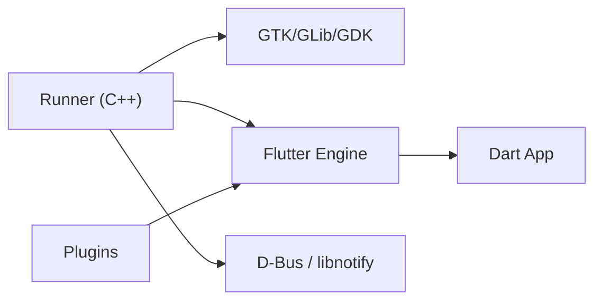

# Linux Implementation

<cite>
**Referenced Files in This Document**
- [flutter_app/linux/CMakeLists.txt](file://flutter_app/linux/CMakeLists.txt)
- [flutter_app/linux/runner/CMakeLists.txt](file://flutter_app/linux/runner/CMakeLists.txt)
- [flutter_app/linux/runner/main.cc](file://flutter_app/linux/runner/main.cc)
- [flutter_app/linux/runner/my_application.cc](file://flutter_app/linux/runner/my_application.cc)
- [flutter_app/linux/runner/my_application.h](file://flutter_app/linux/runner/my_application.h)
- [flutter_app/linux/flutter/CMakeLists.txt](file://flutter_app/linux/flutter/CMakeLists.txt)
- [flutter_app/pubspec.yaml](file://flutter_app/pubspec.yaml)
- [DEPLOY_MAC_LINUX.sh](file://DEPLOY_MAC_LINUX.sh)
</cite>

## Table of Contents
1. [Introduction](#introduction)
2. [Project Structure](#project-structure)
3. [Core Components](#core-components)
4. [Architecture Overview](#architecture-overview)
5. [Detailed Component Analysis](#detailed-component-analysis)
6. [Dependency Analysis](#dependency-analysis)
7. [Performance Considerations](#performance-considerations)
8. [Troubleshooting Guide](#troubleshooting-guide)
9. [Conclusion](#conclusion)

## Introduction
This document describes the Linux desktop implementation for Gestão Yahweh Premium. It focuses on the GTK-based native layer generated by Flutter’s Linux target, CMake configuration, packaging, desktop integration (file associations and notifications), window and menu management, system tray usage, distribution formats (deb, rpm, AppImage), dependency management, debugging and profiling, and cross-distribution compatibility.

## Project Structure
The Linux desktop target lives under flutter_app/linux and follows Flutter’s standard layout:
- linux/: top-level CMake entry point and metadata
- linux/runner/: native C++ entrypoint, application class, and build rules
- linux/flutter/: Flutter engine glue and plugin registration

**Diagram sources**
- [flutter_app/linux/CMakeLists.txt](file://flutter_app/linux/CMakeLists.txt)
- [flutter_app/linux/runner/CMakeLists.txt](file://flutter_app/linux/runner/CMakeLists.txt)
- [flutter_app/linux/runner/main.cc](file://flutter_app/linux/runner/main.cc)
- [flutter_app/linux/runner/my_application.cc](file://flutter_app/linux/runner/my_application.cc)
- [flutter_app/linux/runner/my_application.h](file://flutter_app/linux/runner/my_application.h)
- [flutter_app/linux/flutter/CMakeLists.txt](file://flutter_app/linux/flutter/CMakeLists.txt)

**Section sources**
- [flutter_app/linux/CMakeLists.txt](file://flutter_app/linux/CMakeLists.txt)
- [flutter_app/linux/runner/CMakeLists.txt](file://flutter_app/linux/runner/CMakeLists.txt)
- [flutter_app/linux/runner/main.cc](file://flutter_app/linux/runner/main.cc)
- [flutter_app/linux/runner/my_application.cc](file://flutter_app/linux/runner/my_application.cc)
- [flutter_app/linux/runner/my_application.h](file://flutter_app/linux/runner/my_application.h)
- [flutter_app/linux/flutter/CMakeLists.txt](file://flutter_app/linux/flutter/CMakeLists.txt)

## Core Components
- Native entrypoint (main.cc): Initializes the Flutter Linux embedding and starts the application lifecycle.
- Application class (my_application.*): Wraps GTK window creation, menu setup, icon handling, and platform channels.
- CMake configuration: Builds the native runner, links against GTK/GLib/GDK, and integrates the Flutter engine and plugins.
- Flutter engine glue (linux/flutter): Generates plugin registrant and engine bootstrap code used by the runner.

Key responsibilities:
- Window lifecycle and focus handling
- Menu bar and accelerators
- System tray icon and context menu
- File association and MIME type registration
- Desktop notifications via D-Bus
- Plugin bridge to Dart code

**Section sources**
- [flutter_app/linux/runner/main.cc](file://flutter_app/linux/runner/main.cc)
- [flutter_app/linux/runner/my_application.cc](file://flutter_app/linux/runner/my_application.cc)
- [flutter_app/linux/runner/my_application.h](file://flutter_app/linux/runner/my_application.h)
- [flutter_app/linux/runner/CMakeLists.txt](file://flutter_app/linux/runner/CMakeLists.txt)
- [flutter_app/linux/flutter/CMakeLists.txt](file://flutter_app/linux/flutter/CMakeLists.txt)

## Architecture Overview
At runtime, the native runner initializes the Flutter engine, creates a GTK window, and delegates UI rendering to Flutter. Platform-specific features are exposed through platform channels to Dart.

**Diagram sources**
- [flutter_app/linux/runner/main.cc](file://flutter_app/linux/runner/main.cc)
- [flutter_app/linux/runner/my_application.cc](file://flutter_app/linux/runner/my_application.cc)

## Detailed Component Analysis

### Native Entry Point and Application Lifecycle
- The native entrypoint bootstraps the Flutter Linux embedding, sets up error handlers, and hands control to the application class.
- The application class manages the primary window, registers callbacks for window events, and wires up menus and tray actions.

**Diagram sources**
- [flutter_app/linux/runner/main.cc](file://flutter_app/linux/runner/main.cc)
- [flutter_app/linux/runner/my_application.cc](file://flutter_app/linux/runner/my_application.cc)

**Section sources**
- [flutter_app/linux/runner/main.cc](file://flutter_app/linux/runner/main.cc)
- [flutter_app/linux/runner/my_application.cc](file://flutter_app/linux/runner/my_application.cc)

### Window Management with GTK
- Primary window creation, sizing, and decoration are handled in the application class.
- Focus, maximize/minimize, and close behaviors are connected to Flutter state via platform channels.
- Multi-window scenarios can be supported by creating additional windows and registering them with the engine.

Best practices:
- Use GTK window hints for consistent behavior across desktop environments.
- Persist window geometry and state using settings or platform channels.

**Section sources**
- [flutter_app/linux/runner/my_application.cc](file://flutter_app/linux/runner/my_application.cc)
- [flutter_app/linux/runner/my_application.h](file://flutter_app/linux/runner/my_application.h)

### Application Menus and Accelerators
- Menus are defined in native code and linked to actions that invoke Dart logic via platform channels.
- Common items include File, Edit, View, Help, and app-specific sections.
- Keyboard accelerators should follow desktop conventions (e.g., Ctrl+S, Alt+F).

Implementation notes:
- Define menu model and connect signals to action handlers.
- Update menu item states based on app state from Dart.

**Section sources**
- [flutter_app/linux/runner/my_application.cc](file://flutter_app/linux/runner/my_application.cc)

### System Tray Integration
- A system tray icon is created with a context menu and optional tooltip.
- Actions (open, preferences, quit) are routed to Dart via platform channels.
- Tray visibility toggles the main window appropriately.

Considerations:
- Some desktop environments prefer dock icons; fallback gracefully if tray is unavailable.
- Ensure proper cleanup on exit to avoid dangling processes.

**Section sources**
- [flutter_app/linux/runner/my_application.cc](file://flutter_app/linux/runner/my_application.cc)

### Desktop Integration: File Associations and MIME Types
- Register MIME types and default applications via .desktop and .xml files.
- Handle file open events passed to the app at startup or when dropped onto the window.
- Validate and normalize paths before passing to Dart.

Workflow:
- On launch, parse command-line arguments for file paths.
- Emit a platform event to Dart with the list of opened files.
- Open documents in existing windows or new tabs as appropriate.

**Section sources**
- [flutter_app/linux/runner/my_application.cc](file://flutter_app/linux/runner/my_application.cc)

### System Notifications
- Use D-Bus to send notifications via the desktop notification service.
- Provide rich content (title, body, icon, urgency) and optional actions.
- Respect user preferences and do not spam; coalesce similar notifications.

Error handling:
- Gracefully handle missing notification services.
- Log failures without crashing the app.

**Section sources**
- [flutter_app/linux/runner/my_application.cc](file://flutter_app/linux/runner/my_application.cc)

### CMake Configuration and Build Pipeline
- Top-level CMake configures the project name, version, and includes.
- Runner CMake builds the native executable, links GTK/GLib/GDK, and embeds the Flutter engine artifacts.
- Plugins are discovered and registered automatically by the generated registrant.

Build targets:
- Executable for development and release
- Optional packaging targets for deb/rpm/AppImage via external tools

**Section sources**
- [flutter_app/linux/CMakeLists.txt](file://flutter_app/linux/CMakeLists.txt)
- [flutter_app/linux/runner/CMakeLists.txt](file://flutter_app/linux/runner/CMakeLists.txt)
- [flutter_app/linux/flutter/CMakeLists.txt](file://flutter_app/linux/flutter/CMakeLists.txt)

### Packaging Formats and Distribution
- deb: Package the built binary, desktop file, icons, and dependencies. Use dpkg-deb or fpm.
- rpm: Similar to deb but with rpmbuild; ensure correct spec file and dependencies.
- AppImage: Bundle the app and required libraries into a single portable executable.

Distribution strategies:
- Provide stable releases with semantic versioning.
- Offer both per-distro packages and universal AppImage.
- Sign packages where possible and provide checksums.

**Section sources**
- [flutter_app/linux/CMakeLists.txt](file://flutter_app/linux/CMakeLists.txt)
- [flutter_app/linux/runner/CMakeLists.txt](file://flutter_app/linux/runner/CMakeLists.txt)

### Dependency Management
- Runtime dependencies: GTK 3+, GLib, GDK, D-Bus, libnotify, and any native plugins.
- Build-time dependencies: CMake, GCC/Clang, pkg-config, and distro packaging tools.
- Pin versions in packaging specs to ensure reproducibility.

Recommendations:
- Prefer system libraries over vendored ones when available.
- Use dependency manifests in packaging specs.

**Section sources**
- [flutter_app/linux/runner/CMakeLists.txt](file://flutter_app/linux/runner/CMakeLists.txt)

### Debugging Approaches
- Native debugging: Attach gdb/lldb to the running process; set breakpoints in my_application.cc and main.cc.
- Flutter logs: Enable verbose logging and capture stdout/stderr.
- GTK debugging: Use GTK_DEBUG and G_DEBUG environment variables.
- Profiling: Use perf, valgrind, and GTK inspector for UI issues.

Common pitfalls:
- Missing shared libraries cause immediate crashes; verify with ldd.
- D-Bus permissions may block notifications; test with polkit policies.

**Section sources**
- [flutter_app/linux/runner/main.cc](file://flutter_app/linux/runner/main.cc)
- [flutter_app/linux/runner/my_application.cc](file://flutter_app/linux/runner/my_application.cc)

### Performance Profiling
- CPU profiling: perf record/report, flamegraphs.
- Memory profiling: Valgrind massif, heaptrack.
- UI performance: GTK inspector, frame timing via Flutter DevTools.

Optimization tips:
- Avoid heavy work on the UI thread; offload to background isolates.
- Minimize allocations in hot paths; reuse buffers where possible.

**Section sources**
- [flutter_app/linux/runner/my_application.cc](file://flutter_app/linux/runner/my_application.cc)

### Compatibility Across Distributions
- Test on major distros (Ubuntu, Fedora, openSUSE, Arch) and desktop environments (GNOME, KDE, XFCE).
- Handle differences in notification daemons and tray implementations.
- Provide fallbacks for missing features (e.g., tray vs. dock).

Packaging considerations:
- Use ABI-stable libraries and avoid glibc version mismatches.
- Include clear installation instructions and prerequisites.

**Section sources**
- [flutter_app/linux/CMakeLists.txt](file://flutter_app/linux/CMakeLists.txt)
- [flutter_app/linux/runner/CMakeLists.txt](file://flutter_app/linux/runner/CMakeLists.txt)

### Creating Installers and Managing Permissions
- Installers: Use distro-native installers (deb/rpm) or AppImage for portability.
- Permissions: Request only necessary capabilities; use polkit for privileged operations.
- File associations: Ship .desktop and .xml files; run update-mime-database and update-desktop-database post-install.

Security:
- Avoid running as root; use sandboxing where possible.
- Validate and sanitize file paths and inputs.

**Section sources**
- [flutter_app/linux/runner/my_application.cc](file://flutter_app/linux/runner/my_application.cc)

## Dependency Analysis
The Linux runner depends on GTK/GLib/GDK for UI, D-Bus/libnotify for notifications, and the Flutter engine for rendering and Dart interop. Plugins add further dependencies.

**Diagram sources**
- [flutter_app/linux/runner/CMakeLists.txt](file://flutter_app/linux/runner/CMakeLists.txt)
- [flutter_app/linux/flutter/CMakeLists.txt](file://flutter_app/linux/flutter/CMakeLists.txt)

**Section sources**
- [flutter_app/linux/runner/CMakeLists.txt](file://flutter_app/linux/runner/CMakeLists.txt)
- [flutter_app/linux/flutter/CMakeLists.txt](file://flutter_app/linux/flutter/CMakeLists.txt)

## Performance Considerations
- Keep the main thread responsive; perform I/O and heavy computations off the UI thread.
- Use efficient data structures and avoid unnecessary copies.
- Profile early and often; address bottlenecks in native code and Dart isolates.
- Optimize image loading and caching for media-heavy features.

[No sources needed since this section provides general guidance]

## Troubleshooting Guide
Common issues and resolutions:
- Crash on startup due to missing libraries: Verify dependencies with ldd and install missing packages.
- Notifications not showing: Check D-Bus session bus availability and notification daemon status.
- Tray icon missing: Some DEs hide tray icons; use dock integration as fallback.
- File associations not working: Ensure .desktop and .xml files are installed and databases updated.

Debug steps:
- Run with verbose logging enabled.
- Attach a debugger to the native process.
- Inspect GTK warnings and errors.

**Section sources**
- [flutter_app/linux/runner/main.cc](file://flutter_app/linux/runner/main.cc)
- [flutter_app/linux/runner/my_application.cc](file://flutter_app/linux/runner/my_application.cc)

## Conclusion
The Linux desktop implementation leverages Flutter’s native embedding with GTK for a modern, integrated experience. By carefully managing CMake configuration, platform channels, and desktop integrations, the app delivers robust window management, menus, system tray, file associations, and notifications. Packaging for deb, rpm, and AppImage ensures broad distribution across Linux ecosystems. Following the debugging, profiling, and compatibility guidance will help maintain stability and performance across diverse environments.