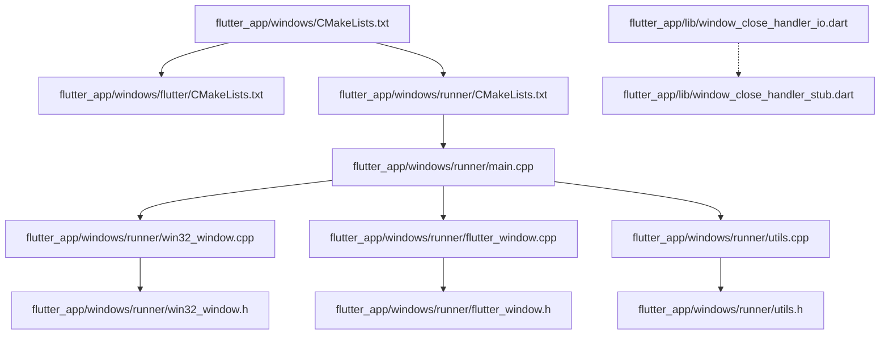
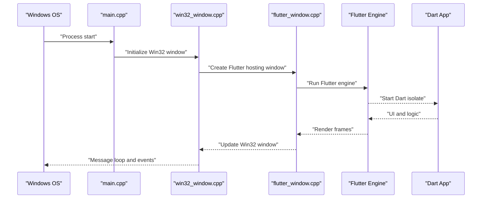
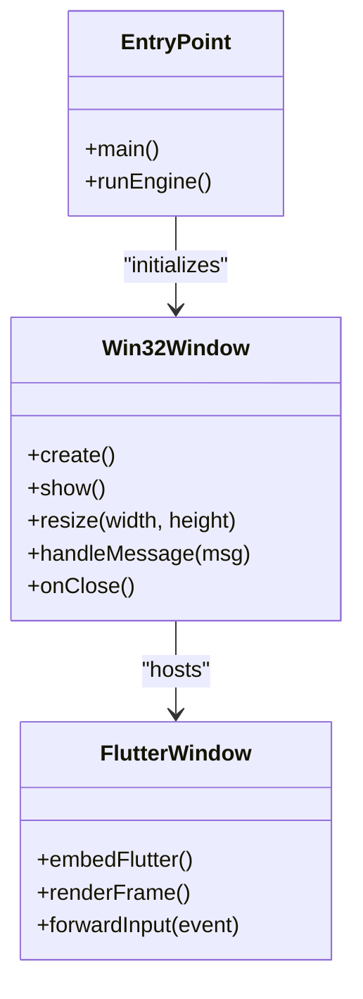
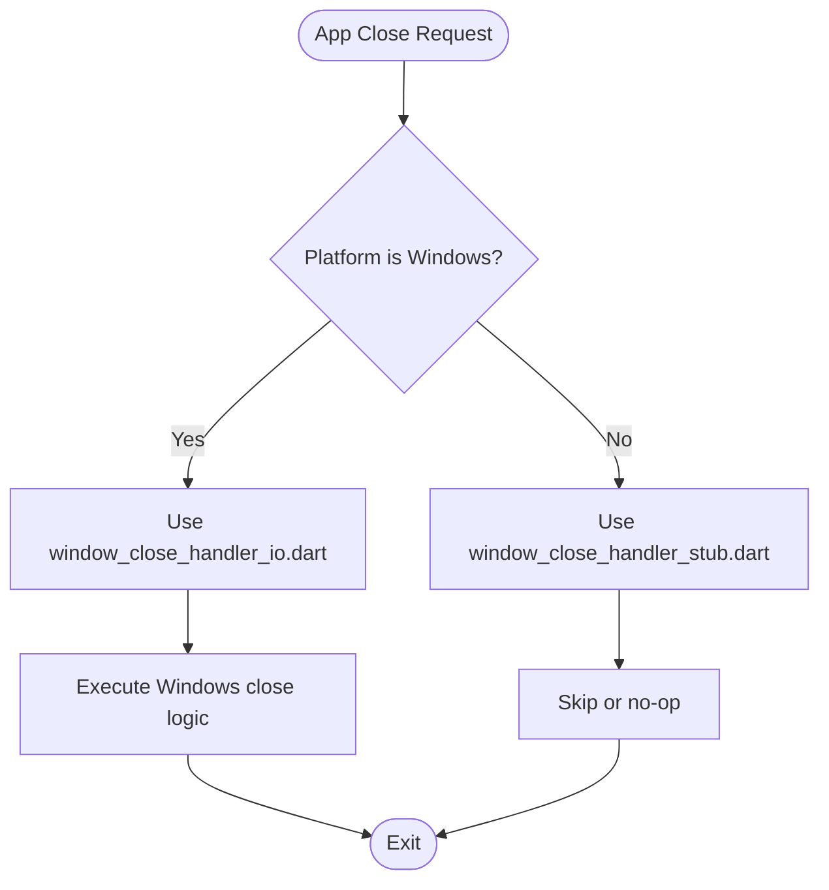
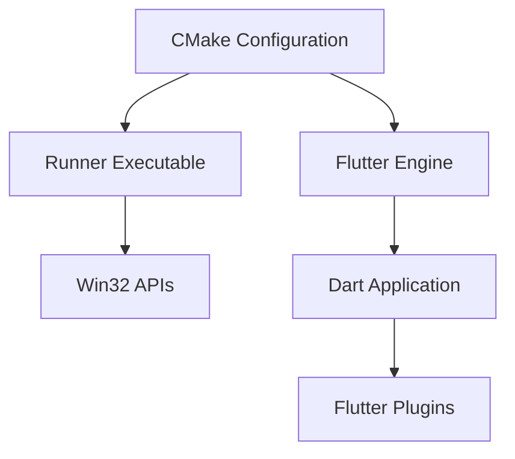

# Windows Implementation

<cite>
**Referenced Files in This Document**
- [flutter_app/windows/CMakeLists.txt](file://flutter_app/windows/CMakeLists.txt)
- [flutter_app/windows/flutter/CMakeLists.txt](file://flutter_app/windows/flutter/CMakeLists.txt)
- [flutter_app/windows/runner/CMakeLists.txt](file://flutter_app/windows/runner/CMakeLists.txt)
- [flutter_app/windows/runner/main.cpp](file://flutter_app/windows/runner/main.cpp)
- [flutter_app/windows/runner/win32_window.h](file://flutter_app/windows/runner/win32_window.h)
- [flutter_app/windows/runner/win32_window.cpp](file://flutter_app/windows/runner/win32_window.cpp)
- [flutter_app/windows/runner/flutter_window.h](file://flutter_app/windows/runner/flutter_window.h)
- [flutter_app/windows/runner/flutter_window.cpp](file://flutter_app/windows/runner/flutter_window.cpp)
- [flutter_app/windows/runner/utils.h](file://flutter_app/windows/runner/utils.h)
- [flutter_app/windows/runner/utils.cpp](file://flutter_app/windows/runner/utils.cpp)
- [flutter_app/lib/window_close_handler_io.dart](file://flutter_app/lib/window_close_handler_io.dart)
- [flutter_app/lib/window_close_handler_stub.dart](file://flutter_app/lib/window_close_handler_stub.dart)
</cite>

## Table of Contents
1. [Introduction](#introduction)
2. [Project Structure](#project-structure)
3. [Core Components](#core-components)
4. [Architecture Overview](#architecture-overview)
5. [Detailed Component Analysis](#detailed-component-analysis)
6. [Dependency Analysis](#dependency-analysis)
7. [Performance Considerations](#performance-considerations)
8. [Troubleshooting Guide](#troubleshooting-guide)
9. [Conclusion](#conclusion)
10. [Appendices](#appendices)

## Introduction
This document explains the Windows desktop implementation for Gestão Yahweh Premium. It focuses on the native Windows layer built with Flutter’s Windows embedding, CMake configuration, and build process. It also covers window management using Win32 APIs, taskbar integration, system tray usage patterns, file system access, registry interactions, deep linking/file associations, Windows-specific UI elements, keyboard shortcuts, context menus, debugging techniques, performance profiling, deployment strategies, and distribution options including Windows Store and sideloading.

## Project Structure
The Windows target is located under flutter_app/windows. The structure follows Flutter’s standard Windows runner layout:
- Top-level CMakeLists.txt configures the Windows target and includes the Flutter engine and runner subprojects.
- flutter/CMakeLists.txt sets up the Flutter engine and plugin registration for Windows.
- runner/CMakeLists.txt builds the executable and links the Flutter framework.
- runner/main.cpp initializes the Win32 application entry point and launches the Flutter engine.
- runner/win32_window.* manages the top-level Win32 window lifecycle.
- runner/flutter_window.* hosts the Flutter rendering surface within a Win32 window.
- runner/utils.* provides helper utilities for Windows-specific operations.
- Dart side includes platform-specific handlers for window behavior via conditional imports.

**Diagram sources**
- [flutter_app/windows/CMakeLists.txt](file://flutter_app/windows/CMakeLists.txt)
- [flutter_app/windows/flutter/CMakeLists.txt](file://flutter_app/windows/flutter/CMakeLists.txt)
- [flutter_app/windows/runner/CMakeLists.txt](file://flutter_app/windows/runner/CMakeLists.txt)
- [flutter_app/windows/runner/main.cpp](file://flutter_app/windows/runner/main.cpp)
- [flutter_app/windows/runner/win32_window.cpp](file://flutter_app/windows/runner/win32_window.cpp)
- [flutter_app/windows/runner/flutter_window.cpp](file://flutter_app/windows/runner/flutter_window.cpp)
- [flutter_app/windows/runner/utils.cpp](file://flutter_app/windows/runner/utils.cpp)
- [flutter_app/lib/window_close_handler_io.dart](file://flutter_app/lib/window_close_handler_io.dart)
- [flutter_app/lib/window_close_handler_stub.dart](file://flutter_app/lib/window_close_handler_stub.dart)

**Section sources**
- [flutter_app/windows/CMakeLists.txt](file://flutter_app/windows/CMakeLists.txt)
- [flutter_app/windows/flutter/CMakeLists.txt](file://flutter_app/windows/flutter/CMakeLists.txt)
- [flutter_app/windows/runner/CMakeLists.txt](file://flutter_app/windows/runner/CMakeLists.txt)
- [flutter_app/windows/runner/main.cpp](file://flutter_app/windows/runner/main.cpp)
- [flutter_app/windows/runner/win32_window.h](file://flutter_app/windows/runner/win32_window.h)
- [flutter_app/windows/runner/win32_window.cpp](file://flutter_app/windows/runner/win32_window.cpp)
- [flutter_app/windows/runner/flutter_window.h](file://flutter_app/windows/runner/flutter_window.h)
- [flutter_app/windows/runner/flutter_window.cpp](file://flutter_app/windows/runner/flutter_window.cpp)
- [flutter_app/windows/runner/utils.h](file://flutter_app/windows/runner/utils.h)
- [flutter_app/windows/runner/utils.cpp](file://flutter_app/windows/runner/utils.cpp)
- [flutter_app/lib/window_close_handler_io.dart](file://flutter_app/lib/window_close_handler_io.dart)
- [flutter_app/lib/window_close_handler_stub.dart](file://flutter_app/lib/window_close_handler_stub.dart)

## Core Components
- CMake configuration:
  - Top-level CMakeLists.txt defines the Windows target and includes Flutter and runner subdirectories.
  - flutter/CMakeLists.txt configures the Flutter engine and plugin registration pipeline.
  - runner/CMakeLists.txt compiles the executable and links required libraries.
- Entry point and window management:
  - main.cpp initializes the Win32 application and starts the Flutter engine.
  - win32_window.* encapsulates Win32 window creation, message loop handling, and lifecycle events.
  - flutter_window.* integrates the Flutter rendering surface into the Win32 window.
- Utilities:
  - utils.* provides helper functions for Windows-specific tasks such as path handling and environment checks.
- Dart-side window behavior:
  - window_close_handler_io.dart implements Windows-specific close behavior.
  - window_close_handler_stub.dart provides a stub for non-Windows platforms.

**Section sources**
- [flutter_app/windows/CMakeLists.txt](file://flutter_app/windows/CMakeLists.txt)
- [flutter_app/windows/flutter/CMakeLists.txt](file://flutter_app/windows/flutter/CMakeLists.txt)
- [flutter_app/windows/runner/CMakeLists.txt](file://flutter_app/windows/runner/CMakeLists.txt)
- [flutter_app/windows/runner/main.cpp](file://flutter_app/windows/runner/main.cpp)
- [flutter_app/windows/runner/win32_window.h](file://flutter_app/windows/runner/win32_window.h)
- [flutter_app/windows/runner/win32_window.cpp](file://flutter_app/windows/runner/win32_window.cpp)
- [flutter_app/windows/runner/flutter_window.h](file://flutter_app/windows/runner/flutter_window.h)
- [flutter_app/windows/runner/flutter_window.cpp](file://flutter_app/windows/runner/flutter_window.cpp)
- [flutter_app/windows/runner/utils.h](file://flutter_app/windows/runner/utils.h)
- [flutter_app/windows/runner/utils.cpp](file://flutter_app/windows/runner/utils.cpp)
- [flutter_app/lib/window_close_handler_io.dart](file://flutter_app/lib/window_close_handler_io.dart)
- [flutter_app/lib/window_close_handler_stub.dart](file://flutter_app/lib/window_close_handler_stub.dart)

## Architecture Overview
The Windows runtime architecture combines a native Win32 host with Flutter’s embedded engine:
- The Win32 host (main.cpp) creates an application instance and delegates window management to win32_window.
- flutter_window embeds the Flutter rendering surface inside the Win32 window.
- Dart code runs within the Flutter engine and can call into native Windows APIs through plugins or direct bindings.
- Platform-specific behaviors are selected at compile time via conditional imports (e.g., window_close_handler_io.dart vs stub).

**Diagram sources**
- [flutter_app/windows/runner/main.cpp](file://flutter_app/windows/runner/main.cpp)
- [flutter_app/windows/runner/win32_window.cpp](file://flutter_app/windows/runner/win32_window.cpp)
- [flutter_app/windows/runner/flutter_window.cpp](file://flutter_app/windows/runner/flutter_window.cpp)

## Detailed Component Analysis

### CMake Configuration and Build Process
- Top-level CMakeLists.txt:
  - Defines the Windows target and includes Flutter and runner subprojects.
  - Configures build types and output directories.
- flutter/CMakeLists.txt:
  - Sets up the Flutter engine and plugin registration for Windows.
  - Ensures generated plugin files are included.
- runner/CMakeLists.txt:
  - Compiles the executable and links the Flutter framework.
  - Includes resources and manifests if present.

Build steps:
- Configure with CMake to generate Visual Studio project files.
- Build using the configured generator (e.g., Visual Studio).
- Output executable resides in the runner directory.

**Section sources**
- [flutter_app/windows/CMakeLists.txt](file://flutter_app/windows/CMakeLists.txt)
- [flutter_app/windows/flutter/CMakeLists.txt](file://flutter_app/windows/flutter/CMakeLists.txt)
- [flutter_app/windows/runner/CMakeLists.txt](file://flutter_app/windows/runner/CMakeLists.txt)

### Window Management Using Win32 APIs
- main.cpp:
  - Initializes the Win32 application and starts the Flutter engine.
- win32_window.h/cpp:
  - Encapsulates window class registration, creation, resizing, and message handling.
  - Manages lifecycle events like minimize, maximize, and close.
- flutter_window.h/cpp:
  - Hosts the Flutter rendering surface within the Win32 window.
  - Coordinates frame updates and input forwarding.

**Diagram sources**
- [flutter_app/windows/runner/win32_window.h](file://flutter_app/windows/runner/win32_window.h)
- [flutter_app/windows/runner/win32_window.cpp](file://flutter_app/windows/runner/win32_window.cpp)
- [flutter_app/windows/runner/flutter_window.h](file://flutter_app/windows/runner/flutter_window.h)
- [flutter_app/windows/runner/flutter_window.cpp](file://flutter_app/windows/runner/flutter_window.cpp)
- [flutter_app/windows/runner/main.cpp](file://flutter_app/windows/runner/main.cpp)

**Section sources**
- [flutter_app/windows/runner/main.cpp](file://flutter_app/windows/runner/main.cpp)
- [flutter_app/windows/runner/win32_window.h](file://flutter_app/windows/runner/win32_window.h)
- [flutter_app/windows/runner/win32_window.cpp](file://flutter_app/windows/runner/win32_window.cpp)
- [flutter_app/windows/runner/flutter_window.h](file://flutter_app/windows/runner/flutter_window.h)
- [flutter_app/windows/runner/flutter_window.cpp](file://flutter_app/windows/runner/flutter_window.cpp)

### Taskbar Integration and System Tray Functionality
- Taskbar integration:
  - Use Win32 APIs to set app icon, progress state, and overlay icons.
  - Handle taskbar button messages to reflect app state changes.
- System tray:
  - Create a notification area icon with context menu actions.
  - Manage tray icon visibility and respond to user interactions.

Implementation guidance:
- Integrate tray and taskbar logic in win32_window or a dedicated service module.
- Expose Dart callbacks via method channels for UI updates triggered by tray/taskbar events.

[No sources needed since this section provides general guidance]

### File System Access Patterns
- Preferred approach:
  - Use Dart’s dart:io for cross-platform file operations where possible.
  - For Windows-specific paths, use utils.* helpers to normalize paths and handle permissions.
- Performance considerations:
  - Batch file operations and avoid blocking the UI thread.
  - Use asynchronous APIs to prevent freezing during large I/O tasks.

**Section sources**
- [flutter_app/windows/runner/utils.h](file://flutter_app/windows/runner/utils.h)
- [flutter_app/windows/runner/utils.cpp](file://flutter_app/windows/runner/utils.cpp)

### Registry Usage and Windows-Specific Features
- Registry:
  - Read/write settings via Win32 registry APIs when necessary (e.g., installation paths, preferences).
  - Ensure proper error handling and fallbacks for missing keys.
- Deep linking and file associations:
  - Register custom URI schemes and file extensions in the registry.
  - Handle incoming arguments in main.cpp to launch the app with specific contexts.

Implementation guidance:
- Centralize registry operations in utils.* or a dedicated Windows service.
- Parse command-line arguments in main.cpp to support deep links and file associations.

[No sources needed since this section provides general guidance]

### Windows-Specific UI Elements, Keyboard Shortcuts, and Context Menus
- UI elements:
  - Implement native dialogs, notifications, and context menus using Win32 APIs.
  - Integrate with Flutter UI via method channels for seamless user experience.
- Keyboard shortcuts:
  - Register global hotkeys or window-specific accelerators.
  - Map shortcuts to Dart actions through event channels.
- Context menus:
  - Provide right-click menus for tray icons and file associations.
  - Handle menu actions and update UI accordingly.

[No sources needed since this section provides general guidance]

### Dart-Side Window Behavior
- window_close_handler_io.dart:
  - Implements Windows-specific window close behavior.
- window_close_handler_stub.dart:
  - Provides a stub for non-Windows platforms.

**Diagram sources**
- [flutter_app/lib/window_close_handler_io.dart](file://flutter_app/lib/window_close_handler_io.dart)
- [flutter_app/lib/window_close_handler_stub.dart](file://flutter_app/lib/window_close_handler_stub.dart)

**Section sources**
- [flutter_app/lib/window_close_handler_io.dart](file://flutter_app/lib/window_close_handler_io.dart)
- [flutter_app/lib/window_close_handler_stub.dart](file://flutter_app/lib/window_close_handler_stub.dart)

## Dependency Analysis
The Windows target depends on:
- Flutter engine and plugin infrastructure configured via CMake.
- Win32 APIs for window management, system integration, and native features.
- Dart code running within the Flutter engine for business logic and UI.

**Diagram sources**
- [flutter_app/windows/CMakeLists.txt](file://flutter_app/windows/CMakeLists.txt)
- [flutter_app/windows/flutter/CMakeLists.txt](file://flutter_app/windows/flutter/CMakeLists.txt)
- [flutter_app/windows/runner/CMakeLists.txt](file://flutter_app/windows/runner/CMakeLists.txt)

**Section sources**
- [flutter_app/windows/CMakeLists.txt](file://flutter_app/windows/CMakeLists.txt)
- [flutter_app/windows/flutter/CMakeLists.txt](file://flutter_app/windows/flutter/CMakeLists.txt)
- [flutter_app/windows/runner/CMakeLists.txt](file://flutter_app/windows/runner/CMakeLists.txt)

## Performance Considerations
- I/O operations:
  - Use asynchronous file and network calls to keep the UI responsive.
  - Cache frequently accessed data to reduce disk and network overhead.
- Rendering:
  - Minimize unnecessary redraws in Flutter by optimizing widget trees.
  - Avoid heavy computations on the UI thread; offload to isolates.
- Memory management:
  - Monitor memory usage with Windows Task Manager and Flutter DevTools.
  - Release unused resources promptly to prevent leaks.

[No sources needed since this section provides general guidance]

## Troubleshooting Guide
- Debugging:
  - Use Visual Studio to debug the native runner and Flutter engine.
  - Attach Dart DevTools for UI and performance profiling.
- Common issues:
  - Plugin registration failures: verify generated plugin files are included.
  - Window not displaying: check Win32 window creation and message loop.
  - Deep link not working: ensure registry entries and argument parsing are correct.
- Logging:
  - Add structured logging in native and Dart layers for easier diagnosis.

[No sources needed since this section provides general guidance]

## Conclusion
The Windows implementation of Gestão Yahweh Premium leverages Flutter’s embedded engine with a native Win32 host. CMake configurations orchestrate the build process, while Win32 APIs manage window lifecycle and system integration. Dart code provides the application logic and UI, with platform-specific behaviors handled via conditional imports. Following the guidelines in this document ensures robust development, debugging, and deployment of the Windows desktop application.

[No sources needed since this section summarizes without analyzing specific files]

## Appendices
- Deployment strategies:
  - Package the executable with dependencies for sideloading.
  - Sign the application for enhanced security and trust.
- Windows Store distribution:
  - Prepare MSIX packaging and submit to the Microsoft Store.
  - Follow Store guidelines for app metadata and privacy policies.

[No sources needed since this section provides general guidance]