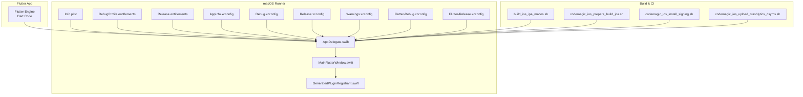
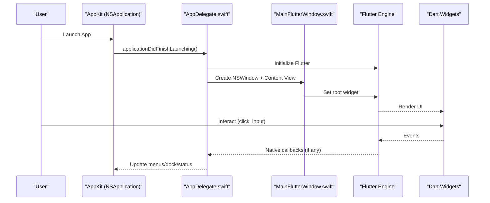
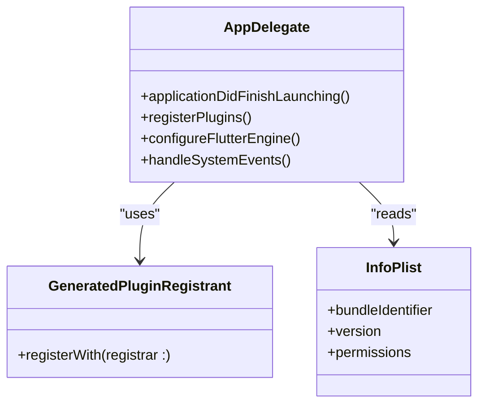
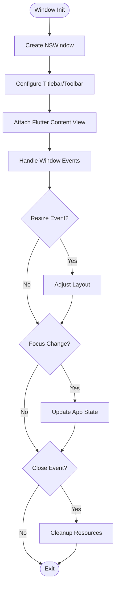
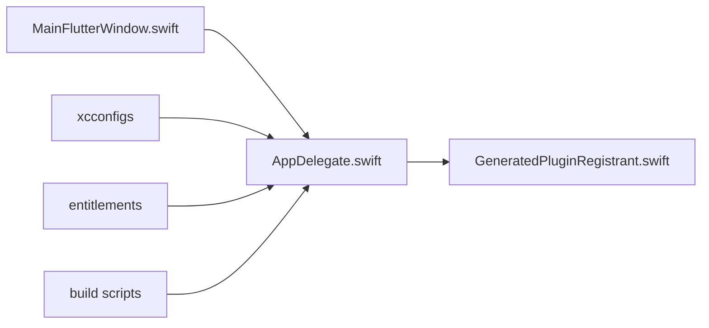

# macOS Implementation

<cite>
**Referenced Files in This Document**
- [README.md](file://flutter_app/README.md)
- [pubspec.yaml](file://flutter_app/pubspec.yaml)
- [macos_main.dart](file://flutter_app/lib/main.dart)
- [MainFlutterWindow.swift](file://flutter_app/macos/Runner/MainFlutterWindow.swift)
- [AppDelegate.swift](file://flutter_app/macos/Runner/AppDelegate.swift)
- [Info.plist](file://flutter_app/macos/Runner/Info.plist)
- [MainMenu.xib](file://flutter_app/macos/Runner/Base.lproj/MainMenu.xib)
- [DebugProfile.entitlements](file://flutter_app/macos/Runner/DebugProfile.entitlements)
- [Release.entitlements](file://flutter_app/macos/Runner/Release.entitlements)
- [AppInfo.xcconfig](file://flutter_app/macos/Runner/Configs/AppInfo.xcconfig)
- [Debug.xcconfig](file://flutter_app/macos/Runner/Configs/Debug.xcconfig)
- [Release.xcconfig](file://flutter_app/macos/Runner/Configs/Release.xcconfig)
- [Warnings.xcconfig](file://flutter_app/macos/Runner/Configs/Warnings.xcconfig)
- [GeneratedPluginRegistrant.swift](file://flutter_app/macos/Flutter/GeneratedPluginRegistrant.swift)
- [Flutter-Debug.xcconfig](file://flutter_app/macos/Flutter/Flutter-Debug.xcconfig)
- [Flutter-Release.xcconfig](file://flutter_app/macos/Flutter/Flutter-Release.xcconfig)
- [build_ios_ipa_macos.sh](file://scripts/build_ios_ipa_macos.sh)
- [codemagic_ios_prepare_build_ipa.sh](file://scripts/codemagic_ios_prepare_build_ipa.sh)
- [codemagic_ios_install_signing.sh](file://scripts/codemagic_ios_install_signing.sh)
- [codemagic_ios_upload_crashlytics_dsyms.sh](file://scripts/codemagic_ios_upload_crashlytics_dsyms.sh)
</cite>

## Table of Contents
1. [Introduction](#introduction)
2. [Project Structure](#project-structure)
3. [Core Components](#core-components)
4. [Architecture Overview](#architecture-overview)
5. [Detailed Component Analysis](#detailed-component-analysis)
6. [Dependency Analysis](#dependency-analysis)
7. [Performance Considerations](#performance-considerations)
8. [Troubleshooting Guide](#troubleshooting-guide)
9. [Conclusion](#conclusion)
10. [Appendices](#appendices)

## Introduction
This document describes the macOS desktop implementation for Gestão Yahweh Premium. The app is built with Flutter and uses the native macOS runner to integrate with AppKit, Cocoa frameworks, and macOS-specific capabilities such as sandboxing, entitlements, code signing, notarization, and App Store submission. It also covers window management, menu bar integration, dock interactions, keyboard shortcuts, accessibility features, debugging with Xcode Instruments, memory profiling, and performance optimization strategies tailored for macOS applications.

## Project Structure
The macOS implementation resides under flutter_app/macos and integrates with the Flutter engine via a Swift-based native runner. Key elements include:
- Runner project (Xcode workspace) containing AppDelegate, MainFlutterWindow, Info.plist, and configuration files.
- Flutter configuration xcconfigs for Debug/Release builds.
- Entitlements for sandboxing and feature access.
- Generated plugin registrant bridging Flutter plugins to native code.
- Build scripts for packaging and signing artifacts.

**Diagram sources**
- [AppDelegate.swift](file://flutter_app/macos/Runner/AppDelegate.swift)
- [MainFlutterWindow.swift](file://flutter_app/macos/Runner/MainFlutterWindow.swift)
- [Info.plist](file://flutter_app/macos/Runner/Info.plist)
- [DebugProfile.entitlements](file://flutter_app/macos/Runner/DebugProfile.entitlements)
- [Release.entitlements](file://flutter_app/macos/Runner/Release.entitlements)
- [AppInfo.xcconfig](file://flutter_app/macos/Runner/Configs/AppInfo.xcconfig)
- [Debug.xcconfig](file://flutter_app/macos/Runner/Configs/Debug.xcconfig)
- [Release.xcconfig](file://flutter_app/macos/Runner/Configs/Release.xcconfig)
- [Warnings.xcconfig](file://flutter_app/macos/Runner/Configs/Warnings.xcconfig)
- [GeneratedPluginRegistrant.swift](file://flutter_app/macos/Flutter/GeneratedPluginRegistrant.swift)
- [Flutter-Debug.xcconfig](file://flutter_app/macos/Flutter/Flutter-Debug.xcconfig)
- [Flutter-Release.xcconfig](file://flutter_app/macos/Flutter/Flutter-Release.xcconfig)
- [build_ios_ipa_macos.sh](file://scripts/build_ios_ipa_macos.sh)
- [codemagic_ios_prepare_build_ipa.sh](file://scripts/codemagic_ios_prepare_build_ipa.sh)
- [codemagic_ios_install_signing.sh](file://scripts/codemagic_ios_install_signing.sh)
- [codemagic_ios_upload_crashlytics_dsyms.sh](file://scripts/codemagic_ios_upload_crashlytics_dsyms.sh)

**Section sources**
- [README.md](file://flutter_app/README.md)
- [pubspec.yaml](file://flutter_app/pubspec.yaml)

## Core Components
- AppDelegate: Initializes the Flutter engine, configures platform integrations, and bridges native macOS services.
- MainFlutterWindow: Manages the primary NSWindow lifecycle, content view hosting, and window-level behaviors.
- Info.plist: Declares app metadata, permissions, and required keys for macOS runtime behavior.
- Entitlements: Define sandbox restrictions and allowed capabilities (e.g., file access, networking).
- xcconfig files: Centralize build settings, versioning, and compiler warnings across configurations.
- GeneratedPluginRegistrant: Automatically registers Flutter plugins at startup, enabling native functionality.

Key responsibilities:
- Window management: creation, sizing, full-screen transitions, and event handling.
- Menu bar integration: adding standard and custom menus, accelerators, and actions.
- Dock interactions: badge updates, item count, and application state indicators.
- Accessibility: exposing UI elements to VoiceOver and system accessibility APIs.
- Keyboard shortcuts: global and local hotkeys mapped to app actions.

**Section sources**
- [AppDelegate.swift](file://flutter_app/macos/Runner/AppDelegate.swift)
- [MainFlutterWindow.swift](file://flutter_app/macos/Runner/MainFlutterWindow.swift)
- [Info.plist](file://flutter_app/macos/Runner/Info.plist)
- [DebugProfile.entitlements](file://flutter_app/macos/Runner/DebugProfile.entitlements)
- [Release.entitlements](file://flutter_app/macos/Runner/Release.entitlements)
- [AppInfo.xcconfig](file://flutter_app/macos/Runner/Configs/AppInfo.xcconfig)
- [Debug.xcconfig](file://flutter_app/macos/Runner/Configs/Debug.xcconfig)
- [Release.xcconfig](file://flutter_app/macos/Runner/Configs/Release.xcconfig)
- [Warnings.xcconfig](file://flutter_app/macos/Runner/Configs/Warnings.xcconfig)
- [GeneratedPluginRegistrant.swift](file://flutter_app/macos/Flutter/GeneratedPluginRegistrant.swift)

## Architecture Overview
The macOS architecture follows a layered approach:
- Dart layer: Business logic, UI rendering via Flutter widgets, and cross-platform features.
- Native bridge: Swift-based AppDelegate and MainFlutterWindow connect Dart to AppKit/Cocoa.
- Platform services: File system, notifications, keychain, and other macOS subsystems accessed through plugins or direct calls.
- Build pipeline: xcconfigs define environment-specific settings; scripts handle signing, packaging, and distribution.

**Diagram sources**
- [AppDelegate.swift](file://flutter_app/macos/Runner/AppDelegate.swift)
- [MainFlutterWindow.swift](file://flutter_app/macos/Runner/MainFlutterWindow.swift)

## Detailed Component Analysis

### AppDelegate Analysis
Responsibilities:
- Bootstrap Flutter engine and configure platform channels.
- Register plugins via GeneratedPluginRegistrant.
- Integrate macOS services (notifications, keychain, file picker).
- Handle lifecycle events (foreground/background, quit).

Integration points:
- Cocoa frameworks: Foundation, AppKit, Security (keychain), UniformTypeIdentifiers.
- Plugin registry: automatic registration of Flutter plugins.
- Configuration: reads from Info.plist and xcconfigs.

**Diagram sources**
- [AppDelegate.swift](file://flutter_app/macos/Runner/AppDelegate.swift)
- [GeneratedPluginRegistrant.swift](file://flutter_app/macos/Flutter/GeneratedPluginRegistrant.swift)
- [Info.plist](file://flutter_app/macos/Runner/Info.plist)

**Section sources**
- [AppDelegate.swift](file://flutter_app/macos/Runner/AppDelegate.swift)
- [GeneratedPluginRegistrant.swift](file://flutter_app/macos/Flutter/GeneratedPluginRegistrant.swift)
- [Info.plist](file://flutter_app/macos/Runner/Info.plist)

### MainFlutterWindow Analysis
Responsibilities:
- Manage NSWindow lifecycle and content view.
- Configure window properties (titlebar, toolbar, full screen).
- Handle window events (close, resize, focus).
- Bridge to Flutter’s rendering surface.

Integration points:
- AppKit: NSWindow, NSView, NSMenu, NSStatusBar.
- Accessibility: AXUIElement integration for VoiceOver.
- Keyboard: NSEvent handling for shortcuts and global hotkeys.

**Diagram sources**
- [MainFlutterWindow.swift](file://flutter_app/macos/Runner/MainFlutterWindow.swift)

**Section sources**
- [MainFlutterWindow.swift](file://flutter_app/macos/Runner/MainFlutterWindow.swift)

### Menu Bar Integration
Features:
- Standard menus (File, Edit, View, Help).
- Custom menus for app-specific actions.
- Keyboard shortcuts mapped to menu items.
- Dynamic menu updates based on app state.

Implementation patterns:
- Use NSMenu and NSMenuItem for static/dynamic menus.
- Bind actions to methods in AppDelegate or controllers.
- Support internationalization for menu labels.

Accessibility:
- Ensure menu items are accessible via VoiceOver.
- Provide descriptive titles and roles.

**Section sources**
- [MainMenu.xib](file://flutter_app/macos/Runner/Base.lproj/MainMenu.xib)
- [AppDelegate.swift](file://flutter_app/macos/Runner/AppDelegate.swift)

### Dock Interactions
Capabilities:
- Badge updates for notifications or unread counts.
- Progress indicators during long operations.
- Application state reflection (active/inactive).

Implementation:
- Use NSDockTile for badges and progress.
- Update tile content asynchronously to avoid blocking UI.

**Section sources**
- [AppDelegate.swift](file://flutter_app/macos/Runner/AppDelegate.swift)

### Keyboard Shortcuts
Patterns:
- Local shortcuts within windows using NSEvent.
- Global hotkeys via NSHotKey or third-party libraries.
- Mapping shortcuts to actions in AppDelegate or controllers.

Best practices:
- Avoid conflicts with system shortcuts.
- Provide user customization options where possible.

**Section sources**
- [MainFlutterWindow.swift](file://flutter_app/macos/Runner/MainFlutterWindow.swift)
- [AppDelegate.swift](file://flutter_app/macos/Runner/AppDelegate.swift)

### Accessibility Features
Support:
- VoiceOver compatibility for all UI elements.
- Semantic roles and labels for widgets.
- Keyboard navigation support.

Implementation:
- Use AXUIElement for custom accessibility attributes.
- Test with VoiceOver and Accessibility Inspector.

**Section sources**
- [MainFlutterWindow.swift](file://flutter_app/macos/Runner/MainFlutterWindow.swift)
- [AppDelegate.swift](file://flutter_app/macos/Runner/AppDelegate.swift)

### Sandboxing and Entitlements
Sandboxing:
- Restricts file system, network, and hardware access.
- Requires explicit entitlements for privileged operations.

Entitlements:
- DebugProfile.entitlements for development features.
- Release.entitlements for production constraints.

Common entitlements:
- com.apple.security.files.user-selected.read-write
- com.apple.security.network.client
- com.apple.security.application-groups

**Section sources**
- [DebugProfile.entitlements](file://flutter_app/macos/Runner/DebugProfile.entitlements)
- [Release.entitlements](file://flutter_app/macos/Runner/Release.entitlements)

### Code Signing and Notarization
Process:
- Sign binaries with developer certificates.
- Package app into .app bundle.
- Notarize with Apple for Gatekeeper approval.

Tools:
- codesign for signing.
- altool or xcrun notarytool for notarization.
- stapler for attaching receipts.

**Section sources**
- [build_ios_ipa_macos.sh](file://scripts/build_ios_ipa_macos.sh)
- [codemagic_ios_prepare_build_ipa.sh](file://scripts/codemagic_ios_prepare_build_ipa.sh)
- [codemagic_ios_install_signing.sh](file://scripts/codemagic_ios_install_signing.sh)

### App Store Submission
Steps:
- Prepare app with correct metadata and icons.
- Upload via Transporter or Application Loader.
- Review process by Apple.

Automation:
- Use Fastlane or Codemagic for streamlined submission.
- Validate binary before upload.

**Section sources**
- [build_ios_ipa_macos.sh](file://scripts/build_ios_ipa_macos.sh)
- [codemagic_ios_prepare_build_ipa.sh](file://scripts/codemagic_ios_prepare_build_ipa.sh)

## Dependency Analysis
Dependencies between components:
- AppDelegate depends on GeneratedPluginRegistrant for plugin initialization.
- MainFlutterWindow relies on AppKit for window management.
- Build scripts depend on xcconfigs for consistent settings.

Potential issues:
- Circular dependencies between plugins and native code.
- Misconfigured entitlements causing runtime failures.

**Diagram sources**
- [AppDelegate.swift](file://flutter_app/macos/Runner/AppDelegate.swift)
- [GeneratedPluginRegistrant.swift](file://flutter_app/macos/Flutter/GeneratedPluginRegistrant.swift)
- [MainFlutterWindow.swift](file://flutter_app/macos/Runner/MainFlutterWindow.swift)
- [AppInfo.xcconfig](file://flutter_app/macos/Runner/Configs/AppInfo.xcconfig)
- [Debug.xcconfig](file://flutter_app/macos/Runner/Configs/Debug.xcconfig)
- [Release.xcconfig](file://flutter_app/macos/Runner/Configs/Release.xcconfig)
- [Warnings.xcconfig](file://flutter_app/macos/Runner/Configs/Warnings.xcconfig)
- [DebugProfile.entitlements](file://flutter_app/macos/Runner/DebugProfile.entitlements)
- [Release.entitlements](file://flutter_app/macos/Runner/Release.entitlements)
- [build_ios_ipa_macos.sh](file://scripts/build_ios_ipa_macos.sh)

**Section sources**
- [AppDelegate.swift](file://flutter_app/macos/Runner/AppDelegate.swift)
- [GeneratedPluginRegistrant.swift](file://flutter_app/macos/Flutter/GeneratedPluginRegistrant.swift)
- [MainFlutterWindow.swift](file://flutter_app/macos/Runner/MainFlutterWindow.swift)
- [AppInfo.xcconfig](file://flutter_app/macos/Runner/Configs/AppInfo.xcconfig)
- [Debug.xcconfig](file://flutter_app/macos/Runner/Configs/Debug.xcconfig)
- [Release.xcconfig](file://flutter_app/macos/Runner/Configs/Release.xcconfig)
- [Warnings.xcconfig](file://flutter_app/macos/Runner/Configs/Warnings.xcconfig)
- [DebugProfile.entitlements](file://flutter_app/macos/Runner/DebugProfile.entitlements)
- [Release.entitlements](file://flutter_app/macos/Runner/Release.entitlements)
- [build_ios_ipa_macos.sh](file://scripts/build_ios_ipa_macos.sh)

## Performance Considerations
Optimization strategies:
- Profile with Xcode Instruments (Time Profiler, Allocations, Leaks).
- Minimize main thread work; offload heavy tasks to background queues.
- Optimize image loading and caching.
- Reduce memory allocations in hot paths.

Monitoring:
- Enable verbose logging in debug builds.
- Use Activity Monitor to track CPU and memory usage.

Best practices:
- Avoid blocking UI operations.
- Use lazy loading for large datasets.
- Implement efficient data structures and algorithms.

[No sources needed since this section provides general guidance]

## Troubleshooting Guide
Common issues:
- Sandbox violations: Check entitlements and file access permissions.
- Signing errors: Verify certificate validity and provisioning profiles.
- Plugin crashes: Ensure proper registration and compatibility.

Debugging tools:
- Xcode Debugger for breakpoints and variable inspection.
- Console.app for system logs and crash reports.
- Instruments for performance analysis.

Resolution steps:
- Review error logs in Console.app.
- Validate entitlements against required capabilities.
- Rebuild with clean derived data.

**Section sources**
- [DebugProfile.entitlements](file://flutter_app/macos/Runner/DebugProfile.entitlements)
- [Release.entitlements](file://flutter_app/macos/Runner/Release.entitlements)
- [AppDelegate.swift](file://flutter_app/macos/Runner/AppDelegate.swift)

## Conclusion
The macOS implementation of Gestão Yahweh Premium leverages Flutter’s cross-platform capabilities while integrating deeply with AppKit and Cocoa frameworks. Proper configuration of entitlements, code signing, and sandboxing ensures secure and compliant operation. Effective use of Xcode Instruments and performance profiling techniques helps maintain optimal user experience. Adhering to best practices for window management, menu integration, and accessibility enhances usability and compliance with macOS standards.

[No sources needed since this section summarizes without analyzing specific files]

## Appendices
Additional resources:
- Apple Developer Documentation for AppKit and Cocoa.
- Flutter macOS integration guide.
- Xcode Instruments user guide.

[No sources needed since this section lists external resources]