# Budget Planning

<cite>
**Referenced Files in This Document**
- [README.md](file://README.md)
- [ANALISE_CUSTO_LUCRO_IGREJA_100.md](file://ANALISE_CUSTO_LUCRO_IGREJA_100.md)
- [FIREBASE_DATABASES.md](file://flutter_app/FIREBASE_DATABASES.md)
- [MIDIA_PADRAO_ECOFIRE.md](file://flutter_app/MIDIA_PADRAO_ECOFIRE.md)
- [firebase.json](file://firebase.json)
- [firestore.rules](file://firestore.rules)
- [functions/index.js](file://functions/index.js)
- [functions/panelFinanceSummary.js](file://functions/panelFinanceSummary.js)
- [functions/financeVencimentoReminders.js](file://functions/financeVencimentoReminders.js)
- [functions/reportsSnapshot.js](file://functions/reportsSnapshot.js)
- [lib/main.dart](file://flutter_app/lib/main.dart)
- [lib/features/finance/finance_module.dart](file://flutter_app/lib/features/finance/finance_module.dart)
- [lib/models/transaction_model.dart](file://flutter_app/lib/models/transaction_model.dart)
- [lib/models/budget_model.dart](file://flutter_app/lib/models/budget_model.dart)
- [lib/services/budget_service.dart](file://flutter_app/lib/services/budget_service.dart)
- [lib/services/transaction_service.dart](file://flutter_app/lib/services/transaction_service.dart)
- [lib/repositories/budget_repository.dart](file://flutter_app/lib/repositories/budget_repository.dart)
- [lib/repositories/transaction_repository.dart](file://flutter_app/lib/repositories/transaction_repository.dart)
- [lib/pages/budget_dashboard_page.dart](file://flutter_app/lib/pages/budget_dashboard_page.dart)
- [lib/pages/budget_create_page.dart](file://flutter_app/lib/pages/budget_create_page.dart)
- [lib/pages/budget_adjustment_page.dart](file://flutter_app/lib/pages/budget_adjustment_page.dart)
- [lib/ui/budget_widgets.dart](file://flutter_app/lib/ui/budget_widgets.dart)
- [lib/utils/budget_alerts.dart](file://flutter_app/lib/utils/budget_alerts.dart)
- [lib/utils/budget_forecasting.dart](file://flutter_app/lib/utils/budget_forecasting.dart)
- [lib/shared/app_theme.dart](file://flutter_app/lib/shared/app_theme.dart)
</cite>

## Table of Contents
1. [Introduction](#introduction)
2. [Project Structure](#project-structure)
3. [Core Components](#core-components)
4. [Architecture Overview](#architecture-overview)
5. [Detailed Component Analysis](#detailed-component-analysis)
6. [Dependency Analysis](#dependency-analysis)
7. [Performance Considerations](#performance-considerations)
8. [Troubleshooting Guide](#troubleshooting-guide)
9. [Conclusion](#conclusion)
10. [Appendices](#appendices)

## Introduction
This document provides comprehensive budget planning documentation for the Gestão Yahweh Premium application. It explains how budgets are created, allocated by category, and managed with spending limits. It also covers budget tracking, variance analysis, alert systems for overspending, relationships between budgets and transactions, real-time monitoring, forecasting capabilities, departmental budget creation, thresholds, reporting, adjustments, approval workflows, multi-department management, and integration with financial reporting systems.

The goal is to make budgeting accessible to both technical and non-technical users while providing precise implementation references within the codebase.

## Project Structure
The Flutter app organizes finance-related features under a dedicated module, with models, services, repositories, pages, and utilities that implement budgeting logic. Backend processing is handled via Firebase Cloud Functions for summaries, reminders, and reports. Firestore rules enforce security and data integrity.

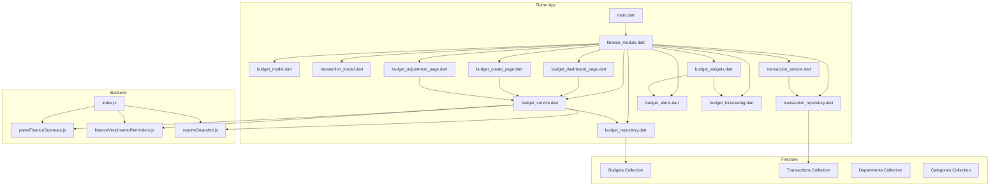

**Diagram sources**
- [lib/main.dart](file://flutter_app/lib/main.dart)
- [lib/features/finance/finance_module.dart](file://flutter_app/lib/features/finance/finance_module.dart)
- [lib/models/budget_model.dart](file://flutter_app/lib/models/budget_model.dart)
- [lib/models/transaction_model.dart](file://flutter_app/lib/models/transaction_model.dart)
- [lib/services/budget_service.dart](file://flutter_app/lib/services/budget_service.dart)
- [lib/services/transaction_service.dart](file://flutter_app/lib/services/transaction_service.dart)
- [lib/repositories/budget_repository.dart](file://flutter_app/lib/repositories/budget_repository.dart)
- [lib/repositories/transaction_repository.dart](file://flutter_app/lib/repositories/transaction_repository.dart)
- [lib/pages/budget_dashboard_page.dart](file://flutter_app/lib/pages/budget_dashboard_page.dart)
- [lib/pages/budget_create_page.dart](file://flutter_app/lib/pages/budget_create_page.dart)
- [lib/pages/budget_adjustment_page.dart](file://flutter_app/lib/pages/budget_adjustment_page.dart)
- [lib/ui/budget_widgets.dart](file://flutter_app/lib/ui/budget_widgets.dart)
- [lib/utils/budget_alerts.dart](file://flutter_app/lib/utils/budget_alerts.dart)
- [lib/utils/budget_forecasting.dart](file://flutter_app/lib/utils/budget_forecasting.dart)
- [functions/index.js](file://functions/index.js)
- [functions/panelFinanceSummary.js](file://functions/panelFinanceSummary.js)
- [functions/financeVencimentoReminders.js](file://functions/financeVencimentoReminders.js)
- [functions/reportsSnapshot.js](file://functions/reportsSnapshot.js)

**Section sources**
- [README.md](file://README.md)
- [FIREBASE_DATABASES.md](file://flutter_app/FIREBASE_DATABASES.md)
- [firebase.json](file://firebase.json)
- [firestore.rules](file://firestore.rules)

## Core Components
- Budget Model: Defines budget entities including department, category, period, limits, approvals, and status.
- Transaction Model: Represents individual financial transactions linked to budgets and categories.
- Budget Service: Orchestrates budget lifecycle operations (create, update, adjust, approve), variance calculations, and alerts.
- Transaction Service: Manages transaction recording, categorization, and linkage to budgets.
- Repositories: Provide data access abstractions for Firestore collections (budgets, transactions).
- Pages: UI entry points for dashboard, creation, and adjustment workflows.
- Utilities: Alert system for overspending thresholds; forecasting engine for projections.
- Backend Functions: Summarize finances, schedule reminders, and generate snapshots for reporting.

Key responsibilities:
- Category-based allocation ensures each budget line item maps to a specific expense category.
- Spending limits define thresholds per category or department.
- Real-time monitoring uses Firestore listeners to reflect changes instantly.
- Variance analysis compares actual spend vs. planned budget.
- Alerts notify when thresholds are breached.
- Forecasting projects future spend based on historical patterns.

**Section sources**
- [lib/models/budget_model.dart](file://flutter_app/lib/models/budget_model.dart)
- [lib/models/transaction_model.dart](file://flutter_app/lib/models/transaction_model.dart)
- [lib/services/budget_service.dart](file://flutter_app/lib/services/budget_service.dart)
- [lib/services/transaction_service.dart](file://flutter_app/lib/services/transaction_service.dart)
- [lib/repositories/budget_repository.dart](file://flutter_app/lib/repositories/budget_repository.dart)
- [lib/repositories/transaction_repository.dart](file://flutter_app/lib/repositories/transaction_repository.dart)
- [lib/pages/budget_dashboard_page.dart](file://flutter_app/lib/pages/budget_dashboard_page.dart)
- [lib/pages/budget_create_page.dart](file://flutter_app/lib/pages/budget_create_page.dart)
- [lib/pages/budget_adjustment_page.dart](file://flutter_app/lib/pages/budget_adjustment_page.dart)
- [lib/utils/budget_alerts.dart](file://flutter_app/lib/utils/budget_alerts.dart)
- [lib/utils/budget_forecasting.dart](file://flutter_app/lib/utils/budget_forecasting.dart)
- [functions/panelFinanceSummary.js](file://functions/panelFinanceSummary.js)
- [functions/financeVencimentoReminders.js](file://functions/financeVencimentoReminders.js)
- [functions/reportsSnapshot.js](file://functions/reportsSnapshot.js)

## Architecture Overview
The budgeting architecture follows a layered approach:
- Presentation Layer: Flutter pages and widgets render dashboards, forms, and alerts.
- Business Logic Layer: Services handle workflows, validations, variance calculations, and forecasting.
- Data Access Layer: Repositories abstract Firestore interactions.
- Backend Layer: Cloud Functions provide summaries, reminders, and report snapshots.
- Security Layer: Firestore rules enforce tenant isolation and role-based access.

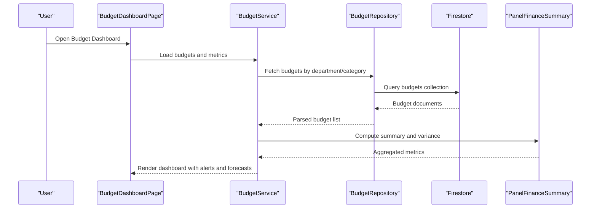

**Diagram sources**
- [lib/pages/budget_dashboard_page.dart](file://flutter_app/lib/pages/budget_dashboard_page.dart)
- [lib/services/budget_service.dart](file://flutter_app/lib/services/budget_service.dart)
- [lib/repositories/budget_repository.dart](file://flutter_app/lib/repositories/budget_repository.dart)
- [functions/panelFinanceSummary.js](file://functions/panelFinanceSummary.js)

## Detailed Component Analysis

### Budget Creation Process
Budget creation involves selecting a department, defining categories, setting limits, and optionally requiring approval. The workflow includes validation, persistence, and initial alert configuration.

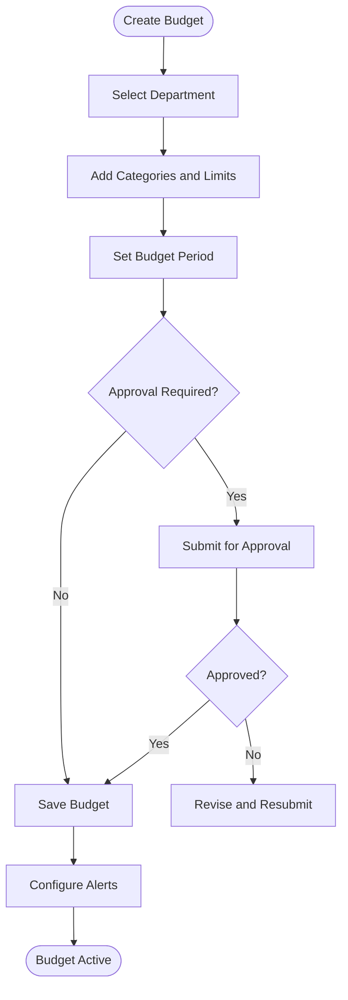

**Diagram sources**
- [lib/pages/budget_create_page.dart](file://flutter_app/lib/pages/budget_create_page.dart)
- [lib/services/budget_service.dart](file://flutter_app/lib/services/budget_service.dart)
- [lib/repositories/budget_repository.dart](file://flutter_app/lib/repositories/budget_repository.dart)

**Section sources**
- [lib/pages/budget_create_page.dart](file://flutter_app/lib/pages/budget_create_page.dart)
- [lib/services/budget_service.dart](file://flutter_app/lib/services/budget_service.dart)
- [lib/repositories/budget_repository.dart](file://flutter_app/lib/repositories/budget_repository.dart)

### Category-Based Allocation
Each budget line item is tied to a category, enabling granular control and reporting. Categories can be predefined or custom-defined per department.

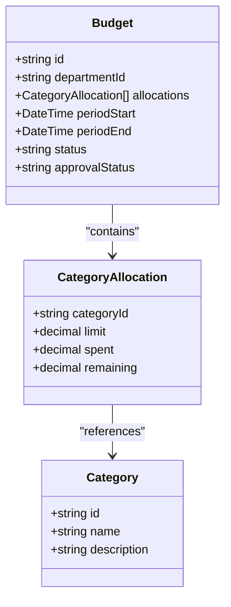

**Diagram sources**
- [lib/models/budget_model.dart](file://flutter_app/lib/models/budget_model.dart)

**Section sources**
- [lib/models/budget_model.dart](file://flutter_app/lib/models/budget_model.dart)

### Spending Limits Management
Spending limits are enforced at category and department levels. Alerts trigger when thresholds are approached or exceeded. Adjustments require approval workflows.

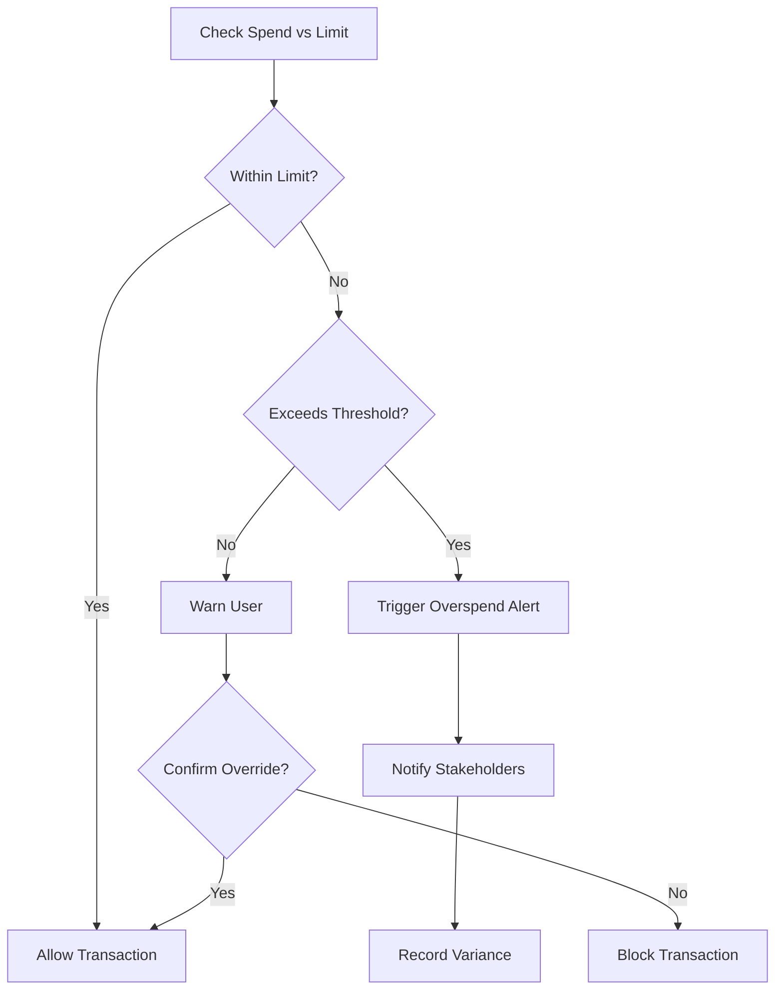

**Diagram sources**
- [lib/utils/budget_alerts.dart](file://flutter_app/lib/utils/budget_alerts.dart)
- [lib/services/budget_service.dart](file://flutter_app/lib/services/budget_service.dart)

**Section sources**
- [lib/utils/budget_alerts.dart](file://flutter_app/lib/utils/budget_alerts.dart)
- [lib/services/budget_service.dart](file://flutter_app/lib/services/budget_service.dart)

### Budget Tracking and Variance Analysis
Budget tracking monitors actual spend against planned amounts. Variance analysis calculates differences and highlights deviations.

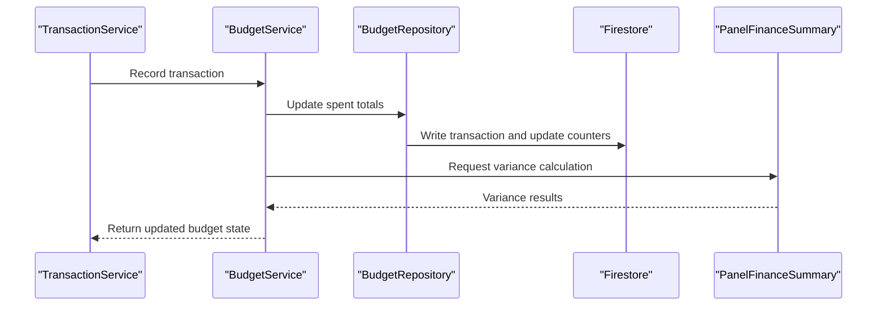

**Diagram sources**
- [lib/services/transaction_service.dart](file://flutter_app/lib/services/transaction_service.dart)
- [lib/services/budget_service.dart](file://flutter_app/lib/services/budget_service.dart)
- [lib/repositories/budget_repository.dart](file://flutter_app/lib/repositories/budget_repository.dart)
- [functions/panelFinanceSummary.js](file://functions/panelFinanceSummary.js)

**Section sources**
- [lib/services/transaction_service.dart](file://flutter_app/lib/services/transaction_service.dart)
- [lib/services/budget_service.dart](file://flutter_app/lib/services/budget_service.dart)
- [lib/repositories/budget_repository.dart](file://flutter_app/lib/repositories/budget_repository.dart)
- [functions/panelFinanceSummary.js](file://functions/panelFinanceSummary.js)

### Real-Time Budget Monitoring
Real-time updates are achieved through Firestore listeners that refresh UI components as budgets and transactions change.

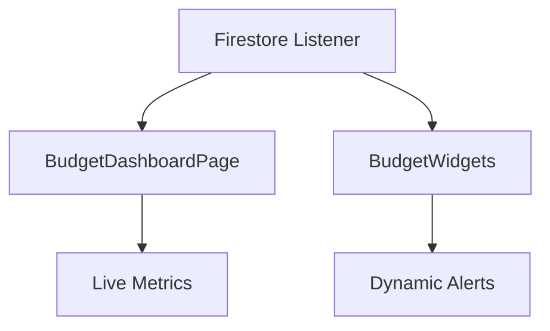

**Diagram sources**
- [lib/pages/budget_dashboard_page.dart](file://flutter_app/lib/pages/budget_dashboard_page.dart)
- [lib/ui/budget_widgets.dart](file://flutter_app/lib/ui/budget_widgets.dart)

**Section sources**
- [lib/pages/budget_dashboard_page.dart](file://flutter_app/lib/pages/budget_dashboard_page.dart)
- [lib/ui/budget_widgets.dart](file://flutter_app/lib/ui/budget_widgets.dart)

### Forecasting Capabilities
Forecasting uses historical transaction data to project future spending trends and potential overruns.

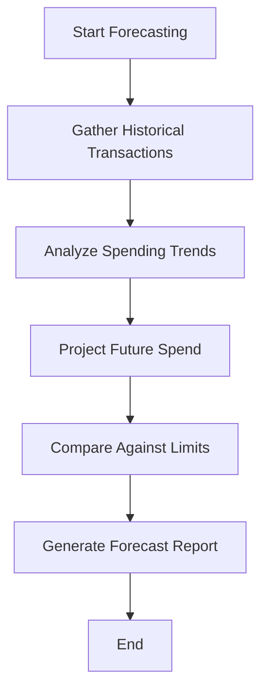

**Diagram sources**
- [lib/utils/budget_forecasting.dart](file://flutter_app/lib/utils/budget_forecasting.dart)
- [lib/services/budget_service.dart](file://flutter_app/lib/services/budget_service.dart)

**Section sources**
- [lib/utils/budget_forecasting.dart](file://flutter_app/lib/utils/budget_forecasting.dart)
- [lib/services/budget_service.dart](file://flutter_app/lib/services/budget_service.dart)

### Relationship Between Budgets and Transactions
Transactions are linked to budgets via category and department identifiers, ensuring accurate allocation and tracking.

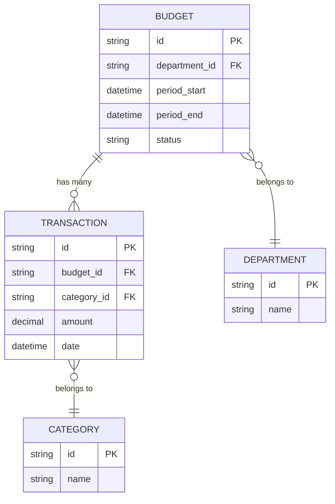

**Diagram sources**
- [lib/models/budget_model.dart](file://flutter_app/lib/models/budget_model.dart)
- [lib/models/transaction_model.dart](file://flutter_app/lib/models/transaction_model.dart)

**Section sources**
- [lib/models/budget_model.dart](file://flutter_app/lib/models/budget_model.dart)
- [lib/models/transaction_model.dart](file://flutter_app/lib/models/transaction_model.dart)

### Examples: Departmental Budgets, Thresholds, Reports, Adjustments
- Creating a departmental budget: Select department, add categories, set limits, configure approval.
- Setting spending thresholds: Define percentage-based alerts per category.
- Generating budget reports: Use summary functions to produce variance and trend reports.
- Handling budget adjustments: Submit adjustment requests, get approvals, update limits.

**Section sources**
- [lib/pages/budget_create_page.dart](file://flutter_app/lib/pages/budget_create_page.dart)
- [lib/pages/budget_adjustment_page.dart](file://flutter_app/lib/pages/budget_adjustment_page.dart)
- [lib/utils/budget_alerts.dart](file://flutter_app/lib/utils/budget_alerts.dart)
- [functions/reportsSnapshot.js](file://functions/reportsSnapshot.js)

### Approval Workflows and Multi-Department Management
Approval workflows ensure governance over budget changes. Multi-department management allows centralized oversight with per-department controls.

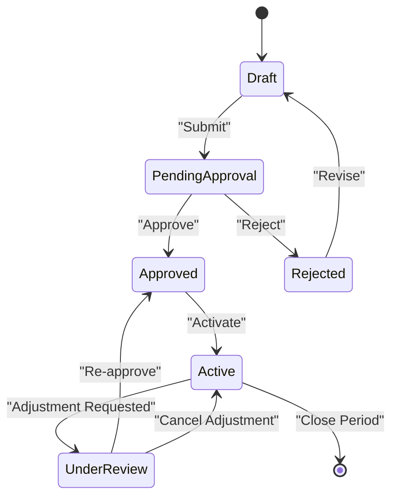

**Diagram sources**
- [lib/services/budget_service.dart](file://flutter_app/lib/services/budget_service.dart)
- [lib/repositories/budget_repository.dart](file://flutter_app/lib/repositories/budget_repository.dart)

**Section sources**
- [lib/services/budget_service.dart](file://flutter_app/lib/services/budget_service.dart)
- [lib/repositories/budget_repository.dart](file://flutter_app/lib/repositories/budget_repository.dart)

### Integration with Financial Reporting Systems
Integration is facilitated through Cloud Functions that generate snapshots and summaries for external reporting tools.

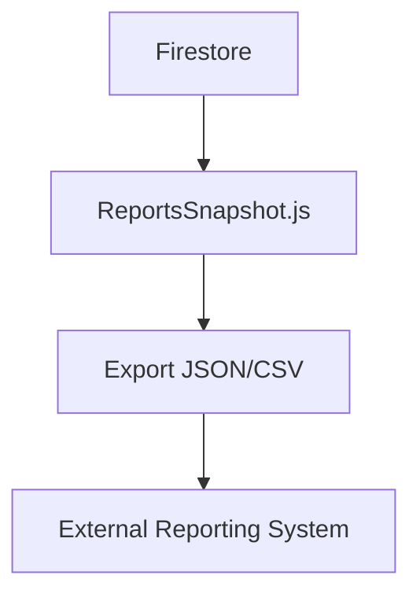

**Diagram sources**
- [functions/reportsSnapshot.js](file://functions/reportsSnapshot.js)

**Section sources**
- [functions/reportsSnapshot.js](file://functions/reportsSnapshot.js)

## Dependency Analysis
The budgeting system relies on clear separation of concerns:
- UI depends on services for business logic.
- Services depend on repositories for data access.
- Repositories interact with Firestore.
- Backend functions aggregate data for summaries and reports.

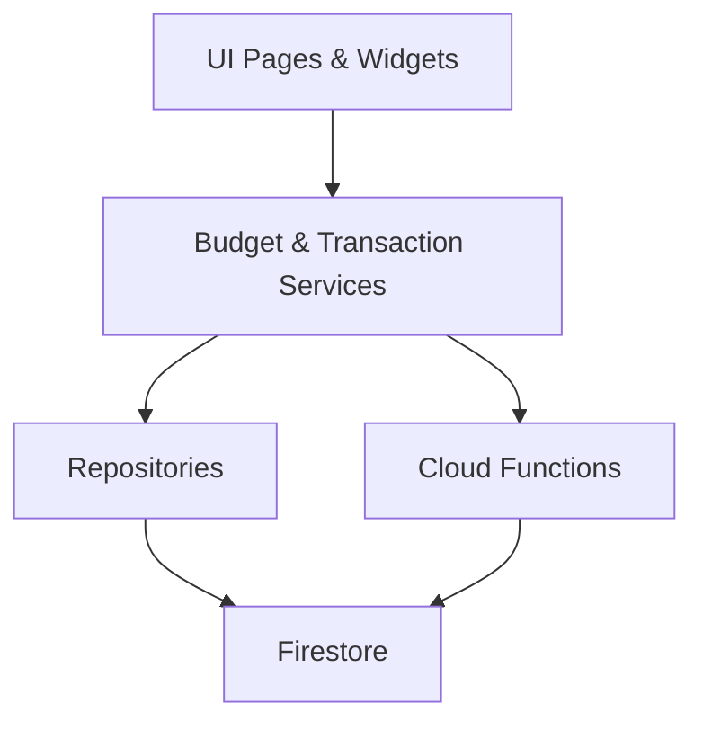

**Diagram sources**
- [lib/pages/budget_dashboard_page.dart](file://flutter_app/lib/pages/budget_dashboard_page.dart)
- [lib/services/budget_service.dart](file://flutter_app/lib/services/budget_service.dart)
- [lib/repositories/budget_repository.dart](file://flutter_app/lib/repositories/budget_repository.dart)
- [functions/panelFinanceSummary.js](file://functions/panelFinanceSummary.js)

**Section sources**
- [lib/pages/budget_dashboard_page.dart](file://flutter_app/lib/pages/budget_dashboard_page.dart)
- [lib/services/budget_service.dart](file://flutter_app/lib/services/budget_service.dart)
- [lib/repositories/budget_repository.dart](file://flutter_app/lib/repositories/budget_repository.dart)
- [functions/panelFinanceSummary.js](file://functions/panelFinanceSummary.js)

## Performance Considerations
- Use efficient Firestore queries with indexes for budget and transaction lookups.
- Implement caching for frequently accessed summaries.
- Batch writes for bulk updates to reduce latency.
- Optimize listeners to avoid unnecessary re-renders.
- Leverage Cloud Functions for heavy computations off the main thread.

[No sources needed since this section provides general guidance]

## Troubleshooting Guide
Common issues and resolutions:
- Budget not updating: Verify Firestore permissions and listener subscriptions.
- Alerts not triggering: Check threshold configurations and alert service initialization.
- Forecast inaccuracies: Validate historical data completeness and trend algorithms.
- Approval delays: Review workflow states and notification channels.

**Section sources**
- [lib/utils/budget_alerts.dart](file://flutter_app/lib/utils/budget_alerts.dart)
- [lib/services/budget_service.dart](file://flutter_app/lib/services/budget_service.dart)
- [firestore.rules](file://firestore.rules)

## Conclusion
The Gestão Yahweh Premium application provides a robust budget planning system with category-based allocation, spending limits, real-time monitoring, variance analysis, alerts, forecasting, and approval workflows. Its modular architecture ensures scalability and maintainability, while backend functions support advanced reporting and integrations.

[No sources needed since this section summarizes without analyzing specific files]

## Appendices
- Additional references to financial analysis and database structures.

**Section sources**
- [ANALISE_CUSTO_LUCRO_IGREJA_100.md](file://ANALISE_CUSTO_LUCRO_IGREJA_100.md)
- [FIREBASE_DATABASES.md](file://flutter_app/FIREBASE_DATABASES.md)
- [MIDIA_PADRAO_ECOFIRE.md](file://flutter_app/MIDIA_PADRAO_ECOFIRE.md)