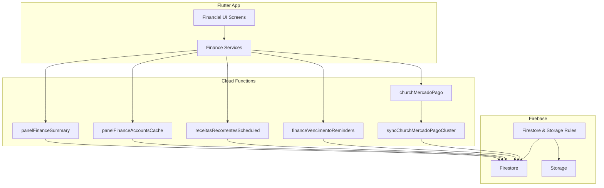
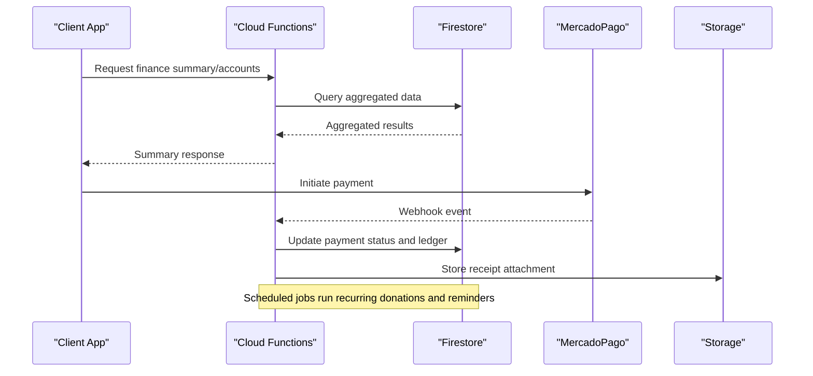
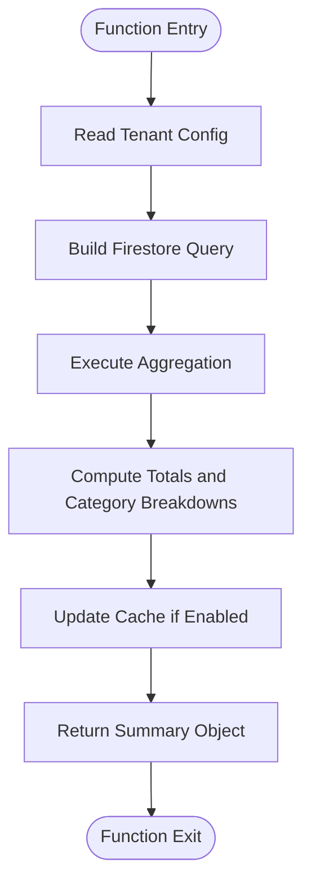
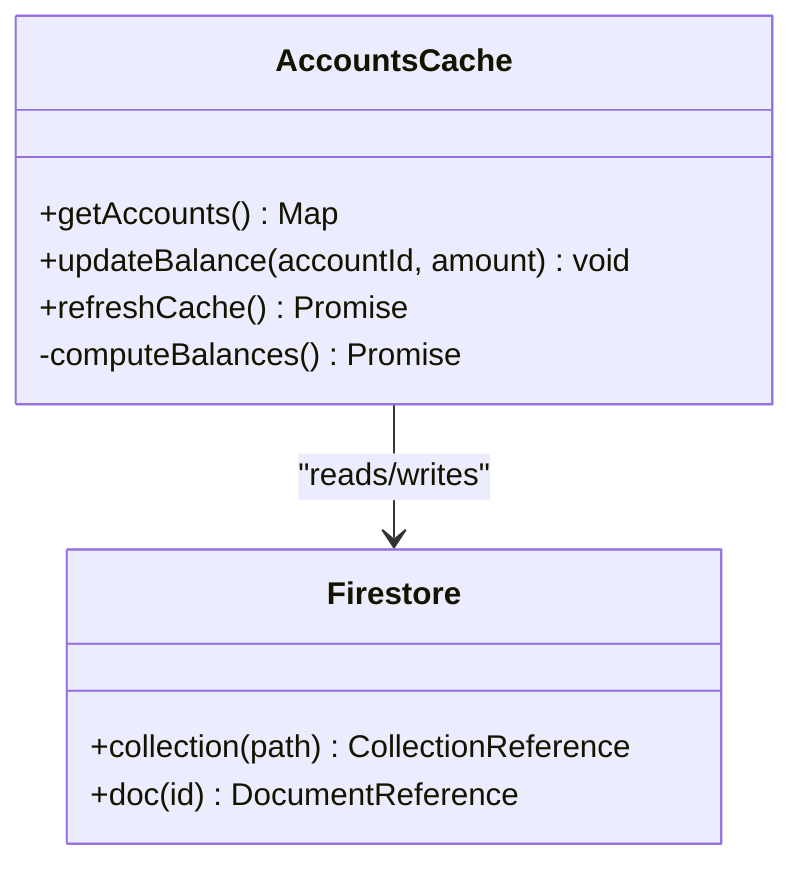
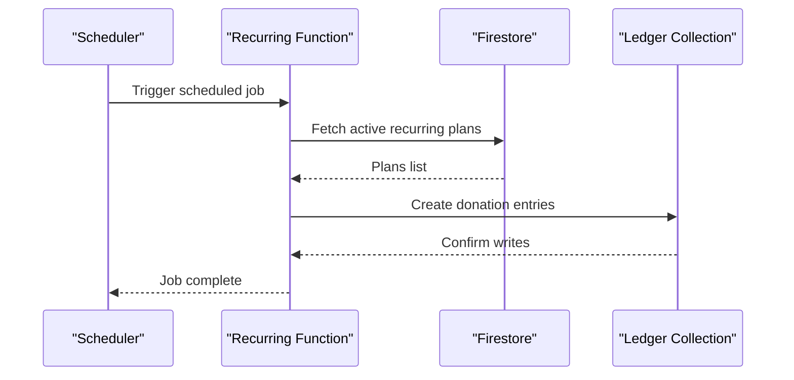
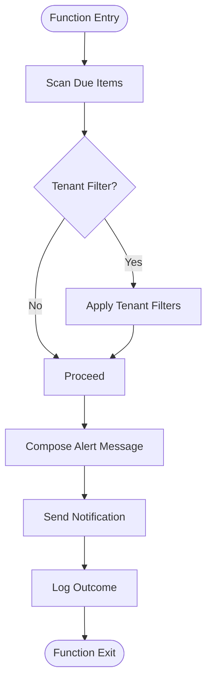
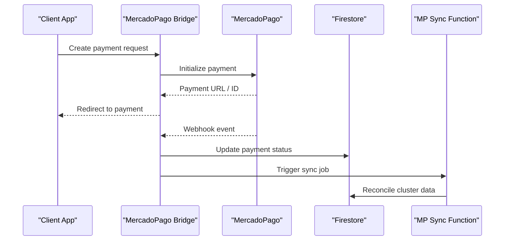
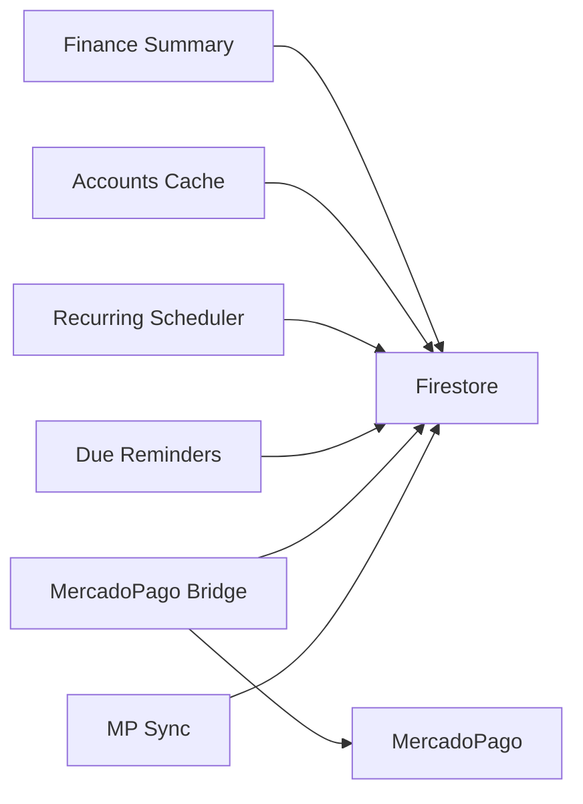

# Financial Management

<cite>
**Referenced Files in This Document**
- [functions/src/panelFinanceAccountsCache.ts](file://functions/src/panelFinanceAccountsCache.ts)
- [functions/src/panelFinanceSummary.ts](file://functions/src/panelFinanceSummary.ts)
- [functions/src/receitasRecorrentesScheduled.ts](file://functions/src/receitasRecorrentesScheduled.ts)
- [functions/src/financeVencimentoReminders.ts](file://functions/src/financeVencimentoReminders.ts)
- [functions/src/churchMercadoPago.ts](file://functions/src/churchMercadoPago.ts)
- [functions/src/syncChurchMercadoPagoCluster.js](file://functions/src/syncChurchMercadoPagoCluster.js)
- [functions/lib/panelFinanceAccountsCache.js](file://functions/lib/panelFinanceAccountsCache.js)
- [functions/lib/panelFinanceSummary.js](file://functions/lib/panelFinanceSummary.js)
- [functions/lib/receitasRecorrentesScheduled.js](file://functions/lib/receitasRecorrentesScheduled.js)
- [functions/lib/financeVencimentoReminders.js](file://functions/lib/financeVencimentoReminders.js)
- [functions/lib/churchMercadoPago.js](file://functions/lib/churchMercadoPago.js)
- [functions/lib/syncChurchMercadoPagoCluster.js](file://functions/lib/syncChurchMercadoPagoCluster.js)
- [firestore.rules](file://firestore.rules)
- [storage.rules](file://storage.rules)
</cite>

## Table of Contents
1. [Introduction](#introduction)
2. [Project Structure](#project-structure)
3. [Core Components](#core-components)
4. [Architecture Overview](#architecture-overview)
5. [Detailed Component Analysis](#detailed-component-analysis)
6. [Dependency Analysis](#dependency-analysis)
7. [Performance Considerations](#performance-considerations)
8. [Troubleshooting Guide](#troubleshooting-guide)
9. [Conclusion](#conclusion)
10. [Appendices](#appendices)

## Introduction
This document provides comprehensive financial management documentation for the Gestão Yahweh Premium application. It covers transaction tracking, income and expense management, recurring donations, budget planning, and financial reporting. It explains the financial data model, categorization system, payment processing integration with MercadoPago, implementation details for generating reports, managing accounts, tracking pledges, and automating recurring transactions. It also includes examples of recording transactions, creating budgets, generating statements, and integrating with external accounting systems, along with guidance on financial data security, audit trails, and compliance considerations.

## Project Structure
The financial subsystem spans Flutter UI layers, Cloud Functions (TypeScript/JavaScript), and Firebase rules. Key areas include:
- Cloud Functions for finance summaries, account caching, recurring revenue automation, due reminders, and MercadoPago integrations.
- Firestore and Storage rules governing access to financial data and documents.
- Flutter features and services that consume these functions and present financial dashboards and tools.

**Diagram sources**
- [functions/src/panelFinanceSummary.ts](file://functions/src/panelFinanceSummary.ts)
- [functions/src/panelFinanceAccountsCache.ts](file://functions/src/panelFinanceAccountsCache.ts)
- [functions/src/receitasRecorrentesScheduled.ts](file://functions/src/receitasRecorrentesScheduled.ts)
- [functions/src/financeVencimentoReminders.ts](file://functions/src/financeVencimentoReminders.ts)
- [functions/src/churchMercadoPago.ts](file://functions/src/churchMercadoPago.ts)
- [functions/src/syncChurchMercadoPagoCluster.js](file://functions/src/syncChurchMercadoPagoCluster.js)
- [firestore.rules](file://firestore.rules)
- [storage.rules](file://storage.rules)

**Section sources**
- [functions/src/panelFinanceSummary.ts](file://functions/src/panelFinanceSummary.ts)
- [functions/src/panelFinanceAccountsCache.ts](file://functions/src/panelFinanceAccountsCache.ts)
- [functions/src/receitasRecorrentesScheduled.ts](file://functions/src/receitasRecorrentesScheduled.ts)
- [functions/src/financeVencimentoReminders.ts](file://functions/src/financeVencimentoReminders.ts)
- [functions/src/churchMercadoPago.ts](file://functions/src/churchMercadoPago.ts)
- [functions/src/syncChurchMercadoPagoCluster.js](file://functions/src/syncChurchMercadoPagoCluster.js)
- [firestore.rules](file://firestore.rules)
- [storage.rules](file://storage.rules)

## Core Components
- Finance Summary Function: Aggregates income, expenses, balances, and category-level metrics across time windows for dashboards and reports.
- Accounts Cache Function: Maintains a cached view of accounts and their balances to accelerate queries and reduce Firestore reads.
- Recurring Revenue Scheduler: Automates creation of recurring donations and scheduled transactions based on configured plans or pledges.
- Due Reminders Function: Sends notifications for upcoming or overdue payments, invoices, and pledges.
- MercadoPago Bridge: Orchestrates payment initiation, webhook handling, and reconciliation between MercadoPago and internal records.
- MercadoPago Sync: Synchronizes payment clusters and statuses into tenant-specific collections for consistent reporting.

**Section sources**
- [functions/src/panelFinanceSummary.ts](file://functions/src/panelFinanceSummary.ts)
- [functions/src/panelFinanceAccountsCache.ts](file://functions/src/panelFinanceAccountsCache.ts)
- [functions/src/receitasRecorrentesScheduled.ts](file://functions/src/receitasRecorrentesScheduled.ts)
- [functions/src/financeVencimentoReminders.ts](file://functions/src/financeVencimentoReminders.ts)
- [functions/src/churchMercadoPago.ts](file://functions/src/churchMercadoPago.ts)
- [functions/src/syncChurchMercadoPagoCluster.js](file://functions/src/syncChurchMercadoPagoCluster.js)

## Architecture Overview
The financial architecture follows an event-driven and serverless pattern:
- Clients call Cloud Functions for read-heavy operations (summaries, account lists).
- Scheduled functions automate recurring transactions and reminders.
- Payment flows integrate via MercadoPago bridge functions, which reconcile webhooks into Firestore.
- Firestore serves as the source of truth; Storage holds receipts and attachments.
- Security is enforced by Firestore and Storage rules.

**Diagram sources**
- [functions/src/panelFinanceSummary.ts](file://functions/src/panelFinanceSummary.ts)
- [functions/src/panelFinanceAccountsCache.ts](file://functions/src/panelFinanceAccountsCache.ts)
- [functions/src/churchMercadoPago.ts](file://functions/src/churchMercadoPago.ts)
- [functions/src/syncChurchMercadoPagoCluster.js](file://functions/src/syncChurchMercadoPagoCluster.js)
- [firestore.rules](file://firestore.rules)
- [storage.rules](file://storage.rules)

## Detailed Component Analysis

### Finance Summary Function
Aggregates financial metrics for dashboards and reports. It computes totals by period, category, and account, and supports filters such as date ranges and tags.

**Diagram sources**
- [functions/src/panelFinanceSummary.ts](file://functions/src/panelFinanceSummary.ts)
- [functions/lib/panelFinanceSummary.js](file://functions/lib/panelFinanceSummary.js)

**Section sources**
- [functions/src/panelFinanceSummary.ts](file://functions/src/panelFinanceSummary.ts)
- [functions/lib/panelFinanceSummary.js](file://functions/lib/panelFinanceSummary.js)

### Accounts Cache Function
Maintains a lightweight cache of accounts and balances to optimize dashboard performance and reduce Firestore reads.

**Diagram sources**
- [functions/src/panelFinanceAccountsCache.ts](file://functions/src/panelFinanceAccountsCache.ts)
- [functions/lib/panelFinanceAccountsCache.js](file://functions/lib/panelFinanceAccountsCache.js)

**Section sources**
- [functions/src/panelFinanceAccountsCache.ts](file://functions/src/panelFinanceAccountsCache.ts)
- [functions/lib/panelFinanceAccountsCache.js](file://functions/lib/panelFinanceAccountsCache.js)

### Recurring Donations Scheduler
Automates creation of recurring donations and scheduled transactions based on predefined plans or pledges. It runs on a schedule and writes ledger entries accordingly.

**Diagram sources**
- [functions/src/receitasRecorrentesScheduled.ts](file://functions/src/receitasRecorrentesScheduled.ts)
- [functions/lib/receitasRecorrentesScheduled.js](file://functions/lib/receitasRecorrentesScheduled.js)

**Section sources**
- [functions/src/receitasRecorrentesScheduled.ts](file://functions/src/receitasRecorrentesScheduled.ts)
- [functions/lib/receitasRecorrentesScheduled.js](file://functions/lib/receitasRecorrentesScheduled.js)

### Due Reminders Function
Sends notifications for upcoming or overdue payments, invoices, and pledges. It scans due items and triggers alerts through messaging channels.

**Diagram sources**
- [functions/src/financeVencimentoReminders.ts](file://functions/src/financeVencimentoReminders.ts)
- [functions/lib/financeVencimentoReminders.js](file://functions/lib/financeVencimentoReminders.js)

**Section sources**
- [functions/src/financeVencimentoReminders.ts](file://functions/src/financeVencimentoReminders.ts)
- [functions/lib/financeVencimentoReminders.js](file://functions/lib/financeVencimentoReminders.js)

### MercadoPago Integration
Handles payment initiation, webhook processing, and reconciliation. The bridge function coordinates with MercadoPago APIs and updates internal records.

**Diagram sources**
- [functions/src/churchMercadoPago.ts](file://functions/src/churchMercadoPago.ts)
- [functions/lib/churchMercadoPago.js](file://functions/lib/churchMercadoPago.js)
- [functions/src/syncChurchMercadoPagoCluster.js](file://functions/src/syncChurchMercadoPagoCluster.js)
- [functions/lib/syncChurchMercadoPagoCluster.js](file://functions/lib/syncChurchMercadoPagoCluster.js)

**Section sources**
- [functions/src/churchMercadoPago.ts](file://functions/src/churchMercadoPago.ts)
- [functions/lib/churchMercadoPago.js](file://functions/lib/churchMercadoPago.js)
- [functions/src/syncChurchMercadoPagoCluster.js](file://functions/src/syncChurchMercadoPagoCluster.js)
- [functions/lib/syncChurchMercadoPagoCluster.js](file://functions/lib/syncChurchMercadoPagoCluster.js)

### Conceptual Overview
The financial data model typically includes:
- Accounts: Bank accounts, cash, credit cards, and other financial instruments.
- Transactions: Income, expenses, transfers, and adjustments with categories and tags.
- Pledges: Commitments with schedules and fulfillment tracking.
- Budgets: Planned spending per category and period.
- Payments: External payment references and statuses from MercadoPago.
- Attachments: Receipts and supporting documents stored in Storage.

[No sources needed since this section doesn't analyze specific files]

## Dependency Analysis
Key dependencies among financial components:
- Summaries depend on Firestore collections for transactions, accounts, and categories.
- Accounts cache depends on transaction streams to update balances.
- Recurring scheduler depends on pledge and plan definitions.
- Reminders depend on due dates and notification channels.
- MercadoPago bridge depends on webhook events and reconciliation logic.

**Diagram sources**
- [functions/src/panelFinanceSummary.ts](file://functions/src/panelFinanceSummary.ts)
- [functions/src/panelFinanceAccountsCache.ts](file://functions/src/panelFinanceAccountsCache.ts)
- [functions/src/receitasRecorrentesScheduled.ts](file://functions/src/receitasRecorrentesScheduled.ts)
- [functions/src/financeVencimentoReminders.ts](file://functions/src/financeVencimentoReminders.ts)
- [functions/src/churchMercadoPago.ts](file://functions/src/churchMercadoPago.ts)
- [functions/src/syncChurchMercadoPagoCluster.js](file://functions/src/syncChurchMercadoPagoCluster.js)

**Section sources**
- [functions/src/panelFinanceSummary.ts](file://functions/src/panelFinanceSummary.ts)
- [functions/src/panelFinanceAccountsCache.ts](file://functions/src/panelFinanceAccountsCache.ts)
- [functions/src/receitasRecorrentesScheduled.ts](file://functions/src/receitasRecorrentesScheduled.ts)
- [functions/src/financeVencimentoReminders.ts](file://functions/src/financeVencimentoReminders.ts)
- [functions/src/churchMercadoPago.ts](file://functions/src/churchMercadoPago.ts)
- [functions/src/syncChurchMercadoPagoCluster.js](file://functions/src/syncChurchMercadoPagoCluster.js)

## Performance Considerations
- Use cached summaries and account balances to minimize Firestore reads.
- Batch write operations for recurring transactions to reduce latency and costs.
- Index frequently queried fields (dates, categories, account IDs) in Firestore indexes.
- Implement pagination and filtering for large datasets.
- Offload heavy computations to Cloud Functions and avoid client-side aggregation.

[No sources needed since this section provides general guidance]

## Troubleshooting Guide
Common issues and resolutions:
- Missing or incorrect Firestore indexes: Ensure required indexes exist for filtered queries.
- Webhook delivery failures: Verify MercadoPago webhook URLs and retry policies.
- Stale cache data: Refresh account cache after bulk updates or migrations.
- Permission errors: Review Firestore and Storage rules for tenant isolation and role-based access.
- Duplicate transactions: Implement idempotency keys for payment reconciliations.

**Section sources**
- [firestore.rules](file://firestore.rules)
- [storage.rules](file://storage.rules)

## Conclusion
The financial management subsystem integrates robust serverless functions, secure data storage, and third-party payment processing to deliver comprehensive financial capabilities. By leveraging summaries, caches, automated scheduling, and MercadoPago reconciliation, the system supports accurate tracking, reporting, and compliance. Adhering to best practices in indexing, caching, and security ensures scalability and reliability.

[No sources needed since this section summarizes without analyzing specific files]

## Appendices

### Examples and Best Practices
- Recording Transactions:
  - Create income or expense entries with category, account, date, and reference.
  - Attach receipts to Storage and link via document metadata.
- Creating Budgets:
  - Define planned amounts per category and period.
  - Monitor actual vs. planned using summaries and dashboards.
- Generating Statements:
  - Use finance summary endpoints to export period-specific reports.
  - Include category breakdowns and account movements.
- Integrating with External Accounting Systems:
  - Export CSV/JSON from summaries and reconcile with ERP systems.
  - Map categories and accounts to external chart of accounts.

[No sources needed since this section provides general guidance]