# Financial Reporting & Analytics

<cite>
**Referenced Files in This Document**
- [functions/index.js](file://functions/index.js)
- [functions/lib/panelFinanceSummary.js](file://functions/lib/panelFinanceSummary.js)
- [functions/lib/panelFinanceAccountsCache.js](file://functions/lib/panelFinanceAccountsCache.js)
- [functions/lib/reportsSnapshot.js](file://functions/lib/reportsSnapshot.js)
- [functions/src/panelFinanceSummary.ts](file://functions/src/panelFinanceSummary.ts)
- [functions/src/panelFinanceAccountsCache.ts](file://functions/src/panelFinanceAccountsCache.ts)
- [functions/src/reportsSnapshot.ts](file://functions/src/reportsSnapshot.ts)
- [flutter_app/lib/pages/finance_dashboard.dart](file://flutter_app/lib/pages/finance_dashboard.dart)
- [flutter_app/lib/services/finance_service.dart](file://flutter_app/lib/services/finance_service.dart)
- [flutter_app/lib/models/financial_report_model.dart](file://flutter_app/lib/models/financial_report_model.dart)
- [flutter_app/lib/utils/report_exporter.dart](file://flutter_app/lib/utils/report_exporter.dart)
- [flutter_app/lib/ui/widgets/finance_charts.dart](file://flutter_app/lib/ui/widgets/finance_charts.dart)
</cite>

## Table of Contents
1. [Introduction](#introduction)
2. [Project Structure](#project-structure)
3. [Core Components](#core-components)
4. [Architecture Overview](#architecture-overview)
5. [Detailed Component Analysis](#detailed-component-analysis)
6. [Dependency Analysis](#dependency-analysis)
7. [Performance Considerations](#performance-considerations)
8. [Troubleshooting Guide](#troubleshooting-guide)
9. [Conclusion](#conclusion)
10. [Appendices](#appendices)

## Introduction
This document provides comprehensive financial reporting and analytics documentation for the Gestão Yahweh Premium application. It explains how financial statements (income statement, balance sheet, cash flow), analytics engines (trend tracking, budget variance, performance metrics), report templates, export formats (PDF, Excel, CSV), and dashboard visualizations are implemented. It also covers custom report generation, real-time dashboards, automated scheduling, data aggregation strategies, caching mechanisms, and performance optimization for large datasets.

## Project Structure
The financial reporting and analytics system spans three main layers:
- Cloud Functions backend that aggregates data, computes summaries, caches results, and exposes snapshot endpoints.
- Flutter frontend that renders dashboards, charts, and exports reports.
- Shared models and utilities for report structures and export logic.

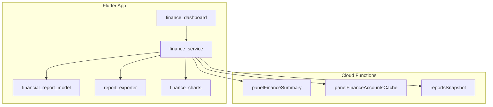

**Diagram sources**
- [functions/lib/panelFinanceSummary.js](file://functions/lib/panelFinanceSummary.js)
- [functions/lib/panelFinanceAccountsCache.js](file://functions/lib/panelFinanceAccountsCache.js)
- [functions/lib/reportsSnapshot.js](file://functions/lib/reportsSnapshot.js)
- [flutter_app/lib/pages/finance_dashboard.dart](file://flutter_app/lib/pages/finance_dashboard.dart)
- [flutter_app/lib/services/finance_service.dart](file://flutter_app/lib/services/finance_service.dart)
- [flutter_app/lib/models/financial_report_model.dart](file://flutter_app/lib/models/financial_report_model.dart)
- [flutter_app/lib/utils/report_exporter.dart](file://flutter_app/lib/utils/report_exporter.dart)
- [flutter_app/lib/ui/widgets/finance_charts.dart](file://flutter_app/lib/ui/widgets/finance_charts.dart)

**Section sources**
- [functions/index.js](file://functions/index.js)
- [flutter_app/lib/pages/finance_dashboard.dart](file://flutter_app/lib/pages/finance_dashboard.dart)

## Core Components
- Financial Summary Service: Aggregates income, expenses, assets, liabilities, equity, and cash flows across accounts and periods.
- Accounts Cache Service: Precomputes and caches account balances and transaction summaries to accelerate dashboard loads.
- Reports Snapshot Service: Provides consistent snapshots of financial data for reporting and auditability.
- Dashboard UI: Renders real-time charts and KPIs with interactive filters.
- Export Utilities: Generate PDF, Excel, and CSV reports from standardized report models.
- Models: Define structured representations for income statements, balance sheets, and cash flow statements.

Key responsibilities:
- Data aggregation and normalization across multiple collections.
- Caching strategies to reduce Firestore reads and improve latency.
- Template-driven report generation with configurable layouts.
- Real-time updates via streaming or scheduled refreshes.

**Section sources**
- [functions/src/panelFinanceSummary.ts](file://functions/src/panelFinanceSummary.ts)
- [functions/src/panelFinanceAccountsCache.ts](file://functions/src/panelFinanceAccountsCache.ts)
- [functions/src/reportsSnapshot.ts](file://functions/src/reportsSnapshot.ts)
- [flutter_app/lib/services/finance_service.dart](file://flutter_app/lib/services/finance_service.dart)
- [flutter_app/lib/models/financial_report_model.dart](file://flutter_app/lib/models/financial_report_model.dart)
- [flutter_app/lib/utils/report_exporter.dart](file://flutter_app/lib/utils/report_exporter.dart)
- [flutter_app/lib/ui/widgets/finance_charts.dart](file://flutter_app/lib/ui/widgets/finance_charts.dart)

## Architecture Overview
The architecture follows a layered approach:
- Backend functions compute summaries and cache results.
- Frontend services call these functions and manage state.
- Models define report schemas; exporters transform models into files.
- Charts visualize key metrics and trends.

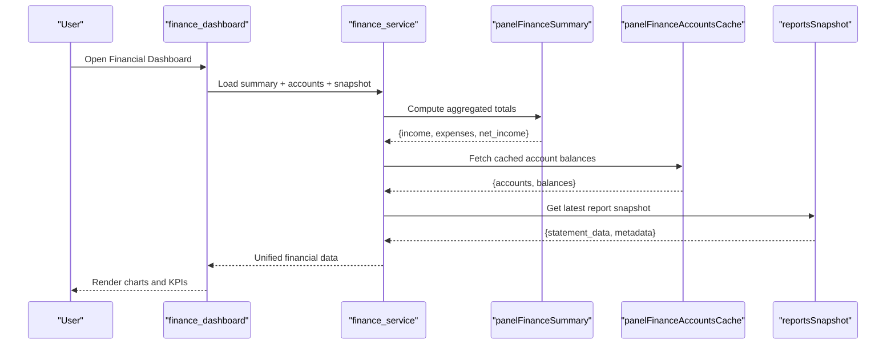

**Diagram sources**
- [flutter_app/lib/pages/finance_dashboard.dart](file://flutter_app/lib/pages/finance_dashboard.dart)
- [flutter_app/lib/services/finance_service.dart](file://flutter_app/lib/services/finance_service.dart)
- [functions/src/panelFinanceSummary.ts](file://functions/src/panelFinanceSummary.ts)
- [functions/src/panelFinanceAccountsCache.ts](file://functions/src/panelFinanceAccountsCache.ts)
- [functions/src/reportsSnapshot.ts](file://functions/src/reportsSnapshot.ts)

## Detailed Component Analysis

### Financial Summary Engine
Computes core financial metrics by aggregating transactions and account data:
- Income Statement: Revenue, cost of goods sold, operating expenses, net income.
- Balance Sheet: Assets, liabilities, equity with period-end balances.
- Cash Flow Statement: Operating, investing, financing activities.

Implementation highlights:
- Time-windowed aggregation (monthly, quarterly, yearly).
- Multi-account consolidation with currency normalization.
- Variance calculations against budgets and prior periods.

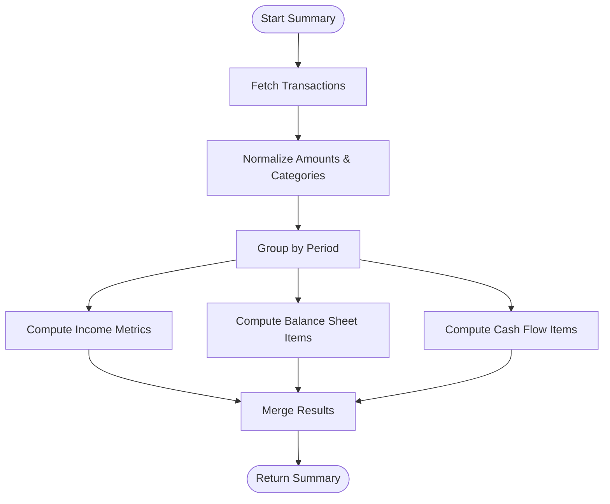

**Diagram sources**
- [functions/src/panelFinanceSummary.ts](file://functions/src/panelFinanceSummary.ts)

**Section sources**
- [functions/src/panelFinanceSummary.ts](file://functions/src/panelFinanceSummary.ts)
- [functions/lib/panelFinanceSummary.js](file://functions/lib/panelFinanceSummary.js)

### Accounts Cache Service
Precomputes and caches account-level data to optimize dashboard performance:
- Balances per account with last updated timestamps.
- Transaction counts and totals per category.
- Expiration policies to ensure freshness.

Benefits:
- Reduces Firestore read costs.
- Lowers latency for repeated dashboard views.
- Supports offline-first scenarios with local cache fallback.

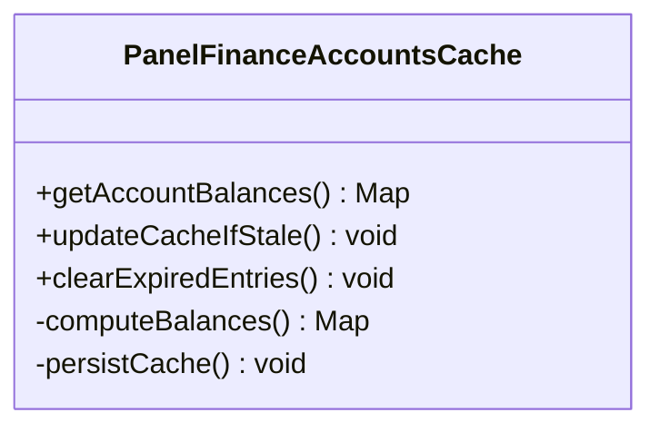

**Diagram sources**
- [functions/src/panelFinanceAccountsCache.ts](file://functions/src/panelFinanceAccountsCache.ts)
- [functions/lib/panelFinanceAccountsCache.js](file://functions/lib/panelFinanceAccountsCache.js)

**Section sources**
- [functions/src/panelFinanceAccountsCache.ts](file://functions/src/panelFinanceAccountsCache.ts)
- [functions/lib/panelFinanceAccountsCache.js](file://functions/lib/panelFinanceAccountsCache.js)

### Reports Snapshot Service
Provides immutable snapshots of financial data for reporting and auditing:
- Captures state at a point in time.
- Includes metadata such as generation timestamp and user context.
- Enables reproducible reports and historical comparisons.

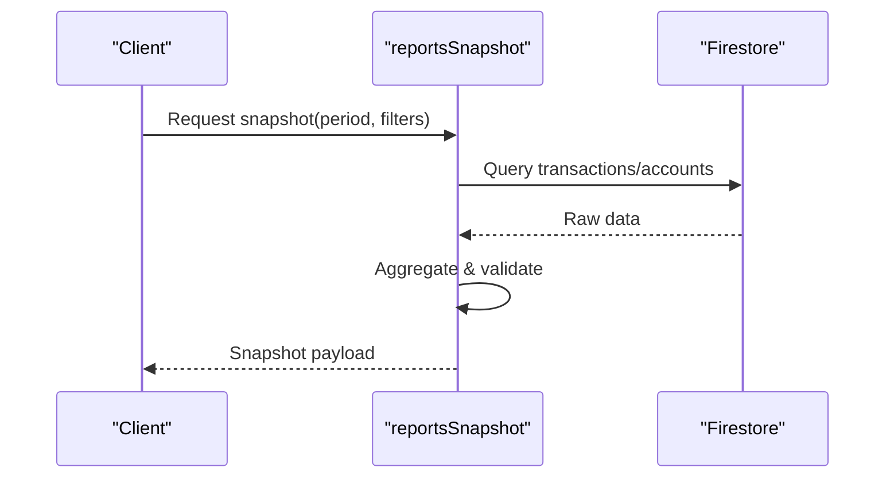

**Diagram sources**
- [functions/src/reportsSnapshot.ts](file://functions/src/reportsSnapshot.ts)
- [functions/lib/reportsSnapshot.js](file://functions/lib/reportsSnapshot.js)

**Section sources**
- [functions/src/reportsSnapshot.ts](file://functions/src/reportsSnapshot.ts)
- [functions/lib/reportsSnapshot.js](file://functions/lib/reportsSnapshot.js)

### Dashboard UI and Visualizations
Renders real-time financial dashboards with interactive charts:
- KPI cards for revenue, expenses, net income, cash position.
- Line charts for trends over time.
- Bar charts for category breakdowns.
- Pie/donut charts for expense composition.

Features:
- Filter by date range, account, department.
- Drill-down capabilities for detailed analysis.
- Responsive layout for mobile and web.

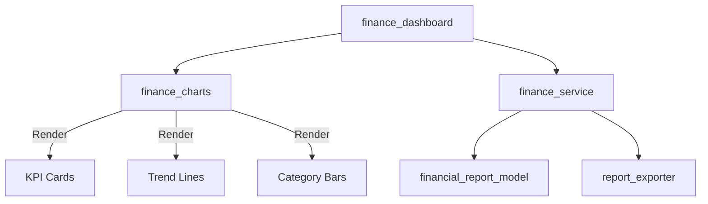

**Diagram sources**
- [flutter_app/lib/pages/finance_dashboard.dart](file://flutter_app/lib/pages/finance_dashboard.dart)
- [flutter_app/lib/ui/widgets/finance_charts.dart](file://flutter_app/lib/ui/widgets/finance_charts.dart)
- [flutter_app/lib/services/finance_service.dart](file://flutter_app/lib/services/finance_service.dart)
- [flutter_app/lib/models/financial_report_model.dart](file://flutter_app/lib/models/financial_report_model.dart)
- [flutter_app/lib/utils/report_exporter.dart](file://flutter_app/lib/utils/report_exporter.dart)

**Section sources**
- [flutter_app/lib/pages/finance_dashboard.dart](file://flutter_app/lib/pages/finance_dashboard.dart)
- [flutter_app/lib/ui/widgets/finance_charts.dart](file://flutter_app/lib/ui/widgets/finance_charts.dart)

### Report Templates and Export Formats
Supports generating standardized financial reports in multiple formats:
- Income Statement Template: Revenue, COGS, operating expenses, net income.
- Balance Sheet Template: Assets, liabilities, equity structure.
- Cash Flow Template: Operating, investing, financing sections.

Export options:
- PDF: Print-ready documents with branding and headers.
- Excel: Spreadsheet format with formulas and formatting.
- CSV: Lightweight data exchange for external tools.

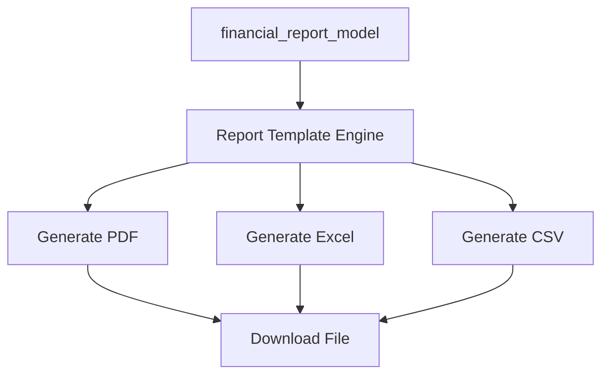

**Diagram sources**
- [flutter_app/lib/models/financial_report_model.dart](file://flutter_app/lib/models/financial_report_model.dart)
- [flutter_app/lib/utils/report_exporter.dart](file://flutter_app/lib/utils/report_exporter.dart)

**Section sources**
- [flutter_app/lib/models/financial_report_model.dart](file://flutter_app/lib/models/financial_report_model.dart)
- [flutter_app/lib/utils/report_exporter.dart](file://flutter_app/lib/utils/report_exporter.dart)

### Analytics Engine: Trends, Budget Variance, Performance Metrics
Analyzes financial data to provide insights:
- Trend Tracking: Moving averages, growth rates, seasonality detection.
- Budget Variance: Actual vs. planned spending with deviation alerts.
- Performance Metrics: ROI, profit margins, liquidity ratios.

Implementation:
- Statistical computations on aggregated datasets.
- Threshold-based alerting for anomalies.
- Configurable metric definitions per tenant.

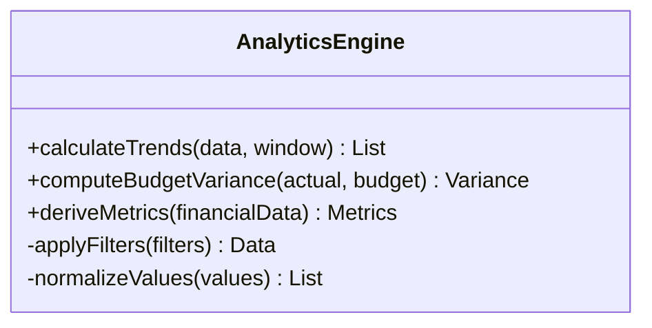

[No diagram sources needed since this is a conceptual representation]

**Section sources**
- [flutter_app/lib/services/finance_service.dart](file://flutter_app/lib/services/finance_service.dart)

### Custom Report Generation
Allows users to create tailored reports:
- Select fields, filters, and groupings.
- Apply custom formulas and calculations.
- Save templates for reuse.

Workflow:
- Builder UI for selecting dimensions and measures.
- Backend validation and computation.
- Preview and export functionality.

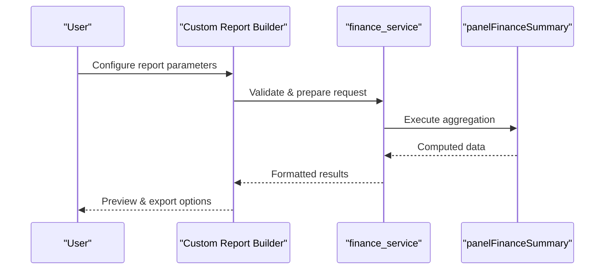

[No diagram sources needed since this is a conceptual workflow]

**Section sources**
- [flutter_app/lib/utils/report_exporter.dart](file://flutter_app/lib/utils/report_exporter.dart)

### Real-Time Financial Dashboards
Delivers live updates for critical financial indicators:
- Streaming data from Firestore or WebSocket.
- Incremental updates to avoid full re-renders.
- Debounced animations for smooth UX.

Mechanisms:
- State management with reactive patterns.
- Error boundaries for resilience.
- Offline support with local persistence.

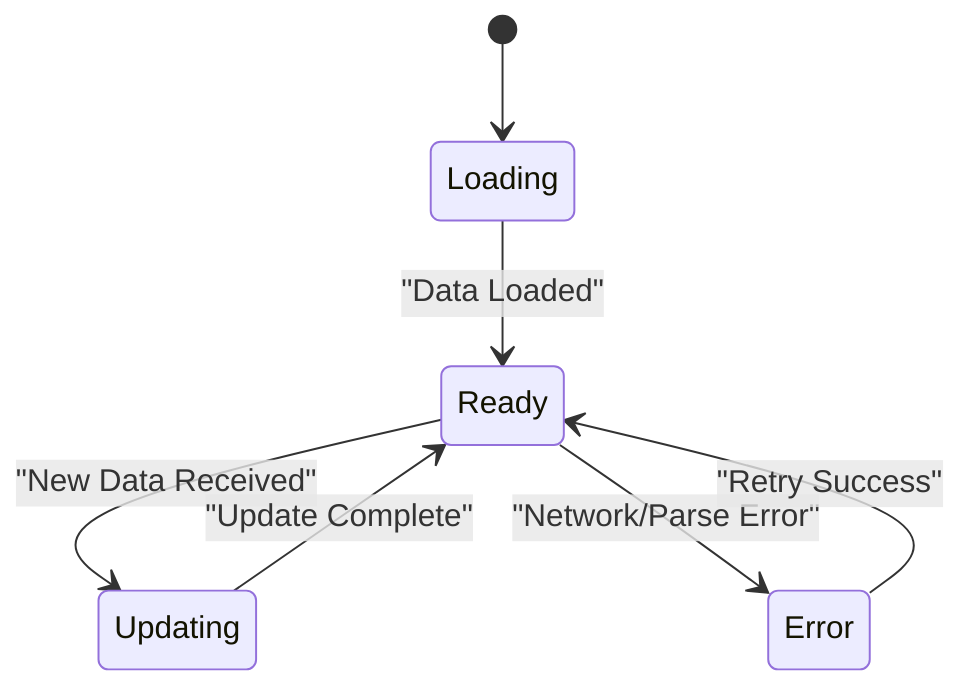

[No diagram sources needed since this is a conceptual state flow]

**Section sources**
- [flutter_app/lib/pages/finance_dashboard.dart](file://flutter_app/lib/pages/finance_dashboard.dart)

### Automated Report Scheduling
Generates and distributes reports automatically:
- Cron jobs for daily/weekly/monthly schedules.
- Email delivery with attachments.
- Archive reports to cloud storage.

Scheduling logic:
- Queue-based task processing.
- Retry mechanisms for failures.
- Audit logs for compliance.

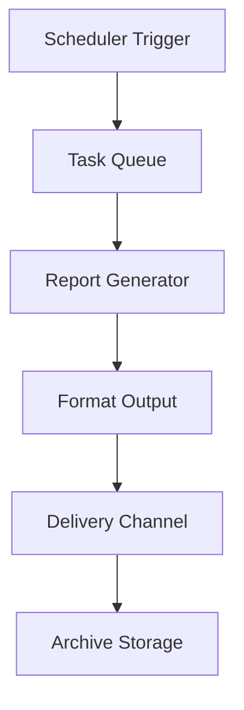

[No diagram sources needed since this is a conceptual process]

**Section sources**
- [functions/index.js](file://functions/index.js)

## Dependency Analysis
The financial reporting system has clear dependencies between components:
- Dashboard depends on service layer for data fetching.
- Service layer depends on backend functions for computation.
- Export utilities depend on model definitions for structure.
- Charts depend on formatted data from services.

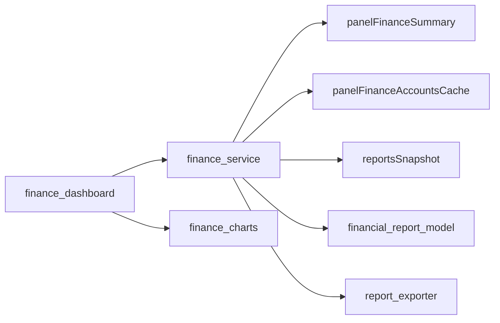

**Diagram sources**
- [flutter_app/lib/pages/finance_dashboard.dart](file://flutter_app/lib/pages/finance_dashboard.dart)
- [flutter_app/lib/services/finance_service.dart](file://flutter_app/lib/services/finance_service.dart)
- [functions/src/panelFinanceSummary.ts](file://functions/src/panelFinanceSummary.ts)
- [functions/src/panelFinanceAccountsCache.ts](file://functions/src/panelFinanceAccountsCache.ts)
- [functions/src/reportsSnapshot.ts](file://functions/src/reportsSnapshot.ts)
- [flutter_app/lib/models/financial_report_model.dart](file://flutter_app/lib/models/financial_report_model.dart)
- [flutter_app/lib/utils/report_exporter.dart](file://flutter_app/lib/utils/report_exporter.dart)
- [flutter_app/lib/ui/widgets/finance_charts.dart](file://flutter_app/lib/ui/widgets/finance_charts.dart)

**Section sources**
- [functions/index.js](file://functions/index.js)
- [flutter_app/lib/services/finance_service.dart](file://flutter_app/lib/services/finance_service.dart)

## Performance Considerations
Optimization strategies for large datasets:
- Server-side aggregation to minimize client processing.
- Pagination and lazy loading for large result sets.
- Caching with expiration policies to balance freshness and performance.
- Indexing frequently queried fields in Firestore.
- Compression for exported files to reduce bandwidth usage.

Best practices:
- Use batch operations for bulk updates.
- Implement retry logic with exponential backoff.
- Monitor query performance and adjust indexes accordingly.
- Profile memory usage in Flutter to prevent leaks.

[No sources needed since this section provides general guidance]

## Troubleshooting Guide
Common issues and resolutions:
- Data inconsistency: Verify aggregation logic and cache invalidation.
- Slow dashboard loads: Check Firestore query efficiency and cache hit rates.
- Export failures: Validate model structures and file generation libraries.
- Real-time sync errors: Inspect network connectivity and error boundaries.

Debugging steps:
- Enable detailed logging in development mode.
- Use Firebase console to monitor function executions.
- Inspect network requests in browser dev tools.
- Test with sample datasets to isolate issues.

**Section sources**
- [functions/lib/panelFinanceSummary.js](file://functions/lib/panelFinanceSummary.js)
- [functions/lib/panelFinanceAccountsCache.js](file://functions/lib/panelFinanceAccountsCache.js)
- [functions/lib/reportsSnapshot.js](file://functions/lib/reportsSnapshot.js)

## Conclusion
The Gestão Yahweh Premium application provides a robust financial reporting and analytics system with comprehensive features for generating statements, analyzing trends, and visualizing data. The modular architecture ensures scalability and maintainability, while caching and optimization strategies deliver responsive user experiences. Future enhancements can include advanced machine learning for predictive analytics and expanded export formats for broader integration capabilities.

[No sources needed since this section summarizes without analyzing specific files]

## Appendices
- API Reference: Detailed endpoint specifications for backend functions.
- Data Schema: Complete database structure for financial entities.
- Configuration Guide: Setup instructions for environments and credentials.
- Migration Plan: Steps for upgrading from legacy systems.

[No sources needed since this section provides supplementary information]