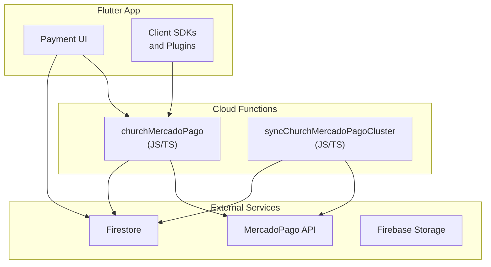
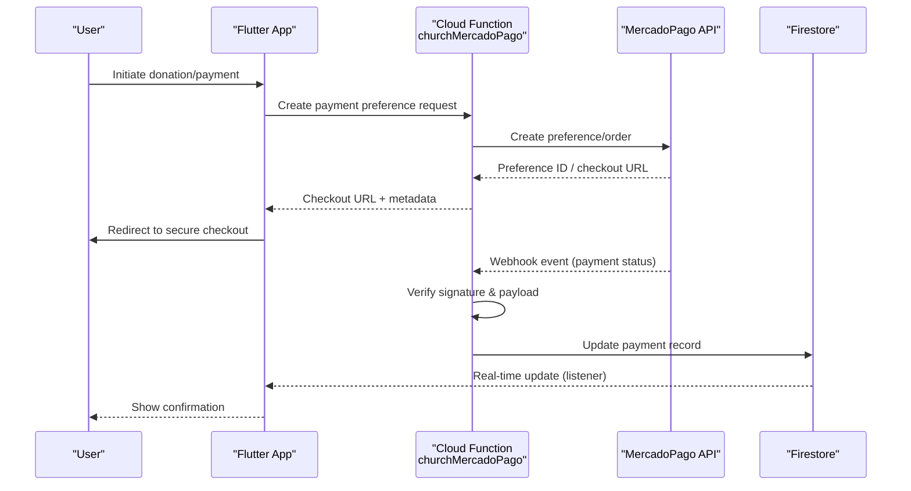
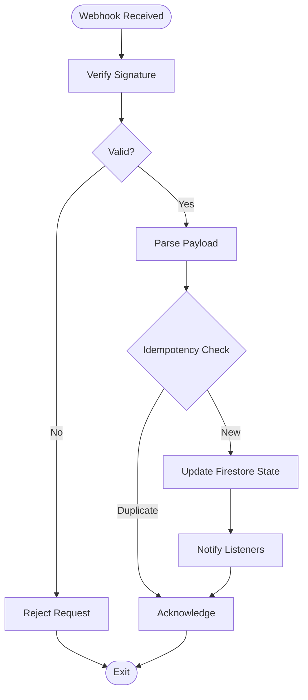
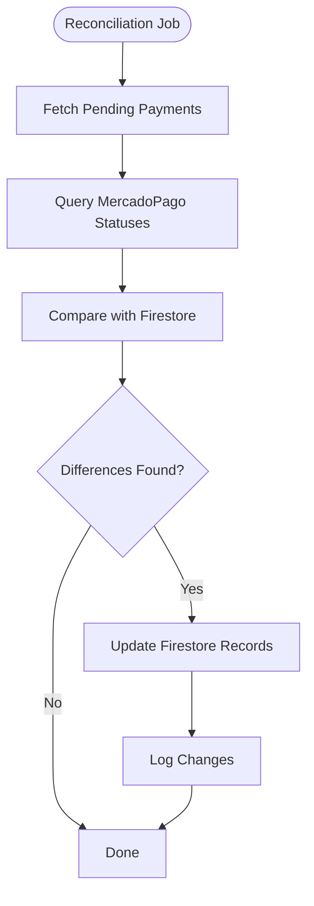
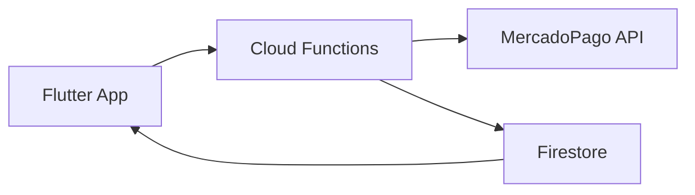

# Payment Processing

<cite>
**Referenced Files in This Document**
- [churchMercadoPago.js](file://functions/lib/churchMercadoPago.js)
- [churchMercadoPago.ts](file://functions/src/churchMercadoPago.ts)
- [syncChurchMercadoPagoCluster.js](file://functions/lib/syncChurchMercadoPagoCluster.js)
- [syncChurchMercadoPagoCluster.ts](file://functions/src/syncChurchMercadoPagoCluster.ts)
- [seed-mercado-pago.js](file://scripts/seed-mercado-pago.js)
- [seed-church-mercado-pago-tenant.mjs](file://scripts/seed-church-mercado-pago-tenant.mjs)
- [README.md](file://flutter_app/README.md)
- [pubspec.yaml](file://flutter_app/pubspec.yaml)
- [firestore.rules](file://firestore.rules)
</cite>

## Table of Contents
1. [Introduction](#introduction)
2. [Project Structure](#project-structure)
3. [Core Components](#core-components)
4. [Architecture Overview](#architecture-overview)
5. [Detailed Component Analysis](#detailed-component-analysis)
6. [Dependency Analysis](#dependency-analysis)
7. [Performance Considerations](#performance-considerations)
8. [Troubleshooting Guide](#troubleshooting-guide)
9. [Conclusion](#conclusion)
10. [Appendices](#appendices)

## Introduction
This document provides comprehensive payment processing documentation for the Gestão Yahweh Premium application with MercadoPago integration. It covers the end-to-end payment workflow, including payment method configuration, transaction processing, webhook handling, and reconciliation. It also explains secure payment form implementation, PCI compliance considerations, and best practices for error handling and retries. The guide details how credit cards, bank transfers, and PIX payments are processed via the MercadoPago API, and includes examples for donations, recurring payments, refunds, and status synchronization.

## Project Structure
The payment system spans three main areas:
- Flutter app (client): Secure UI flows and client-side interactions with backend services.
- Cloud Functions (backend): Server-side orchestration for payment creation, webhook verification, and reconciliation.
- Scripts: Seed and provisioning utilities to configure tenants and MercadoPago settings.

**Diagram sources**
- [churchMercadoPago.js](file://functions/lib/churchMercadoPago.js)
- [churchMercadoPago.ts](file://functions/src/churchMercadoPago.ts)
- [syncChurchMercadoPagoCluster.js](file://functions/lib/syncChurchMercadoPagoCluster.js)
- [syncChurchMercadoPagoCluster.ts](file://functions/src/syncChurchMercadoPagoCluster.ts)

**Section sources**
- [README.md](file://flutter_app/README.md)
- [pubspec.yaml](file://flutter_app/pubspec.yaml)

## Core Components
- churchMercadoPago (JS/TS): Backend bridge that creates payment orders, manages preferences, and handles webhook signatures and payloads from MercadoPago.
- syncChurchMercadoPagoCluster (JS/TS): Background job or callable function to reconcile payment statuses and synchronize cluster data between Firestore and MercadoPago.
- Seed scripts: Initialize tenant-specific MercadoPago configurations and seed necessary data for multi-tenant operation.

Key responsibilities:
- Create payment preferences and order references securely on the server.
- Validate webhooks using MercadoPago signatures.
- Update Firestore documents with authoritative payment states.
- Provide idempotent operations for retries and reconciliation.

**Section sources**
- [churchMercadoPago.js](file://functions/lib/churchMercadoPago.js)
- [churchMercadoPago.ts](file://functions/src/churchMercadoPago.ts)
- [syncChurchMercadoPagoCluster.js](file://functions/lib/syncChurchMercadoPagoCluster.js)
- [syncChurchMercadoPagoCluster.ts](file://functions/src/syncChurchMercadoPagoCluster.ts)
- [seed-mercado-pago.js](file://scripts/seed-mercado-pago.js)
- [seed-church-mercado-pago-tenant.mjs](file://scripts/seed-church-mercado-pago-tenant.mjs)

## Architecture Overview
The payment architecture follows a secure, server-centric model:
- The Flutter app collects minimal payment data and delegates sensitive operations to Cloud Functions.
- Cloud Functions interact with MercadoPago APIs to create payment preferences and process transactions.
- Webhooks from MercadoPago are verified and used to update Firestore records.
- A reconciliation process ensures consistency between external payment states and internal records.

**Diagram sources**
- [churchMercadoPago.js](file://functions/lib/churchMercadoPago.js)
- [churchMercadoPago.ts](file://functions/src/churchMercadoPago.ts)
- [syncChurchMercadoPagoCluster.js](file://functions/lib/syncChurchMercadoPagoCluster.js)
- [syncChurchMercadoPagoCluster.ts](file://functions/src/syncChurchMercadoPagoCluster.ts)

## Detailed Component Analysis

### Payment Gateway Bridge (churchMercadoPago)
Responsibilities:
- Create payment preferences and order references securely.
- Handle webhook endpoints for MercadoPago events.
- Validate webhook signatures and enforce idempotency.
- Persist payment state changes to Firestore.

Implementation patterns:
- Use server-side credentials only; never expose secrets to clients.
- Enforce input validation and authorization checks before calling MercadoPago.
- Implement retry logic with exponential backoff for transient errors.
- Maintain audit logs for all payment-related actions.

**Diagram sources**
- [churchMercadoPago.js](file://functions/lib/churchMercadoPago.js)
- [churchMercadoPago.ts](file://functions/src/churchMercadoPago.ts)

**Section sources**
- [churchMercadoPago.js](file://functions/lib/churchMercadoPago.js)
- [churchMercadoPago.ts](file://functions/src/churchMercadoPago.ts)

### Reconciliation Service (syncChurchMercadoPagoCluster)
Responsibilities:
- Periodically fetch payment statuses from MercadoPago.
- Compare with local Firestore records and reconcile discrepancies.
- Ensure eventual consistency across systems.

Processing logic:
- Batch queries to minimize API calls.
- Idempotent updates to prevent duplicate writes.
- Error logging and alerting for failed reconciliations.

**Diagram sources**
- [syncChurchMercadoPagoCluster.js](file://functions/lib/syncChurchMercadoPagoCluster.js)
- [syncChurchMercadoPagoCluster.ts](file://functions/src/syncChurchMercadoPagoCluster.ts)

**Section sources**
- [syncChurchMercadoPagoCluster.js](file://functions/lib/syncChurchMercadoPagoCluster.js)
- [syncChurchMercadoPagoCluster.ts](file://functions/src/syncChurchMercadoPagoCluster.ts)

### Seed and Tenant Provisioning
Purpose:
- Configure MercadoPago credentials per tenant.
- Seed initial payment methods and default settings.
- Prepare Firestore structures for payment tracking.

Operational notes:
- Run during tenant onboarding or migration.
- Validate environment variables and permissions.
- Ensure idempotent execution to avoid overwriting existing configs.

**Section sources**
- [seed-mercado-pago.js](file://scripts/seed-mercado-pago.js)
- [seed-church-mercado-pago-tenant.mjs](file://scripts/seed-church-mercado-pago-tenant.mjs)

## Dependency Analysis
The payment system depends on:
- MercadoPago API for payment processing and webhooks.
- Firestore for persistent storage and real-time updates.
- Firebase Security Rules to enforce access control.

**Diagram sources**
- [firestore.rules](file://firestore.rules)
- [churchMercadoPago.js](file://functions/lib/churchMercadoPago.js)
- [churchMercadoPago.ts](file://functions/src/churchMercadoPago.ts)
- [syncChurchMercadoPagoCluster.js](file://functions/lib/syncChurchMercadoPagoCluster.js)
- [syncChurchMercadoPagoCluster.ts](file://functions/src/syncChurchMercadoPagoCluster.ts)

**Section sources**
- [firestore.rules](file://firestore.rules)

## Performance Considerations
- Minimize client-server round trips by batching requests where possible.
- Use idempotency keys to safely retry operations without side effects.
- Cache non-sensitive configuration data locally when appropriate.
- Implement exponential backoff and circuit breakers for external API calls.
- Monitor webhook delivery latency and reconcile promptly.

[No sources needed since this section provides general guidance]

## Troubleshooting Guide
Common issues and resolutions:
- Webhook signature verification failures: Ensure correct secret key and timestamp handling.
- Duplicate payment records: Verify idempotency logic and deduplication keys.
- Inconsistent states: Trigger reconciliation jobs and check logs for discrepancies.
- API rate limits: Implement throttling and retry strategies.

Best practices:
- Log all payment events with correlation IDs.
- Validate inputs rigorously on both client and server.
- Use structured logging and centralized monitoring.

**Section sources**
- [churchMercadoPago.js](file://functions/lib/churchMercadoPago.js)
- [churchMercadoPago.ts](file://functions/src/churchMercadoPago.ts)
- [syncChurchMercadoPagoCluster.js](file://functions/lib/syncChurchMercadoPagoCluster.js)
- [syncChurchMercadoPagoCluster.ts](file://functions/src/syncChurchMercadoPagoCluster.ts)

## Conclusion
The Gestão Yahweh Premium payment system leverages MercadoPago through secure Cloud Functions to handle transactions, webhooks, and reconciliation. By adhering to PCI-compliant practices, implementing robust error handling, and maintaining consistent data states, the application ensures reliable and secure payment processing for donations, recurring payments, and refunds.

[No sources needed since this section summarizes without analyzing specific files]

## Appendices

### Payment Method Configuration
- Credit Cards: Supported via MercadoPago’s hosted fields or redirect flow.
- Bank Transfers: Processed through MercadoPago’s boleto or bank slip options.
- PIX: Instant payments enabled via MercadoPago’s PIX integration.

### Transaction Processing Examples
- Donations: One-time payments with optional recurring setup.
- Recurring Payments: Subscription management via MercadoPago plans.
- Refunds: Partial or full refunds initiated through backend functions.
- Status Synchronization: Real-time updates via webhooks and periodic reconciliation.

### Security and PCI Compliance
- Never store sensitive card data on client devices.
- Use tokenization and hosted payment forms provided by MercadoPago.
- Enforce HTTPS and validate all incoming requests.
- Rotate API keys and secrets regularly.

[No sources needed since this section provides general guidance]