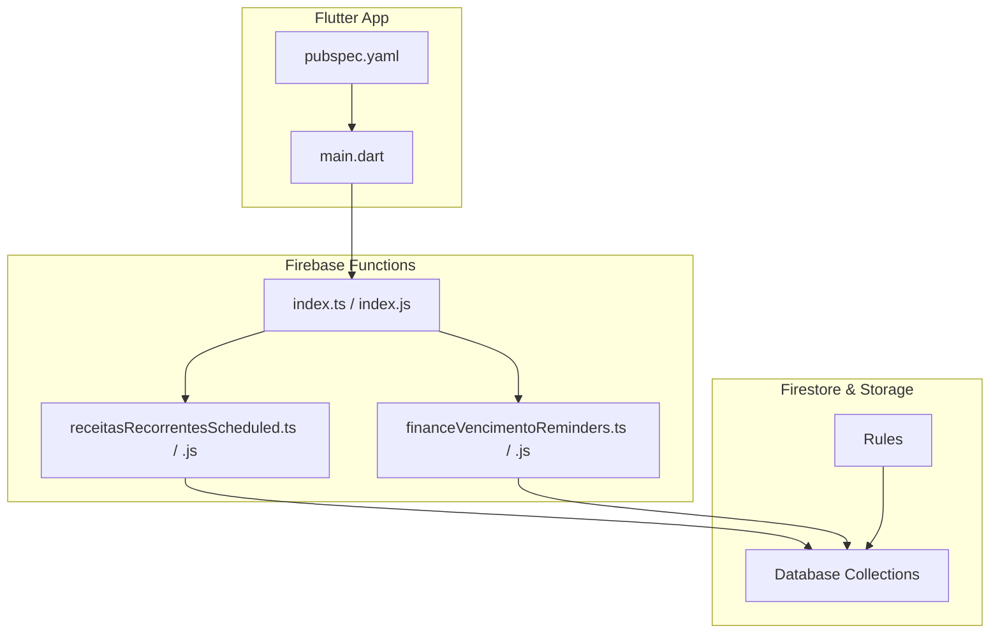
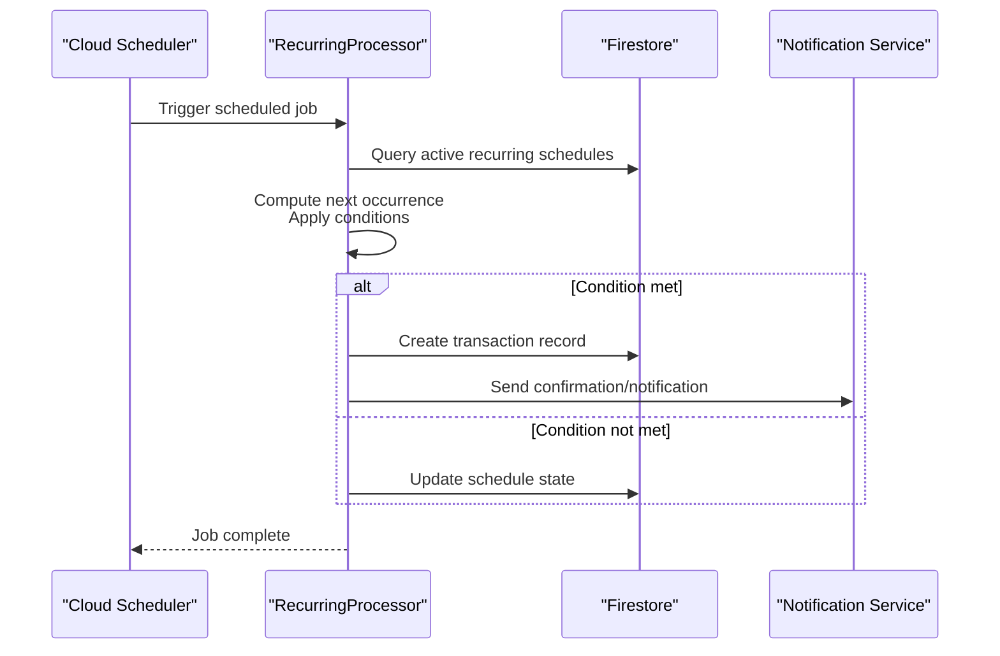
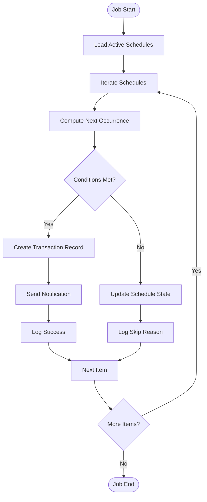
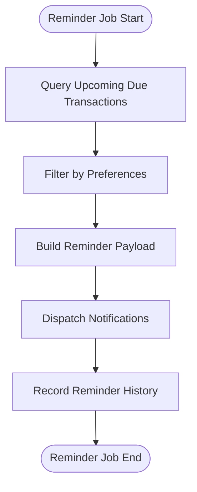
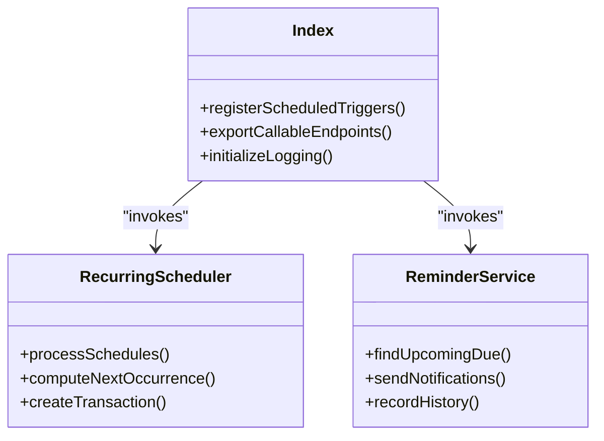
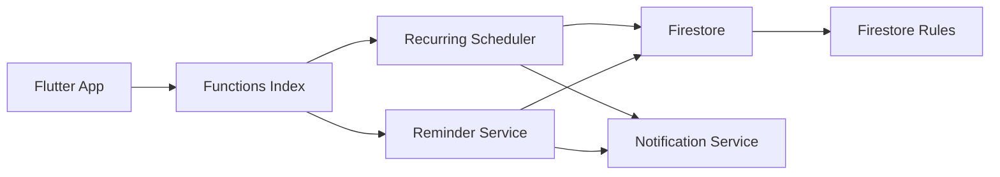

# Recurring Transactions

<cite>
**Referenced Files in This Document**
- [receitasRecorrentesScheduled.js](file://functions/lib/receitasRecorrentesScheduled.js)
- [receitasRecorrentesScheduled.ts](file://functions/src/receitasRecorrentesScheduled.ts)
- [financeVencimentoReminders.js](file://functions/lib/financeVencimentoReminders.js)
- [financeVencimentoReminders.ts](file://functions/src/financeVencimentoReminders.ts)
- [index.js](file://functions/lib/index.js)
- [index.ts](file://functions/src/index.ts)
- [firebase.json](file://firebase.json)
- [firestore.rules](file://firestore.rules)
- [pubspec.yaml](file://flutter_app/pubspec.yaml)
- [main.dart](file://flutter_app/lib/main.dart)
</cite>

## Table of Contents
1. [Introduction](#introduction)
2. [Project Structure](#project-structure)
3. [Core Components](#core-components)
4. [Architecture Overview](#architecture-overview)
5. [Detailed Component Analysis](#detailed-component-analysis)
6. [Dependency Analysis](#dependency-analysis)
7. [Performance Considerations](#performance-considerations)
8. [Troubleshooting Guide](#troubleshooting-guide)
9. [Conclusion](#conclusion)
10. [Appendices](#appendices)

## Introduction
This document explains the recurring transactions automation system for Gestão Yahweh Premium. It covers scheduled financial operations such as donations, pledges, and regular payments. The system uses Firebase Cloud Functions to implement cron-like scheduling, transaction scheduling algorithms, reminder systems, and administrative controls. It also documents configuration of recurring patterns (daily, weekly, monthly, yearly), conditional logic, exception handling, notifications, history tracking, and operational best practices.

## Project Structure
The recurring transactions feature spans three main layers:
- Flutter app layer: UI and local orchestration for creating and managing recurring schedules.
- Firebase Cloud Functions: server-side schedulers and processors that execute recurring tasks and reminders.
- Firestore rules and configuration: access control and deployment configuration for functions.

**Diagram sources**
- [main.dart](file://flutter_app/lib/main.dart)
- [pubspec.yaml](file://flutter_app/pubspec.yaml)
- [index.ts](file://functions/src/index.ts)
- [receitasRecorrentesScheduled.ts](file://functions/src/receitasRecorrentesScheduled.ts)
- [financeVencimentoReminders.ts](file://functions/src/financeVencimentoReminders.ts)
- [firestore.rules](file://firestore.rules)

**Section sources**
- [firebase.json](file://firebase.json)
- [firestore.rules](file://firestore.rules)
- [pubspec.yaml](file://flutter_app/pubspec.yaml)
- [main.dart](file://flutter_app/lib/main.dart)

## Core Components
- Scheduled Recurring Revenue Processor: Executes periodic creation of donation and payment records based on configured recurrence patterns.
- Finance Due Reminders: Identifies upcoming due dates and sends reminders to members or administrators.
- Function Index: Registers and exports scheduled triggers and callable endpoints used by the app.
- App Entry and Dependencies: Initializes services and declares dependencies required for background processing and networking.

Key responsibilities:
- Parse and validate recurrence configurations.
- Compute next execution times using daily/weekly/monthly/yearly patterns.
- Apply conditional logic (e.g., member status, pledge fulfillment).
- Create transaction records and update counters.
- Send notifications via push/email when needed.
- Track history and audit trails.
- Handle failures with retries and error logging.

**Section sources**
- [receitasRecorrentesScheduled.ts](file://functions/src/receitasRecorrentesScheduled.ts)
- [financeVencimentoReminders.ts](file://functions/src/financeVencimentoReminders.ts)
- [index.ts](file://functions/src/index.ts)
- [pubspec.yaml](file://flutter_app/pubspec.yaml)
- [main.dart](file://flutter_app/lib/main.dart)

## Architecture Overview
The recurring transactions architecture follows a scheduler-driven pipeline:
- Scheduling: Cloud Functions schedule periodic jobs (cron-like) to run at defined intervals.
- Processing: Each job queries pending schedules, computes next occurrences, and creates transactions where applicable.
- Notifications: Reminder jobs scan upcoming due dates and send alerts.
- Persistence: All actions are recorded in Firestore collections with timestamps and statuses.
- Controls: Admins can enable/disable schedules, adjust patterns, and review logs.

**Diagram sources**
- [receitasRecorrentesScheduled.ts](file://functions/src/receitasRecorrentesScheduled.ts)
- [financeVencimentoReminders.ts](file://functions/src/financeVencimentoReminders.ts)
- [index.ts](file://functions/src/index.ts)

## Detailed Component Analysis

### Recurring Revenue Scheduler
Purpose:
- Execute recurring financial transactions according to configured patterns.
- Ensure idempotency and avoid duplicate transactions.
- Support conditional logic (member eligibility, pledge milestones).

Processing flow:
- Load active schedules filtered by tenant/church context.
- For each schedule, compute next due date based on pattern.
- Evaluate conditions (status checks, thresholds).
- If eligible, create a transaction and update schedule metadata.
- Log outcomes and handle errors with retry/backoff strategies.

**Diagram sources**
- [receitasRecorrentesScheduled.ts](file://functions/src/receitasRecorrentesScheduled.ts)

**Section sources**
- [receitasRecorrentesScheduled.ts](file://functions/src/receitasRecorrentesScheduled.ts)
- [receitasRecorrentesScheduled.js](file://functions/lib/receitasRecorrentesScheduled.js)

### Finance Due Reminders
Purpose:
- Identify transactions nearing due dates.
- Send timely reminders to members or admins.
- Maintain reminder history and escalation paths.

Reminder algorithm:
- Query transactions with upcoming due dates within a threshold window.
- Filter by notification preferences and channels (push/email).
- Generate reminder payloads and dispatch via notification service.
- Record reminder events and update reminder counters.

**Diagram sources**
- [financeVencimentoReminders.ts](file://functions/src/financeVencimentoReminders.ts)

**Section sources**
- [financeVencimentoReminders.ts](file://functions/src/financeVencimentoReminders.ts)
- [financeVencimentoReminders.js](file://functions/lib/financeVencimentoReminders.js)

### Function Index and Triggers
Purpose:
- Register scheduled functions and callable endpoints.
- Provide centralized entry points for recurring processes.

Responsibilities:
- Export scheduled triggers for revenue processing and reminders.
- Expose callable functions for admin controls (enable/disable schedules, adjust patterns).
- Initialize logging and error reporting.

**Diagram sources**
- [index.ts](file://functions/src/index.ts)
- [index.js](file://functions/lib/index.js)

**Section sources**
- [index.ts](file://functions/src/index.ts)
- [index.js](file://functions/lib/index.js)

### App Entry and Dependencies
Purpose:
- Initialize core services and declare dependencies for background tasks.
- Configure network, storage, and messaging integrations.

Responsibilities:
- Set up Firebase initialization and environment settings.
- Declare plugins for notifications, analytics, and data sync.
- Prepare UI routes for recurring schedule management.

**Section sources**
- [main.dart](file://flutter_app/lib/main.dart)
- [pubspec.yaml](file://flutter_app/pubspec.yaml)

## Dependency Analysis
- Cloud Functions depend on Firestore for reading schedules and writing transactions/reminders.
- Notification services are invoked conditionally based on user preferences.
- App layer depends on pubspec dependencies for networking and background tasks.
- Rules enforce secure access to collections related to schedules and transactions.

**Diagram sources**
- [index.ts](file://functions/src/index.ts)
- [receitasRecorrentesScheduled.ts](file://functions/src/receitasRecorrentesScheduled.ts)
- [financeVencimentoReminders.ts](file://functions/src/financeVencimentoReminders.ts)
- [firestore.rules](file://firestore.rules)

**Section sources**
- [firestore.rules](file://firestore.rules)
- [pubspec.yaml](file://flutter_app/pubspec.yaml)

## Performance Considerations
- Batch reads/writes to minimize Firestore operations per job.
- Use indexes on frequently queried fields (due dates, status, tenant IDs).
- Implement exponential backoff for external API calls (notifications, payment gateways).
- Avoid heavy computations inside scheduled jobs; offload to async workers if necessary.
- Cache static configuration to reduce repeated reads.

[No sources needed since this section provides general guidance]

## Troubleshooting Guide
Common issues and resolutions:
- Missing schedules: Verify collection names and filters; ensure tenant context is correct.
- Duplicate transactions: Confirm idempotency keys and deduplication logic.
- Failed notifications: Check notification preferences and service credentials; log payload details.
- Rule denials: Validate Firestore rules for read/write permissions on relevant collections.
- Performance bottlenecks: Review query complexity and add appropriate indexes.

Operational steps:
- Inspect function logs for errors and stack traces.
- Re-run failed jobs with debug flags.
- Temporarily disable problematic schedules to stabilize the system.
- Audit transaction history for anomalies.

**Section sources**
- [receitasRecorrentesScheduled.ts](file://functions/src/receitasRecorrentesScheduled.ts)
- [financeVencimentoReminders.ts](file://functions/src/financeVencimentoReminders.ts)
- [firestore.rules](file://firestore.rules)

## Conclusion
The recurring transactions system automates financial operations through robust scheduling, conditional logic, and reliable reminders. By leveraging Firebase Cloud Functions and Firestore, it ensures accurate, auditable, and scalable processing of donations, pledges, and payments. Administrators retain full control over schedules, while users receive timely notifications and transparent history tracking.

[No sources needed since this section summarizes without analyzing specific files]

## Appendices

### Configuration of Recurring Patterns
- Daily: Execute every calendar day at a specified time.
- Weekly: Execute on specific weekdays; consider timezone alignment.
- Monthly: Execute on a specific day; handle month-end edge cases.
- Yearly: Execute on an anniversary date; leap year considerations.

Best practices:
- Store recurrence rules as structured objects with clear fields.
- Normalize timezones and daylight saving transitions.
- Validate patterns before enabling schedules.

[No sources needed since this section provides general guidance]

### Conditional Logic Examples
- Member status checks (active/inactive).
- Pledge milestone thresholds (percentage fulfilled).
- Payment method availability and validation.
- Tenant-specific business rules.

[No sources needed since this section provides general guidance]

### Exception Handling Strategies
- Retry with exponential backoff for transient failures.
- Dead-letter queues for persistent errors.
- Comprehensive logging with contextual metadata.
- Graceful degradation when external services are unavailable.

[No sources needed since this section provides general guidance]

### Notification Systems
- Push notifications for mobile/web users.
- Email reminders for desktop/admin workflows.
- In-app messages for immediate visibility.
- Escalation policies for unresolved reminders.

[No sources needed since this section provides general guidance]

### Transaction History Tracking
- Immutable audit entries for all created transactions.
- Status transitions and reason codes.
- Aggregated summaries for reporting dashboards.
- Searchable indices by date, member, and type.

[No sources needed since this section provides general guidance]

### Administrative Controls
- Enable/disable individual schedules.
- Adjust recurrence patterns dynamically.
- View execution logs and outcomes.
- Bulk operations for maintenance tasks.

[No sources needed since this section provides general guidance]