# Transaction Management

<cite>
**Referenced Files in This Document**
- [lib/models/finance.dart](file://flutter_app/lib/models/finance.dart)
- [lib/repositories/transaction_repository.dart](file://flutter_app/lib/repositories/transaction_repository.dart)
- [lib/services/transaction_service.dart](file://flutter_app/lib/services/transaction_service.dart)
- [lib/pages/transactions_page.dart](file://flutter_app/lib/pages/transactions_page.dart)
- [functions/src/panelFinanceSummary.ts](file://functions/src/panelFinanceSummary.ts)
- [functions/src/panelFinanceAccountsCache.ts](file://functions/src/panelFinanceAccountsCache.ts)
- [firestore.rules](file://firestore.rules)
- [storage.rules](file://storage.rules)
</cite>

## Table of Contents
1. [Introduction](#introduction)
2. [Project Structure](#project-structure)
3. [Core Components](#core-components)
4. [Architecture Overview](#architecture-overview)
5. [Detailed Component Analysis](#detailed-component-analysis)
6. [Dependency Analysis](#dependency-analysis)
7. [Performance Considerations](#performance-considerations)
8. [Troubleshooting Guide](#troubleshooting-guide)
9. [Conclusion](#conclusion)
10. [Appendices](#appendices)

## Introduction
This document explains the transaction management subsystem of the Gestão Yahweh Premium application. It covers the full lifecycle of transactions from creation through categorization, validation, and storage; the financial data model including accounts and transaction types; recording interfaces and validation rules; audit trails; attachments and receipts; multi-currency support; search and filtering; and security, integrity, and compliance considerations. The goal is to provide both a high-level understanding and detailed implementation guidance for developers and maintainers.

## Project Structure
The transaction feature spans Flutter UI, repositories, services, models, and Cloud Functions for server-side aggregation and caching. Key areas:
- Models define the financial entities (accounts, transactions, categories).
- Repositories encapsulate persistence logic and synchronization with Firestore.
- Services orchestrate business logic, validation, and cross-cutting concerns.
- Pages implement user flows for creating and managing transactions.
- Cloud Functions precompute summaries and caches for performance.
- Security rules enforce access control and data integrity at the database and storage layers.

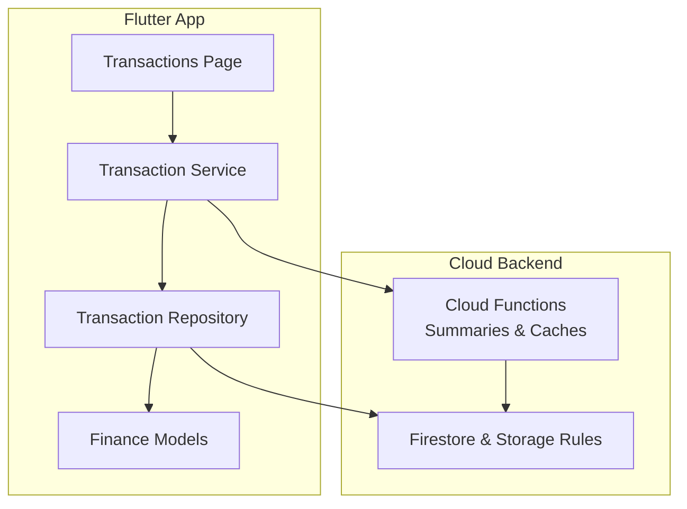

**Diagram sources**
- [lib/pages/transactions_page.dart](file://flutter_app/lib/pages/transactions_page.dart)
- [lib/services/transaction_service.dart](file://flutter_app/lib/services/transaction_service.dart)
- [lib/repositories/transaction_repository.dart](file://flutter_app/lib/repositories/transaction_repository.dart)
- [lib/models/finance.dart](file://flutter_app/lib/models/finance.dart)
- [functions/src/panelFinanceSummary.ts](file://functions/src/panelFinanceSummary.ts)
- [functions/src/panelFinanceAccountsCache.ts](file://functions/src/panelFinanceAccountsCache.ts)
- [firestore.rules](file://firestore.rules)
- [storage.rules](file://storage.rules)

**Section sources**
- [lib/models/finance.dart](file://flutter_app/lib/models/finance.dart)
- [lib/repositories/transaction_repository.dart](file://flutter_app/lib/repositories/transaction_repository.dart)
- [lib/services/transaction_service.dart](file://flutter_app/lib/services/transaction_service.dart)
- [lib/pages/transactions_page.dart](file://flutter_app/lib/pages/transactions_page.dart)
- [functions/src/panelFinanceSummary.ts](file://functions/src/panelFinanceSummary.ts)
- [functions/src/panelFinanceAccountsCache.ts](file://functions/src/panelFinanceAccountsCache.ts)
- [firestore.rules](file://firestore.rules)
- [storage.rules](file://storage.rules)

## Core Components
- Financial Data Model
  - Accounts represent bank accounts, cash, credit cards, and other financial instruments.
  - Transactions capture income, expenses, and transfers with metadata such as date, amount, currency, category, and notes.
  - Categories organize transactions into meaningful groups (e.g., salaries, utilities, donations).
  - Attachments store receipts or supporting documents linked to transactions.
- Transaction Types
  - Income increases account balances.
  - Expenses decrease account balances.
  - Transfers move amounts between accounts without changing net worth.
- Categorization System
  - Hierarchical or flat categories with optional tags for granular classification.
  - Category assignments are validated against allowed sets per tenant or organization.
- Recording Interfaces
  - User-facing forms for quick entry and advanced editing.
  - Programmatic APIs for imports and integrations.
- Validation Rules
  - Amount must be non-negative for income/expenses; transfer amounts must match source and destination sides.
  - Dates must be valid and within permitted ranges.
  - Currency codes must be ISO-compliant; exchange rates applied when needed.
  - Required fields enforced based on transaction type.
- Audit Trails
  - Immutable logs of create, update, and delete operations.
  - Metadata includes actor, timestamp, and change diffs where applicable.
- Multi-Currency Support
  - Store original currency and amount; compute normalized values using exchange rates.
  - Display and reporting use consistent normalization.
- Search and Filtering
  - Filter by date range, account, category, type, currency, and keywords.
  - Indexes optimize query performance.

**Section sources**
- [lib/models/finance.dart](file://flutter_app/lib/models/finance.dart)
- [lib/repositories/transaction_repository.dart](file://flutter_app/lib/repositories/transaction_repository.dart)
- [lib/services/transaction_service.dart](file://flutter_app/lib/services/transaction_service.dart)
- [lib/pages/transactions_page.dart](file://flutter_app/lib/pages/transactions_page.dart)
- [functions/src/panelFinanceSummary.ts](file://functions/src/panelFinanceSummary.ts)
- [functions/src/panelFinanceAccountsCache.ts](file://functions/src/panelFinanceAccountsCache.ts)
- [firestore.rules](file://firestore.rules)
- [storage.rules](file://storage.rules)

## Architecture Overview
The transaction system follows a layered architecture:
- UI layer collects input and displays results.
- Service layer enforces business rules, orchestrates operations, and handles attachments and multi-currency conversions.
- Repository layer abstracts persistence and sync with Firestore.
- Cloud Functions precompute summaries and caches to accelerate dashboards and reports.
- Security rules ensure only authorized operations occur and data remains consistent.

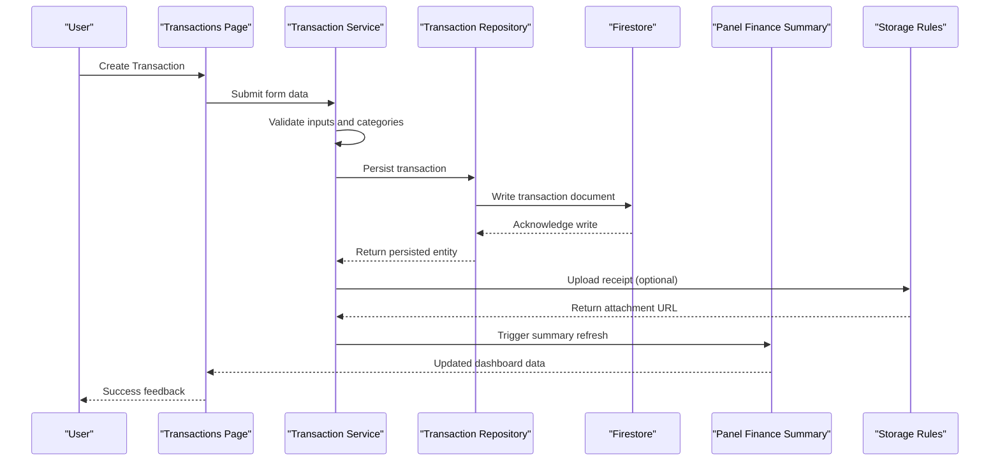

**Diagram sources**
- [lib/pages/transactions_page.dart](file://flutter_app/lib/pages/transactions_page.dart)
- [lib/services/transaction_service.dart](file://flutter_app/lib/services/transaction_service.dart)
- [lib/repositories/transaction_repository.dart](file://flutter_app/lib/repositories/transaction_repository.dart)
- [functions/src/panelFinanceSummary.ts](file://functions/src/panelFinanceSummary.ts)
- [storage.rules](file://storage.rules)

**Section sources**
- [lib/pages/transactions_page.dart](file://flutter_app/lib/pages/transactions_page.dart)
- [lib/services/transaction_service.dart](file://flutter_app/lib/services/transaction_service.dart)
- [lib/repositories/transaction_repository.dart](file://flutter_app/lib/repositories/transaction_repository.dart)
- [functions/src/panelFinanceSummary.ts](file://functions/src/panelFinanceSummary.ts)
- [storage.rules](file://storage.rules)

## Detailed Component Analysis

### Financial Data Model
- Accounts
  - Represent financial instruments with identifiers, names, currencies, and status flags.
  - Support multiple currencies and balance tracking.
- Transactions
  - Include type (income, expense, transfer), amount, currency, date, description, category, and related accounts.
  - For transfers, specify source and destination accounts and matching amounts.
- Categories
  - Define classification trees or lists used to group transactions.
  - May include parent-child relationships and metadata like tax implications.
- Attachments
  - Link media files to transactions for receipts and proofs.
  - Stored securely with access controls and display URLs.

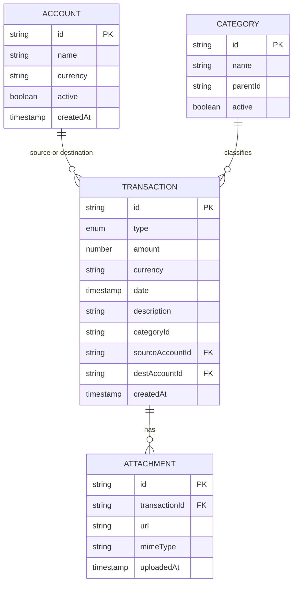

**Diagram sources**
- [lib/models/finance.dart](file://flutter_app/lib/models/finance.dart)

**Section sources**
- [lib/models/finance.dart](file://flutter_app/lib/models/finance.dart)

### Transaction Lifecycle
Creation, categorization, validation, and storage follow a strict flow:
- Input collection via UI forms.
- Validation of required fields, amounts, dates, and categories.
- Persistence to Firestore with atomic writes.
- Optional attachment upload with secure storage.
- Post-write updates to summaries and caches.

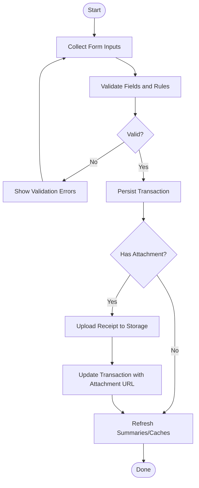

**Diagram sources**
- [lib/pages/transactions_page.dart](file://flutter_app/lib/pages/transactions_page.dart)
- [lib/services/transaction_service.dart](file://flutter_app/lib/services/transaction_service.dart)
- [lib/repositories/transaction_repository.dart](file://flutter_app/lib/repositories/transaction_repository.dart)
- [storage.rules](file://storage.rules)

**Section sources**
- [lib/pages/transactions_page.dart](file://flutter_app/lib/pages/transactions_page.dart)
- [lib/services/transaction_service.dart](file://flutter_app/lib/services/transaction_service.dart)
- [lib/repositories/transaction_repository.dart](file://flutter_app/lib/repositories/transaction_repository.dart)
- [storage.rules](file://storage.rules)

### Transaction Types and Accounting Logic
- Income
  - Increases account balance; categorized under revenue sources.
- Expense
  - Decreases account balance; categorized under cost centers.
- Transfer
  - Debits source account and credits destination account with equal amounts.
  - Ensures consistency across both accounts atomically.

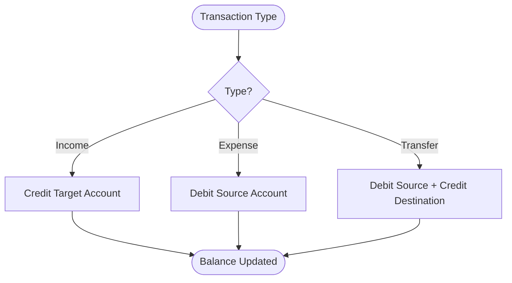

**Diagram sources**
- [lib/services/transaction_service.dart](file://flutter_app/lib/services/transaction_service.dart)
- [lib/repositories/transaction_repository.dart](file://flutter_app/lib/repositories/transaction_repository.dart)

**Section sources**
- [lib/services/transaction_service.dart](file://flutter_app/lib/services/transaction_service.dart)
- [lib/repositories/transaction_repository.dart](file://flutter_app/lib/repositories/transaction_repository.dart)

### Categorization System
- Categories can be hierarchical or flat.
- Validation ensures transactions reference existing, active categories.
- Reports aggregate by category for insights and compliance.

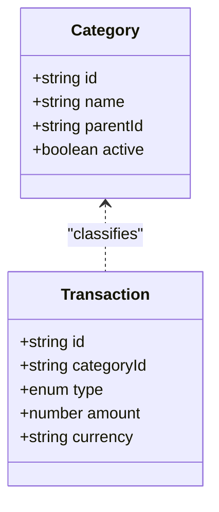

**Diagram sources**
- [lib/models/finance.dart](file://flutter_app/lib/models/finance.dart)

**Section sources**
- [lib/models/finance.dart](file://flutter_app/lib/models/finance.dart)

### Recording Interfaces and Validation Rules
- UI Forms
  - Quick entry for common transactions.
  - Advanced editor for detailed records and attachments.
- Validation Rules
  - Non-negative amounts for income/expenses.
  - Matching amounts for transfers.
  - Valid dates and currencies.
  - Required fields per type.
- Error Handling
  - Immediate feedback for invalid inputs.
  - Retry mechanisms for network failures.

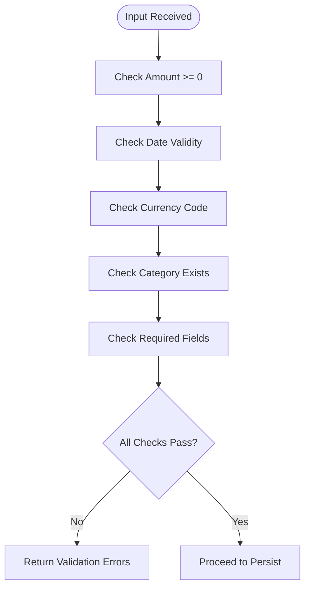

**Diagram sources**
- [lib/services/transaction_service.dart](file://flutter_app/lib/services/transaction_service.dart)
- [lib/pages/transactions_page.dart](file://flutter_app/lib/pages/transactions_page.dart)

**Section sources**
- [lib/services/transaction_service.dart](file://flutter_app/lib/services/transaction_service.dart)
- [lib/pages/transactions_page.dart](file://flutter_app/lib/pages/transactions_page.dart)

### Attachments and Receipts
- Upload Flow
  - Select file, validate MIME type and size.
  - Upload to secure storage with tenant-scoped paths.
  - Store metadata and link to transaction.
- Access Control
  - Enforced via storage rules to restrict unauthorized access.
- Display
  - Generate safe URLs for preview and download.

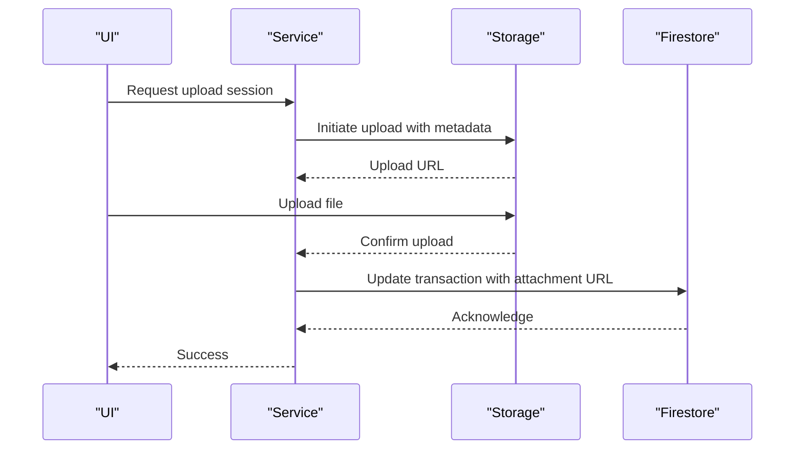

**Diagram sources**
- [lib/services/transaction_service.dart](file://flutter_app/lib/services/transaction_service.dart)
- [storage.rules](file://storage.rules)

**Section sources**
- [lib/services/transaction_service.dart](file://flutter_app/lib/services/transaction_service.dart)
- [storage.rules](file://storage.rules)

### Multi-Currency Transactions
- Original Currency and Amount
  - Always store the original currency and amount.
- Exchange Rates
  - Apply conversion rates for normalized reporting.
- Display
  - Show original and converted values as needed.

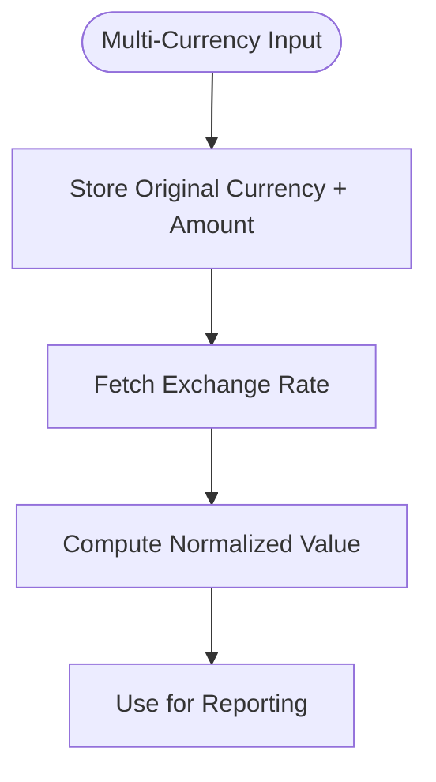

**Diagram sources**
- [lib/models/finance.dart](file://flutter_app/lib/models/finance.dart)
- [lib/services/transaction_service.dart](file://flutter_app/lib/services/transaction_service.dart)

**Section sources**
- [lib/models/finance.dart](file://flutter_app/lib/models/finance.dart)
- [lib/services/transaction_service.dart](file://flutter_app/lib/services/transaction_service.dart)

### Search and Filtering
- Filters
  - Date range, account, category, type, currency, keyword.
- Indexing
  - Firestore indexes optimize queries.
- Performance
  - Paginated results and efficient client-side filtering.

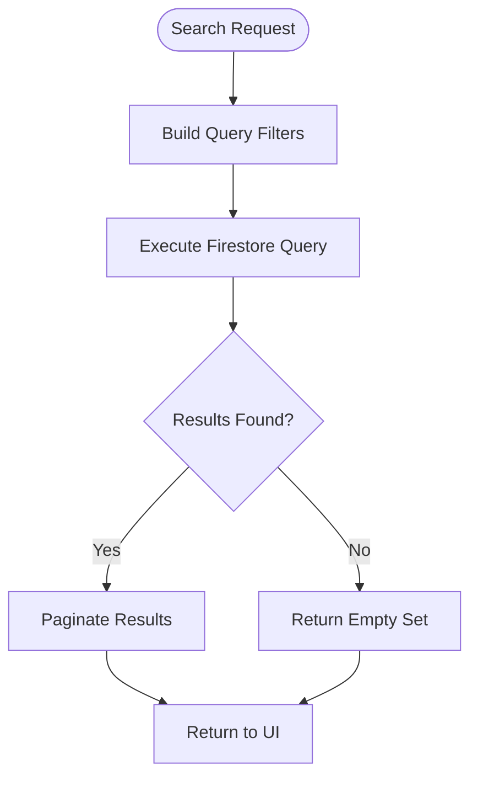

**Diagram sources**
- [lib/repositories/transaction_repository.dart](file://flutter_app/lib/repositories/transaction_repository.dart)

**Section sources**
- [lib/repositories/transaction_repository.dart](file://flutter_app/lib/repositories/transaction_repository.dart)

### Audit Trails
- Immutability
  - Append-only logs for changes.
- Metadata
  - Actor, timestamp, operation type, and diff snapshots.
- Compliance
  - Retention policies and access logging.

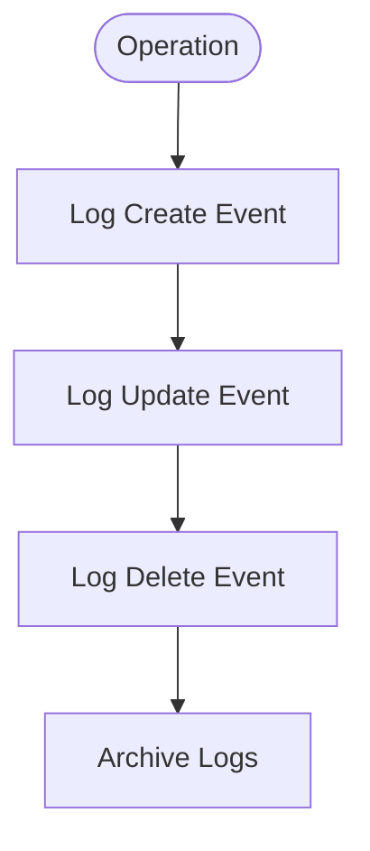

**Diagram sources**
- [lib/services/transaction_service.dart](file://flutter_app/lib/services/transaction_service.dart)

**Section sources**
- [lib/services/transaction_service.dart](file://flutter_app/lib/services/transaction_service.dart)

### Examples of Creating Different Transaction Types
- Income
  - Select account, enter amount, choose category, add note, save.
- Expense
  - Select account, enter amount, choose category, attach receipt, save.
- Transfer
  - Select source and destination accounts, enter amount, confirm matching sides, save.

[No sources needed since this section provides general usage examples]

### Security, Data Integrity, and Compliance
- Access Control
  - Firestore and storage rules enforce tenant isolation and role-based permissions.
- Data Integrity
  - Atomic writes for transfers; validation prevents inconsistent states.
- Compliance
  - Audit logs, retention policies, and secure storage of sensitive data.

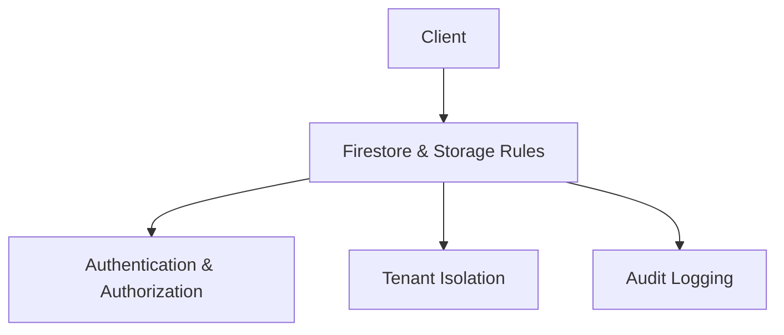

**Diagram sources**
- [firestore.rules](file://firestore.rules)
- [storage.rules](file://storage.rules)

**Section sources**
- [firestore.rules](file://firestore.rules)
- [storage.rules](file://storage.rules)

## Dependency Analysis
The transaction module depends on models, repositories, services, and cloud functions for aggregation and caching. Security rules govern access at the database and storage layers.

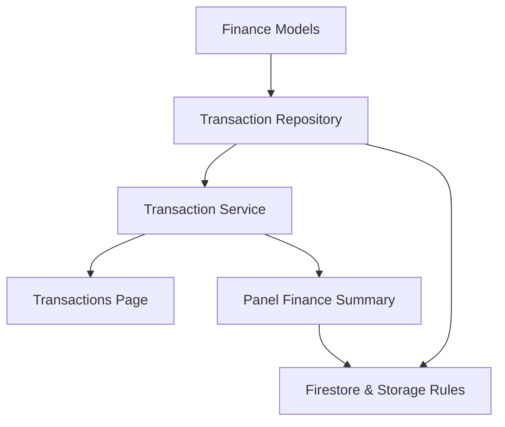

**Diagram sources**
- [lib/models/finance.dart](file://flutter_app/lib/models/finance.dart)
- [lib/repositories/transaction_repository.dart](file://flutter_app/lib/repositories/transaction_repository.dart)
- [lib/services/transaction_service.dart](file://flutter_app/lib/services/transaction_service.dart)
- [lib/pages/transactions_page.dart](file://flutter_app/lib/pages/transactions_page.dart)
- [functions/src/panelFinanceSummary.ts](file://functions/src/panelFinanceSummary.ts)
- [firestore.rules](file://firestore.rules)
- [storage.rules](file://storage.rules)

**Section sources**
- [lib/models/finance.dart](file://flutter_app/lib/models/finance.dart)
- [lib/repositories/transaction_repository.dart](file://flutter_app/lib/repositories/transaction_repository.dart)
- [lib/services/transaction_service.dart](file://flutter_app/lib/services/transaction_service.dart)
- [lib/pages/transactions_page.dart](file://flutter_app/lib/pages/transactions_page.dart)
- [functions/src/panelFinanceSummary.ts](file://functions/src/panelFinanceSummary.ts)
- [firestore.rules](file://firestore.rules)
- [storage.rules](file://storage.rules)

## Performance Considerations
- Precomputed Summaries
  - Cloud Functions generate panel summaries and account caches to reduce client load.
- Indexing
  - Proper Firestore indexes for frequent queries.
- Pagination
  - Limit result sets and implement cursor-based pagination.
- Caching
  - Local cache for recent transactions and categories.

**Section sources**
- [functions/src/panelFinanceSummary.ts](file://functions/src/panelFinanceSummary.ts)
- [functions/src/panelFinanceAccountsCache.ts](file://functions/src/panelFinanceAccountsCache.ts)

## Troubleshooting Guide
- Common Issues
  - Validation errors due to missing or invalid fields.
  - Upload failures for attachments due to size or MIME restrictions.
  - Query timeouts from missing indexes.
- Diagnostics
  - Inspect service logs for validation and persistence errors.
  - Verify storage rules allow uploads and reads.
  - Use Firestore debug tools to check index coverage.
- Resolution Steps
  - Correct input data and retry.
  - Adjust file size or format for attachments.
  - Add required indexes and re-run queries.

**Section sources**
- [lib/services/transaction_service.dart](file://flutter_app/lib/services/transaction_service.dart)
- [storage.rules](file://storage.rules)

## Conclusion
The transaction management subsystem provides a robust, secure, and performant foundation for financial operations in Gestão Yahweh Premium. By enforcing clear data models, validation rules, and audit trails, it supports accurate accounting, compliance, and scalable reporting. Multi-currency handling, attachments, and search capabilities enhance usability while maintaining data integrity and security.

## Appendices
- Best Practices
  - Always validate inputs before persistence.
  - Use atomic writes for transfers.
  - Keep audit logs immutable and retained per policy.
  - Optimize queries with indexes and pagination.
- References
  - Review security rules for access control.
  - Consult cloud functions for summary generation details.

[No sources needed since this section provides general guidance]