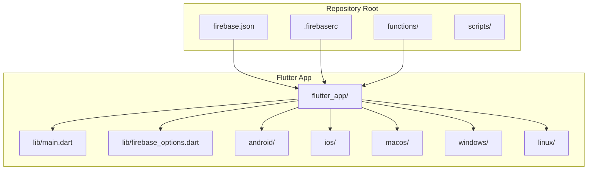
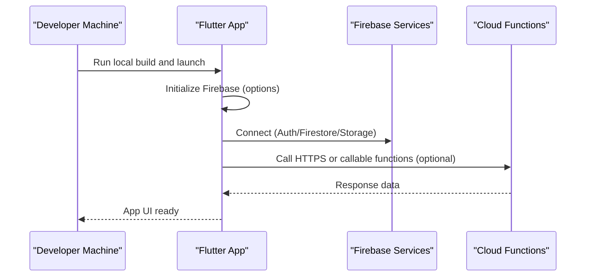
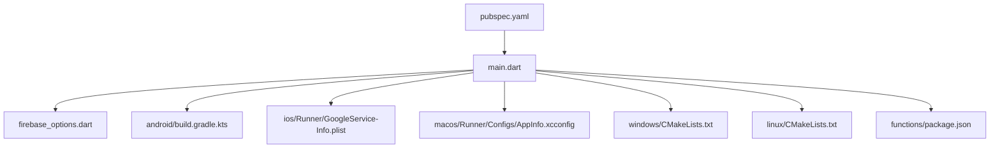

# Getting Started

<cite>
**Referenced Files in This Document**
- [README.md](file://README.md)
- [pubspec.yaml](file://flutter_app/pubspec.yaml)
- [firebase.json](file://flutter_app/firebase.json)
- [.firebaserc](file://flutter_app/.firebaserc)
- [main.dart](file://flutter_app/lib/main.dart)
- [firebase_options.dart](file://flutter_app/lib/firebase_options.dart)
- [android/build.gradle.kts](file://flutter_app/android/build.gradle.kts)
- [android/app/google-services.json](file://flutter_app/android/app/google-services.json)
- [ios/Runner/GoogleService-Info.plist](file://flutter_app/ios/Runner/GoogleService-Info.plist)
- [macos/Runner/Configs/AppInfo.xcconfig](file://flutter_app/macos/Runner/Configs/AppInfo.xcconfig)
- [windows/CMakeLists.txt](file://flutter_app/windows/CMakeLists.txt)
- [linux/CMakeLists.txt](file://flutter_app/linux/CMakeLists.txt)
- [functions/package.json](file://functions/package.json)
- [functions/index.ts](file://functions/index.ts)
- [scripts/setup_dev_machine_windows.ps1](file://scripts/setup_dev_machine_windows.ps1)
- [DEPLOY_WINDOWS.bat](file://DEPLOY_WINDOWS.bat)
- [DEPLOY_MAC_LINUX.sh](file://DEPLOY_MAC_LINUX.sh)
- [RUN_SETUP_WINDOWS.bat](file://RUN_SETUP_WINDOWS.bat)
</cite>

## Table of Contents
1. [Introduction](#introduction)
2. [Project Structure](#project-structure)
3. [Core Components](#core-components)
4. [Architecture Overview](#architecture-overview)
5. [Detailed Component Analysis](#detailed-component-analysis)
6. [Dependency Analysis](#dependency-analysis)
7. [Performance Considerations](#performance-considerations)
8. [Troubleshooting Guide](#troubleshooting-guide)
9. [Conclusion](#conclusion)
10. [Appendices](#appendices)

## Introduction
This guide helps you set up and run the Gestão Yahweh Premium application from source on Windows, macOS, and Linux. You will install prerequisites (Flutter SDK, Firebase CLI, platform toolchains), configure Firebase for your project, build and run the app locally, and verify that everything works. The guide is beginner-friendly but includes all necessary technical details to ensure a smooth setup.

## Project Structure
The repository contains:
- A Flutter application under flutter_app/
- Cloud Functions under functions/
- Platform-specific native configurations for Android, iOS, macOS, Windows, and Linux
- Deployment and automation scripts at the repository root

**Diagram sources**
- [firebase.json](file://flutter_app/firebase.json)
- [.firebaserc](file://flutter_app/.firebaserc)
- [main.dart](file://flutter_app/lib/main.dart)
- [firebase_options.dart](file://flutter_app/lib/firebase_options.dart)

**Section sources**
- [README.md](file://README.md)
- [pubspec.yaml](file://flutter_app/pubspec.yaml)

## Core Components
- Flutter application entry point initializes Firebase and starts the UI.
- Firebase configuration is provided via generated options and platform-specific files.
- Cloud Functions provide backend logic and integrations.
- Platform folders contain native build configurations required by Flutter.

Key responsibilities:
- Initialization and environment setup are handled by the Flutter app’s main entry and Firebase options.
- Firebase project linkage uses .firebaserc and firebase.json.
- Android requires google-services.json; iOS/macOS require GoogleService-Info.plist; web/desktop use firebase.json settings.

**Section sources**
- [main.dart](file://flutter_app/lib/main.dart)
- [firebase_options.dart](file://flutter_app/lib/firebase_options.dart)
- [firebase.json](file://flutter_app/firebase.json)
- [.firebaserc](file://flutter_app/.firebaserc)
- [android/app/google-services.json](file://flutter_app/android/app/google-services.json)
- [ios/Runner/GoogleService-Info.plist](file://flutter_app/ios/Runner/GoogleService-Info.plist)
- [functions/package.json](file://functions/package.json)
- [functions/index.ts](file://functions/index.ts)

## Architecture Overview
At runtime, the Flutter app initializes Firebase using platform-specific configuration files and connects to Firebase services (Auth, Firestore, Storage, Hosting). Cloud Functions extend backend capabilities and can be deployed independently.

**Diagram sources**
- [main.dart](file://flutter_app/lib/main.dart)
- [firebase_options.dart](file://flutter_app/lib/firebase_options.dart)
- [firebase.json](file://flutter_app/firebase.json)
- [functions/index.ts](file://functions/index.ts)

## Detailed Component Analysis

### Prerequisites
Before starting, ensure you have:
- Flutter SDK installed and available in PATH
- Dart support in your IDE (VS Code recommended)
- Firebase CLI installed and authenticated
- Platform toolchains:
  - Android: Android Studio with SDK, emulator, and Gradle
  - iOS/macOS: Xcode and command-line tools
  - Windows: Windows SDK and CMake
  - Linux: CMake, Ninja, and desktop dependencies

Verify Flutter installation and connected devices/emulators/simulators.

**Section sources**
- [pubspec.yaml](file://flutter_app/pubspec.yaml)
- [scripts/setup_dev_machine_windows.ps1](file://scripts/setup_dev_machine_windows.ps1)

### Installation Steps

#### Windows
1. Open PowerShell as Administrator.
2. Run the development machine setup script to install common dependencies.
3. Install Flutter and add it to PATH if not already done.
4. Install Android Studio and required components.
5. Navigate to flutter_app/ and run:
   - flutter pub get
   - flutter doctor
6. Link Firebase project:
   - firebase login
   - firebase use --add (select your project)
7. Ensure android/app/google-services.json exists and matches your Firebase project.
8. Build and run:
   - flutter build apk --debug
   - flutter run

**Section sources**
- [scripts/setup_dev_machine_windows.ps1](file://scripts/setup_dev_machine_windows.ps1)
- [DEPLOY_WINDOWS.bat](file://DEPLOY_WINDOWS.bat)
- [RUN_SETUP_WINDOWS.bat](file://RUN_SETUP_WINDOWS.bat)
- [android/app/google-services.json](file://flutter_app/android/app/google-services.json)

#### macOS
1. Install Flutter and add to PATH.
2. Install Xcode and command-line tools.
3. Navigate to flutter_app/ and run:
   - flutter pub get
   - flutter doctor
4. Link Firebase project:
   - firebase login
   - firebase use --add
5. Ensure ios/Runner/GoogleService-Info.plist is present and correct.
6. Build and run:
   - flutter build ios --debug
   - flutter run

**Section sources**
- [DEPLOY_MAC_LINUX.sh](file://DEPLOY_MAC_LINUX.sh)
- [ios/Runner/GoogleService-Info.plist](file://flutter_app/ios/Runner/GoogleService-Info.plist)

#### Linux
1. Install Flutter and add to PATH.
2. Install desktop dependencies (CMake, Ninja, etc.).
3. Navigate to flutter_app/ and run:
   - flutter pub get
   - flutter doctor
4. Link Firebase project:
   - firebase login
   - firebase use --add
5. Build and run:
   - flutter build linux --debug
   - flutter run

**Section sources**
- [DEPLOY_MAC_LINUX.sh](file://DEPLOY_MAC_LINUX.sh)
- [linux/CMakeLists.txt](file://flutter_app/linux/CMakeLists.txt)

### Initial Configuration

#### Firebase Project Setup
1. Create a Firebase project in the Firebase console.
2. Add apps for each target platform:
   - Android: download google-services.json and place it at flutter_app/android/app/google-services.json
   - iOS/macOS: download GoogleService-Info.plist and place it at flutter_app/ios/Runner/GoogleService-Info.plist
   - Web: enable Hosting and configure domains in firebase.json
3. Enable required services (Authentication, Firestore, Storage) according to your needs.
4. Configure authentication providers (e.g., Email/Password, Google) in Firebase Console.
5. Set up storage rules and firestore rules as needed.

Link the project locally:
- firebase use --add
- Select your project and alias

Ensure .firebaserc points to the correct project and firebase.json references the hosting/web settings.

**Section sources**
- [.firebaserc](file://flutter_app/.firebaserc)
- [firebase.json](file://flutter_app/firebase.json)
- [android/app/google-services.json](file://flutter_app/android/app/google-services.json)
- [ios/Runner/GoogleService-Info.plist](file://flutter_app/ios/Runner/GoogleService-Info.plist)

#### Environment Variables and Options
- Firebase options are generated into lib/firebase_options.dart during initialization.
- For web hosting, firebase.json defines domain and asset handling.
- Android signing and Gradle properties are configured under android/ (keystore and versioning).
- macOS app info and signing are under macos/Runner/Configs/AppInfo.xcconfig.

Note: Do not commit secrets. Use secure secret management for production builds.

**Section sources**
- [firebase_options.dart](file://flutter_app/lib/firebase_options.dart)
- [firebase.json](file://flutter_app/firebase.json)
- [android/build.gradle.kts](file://flutter_app/android/build.gradle.kts)
- [macos/Runner/Configs/AppInfo.xcconfig](file://flutter_app/macos/Runner/Configs/AppInfo.xcconfig)

### First-Time Setup Procedures
1. Clone the repository.
2. Install dependencies:
   - flutter pub get
3. Verify device connectivity:
   - flutter devices
4. Run the app:
   - flutter run
5. Test basic features:
   - Sign in using configured providers
   - Access Firestore collections if enabled
   - Upload/download media if Storage is enabled

Verification checklist:
- App launches without errors
- Firebase initialization succeeds
- Authentication flows work
- Data operations succeed (read/write)
- Media upload/download works (if applicable)

**Section sources**
- [main.dart](file://flutter_app/lib/main.dart)
- [firebase_options.dart](file://flutter_app/lib/firebase_options.dart)

### Basic Usage Examples
- Launch the app on an emulator or device.
- Use email/password or Google sign-in to authenticate.
- Navigate through screens to view dashboard, finances, members, and chat modules.
- If cloud functions are deployed, test callable functions from the app.

[No sources needed since this section provides general usage guidance]

## Dependency Analysis
The Flutter app depends on:
- Firebase packages defined in pubspec.yaml
- Platform-specific plugins for Android/iOS/macOS/Windows/Linux
- Cloud Functions for backend logic

**Diagram sources**
- [pubspec.yaml](file://flutter_app/pubspec.yaml)
- [main.dart](file://flutter_app/lib/main.dart)
- [firebase_options.dart](file://flutter_app/lib/firebase_options.dart)
- [android/build.gradle.kts](file://flutter_app/android/build.gradle.kts)
- [ios/Runner/GoogleService-Info.plist](file://flutter_app/ios/Runner/GoogleService-Info.plist)
- [macos/Runner/Configs/AppInfo.xcconfig](file://flutter_app/macos/Runner/Configs/AppInfo.xcconfig)
- [windows/CMakeLists.txt](file://flutter_app/windows/CMakeLists.txt)
- [linux/CMakeLists.txt](file://flutter_app/linux/CMakeLists.txt)
- [functions/package.json](file://functions/package.json)

**Section sources**
- [pubspec.yaml](file://flutter_app/pubspec.yaml)
- [functions/package.json](file://functions/package.json)

## Performance Considerations
- Keep Firebase dependencies minimal and only enable required services.
- Use offline persistence judiciously to balance performance and data consistency.
- Optimize images and media uploads; consider CDN or caching strategies.
- Monitor function execution times and database queries; index frequently accessed fields.
- Profile Flutter app memory and CPU usage during development.

[No sources needed since this section provides general guidance]

## Troubleshooting Guide
Common issues and resolutions:
- Flutter not found: Ensure Flutter is installed and added to PATH.
- Device not detected: Check USB debugging (Android) or simulator status (iOS/macOS).
- Firebase initialization fails: Verify .firebaserc and firebase.json point to the correct project; ensure platform config files match the project.
- Android build errors: Update Gradle, check keystore configuration, and ensure google-services.json is present.
- iOS/macOS build errors: Confirm Xcode command-line tools and signing certificates are configured.
- Web build issues: Validate firebase.json hosting configuration and public assets.
- Cloud Functions deployment failures: Review functions/package.json dependencies and deploy logs.

Verification steps:
- Run flutter doctor and fix reported issues.
- Test Firebase CLI commands (firebase projects:list, firebase use).
- Attempt a debug build and run on a device/emulator.
- Check app logs for Firebase initialization and network errors.

**Section sources**
- [scripts/setup_dev_machine_windows.ps1](file://scripts/setup_dev_machine_windows.ps1)
- [DEPLOY_WINDOWS.bat](file://DEPLOY_WINDOWS.bat)
- [DEPLOY_MAC_LINUX.sh](file://DEPLOY_MAC_LINUX.sh)
- [firebase.json](file://flutter_app/firebase.json)
- [.firebaserc](file://flutter_app/.firebaserc)

## Conclusion
You now have the essential steps to set up, configure, and run the Gestão Yahweh Premium application across platforms. Follow the troubleshooting tips if you encounter issues, and refer to the referenced files for detailed configuration. As you become comfortable, explore cloud functions and advanced Firebase features to extend functionality.

[No sources needed since this section summarizes without analyzing specific files]

## Appendices

### Quick Commands Reference
- Install dependencies: flutter pub get
- Check devices: flutter devices
- Run app: flutter run
- Build Android APK: flutter build apk --debug
- Build iOS app: flutter build ios --debug
- Build Linux desktop: flutter build linux --debug
- Build Windows desktop: flutter build windows --debug
- Deploy Firebase rules/functions: firebase deploy

**Section sources**
- [DEPLOY_WINDOWS.bat](file://DEPLOY_WINDOWS.bat)
- [DEPLOY_MAC_LINUX.sh](file://DEPLOY_MAC_LINUX.sh)
- [functions/package.json](file://functions/package.json)