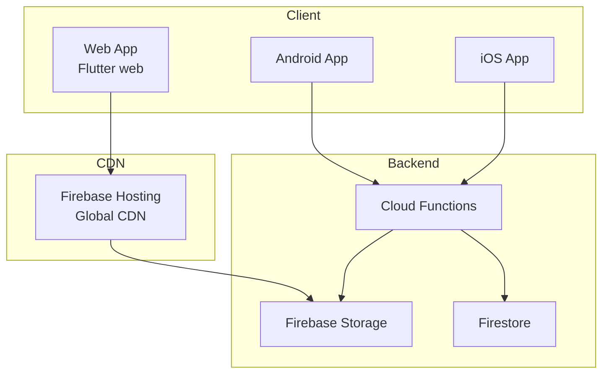
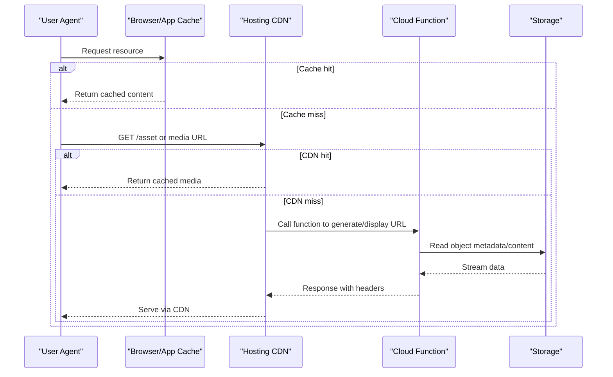
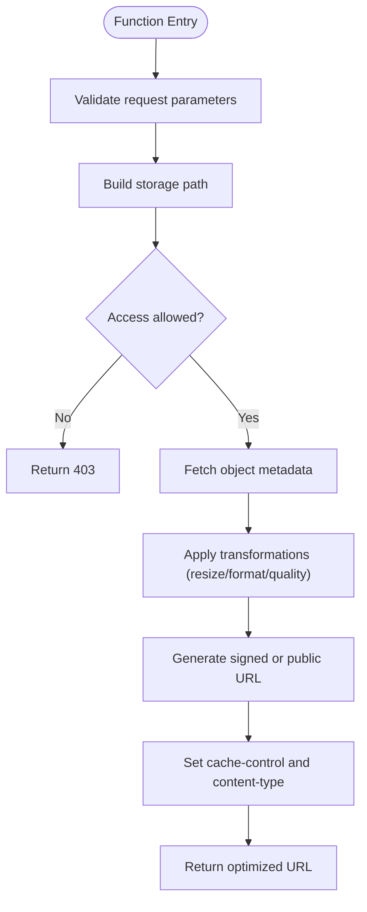
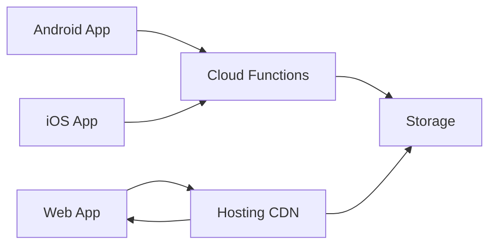

# CDN & Caching Strategy

<cite>
**Referenced Files in This Document**
- [firebase.json](file://firebase.json)
- [storage.rules](file://storage.rules)
- [firestore.rules](file://firestore.rules)
- [functions/index.js](file://functions/index.js)
- [functions/storageDisplayUrls.js](file://functions/storageDisplayUrls.js)
- [functions/panelMediaPrefetch.js](file://functions/panelMediaPrefetch.js)
- [functions/publicSiteMediaPrefetch.js](file://functions/publicSiteMediaPrefetch.js)
- [flutter_app/firebase.json](file://flutter_app/firebase.json)
- [flutter_app/web/index.html](file://flutter_app/web/index.html)
- [flutter_app/web/manifest.json](file://flutter_app/web/manifest.json)
- [flutter_app/web/flutter_bootstrap.js](file://flutter_app/web/flutter_bootstrap.js)
- [flutter_app/pubspec.yaml](file://flutter_app/pubspec.yaml)
- [scripts/deploy_web_hosting.ps1](file://scripts/deploy_web_hosting.ps1)
- [scripts/apply_storage_cors.ps1](file://scripts/apply_storage_cors.ps1)
- [cors.json](file://cors.json)
- [storage-cors.json](file://storage-cors.json)
- [MIDIA_STORAGE_PADRAO_ECOFIRE.md](file://flutter_app/MIDIA_STORAGE_PADRAO_ECOFIRE.md)
- [ARCHITECTURE_PERFORMANCE_MULTI_PLATFORM.md](file://docs/ARCHITECTURE_PERFORMANCE_MULTI_PLATFORM.md)
- [instant-media-performance.md](file://docs/instant-media-performance.md)
</cite>

## Table of Contents
1. [Introduction](#introduction)
2. [Project Structure](#project-structure)
3. [Core Components](#core-components)
4. [Architecture Overview](#architecture-overview)
5. [Detailed Component Analysis](#detailed-component-analysis)
6. [Dependency Analysis](#dependency-analysis)
7. [Performance Considerations](#performance-considerations)
8. [Troubleshooting Guide](#troubleshooting-guide)
9. [Conclusion](#conclusion)
10. [Appendices](#appendices)

## Introduction
This document explains the CDN integration and caching strategy for delivering media efficiently across web, Android, and iOS clients. It covers URL generation for optimized delivery, cache control headers, browser caching policies, multi-layer caching (client, CDN, server), cache invalidation, stale-while-revalidate patterns, cache warming, lazy and progressive image loading, cache key/versioning strategies, monitoring, and CDN configuration including custom domains and geo-location optimization.

The project uses Firebase Hosting for CDN-backed static assets and Firebase Storage with Cloud Functions to generate optimized display URLs. Web assets are served via a Flutter web build hosted on Firebase Hosting, while mobile apps fetch media through signed or public URLs generated by backend functions.

## Project Structure
Key areas related to CDN and caching:
- Firebase Hosting configuration and web app entry points
- Firebase Storage rules and CORS settings
- Cloud Functions that generate display URLs and prefetch media
- Flutter web bootstrap and asset handling
- Documentation describing performance and media patterns

**Diagram sources**
- [firebase.json](file://firebase.json)
- [flutter_app/firebase.json](file://flutter_app/firebase.json)
- [functions/index.js](file://functions/index.js)
- [functions/storageDisplayUrls.js](file://functions/storageDisplayUrls.js)
- [storage.rules](file://storage.rules)

**Section sources**
- [firebase.json](file://firebase.json)
- [flutter_app/firebase.json](file://flutter_app/firebase.json)
- [functions/index.js](file://functions/index.js)
- [functions/storageDisplayUrls.js](file://functions/storageDisplayUrls.js)
- [storage.rules](file://storage.rules)

## Core Components
- Firebase Hosting: Serves Flutter web build and static assets globally via CDN.
- Firebase Storage: Stores media files; accessed via signed or public URLs.
- Cloud Functions: Generate optimized display URLs, prefetch media, and manage cache behavior.
- Flutter web: Bootstraps the app and loads assets from Hosting; supports service worker and caching.
- Mobile apps: Use functions to obtain display URLs and implement client-side caching strategies.

**Section sources**
- [firebase.json](file://firebase.json)
- [flutter_app/firebase.json](file://flutter_app/firebase.json)
- [functions/storageDisplayUrls.js](file://functions/storageDisplayUrls.js)
- [functions/panelMediaPrefetch.js](file://functions/panelMediaPrefetch.js)
- [functions/publicSiteMediaPrefetch.js](file://functions/publicSiteMediaPrefetch.js)

## Architecture Overview
The system employs a three-tier caching approach:
- Client-side cache: Browser cache, Flutter memory/disk caches, and native OS caches.
- CDN cache: Firebase Hosting edge cache for static assets and optimized media URLs.
- Server-side cache: Cloud Functions can cache computed results and orchestrate prefetch/warm-up.

**Diagram sources**
- [firebase.json](file://firebase.json)
- [functions/storageDisplayUrls.js](file://functions/storageDisplayUrls.js)
- [storage.rules](file://storage.rules)

## Detailed Component Analysis

### URL Generation for Optimized Media Delivery
Cloud Functions provide endpoints to generate optimized display URLs for images and videos. These URLs include parameters for resizing, format conversion, quality tuning, and CDN-friendly cache keys. The function reads storage metadata and returns a URL suitable for direct CDN delivery.

**Diagram sources**
- [functions/storageDisplayUrls.js](file://functions/storageDisplayUrls.js)

**Section sources**
- [functions/storageDisplayUrls.js](file://functions/storageDisplayUrls.js)

### Cache Control Headers and Browser Policies
- Hosting serves static assets with long-lived cache headers when filenames include content hashes.
- Dynamic media URLs returned by functions should set appropriate cache-control values to balance freshness and performance.
- For progressive images, use streaming responses and incremental cache updates.

Recommendations:
- Use immutable cache for versioned assets (e.g., index.[hash].js).
- Apply stale-while-revalidate for frequently updated but tolerant content.
- Set correct Content-Type and Content-Encoding for optimal browser decoding.

**Section sources**
- [firebase.json](file://firebase.json)
- [flutter_app/web/index.html](file://flutter_app/web/index.html)
- [flutter_app/web/flutter_bootstrap.js](file://flutter_app/web/flutter_bootstrap.js)

### Multi-Layer Caching Approach
- Client-side cache:
  - Web: HTTP cache, Service Worker, IndexedDB for offline assets.
  - Mobile: In-memory caches, disk caches for images, and platform-specific storage.
- CDN cache:
  - Firebase Hosting caches static assets and proxied responses based on cache headers.
- Server-side cache:
  - Cloud Functions can memoize expensive computations and coordinate prefetch/warming.

Implementation tips:
- Version assets with content hashes to enable long TTLs.
- Use query parameters for transformation variants to create distinct cache keys.
- Implement background refresh using stale-while-revalidate where appropriate.

**Section sources**
- [flutter_app/web/manifest.json](file://flutter_app/web/manifest.json)
- [flutter_app/web/flutter_bootstrap.js](file://flutter_app/web/flutter_bootstrap.js)
- [functions/panelMediaPrefetch.js](file://functions/panelMediaPrefetch.js)
- [functions/publicSiteMediaPrefetch.js](file://functions/publicSiteMediaPrefetch.js)

### Cache Invalidation Strategies
- Content hashing: Change filenames on update to bypass caches automatically.
- Versioned paths: Include semantic versions in URLs for controlled invalidation.
- Tag-based invalidation: Use CDN purge APIs to invalidate specific paths or patterns.
- Functional invalidation: Trigger functions to clear or update derived caches after writes.

Best practices:
- Prefer immutable assets for maximum cache efficiency.
- Avoid mutable URLs for critical resources unless necessary.
- Coordinate invalidation with deployment pipelines.

**Section sources**
- [firebase.json](file://firebase.json)
- [scripts/deploy_web_hosting.ps1](file://scripts/deploy_web_hosting.ps1)

### Stale-While-Revalidate Patterns
- Serve stale content immediately while fetching fresh data in the background.
- Ideal for dashboards, lists, and non-critical media.
- Combine with short TTLs and conditional requests (ETag/Last-Modified) to minimize bandwidth.

Implementation notes:
- Set cache-control: public, max-age=..., stale-while-revalidate=...
- Ensure CDN supports SWR semantics; otherwise implement at the application layer.

**Section sources**
- [functions/storageDisplayUrls.js](file://functions/storageDisplayUrls.js)

### Cache Warming Techniques
- Prefetch popular assets during idle time or on page load.
- Use scheduled functions to pre-warm CDN edges for high-traffic regions.
- Implement predictive prefetch based on user navigation patterns.

Relevant components:
- Panel media prefetch function for admin dashboards.
- Public site media prefetch for landing pages.

**Section sources**
- [functions/panelMediaPrefetch.js](file://functions/panelMediaPrefetch.js)
- [functions/publicSiteMediaPrefetch.js](file://functions/publicSiteMediaPrefetch.js)

### Efficient Media Loading, Lazy Loading, and Progressive Images
- Lazy loading: Defer off-screen images until they enter the viewport.
- Progressive images: Load low-resolution placeholders first, then upscale.
- Adaptive formats: Serve WebP/AVIF when supported; fallback to JPEG/PNG.
- Responsive sizing: Provide multiple resolutions via srcset or transformation parameters.

Client-side considerations:
- Use IntersectionObserver for lazy loading on web.
- On mobile, leverage platform-native image decoders and caching libraries.

**Section sources**
- [flutter_app/web/index.html](file://flutter_app/web/index.html)
- [flutter_app/web/flutter_bootstrap.js](file://flutter_app/web/flutter_bootstrap.js)

### Cache Key Generation and Versioning Strategies
- Stable base paths with versioned query parameters for transformations.
- Content-hash filenames for static assets to ensure cache busting.
- Tenant-aware keys if serving multi-tenant content.

Guidelines:
- Keep cache keys deterministic and minimal.
- Separate transformation parameters from identity parameters.

**Section sources**
- [functions/storageDisplayUrls.js](file://functions/storageDisplayUrls.js)

### Cache Monitoring
- Monitor CDN hit ratios and latency via Hosting analytics.
- Track function invocation metrics and error rates.
- Observe storage access patterns and bandwidth usage.
- Instrument client-side performance metrics (LCP, FID, CLS).

Tools:
- Firebase Hosting console and GCP Monitoring.
- Cloud Functions logs and metrics.
- Web Vitals and mobile performance profiling.

**Section sources**
- [firebase.json](file://firebase.json)
- [functions/index.js](file://functions/index.js)

### CDN Configuration, Custom Domains, and Geo-Location Optimization
- Configure Hosting with custom domains and SSL.
- Enable global CDN distribution and optimize routing.
- Use region-specific caching policies where applicable.

Steps:
- Add domain mappings in Hosting configuration.
- Verify DNS records and propagate SSL certificates.
- Test geo-latency and adjust prefetch targets accordingly.

**Section sources**
- [firebase.json](file://firebase.json)
- [flutter_app/firebase.json](file://flutter_app/firebase.json)

## Dependency Analysis
The following diagram shows how components depend on each other for media delivery and caching:

**Diagram sources**
- [firebase.json](file://firebase.json)
- [flutter_app/firebase.json](file://flutter_app/firebase.json)
- [functions/index.js](file://functions/index.js)
- [functions/storageDisplayUrls.js](file://functions/storageDisplayUrls.js)

**Section sources**
- [firebase.json](file://firebase.json)
- [flutter_app/firebase.json](file://flutter_app/firebase.json)
- [functions/index.js](file://functions/index.js)
- [functions/storageDisplayUrls.js](file://functions/storageDisplayUrls.js)

## Performance Considerations
- Prefer immutable assets with content hashes for maximum cache efficiency.
- Use adaptive image formats and responsive sizing to reduce payload.
- Implement lazy loading and progressive enhancement to improve perceived performance.
- Leverage CDN caching aggressively for static and semi-static content.
- Monitor and iterate based on real-world metrics and user feedback.

[No sources needed since this section provides general guidance]

## Troubleshooting Guide
Common issues and resolutions:
- CORS errors: Ensure Storage CORS allows required origins and methods.
- 403 Forbidden: Review Storage rules and function authorization.
- Cache not updating: Verify content hashing and CDN purge workflows.
- Slow initial load: Increase prefetch coverage and optimize critical assets.

Checkpoints:
- Validate CORS configuration scripts and applied rules.
- Inspect Hosting configuration for rewrites and redirects.
- Review function logs for errors and timeouts.

**Section sources**
- [scripts/apply_storage_cors.ps1](file://scripts/apply_storage_cors.ps1)
- [cors.json](file://cors.json)
- [storage-cors.json](file://storage-cors.json)
- [storage.rules](file://storage.rules)
- [firebase.json](file://firebase.json)

## Conclusion
A robust CDN and caching strategy combines efficient URL generation, disciplined cache control, and layered caching across client, CDN, and server. By implementing lazy and progressive loading, versioned assets, and proactive cache warming, the system delivers fast, reliable media experiences across platforms. Continuous monitoring and iterative improvements ensure sustained performance at scale.

[No sources needed since this section summarizes without analyzing specific files]

## Appendices

### A. CDN and Caching Checklist
- Content-hashed static assets deployed via Hosting
- Optimized media URLs generated by functions
- Proper cache-control headers set for dynamic responses
- Lazy loading implemented for off-screen media
- Progressive image loading for faster perceived performance
- Cache warming for high-traffic assets
- CORS configured correctly for Storage
- Custom domains mapped and SSL enabled
- Monitoring dashboards configured for Hosting, Functions, and Storage

**Section sources**
- [firebase.json](file://firebase.json)
- [flutter_app/firebase.json](file://flutter_app/firebase.json)
- [functions/storageDisplayUrls.js](file://functions/storageDisplayUrls.js)
- [scripts/apply_storage_cors.ps1](file://scripts/apply_storage_cors.ps1)

### B. References to Internal Documentation
- Media storage standards and patterns
- Multi-platform performance architecture
- Instant media performance guidelines

**Section sources**
- [MIDIA_STORAGE_PADRAO_ECOFIRE.md](file://flutter_app/MIDIA_STORAGE_PADRAO_ECOFIRE.md)
- [ARCHITECTURE_PERFORMANCE_MULTI_PLATFORM.md](file://docs/ARCHITECTURE_PERFORMANCE_MULTI_PLATFORM.md)
- [instant-media-performance.md](file://docs/instant-media-performance.md)