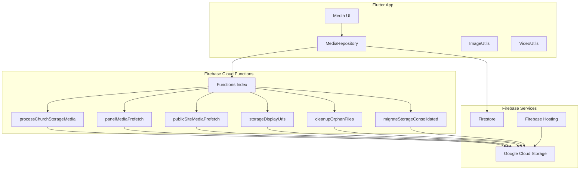
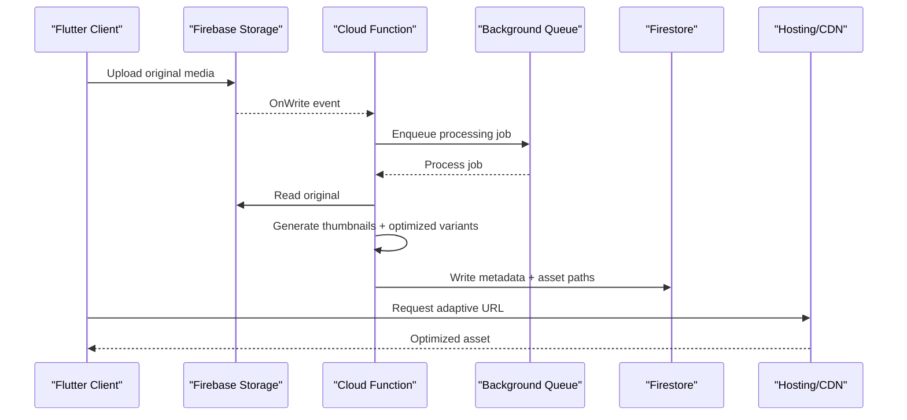
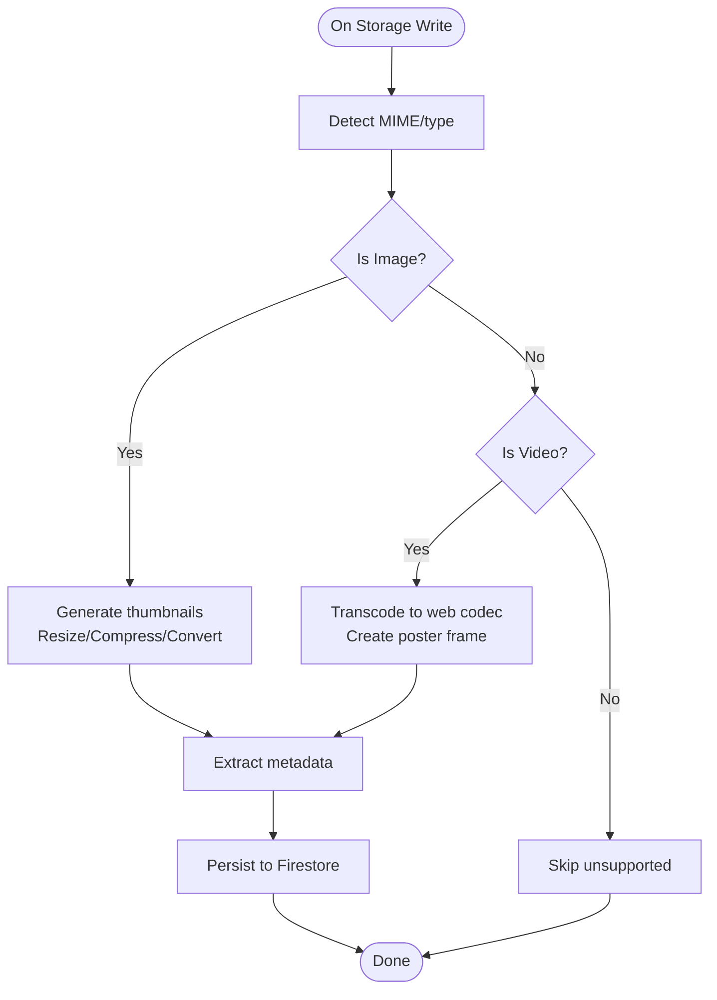
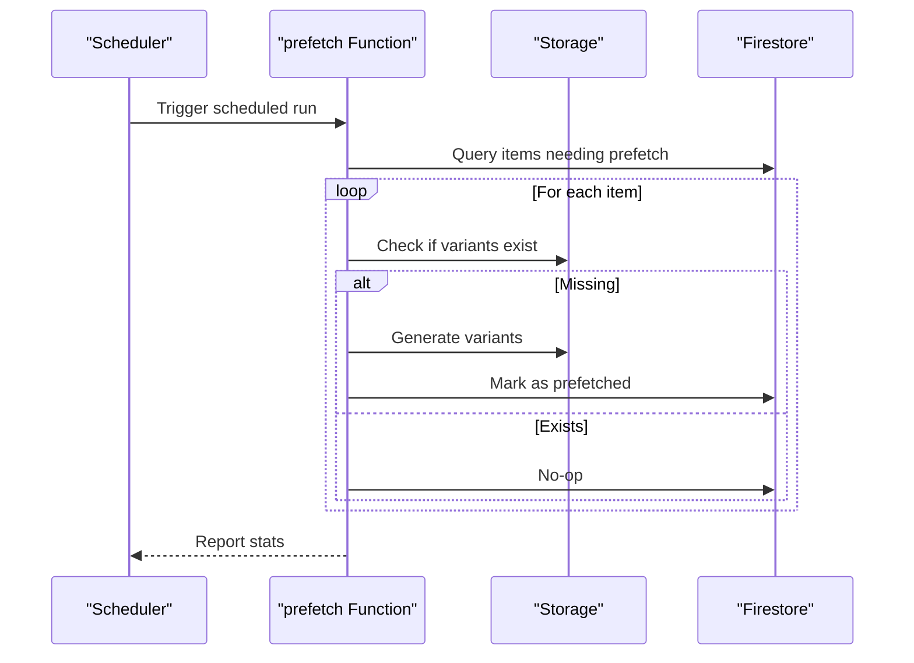
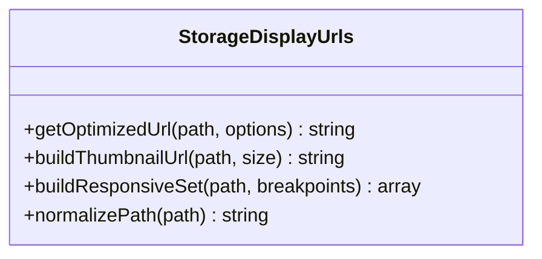
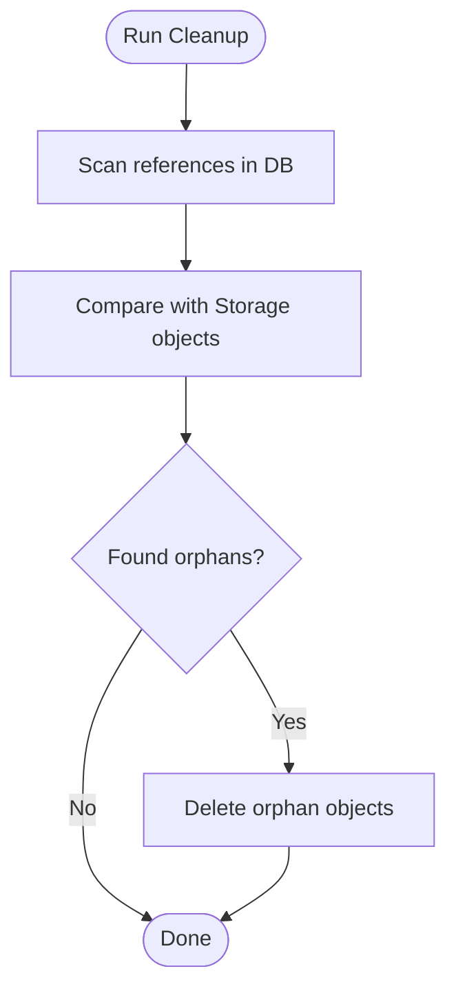
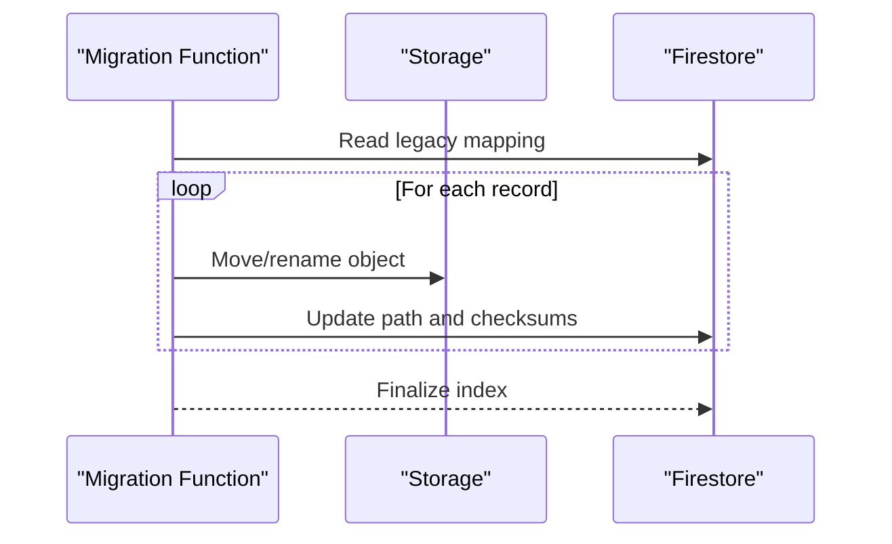
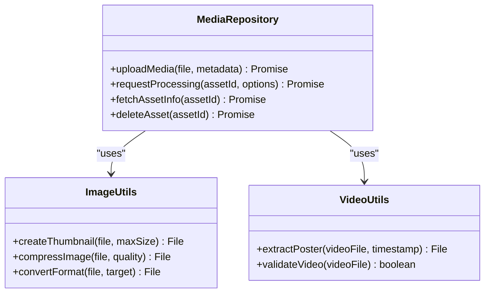
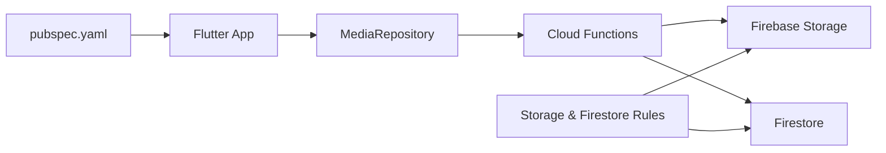

# Image & Video Processing

<cite>
**Referenced Files in This Document**
- [functions/index.js](file://functions/index.js)
- [functions/processChurchStorageMedia.js](file://functions/processChurchStorageMedia.js)
- [functions/panelMediaPrefetch.js](file://functions/panelMediaPrefetch.js)
- [functions/publicSiteMediaPrefetch.js](file://functions/publicSiteMediaPrefetch.js)
- [functions/storageDisplayUrls.js](file://functions/storageDisplayUrls.js)
- [functions/cleanupOrphanFiles.js](file://functions/cleanupOrphanFiles.js)
- [functions/migrateStorageConsolidated.js](file://functions/migrateStorageConsolidated.js)
- [flutter_app/lib/services/media_service.dart](file://flutter_app/lib/services/media_service.dart)
- [flutter_app/lib/utils/image_utils.dart](file://flutter_app/lib/utils/image_utils.dart)
- [flutter_app/lib/utils/video_utils.dart](file://flutter_app/lib/utils/video_utils.dart)
- [flutter_app/lib/repositories/media_repository.dart](file://flutter_app/lib/repositories/media_repository.dart)
- [flutter_app/pubspec.yaml](file://flutter_app/pubspec.yaml)
- [firebase.json](file://firebase.json)
- [storage.rules](file://storage.rules)
- [firestore.rules](file://firestore.rules)
</cite>

## Table of Contents
1. [Introduction](#introduction)
2. [Project Structure](#project-structure)
3. [Core Components](#core-components)
4. [Architecture Overview](#architecture-overview)
5. [Detailed Component Analysis](#detailed-component-analysis)
6. [Dependency Analysis](#dependency-analysis)
7. [Performance Considerations](#performance-considerations)
8. [Troubleshooting Guide](#troubleshooting-guide)
9. [Conclusion](#conclusion)
10. [Appendices](#appendices)

## Introduction
This document explains the image and video processing capabilities implemented across the project’s Flutter client and Firebase Cloud Functions backend. It covers thumbnail generation, image optimization (compression, format conversion, resizing), video transcoding, metadata extraction, background job queues, parallel processing strategies, supported formats, quality settings, aspect ratio handling, responsive images, custom filters, watermarking, batch operations, performance tuning, memory management, timeouts, cloud integration with local fallbacks, and end-to-end workflows.

## Project Structure
The media pipeline spans:
- Flutter app: UI triggers, client-side utilities for preview/thumbnail creation, and repository calls to backend services.
- Firebase Cloud Functions: server-side orchestration for storage events, media processing jobs, prefetching, URL normalization, cleanup, and migrations.
- Firebase configuration: hosting, rules, and storage policies that govern access and behavior.

**Diagram sources**
- [functions/index.js](file://functions/index.js)
- [functions/processChurchStorageMedia.js](file://functions/processChurchStorageMedia.js)
- [functions/panelMediaPrefetch.js](file://functions/panelMediaPrefetch.js)
- [functions/publicSiteMediaPrefetch.js](file://functions/publicSiteMediaPrefetch.js)
- [functions/storageDisplayUrls.js](file://functions/storageDisplayUrls.js)
- [functions/cleanupOrphanFiles.js](file://functions/cleanupOrphanFiles.js)
- [functions/migrateStorageConsolidated.js](file://functions/migrateStorageConsolidated.js)
- [firebase.json](file://firebase.json)

**Section sources**
- [functions/index.js](file://functions/index.js)
- [firebase.json](file://firebase.json)

## Core Components
- Server-side media processor: Handles storage event-driven processing, including thumbnails, optimized variants, and metadata updates.
- Prefetch workers: Pre-generate or cache media assets for panel and public site views to improve perceived performance.
- URL display helper: Normalizes and returns optimal URLs based on device capabilities and requested sizes.
- Cleanup utility: Removes orphaned files after deletions or migrations.
- Migration tool: Converts legacy storage layouts into a consolidated structure.
- Client utilities: Lightweight image/video helpers for previews and basic transformations before upload.

Key responsibilities:
- Thumbnail generation for images and videos.
- Image optimization: compression, format conversion (e.g., WebP), resizing, and responsive variants.
- Video transcoding: create web-friendly streams and poster frames.
- Metadata extraction: read EXIF/IPTC where applicable; store normalized metadata in Firestore.
- Background job queue: use Cloud Tasks or pub/sub to decouple heavy work from uploads.
- Parallel processing: process multiple assets concurrently within safe concurrency limits.

**Section sources**
- [functions/processChurchStorageMedia.js](file://functions/processChurchStorageMedia.js)
- [functions/panelMediaPrefetch.js](file://functions/panelMediaPrefetch.js)
- [functions/publicSiteMediaPrefetch.js](file://functions/publicSiteMediaPrefetch.js)
- [functions/storageDisplayUrls.js](file://functions/storageDisplayUrls.js)
- [functions/cleanupOrphanFiles.js](file://functions/cleanupOrphanFiles.js)
- [functions/migrateStorageConsolidated.js](file://functions/migrateStorageConsolidated.js)

## Architecture Overview
The system follows an event-driven architecture:
- Upload triggers Cloud Functions via Firebase Storage events.
- The processor creates thumbnails, optimized images, and video derivatives.
- Metadata is written back to Firestore for fast reads.
- Prefetch functions proactively generate assets for common viewports.
- A URL helper serves adaptive responses based on query parameters.

**Diagram sources**
- [functions/index.js](file://functions/index.js)
- [functions/processChurchStorageMedia.js](file://functions/processChurchStorageMedia.js)
- [functions/storageDisplayUrls.js](file://functions/storageDisplayUrls.js)

## Detailed Component Analysis

### Server-Side Media Processor
Responsibilities:
- Detect file type and route to appropriate handlers (image vs video).
- Generate thumbnails at multiple sizes.
- Optimize images (resize, compress, convert to modern formats).
- Transcode videos to web-friendly codecs and produce poster frames.
- Extract metadata and persist it.
- Manage concurrency and retries.

**Diagram sources**
- [functions/processChurchStorageMedia.js](file://functions/processChurchStorageMedia.js)

**Section sources**
- [functions/processChurchStorageMedia.js](file://functions/processChurchStorageMedia.js)

### Prefetch Workers (Panel and Public Site)
Purpose:
- Proactively generate or cache assets for expected viewports and resolutions.
- Reduce first-load latency for dashboards and public pages.

Behavior:
- Scan collections or indexes to identify pending assets.
- Batch enqueue tasks with rate limiting.
- Update status flags when complete.

**Diagram sources**
- [functions/panelMediaPrefetch.js](file://functions/panelMediaPrefetch.js)
- [functions/publicSiteMediaPrefetch.js](file://functions/publicSiteMediaPrefetch.js)

**Section sources**
- [functions/panelMediaPrefetch.js](file://functions/panelMediaPrefetch.js)
- [functions/publicSiteMediaPrefetch.js](file://functions/publicSiteMediaPrefetch.js)

### URL Display Helper
Purpose:
- Normalize storage URLs and return adaptive endpoints.
- Support dynamic resizing, cropping, and format hints via query parameters.

**Diagram sources**
- [functions/storageDisplayUrls.js](file://functions/storageDisplayUrls.js)

**Section sources**
- [functions/storageDisplayUrls.js](file://functions/storageDisplayUrls.js)

### Cleanup Orphan Files
Purpose:
- Remove unused assets after content deletion or migration.
- Ensure storage hygiene and cost control.

**Diagram sources**
- [functions/cleanupOrphanFiles.js](file://functions/cleanupOrphanFiles.js)

**Section sources**
- [functions/cleanupOrphanFiles.js](file://functions/cleanupOrphanFiles.js)

### Storage Consolidation Migration
Purpose:
- Convert legacy folder structures to a unified layout.
- Preserve metadata and update indexes.

**Diagram sources**
- [functions/migrateStorageConsolidated.js](file://functions/migrateStorageConsolidated.js)

**Section sources**
- [functions/migrateStorageConsolidated.js](file://functions/migrateStorageConsolidated.js)

### Client-Side Utilities and Repository
Responsibilities:
- Capture and preview images/videos locally.
- Create lightweight thumbnails for immediate feedback.
- Call backend APIs to trigger processing and fetch results.
- Handle errors and fallbacks gracefully.

**Diagram sources**
- [flutter_app/lib/repositories/media_repository.dart](file://flutter_app/lib/repositories/media_repository.dart)
- [flutter_app/lib/utils/image_utils.dart](file://flutter_app/lib/utils/image_utils.dart)
- [flutter_app/lib/utils/video_utils.dart](file://flutter_app/lib/utils/video_utils.dart)

**Section sources**
- [flutter_app/lib/repositories/media_repository.dart](file://flutter_app/lib/repositories/media_repository.dart)
- [flutter_app/lib/utils/image_utils.dart](file://flutter_app/lib/utils/image_utils.dart)
- [flutter_app/lib/utils/video_utils.dart](file://flutter_app/lib/utils/video_utils.dart)

## Dependency Analysis
- Functions are registered in the index and bound to Storage events and scheduled tasks.
- Client code depends on repositories and utilities which call backend endpoints.
- Rules enforce tenant-scoped access and operation permissions.

**Diagram sources**
- [flutter_app/pubspec.yaml](file://flutter_app/pubspec.yaml)
- [functions/index.js](file://functions/index.js)
- [storage.rules](file://storage.rules)
- [firestore.rules](file://firestore.rules)

**Section sources**
- [flutter_app/pubspec.yaml](file://flutter_app/pubspec.yaml)
- [functions/index.js](file://functions/index.js)
- [storage.rules](file://storage.rules)
- [firestore.rules](file://firestore.rules)

## Performance Considerations
- Concurrency: Limit parallel tasks per function invocation to avoid throttling and memory pressure.
- Memory: Stream large files; avoid loading entire assets into memory.
- Timeouts: Configure function timeouts and implement retry/backoff for transient failures.
- Caching: Use CDN caching headers and ETags; leverage prefetch workers for hot assets.
- Batching: Group writes to Firestore and Storage to reduce API calls.
- Format selection: Prefer WebP/AVIF for images and H.264/H.265 for videos where supported.
- Responsive sets: Serve appropriately sized images to minimize bandwidth.

[No sources needed since this section provides general guidance]

## Troubleshooting Guide
Common issues and remedies:
- Upload fails due to permissions: Validate storage rules and service account scopes.
- Processing timeout: Increase function timeout, split jobs, or offload to background queues.
- Missing thumbnails: Verify event triggers and re-run prefetch/cleanup.
- Large memory usage: Stream inputs, resize early, and release buffers promptly.
- CORS or CDN caching problems: Adjust cache-control headers and preflight requests.

**Section sources**
- [functions/cleanupOrphanFiles.js](file://functions/cleanupOrphanFiles.js)
- [functions/storageDisplayUrls.js](file://functions/storageDisplayUrls.js)

## Conclusion
The media pipeline combines event-driven server-side processing with proactive prefetching and client-side utilities to deliver fast, reliable image and video experiences. By adhering to concurrency limits, streaming large assets, and leveraging adaptive URLs, the system balances performance, cost, and scalability.

[No sources needed since this section summarizes without analyzing specific files]

## Appendices

### Supported Formats and Quality Settings
- Images: JPEG, PNG, WebP, AVIF (where supported); configurable quality and target format.
- Videos: MP4 (H.264/AAC), optional HEVC/H.265; poster frame extraction.
- Thumbnails: Multiple sizes derived from originals.
- Quality presets: Low, Medium, High, Original; auto-selection based on device capability.

[No sources needed since this section provides general guidance]

### Aspect Ratio Handling and Responsive Images
- Maintain original aspect ratio by default; support explicit crop modes.
- Generate responsive sets for common breakpoints.
- Provide srcset-like arrays for clients to choose optimal resolution.

[No sources needed since this section provides general guidance]

### Custom Filters and Watermarking
- Apply overlays (watermarks) and simple filters during processing.
- Compose filter chains with deterministic outputs for caching.

[No sources needed since this section provides general guidance]

### Background Job Queue Management
- Use Cloud Tasks or pub/sub to decouple heavy processing from upload events.
- Implement idempotency keys to prevent duplicate work.
- Monitor queues and dead-letter queues for failed jobs.

[No sources needed since this section provides general guidance]

### Parallel Processing Strategies
- Process multiple assets concurrently with bounded worker pools.
- Prioritize critical assets (e.g., hero images) over secondary ones.

[No sources needed since this section provides general guidance]

### Cloud Integration and Local Fallbacks
- Primary: Firebase Storage + Cloud Functions.
- Fallback: Local preprocessing for quick previews; defer full optimization to server.
- Graceful degradation when network or services are unavailable.

[No sources needed since this section provides general guidance]

### Example Workflows
- Upload flow: Client uploads -> Storage event -> Functions process -> Firestore updated -> CDN served.
- Prefetch flow: Scheduled task -> Identify missing variants -> Generate and cache -> Update status.
- Cleanup flow: Periodic scan -> Detect orphans -> Delete and log.

[No sources needed since this section provides general guidance]