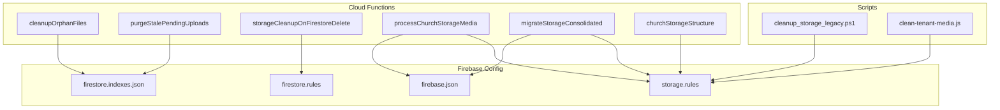
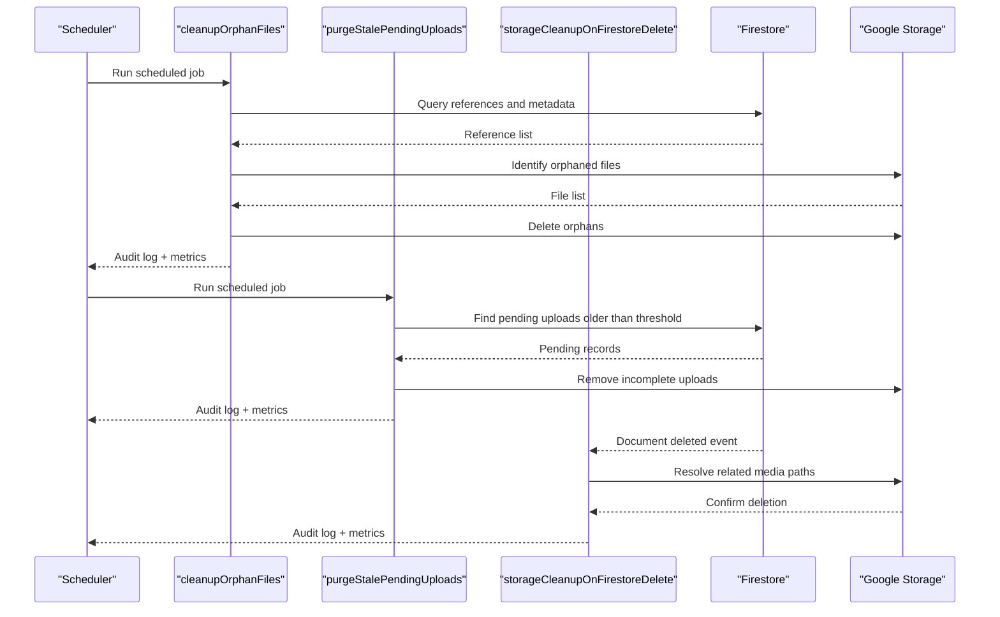
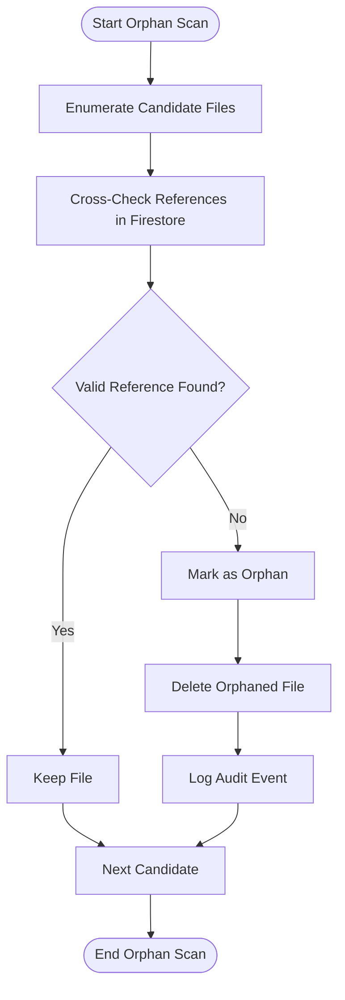
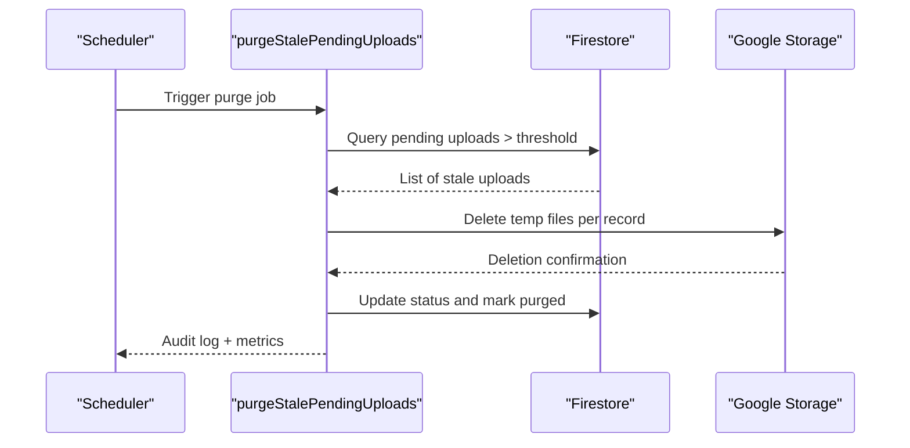
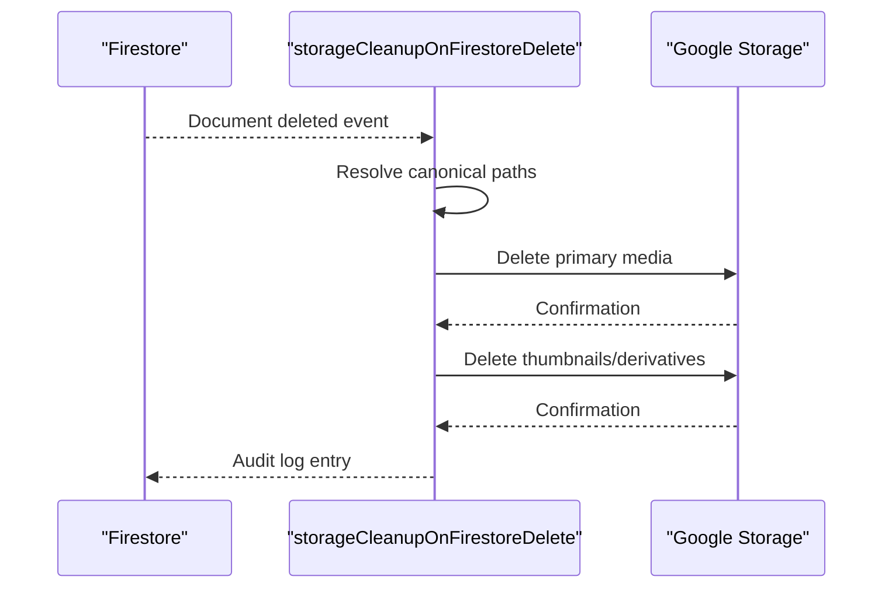
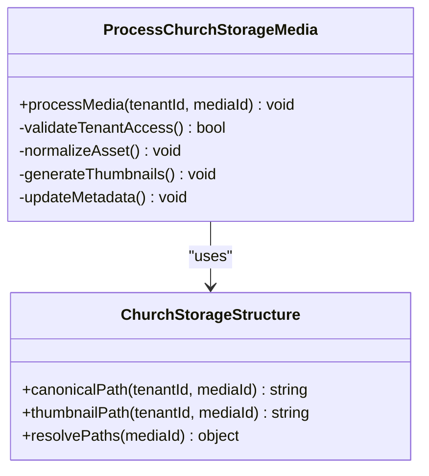
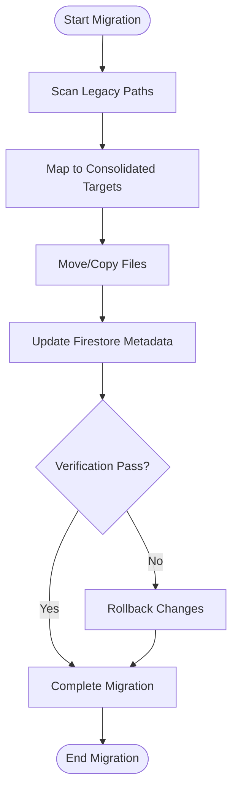
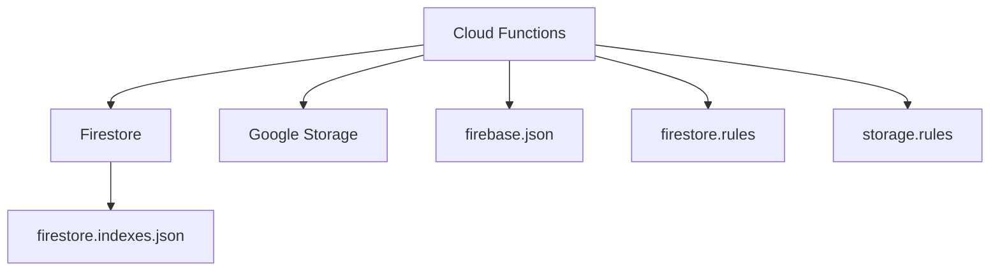

# Media Cleanup & Maintenance

<cite>
**Referenced Files in This Document**
- [cleanupOrphanFiles.js](file://functions/lib/cleanupOrphanFiles.js)
- [cleanupOrphanFiles.ts](file://functions/src/cleanupOrphanFiles.ts)
- [purgeStalePendingUploads.js](file://functions/lib/purgeStalePendingUploads.js)
- [purgeStalePendingUploads.ts](file://functions/src/purgeStalePendingUploads.ts)
- [storageCleanupOnFirestoreDelete.js](file://functions/lib/storageCleanupOnFirestoreDelete.js)
- [storageCleanupOnFirestoreDelete.ts](file://functions/src/storageCleanupOnFirestoreDelete.ts)
- [processChurchStorageMedia.js](file://functions/lib/processChurchStorageMedia.js)
- [processChurchStorageMedia.ts](file://functions/src/processChurchStorageMedia.ts)
- [migrateStorageConsolidated.js](file://functions/lib/migrateStorageConsolidated.js)
- [migrateStorageConsolidated.ts](file://functions/src/migrateStorageConsolidated.ts)
- [churchStorageStructure.js](file://functions/lib/churchStorageStructure.js)
- [churchStorageStructure.ts](file://functions/src/churchStorageStructure.ts)
- [index.js](file://functions/index.js)
- [index.ts](file://functions/src/index.ts)
- [firestore.indexes.json](file://firestore.indexes.json)
- [firestore.rules](file://firestore.rules)
- [storage.rules](file://storage.rules)
- [firebase.json](file://firebase.json)
- [scripts/cleanup_storage_legacy.ps1](file://scripts/cleanup_storage_legacy.ps1)
- [scripts/clean-tenant-media.js](file://functions/scripts/clean-tenant-media.js)
</cite>

## Table of Contents
1. Introduction
2. Project Structure
3. Core Components
4. Architecture Overview
5. Detailed Component Analysis
6. Dependency Analysis
7. Performance Considerations
8. Troubleshooting Guide
9. Conclusion
10. Appendices

## Introduction
This document explains the media cleanup and maintenance operations implemented for the project, focusing on orphaned file detection, stale upload cleanup, automated maintenance jobs, retention policies, garbage collection strategies, storage optimization, scheduling, error handling, audit logging, database cleanup, index maintenance, backup verification, integrity checks, recovery procedures, monitoring integration, and alerting mechanisms. The implementation is primarily in Cloud Functions (Node.js/TypeScript), with supporting scripts and configuration files for Firebase/Firestore and Storage.

## Project Structure
The relevant code for media cleanup and maintenance spans:
- Cloud Functions implementations (lib and src directories)
- Index definitions for Firestore
- Security rules for Firestore and Storage
- Firebase configuration
- Utility scripts for legacy cleanup and tenant-specific media management

**Diagram sources**
- [index.js](file://functions/index.js)
- [index.ts](file://functions/src/index.ts)
- [firebase.json](file://firebase.json)
- [firestore.indexes.json](file://firestore.indexes.json)
- [firestore.rules](file://firestore.rules)
- [storage.rules](file://storage.rules)
- [scripts/cleanup_storage_legacy.ps1](file://scripts/cleanup_storage_legacy.ps1)
- [functions/scripts/clean-tenant-media.js](file://functions/scripts/clean-tenant-media.js)

**Section sources**
- [index.js](file://functions/index.js)
- [index.ts](file://functions/src/index.ts)
- [firebase.json](file://firebase.json)
- [firestore.indexes.json](file://firestore.indexes.json)
- [firestore.rules](file://firestore.rules)
- [storage.rules](file://storage.rules)

## Core Components
- Orphaned File Detection and Cleanup: Identifies files in storage without corresponding metadata or references and removes them safely.
- Stale Upload Purge: Removes pending uploads that have not completed within a configured time window.
- On-Demand Cleanup via Firestore Deletion: Triggers storage cleanup when referenced documents are deleted.
- Church-Specific Media Processing: Orchestrates processing tasks per tenant (church).
- Storage Consolidation Migration: Migrates legacy storage structures to consolidated layouts.
- Storage Structure Utilities: Provides canonical paths and helpers for consistent storage organization.

Key responsibilities:
- Retention policy enforcement
- Garbage collection routines
- Audit logging and metrics
- Error handling and retries
- Scheduling via Cloud Tasks or scheduled functions

**Section sources**
- [cleanupOrphanFiles.js](file://functions/lib/cleanupOrphanFiles.js)
- [cleanupOrphanFiles.ts](file://functions/src/cleanupOrphanFiles.ts)
- [purgeStalePendingUploads.js](file://functions/lib/purgeStalePendingUploads.js)
- [purgeStalePendingUploads.ts](file://functions/src/purgeStalePendingUploads.ts)
- [storageCleanupOnFirestoreDelete.js](file://functions/lib/storageCleanupOnFirestoreDelete.js)
- [storageCleanupOnFirestoreDelete.ts](file://functions/src/storageCleanupOnFirestoreDelete.ts)
- [processChurchStorageMedia.js](file://functions/lib/processChurchStorageMedia.js)
- [processChurchStorageMedia.ts](file://functions/src/processChurchStorageMedia.ts)
- [migrateStorageConsolidated.js](file://functions/lib/migrateStorageConsolidated.js)
- [migrateStorageConsolidated.ts](file://functions/src/migrateStorageConsolidated.ts)
- [churchStorageStructure.js](file://functions/lib/churchStorageStructure.js)
- [churchStorageStructure.ts](file://functions/src/churchStorageStructure.ts)

## Architecture Overview
The system uses Cloud Functions to implement scheduled and event-driven cleanup workflows:
- Scheduled functions periodically scan storage and metadata to detect orphans and stale uploads.
- Event-driven functions respond to Firestore deletions to remove associated media.
- Tenant-scoped functions process media per church using canonical paths.
- Migration functions transition legacy storage layouts into consolidated structures.

**Diagram sources**
- [index.js](file://functions/index.js)
- [index.ts](file://functions/src/index.ts)
- [cleanupOrphanFiles.js](file://functions/lib/cleanupOrphanFiles.js)
- [purgeStalePendingUploads.js](file://functions/lib/purgeStalePendingUploads.js)
- [storageCleanupOnFirestoreDelete.js](file://functions/lib/storageCleanupOnFirestoreDelete.js)

## Detailed Component Analysis

### Orphaned File Detection and Cleanup
Purpose:
- Detect files in Google Storage that lack valid references in Firestore or tenant metadata.
- Safely delete orphaned files while preserving audit logs and metrics.

Processing logic:
- Enumerate candidate files by bucket/path patterns.
- Cross-check against Firestore indexes and tenant collections.
- Mark files as orphaned if no valid reference exists.
- Delete orphaned files with idempotent checks and retry on transient errors.
- Emit audit events and update counters.

**Diagram sources**
- [cleanupOrphanFiles.js](file://functions/lib/cleanupOrphanFiles.js)
- [cleanupOrphanFiles.ts](file://functions/src/cleanupOrphanFiles.ts)

**Section sources**
- [cleanupOrphanFiles.js](file://functions/lib/cleanupOrphanFiles.js)
- [cleanupOrphanFiles.ts](file://functions/src/cleanupOrphanFiles.ts)

### Stale Upload Purge
Purpose:
- Remove pending uploads that exceed a configured timeout, preventing storage bloat from incomplete transfers.

Processing logic:
- Query Firestore for pending upload records older than threshold.
- Validate upload state and ownership.
- Delete associated temporary files in storage.
- Update status and emit audit logs.

**Diagram sources**
- [purgeStalePendingUploads.js](file://functions/lib/purgeStalePendingUploads.js)
- [purgeStalePendingUploads.ts](file://functions/src/purgeStalePendingUploads.ts)

**Section sources**
- [purgeStalePendingUploads.js](file://functions/lib/purgeStalePendingUploads.js)
- [purgeStalePendingUploads.ts](file://functions/src/purgeStalePendingUploads.ts)

### Storage Cleanup on Firestore Delete
Purpose:
- Ensure storage consistency by removing media when referenced documents are deleted.

Processing logic:
- Listen to document deletion events in Firestore.
- Resolve associated storage paths using canonical structure utilities.
- Delete files and thumbnails; handle partial failures gracefully.
- Emit audit logs and update counters.

**Diagram sources**
- [storageCleanupOnFirestoreDelete.js](file://functions/lib/storageCleanupOnFirestoreDelete.js)
- [storageCleanupOnFirestoreDelete.ts](file://functions/src/storageCleanupOnFirestoreDelete.ts)

**Section sources**
- [storageCleanupOnFirestoreDelete.js](file://functions/lib/storageCleanupOnFirestoreDelete.js)
- [storageCleanupOnFirestoreDelete.ts](file://functions/src/storageCleanupOnFirestoreDelete.ts)

### Church-Specific Media Processing
Purpose:
- Process media assets per tenant (church), including normalization, thumbnail generation, and indexing.

Processing logic:
- Receive tenant context and media identifiers.
- Validate permissions and tenant boundaries.
- Perform transformations and store derivatives under canonical paths.
- Update Firestore metadata and indexes.

**Diagram sources**
- [processChurchStorageMedia.js](file://functions/lib/processChurchStorageMedia.js)
- [processChurchStorageMedia.ts](file://functions/src/processChurchStorageMedia.ts)
- [churchStorageStructure.js](file://functions/lib/churchStorageStructure.js)
- [churchStorageStructure.ts](file://functions/src/churchStorageStructure.ts)

**Section sources**
- [processChurchStorageMedia.js](file://functions/lib/processChurchStorageMedia.js)
- [processChurchStorageMedia.ts](file://functions/src/processChurchStorageMedia.ts)
- [churchStorageStructure.js](file://functions/lib/churchStorageStructure.js)
- [churchStorageStructure.ts](file://functions/src/churchStorageStructure.ts)

### Storage Consolidation Migration
Purpose:
- Migrate legacy storage layouts to consolidated structures, improving retrieval performance and simplifying cleanup.

Processing logic:
- Scan legacy paths and map to consolidated targets.
- Copy or move files atomically where possible.
- Update Firestore metadata to reflect new paths.
- Rollback on failure and emit detailed audit logs.

**Diagram sources**
- [migrateStorageConsolidated.js](file://functions/lib/migrateStorageConsolidated.js)
- [migrateStorageConsolidated.ts](file://functions/src/migrateStorageConsolidated.ts)

**Section sources**
- [migrateStorageConsolidated.js](file://functions/lib/migrateStorageConsolidated.js)
- [migrateStorageConsolidated.ts](file://functions/src/migrateStorageConsolidated.ts)

## Dependency Analysis
Functions depend on:
- Firestore for metadata, indexes, and event triggers
- Google Storage for media files and thumbnails
- Firebase configuration for function deployment and environment settings
- Security rules to enforce access control during cleanup operations

**Diagram sources**
- [index.js](file://functions/index.js)
- [index.ts](file://functions/src/index.ts)
- [firebase.json](file://firebase.json)
- [firestore.indexes.json](file://firestore.indexes.json)
- [firestore.rules](file://firestore.rules)
- [storage.rules](file://storage.rules)

**Section sources**
- [index.js](file://functions/index.js)
- [index.ts](file://functions/src/index.ts)
- [firebase.json](file://firebase.json)
- [firestore.indexes.json](file://firestore.indexes.json)
- [firestore.rules](file://firestore.rules)
- [storage.rules](file://storage.rules)

## Performance Considerations
- Batch operations: Group Firestore queries and Storage deletions to reduce API calls.
- Idempotency: Ensure repeated runs do not cause duplicate work or data loss.
- Index usage: Leverage Firestore indexes to minimize read costs and latency.
- Throttling: Implement rate limiting to avoid exceeding quotas and maintain stability.
- Caching: Cache canonical path resolutions and frequently accessed metadata.
- Backpressure: Use queues or task batching to handle large volumes of cleanup work.

[No sources needed since this section provides general guidance]

## Troubleshooting Guide
Common issues and remedies:
- Permission errors: Verify service account scopes and security rules allow cleanup actions.
- Partial deletions: Implement retry logic and verify final state; use audit logs to trace failures.
- Orphan misclassification: Review cross-check logic and ensure indexes are up-to-date.
- Stale upload thresholds: Adjust timeouts based on network conditions and upload sizes.
- Migration rollbacks: Ensure atomic operations and comprehensive rollback procedures.

Operational tips:
- Monitor function logs and set alerts for error spikes.
- Validate storage growth trends post-cleanup to confirm effectiveness.
- Periodically run manual audits to reconcile discrepancies between storage and metadata.

**Section sources**
- [cleanupOrphanFiles.js](file://functions/lib/cleanupOrphanFiles.js)
- [purgeStalePendingUploads.js](file://functions/lib/purgeStalePendingUploads.js)
- [storageCleanupOnFirestoreDelete.js](file://functions/lib/storageCleanupOnFirestoreDelete.js)

## Conclusion
The media cleanup and maintenance system provides robust, automated processes to keep storage healthy and cost-effective. By combining scheduled scans, event-driven cleanup, tenant-aware processing, and migration tools, the system ensures data integrity, reduces waste, and maintains performance. Proper configuration of retention policies, indexes, and security rules is essential for reliable operation. Monitoring and alerting should be integrated to proactively manage storage anomalies and optimize costs.

[No sources needed since this section summarizes without analyzing specific files]

## Appendices

### Retention Policies and Garbage Collection Strategies
- Define retention windows for pending uploads and temporary files.
- Enforce tenant-level retention policies to prevent cross-tenant data leakage.
- Implement garbage collection phases: identify, validate, mark, delete, audit.

### Database Cleanup and Index Maintenance
- Regularly review and prune unused Firestore indexes to reduce write costs.
- Maintain canonical path mappings and ensure metadata consistency.
- Schedule periodic reconciliation jobs to fix inconsistencies.

### Backup Verification, Integrity Checks, and Recovery Procedures
- Verify backups by comparing checksums and counts against live storage.
- Perform integrity checks on critical metadata and media manifests.
- Establish recovery playbooks for restoring from backups after failures.

### Monitoring Integration and Alerting Mechanisms
- Integrate with monitoring systems to track storage growth, deletion rates, and error frequencies.
- Set alerts for anomalies such as sudden spikes in orphaned files or failed cleanup jobs.
- Use dashboards to visualize storage trends and cleanup effectiveness.

### Custom Cleanup Rules Implementation Examples
- Extend cleanup logic to support custom file types or tenant-specific retention rules.
- Implement hooks for pre-delete validation and post-delete auditing.
- Provide configuration endpoints to adjust thresholds and policies dynamically.

### Storage Cost Optimization Techniques
- Compress images and transcode videos to appropriate formats and resolutions.
- Use lifecycle rules in storage to archive or delete old assets automatically.
- Optimize CDN caching and prefetch strategies to reduce redundant downloads.

**Section sources**
- [firestore.indexes.json](file://firestore.indexes.json)
- [firestore.rules](file://firestore.rules)
- [storage.rules](file://storage.rules)
- [scripts/cleanup_storage_legacy.ps1](file://scripts/cleanup_storage_legacy.ps1)
- [functions/scripts/clean-tenant-media.js](file://functions/scripts/clean-tenant-media.js)