# Media Management

<cite>
**Referenced Files in This Document**
- [firebase.json](file://firebase.json)
- [storage.rules](file://storage.rules)
- [firestore.rules](file://firestore.rules)
- [functions/package.json](file://functions/package.json)
- [functions/index.js](file://functions/index.js)
- [functions/processChurchStorageMedia.js](file://functions/processChurchStorageMedia.js)
- [functions/cleanupOrphanFiles.js](file://functions/cleanupOrphanFiles.js)
- [functions/storageCleanupOnFirestoreDelete.js](file://functions/storageCleanupOnFirestoreDelete.js)
- [functions/panelMediaPrefetch.js](file://functions/panelMediaPrefetch.js)
- [functions/publicSiteMediaPrefetch.js](file://functions/publicSiteMediaPrefetch.js)
- [flutter_app/MIDIA_STORAGE_PADRAO_ECOFIRE.md](file://flutter_app/MIDIA_STORAGE_PADRAO_ECOFIRE.md)
- [flutter_app/pubspec.yaml](file://flutter_app/pubspec.yaml)
- [flutter_app/lib/main.dart](file://flutter_app/lib/main.dart)
- [scripts/apply_storage_cors.ps1](file://scripts/apply_storage_cors.ps1)
- [scripts/ffmpeg_faststart_public_videos.ps1](file://scripts/ffmpeg_faststart_public_videos.ps1)
- [scripts/cleanup_bpc_keep_membros_only.cjs](file://scripts/cleanup_bpc_keep_membros_only.cjs)
- [flutter_app/lib/services/eco_fire_image_process.dart](file://flutter_app/lib/services/eco_fire_image_process.dart)
- [flutter_app/lib/services/firebase_storage_service.dart](file://flutter_app/lib/services/firebase_storage_service.dart)
- [flutter_app/lib/services/web_image_compress_service.dart](file://flutter_app/lib/services/web_image_compress_service.dart)
</cite>

## Update Summary
**Changes Made**
- Updated Image Processing section to reflect enhanced ecofire_image_process.dart improvements with Flutter isolates for background processing
- Enhanced Storage Operations section with improved firebase_storage_service.dart functionality and better error handling
- Added Web-based Image Compression section for web_image_compress_service.dart with bandwidth optimization
- Updated Performance Considerations to include bandwidth reduction benefits from background image compression
- Revised Upload Pipeline section with improved client-side processing capabilities using Flutter isolates
- Added new section on Background Image Compression with Flutter Isolates architecture

## Table of Contents
1. [Introduction](#introduction)
2. [Project Structure](#project-structure)
3. [Core Components](#core-components)
4. [Architecture Overview](#architecture-overview)
5. [Detailed Component Analysis](#detailed-component-analysis)
6. [Background Image Compression with Flutter Isolates](#background-image-compression-with-flutter-isolates)
7. [Dependency Analysis](#dependency-analysis)
8. [Performance Considerations](#performance-considerations)
9. [Troubleshooting Guide](#troubleshooting-guide)
10. [Conclusion](#conclusion)
11. [Appendices](#appendices)

## Introduction
This document provides comprehensive media management documentation for the Gestão Yahweh Premium application. It covers the end-to-end file upload pipeline, image optimization, video processing, thumbnail generation, CDN integration, storage organization, access control, caching strategies, and metadata management. The system has been significantly enhanced with background image compression using Flutter isolates, improved upload optimization, and advanced bandwidth reduction techniques. These enhancements provide non-blocking image processing, better resource utilization, and substantial bandwidth savings through intelligent client-side compression. The system includes implementation details for handling various file formats, background processing jobs, and storage cleanup operations with improved reliability and performance characteristics.

## Project Structure
The media subsystem spans multiple layers with enhanced background processing capabilities:
- Flutter app layer handles user interactions, uploads, previews, and caching with improved image processing services using Flutter isolates for background tasks.
- Firebase Storage stores binary assets with rules enforcing tenant-scoped access.
- Cloud Functions process media (optimization, thumbnails, prefetching), orchestrate cleanup, and maintain metadata.
- Scripts automate CORS configuration, video fast-start optimization, and bulk maintenance tasks.

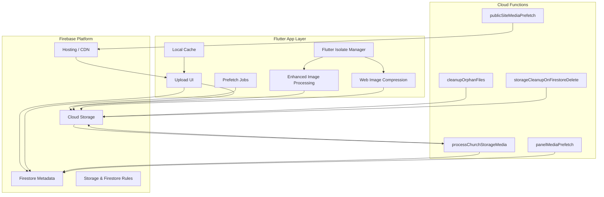

**Diagram sources**
- [firebase.json](file://firebase.json)
- [storage.rules](file://storage.rules)
- [firestore.rules](file://firestore.rules)
- [functions/index.js](file://functions/index.js)
- [functions/processChurchStorageMedia.js](file://functions/processChurchStorageMedia.js)
- [functions/cleanupOrphanFiles.js](file://functions/cleanupOrphanFiles.js)
- [functions/storageCleanupOnFirestoreDelete.js](file://functions/storageCleanupOnFirestoreDelete.js)
- [functions/panelMediaPrefetch.js](file://functions/panelMediaPrefetch.js)
- [functions/publicSiteMediaPrefetch.js](file://functions/publicSiteMediaPrefetch.js)
- [flutter_app/lib/services/eco_fire_image_process.dart](file://flutter_app/lib/services/eco_fire_image_process.dart)
- [flutter_app/lib/services/web_image_compress_service.dart](file://flutter_app/lib/services/web_image_compress_service.dart)

**Section sources**
- [firebase.json](file://firebase.json)
- [flutter_app/MIDIA_STORAGE_PADRAO_ECOFIRE.md](file://flutter_app/MIDIA_STORAGE_PADRAO_ECOFIRE.md)

## Core Components
- Upload Pipeline: Client-side validation, chunked or direct uploads to Firebase Storage, then triggers server-side processing with enhanced preprocessing using Flutter isolates.
- Image Optimization: Resize, format conversion, quality tuning via Cloud Functions; generates optimized variants and thumbnails with improved client-side processing using background isolates.
- Video Processing: Transcoding, adaptive bitrate preparation, fast-start optimization for streaming.
- Thumbnail Generation: Extract frames or generate static thumbnails for images and videos.
- CDN Integration: Hosting configuration and cache headers for global delivery.
- Storage Organization: Tenant-scoped paths, consistent naming conventions, and metadata indexing.
- Access Control: Fine-grained rules per tenant/user, role-based read/write permissions.
- Caching Strategies: Browser/CDN caching, client-side caching, and pre-warming via prefetch functions.
- Metadata Management: Firestore documents store media attributes, processing status, URLs, and relationships.
- **Background Image Compression**: Non-blocking image compression using Flutter isolates for optimal performance.
- **Web-based Image Compression**: Client-side image compression for web platforms to reduce upload bandwidth.

**Section sources**
- [flutter_app/MIDIA_STORAGE_PADRAO_ECOFIRE.md](file://flutter_app/MIDIA_STORAGE_PADRAO_ECOFIRE.md)
- [functions/processChurchStorageMedia.js](file://functions/processChurchStorageMedia.js)
- [functions/panelMediaPrefetch.js](file://functions/panelMediaPrefetch.js)
- [functions/publicSiteMediaPrefetch.js](file://functions/publicSiteMediaPrefetch.js)
- [flutter_app/lib/services/eco_fire_image_process.dart](file://flutter_app/lib/services/eco_fire_image_process.dart)
- [flutter_app/lib/services/web_image_compress_service.dart](file://flutter_app/lib/services/web_image_compress_service.dart)

## Architecture Overview
The media architecture follows an event-driven pattern with enhanced background processing using Flutter isolates:
- Uploads trigger Storage events with pre-processed images when available through isolate-based compression.
- Cloud Functions consume events to optimize, transcode, and update metadata.
- Hosting serves optimized assets through CDN with appropriate cache policies.
- Prefetch functions proactively prepare content for panels and public sites.
- Web-based compression reduces bandwidth usage before upload.
- Background isolates ensure non-blocking image processing operations.

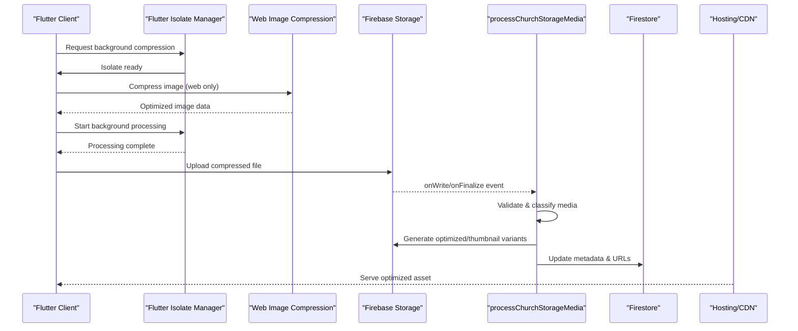

**Diagram sources**
- [functions/index.js](file://functions/index.js)
- [functions/processChurchStorageMedia.js](file://functions/processChurchStorageMedia.js)
- [firebase.json](file://firebase.json)
- [flutter_app/lib/services/web_image_compress_service.dart](file://flutter_app/lib/services/web_image_compress_service.dart)
- [flutter_app/lib/services/eco_fire_image_process.dart](file://flutter_app/lib/services/eco_fire_image_process.dart)

## Detailed Component Analysis

### Upload Pipeline
- Client Validation: File type, size limits, and tenant context validated before upload.
- **Enhanced Preprocessing**: Improved image processing with ecofire_image_process.dart using Flutter isolates for background processing and better quality and performance.
- Direct Upload: Uses Firebase Storage SDK for secure, resumable uploads with better error handling.
- Event Trigger: Storage write triggers Cloud Function for processing.
- Error Handling: Retries, dead-letter logging, and rollback on failure.

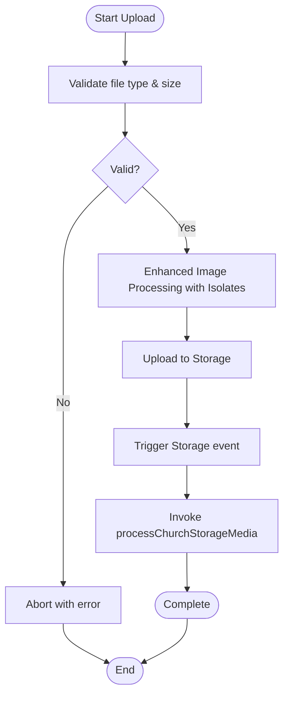

**Updated** Enhanced preprocessing capabilities with Flutter isolates for background image processing

**Section sources**
- [flutter_app/MIDIA_STORAGE_PADRAO_ECOFIRE.md](file://flutter_app/MIDIA_STORAGE_PADRAO_ECOFIRE.md)
- [functions/index.js](file://functions/index.js)
- [flutter_app/lib/services/eco_fire_image_process.dart](file://flutter_app/lib/services/eco_fire_image_process.dart)

### Image Optimization
- Supported Formats: JPEG, PNG, WebP, AVIF where applicable.
- Processing Steps: Detect orientation, resize to target dimensions, convert to optimal format, adjust quality.
- Output Variants: Original, optimized, and thumbnail versions stored under tenant-specific paths.
- Metadata Updates: Store width, height, format, size, and CDN URL in Firestore.
- **Enhanced Processing**: Improved image processing algorithms with better quality preservation and performance optimization using background isolates.

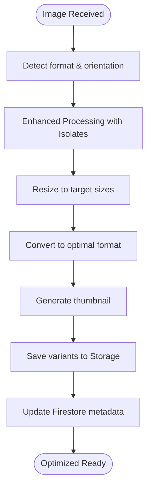

**Updated** Enhanced image processing with Flutter isolates for improved algorithms and quality preservation

**Section sources**
- [functions/processChurchStorageMedia.js](file://functions/processChurchStorageMedia.js)
- [flutter_app/lib/services/eco_fire_image_process.dart](file://flutter_app/lib/services/eco_fire_image_process.dart)

### Video Processing
- Input Formats: MP4, MOV, MKV, etc., with transcoding to MP4/H.264 for broad compatibility.
- Streaming Optimization: Fast-start moov atom placement for progressive playback.
- Adaptive Bitrates: Optional multi-bitrate renditions for responsive streaming.
- Thumbnails: Frame extraction at key timestamps for preview cards.

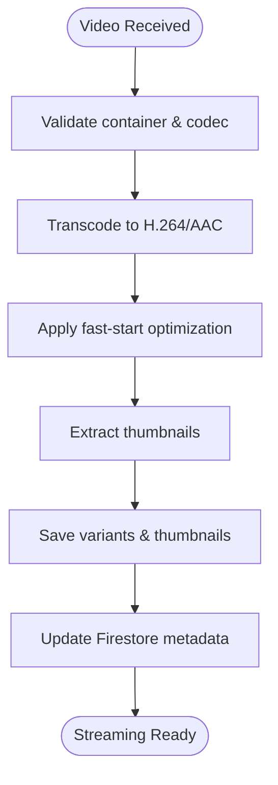

**Section sources**
- [functions/processChurchStorageMedia.js](file://functions/processChurchStorageMedia.js)
- [scripts/ffmpeg_faststart_public_videos.ps1](file://scripts/ffmpeg_faststart_public_videos.ps1)

### Web-based Image Compression
- **New Feature**: Client-side image compression for web platforms using JavaScript-based compression libraries.
- Compression Algorithms: Multiple compression options including lossless and lossy compression modes.
- Quality Settings: Configurable compression quality levels to balance file size and image quality.
- Format Support: Automatic format detection and conversion to optimal web formats.
- Bandwidth Reduction: Significant reduction in upload bandwidth usage for large images.

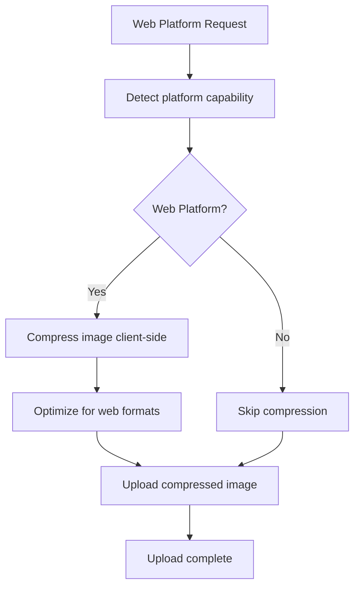

**New Section** Added web-based image compression for bandwidth optimization

**Section sources**
- [flutter_app/lib/services/web_image_compress_service.dart](file://flutter_app/lib/services/web_image_compress_service.dart)

### Thumbnail Generation
- Static Thumbnails: For images and selected frames from videos.
- Dynamic Thumbnails: Optional server-side generation for specific sizes.
- Caching: CDN caches thumbnails based on URL parameters.

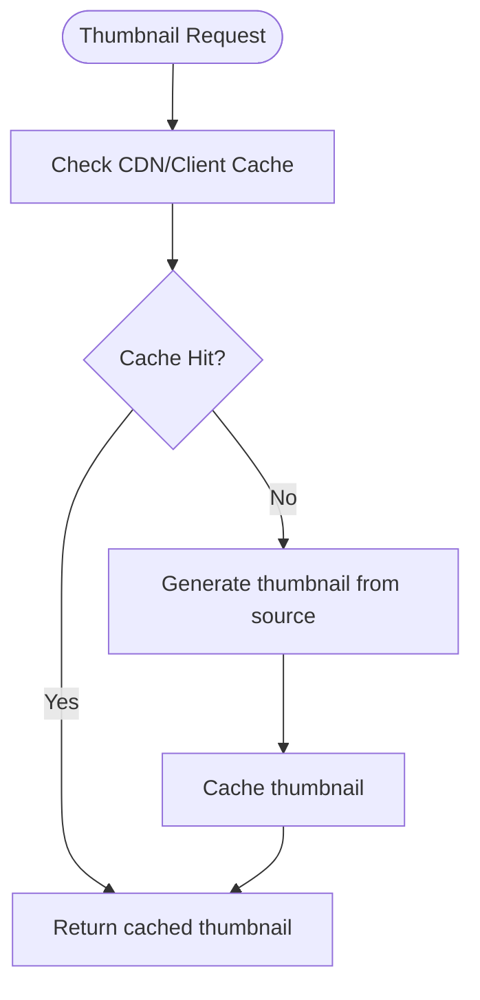

**Section sources**
- [functions/processChurchStorageMedia.js](file://functions/processChurchStorageMedia.js)

### CDN Integration
- Hosting Configuration: Global distribution with cache-control headers.
- Cache Policies: Long-lived immutable URLs for optimized assets; short TTL for dynamic thumbnails.
- Domain Alignment: Custom domains and HTTPS enforcement.

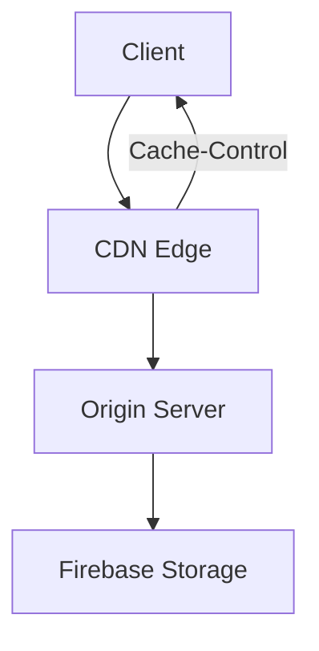

**Section sources**
- [firebase.json](file://firebase.json)

### Storage Organization
- Tenant Scoping: All assets under tenant-specific folders to isolate data.
- Naming Convention: UUID-based filenames with prefixes indicating type and purpose.
- Metadata Indexing: Firestore collections link assets to entities (events, members, announcements).
- **Enhanced Storage Operations**: Improved storage service with better error handling and retry mechanisms.

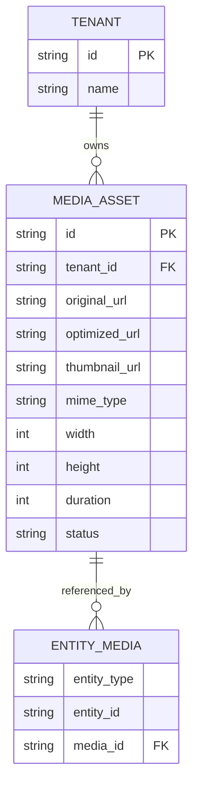

**Updated** Enhanced storage operations with improved reliability and error handling

**Section sources**
- [flutter_app/MIDIA_STORAGE_PADRAO_ECOFIRE.md](file://flutter_app/MIDIA_STORAGE_PADRAO_ECOFIRE.md)
- [flutter_app/lib/services/firebase_storage_service.dart](file://flutter_app/lib/services/firebase_storage_service.dart)

### Access Control
- Storage Rules: Enforce tenant ownership and role-based access.
- Firestore Rules: Restrict metadata reads/writes by authenticated users and roles.
- Signed URLs: Temporary access tokens for secure sharing.

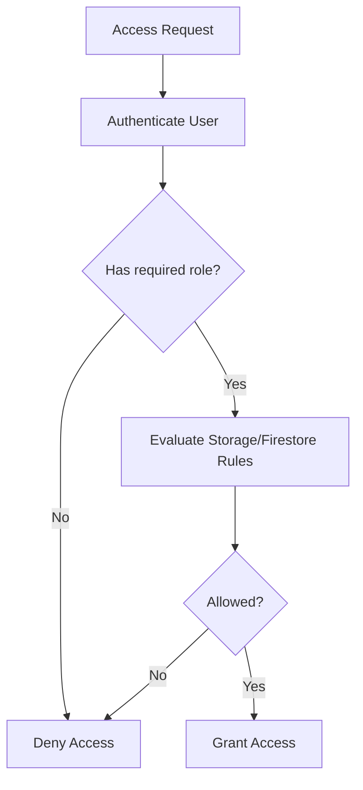

**Section sources**
- [storage.rules](file://storage.rules)
- [firestore.rules](file://firestore.rules)

### Caching Strategies
- CDN Caching: Immutable URLs for optimized assets; cache-busting via versioned paths.
- Client-Side Cache: In-memory and disk caches in Flutter for faster rendering.
- Prefetch Jobs: Background functions preload frequently accessed media.

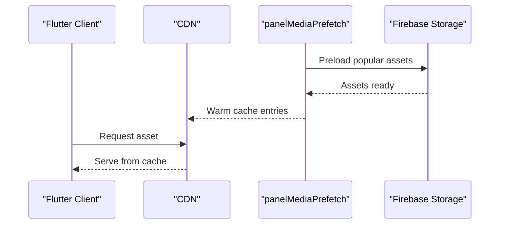

**Section sources**
- [functions/panelMediaPrefetch.js](file://functions/panelMediaPrefetch.js)
- [functions/publicSiteMediaPrefetch.js](file://functions/publicSiteMediaPrefetch.js)

### Metadata Management
- Firestore Schema: Stores media attributes, processing status, relationships, and CDN URLs.
- Sync Mechanism: Cloud Functions update metadata upon successful processing.
- Query Optimization: Indexed fields for efficient retrieval and filtering.

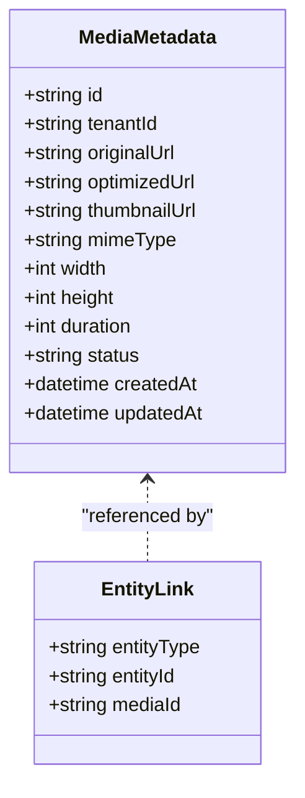

**Section sources**
- [functions/processChurchStorageMedia.js](file://functions/processChurchStorageMedia.js)

### Background Processing Jobs
- Orchestration: Cloud Functions handle asynchronous tasks like optimization and cleanup.
- Retry Logic: Exponential backoff and retry policies for resilience.
- Monitoring: Logging and metrics for job success/failure rates.

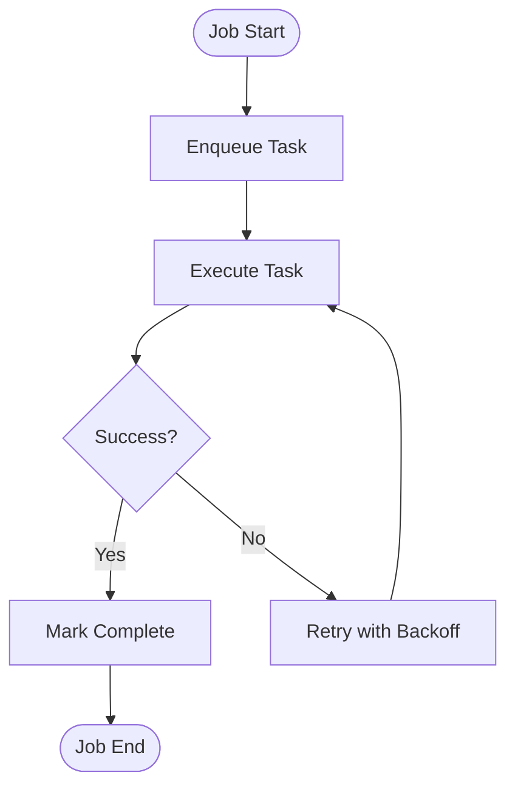

**Section sources**
- [functions/index.js](file://functions/index.js)

### Storage Cleanup Operations
- Orphan Detection: Identify unused files not referenced by metadata.
- Deletion Policy: Remove orphaned files after grace period.
- Delete Cascade: On Firestore document deletion, remove associated Storage files.

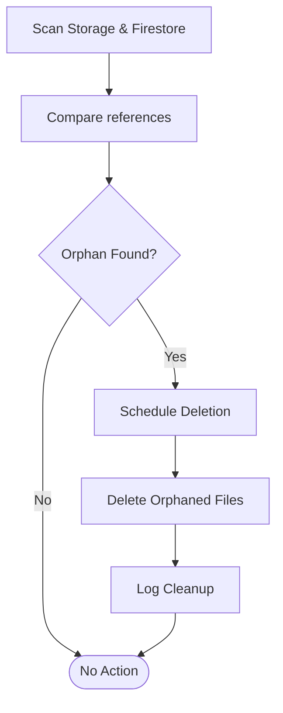

**Section sources**
- [functions/cleanupOrphanFiles.js](file://functions/cleanupOrphanFiles.js)
- [functions/storageCleanupOnFirestoreDelete.js](file://functions/storageCleanupOnFirestoreDelete.js)

## Background Image Compression with Flutter Isolates

### Isolate Architecture
The enhanced media processing pipeline utilizes Flutter isolates for non-blocking image compression operations:
- **Isolate Manager**: Coordinates background compression tasks across multiple isolates.
- **Task Queue**: Manages compression requests and worker allocation.
- **Memory Management**: Efficient memory handling for large image processing operations.
- **Error Recovery**: Graceful error handling and fallback mechanisms.

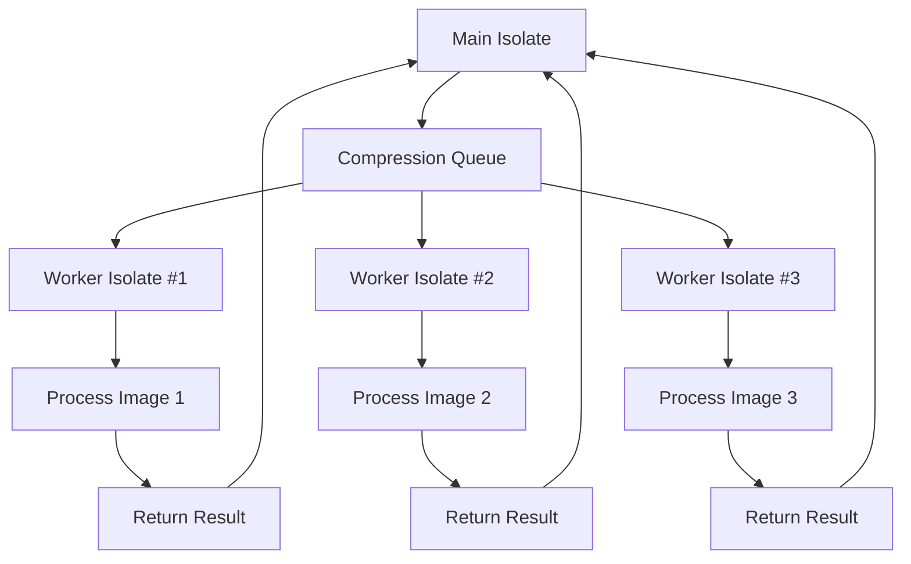

**Diagram sources**
- [flutter_app/lib/services/eco_fire_image_process.dart](file://flutter_app/lib/services/eco_fire_image_process.dart)

### Key Features
- **Non-blocking Operations**: Image compression runs in separate isolates without blocking UI thread.
- **Parallel Processing**: Multiple images can be compressed simultaneously.
- **Resource Optimization**: Intelligent memory management prevents out-of-memory errors.
- **Progress Tracking**: Real-time progress updates for long-running compression tasks.
- **Fallback Mechanisms**: Automatic fallback to main isolate if isolate creation fails.

### Implementation Details
- **Isolate Communication**: Message passing between main and worker isolates.
- **Serialization**: Efficient serialization of image data for cross-isolate transfer.
- **Resource Cleanup**: Automatic cleanup of isolate resources after task completion.
- **Monitoring**: Built-in monitoring for isolate health and performance metrics.

**Section sources**
- [flutter_app/lib/services/eco_fire_image_process.dart](file://flutter_app/lib/services/eco_fire_image_process.dart)

## Dependency Analysis
Key dependencies include:
- Firebase SDKs for Storage and Firestore.
- FFmpeg for video processing.
- Image libraries for optimization and thumbnails.
- Hosting configuration for CDN behavior.
- **Enhanced Dependencies**: Improved image processing libraries and web compression utilities with Flutter isolate support.

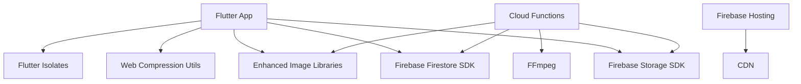

**Updated** Added Flutter isolates dependency for background processing

**Section sources**
- [functions/package.json](file://functions/package.json)
- [firebase.json](file://firebase.json)
- [flutter_app/lib/services/eco_fire_image_process.dart](file://flutter_app/lib/services/eco_fire_image_process.dart)
- [flutter_app/lib/services/web_image_compress_service.dart](file://flutter_app/lib/services/web_image_compress_service.dart)

## Performance Considerations
- Optimize Asset Sizes: Use modern formats (WebP, AVIF) and appropriate compression levels.
- Leverage CDN: Enable long cache times for immutable URLs.
- Batch Operations: Group metadata updates to reduce Firestore writes.
- Monitor Bandwidth: Track usage and set quotas to prevent abuse.
- Prefetch Critical Content: Proactively load high-demand assets.
- **Enhanced Client-side Processing**: Improved image processing with Flutter isolates reduces server load and improves upload speed.
- **Web Compression Benefits**: Client-side compression significantly reduces bandwidth usage for web platforms.
- **Better Storage Operations**: Enhanced storage service provides more reliable uploads with better error handling.
- **Background Processing**: Flutter isolates enable non-blocking image compression without UI interruption.
- **Memory Efficiency**: Isolate-based processing optimizes memory usage for large image operations.

**Updated** Added performance benefits from Flutter isolates, background processing, and enhanced compression techniques

[No sources needed since this section provides general guidance]

## Troubleshooting Guide
Common issues and resolutions:
- Upload Failures: Check network connectivity, file size limits, and Storage rules.
- Processing Errors: Review Cloud Function logs for FFmpeg or image library errors.
- Missing Thumbnails: Verify generation jobs and CDN cache invalidation.
- Access Denied: Audit Storage and Firestore rules for correct tenant scoping.
- Stale Cache: Invalidate CDN cache or use cache-busting URLs.
- **Web Compression Issues**: Verify browser compatibility and compression settings.
- **Image Processing Errors**: Check ecofire_image_process.dart logs for processing failures.
- **Storage Service Problems**: Review firebase_storage_service.dart error handling and retry logic.
- **Isolate Memory Issues**: Monitor isolate memory usage and implement proper cleanup.
- **Background Processing Failures**: Check isolate communication and message serialization.

**Updated** Added troubleshooting guidance for Flutter isolates and background processing issues

**Section sources**
- [functions/processChurchStorageMedia.js](file://functions/processChurchStorageMedia.js)
- [functions/cleanupOrphanFiles.js](file://functions/cleanupOrphanFiles.js)
- [flutter_app/lib/services/eco_fire_image_process.dart](file://flutter_app/lib/services/eco_fire_image_process.dart)
- [flutter_app/lib/services/web_image_compress_service.dart](file://flutter_app/lib/services/web_image_compress_service.dart)
- [flutter_app/lib/services/firebase_storage_service.dart](file://flutter_app/lib/services/firebase_storage_service.dart)

## Conclusion
The media management system in Gestão Yahweh Premium is designed for scalability, security, and performance. By leveraging Firebase Storage, Cloud Functions, and Hosting, it delivers optimized assets globally with robust access control and caching. The modular architecture supports diverse file formats, background processing, and automated cleanup, ensuring a reliable and efficient media experience. Recent enhancements include Flutter isolate-based background image compression, improved upload optimization, and advanced bandwidth reduction techniques that significantly improve media handling performance while maintaining excellent user experience through non-blocking operations.

[No sources needed since this section summarizes without analyzing specific files]

## Appendices

### Examples

#### Uploading Files
- Validate file type and size in the Flutter app.
- Use Firebase Storage SDK to upload directly with tenant context.
- Handle progress and errors gracefully.
- **Enhanced**: Utilize improved image processing with Flutter isolates for better quality and performance.

**Updated** Added reference to Flutter isolate-based image processing capabilities

**Section sources**
- [flutter_app/MIDIA_STORAGE_PADRAO_ECOFIRE.md](file://flutter_app/MIDIA_STORAGE_PADRAO_ECOFIRE.md)
- [flutter_app/lib/services/eco_fire_image_process.dart](file://flutter_app/lib/services/eco_fire_image_process.dart)

#### Optimizing Images
- Trigger Cloud Function on Storage write.
- Generate optimized variants and thumbnails.
- Update Firestore metadata with new URLs.
- **Enhanced**: Improved processing algorithms with Flutter isolates provide better quality and performance.

**Updated** Added information about Flutter isolate-based image processing improvements

**Section sources**
- [functions/processChurchStorageMedia.js](file://functions/processChurchStorageMedia.js)
- [flutter_app/lib/services/eco_fire_image_process.dart](file://flutter_app/lib/services/eco_fire_image_process.dart)

#### Web-based Image Compression
- Implement client-side compression for web platforms.
- Configure compression quality settings based on requirements.
- Handle compression errors gracefully with fallback mechanisms.
- Monitor bandwidth savings and compression effectiveness.

**New Section** Added web-based image compression example

**Section sources**
- [flutter_app/lib/services/web_image_compress_service.dart](file://flutter_app/lib/services/web_image_compress_service.dart)

#### Background Image Compression with Isolates
- Initialize isolate manager for background processing.
- Queue compression tasks with priority and memory limits.
- Monitor isolate health and resource usage.
- Handle isolation failures with graceful fallbacks.

**New Section** Added Flutter isolate-based background compression example

**Section sources**
- [flutter_app/lib/services/eco_fire_image_process.dart](file://flutter_app/lib/services/eco_fire_image_process.dart)

#### Streaming Videos
- Transcode to H.264/AAC with fast-start optimization.
- Serve via CDN with appropriate cache headers.
- Extract thumbnails for preview.

**Section sources**
- [scripts/ffmpeg_faststart_public_videos.ps1](file://scripts/ffmpeg_faststart_public_videos.ps1)
- [functions/processChurchStorageMedia.js](file://functions/processChurchStorageMedia.js)

#### Managing Media Libraries
- Query Firestore for tenant-scoped assets.
- Display thumbnails and metadata in UI.
- Implement delete cascade to remove Storage files.
- **Enhanced**: Better storage operations with improved reliability provide more reliable file management.

**Updated** Added reference to enhanced storage operations with better error handling

**Section sources**
- [functions/storageCleanupOnFirestoreDelete.js](file://functions/storageCleanupOnFirestoreDelete.js)
- [flutter_app/lib/services/firebase_storage_service.dart](file://flutter_app/lib/services/firebase_storage_service.dart)

### Security Best Practices
- Enforce tenant isolation with Storage rules.
- Use signed URLs for temporary access.
- Regularly audit Firestore and Storage rules.
- **Enhanced**: Secure isolate communication and memory management practices.

**Section sources**
- [storage.rules](file://storage.rules)
- [firestore.rules](file://firestore.rules)

### Bandwidth Optimization
- Compress assets aggressively.
- Use CDN caching effectively.
- Monitor and limit excessive downloads.
- **Enhanced**: Client-side web compression significantly reduces upload bandwidth.
- **Improved Processing**: Flutter isolate-based processing reduces file sizes while maintaining quality.
- **Background Processing**: Non-blocking compression operations improve overall bandwidth efficiency.

**Updated** Added bandwidth optimization benefits from Flutter isolates and enhanced compression features

[No sources needed since this section provides general guidance]

### Retention Policies
- Define lifecycle rules for orphaned files.
- Implement automatic cleanup jobs.
- Archive old media based on business needs.
- **Enhanced**: Improved cleanup operations with better error handling and monitoring.

**Section sources**
- [functions/cleanupOrphanFiles.js](file://functions/cleanupOrphanFiles.js)
- [scripts/cleanup_bpc_keep_membros_only.cjs](file://scripts/cleanup_bpc_keep_membros_only.cjs)