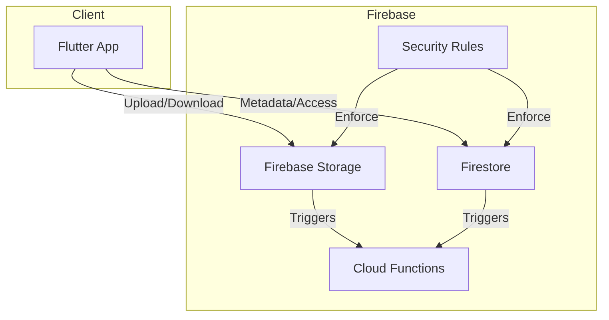
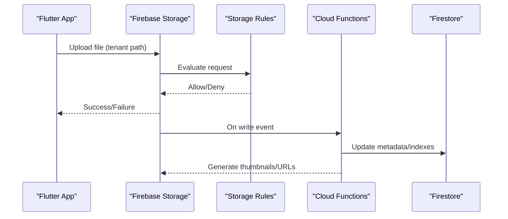
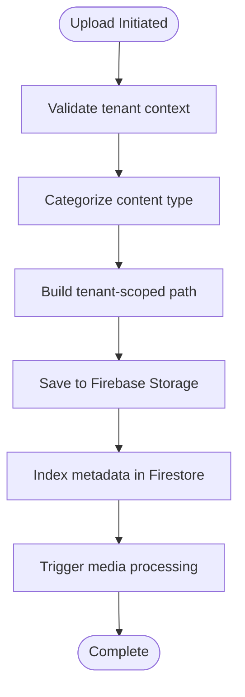
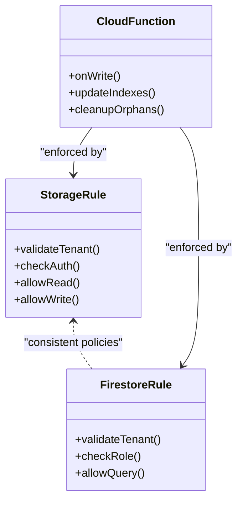
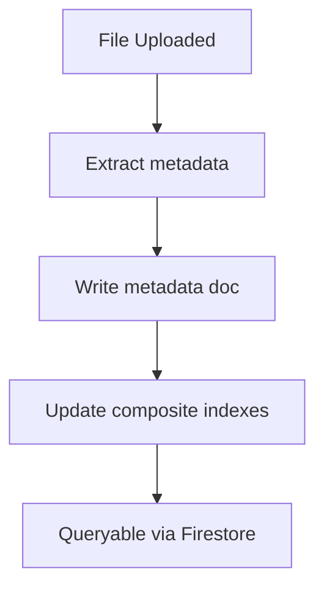
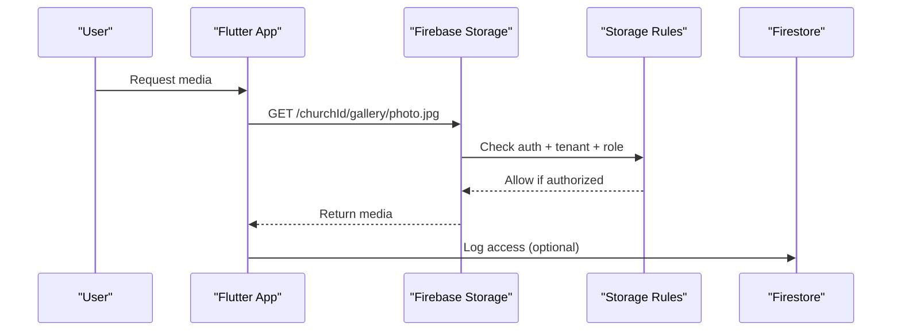
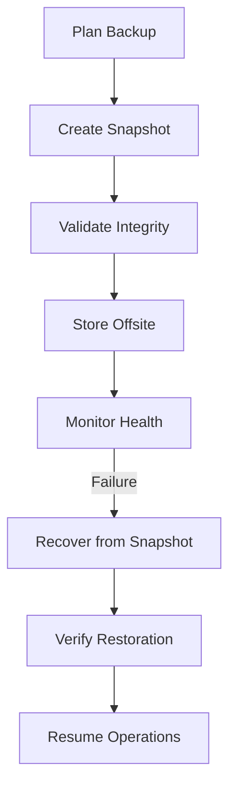
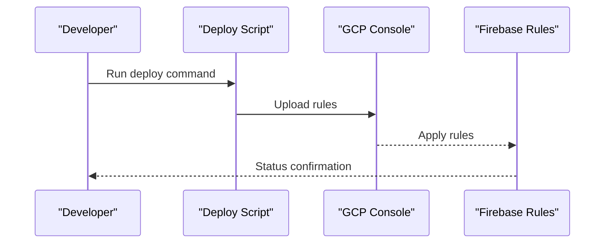
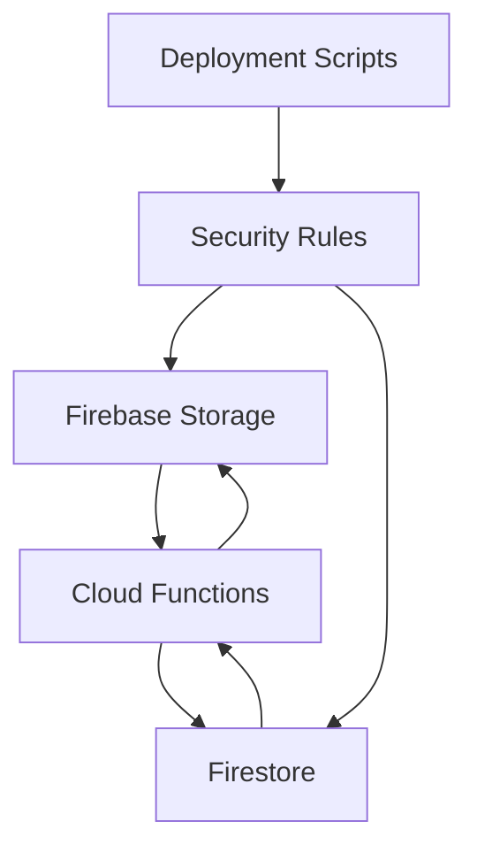

# Storage Organization & Security

<cite>
**Referenced Files in This Document**
- [storage.rules](file://storage.rules)
- [firestore.rules](file://firestore.rules)
- [firebase.json](file://firebase.json)
- [functions/index.js](file://functions/index.js)
- [functions/churchStorageStructure.js](file://functions/churchStorageStructure.js)
- [functions/migrateStorageConsolidated.js](file://functions/migrateStorageConsolidated.js)
- [functions/storageCleanupOnFirestoreDelete.js](file://functions/storageCleanupOnFirestoreDelete.js)
- [functions/cleanupOrphanFiles.js](file://functions/cleanupOrphanFiles.js)
- [functions/processChurchStorageMedia.js](file://functions/processChurchStorageMedia.js)
- [functions/storageDisplayUrls.js](file://functions/storageDisplayUrls.js)
- [flutter_app/MIDIA_STORAGE_PADRAO_ECOFIRE.md](file://flutter_app/MIDIA_STORAGE_PADRAO_ECOFIRE.md)
- [flutter_app/STORAGE_CORS_README.txt](file://flutter_app/STORAGE_CORS_README.txt)
- [flutter_app/storage_cors.json](file://flutter_app/storage_cors.json)
- [scripts/apply_storage_cors.ps1](file://scripts/apply_storage_cors.ps1)
- [scripts/firebase_rules_gcp_publish.cjs](file://scripts/firebase_rules_gcp_publish.cjs)
- [scripts/deploy_firebase_rules.ps1](file://scripts/deploy_firebase_rules.ps1)
</cite>

## Table of Contents
1. [Introduction](#introduction)
2. [Project Structure](#project-structure)
3. [Core Components](#core-components)
4. [Architecture Overview](#architecture-overview)
5. [Detailed Component Analysis](#detailed-component-analysis)
6. [Dependency Analysis](#dependency-analysis)
7. [Performance Considerations](#performance-considerations)
8. [Troubleshooting Guide](#troubleshooting-guide)
9. [Conclusion](#conclusion)
10. [Appendices](#appendices)

## Introduction
This document explains how storage is organized and secured across tenants, how access control policies are enforced, and how media assets are categorized, indexed, and optimized. It covers Firebase Storage rules, Firestore permissions, Cloud Functions for lifecycle management, CORS configuration, quotas and monitoring, backup and disaster recovery, and data migration strategies. The goal is to provide a clear, actionable guide for developers and operators to maintain secure, scalable, and cost-efficient storage.

## Project Structure
The project uses Firebase as the backend with:
- Firebase Storage for binary assets (images, videos, documents)
- Firestore for metadata and access policies
- Cloud Functions for automation (cleanup, processing, URL generation)
- Flutter app for client-side interactions
- Scripts and CI for deploying rules and applying CORS

**Diagram sources**
- [firebase.json](file://firebase.json)
- [storage.rules](file://storage.rules)
- [firestore.rules](file://firestore.rules)
- [functions/index.js](file://functions/index.js)

**Section sources**
- [firebase.json](file://firebase.json)
- [flutter_app/MIDIA_STORAGE_PADRAO_ECOFIRE.md](file://flutter_app/MIDIA_STORAGE_PADRAO_ECOFIRE.md)
- [flutter_app/STORAGE_CORS_README.txt](file://flutter_app/STORAGE_CORS_README.txt)

## Core Components
- Storage organization per tenant:
  - Root path includes tenant identifier (e.g., churchId) to isolate data.
  - Subfolders categorize content by type (e.g., images, videos, documents).
  - File naming includes tenant-scoped identifiers and timestamps for uniqueness and traceability.
- Metadata and indexing:
  - Firestore stores file metadata, ownership, roles, and indexes for search.
  - Cloud Functions update indexes on upload/delete events.
- Access control:
  - Firebase Storage rules enforce tenant isolation and role-based access.
  - Firestore rules mirror storage policies for consistent authorization.
- Automation:
  - Cleanup functions remove orphaned files and stale uploads.
  - Media processing functions generate thumbnails and optimize assets.
  - Display URL generation provides short-lived or signed URLs.

**Section sources**
- [functions/churchStorageStructure.js](file://functions/churchStorageStructure.js)
- [functions/storageCleanupOnFirestoreDelete.js](file://functions/storageCleanupOnFirestoreDelete.js)
- [functions/cleanupOrphanFiles.js](file://functions/cleanupOrphanFiles.js)
- [functions/processChurchStorageMedia.js](file://functions/processChurchStorageMedia.js)
- [functions/storageDisplayUrls.js](file://functions/storageDisplayUrls.js)
- [flutter_app/MIDIA_STORAGE_PADRAO_ECOFIRE.md](file://flutter_app/MIDIA_STORAGE_PADRAO_ECOFIRE.md)

## Architecture Overview
The system enforces security at multiple layers:
- Client layer validates user identity and tenant context before requests.
- Security rules validate token claims and resource ownership.
- Cloud Functions handle background tasks triggered by storage or database changes.
- CORS configuration allows browser-based clients to interact safely.

**Diagram sources**
- [storage.rules](file://storage.rules)
- [functions/processChurchStorageMedia.js](file://functions/processChurchStorageMedia.js)
- [functions/storageDisplayUrls.js](file://functions/storageDisplayUrls.js)
- [firestore.rules](file://firestore.rules)

## Detailed Component Analysis

### Storage Organization and Naming Conventions
- Tenant isolation:
  - All paths start with a tenant identifier to ensure strict data separation.
  - Examples include church-specific roots and aliases resolved via functions.
- Folder categories:
  - Images, videos, documents, and temporary uploads are separated into dedicated folders.
  - Thumbnails and processed variants live under structured subpaths.
- File naming:
  - Use UUIDs or hashed names combined with timestamps to avoid collisions.
  - Include content-type hints in metadata for efficient serving.

**Diagram sources**
- [functions/churchStorageStructure.js](file://functions/churchStorageStructure.js)
- [functions/processChurchStorageMedia.js](file://functions/processChurchStorageMedia.js)

**Section sources**
- [functions/churchStorageStructure.js](file://functions/churchStorageStructure.js)
- [flutter_app/MIDIA_STORAGE_PADRAO_ECOFIRE.md](file://flutter_app/MIDIA_STORAGE_PADRAO_ECOFIRE.md)

### Security Rules and Access Control Policies
- Storage rules:
  - Enforce tenant isolation by requiring tenant ID in path.
  - Restrict writes to authenticated users with appropriate roles.
  - Allow reads based on membership or public visibility flags.
- Firestore permissions:
  - Mirror storage policies for consistency.
  - Use custom claims or role fields to determine access.
- Permission inheritance:
  - Folder-level policies cascade to child resources unless overridden.
  - Admin overrides allowed via specific paths and conditions.

**Diagram sources**
- [storage.rules](file://storage.rules)
- [firestore.rules](file://firestore.rules)
- [functions/cleanupOrphanFiles.js](file://functions/cleanupOrphanFiles.js)

**Section sources**
- [storage.rules](file://storage.rules)
- [firestore.rules](file://firestore.rules)

### Metadata Storage and Search Indexing
- Metadata schema:
  - Store file path, size, MIME type, owner, tenant, tags, and visibility.
  - Maintain audit fields like created_at and updated_at.
- Indexing strategy:
  - Create composite indexes for common queries (tenant, category, date range).
  - Backfill indexes during migrations to support legacy data.
- Search optimization:
  - Use Firestore queries with filters and limits for paginated results.
  - Cache frequent queries via Cloud Functions or external caches.

**Diagram sources**
- [functions/processChurchStorageMedia.js](file://functions/processChurchStorageMedia.js)
- [functions/storageDisplayUrls.js](file://functions/storageDisplayUrls.js)

**Section sources**
- [functions/processChurchStorageMedia.js](file://functions/processChurchStorageMedia.js)
- [functions/storageDisplayUrls.js](file://functions/storageDisplayUrls.js)

### Media Library Organization and Access Controls
- Organizing libraries:
  - Group media by tenant and category (e.g., gallery, announcements).
  - Use shared folders for cross-user content within a tenant.
- Access controls:
  - Role-based read/write permissions (owner, editor, viewer).
  - Public links for non-sensitive content with expiration.
- Sensitive content:
  - Encrypt or restrict access via admin-only paths.
  - Log access attempts for auditing.

**Diagram sources**
- [storage.rules](file://storage.rules)
- [firestore.rules](file://firestore.rules)

**Section sources**
- [flutter_app/MIDIA_STORAGE_PADRAO_ECOFIRE.md](file://flutter_app/MIDIA_STORAGE_PADRAO_ECOFIRE.md)
- [storage.rules](file://storage.rules)

### Quotas, Usage Monitoring, and Cost Optimization
- Quotas:
  - Set per-tenant storage limits using Firestore counters and enforcement logic.
  - Monitor usage via Cloud Functions that aggregate sizes and notify on thresholds.
- Monitoring:
  - Track upload/download rates and error codes.
  - Alert on anomalies (spikes, failures).
- Cost optimization:
  - Compress images and transcode videos server-side.
  - Use CDN caching and signed URLs for hot content.
  - Archive old media to cheaper storage tiers.

**Section sources**
- [functions/cleanupOrphanFiles.js](file://functions/cleanupOrphanFiles.js)
- [functions/storageDisplayUrls.js](file://functions/storageDisplayUrls.js)

### Backup Strategies, Disaster Recovery, and Data Migration
- Backup strategies:
  - Regular snapshots of Firestore collections and exports of Storage buckets.
  - Versioned backups with retention policies.
- Disaster recovery:
  - Restore from latest snapshot with validation steps.
  - Failover procedures for critical services.
- Data migration:
  - Migrate legacy paths to consolidated structure.
  - Backfill metadata and indexes post-migration.

**Diagram sources**
- [functions/migrateStorageConsolidated.js](file://functions/migrateStorageConsolidated.js)

**Section sources**
- [functions/migrateStorageConsolidated.js](file://functions/migrateStorageConsolidated.js)

### Integration with Firebase Storage Security Rules and Firestore Permissions
- Storage rules:
  - Define allow/deny conditions based on authentication and tenant context.
  - Use wildcards for flexible path matching while enforcing constraints.
- Firestore permissions:
  - Align rules with storage policies for consistent access control.
  - Leverage custom claims for fine-grained roles.
- Deployment:
  - Use scripts to publish rules to GCP and verify syntax.
  - Automate deployments via CI/CD pipelines.

**Diagram sources**
- [scripts/firebase_rules_gcp_publish.cjs](file://scripts/firebase_rules_gcp_publish.cjs)
- [scripts/deploy_firebase_rules.ps1](file://scripts/deploy_firebase_rules.ps1)

**Section sources**
- [storage.rules](file://storage.rules)
- [firestore.rules](file://firestore.rules)
- [scripts/firebase_rules_gcp_publish.cjs](file://scripts/firebase_rules_gcp_publish.cjs)
- [scripts/deploy_firebase_rules.ps1](file://scripts/deploy_firebase_rules.ps1)

## Dependency Analysis
Key dependencies between components:
- Storage triggers Cloud Functions for processing and cleanup.
- Firestore updates drive index maintenance and policy enforcement.
- Security rules depend on authentication tokens and tenant context.
- Scripts manage rule deployment and CORS configuration.

**Diagram sources**
- [functions/index.js](file://functions/index.js)
- [storage.rules](file://storage.rules)
- [firestore.rules](file://firestore.rules)

**Section sources**
- [functions/index.js](file://functions/index.js)
- [storage.rules](file://storage.rules)
- [firestore.rules](file://firestore.rules)

## Performance Considerations
- Optimize uploads:
  - Chunk large files and retry failed segments.
  - Pre-validate content types and sizes client-side.
- Reduce bandwidth:
  - Serve resized images and compressed videos.
  - Use conditional requests and caching headers.
- Improve query performance:
  - Design Firestore schemas for efficient filtering.
  - Avoid deep nesting; flatten where possible.

[No sources needed since this section provides general guidance]

## Troubleshooting Guide
Common issues and resolutions:
- Access denied errors:
  - Verify tenant ID in path matches user’s context.
  - Check Firestore roles and Storage rule conditions.
- Orphaned files:
  - Run cleanup functions to remove unused assets.
  - Audit delete operations to ensure cascading removal.
- CORS errors:
  - Ensure CORS configuration allows required origins and methods.
  - Reapply CORS settings via scripts if necessary.

**Section sources**
- [functions/cleanupOrphanFiles.js](file://functions/cleanupOrphanFiles.js)
- [flutter_app/STORAGE_CORS_README.txt](file://flutter_app/STORAGE_CORS_README.txt)
- [scripts/apply_storage_cors.ps1](file://scripts/apply_storage_cors.ps1)

## Conclusion
This documentation outlines a robust approach to storage organization and security for multi-tenant applications. By enforcing strict tenant isolation, aligning Firestore and Storage rules, automating lifecycle management, and optimizing for performance and cost, the system ensures secure, scalable, and maintainable operations. Adhering to these guidelines will help prevent data leaks, reduce operational overhead, and improve user experience.

[No sources needed since this section summarizes without analyzing specific files]

## Appendices
- CORS configuration examples:
  - Refer to storage_cors.json and apply via scripts.
- Rule deployment best practices:
  - Test locally before publishing to production.
  - Use versioned backups of rules for rollback.

**Section sources**
- [flutter_app/storage_cors.json](file://flutter_app/storage_cors.json)
- [scripts/apply_storage_cors.ps1](file://scripts/apply_storage_cors.ps1)