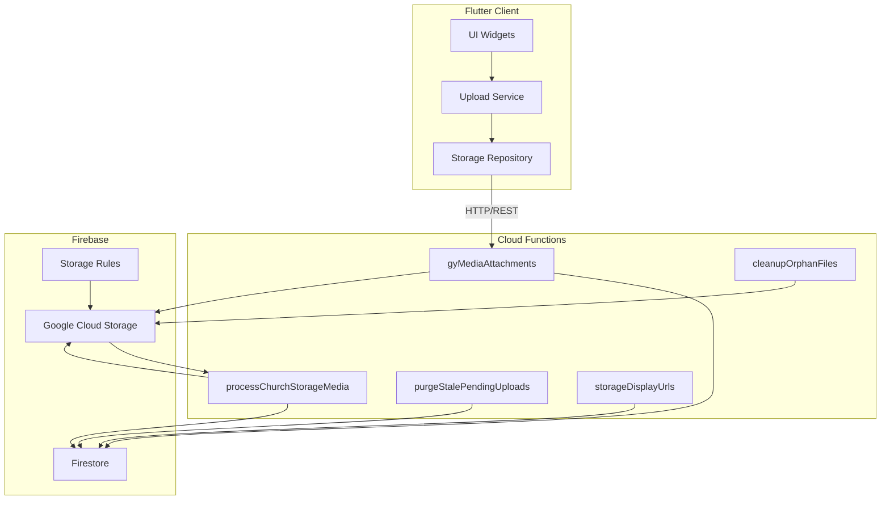
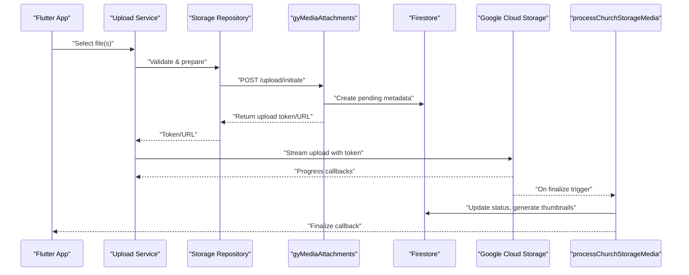
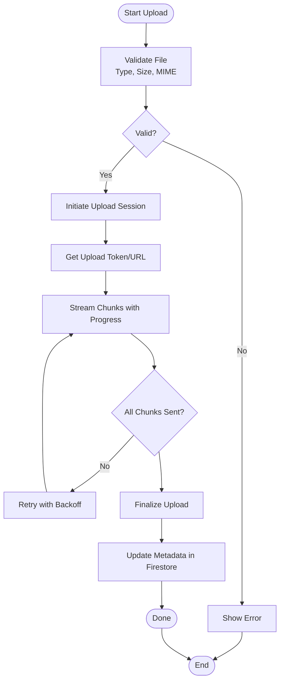
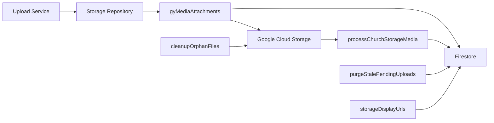

# Upload Pipeline & Validation

<cite>
**Referenced Files in This Document**
- [flutter_app/lib/services/upload_service.dart](file://flutter_app/lib/services/upload_service.dart)
- [flutter_app/lib/repositories/storage_repository.dart](file://flutter_app/lib/repositories/storage_repository.dart)
- [functions/src/gyMediaAttachments.ts](file://functions/src/gyMediaAttachments.ts)
- [functions/src/processChurchStorageMedia.ts](file://functions/src/processChurchStorageMedia.ts)
- [functions/src/purgeStalePendingUploads.ts](file://functions/src/purgeStalePendingUploads.ts)
- [functions/src/cleanupOrphanFiles.ts](file://functions/src/cleanupOrphanFiles.ts)
- [functions/src/storageDisplayUrls.ts](file://functions/src/storageDisplayUrls.ts)
- [storage.rules](file://storage.rules)
- [firestore.rules](file://firestore.rules)
- [flutter_app/MIDIA_STORAGE_PADRAO_ECOFIRE.md](file://flutter_app/MIDIA_STORAGE_PADRAO_ECOFIRE.md)
- [flutter_app/storage_cors.json](file://flutter_app/storage_cors.json)
</cite>

## Table of Contents
1. Introduction
2. Project Structure
3. Core Components
4. Architecture Overview
5. Detailed Component Analysis
6. Dependency Analysis
7. Performance Considerations
8. Troubleshooting Guide
9. Conclusion

## Introduction
This document explains the end-to-end media upload pipeline and validation system, covering client-side Flutter implementation, server-side processing, storage rules, and operational safeguards. It details file type validation, size limits, security checks, progress tracking, retry mechanisms, background uploads, MIME verification, virus scanning integration points, and malicious file detection strategies. It also provides guidance for secure uploads, large file handling, queue management, user feedback, timeout handling, and network resilience patterns.

## Project Structure
The upload pipeline spans three main layers:
- Flutter client layer: handles file selection, validation, chunked uploads, progress reporting, retries, and background persistence.
- Cloud Functions layer: orchestrates metadata updates, post-processing (thumbnails, virus scan), cleanup, and URL generation.
- Storage and Security layer: Firebase Storage with strict rules and CORS configuration to enforce access control and safe operations.

**Diagram sources**
- [flutter_app/lib/services/upload_service.dart](file://flutter_app/lib/services/upload_service.dart)
- [flutter_app/lib/repositories/storage_repository.dart](file://flutter_app/lib/repositories/storage_repository.dart)
- [functions/src/gyMediaAttachments.ts](file://functions/src/gyMediaAttachments.ts)
- [functions/src/processChurchStorageMedia.ts](file://functions/src/processChurchStorageMedia.ts)
- [functions/src/purgeStalePendingUploads.ts](file://functions/src/purgeStalePendingUploads.ts)
- [functions/src/cleanupOrphanFiles.ts](file://functions/src/cleanupOrphanFiles.ts)
- [functions/src/storageDisplayUrls.ts](file://functions/src/storageDisplayUrls.ts)
- [storage.rules](file://storage.rules)

**Section sources**
- [flutter_app/MIDIA_STORAGE_PADRAO_ECOFIRE.md](file://flutter_app/MIDIA_STORAGE_PADRAO_ECOFIRE.md)
- [flutter_app/storage_cors.json](file://flutter_app/storage_cors.json)

## Core Components
- Upload Service (Flutter): Orchestrates upload lifecycle, validates files, manages chunks, tracks progress, and persists state for background resumption.
- Storage Repository (Flutter): Encapsulates HTTP calls to Cloud Functions and direct Storage interactions where appropriate.
- gyMediaAttachments (Cloud Function): Entry point for initiating uploads, validating inputs, creating metadata records, and returning signed URLs or upload tokens.
- processChurchStorageMedia (Cloud Function): Post-upload processor that generates thumbnails, performs virus scanning, and updates Firestore status.
- purgeStalePendingUploads (Cloud Function): Cleans up orphaned pending uploads and temporary metadata.
- cleanupOrphanFiles (Cloud Function): Removes unused files from Storage based on metadata state.
- storageDisplayUrls (Cloud Function): Generates short-lived display URLs for secure preview.
- Storage Rules: Enforce tenant scoping, MIME/type checks, size limits, and write permissions.
- Firestore Rules: Protect metadata writes and reads, ensuring only authorized tenants/users can modify upload states.

**Section sources**
- [flutter_app/lib/services/upload_service.dart](file://flutter_app/lib/services/upload_service.dart)
- [flutter_app/lib/repositories/storage_repository.dart](file://flutter_app/lib/repositories/storage_repository.dart)
- [functions/src/gyMediaAttachments.ts](file://functions/src/gyMediaAttachments.ts)
- [functions/src/processChurchStorageMedia.ts](file://functions/src/processChurchStorageMedia.ts)
- [functions/src/purgeStalePendingUploads.ts](file://functions/src/purgeStalePendingUploads.ts)
- [functions/src/cleanupOrphanFiles.ts](file://functions/src/cleanupOrphanFiles.ts)
- [functions/src/storageDisplayUrls.ts](file://functions/src/storageDisplayUrls.ts)
- [storage.rules](file://storage.rules)
- [firestore.rules](file://firestore.rules)

## Architecture Overview
The upload flow is designed for reliability and security:
- Client validates and prepares files, then requests an upload session via a Cloud Function.
- The function creates metadata in Firestore and returns an upload token or signed URL.
- The client streams data to Storage; progress is reported back to the client.
- On completion, a Cloud Function triggers post-processing: thumbnail generation, virus scanning, and metadata updates.
- Background jobs periodically clean stale uploads and orphaned files.
- Secure, time-limited URLs are generated for previews.

**Diagram sources**
- [flutter_app/lib/services/upload_service.dart](file://flutter_app/lib/services/upload_service.dart)
- [flutter_app/lib/repositories/storage_repository.dart](file://flutter_app/lib/repositories/storage_repository.dart)
- [functions/src/gyMediaAttachments.ts](file://functions/src/gyMediaAttachments.ts)
- [functions/src/processChurchStorageMedia.ts](file://functions/src/processChurchStorageMedia.ts)

## Detailed Component Analysis

### Flutter Upload Service
Responsibilities:
- File validation: type, size, MIME sniffing, and extension checks.
- Chunked upload strategy for large files with resumable sessions.
- Progress tracking and user feedback.
- Retry logic with exponential backoff and jitter.
- Background persistence using local storage to resume after app restarts.
- Cancellation and error propagation.

Key behaviors:
- Validates allowed MIME types and extensions against a whitelist.
- Enforces per-file and per-session size limits.
- Uses a unique session ID to coordinate chunks and metadata.
- Emits progress events for UI updates.
- Persists upload state to support background resumption.

**Diagram sources**
- [flutter_app/lib/services/upload_service.dart](file://flutter_app/lib/services/upload_service.dart)

**Section sources**
- [flutter_app/lib/services/upload_service.dart](file://flutter_app/lib/services/upload_service.dart)

### Storage Repository
Responsibilities:
- Encapsulates HTTP calls to Cloud Functions for upload initiation and status queries.
- Manages direct Storage uploads when applicable (e.g., signed URLs).
- Handles timeouts, retries, and network errors.
- Provides a consistent interface for the Upload Service.

Key behaviors:
- Configures headers and authentication tokens.
- Implements retry policies for transient failures.
- Normalizes responses and errors across platforms.

**Section sources**
- [flutter_app/lib/repositories/storage_repository.dart](file://flutter_app/lib/repositories/storage_repository.dart)

### Cloud Function: gyMediaAttachments
Responsibilities:
- Validates incoming request parameters (tenant, user, file metadata).
- Creates a pending upload record in Firestore with checksums and quotas.
- Returns an upload token or signed URL for secure transfer.
- Enforces rate limiting and quota checks per tenant/user.

Security considerations:
- Verifies caller identity and tenant context.
- Rejects disallowed MIME types and oversized payloads.
- Logs audit entries for compliance.

**Section sources**
- [functions/src/gyMediaAttachments.ts](file://functions/src/gyMediaAttachments.ts)

### Cloud Function: processChurchStorageMedia
Responsibilities:
- Triggered on Storage object finalization.
- Generates thumbnails and previews for images/videos.
- Integrates with virus scanning services (external API or internal scanner).
- Updates Firestore metadata to mark files as processed or flagged.
- Handles malformed or suspicious files by quarantining or deletion.

Processing steps:
- Download file stream safely.
- Validate content-type vs declared MIME.
- Run virus scan; if malicious, quarantine and notify.
- Generate thumbnails at multiple sizes.
- Persist results and update status fields.

**Section sources**
- [functions/src/processChurchStorageMedia.ts](file://functions/src/processChurchStorageMedia.ts)

### Cloud Function: purgeStalePendingUploads
Responsibilities:
- Scans Firestore for pending uploads older than a threshold.
- Cancels incomplete uploads and cleans metadata.
- Prevents resource leaks and ensures consistency.

Operational notes:
- Scheduled execution to run periodically.
- Idempotent deletions and logging for observability.

**Section sources**
- [functions/src/purgeStalePendingUploads.ts](file://functions/src/purgeStalePendingUploads.ts)

### Cloud Function: cleanupOrphanFiles
Responsibilities:
- Identifies Storage objects without corresponding Firestore metadata.
- Deletes orphaned files to free storage space.
- Supports dry-run mode for safety during migrations.

Safety measures:
- Whitelist-based deletion to prevent accidental removal.
- Audit logs and rollback-friendly operations.

**Section sources**
- [functions/src/cleanupOrphanFiles.ts](file://functions/src/cleanupOrphanFiles.ts)

### Cloud Function: storageDisplayUrls
Responsibilities:
- Generates short-lived, signed URLs for secure preview.
- Applies tenant-scoped access controls.
- Ensures URLs expire after a configured duration.

Usage:
- Called by client to fetch preview links for thumbnails and original files.

**Section sources**
- [functions/src/storageDisplayUrls.ts](file://functions/src/storageDisplayUrls.ts)

### Storage Rules and CORS
Storage Rules:
- Enforce tenant isolation and user ownership.
- Restrict write access to authenticated users with proper roles.
- Validate MIME types and size constraints at the storage layer.
- Allow read access for public assets under controlled paths.

CORS Configuration:
- Limits allowed origins and methods for browser-based uploads.
- Aligns with Flutter web deployment domains.

**Section sources**
- [storage.rules](file://storage.rules)
- [flutter_app/storage_cors.json](file://flutter_app/storage_cors.json)

### Firestore Rules
Firestore Rules:
- Protect upload metadata collections.
- Ensure only authorized tenants/users can create/update/delete records.
- Enforce field-level validations and status transitions.

**Section sources**
- [firestore.rules](file://firestore.rules)

## Dependency Analysis
The upload pipeline exhibits clear separation of concerns:
- Flutter components depend on Cloud Functions for orchestration and on Storage for data transfer.
- Cloud Functions depend on Firestore for metadata and on Storage for file operations.
- Background jobs depend on both Firestore and Storage for maintenance tasks.

**Diagram sources**
- [flutter_app/lib/services/upload_service.dart](file://flutter_app/lib/services/upload_service.dart)
- [flutter_app/lib/repositories/storage_repository.dart](file://flutter_app/lib/repositories/storage_repository.dart)
- [functions/src/gyMediaAttachments.ts](file://functions/src/gyMediaAttachments.ts)
- [functions/src/processChurchStorageMedia.ts](file://functions/src/processChurchStorageMedia.ts)
- [functions/src/purgeStalePendingUploads.ts](file://functions/src/purgeStalePendingUploads.ts)
- [functions/src/cleanupOrphanFiles.ts](file://functions/src/cleanupOrphanFiles.ts)
- [functions/src/storageDisplayUrls.ts](file://functions/src/storageDisplayUrls.ts)

**Section sources**
- [flutter_app/lib/services/upload_service.dart](file://flutter_app/lib/services/upload_service.dart)
- [flutter_app/lib/repositories/storage_repository.dart](file://flutter_app/lib/repositories/storage_repository.dart)
- [functions/src/gyMediaAttachments.ts](file://functions/src/gyMediaAttachments.ts)
- [functions/src/processChurchStorageMedia.ts](file://functions/src/processChurchStorageMedia.ts)
- [functions/src/purgeStalePendingUploads.ts](file://functions/src/purgeStalePendingUploads.ts)
- [functions/src/cleanupOrphanFiles.ts](file://functions/src/cleanupOrphanFiles.ts)
- [functions/src/storageDisplayUrls.ts](file://functions/src/storageDisplayUrls.ts)

## Performance Considerations
- Use chunked uploads for large files to reduce memory pressure and improve resiliency.
- Implement exponential backoff with jitter to avoid thundering herds.
- Cache upload tokens and signed URLs with short TTLs to minimize re-initiation.
- Pre-generate thumbnails at multiple resolutions to balance quality and bandwidth.
- Enable parallel processing for independent tasks (e.g., thumbnail generation and virus scanning).
- Monitor storage and Firestore costs; set size limits and quotas per tenant.

[No sources needed since this section provides general guidance]

## Troubleshooting Guide
Common issues and resolutions:
- Upload fails due to invalid MIME type: Verify client-side MIME sniffing and server-side validation; ensure extensions match content.
- Timeout during large uploads: Increase timeouts, use resumable uploads, and implement chunk retries.
- Stale pending uploads: Run purgeStalePendingUploads manually or adjust schedule; check metadata timestamps.
- Orphaned files: Execute cleanupOrphanFiles in dry-run first; confirm whitelist and paths before deletion.
- Malicious files detected: Quarantine and alert; review virus scanning integration and thresholds.
- Network resilience: Implement circuit breakers and fallback endpoints; log detailed error contexts.

**Section sources**
- [functions/src/purgeStalePendingUploads.ts](file://functions/src/purgeStalePendingUploads.ts)
- [functions/src/cleanupOrphanFiles.ts](file://functions/src/cleanupOrphanFiles.ts)
- [functions/src/processChurchStorageMedia.ts](file://functions/src/processChurchStorageMedia.ts)

## Conclusion
The upload pipeline combines robust client-side validation and resiliency with secure server-side orchestration and processing. By enforcing strict rules, integrating virus scanning, and maintaining background jobs for cleanup and staleness, the system ensures reliable, secure, and scalable media handling. Following the recommended patterns for chunked uploads, retries, and progress feedback will enhance user experience and operational stability.

[No sources needed since this section summarizes without analyzing specific files]