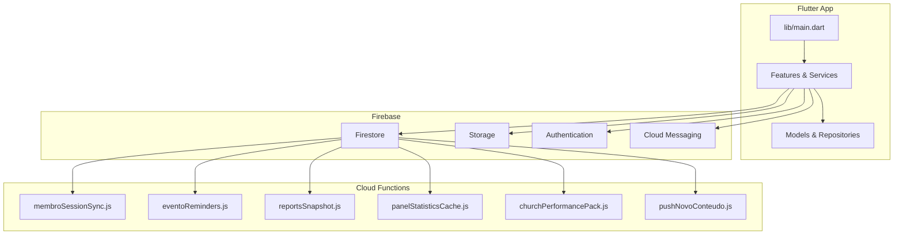
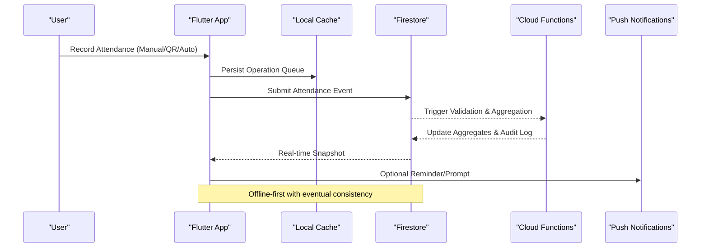
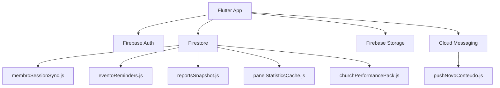

# Attendance Tracking

<cite>
**Referenced Files in This Document**
- [README.md](file://README.md)
- [pubspec.yaml](file://flutter_app/pubspec.yaml)
- [main.dart](file://flutter_app/lib/main.dart)
- [firestore.rules](file://firestore.rules)
- [storage.rules](file://storage.rules)
- [firebase.json](file://firebase.json)
- [functions/index.js](file://functions/index.js)
- [functions/membroSessionSync.js](file://functions/membroSessionSync.js)
- [functions/eventoReminders.js](file://functions/eventoReminders.js)
- [functions/reportsSnapshot.js](file://functions/reportsSnapshot.js)
- [functions/panelStatisticsCache.js](file://functions/panelStatisticsCache.js)
- [functions/churchPerformancePack.js](file://functions/churchPerformancePack.js)
- [functions/pushNovoConteudo.js](file://functions/pushNovoConteudo.js)
</cite>

## Table of Contents
1. [Introduction](#introduction)
2. [Project Structure](#project-structure)
3. [Core Components](#core-components)
4. [Architecture Overview](#architecture-overview)
5. [Detailed Component Analysis](#detailed-component-analysis)
6. [Dependency Analysis](#dependency-analysis)
7. [Performance Considerations](#performance-considerations)
8. [Troubleshooting Guide](#troubleshooting-guide)
9. [Conclusion](#conclusion)
10. [Appendices](#appendices)

## Introduction
This document explains attendance tracking and engagement monitoring for the Gestão Yahweh Premium application. It covers how attendance is recorded (manual entry, QR code scanning, automatic check-ins), analytics and reporting, real-time updates, offline synchronization, reminders, privacy and data retention, and calendar integrations. The guidance is grounded in the repository’s Flutter app structure, Firebase configuration, and Cloud Functions that power backend processing, caching, and notifications.

## Project Structure
The project is a multi-platform Flutter application with a Firebase-backed backend:
- Flutter app under flutter_app/lib contains UI, services, models, and feature modules.
- Firebase configuration and rules are defined at the repository root.
- Cloud Functions under functions handle background tasks, reminders, reports, and caching.

**Diagram sources**
- [main.dart](file://flutter_app/lib/main.dart)
- [firestore.rules](file://firestore.rules)
- [storage.rules](file://storage.rules)
- [firebase.json](file://firebase.json)
- [functions/index.js](file://functions/index.js)
- [functions/membroSessionSync.js](file://functions/membroSessionSync.js)
- [functions/eventoReminders.js](file://functions/eventoReminders.js)
- [functions/reportsSnapshot.js](file://functions/reportsSnapshot.js)
- [functions/panelStatisticsCache.js](file://functions/panelStatisticsCache.js)
- [functions/churchPerformancePack.js](file://functions/churchPerformancePack.js)
- [functions/pushNovoConteudo.js](file://functions/pushNovoConteudo.js)

**Section sources**
- [README.md](file://README.md)
- [pubspec.yaml](file://flutter_app/pubspec.yaml)
- [main.dart](file://flutter_app/lib/main.dart)
- [firebase.json](file://firebase.json)

## Core Components
Attendance tracking spans several layers:
- Data model: attendance records linked to members, events, churches, timestamps, source, and metadata.
- Input methods: manual entry, QR code scanning, automatic check-ins via location or device signals.
- Backend processing: validation, deduplication, aggregation, and caching.
- Real-time updates: Firestore listeners for live dashboards.
- Offline sync: local queueing and conflict resolution when connectivity returns.
- Reporting: aggregated statistics and trend analysis via cached snapshots and scheduled jobs.

Key implementation anchors:
- Firestore schema and security rules govern read/write access and indexing.
- Cloud Functions handle event-driven workflows such as session syncing, reminders, report generation, and performance metrics.
- Flutter services orchestrate user interactions, camera-based QR scanning, and background sync.

**Section sources**
- [firestore.rules](file://firestore.rules)
- [functions/membroSessionSync.js](file://functions/membroSessionSync.js)
- [functions/eventoReminders.js](file://functions/eventoReminders.js)
- [functions/reportsSnapshot.js](file://functions/reportsSnapshot.js)
- [functions/panelStatisticsCache.js](file://functions/panelStatisticsCache.js)
- [functions/churchPerformancePack.js](file://functions/churchPerformancePack.js)

## Architecture Overview
The attendance system follows an offline-first, event-driven architecture:
- Clients record attendance through multiple input methods and persist locally when offline.
- On connectivity, queued operations are synchronized to Firestore.
- Cloud Functions validate, aggregate, and cache results; they also trigger reminders and push notifications.
- Dashboards consume real-time streams from Firestore and cached aggregates for performance.

**Diagram sources**
- [firestore.rules](file://firestore.rules)
- [functions/membroSessionSync.js](file://functions/membroSessionSync.js)
- [functions/eventoReminders.js](file://functions/eventoReminders.js)
- [functions/reportsSnapshot.js](file://functions/reportsSnapshot.js)

## Detailed Component Analysis

### Attendance Recording Methods
- Manual Entry:
  - UI flow allows selecting a member and event, then submitting an attendance record.
  - Client validates inputs and queues writes if offline.
- QR Code Scanning:
  - Camera integration scans event-specific QR codes containing identifiers.
  - Scanner resolves event and member context, then submits attendance.
- Automatic Check-ins:
  - Proximity or location-based triggers create attendance entries based on configured policies.
  - Deduplication prevents duplicate entries within a time window.

Implementation notes:
- Ensure unique constraints per member-event-session to avoid duplicates.
- Capture source metadata (manual, qr, auto) for analytics.
- Validate permissions and tenant scoping via Firestore rules.

**Section sources**
- [firestore.rules](file://firestore.rules)
- [functions/membroSessionSync.js](file://functions/membroSessionSync.js)

### Attendance Analytics and Reporting
- Aggregation:
  - Count attendees per event, per church, per time period.
  - Compute participation rates and trends across sessions.
- Caching:
  - Scheduled functions refresh cached snapshots for dashboards.
  - Performance pack functions optimize query patterns and reduce latency.
- Export:
  - Reports snapshot function generates downloadable summaries.

Operational flows:
- Real-time listeners update dashboards as new attendance arrives.
- Batch jobs compute weekly/monthly trends and store results.
- Admins can export CSV/JSON reports via secure endpoints.

**Section sources**
- [functions/reportsSnapshot.js](file://functions/reportsSnapshot.js)
- [functions/panelStatisticsCache.js](file://functions/panelStatisticsCache.js)
- [functions/churchPerformancePack.js](file://functions/churchPerformancePack.js)

### Real-Time Updates and Offline Synchronization
- Real-time:
  - Firestore listeners stream attendance changes to clients.
  - Optimistic UI updates improve perceived responsiveness.
- Offline:
  - Local queue stores pending attendance operations.
  - Sync engine reconciles conflicts and retries failed writes.
- Consistency:
  - Server-side validation ensures data integrity.
  - Idempotent writes prevent duplication.

**Section sources**
- [firestore.rules](file://firestore.rules)
- [functions/membroSessionSync.js](file://functions/membroSessionSync.js)

### Reminders and Engagement Nudges
- Event reminders:
  - Scheduled functions scan upcoming events and send reminders to attendees.
  - Personalized messages include event details and location links.
- Participation nudges:
  - Inactivity detection triggers motivational prompts.
  - Push notifications delivered via Cloud Messaging.

**Section sources**
- [functions/eventoReminders.js](file://functions/eventoReminders.js)
- [functions/pushNovoConteudo.js](file://functions/pushNovoConteudo.js)

### Privacy, Data Retention, and Security
- Access control:
  - Firestore rules enforce tenant isolation and role-based access.
  - Only authorized users can read/write attendance data.
- Data minimization:
  - Store only necessary fields; avoid sensitive personal data.
- Retention policy:
  - Archive old attendance records periodically.
  - Purge stale logs and temporary files.

**Section sources**
- [firestore.rules](file://firestore.rules)
- [storage.rules](file://storage.rules)

### Calendar Integration
- Sync options:
  - Integrate with external calendars (Google Calendar, Apple Calendar) via OAuth.
  - Create/update events and RSVP states bidirectionally.
- Implementation:
  - Use platform-specific APIs to manage calendar permissions.
  - Map event IDs between systems for reliable linkage.

[No sources needed since this section provides general guidance]

## Dependency Analysis
Attendance features depend on core Firebase services and Cloud Functions:
- Firestore for persistence and real-time streams.
- Storage for attachments (e.g., QR images).
- Authentication for identity and authorization.
- Cloud Messaging for reminders and notifications.
- Cloud Functions for validation, aggregation, caching, and scheduling.

**Diagram sources**
- [firebase.json](file://firebase.json)
- [functions/index.js](file://functions/index.js)
- [functions/membroSessionSync.js](file://functions/membroSessionSync.js)
- [functions/eventoReminders.js](file://functions/eventoReminders.js)
- [functions/reportsSnapshot.js](file://functions/reportsSnapshot.js)
- [functions/panelStatisticsCache.js](file://functions/panelStatisticsCache.js)
- [functions/churchPerformancePack.js](file://functions/churchPerformancePack.js)
- [functions/pushNovoConteudo.js](file://functions/pushNovoConteudo.js)

**Section sources**
- [firebase.json](file://firebase.json)
- [functions/index.js](file://functions/index.js)

## Performance Considerations
- Indexing:
  - Define composite indexes for frequent queries (member, event, date ranges).
- Caching:
  - Precompute aggregates and serve from cache to reduce load.
- Batching:
  - Batch writes for bulk attendance imports.
- Throttling:
  - Rate-limit automatic check-ins to prevent spam.
- Observability:
  - Monitor function execution times and error rates.

[No sources needed since this section provides general guidance]

## Troubleshooting Guide
Common issues and resolutions:
- Duplicate attendance entries:
  - Verify idempotency keys and server-side deduplication logic.
- Missing real-time updates:
  - Check Firestore listeners and network connectivity.
- Failed reminders:
  - Inspect scheduled job logs and notification delivery status.
- Permission errors:
  - Review Firestore rules and user roles.

**Section sources**
- [firestore.rules](file://firestore.rules)
- [functions/eventoReminders.js](file://functions/eventoReminders.js)

## Conclusion
The attendance tracking system combines flexible input methods, robust backend processing, and real-time analytics to support engaged community management. By leveraging offline-first design, secure access controls, and scalable cloud functions, the application delivers reliable attendance recording, insightful reporting, and timely reminders while respecting privacy and performance requirements.

[No sources needed since this section summarizes without analyzing specific files]

## Appendices

### Example Workflows
- Recording Attendance:
  - Manual: select member and event, confirm submission.
  - QR: scan event QR, resolve context, submit.
  - Auto: proximity triggers validated by server.
- Generating Reports:
  - Request snapshot via admin interface.
  - Download CSV/JSON from storage.
- Setting Up Reminders:
  - Configure event schedule and recipient list.
  - Trigger scheduled function to send notifications.
- Analyzing Participation Patterns:
  - View dashboard trends and export historical data.
  - Identify inactive members and send nudges.

[No sources needed since this section provides general guidance]