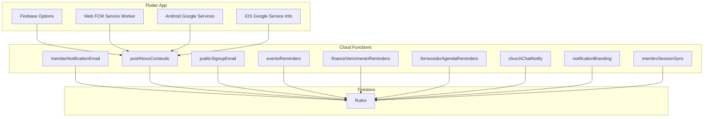
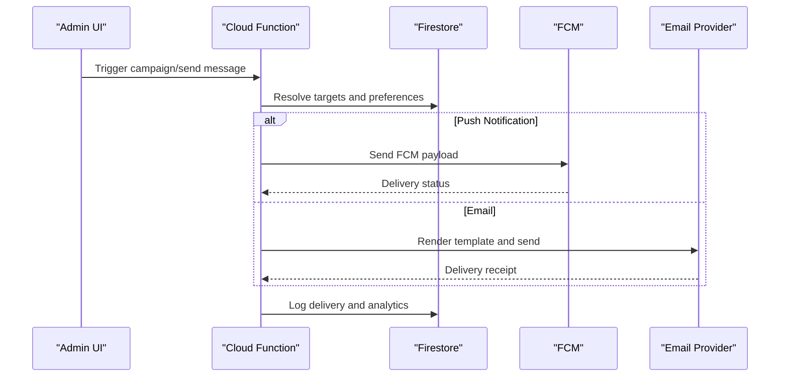
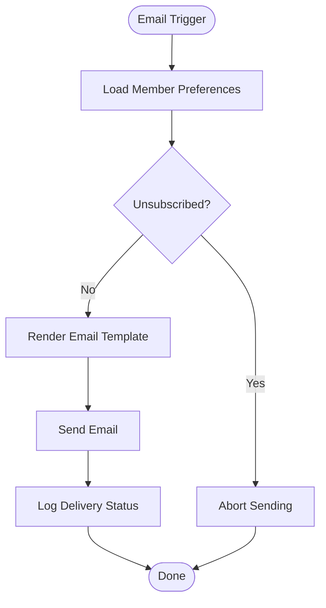
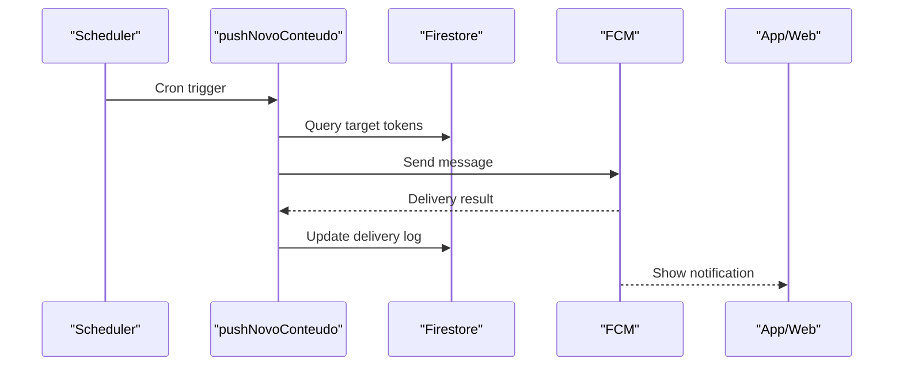
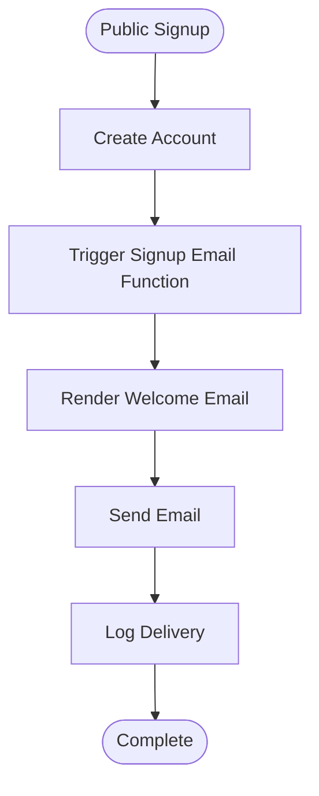
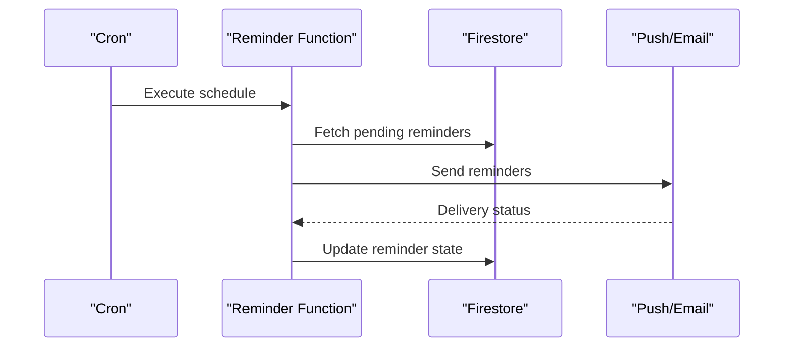
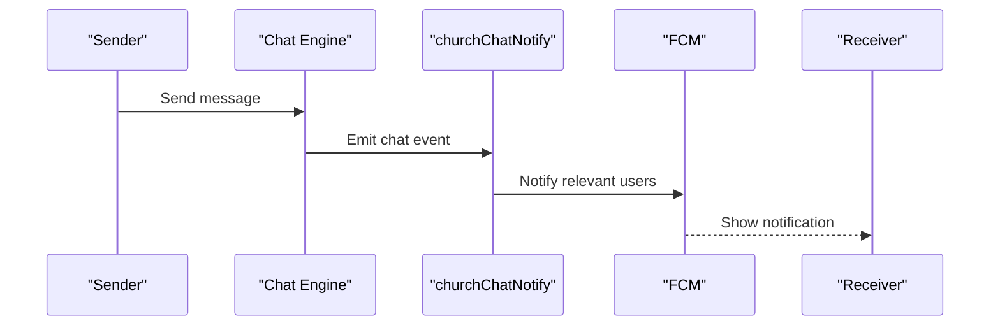
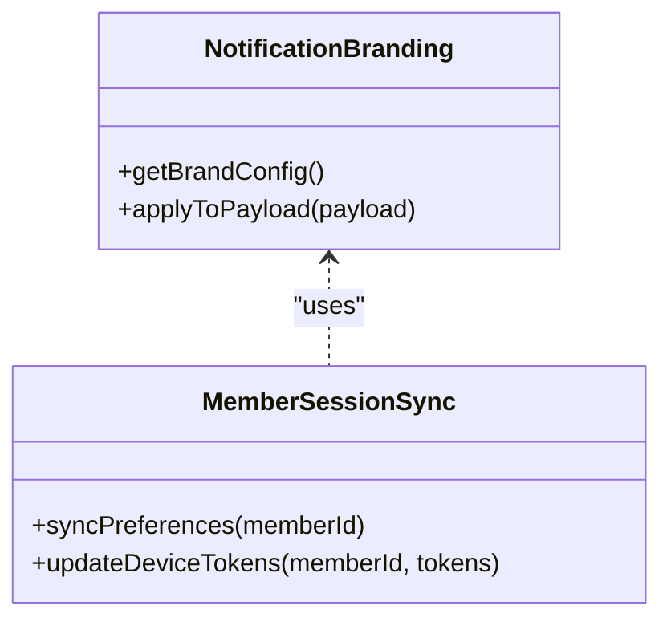
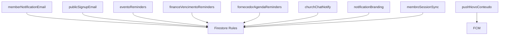

# Communication Tools

<cite>
**Referenced Files in This Document**
- [functions/index.js](file://functions/index.js)
- [functions/src/index.ts](file://functions/src/index.ts)
- [functions/memberNotificationEmail.js](file://functions/memberNotificationEmail.js)
- [functions/src/memberNotificationEmail.ts](file://functions/src/memberNotificationEmail.ts)
- [functions/pushNovoConteudo.js](file://functions/pushNovoConteudo.js)
- [functions/src/pushNovoConteudo.ts](file://functions/src/pushNovoConteudo.ts)
- [functions/publicSignupEmail.js](file://functions/publicSignupEmail.js)
- [functions/src/publicSignupEmail.ts](file://functions/src/publicSignupEmail.ts)
- [functions/eventoReminders.js](file://functions/eventoReminders.js)
- [functions/src/eventoReminders.ts](file://functions/src/eventoReminders.ts)
- [functions/financeVencimentoReminders.js](file://functions/financeVencimentoReminders.js)
- [functions/src/financeVencimentoReminders.ts](file://functions/src/financeVencimentoReminders.ts)
- [functions/fornecedorAgendaReminders.js](file://functions/fornecedorAgendaReminders.js)
- [functions/src/fornecedorAgendaReminders.ts](file://functions/src/fornecedorAgendaReminders.ts)
- [functions/churchChatNotify.js](file://functions/churchChatNotify.js)
- [functions/src/churchChatNotify.ts](file://functions/src/churchChatNotify.ts)
- [functions/notificationBranding.js](file://functions/notificationBranding.js)
- [functions/src/notificationBranding.ts](file://functions/src/notificationBranding.ts)
- [functions/membroSessionSync.js](file://functions/membroSessionSync.js)
- [functions/src/membroSessionSync.ts](file://functions/src/membroSessionSync.ts)
- [flutter_app/lib/firebase_options.dart](file://flutter_app/lib/firebase_options.dart)
- [flutter_app/web/firebase-messaging-sw.js](file://flutter_app/web/firebase-messaging-sw.js)
- [flutter_app/android/app/google-services.json](file://flutter_app/android/app/google-services.json)
- [flutter_app/ios/Runner/GoogleService-Info.plist](file://flutter_app/ios/Runner/GoogleService-Info.plist)
- [firestore.rules](file://firestore.rules)
</cite>

## Table of Contents
1. [Introduction](#introduction)
2. [Project Structure](#project-structure)
3. [Core Components](#core-components)
4. [Architecture Overview](#architecture-overview)
5. [Detailed Component Analysis](#detailed-component-analysis)
6. [Dependency Analysis](#dependency-analysis)
7. [Performance Considerations](#performance-considerations)
8. [Troubleshooting Guide](#troubleshooting-guide)
9. [Conclusion](#conclusion)
10. [Appendices](#appendices)

## Introduction
This document explains the member communication tools implemented in Gestão Yahweh Premium. It covers email notifications, push notifications, SMS messaging, and in-app messaging capabilities. It also documents message templates, scheduling, targeting, delivery tracking, notification preferences, unsubscribe handling, multi-channel strategies, campaign examples, compliance requirements, spam prevention, and rate limiting.

The system is built on Firebase Cloud Functions for backend orchestration and Flutter for client-side integration. Notifications are primarily delivered via Firebase Cloud Messaging (FCM) for push and web, with email sent through server-side functions. In-app messaging uses Firestore-backed chat flows.

## Project Structure
Communication features span three main areas:
- Cloud Functions: Orchestrate sending emails, push notifications, reminders, branding, and chat notifications.
- Flutter app: Integrates FCM for push/web, manages token registration, and handles in-app messages.
- Firestore rules: Govern access to messaging-related data and ensure secure operations.

**Diagram sources**
- [functions/index.js](file://functions/index.js)
- [functions/src/index.ts](file://functions/src/index.ts)
- [flutter_app/lib/firebase_options.dart](file://flutter_app/lib/firebase_options.dart)
- [flutter_app/web/firebase-messaging-sw.js](file://flutter_app/web/firebase-messaging-sw.js)
- [flutter_app/android/app/google-services.json](file://flutter_app/android/app/google-services.json)
- [flutter_app/ios/Runner/GoogleService-Info.plist](file://flutter_app/ios/Runner/GoogleService-Info.plist)
- [firestore.rules](file://firestore.rules)

**Section sources**
- [functions/index.js](file://functions/index.js)
- [functions/src/index.ts](file://functions/src/index.ts)
- [flutter_app/lib/firebase_options.dart](file://flutter_app/lib/firebase_options.dart)
- [flutter_app/web/firebase-messaging-sw.js](file://flutter_app/web/firebase-messaging-sw.js)
- [flutter_app/android/app/google-services.json](file://flutter_app/android/app/google-services.json)
- [flutter_app/ios/Runner/GoogleService-Info.plist](file://flutter_app/ios/Runner/GoogleService-Info.plist)
- [firestore.rules](file://firestore.rules)

## Core Components
- Email notifications: Server-side functions send transactional and marketing emails to members.
- Push notifications: Cloud Functions dispatch FCM messages to devices and web clients.
- Reminders and campaigns: Scheduled functions trigger event and finance reminders and targeted content pushes.
- Chat notifications: Real-time in-app messaging triggers notifications when new messages arrive.
- Branding and session sync: Centralized branding for notifications and synchronization of member sessions/preferences.

Key responsibilities:
- Template resolution and personalization
- Targeting by church, department, role, or tags
- Scheduling via cron triggers
- Delivery tracking via logs and Firestore records
- Compliance via unsubscribe flags and preference checks

**Section sources**
- [functions/memberNotificationEmail.js](file://functions/memberNotificationEmail.js)
- [functions/src/memberNotificationEmail.ts](file://functions/src/memberNotificationEmail.ts)
- [functions/pushNovoConteudo.js](file://functions/pushNovoConteudo.js)
- [functions/src/pushNovoConteudo.ts](file://functions/src/pushNovoConteudo.ts)
- [functions/publicSignupEmail.js](file://functions/publicSignupEmail.js)
- [functions/src/publicSignupEmail.ts](file://functions/src/publicSignupEmail.ts)
- [functions/eventoReminders.js](file://functions/eventoReminders.js)
- [functions/src/eventoReminders.ts](file://functions/src/eventoReminders.ts)
- [functions/financeVencimentoReminders.js](file://functions/financeVencimentoReminders.ts)
- [functions/src/financeVencimentoReminders.ts](file://functions/src/financeVencimentoReminders.ts)
- [functions/fornecedorAgendaReminders.js](file://functions/fornecedorAgendaReminders.js)
- [functions/src/fornecedorAgendaReminders.ts](file://functions/src/fornecedorAgendaReminders.ts)
- [functions/churchChatNotify.js](file://functions/churchChatNotify.js)
- [functions/src/churchChatNotify.ts](file://functions/src/churchChatNotify.ts)
- [functions/notificationBranding.js](file://functions/notificationBranding.js)
- [functions/src/notificationBranding.ts](file://functions/src/notificationBranding.ts)
- [functions/membroSessionSync.js](file://functions/membroSessionSync.js)
- [functions/src/membroSessionSync.ts](file://functions/src/membroSessionSync.ts)

## Architecture Overview
The communication architecture combines scheduled tasks, event-driven functions, and client integrations:

**Diagram sources**
- [functions/pushNovoConteudo.js](file://functions/pushNovoConteudo.js)
- [functions/src/pushNovoConteudo.ts](file://functions/src/pushNovoConteudo.ts)
- [functions/memberNotificationEmail.js](file://functions/memberNotificationEmail.js)
- [functions/src/memberNotificationEmail.ts](file://functions/src/memberNotificationEmail.ts)

## Detailed Component Analysis

### Email Notifications
Responsibilities:
- Compose and send personalized emails based on templates
- Respect unsubscribe flags and member preferences
- Track delivery and errors

Implementation highlights:
- Template rendering with dynamic fields
- Preference checks before sending
- Error handling and retry logic
- Logging for auditability

**Diagram sources**
- [functions/memberNotificationEmail.js](file://functions/memberNotificationEmail.js)
- [functions/src/memberNotificationEmail.ts](file://functions/src/memberNotificationEmail.ts)

**Section sources**
- [functions/memberNotificationEmail.js](file://functions/memberNotificationEmail.js)
- [functions/src/memberNotificationEmail.ts](file://functions/src/memberNotificationEmail.ts)

### Push Notifications
Responsibilities:
- Dispatch FCM messages to mobile and web clients
- Support rich payloads and localized content
- Handle device tokens and subscription states

Implementation highlights:
- Token validation and cleanup
- Payload construction with branding metadata
- Web service worker integration
- Delivery tracking and error reporting

**Diagram sources**
- [functions/pushNovoConteudo.js](file://functions/pushNovoConteudo.js)
- [functions/src/pushNovoConteudo.ts](file://functions/src/pushNovoConteudo.ts)
- [flutter_app/web/firebase-messaging-sw.js](file://flutter_app/web/firebase-messaging-sw.js)

**Section sources**
- [functions/pushNovoConteudo.js](file://functions/pushNovoConteudo.js)
- [functions/src/pushNovoConteudo.ts](file://functions/src/pushNovoConteudo.ts)
- [flutter_app/web/firebase-messaging-sw.js](file://flutter_app/web/firebase-messaging-sw.js)

### Public Signup Email
Responsibilities:
- Send welcome or verification emails upon public signup
- Personalize content using member data
- Ensure compliance with consent and unsubscribe policies

Implementation highlights:
- Event-triggered function on user creation
- Template selection based on tenant settings
- Error handling and retries

**Diagram sources**
- [functions/publicSignupEmail.js](file://functions/publicSignupEmail.js)
- [functions/src/publicSignupEmail.ts](file://functions/src/publicSignupEmail.ts)

**Section sources**
- [functions/publicSignupEmail.js](file://functions/publicSignupEmail.js)
- [functions/src/publicSignupEmail.ts](file://functions/src/publicSignupEmail.ts)

### Reminders and Campaigns
Responsibilities:
- Schedule periodic reminders for events, finance due dates, and vendor agendas
- Target specific audiences based on roles and memberships
- Provide delivery tracking and failure alerts

Implementation highlights:
- Cron-based triggers
- Batch processing for scalability
- Preference-aware dispatch

**Diagram sources**
- [functions/eventoReminders.js](file://functions/eventoReminders.js)
- [functions/src/eventoReminders.ts](file://functions/src/eventoReminders.ts)
- [functions/financeVencimentoReminders.js](file://functions/financeVencimentoReminders.js)
- [functions/src/financeVencimentoReminders.ts](file://functions/src/financeVencimentoReminders.ts)
- [functions/fornecedorAgendaReminders.js](file://functions/fornecedorAgendaReminders.js)
- [functions/src/fornecedorAgendaReminders.ts](file://functions/src/fornecedorAgendaReminders.ts)

**Section sources**
- [functions/eventoReminders.js](file://functions/eventoReminders.js)
- [functions/src/eventoReminders.ts](file://functions/src/eventoReminders.ts)
- [functions/financeVencimentoReminders.js](file://functions/financeVencimentoReminders.js)
- [functions/src/financeVencimentoReminders.ts](file://functions/src/financeVencimentoReminders.ts)
- [functions/fornecedorAgendaReminders.js](file://functions/fornecedorAgendaReminders.js)
- [functions/src/fornecedorAgendaReminders.ts](file://functions/src/fornecedorAgendaReminders.ts)

### In-App Messaging and Chat Notifications
Responsibilities:
- Deliver real-time notifications when new chat messages arrive
- Integrate with Firestore listeners for live updates
- Maintain consistent branding across channels

Implementation highlights:
- Event-driven chat notifications
- Preference checks for channel toggles
- Rich payload support for deep linking

**Diagram sources**
- [functions/churchChatNotify.js](file://functions/churchChatNotify.js)
- [functions/src/churchChatNotify.ts](file://functions/src/churchChatNotify.ts)

**Section sources**
- [functions/churchChatNotify.js](file://functions/churchChatNotify.js)
- [functions/src/churchChatNotify.ts](file://functions/src/churchChatNotify.ts)

### Notification Branding and Session Sync
Responsibilities:
- Centralize branding configuration for notifications
- Synchronize member sessions and preferences across devices

Implementation highlights:
- Branding metadata injection into payloads
- Session consistency checks
- Preference propagation to clients

**Diagram sources**
- [functions/notificationBranding.js](file://functions/notificationBranding.js)
- [functions/src/notificationBranding.ts](file://functions/src/notificationBranding.ts)
- [functions/membroSessionSync.js](file://functions/membroSessionSync.js)
- [functions/src/membroSessionSync.ts](file://functions/src/membroSessionSync.ts)

**Section sources**
- [functions/notificationBranding.js](file://functions/notificationBranding.js)
- [functions/src/notificationBranding.ts](file://functions/src/notificationBranding.ts)
- [functions/membroSessionSync.js](file://functions/membroSessionSync.js)
- [functions/src/membroSessionSync.ts](file://functions/src/membroSessionSync.ts)

## Dependency Analysis
Communication components depend on:
- Firebase SDKs for authentication, Firestore, and FCM
- Email provider APIs for outbound mail
- Firestore rules for secure access control
- Flutter configurations for platform-specific integrations

**Diagram sources**
- [functions/index.js](file://functions/index.js)
- [functions/src/index.ts](file://functions/src/index.ts)
- [firestore.rules](file://firestore.rules)

**Section sources**
- [functions/index.js](file://functions/index.js)
- [functions/src/index.ts](file://functions/src/index.ts)
- [firestore.rules](file://firestore.rules)

## Performance Considerations
- Batch processing: Group recipients to minimize API calls and reduce latency.
- Caching: Cache frequently accessed preferences and branding data.
- Rate limiting: Implement throttling to avoid provider quotas and prevent spam flags.
- Retry policies: Use exponential backoff for transient failures.
- Indexing: Optimize Firestore queries with appropriate indexes for fast targeting.

[No sources needed since this section provides general guidance]

## Troubleshooting Guide
Common issues and resolutions:
- Missing device tokens: Verify FCM registration and platform configurations.
- Delivery failures: Inspect logs for provider errors and adjust payloads.
- Unsubscribe handling: Ensure preference checks are enforced before sending.
- Rate limits: Monitor usage metrics and scale out batch jobs.

Checklist:
- Validate Firebase options and platform files
- Confirm Firestore rules allow required reads/writes
- Review function logs for errors and warnings
- Test templates with sample data

**Section sources**
- [flutter_app/lib/firebase_options.dart](file://flutter_app/lib/firebase_options.dart)
- [flutter_app/web/firebase-messaging-sw.js](file://flutter_app/web/firebase-messaging-sw.js)
- [flutter_app/android/app/google-services.json](file://flutter_app/android/app/google-services.json)
- [flutter_app/ios/Runner/GoogleService-Info.plist](file://flutter_app/ios/Runner/GoogleService-Info.plist)
- [firestore.rules](file://firestore.rules)

## Conclusion
Gestão Yahweh Premium’s communication tools provide a robust, compliant, and scalable foundation for member engagement. By leveraging Cloud Functions for orchestration, FCM for push, and Firestore for data and rules, the system supports multi-channel messaging with strong preference management and delivery tracking. Adhering to best practices ensures reliability, performance, and regulatory compliance.

[No sources needed since this section summarizes without analyzing specific files]

## Appendices

### Examples and Best Practices
- Sending targeted messages:
  - Define audience filters by church, department, or tags.
  - Resolve tokens and preferences before dispatch.
  - Log delivery outcomes for analytics.
- Creating notification campaigns:
  - Use scheduled functions for recurring campaigns.
  - Apply branding consistently across channels.
  - Monitor metrics and adjust targeting.
- Managing member preferences:
  - Store unsubscribe flags and channel toggles securely.
  - Enforce preference checks in all sending paths.
- Tracking message delivery:
  - Record timestamps, statuses, and error codes.
  - Aggregate metrics for dashboards and alerts.

[No sources needed since this section provides general guidance]