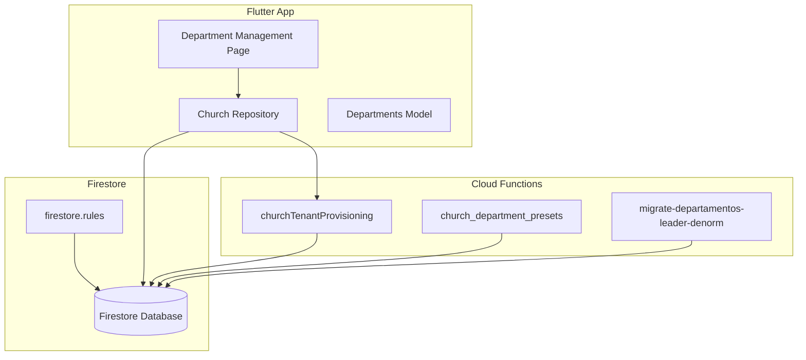
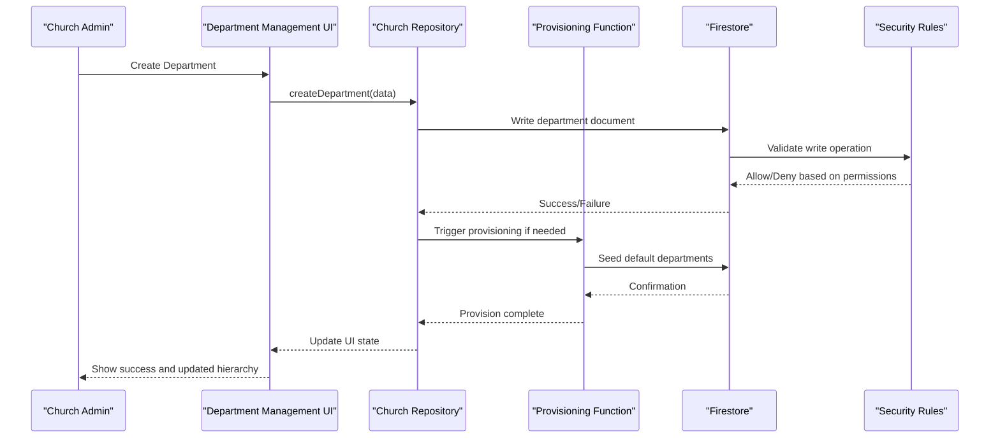
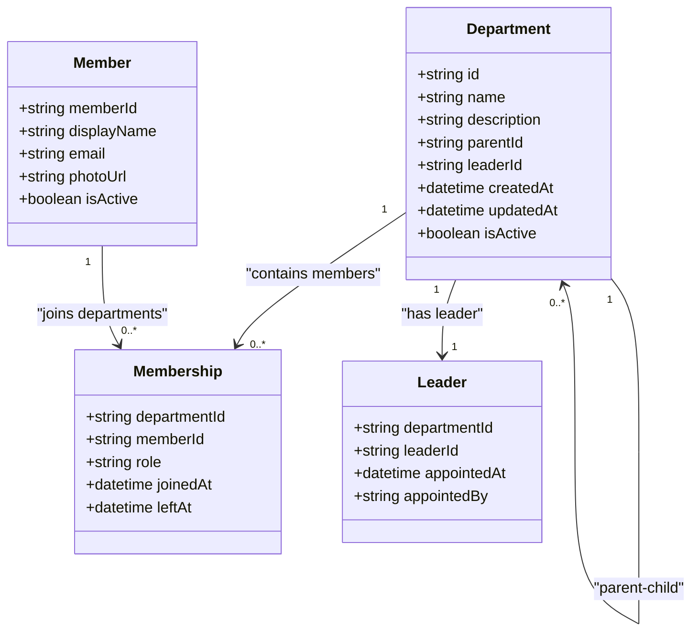
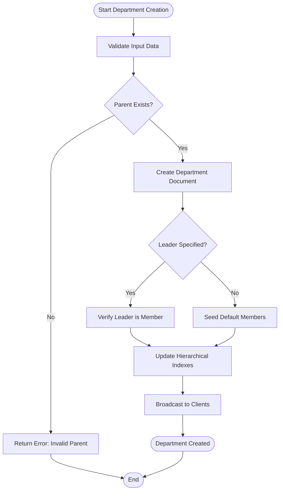
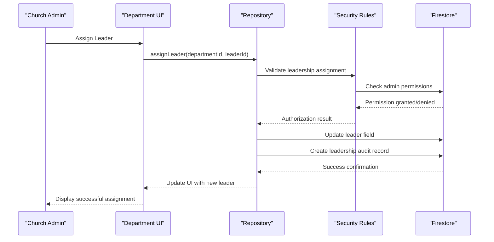
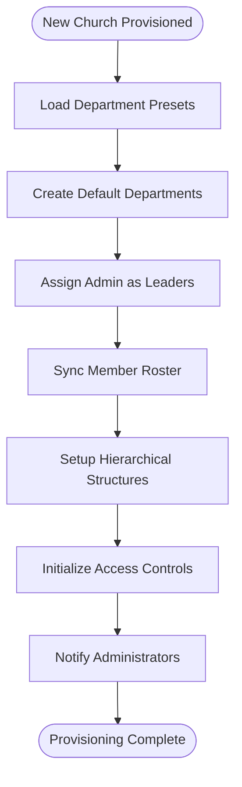
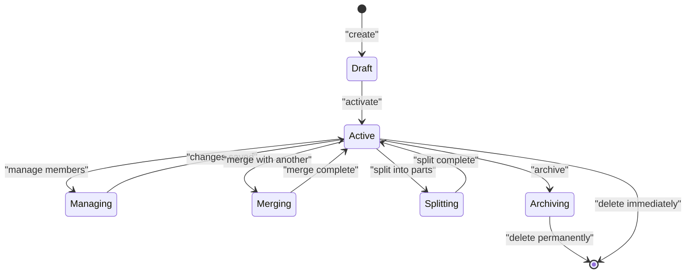
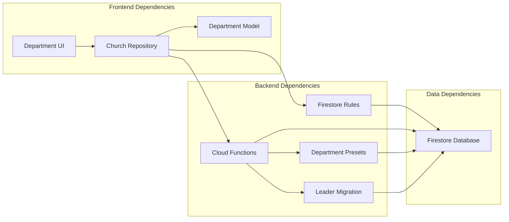

# Department Organization

<cite>
**Referenced Files in This Document**
- [firestore.rules](file://firestore.rules)
- [functions/index.js](file://functions/index.js)
- [functions/churchTenantProvisioning.js](file://functions/churchTenantProvisioning.js)
- [functions/migrate-departamentos-leader-denorm.js](file://functions/scripts/migrate-departamentos-leader-denorm.js)
- [functions/church_department_presets.js](file://functions/scripts/church_department_presets.js)
- [flutter_app/lib/repositories/church_repository.dart](file://flutter_app/lib/repositories/church_repository.dart)
- [flutter_app/lib/models/departments_model.dart](file://flutter_app/lib/models/departments_model.dart)
- [flutter_app/lib/pages/department_management_page.dart](file://flutter_app/lib/pages/department_management_page.dart)
</cite>

## Table of Contents
1. [Introduction](#introduction)
2. [Project Structure](#project-structure)
3. [Core Components](#core-components)
4. [Architecture Overview](#architecture-overview)
5. [Detailed Component Analysis](#detailed-component-analysis)
6. [Dependency Analysis](#dependency-analysis)
7. [Performance Considerations](#performance-considerations)
8. [Troubleshooting Guide](#troubleshooting-guide)
9. [Conclusion](#conclusion)
10. [Appendices](#appendices)

## Introduction
This document explains how department organization and hierarchy management are implemented in the Gestão Yahweh Premium application. It covers:
- Creating departments and establishing parent-child relationships
- Assigning leaders and managing member roles within departments
- Permissions, access control, and reporting structures
- Implementation details for hierarchies, role inheritance, and automated provisioning
- Examples for creating departments, assigning leaders, managing roles, and generating reports
- Lifecycle management including merging/splitting departments and historical tracking of changes

## Project Structure
Department-related functionality spans multiple layers:
- Firestore security rules enforce access control and validate operations
- Cloud Functions handle provisioning, denormalization, and automation
- Flutter app provides UI and repository interactions for CRUD operations on departments

**Diagram sources**
- [flutter_app/lib/pages/department_management_page.dart](file://flutter_app/lib/pages/department_management_page.dart)
- [flutter_app/lib/repositories/church_repository.dart](file://flutter_app/lib/repositories/church_repository.dart)
- [flutter_app/lib/models/departments_model.dart](file://flutter_app/lib/models/departments_model.dart)
- [functions/churchTenantProvisioning.js](file://functions/churchTenantProvisioning.js)
- [functions/scripts/church_department_presets.js](file://functions/scripts/church_department_presets.js)
- [functions/scripts/migrate-departamentos-leader-denorm.js](file://functions/scripts/migrate-departamentos-leader-denorm.js)
- [firestore.rules](file://firestore.rules)

**Section sources**
- [firestore.rules](file://firestore.rules)
- [functions/index.js](file://functions/index.js)
- [functions/churchTenantProvisioning.js](file://functions/churchTenantProvisioning.js)
- [functions/scripts/migrate-departamentos-leader-denorm.js](file://functions/scripts/migrate-departamentos-leader-denorm.js)
- [functions/scripts/church_department_presets.js](file://functions/scripts/church_department_presets.js)
- [flutter_app/lib/repositories/church_repository.dart](file://flutter_app/lib/repositories/church_repository.dart)
- [flutter_app/lib/models/departments_model.dart](file://flutter_app/lib/models/departments_model.dart)
- [flutter_app/lib/pages/department_management_page.dart](file://flutter_app/lib/pages/department_management_page.dart)

## Core Components
- Firestore Security Rules: Define who can read/write departments, enforce leader membership, and restrict destructive operations to authorized users.
- Church Tenant Provisioning: Automatically creates default departments and sets up initial structure when a new tenant is provisioned.
- Department Presets: Provide predefined department templates (e.g., Worship, Children, Outreach) that can be seeded into a church.
- Leader Denormalization Migration: Ensures leader references are consistent across collections and maintains denormalized fields for performance.
- Flutter Repository and Models: Encapsulate data access patterns and model definitions for departments, members, and leadership roles.
- Department Management UI: Provides user flows for creating, editing, assigning leaders, and viewing hierarchical structures.

**Section sources**
- [firestore.rules](file://firestore.rules)
- [functions/churchTenantProvisioning.js](file://functions/churchTenantProvisioning.js)
- [functions/scripts/church_department_presets.js](file://functions/scripts/church_department_presets.js)
- [functions/scripts/migrate-departamentos-leader-denorm.js](file://functions/scripts/migrate-departamentos-leader-denorm.js)
- [flutter_app/lib/repositories/church_repository.dart](file://flutter_app/lib/repositories/church_repository.dart)
- [flutter_app/lib/models/departments_model.dart](file://flutter_app/lib/models/departments_model.dart)
- [flutter_app/lib/pages/department_management_page.dart](file://flutter_app/lib/pages/department_management_page.dart)

## Architecture Overview
The system follows a layered architecture with clear separation of concerns:
- Presentation Layer (Flutter): User interfaces for managing departments and viewing hierarchies
- Data Access Layer (Repository): Abstraction over Firestore operations with caching and error handling
- Business Logic Layer (Cloud Functions): Automated provisioning, validation, and denormalization
- Storage Layer (Firestore): Persistent storage with strict security rules enforcing access control

**Diagram sources**
- [flutter_app/lib/pages/department_management_page.dart](file://flutter_app/lib/pages/department_management_page.dart)
- [flutter_app/lib/repositories/church_repository.dart](file://flutter_app/lib/repositories/church_repository.dart)
- [functions/churchTenantProvisioning.js](file://functions/churchTenantProvisioning.js)
- [firestore.rules](file://firestore.rules)

## Detailed Component Analysis

### Department Data Model and Relationships
Departments follow a hierarchical structure with parent-child relationships:
- Each department has a unique identifier, name, description, and metadata
- Parent-child relationships are established through reference fields
- Leaders are assigned as special members with elevated permissions
- Members are associated with departments through membership records

**Diagram sources**
- [flutter_app/lib/models/departments_model.dart](file://flutter_app/lib/models/departments_model.dart)

**Section sources**
- [flutter_app/lib/models/departments_model.dart](file://flutter_app/lib/models/departments_model.dart)

### Department Creation and Hierarchy Management
Department creation involves several steps to maintain data integrity:
1. Validation of department data and parent relationships
2. Assignment of initial leader if specified
3. Automatic seeding of default members from church roster
4. Updating hierarchical indexes for efficient querying
5. Broadcasting updates to connected clients

**Diagram sources**
- [flutter_app/lib/repositories/church_repository.dart](file://flutter_app/lib/repositories/church_repository.dart)
- [functions/churchTenantProvisioning.js](file://functions/churchTenantProvisioning.js)

**Section sources**
- [flutter_app/lib/repositories/church_repository.dart](file://flutter_app/lib/repositories/church_repository.dart)
- [functions/churchTenantProvisioning.js](file://functions/churchTenantProvisioning.js)

### Leader Assignment and Role Inheritance
Leaders have special privileges within their departments:
- Leaders can manage all members within their department
- Leaders inherit permissions from their department's access level
- Leadership assignments are tracked with audit trails
- Role inheritance ensures consistent permission propagation

**Diagram sources**
- [firestore.rules](file://firestore.rules)
- [flutter_app/lib/repositories/church_repository.dart](file://flutter_app/lib/repositories/church_repository.dart)

**Section sources**
- [firestore.rules](file://firestore.rules)
- [flutter_app/lib/repositories/church_repository.dart](file://flutter_app/lib/repositories/church_repository.dart)

### Automated Department Provisioning
When new churches are provisioned, the system automatically creates standard departments:
- Default departments are created based on church presets
- Initial leaders are assigned from church administrators
- Member rosters are synchronized with department memberships
- Hierarchical structures are established for complex organizations

**Diagram sources**
- [functions/churchTenantProvisioning.js](file://functions/churchTenantProvisioning.js)
- [functions/scripts/church_department_presets.js](file://functions/scripts/church_department_presets.js)

**Section sources**
- [functions/churchTenantProvisioning.js](file://functions/churchTenantProvisioning.js)
- [functions/scripts/church_department_presets.js](file://functions/scripts/church_department_presets.js)

### Department Lifecycle Management
Departments go through various lifecycle stages:
- Creation and initialization
- Active management with member changes
- Merging with other departments
- Splitting into smaller units
- Archival or deletion

**Diagram sources**
- [flutter_app/lib/repositories/church_repository.dart](file://flutter_app/lib/repositories/church_repository.dart)

**Section sources**
- [flutter_app/lib/repositories/church_repository.dart](file://flutter_app/lib/repositories/church_repository.dart)

### Historical Tracking and Audit Trail
All department changes are tracked for compliance and debugging:
- Creation and modification timestamps
- User attribution for all changes
- Before/after snapshots of critical fields
- Audit trail accessible to church administrators

**Section sources**
- [firestore.rules](file://firestore.rules)
- [functions/scripts/migrate-departamentos-leader-denorm.js](file://functions/scripts/migrate-departamentos-leader-denorm.js)

## Dependency Analysis
The department system has clear dependencies between components:

**Diagram sources**
- [flutter_app/lib/pages/department_management_page.dart](file://flutter_app/lib/pages/department_management_page.dart)
- [flutter_app/lib/repositories/church_repository.dart](file://flutter_app/lib/repositories/church_repository.dart)
- [flutter_app/lib/models/departments_model.dart](file://flutter_app/lib/models/departments_model.dart)
- [firestore.rules](file://firestore.rules)
- [functions/churchTenantProvisioning.js](file://functions/churchTenantProvisioning.js)
- [functions/scripts/church_department_presets.js](file://functions/scripts/church_department_presets.js)
- [functions/scripts/migrate-departamentos-leader-denorm.js](file://functions/scripts/migrate-departamentos-leader-denorm.js)

**Section sources**
- [flutter_app/lib/repositories/church_repository.dart](file://flutter_app/lib/repositories/church_repository.dart)
- [firestore.rules](file://firestore.rules)
- [functions/churchTenantProvisioning.js](file://functions/churchTenantProvisioning.js)

## Performance Considerations
- Hierarchical queries use indexed parent-child relationships for efficient tree traversal
- Denormalized leader information reduces read operations across collections
- Caching strategies minimize repeated database calls for department structures
- Batch operations optimize bulk member assignments and department updates
- Real-time listeners provide instant updates without polling overhead

## Troubleshooting Guide
Common issues and solutions:
- **Permission Denied Errors**: Verify user has appropriate church administrator privileges
- **Invalid Parent References**: Ensure parent department exists and is active
- **Leader Assignment Failures**: Confirm leader is a valid church member with proper permissions
- **Synchronization Issues**: Check cloud function logs for provisioning errors
- **Historical Data Gaps**: Review migration scripts for completeness

**Section sources**
- [firestore.rules](file://firestore.rules)
- [functions/churchTenantProvisioning.js](file://functions/churchTenantProvisioning.js)

## Conclusion
The department organization system in Gestão Yahweh Premium provides a comprehensive solution for managing church organizational structures. The implementation combines robust security rules, automated provisioning, and intuitive user interfaces to support complex hierarchical relationships while maintaining data integrity and performance.

## Appendices

### Example Workflows

#### Creating a New Department
1. Navigate to Department Management page
2. Click "Create Department"
3. Enter department name and description
4. Select parent department (optional)
5. Assign initial leader (optional)
6. Save and verify creation

#### Assigning Department Leaders
1. Open department details
2. Navigate to Leadership section
3. Select member from dropdown
4. Confirm leadership assignment
5. Verify inherited permissions

#### Managing Department Members
1. Access department member list
2. Add/remove members as needed
3. Adjust individual member roles
4. Save changes and sync with church roster

**Section sources**
- [flutter_app/lib/pages/department_management_page.dart](file://flutter_app/lib/pages/department_management_page.dart)
- [flutter_app/lib/repositories/church_repository.dart](file://flutter_app/lib/repositories/church_repository.dart)