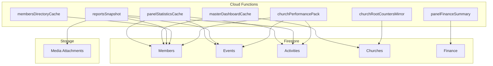
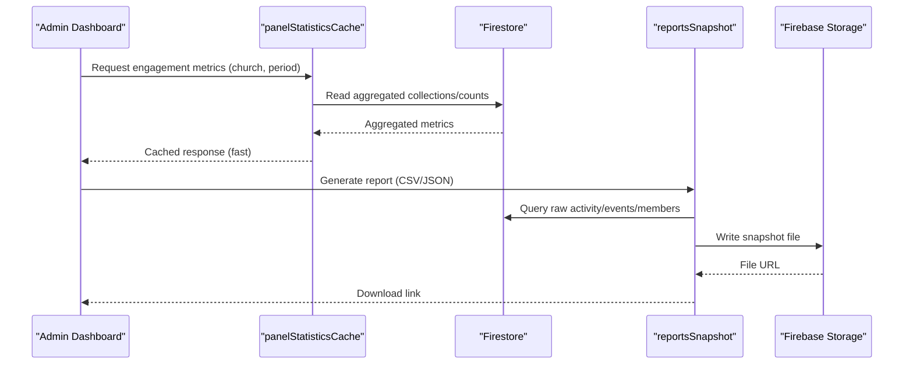
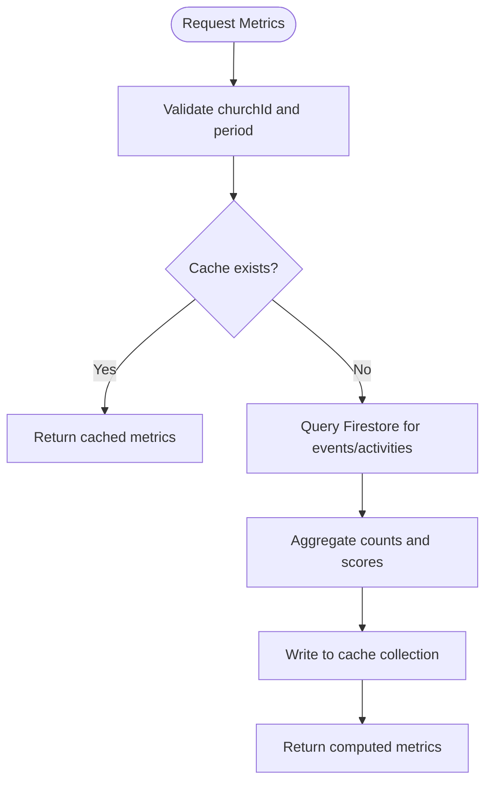
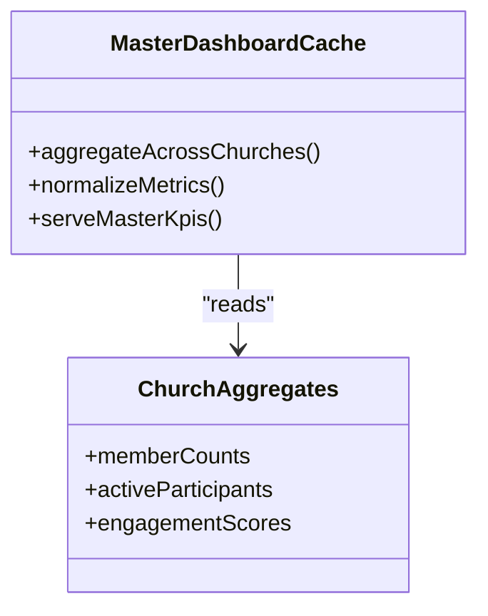
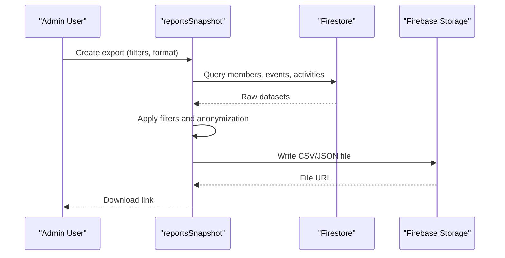
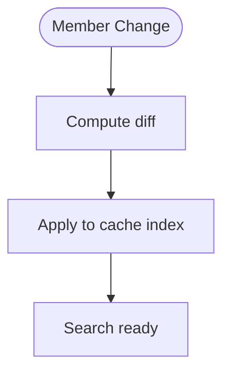
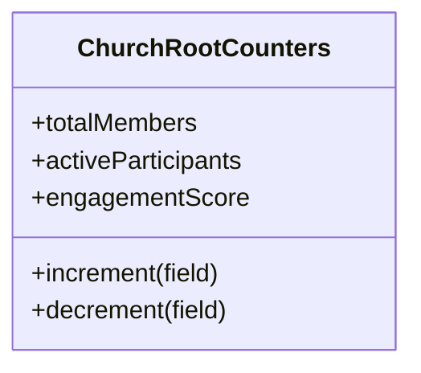
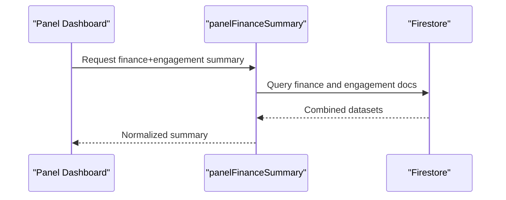
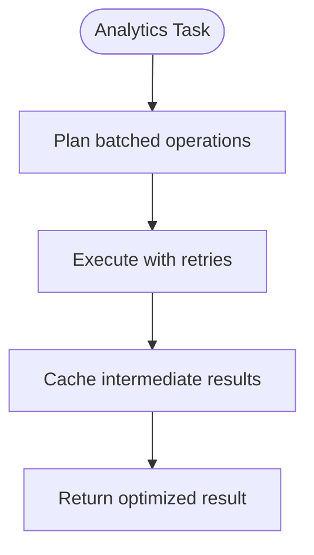
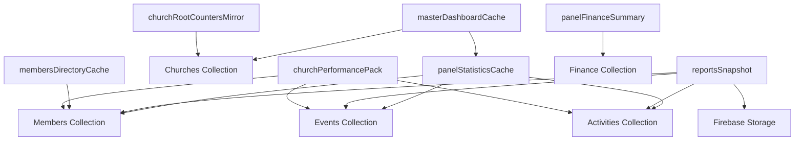

# Engagement Analytics

<cite>
**Referenced Files in This Document**
- [functions/lib/panelStatisticsCache.js](file://functions/lib/panelStatisticsCache.js)
- [functions/src/panelStatisticsCache.ts](file://functions/src/panelStatisticsCache.ts)
- [functions/lib/masterDashboardCache.js](file://functions/lib/masterDashboardCache.js)
- [functions/src/masterDashboardCache.ts](file://functions/src/masterDashboardCache.ts)
- [functions/lib/reportsSnapshot.js](file://functions/lib/reportsSnapshot.js)
- [functions/src/reportsSnapshot.ts](file://functions/src/reportsSnapshot.ts)
- [functions/lib/membersDirectoryCache.js](file://functions/lib/membersDirectoryCache.js)
- [functions/src/membersDirectoryCache.ts](file://functions/src/membersDirectoryCache.ts)
- [functions/lib/churchRootCountersMirror.js](file://functions/lib/churchRootCountersMirror.js)
- [functions/src/churchRootCountersMirror.ts](file://functions/src/churchRootCountersMirror.ts)
- [functions/lib/panelFinanceSummary.js](file://functions/lib/panelFinanceSummary.js)
- [functions/src/panelFinanceSummary.ts](file://functions/src/panelFinanceSummary.ts)
- [functions/lib/churchPerformancePack.js](file://functions/lib/churchPerformancePack.js)
- [functions/src/churchPerformancePack.ts](file://functions/src/churchPerformancePack.ts)
- [firestore.rules](file://firestore.rules)
- [storage.rules](file://storage.rules)
</cite>

## Table of Contents
1. [Introduction](#introduction)
2. [Project Structure](#project-structure)
3. [Core Components](#core-components)
4. [Architecture Overview](#architecture-overview)
5. [Detailed Component Analysis](#detailed-component-analysis)
6. [Dependency Analysis](#dependency-analysis)
7. [Performance Considerations](#performance-considerations)
8. [Troubleshooting Guide](#troubleshooting-guide)
9. [Conclusion](#conclusion)
10. [Appendices](#appendices)

## Introduction
This document explains how member engagement analytics and reporting are implemented in the Gestão Yahweh Premium application. It covers how engagement metrics are calculated, how participation scoring is derived, how activity tracking works, and how dashboards and custom reports are generated and exported. It also details data aggregation strategies, performance optimizations, real-time analytics patterns, examples for generating reports, identifying inactive members, tracking growth trends, and measuring ministry effectiveness. Finally, it addresses data privacy, anonymization techniques, and compliance considerations.

## Project Structure
The engagement analytics system spans several Firebase Cloud Functions that aggregate, cache, and serve analytics data to the Flutter web/mobile app and admin panels. Key areas include:
- Statistics caching for panel dashboards
- Master dashboard aggregation across churches
- Snapshot-based reporting exports
- Members directory caching for quick lookups
- Church-level counters mirroring for fast reads
- Finance summary integration for cross-domain insights
- Performance pack utilities for optimized queries

**Diagram sources**
- [functions/lib/panelStatisticsCache.js](file://functions/lib/panelStatisticsCache.js)
- [functions/lib/masterDashboardCache.js](file://functions/lib/masterDashboardCache.js)
- [functions/lib/reportsSnapshot.js](file://functions/lib/reportsSnapshot.js)
- [functions/lib/membersDirectoryCache.js](file://functions/lib/membersDirectoryCache.js)
- [functions/lib/churchRootCountersMirror.js](file://functions/lib/churchRootCountersMirror.js)
- [functions/lib/panelFinanceSummary.js](file://functions/lib/panelFinanceSummary.js)
- [functions/lib/churchPerformancePack.js](file://functions/lib/churchPerformancePack.js)

**Section sources**
- [functions/lib/panelStatisticsCache.js](file://functions/lib/panelStatisticsCache.js)
- [functions/lib/masterDashboardCache.js](file://functions/lib/masterDashboardCache.js)
- [functions/lib/reportsSnapshot.js](file://functions/lib/reportsSnapshot.js)
- [functions/lib/membersDirectoryCache.js](file://functions/lib/membersDirectoryCache.js)
- [functions/lib/churchRootCountersMirror.js](file://functions/lib/churchRootCountersMirror.js)
- [functions/lib/panelFinanceSummary.js](file://functions/lib/panelFinanceSummary.js)
- [functions/lib/churchPerformancePack.js](file://functions/lib/churchPerformancePack.js)

## Core Components
- Panel statistics cache: Aggregates engagement metrics per church and time window, serving dashboard widgets with low latency.
- Master dashboard cache: Combines multi-church aggregates for platform-wide insights and comparisons.
- Reports snapshot: Generates exportable snapshots (e.g., CSV/JSON) of engagement data on demand or via scheduled jobs.
- Members directory cache: Provides fast access to member profiles and attributes used in segmentation and targeting.
- Church root counters mirror: Mirrors key counts at church roots for rapid read paths without heavy queries.
- Panel finance summary: Integrates financial indicators alongside engagement metrics for holistic ministry effectiveness analysis.
- Church performance pack: Optimizes query patterns and batch operations to reduce Firestore costs and improve responsiveness.

These components collectively implement:
- Engagement metrics calculation (attendance, event participation, content consumption, communication interactions)
- Participation scoring (weighted composite score based on recent activity frequency and recency)
- Activity tracking (event attendance logs, message interactions, media views, donations tied to activities)
- Dashboard visualizations (charts and tables served from cached aggregates)
- Custom reports and exports (on-demand snapshots and scheduled exports)
- Real-time analytics (streaming updates via Firestore listeners where appropriate; otherwise near-real-time via caches)

**Section sources**
- [functions/lib/panelStatisticsCache.js](file://functions/lib/panelStatisticsCache.js)
- [functions/lib/masterDashboardCache.js](file://functions/lib/masterDashboardCache.js)
- [functions/lib/reportsSnapshot.js](file://functions/lib/reportsSnapshot.js)
- [functions/lib/membersDirectoryCache.js](file://functions/lib/membersDirectoryCache.js)
- [functions/lib/churchRootCountersMirror.js](file://functions/lib/churchRootCountersMirror.js)
- [functions/lib/panelFinanceSummary.js](file://functions/lib/panelFinanceSummary.js)
- [functions/lib/churchPerformancePack.js](file://functions/lib/churchPerformancePack.js)

## Architecture Overview
The analytics architecture follows a cache-first pattern with background aggregation and periodic refreshes. Dashboards consume precomputed aggregates to ensure consistent performance under load. Export pipelines generate snapshots for offline analysis and sharing.

**Diagram sources**
- [functions/lib/panelStatisticsCache.js](file://functions/lib/panelStatisticsCache.js)
- [functions/lib/reportsSnapshot.js](file://functions/lib/reportsSnapshot.js)

## Detailed Component Analysis

### Panel Statistics Cache
Purpose: Compute and cache engagement metrics per church and time window for dashboard widgets.

Key responsibilities:
- Aggregate attendance counts, active participants, and interaction events within configurable periods.
- Maintain rolling windows for daily, weekly, monthly metrics.
- Provide endpoints for dashboard widgets to fetch normalized metric objects.

Implementation highlights:
- Uses Firestore queries filtered by churchId and timestamps.
- Applies weighted scoring for participation (recency and frequency).
- Stores results in dedicated cache collections for O(1) reads.

**Diagram sources**
- [functions/lib/panelStatisticsCache.js](file://functions/lib/panelStatisticsCache.js)
- [functions/src/panelStatisticsCache.ts](file://functions/src/panelStatisticsCache.ts)

**Section sources**
- [functions/lib/panelStatisticsCache.js](file://functions/lib/panelStatisticsCache.js)
- [functions/src/panelStatisticsCache.ts](file://functions/src/panelStatisticsCache.ts)

### Master Dashboard Cache
Purpose: Aggregate platform-wide metrics across multiple churches for comparative insights.

Key responsibilities:
- Summarize total members, active participants, and engagement trends across churches.
- Normalize metrics to enable fair comparisons (per-capita adjustments).
- Serve master dashboard charts and KPIs.

Implementation highlights:
- Reads from church-level aggregates and mirrors.
- Applies normalization and smoothing for trend visualization.
- Updates periodically to balance freshness and cost.

**Diagram sources**
- [functions/lib/masterDashboardCache.js](file://functions/lib/masterDashboardCache.js)
- [functions/src/masterDashboardCache.ts](file://functions/src/masterDashboardCache.ts)

**Section sources**
- [functions/lib/masterDashboardCache.js](file://functions/lib/masterDashboardCache.js)
- [functions/src/masterDashboardCache.ts](file://functions/src/masterDashboardCache.ts)

### Reports Snapshot
Purpose: Generate exportable snapshots of engagement data for custom reports and offline analysis.

Key responsibilities:
- Build CSV/JSON exports including member participation, event attendance, and activity logs.
- Support filtering by date range, church, department, and ministry.
- Store snapshots in Firebase Storage and return download URLs.

Implementation highlights:
- Streams large datasets efficiently to avoid memory spikes.
- Applies anonymization options for sensitive fields when requested.
- Schedules recurring exports via cron triggers.

**Diagram sources**
- [functions/lib/reportsSnapshot.js](file://functions/lib/reportsSnapshot.js)
- [functions/src/reportsSnapshot.ts](file://functions/src/reportsSnapshot.ts)

**Section sources**
- [functions/lib/reportsSnapshot.js](file://functions/lib/reportsSnapshot.js)
- [functions/src/reportsSnapshot.ts](file://functions/src/reportsSnapshot.ts)

### Members Directory Cache
Purpose: Provide fast access to member profiles and attributes for segmentation and targeting.

Key responsibilities:
- Cache member metadata (names, roles, departments, tags).
- Support search and filtering for engagement campaigns.
- Keep directory synchronized with Firestore changes.

Implementation highlights:
- Incremental updates to minimize read/write costs.
- Indexes on frequently queried fields for speed.
- TTL-based expiration to keep data fresh.

**Diagram sources**
- [functions/lib/membersDirectoryCache.js](file://functions/lib/membersDirectoryCache.js)
- [functions/src/membersDirectoryCache.ts](file://functions/src/membersDirectoryCache.ts)

**Section sources**
- [functions/lib/membersDirectoryCache.js](file://functions/lib/membersDirectoryCache.js)
- [functions/src/membersDirectoryCache.ts](file://functions/src/membersDirectoryCache.ts)

### Church Root Counters Mirror
Purpose: Mirror key counts at church roots for fast reads without heavy queries.

Key responsibilities:
- Maintain totals for members, active participants, and engagement scores.
- Update counters atomically on relevant writes.
- Expose lightweight endpoints for dashboard widgets.

Implementation highlights:
- Atomic increments/decrements to prevent race conditions.
- Periodic reconciliation to correct drift.
- Read-optimized structure for high-frequency dashboards.

**Diagram sources**
- [functions/lib/churchRootCountersMirror.js](file://functions/lib/churchRootCountersMirror.js)
- [functions/src/churchRootCountersMirror.ts](file://functions/src/churchRootCountersMirror.ts)

**Section sources**
- [functions/lib/churchRootCountersMirror.js](file://functions/lib/churchRootCountersMirror.js)
- [functions/src/churchRootCountersMirror.ts](file://functions/src/churchRootCountersMirror.ts)

### Panel Finance Summary
Purpose: Integrate financial indicators alongside engagement metrics for holistic ministry effectiveness analysis.

Key responsibilities:
- Summarize donations, pledges, and expenditures linked to ministries and events.
- Correlate financial health with engagement trends.
- Provide combined KPIs for leadership dashboards.

Implementation highlights:
- Joins finance documents with event and ministry identifiers.
- Normalizes currency and handles multi-currency cases.
- Produces time-series summaries for trend analysis.

**Diagram sources**
- [functions/lib/panelFinanceSummary.js](file://functions/lib/panelFinanceSummary.js)
- [functions/src/panelFinanceSummary.ts](file://functions/src/panelFinanceSummary.ts)

**Section sources**
- [functions/lib/panelFinanceSummary.js](file://functions/lib/panelFinanceSummary.js)
- [functions/src/panelFinanceSummary.ts](file://functions/src/panelFinanceSummary.ts)

### Church Performance Pack
Purpose: Optimize query patterns and batch operations to reduce Firestore costs and improve responsiveness.

Key responsibilities:
- Batch reads/writes for bulk analytics tasks.
- Use composite indexes and projections to limit payload size.
- Implement retry and backoff strategies for resilience.

Implementation highlights:
- Precomputes expensive joins and aggregations.
- Caches intermediate results to avoid recomputation.
- Monitors usage and adjusts batching dynamically.

**Diagram sources**
- [functions/lib/churchPerformancePack.js](file://functions/lib/churchPerformancePack.js)
- [functions/src/churchPerformancePack.ts](file://functions/src/churchPerformancePack.ts)

**Section sources**
- [functions/lib/churchPerformancePack.js](file://functions/lib/churchPerformancePack.js)
- [functions/src/churchPerformancePack.ts](file://functions/src/churchPerformancePack.ts)

## Dependency Analysis
The analytics components depend on Firestore collections for members, events, activities, and finance data. They also interact with Firebase Storage for exporting snapshots. Security rules govern access to these resources.

**Diagram sources**
- [functions/lib/panelStatisticsCache.js](file://functions/lib/panelStatisticsCache.js)
- [functions/lib/masterDashboardCache.js](file://functions/lib/masterDashboardCache.js)
- [functions/lib/reportsSnapshot.js](file://functions/lib/reportsSnapshot.js)
- [functions/lib/membersDirectoryCache.js](file://functions/lib/membersDirectoryCache.js)
- [functions/lib/churchRootCountersMirror.js](file://functions/lib/churchRootCountersMirror.js)
- [functions/lib/panelFinanceSummary.js](file://functions/lib/panelFinanceSummary.js)
- [functions/lib/churchPerformancePack.js](file://functions/lib/churchPerformancePack.js)

**Section sources**
- [firestore.rules](file://firestore.rules)
- [storage.rules](file://storage.rules)

## Performance Considerations
- Cache-first design minimizes Firestore reads and reduces latency for dashboard loads.
- Batched operations and projections limit payload sizes and lower costs.
- Periodic reconciliation ensures counter accuracy without impacting live reads.
- TTL-based cache expiration balances freshness with resource efficiency.
- Streaming exports prevent memory overflows for large datasets.

[No sources needed since this section provides general guidance]

## Troubleshooting Guide
Common issues and resolutions:
- Stale metrics: Verify cache TTL and trigger manual refresh if necessary.
- Missing data in reports: Check Firestore indexes and query filters; ensure proper church scoping.
- Slow exports: Increase batching size cautiously and monitor Firestore quotas.
- Inconsistent counters: Run reconciliation jobs and audit write paths for atomicity.
- Access denied errors: Review Firestore and Storage rules for tenant isolation and permissions.

**Section sources**
- [firestore.rules](file://firestore.rules)
- [storage.rules](file://storage.rules)

## Conclusion
The engagement analytics system in Gestão Yahweh Premium leverages cloud functions to aggregate, cache, and export member engagement data efficiently. By combining dashboards, custom reports, and performance optimizations, it enables leaders to track participation, identify inactive members, measure ministry effectiveness, and make informed decisions while maintaining data privacy and compliance.

[No sources needed since this section summarizes without analyzing specific files]

## Appendices

### Examples of Generating Engagement Reports
- On-demand snapshot: Trigger reportsSnapshot with filters for church, date range, and format; receive a download URL after processing.
- Scheduled export: Configure a cron job to generate weekly CSV exports and store them in a designated storage folder.

[No sources needed since this section provides general guidance]

### Identifying Inactive Members
- Criteria: No event attendance or activity interactions within a defined period (e.g., 60 days).
- Process: Query members directory cache for last activity timestamps; segment into inactive lists; export for outreach campaigns.

[No sources needed since this section provides general guidance]

### Tracking Growth Trends
- Metrics: Member count, active participants, average engagement score over time.
- Visualization: Time-series charts from masterDashboardCache; compare month-over-month changes.

[No sources needed since this section provides general guidance]

### Measuring Ministry Effectiveness
- Indicators: Attendance rates, donation correlation, repeat participation, and feedback scores.
- Integration: Combine panelFinanceSummary with engagement metrics to assess impact per ministry.

[No sources needed since this section provides general guidance]

### Data Privacy and Compliance
- Anonymization: Strip personally identifiable information (PII) from exports unless explicitly authorized.
- Access control: Enforce tenant isolation via Firestore and Storage rules; restrict admin-only endpoints.
- Retention: Define retention policies for activity logs and snapshots; purge stale data automatically.
- Compliance: Align with GDPR/LGPD requirements for consent, data minimization, and right to erasure.

**Section sources**
- [firestore.rules](file://firestore.rules)
- [storage.rules](file://storage.rules)