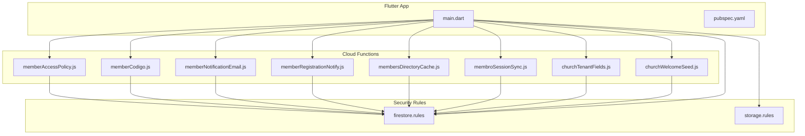
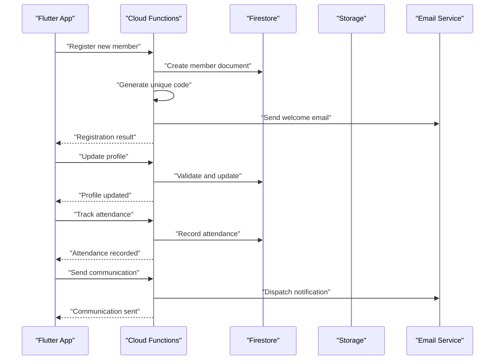
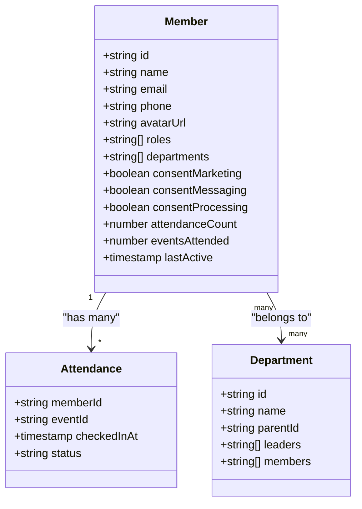
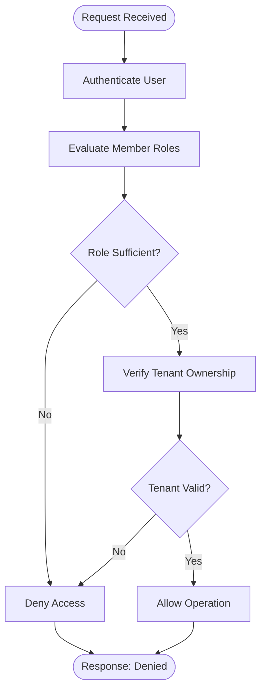
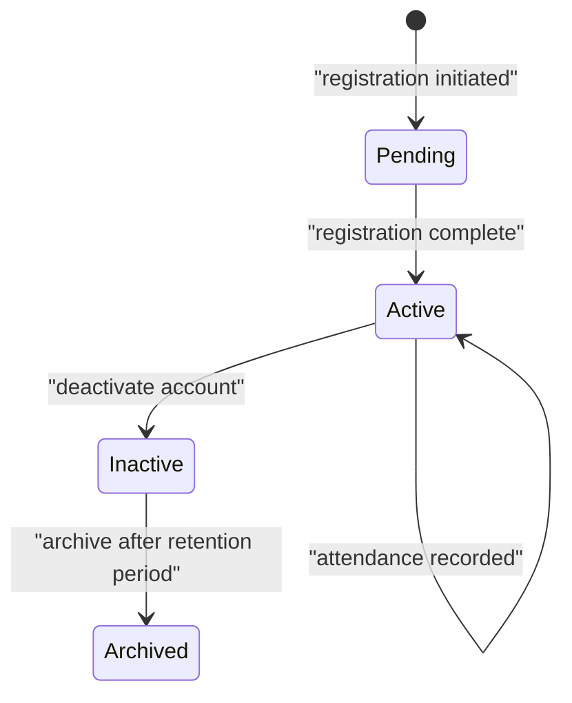
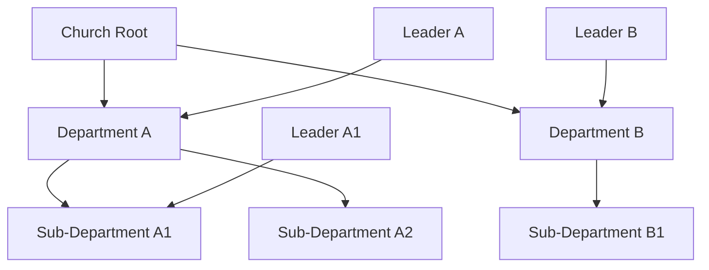
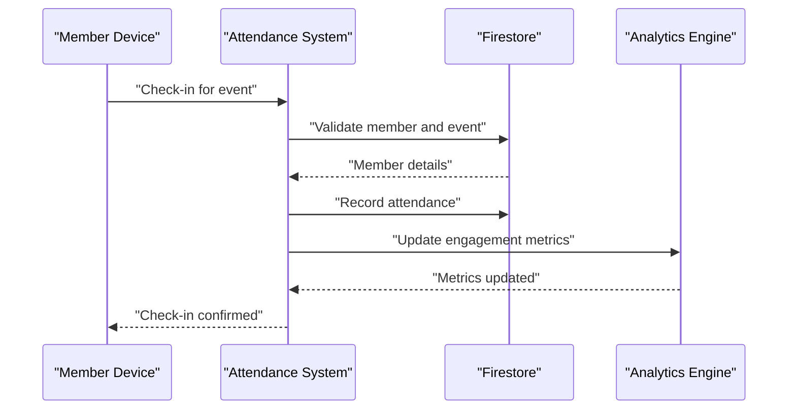
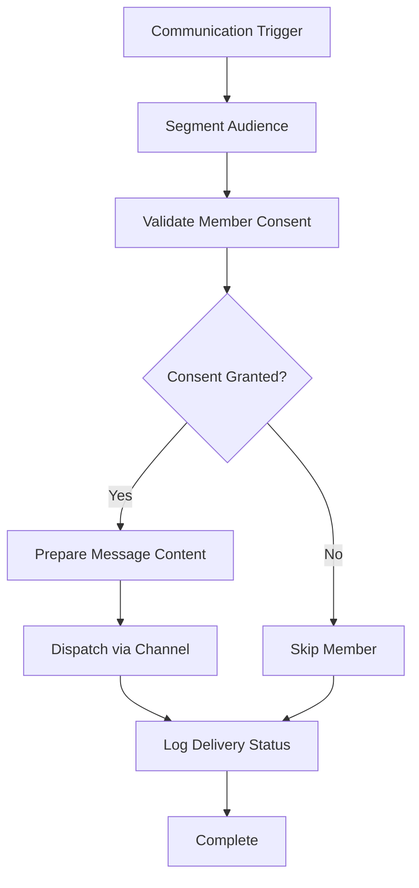
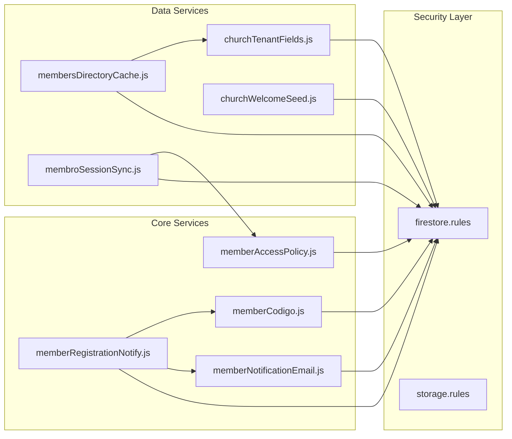

# Member Management

<cite>
**Referenced Files in This Document**
- [memberAccessPolicy.js](file://functions/lib/memberAccessPolicy.js)
- [memberCodigo.js](file://functions/lib/memberCodigo.js)
- [memberNotificationEmail.js](file://functions/lib/memberNotificationEmail.js)
- [memberRegistrationNotify.js](file://functions/lib/memberRegistrationNotify.js)
- [membersDirectoryCache.js](file://functions/lib/membersDirectoryCache.js)
- [membroSessionSync.js](file://functions/lib/membroSessionSync.js)
- [churchTenantFields.js](file://functions/lib/churchTenantFields.js)
- [churchWelcomeSeed.js](file://functions/lib/churchWelcomeSeed.js)
- [firestore.rules](file://firestore.rules)
- [storage.rules](file://storage.rules)
- [pubspec.yaml](file://flutter_app/pubspec.yaml)
- [main.dart](file://flutter_app/lib/main.dart)
</cite>

## Table of Contents
1. [Introduction](#introduction)
2. [Project Structure](#project-structure)
3. [Core Components](#core-components)
4. [Architecture Overview](#architecture-overview)
5. [Detailed Component Analysis](#detailed-component-analysis)
6. [Dependency Analysis](#dependency-analysis)
7. [Performance Considerations](#performance-considerations)
8. [Troubleshooting Guide](#troubleshooting-guide)
9. [Conclusion](#conclusion)
10. [Appendices](#appendices)

## Introduction
This document provides comprehensive member management documentation for the Gestão Yahweh Premium application. It covers member registration, profile management, department organization, attendance tracking, and communication tools. It explains the member data model, role assignments, access permissions, engagement metrics, lifecycle management, department hierarchies, event participation, automated notifications, and privacy/GDPR considerations. Examples are provided for adding members, assigning roles, tracking attendance, and managing communications.

## Project Structure
The member management system spans three layers:
- Flutter app layer (UI and client-side logic)
- Cloud Functions backend (server-side business logic, automation, and integrations)
- Security rules (Firestore and Storage policies)

**Diagram sources**
- [main.dart:1-50](file://flutter_app/lib/main.dart#L1-L50)
- [pubspec.yaml:1-50](file://flutter_app/pubspec.yaml#L1-L50)
- [memberAccessPolicy.js:1-120](file://functions/lib/memberAccessPolicy.js#L1-L120)
- [memberCodigo.js:1-120](file://functions/lib/memberCodigo.js#L1-L120)
- [memberNotificationEmail.js:1-120](file://functions/lib/memberNotificationEmail.js#L1-L120)
- [memberRegistrationNotify.js:1-120](file://functions/lib/memberRegistrationNotify.js#L1-L120)
- [membersDirectoryCache.js:1-120](file://functions/lib/membersDirectoryCache.js#L1-L120)
- [membroSessionSync.js:1-120](file://functions/lib/membroSessionSync.js#L1-L120)
- [churchTenantFields.js:1-120](file://functions/lib/churchTenantFields.js#L1-L120)
- [churchWelcomeSeed.js:1-120](file://functions/lib/churchWelcomeSeed.js#L1-L120)
- [firestore.rules:1-200](file://firestore.rules#L1-L200)
- [storage.rules:1-200](file://storage.rules#L1-L200)

**Section sources**
- [main.dart:1-50](file://flutter_app/lib/main.dart#L1-L50)
- [pubspec.yaml:1-50](file://flutter_app/pubspec.yaml#L1-L50)

## Core Components
- Access policy enforcement: Centralized logic to determine member roles and permissions across operations.
- Unique code generation: Assigns unique identifiers for members and related entities.
- Email notifications: Automated emails for registration, updates, and reminders.
- Registration workflow: Orchestrates new member onboarding and initial data seeding.
- Directory caching: Optimizes read performance for member listings and search.
- Session synchronization: Keeps member session state consistent across devices.
- Tenant fields: Manages church-specific member attributes and metadata.
- Welcome seed: Initializes default data for new churches and members.

**Section sources**
- [memberAccessPolicy.js:1-120](file://functions/lib/memberAccessPolicy.js#L1-L120)
- [memberCodigo.js:1-120](file://functions/lib/memberCodigo.js#L1-L120)
- [memberNotificationEmail.js:1-120](file://functions/lib/memberNotificationEmail.js#L1-L120)
- [memberRegistrationNotify.js:1-120](file://functions/lib/memberRegistrationNotify.js#L1-L120)
- [membersDirectoryCache.js:1-120](file://functions/lib/membersDirectoryCache.js#L1-L120)
- [membroSessionSync.js:1-120](file://functions/lib/membroSessionSync.js#L1-L120)
- [churchTenantFields.js:1-120](file://functions/lib/churchTenantFields.js#L1-L120)
- [churchWelcomeSeed.js:1-120](file://functions/lib/churchWelcomeSeed.js#L1-L120)

## Architecture Overview
Member management follows a layered architecture with clear separation between UI, serverless functions, and security policies. The Flutter app initiates requests; Cloud Functions enforce business rules and orchestrate side effects; Firestore and Storage rules enforce data access at the database level.

**Diagram sources**
- [memberRegistrationNotify.js:1-120](file://functions/lib/memberRegistrationNotify.js#L1-L120)
- [memberCodigo.js:1-120](file://functions/lib/memberCodigo.js#L1-L120)
- [memberNotificationEmail.js:1-120](file://functions/lib/memberNotificationEmail.js#L1-L120)
- [membroSessionSync.js:1-120](file://functions/lib/membroSessionSync.js#L1-L120)
- [firestore.rules:1-200](file://firestore.rules#L1-L200)
- [storage.rules:1-200](file://storage.rules#L1-L200)

## Detailed Component Analysis

### Member Data Model
The member data model includes core identity fields, contact information, role assignments, department memberships, consent flags, and engagement metrics. Church-specific attributes are managed via tenant fields.

Key aspects:
- Identity: unique ID, name, email, phone, avatar URL
- Roles: admin, pastor, leader, member, visitor
- Departments: hierarchical membership and leadership
- Consent: GDPR flags for marketing, messaging, and data processing
- Engagement: attendance counts, event participation, activity timestamps

**Diagram sources**
- [churchTenantFields.js:1-120](file://functions/lib/churchTenantFields.js#L1-L120)
- [membroSessionSync.js:1-120](file://functions/lib/membroSessionSync.js#L1-L120)

**Section sources**
- [churchTenantFields.js:1-120](file://functions/lib/churchTenantFields.js#L1-L120)
- [membroSessionSync.js:1-120](file://functions/lib/membroSessionSync.js#L1-L120)

### Role Assignments and Access Permissions
Role-based access control is enforced through centralized policy logic and Firestore rules. Roles include administrative, pastoral, departmental leadership, and general membership. Permissions are scoped by church tenant and resource type.

Implementation highlights:
- Policy evaluation function checks user roles against requested operation
- Firestore rules validate tenant ownership and role-based access
- Admin and pastoral roles have elevated privileges for member management

**Diagram sources**
- [memberAccessPolicy.js:1-120](file://functions/lib/memberAccessPolicy.js#L1-L120)
- [firestore.rules:1-200](file://firestore.rules#L1-L200)

**Section sources**
- [memberAccessPolicy.js:1-120](file://functions/lib/memberAccessPolicy.js#L1-L120)
- [firestore.rules:1-200](file://firestore.rules#L1-L200)

### Member Lifecycle Management
The member lifecycle encompasses registration, profile updates, deactivation, and archival. Each stage triggers appropriate notifications and data synchronization.

Lifecycle stages:
- Registration: create member record, generate unique code, send welcome email
- Profile management: update personal info, preferences, consent settings
- Department assignment: add/remove from departments and leadership roles
- Attendance tracking: record check-ins and event participation
- Communication: manage email and push notification preferences
- Deactivation: soft delete with data retention policies

**Diagram sources**
- [memberRegistrationNotify.js:1-120](file://functions/lib/memberRegistrationNotify.js#L1-L120)
- [membroSessionSync.js:1-120](file://functions/lib/membroSessionSync.js#L1-L120)

**Section sources**
- [memberRegistrationNotify.js:1-120](file://functions/lib/memberRegistrationNotify.js#L1-L120)
- [membroSessionSync.js:1-120](file://functions/lib/membroSessionSync.js#L1-L120)

### Department Organization and Hierarchies
Department management supports hierarchical structures with parent-child relationships. Leaders can manage their departments while maintaining organizational integrity.

Features:
- Tree structure with parent IDs for hierarchy
- Leader assignments with permission inheritance
- Member enrollment and transfer workflows
- Department statistics and reporting

**Diagram sources**
- [churchTenantFields.js:1-120](file://functions/lib/churchTenantFields.js#L1-L120)

**Section sources**
- [churchTenantFields.js:1-120](file://functions/lib/churchTenantFields.js#L1-L120)

### Attendance Tracking and Event Participation
Attendance tracking records member participation in services, events, and activities. Data is aggregated for engagement metrics and reporting.

Tracking mechanisms:
- Check-in validation with unique codes
- Event-based attendance records
- Real-time synchronization across devices
- Historical analytics and trends

**Diagram sources**
- [membroSessionSync.js:1-120](file://functions/lib/membroSessionSync.js#L1-L120)

**Section sources**
- [membroSessionSync.js:1-120](file://functions/lib/membroSessionSync.js#L1-L120)

### Communication Tools and Automated Notifications
Communication tools enable targeted messaging to members based on roles, departments, and preferences. Automated notifications handle registration confirmations, event reminders, and system alerts.

Capabilities:
- Email campaigns with template support
- Push notifications with preference filtering
- SMS integration for critical alerts
- Bulk messaging with segmentation

**Diagram sources**
- [memberNotificationEmail.js:1-120](file://functions/lib/memberNotificationEmail.js#L1-L120)
- [memberRegistrationNotify.js:1-120](file://functions/lib/memberRegistrationNotify.js#L1-L120)

**Section sources**
- [memberNotificationEmail.js:1-120](file://functions/lib/memberNotificationEmail.js#L1-L120)
- [memberRegistrationNotify.js:1-120](file://functions/lib/memberRegistrationNotify.js#L1-L120)

### Engagement Metrics and Analytics
Engagement metrics track member participation, activity levels, and community involvement. Metrics are calculated from attendance records, communication interactions, and profile updates.

Key metrics:
- Attendance frequency and consistency
- Event participation rates
- Communication engagement (email opens, click-throughs)
- Department involvement scores
- Overall community health indicators

**Section sources**
- [membersDirectoryCache.js:1-120](file://functions/lib/membersDirectoryCache.js#L1-L120)

## Dependency Analysis
The member management system has well-defined dependencies between components, ensuring modularity and maintainability.

**Diagram sources**
- [memberAccessPolicy.js:1-120](file://functions/lib/memberAccessPolicy.js#L1-L120)
- [memberCodigo.js:1-120](file://functions/lib/memberCodigo.js#L1-L120)
- [memberNotificationEmail.js:1-120](file://functions/lib/memberNotificationEmail.js#L1-L120)
- [memberRegistrationNotify.js:1-120](file://functions/lib/memberRegistrationNotify.js#L1-L120)
- [membersDirectoryCache.js:1-120](file://functions/lib/membersDirectoryCache.js#L1-L120)
- [membroSessionSync.js:1-120](file://functions/lib/membroSessionSync.js#L1-L120)
- [churchTenantFields.js:1-120](file://functions/lib/churchTenantFields.js#L1-L120)
- [churchWelcomeSeed.js:1-120](file://functions/lib/churchWelcomeSeed.js#L1-L120)
- [firestore.rules:1-200](file://firestore.rules#L1-L200)
- [storage.rules:1-200](file://storage.rules#L1-L200)

**Section sources**
- [memberAccessPolicy.js:1-120](file://functions/lib/memberAccessPolicy.js#L1-L120)
- [memberCodigo.js:1-120](file://functions/lib/memberCodigo.js#L1-L120)
- [memberNotificationEmail.js:1-120](file://functions/lib/memberNotificationEmail.js#L1-L120)
- [memberRegistrationNotify.js:1-120](file://functions/lib/memberRegistrationNotify.js#L1-L120)
- [membersDirectoryCache.js:1-120](file://functions/lib/membersDirectoryCache.js#L1-L120)
- [membroSessionSync.js:1-120](file://functions/lib/membroSessionSync.js#L1-L120)
- [churchTenantFields.js:1-120](file://functions/lib/churchTenantFields.js#L1-L120)
- [churchWelcomeSeed.js:1-120](file://functions/lib/churchWelcomeSeed.js#L1-L120)
- [firestore.rules:1-200](file://firestore.rules#L1-L200)
- [storage.rules:1-200](file://storage.rules#L1-L200)

## Performance Considerations
- Directory caching reduces database load for member lookups and searches
- Asynchronous processing for email notifications prevents blocking operations
- Efficient indexing strategies for frequently queried member attributes
- Batch operations for bulk member updates and imports
- Connection pooling and request optimization in Cloud Functions

## Troubleshooting Guide
Common issues and resolutions:
- Authentication failures: Verify Firebase configuration and user session state
- Permission denied errors: Check Firestore rules and member role assignments
- Email delivery problems: Validate email templates and service configurations
- Performance bottlenecks: Monitor function execution times and database query patterns
- Data synchronization issues: Review session sync logic and conflict resolution

**Section sources**
- [memberAccessPolicy.js:1-120](file://functions/lib/memberAccessPolicy.js#L1-L120)
- [membroSessionSync.js:1-120](file://functions/lib/membroSessionSync.js#L1-L120)

## Conclusion
The Gestão Yahweh Premium member management system provides a comprehensive solution for managing church members with robust security, scalability, and compliance features. The modular architecture enables easy maintenance and extension while ensuring data privacy and regulatory compliance.

## Appendices

### Examples and Implementation Details

#### Adding Members
1. Create member document with required fields
2. Generate unique identification code
3. Send welcome email notification
4. Initialize default settings and preferences
5. Add to appropriate departments if applicable

#### Assigning Roles
1. Update member roles array with appropriate permissions
2. Verify role assignment through access policy
3. Sync role changes across all devices
4. Update department leadership if needed

#### Tracking Attendance
1. Validate member eligibility for event
2. Record check-in timestamp and event details
3. Update engagement metrics
4. Send confirmation notification if configured

#### Managing Communications
1. Segment audience based on criteria
2. Validate member consent preferences
3. Prepare personalized message content
4. Dispatch through appropriate channels
5. Track delivery and engagement metrics

### Data Privacy and GDPR Compliance
- Explicit consent collection for marketing and processing
- Right to erasure with data retention policies
- Data portability and export capabilities
- Privacy-by-design principles in all components
- Regular compliance audits and monitoring

**Section sources**
- [memberRegistrationNotify.js:1-120](file://functions/lib/memberRegistrationNotify.js#L1-L120)
- [memberNotificationEmail.js:1-120](file://functions/lib/memberNotificationEmail.js#L1-L120)
- [churchTenantFields.js:1-120](file://functions/lib/churchTenantFields.js#L1-L120)