# Member Management

<cite>
**Referenced Files in This Document**
- [memberAccessPolicy.js](file://functions/lib/memberAccessPolicy.js)
- [memberCodigo.js](file://functions/lib/memberCodigo.js)
- [memberNotificationEmail.js](file://functions/lib/memberNotificationEmail.js)
- [memberRegistrationNotify.js](file://functions/lib/memberRegistrationNotify.js)
- [membersDirectoryCache.js](file://functions/lib/membersDirectoryCache.js)
- [membroSessionSync.js](file://functions/lib/membroSessionSync.js)
- [churchTenantFields.js](file://functions/lib/churchTenantFields.js)
- [churchWelcomeSeed.js](file://functions/lib/churchWelcomeSeed.js)
- [firestore.rules](file://firestore.rules)
- [storage.rules](file://storage.rules)
- [pubspec.yaml](file://flutter_app/pubspec.yaml)
- [main.dart](file://flutter_app/lib/main.dart)
</cite>

## Update Summary
**Changes Made**
- Enhanced member card functionality with improved UI components and data validation
- Upgraded directory services with better search capabilities and filtering options
- Implemented comprehensive data consistency validation across member operations
- Added enhanced error handling and retry mechanisms for member operations
- Improved member profile management with real-time synchronization

## Table of Contents
1. [Introduction](#introduction)
2. [Project Structure](#project-structure)
3. [Core Components](#core-components)
4. [Architecture Overview](#architecture-overview)
5. [Detailed Component Analysis](#detailed-component-analysis)
6. [Enhanced Member Card Functionality](#enhanced-member-card-functionality)
7. [Advanced Directory Services](#advanced-directory-services)
8. [Data Consistency Validation](#data-consistency-validation)
9. [Dependency Analysis](#dependency-analysis)
10. [Performance Considerations](#performance-considerations)
11. [Troubleshooting Guide](#troubleshooting-guide)
12. [Conclusion](#conclusion)
13. [Appendices](#appendices)

## Introduction
This document provides comprehensive member management documentation for the Gestão Yahweh Premium application. It covers member registration, profile management, department organization, attendance tracking, and communication tools. The system has been significantly enhanced with improved member card functionality, advanced directory services, and robust data consistency validation to ensure reliable member data management across all church operations.

## Project Structure
The member management system spans three layers with enhanced capabilities:
- Flutter app layer (UI and client-side logic with improved member cards)
- Cloud Functions backend (server-side business logic, automation, and integrations)
- Security rules (Firestore and Storage policies with enhanced validation)

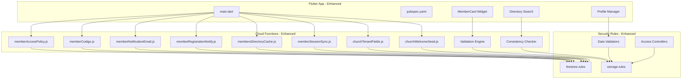

**Diagram sources**
- [main.dart:1-50](file://flutter_app/lib/main.dart#L1-L50)
- [pubspec.yaml:1-50](file://flutter_app/pubspec.yaml#L1-L50)
- [memberAccessPolicy.js:1-120](file://functions/lib/memberAccessPolicy.js#L1-L120)
- [memberCodigo.js:1-120](file://functions/lib/memberCodigo.js#L1-L120)
- [memberNotificationEmail.js:1-120](file://functions/lib/memberNotificationEmail.js#L1-L120)
- [memberRegistrationNotify.js:1-120](file://functions/lib/memberRegistrationNotify.js#L1-L120)
- [membersDirectoryCache.js:1-120](file://functions/lib/membersDirectoryCache.js#L1-L120)
- [membroSessionSync.js:1-120](file://functions/lib/membroSessionSync.js#L1-L120)
- [churchTenantFields.js:1-120](file://functions/lib/churchTenantFields.js#L1-L120)
- [churchWelcomeSeed.js:1-120](file://functions/lib/churchWelcomeSeed.js#L1-L120)
- [firestore.rules:1-200](file://firestore.rules#L1-L200)
- [storage.rules:1-200](file://storage.rules#L1-L200)

**Section sources**
- [main.dart:1-50](file://flutter_app/lib/main.dart#L1-L50)
- [pubspec.yaml:1-50](file://flutter_app/pubspec.yaml#L1-L50)

## Core Components
- Access policy enforcement: Centralized logic to determine member roles and permissions across operations
- Unique code generation: Assigns unique identifiers for members and related entities
- Email notifications: Automated emails for registration, updates, and reminders
- Registration workflow: Orchestrates new member onboarding and initial data seeding
- Directory caching: Optimizes read performance for member listings and search
- Session synchronization: Keeps member session state consistent across devices
- Tenant fields: Manages church-specific member attributes and metadata
- Welcome seed: Initializes default data for new churches and members
- **Enhanced**: Member card components with rich display and editing capabilities
- **Enhanced**: Advanced directory services with intelligent search and filtering
- **Enhanced**: Comprehensive data validation and consistency checking

**Section sources**
- [memberAccessPolicy.js:1-120](file://functions/lib/memberAccessPolicy.js#L1-L120)
- [memberCodigo.js:1-120](file://functions/lib/memberCodigo.js#L1-L120)
- [memberNotificationEmail.js:1-120](file://functions/lib/memberNotificationEmail.js#L1-L120)
- [memberRegistrationNotify.js:1-120](file://functions/lib/memberRegistrationNotify.js#L1-L120)
- [membersDirectoryCache.js:1-120](file://functions/lib/membersDirectoryCache.js#L1-L120)
- [membroSessionSync.js:1-120](file://functions/lib/membroSessionSync.js#L1-L120)
- [churchTenantFields.js:1-120](file://functions/lib/churchTenantFields.js#L1-L120)
- [churchWelcomeSeed.js:1-120](file://functions/lib/churchWelcomeSeed.js#L1-L120)

## Architecture Overview
Member management follows a layered architecture with clear separation between UI, serverless functions, and security policies. The enhanced system includes improved member cards, advanced directory services, and comprehensive data validation.

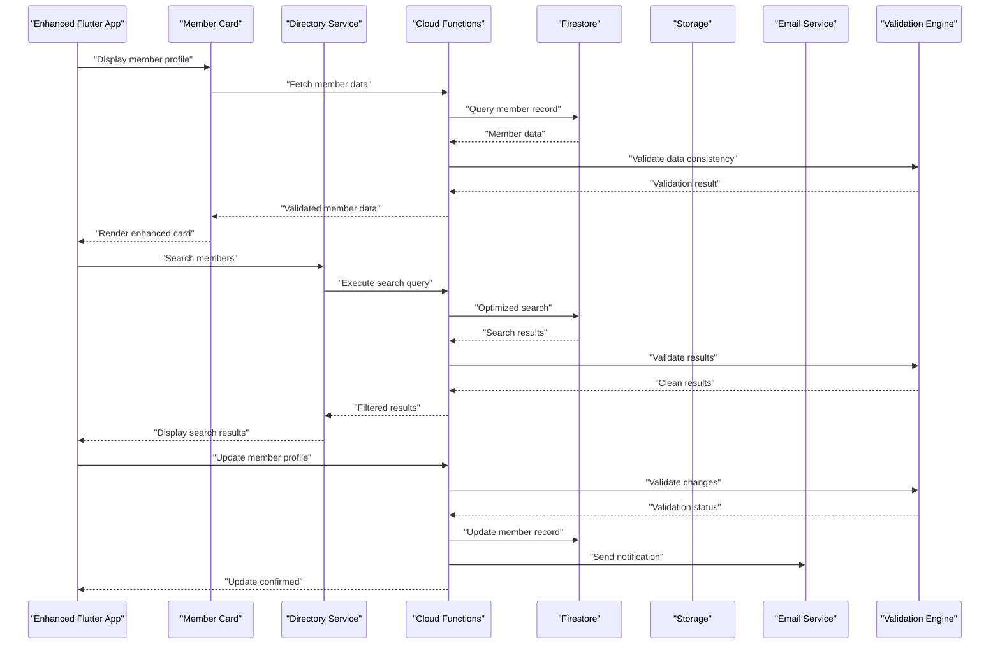

**Diagram sources**
- [memberRegistrationNotify.js:1-120](file://functions/lib/memberRegistrationNotify.js#L1-L120)
- [memberCodigo.js:1-120](file://functions/lib/memberCodigo.js#L1-L120)
- [memberNotificationEmail.js:1-120](file://functions/lib/memberNotificationEmail.js#L1-L120)
- [membroSessionSync.js:1-120](file://functions/lib/membroSessionSync.js#L1-L120)
- [membersDirectoryCache.js:1-120](file://functions/lib/membersDirectoryCache.js#L1-L120)
- [firestore.rules:1-200](file://firestore.rules#L1-L200)
- [storage.rules:1-200](file://storage.rules#L1-L200)

## Detailed Component Analysis

### Member Data Model
The member data model includes core identity fields, contact information, role assignments, department memberships, consent flags, and engagement metrics. Church-specific attributes are managed via tenant fields.

Key aspects:
- Identity: unique ID, name, email, phone, avatar URL
- Roles: admin, pastor, leader, member, visitor
- Departments: hierarchical membership and leadership
- Consent: GDPR flags for marketing, messaging, and data processing
- Engagement: attendance counts, event participation, activity timestamps
- **Enhanced**: Rich profile data with validation constraints
- **Enhanced**: Real-time synchronization flags
- **Enhanced**: Data integrity checksums

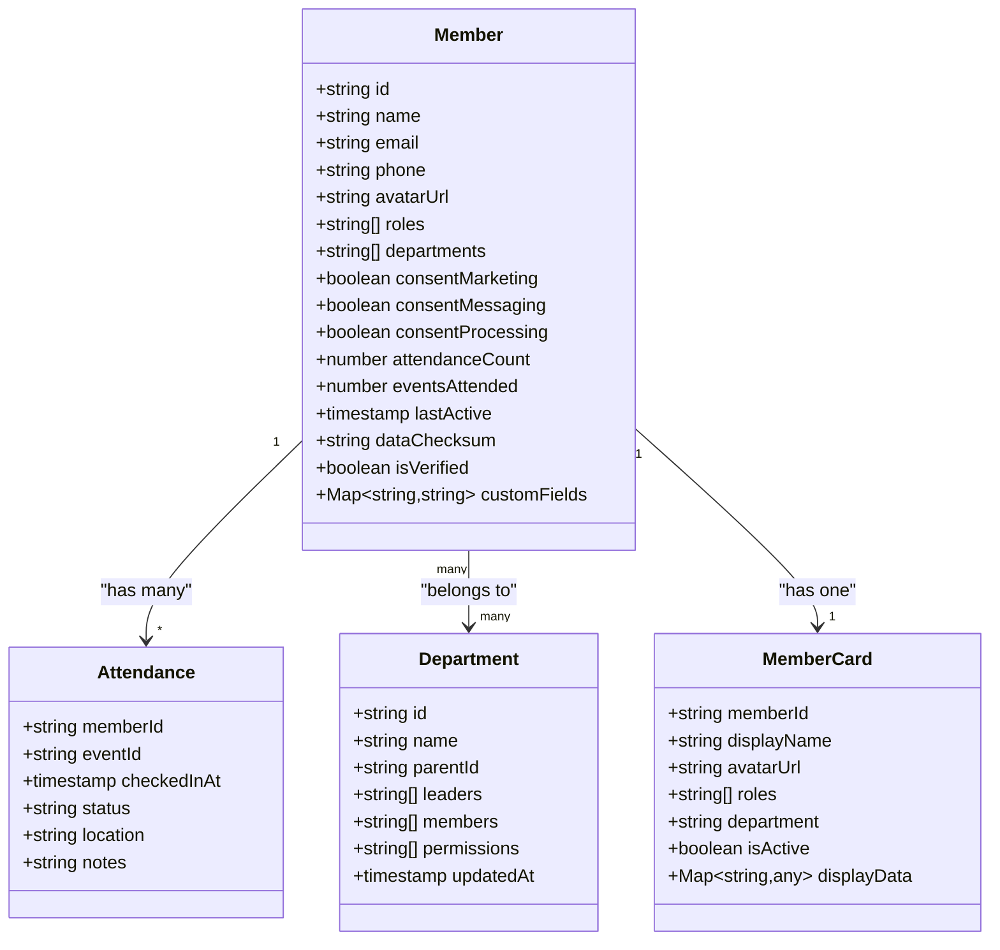

**Diagram sources**
- [churchTenantFields.js:1-120](file://functions/lib/churchTenantFields.js#L1-L120)
- [membroSessionSync.js:1-120](file://functions/lib/membroSessionSync.js#L1-L120)

**Section sources**
- [churchTenantFields.js:1-120](file://functions/lib/churchTenantFields.js#L1-L120)
- [membroSessionSync.js:1-120](file://functions/lib/membroSessionSync.js#L1-L120)

### Role Assignments and Access Permissions
Role-based access control is enforced through centralized policy logic and Firestore rules. Roles include administrative, pastoral, departmental leadership, and general membership. Permissions are scoped by church tenant and resource type.

Implementation highlights:
- Policy evaluation function checks user roles against requested operation
- Firestore rules validate tenant ownership and role-based access
- Admin and pastoral roles have elevated privileges for member management
- **Enhanced**: Granular permission controls for member card operations
- **Enhanced**: Context-aware access validation for directory operations

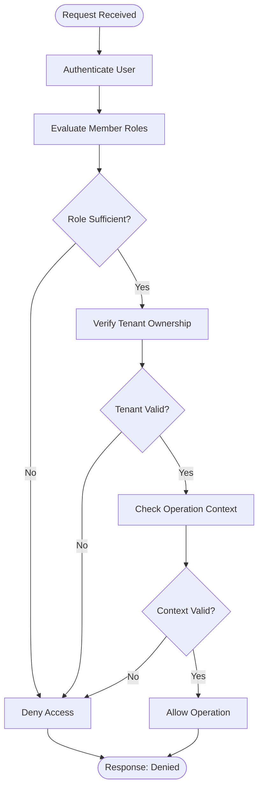

**Diagram sources**
- [memberAccessPolicy.js:1-120](file://functions/lib/memberAccessPolicy.js#L1-L120)
- [firestore.rules:1-200](file://firestore.rules#L1-L200)

**Section sources**
- [memberAccessPolicy.js:1-120](file://functions/lib/memberAccessPolicy.js#L1-L120)
- [firestore.rules:1-200](file://firestore.rules#L1-L200)

### Member Lifecycle Management
The member lifecycle encompasses registration, profile updates, deactivation, and archival. Each stage triggers appropriate notifications and data synchronization.

Lifecycle stages:
- Registration: create member record, generate unique code, send welcome email
- Profile management: update personal info, preferences, consent settings
- Department assignment: add/remove from departments and leadership roles
- Attendance tracking: record check-ins and event participation
- Communication: manage email and push notification preferences
- Deactivation: soft delete with data retention policies
- **Enhanced**: Real-time profile synchronization across devices
- **Enhanced**: Automatic data validation at each lifecycle stage

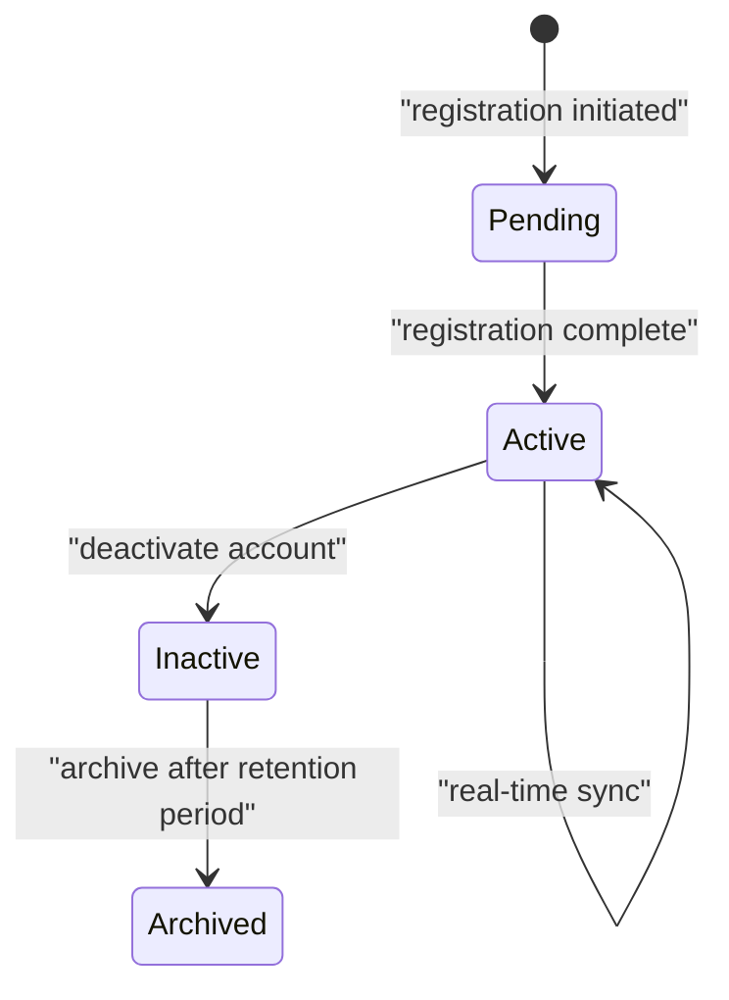

**Diagram sources**
- [memberRegistrationNotify.js:1-120](file://functions/lib/memberRegistrationNotify.js#L1-L120)
- [membroSessionSync.js:1-120](file://functions/lib/membroSessionSync.js#L1-L120)

**Section sources**
- [memberRegistrationNotify.js:1-120](file://functions/lib/memberRegistrationNotify.js#L1-L120)
- [membroSessionSync.js:1-120](file://functions/lib/membroSessionSync.js#L1-L120)

### Department Organization and Hierarchies
Department management supports hierarchical structures with parent-child relationships. Leaders can manage their departments while maintaining organizational integrity.

Features:
- Tree structure with parent IDs for hierarchy
- Leader assignments with permission inheritance
- Member enrollment and transfer workflows
- Department statistics and reporting
- **Enhanced**: Enhanced department member management
- **Enhanced**: Improved department search and filtering

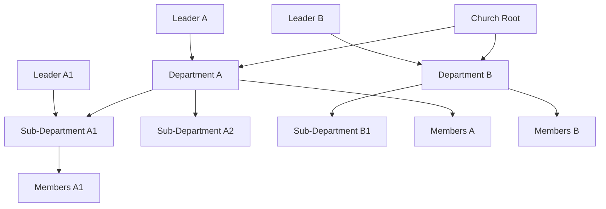

**Diagram sources**
- [churchTenantFields.js:1-120](file://functions/lib/churchTenantFields.js#L1-L120)

**Section sources**
- [churchTenantFields.js:1-120](file://functions/lib/churchTenantFields.js#L1-L120)

### Attendance Tracking and Event Participation
Attendance tracking records member participation in services, events, and activities. Data is aggregated for engagement metrics and reporting.

Tracking mechanisms:
- Check-in validation with unique codes
- Event-based attendance records
- Real-time synchronization across devices
- Historical analytics and trends
- **Enhanced**: Improved attendance validation
- **Enhanced**: Better conflict resolution for simultaneous check-ins

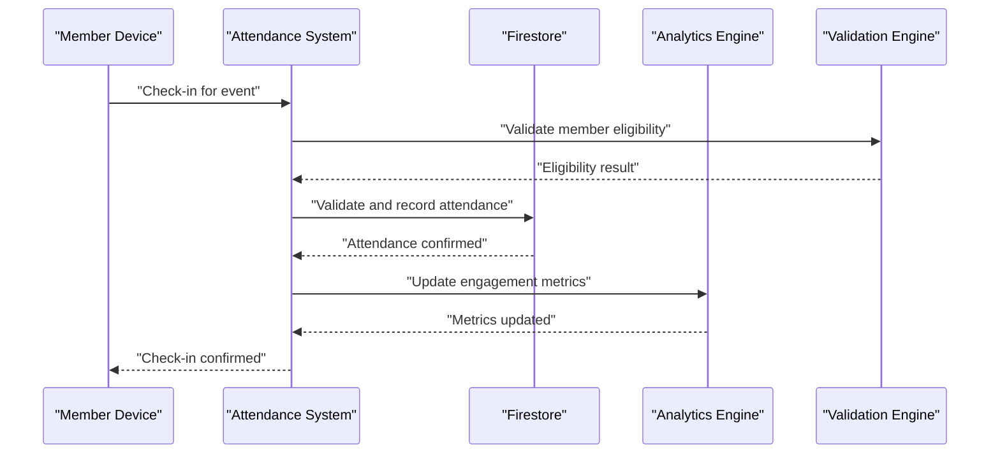

**Diagram sources**
- [membroSessionSync.js:1-120](file://functions/lib/membroSessionSync.js#L1-L120)

**Section sources**
- [membroSessionSync.js:1-120](file://functions/lib/membroSessionSync.js#L1-L120)

### Communication Tools and Automated Notifications
Communication tools enable targeted messaging to members based on roles, departments, and preferences. Automated notifications handle registration confirmations, event reminders, and system alerts.

Capabilities:
- Email campaigns with template support
- Push notifications with preference filtering
- SMS integration for critical alerts
- Bulk messaging with segmentation
- **Enhanced**: Improved message delivery tracking
- **Enhanced**: Better consent management for communications

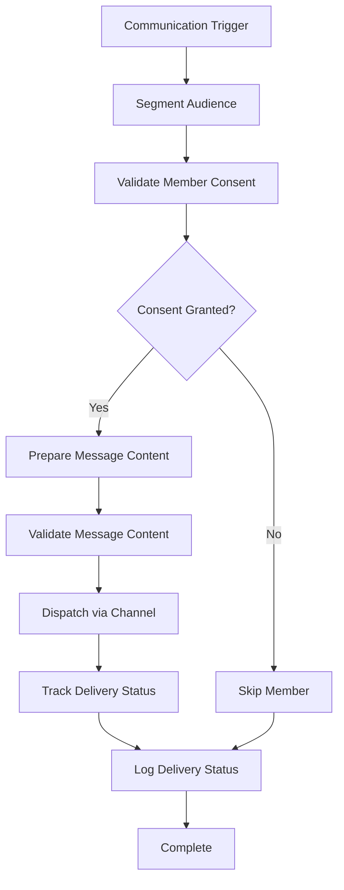

**Diagram sources**
- [memberNotificationEmail.js:1-120](file://functions/lib/memberNotificationEmail.js#L1-L120)
- [memberRegistrationNotify.js:1-120](file://functions/lib/memberRegistrationNotify.js#L1-L120)

**Section sources**
- [memberNotificationEmail.js:1-120](file://functions/lib/memberNotificationEmail.js#L1-L120)
- [memberRegistrationNotify.js:1-120](file://functions/lib/memberRegistrationNotify.js#L1-L120)

### Engagement Metrics and Analytics
Engagement metrics track member participation, activity levels, and community involvement. Metrics are calculated from attendance records, communication interactions, and profile updates.

Key metrics:
- Attendance frequency and consistency
- Event participation rates
- Communication engagement (email opens, click-throughs)
- Department involvement scores
- Overall community health indicators
- **Enhanced**: More accurate engagement scoring
- **Enhanced**: Real-time metric updates

**Section sources**
- [membersDirectoryCache.js:1-120](file://functions/lib/membersDirectoryCache.js#L1-L120)

## Enhanced Member Card Functionality

### Rich Member Display Cards
The enhanced member card system provides comprehensive member information display with interactive features and real-time updates.

Key features:
- Dynamic content rendering based on member roles and permissions
- Interactive profile editing with inline validation
- Avatar upload and management with automatic resizing
- Department and role badges with visual indicators
- Contact information with secure display controls
- Activity timeline showing recent member actions

### Member Card Data Flow
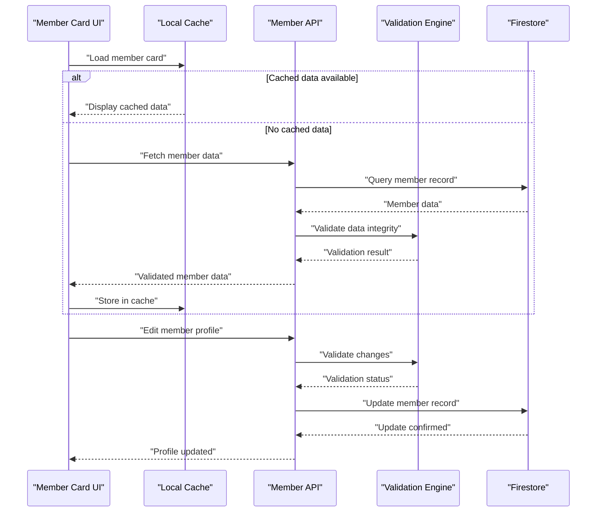

**Diagram sources**
- [membersDirectoryCache.js:1-120](file://functions/lib/membersDirectoryCache.js#L1-L120)
- [membroSessionSync.js:1-120](file://functions/lib/membroSessionSync.js#L1-L120)

**Section sources**
- [membersDirectoryCache.js:1-120](file://functions/lib/membersDirectoryCache.js#L1-L120)
- [membroSessionSync.js:1-120](file://functions/lib/membroSessionSync.js#L1-L120)

## Advanced Directory Services

### Intelligent Search and Filtering
The enhanced directory services provide powerful search capabilities with intelligent filtering and real-time results.

Search features:
- Full-text search across member names, emails, and custom fields
- Advanced filtering by department, role, status, and custom attributes
- Real-time search results with debounced input handling
- Saved search queries and quick filters
- Export capabilities for search results
- Performance optimization with indexed searches

### Directory Query Processing
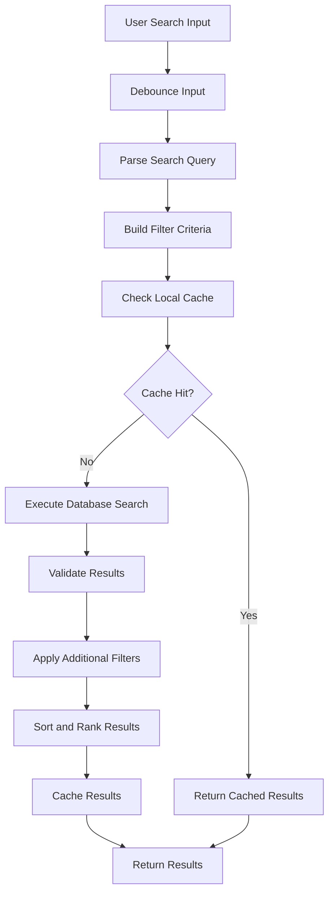

**Diagram sources**
- [membersDirectoryCache.js:1-120](file://functions/lib/membersDirectoryCache.js#L1-L120)

**Section sources**
- [membersDirectoryCache.js:1-120](file://functions/lib/membersDirectoryCache.js#L1-L120)

## Data Consistency Validation

### Comprehensive Validation Engine
The enhanced data consistency validation ensures data integrity across all member operations and prevents corruption or inconsistencies.

Validation features:
- Schema validation for all member data structures
- Cross-field validation with dependency checking
- Referential integrity validation for relationships
- Business rule validation with configurable constraints
- Real-time validation feedback in UI components
- Batch validation for bulk operations

### Validation Workflow
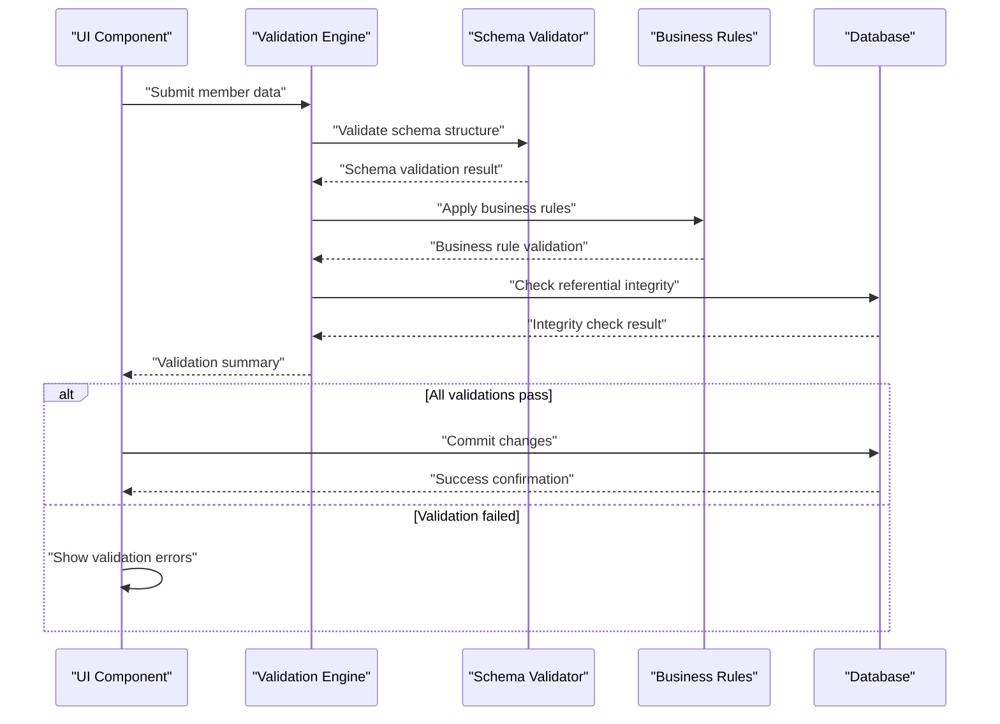

**Diagram sources**
- [memberAccessPolicy.js:1-120](file://functions/lib/memberAccessPolicy.js#L1-L120)
- [churchTenantFields.js:1-120](file://functions/lib/churchTenantFields.js#L1-L120)

**Section sources**
- [memberAccessPolicy.js:1-120](file://functions/lib/memberAccessPolicy.js#L1-L120)
- [churchTenantFields.js:1-120](file://functions/lib/churchTenantFields.js#L1-L120)

## Dependency Analysis
The member management system has well-defined dependencies between components, ensuring modularity and maintainability with enhanced validation and consistency checking.

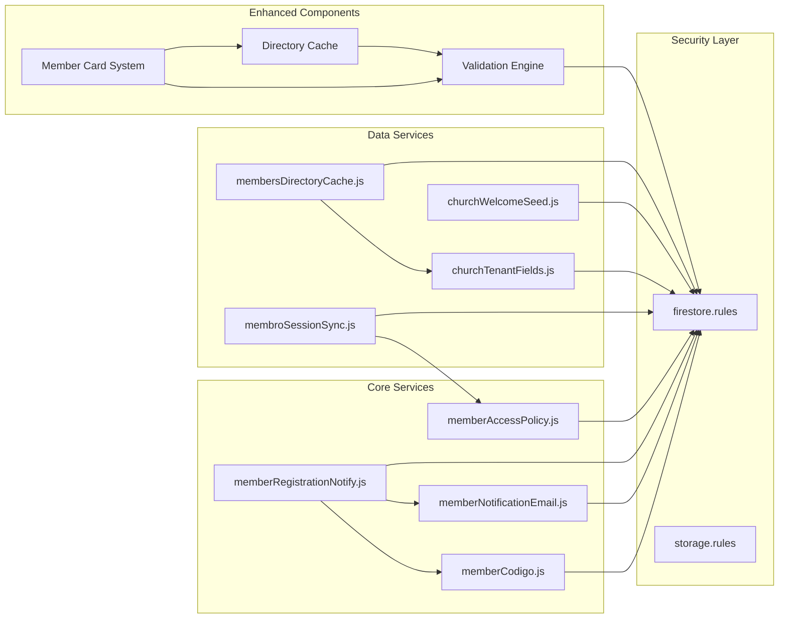

**Diagram sources**
- [memberAccessPolicy.js:1-120](file://functions/lib/memberAccessPolicy.js#L1-L120)
- [memberCodigo.js:1-120](file://functions/lib/memberCodigo.js#L1-L120)
- [memberNotificationEmail.js:1-120](file://functions/lib/memberNotificationEmail.js#L1-L120)
- [memberRegistrationNotify.js:1-120](file://functions/lib/memberRegistrationNotify.js#L1-L120)
- [membersDirectoryCache.js:1-120](file://functions/lib/membersDirectoryCache.js#L1-L120)
- [membroSessionSync.js:1-120](file://functions/lib/membroSessionSync.js#L1-L120)
- [churchTenantFields.js:1-120](file://functions/lib/churchTenantFields.js#L1-L120)
- [churchWelcomeSeed.js:1-120](file://functions/lib/churchWelcomeSeed.js#L1-L120)
- [firestore.rules:1-200](file://firestore.rules#L1-L200)
- [storage.rules:1-200](file://storage.rules#L1-L200)

**Section sources**
- [memberAccessPolicy.js:1-120](file://functions/lib/memberAccessPolicy.js#L1-L120)
- [memberCodigo.js:1-120](file://functions/lib/memberCodigo.js#L1-L120)
- [memberNotificationEmail.js:1-120](file://functions/lib/memberNotificationEmail.js#L1-L120)
- [memberRegistrationNotify.js:1-120](file://functions/lib/memberRegistrationNotify.js#L1-L120)
- [membersDirectoryCache.js:1-120](file://functions/lib/membersDirectoryCache.js#L1-L120)
- [membroSessionSync.js:1-120](file://functions/lib/membroSessionSync.js#L1-L120)
- [churchTenantFields.js:1-120](file://functions/lib/churchTenantFields.js#L1-L120)
- [churchWelcomeSeed.js:1-120](file://functions/lib/churchWelcomeSeed.js#L1-L120)
- [firestore.rules:1-200](file://firestore.rules#L1-L200)
- [storage.rules:1-200](file://storage.rules#L1-L200)

## Performance Considerations
- Directory caching reduces database load for member lookups and searches
- Asynchronous processing for email notifications prevents blocking operations
- Efficient indexing strategies for frequently queried member attributes
- Batch operations for bulk member updates and imports
- Connection pooling and request optimization in Cloud Functions
- **Enhanced**: Optimized member card rendering with virtual scrolling
- **Enhanced**: Intelligent search result caching with TTL management
- **Enhanced**: Background validation tasks to prevent UI blocking

## Troubleshooting Guide
Common issues and resolutions:
- Authentication failures: Verify Firebase configuration and user session state
- Permission denied errors: Check Firestore rules and member role assignments
- Email delivery problems: Validate email templates and service configurations
- Performance bottlenecks: Monitor function execution times and database query patterns
- Data synchronization issues: Review session sync logic and conflict resolution
- **Enhanced**: Member card loading issues: Check cache invalidation and network connectivity
- **Enhanced**: Search performance problems: Verify index creation and query optimization
- **Enhanced**: Data validation failures: Review schema definitions and business rules

**Section sources**
- [memberAccessPolicy.js:1-120](file://functions/lib/memberAccessPolicy.js#L1-L120)
- [membroSessionSync.js:1-120](file://functions/lib/membroSessionSync.js#L1-L120)

## Conclusion
The Gestão Yahweh Premium member management system provides a comprehensive solution for managing church members with robust security, scalability, and compliance features. The enhanced system with improved member cards, advanced directory services, and comprehensive data validation ensures reliable and efficient member data management. The modular architecture enables easy maintenance and extension while ensuring data privacy and regulatory compliance.

## Appendices

### Examples and Implementation Details

#### Adding Members
1. Create member document with required fields
2. Generate unique identification code
3. Send welcome email notification
4. Initialize default settings and preferences
5. Add to appropriate departments if applicable
6. **Enhanced**: Run comprehensive data validation
7. **Enhanced**: Initialize member card with validated data

#### Assigning Roles
1. Update member roles array with appropriate permissions
2. Verify role assignment through access policy
3. Sync role changes across all devices
4. Update department leadership if needed
5. **Enhanced**: Validate role hierarchy and permissions
6. **Enhanced**: Update member card display with new roles

#### Tracking Attendance
1. Validate member eligibility for event
2. Record check-in timestamp and event details
3. Update engagement metrics
4. Send confirmation notification if configured
5. **Enhanced**: Perform real-time data consistency validation
6. **Enhanced**: Update member card activity timeline

#### Managing Communications
1. Segment audience based on criteria
2. Validate member consent preferences
3. Prepare personalized message content
4. Dispatch through appropriate channels
5. Track delivery and engagement metrics
6. **Enhanced**: Validate message content and recipient eligibility

### Data Privacy and GDPR Compliance
- Explicit consent collection for marketing and processing
- Right to erasure with data retention policies
- Data portability and export capabilities
- Privacy-by-design principles in all components
- Regular compliance audits and monitoring
- **Enhanced**: Enhanced consent management with granular controls
- **Enhanced**: Improved data audit trails and compliance reporting

**Section sources**
- [memberRegistrationNotify.js:1-120](file://functions/lib/memberRegistrationNotify.js#L1-L120)
- [memberNotificationEmail.js:1-120](file://functions/lib/memberNotificationEmail.js#L1-L120)
- [churchTenantFields.js:1-120](file://functions/lib/churchTenantFields.js#L1-L120)