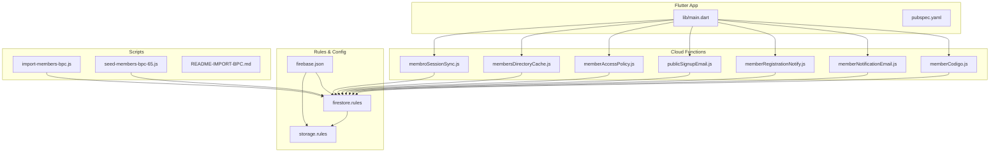
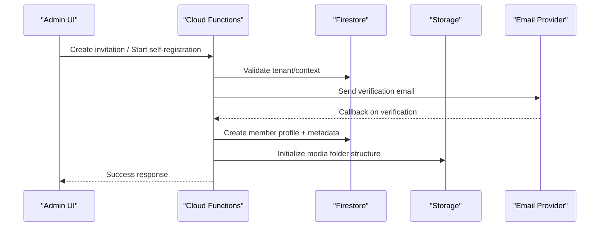
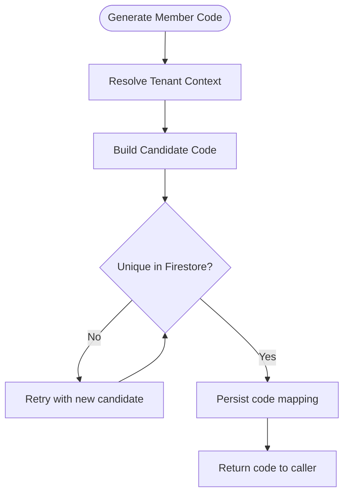
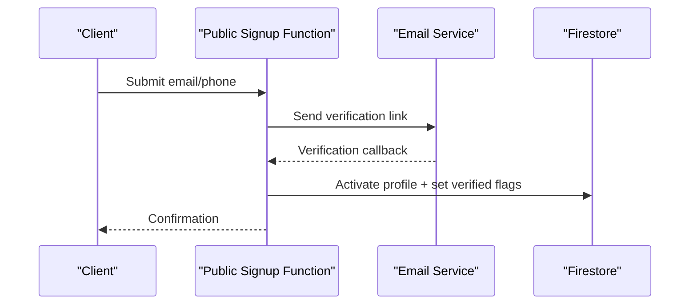
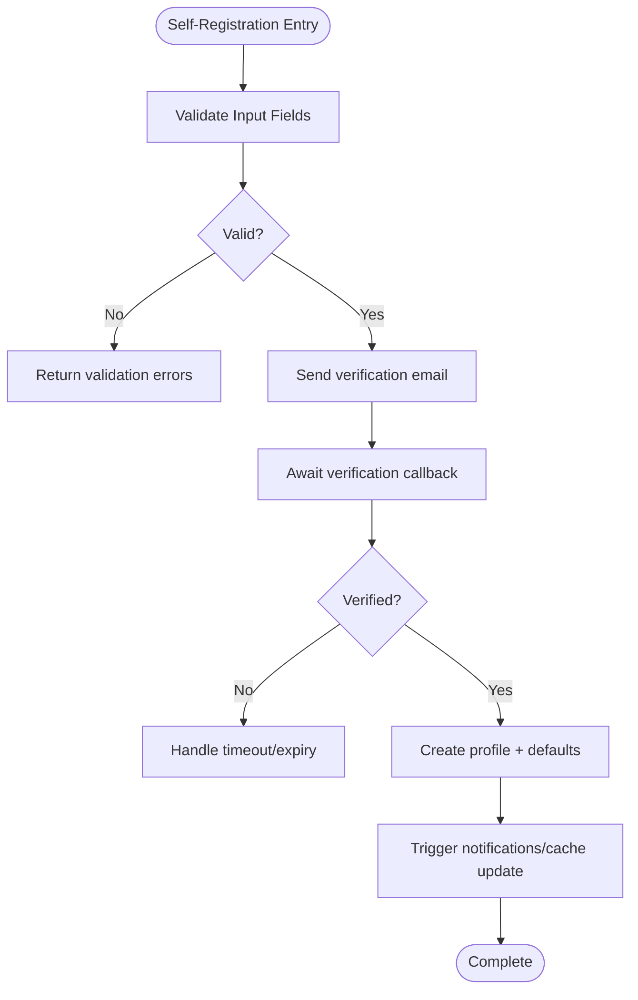
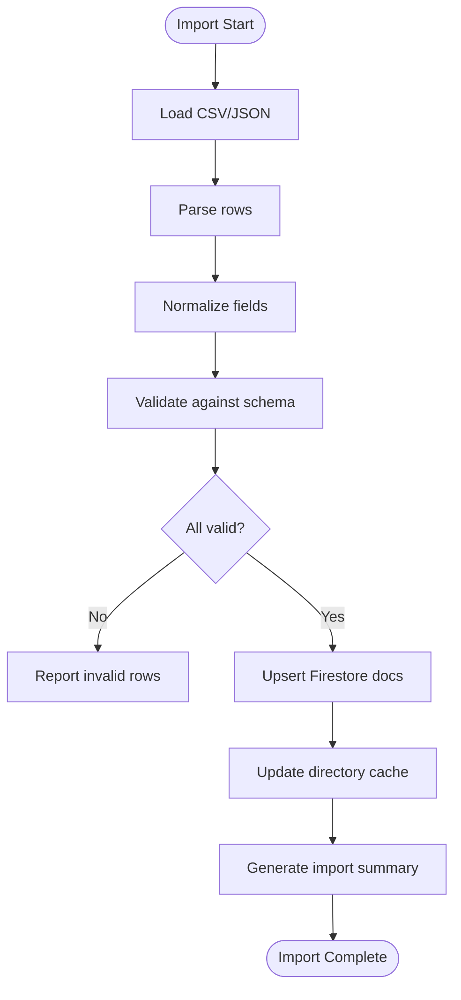
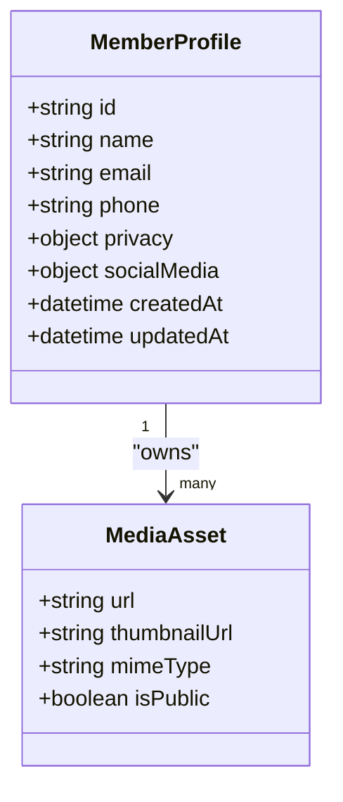
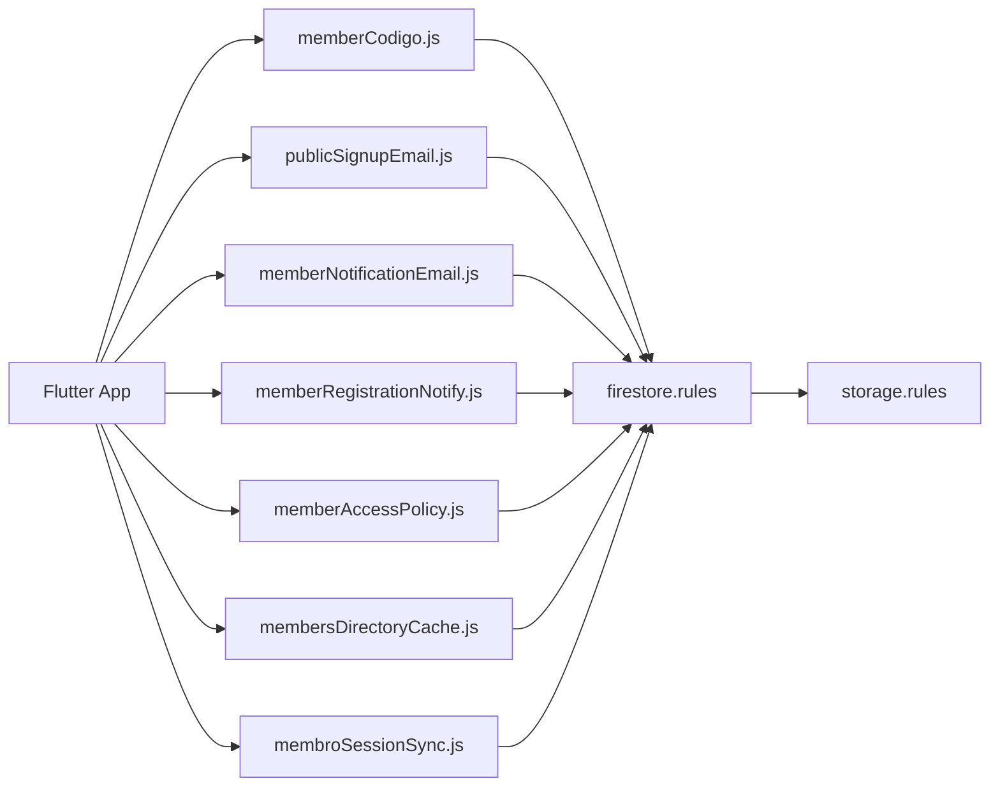

# Member Registration & Profiles

<cite>
**Referenced Files in This Document**
- [memberCodigo.js](file://functions/lib/memberCodigo.js)
- [memberNotificationEmail.js](file://functions/lib/memberNotificationEmail.js)
- [memberRegistrationNotify.js](file://functions/lib/memberRegistrationNotify.js)
- [publicSignupEmail.js](file://functions/lib/publicSignupEmail.js)
- [memberAccessPolicy.js](file://functions/lib/memberAccessPolicy.js)
- [membersDirectoryCache.js](file://functions/lib/membersDirectoryCache.js)
- [membroSessionSync.js](file://functions/lib/membroSessionSync.js)
- [firestore.rules](file://firestore.rules)
- [storage.rules](file://storage.rules)
- [firebase.json](file://firebase.json)
- [pubspec.yaml](file://flutter_app/pubspec.yaml)
- [main.dart](file://flutter_app/lib/main.dart)
- [import-members-bpc.js](file://scripts/import-members-bpc.js)
- [seed-members-bpc-65.js](file://scripts/seed-members-bpc-65.js)
- [README-IMPORT-BPC.md](file://scripts/README-IMPORT-BPC.md)
</cite>

## Table of Contents
1. [Introduction](#introduction)
2. [Project Structure](#project-structure)
3. [Core Components](#core-components)
4. [Architecture Overview](#architecture-overview)
5. [Detailed Component Analysis](#detailed-component-analysis)
6. [Dependency Analysis](#dependency-analysis)
7. [Performance Considerations](#performance-considerations)
8. [Troubleshooting Guide](#troubleshooting-guide)
9. [GDPR, Consent & Data Retention](#gdpr-consent--data-retention)
10. [Conclusion](#conclusion)
11. [Appendices](#appendices)

## Introduction
This document explains member registration and profile management in the Gestão Yahweh Premium application. It covers:
- Invitation-based onboarding, self-registration, and bulk import workflows
- Profile data model, field validation, image handling, and privacy controls
- Implementation details for member code generation, email verification, phone validation, and social integrations
- Practical examples for creating profiles, updating personal information, managing photos, and exporting member data
- GDPR compliance considerations, consent management, and data retention policies

## Project Structure
Member-related functionality spans Cloud Functions (Node.js), Firestore rules, Storage rules, Flutter app entry points, and utility scripts for imports and seeding.

**Diagram sources**
- [main.dart](file://flutter_app/lib/main.dart)
- [pubspec.yaml](file://flutter_app/pubspec.yaml)
- [memberCodigo.js](file://functions/lib/memberCodigo.js)
- [memberNotificationEmail.js](file://functions/lib/memberNotificationEmail.js)
- [memberRegistrationNotify.js](file://functions/lib/memberRegistrationNotify.js)
- [publicSignupEmail.js](file://functions/lib/publicSignupEmail.js)
- [memberAccessPolicy.js](file://functions/lib/memberAccessPolicy.js)
- [membersDirectoryCache.js](file://functions/lib/membersDirectoryCache.js)
- [membroSessionSync.js](file://functions/lib/membroSessionSync.js)
- [firestore.rules](file://firestore.rules)
- [storage.rules](file://storage.rules)
- [firebase.json](file://firebase.json)
- [import-members-bpc.js](file://scripts/import-members-bpc.js)
- [seed-members-bpc-65.js](file://scripts/seed-members-bpc-65.js)
- [README-IMPORT-BPC.md](file://scripts/README-IMPORT-BPC.md)

**Section sources**
- [main.dart](file://flutter_app/lib/main.dart)
- [pubspec.yaml](file://flutter_app/pubspec.yaml)
- [firebase.json](file://firebase.json)

## Core Components
- Member code generation: deterministic or random unique identifiers for members within a tenant context.
- Email notifications: welcome emails, verification links, and registration confirmations.
- Public signup flow: self-registration with email verification and optional phone validation.
- Access policy: fine-grained Firestore read/write permissions based on roles and membership.
- Directory cache: optimized listing of members for search and directory features.
- Session sync: synchronization of session state across devices for authenticated members.

Key responsibilities:
- Generate and validate member codes to prevent collisions and enforce uniqueness per church/tenant.
- Send transactional emails via Firebase extensions or external providers configured in firebase.json.
- Enforce security through Firestore and Storage rules.
- Provide efficient directory queries and caching strategies.
- Maintain session consistency across platforms.

**Section sources**
- [memberCodigo.js](file://functions/lib/memberCodigo.js)
- [memberNotificationEmail.js](file://functions/lib/memberNotificationEmail.js)
- [memberRegistrationNotify.js](file://functions/lib/memberRegistrationNotify.js)
- [publicSignupEmail.js](file://functions/lib/publicSignupEmail.js)
- [memberAccessPolicy.js](file://functions/lib/memberAccessPolicy.js)
- [membersDirectoryCache.js](file://functions/lib/membersDirectoryCache.js)
- [membroSessionSync.js](file://functions/lib/membroSessionSync.js)
- [firestore.rules](file://firestore.rules)
- [storage.rules](file://storage.rules)
- [firebase.json](file://firebase.json)

## Architecture Overview
The system orchestrates multiple flows:
- Invitation workflow: admin creates invitations; invitee completes registration; verification triggers profile creation and notifications.
- Self-registration: user submits email/phone; receives verification link; upon verification, profile is created and access granted.
- Bulk import: CSV/JSON ingestion validates fields, generates member codes, and seeds Firestore records.
- Profile management: CRUD operations guarded by access policies; images stored in Storage with thumbnails and display URLs.
- Directory and search: cached indexes for fast lookups; real-time updates via Firestore listeners.

**Diagram sources**
- [memberRegistrationNotify.js](file://functions/lib/memberRegistrationNotify.js)
- [publicSignupEmail.js](file://functions/lib/publicSignupEmail.js)
- [memberCodigo.js](file://functions/lib/memberCodigo.js)
- [firestore.rules](file://firestore.rules)
- [storage.rules](file://storage.rules)

## Detailed Component Analysis

### Member Code Generation
- Purpose: Ensure unique, auditable member identifiers scoped to a church/tenant.
- Behavior: Generates codes with collision checks, optional prefixes/suffixes, and length constraints.
- Validation: Rejects duplicates; enforces format rules; logs attempts for auditability.

**Diagram sources**
- [memberCodigo.js](file://functions/lib/memberCodigo.js)
- [firestore.rules](file://firestore.rules)

**Section sources**
- [memberCodigo.js](file://functions/lib/memberCodigo.js)

### Email Verification & Notifications
- Welcome email: sent after successful registration or invitation acceptance.
- Verification email: contains secure token/link; validated server-side before profile activation.
- Notification hooks: trigger follow-up actions like directory indexing and cache refresh.

**Diagram sources**
- [publicSignupEmail.js](file://functions/lib/publicSignupEmail.js)
- [memberNotificationEmail.js](file://functions/lib/memberNotificationEmail.js)
- [memberRegistrationNotify.js](file://functions/lib/memberRegistrationNotify.js)
- [firestore.rules](file://firestore.rules)

**Section sources**
- [publicSignupEmail.js](file://functions/lib/publicSignupEmail.js)
- [memberNotificationEmail.js](file://functions/lib/memberNotificationEmail.js)
- [memberRegistrationNotify.js](file://functions/lib/memberRegistrationNotify.js)

### Self-Registration Workflow
- Inputs: email, optional phone, consent flags, language preferences.
- Validation: email format, phone normalization, required consent fields.
- Outcome: pending verification state until token confirmed; then active profile with default roles.

**Diagram sources**
- [publicSignupEmail.js](file://functions/lib/publicSignupEmail.js)
- [memberRegistrationNotify.js](file://functions/lib/memberRegistrationNotify.js)
- [firestore.rules](file://firestore.rules)

**Section sources**
- [publicSignupEmail.js](file://functions/lib/publicSignupEmail.js)
- [memberRegistrationNotify.js](file://functions/lib/memberRegistrationNotify.js)

### Bulk Import Capabilities
- Sources: CSV/JSON files from legacy systems or external tools.
- Process: parse, normalize, validate, generate member codes, upsert Firestore documents, handle duplicates and conflicts.
- Reporting: success/failure summaries, error logs, retry mechanisms.

**Diagram sources**
- [import-members-bpc.js](file://scripts/import-members-bpc.js)
- [seed-members-bpc-65.js](file://scripts/seed-members-bpc-65.js)
- [README-IMPORT-BPC.md](file://scripts/README-IMPORT-BPC.md)
- [firestore.rules](file://firestore.rules)

**Section sources**
- [import-members-bpc.js](file://scripts/import-members-bpc.js)
- [seed-members-bpc-65.js](file://scripts/seed-members-bpc-65.js)
- [README-IMPORT-BPC.md](file://scripts/README-IMPORT-BPC.md)

### Profile Data Model & Field Validation
- Core fields: name, email, phone, date of birth, address, emergency contact, role, status, timestamps.
- Optional fields: social media handles, pronouns, preferred language, consent flags, privacy settings.
- Validation rules: non-empty required fields, email uniqueness, phone normalization, consent mandatory for marketing.

Implementation notes:
- Server-side validation in functions ensures data integrity.
- Firestore rules enforce write permissions and field-level access.
- Client-side validation improves UX but must not be trusted alone.

**Section sources**
- [memberAccessPolicy.js](file://functions/lib/memberAccessPolicy.js)
- [firestore.rules](file://firestore.rules)

### Image Handling & Privacy Controls
- Storage structure: per-member folders for avatars, documents, and attachments.
- Thumbnails: generated variants for performance; display URLs served via CDN.
- Privacy: configurable visibility (private, church-only, public); access controlled by Firestore and Storage rules.

**Diagram sources**
- [storage.rules](file://storage.rules)
- [firestore.rules](file://firestore.rules)

**Section sources**
- [storage.rules](file://storage.rules)
- [firestore.rules](file://firestore.rules)

### Social Media Integration
- Supported platforms: Facebook, Instagram, Twitter/X, LinkedIn, WhatsApp.
- Data storage: handles and links normalized; optional OAuth tokens if needed for advanced features.
- Privacy: explicit consent required to store or display social links publicly.

**Section sources**
- [memberAccessPolicy.js](file://functions/lib/memberAccessPolicy.js)
- [firestore.rules](file://firestore.rules)

### Phone Number Validation
- Normalization: E.164 format; country code detection; duplicate checks.
- Verification: optional SMS OTP integration; fallback to manual verification by admins.
- Logging: audit trail for changes to sensitive fields like phone numbers.

**Section sources**
- [publicSignupEmail.js](file://functions/lib/publicSignupEmail.js)
- [memberNotificationEmail.js](file://functions/lib/memberNotificationEmail.js)
- [firestore.rules](file://firestore.rules)

### Session Synchronization
- Cross-device consistency: last login, device list, active sessions.
- Security: revoke sessions on password change; detect anomalies.
- Sync mechanism: Firestore listeners update UI in real time.

**Section sources**
- [membroSessionSync.js](file://functions/lib/membroSessionSync.js)
- [firestore.rules](file://firestore.rules)

### Directory Cache & Search
- Cached indexes: searchable attributes indexed for fast queries.
- Updates: triggered on profile changes; incremental updates minimize latency.
- Query patterns: name, email, role, department filters; pagination support.

**Section sources**
- [membersDirectoryCache.js](file://functions/lib/membersDirectoryCache.js)
- [firestore.rules](file://firestore.rules)

## Dependency Analysis
Interactions between components are tightly coupled around Firestore and Storage, with Cloud Functions orchestrating business logic and events.

**Diagram sources**
- [memberCodigo.js](file://functions/lib/memberCodigo.js)
- [publicSignupEmail.js](file://functions/lib/publicSignupEmail.js)
- [memberNotificationEmail.js](file://functions/lib/memberNotificationEmail.js)
- [memberRegistrationNotify.js](file://functions/lib/memberRegistrationNotify.js)
- [memberAccessPolicy.js](file://functions/lib/memberAccessPolicy.js)
- [membersDirectoryCache.js](file://functions/lib/membersDirectoryCache.js)
- [membroSessionSync.js](file://functions/lib/membroSessionSync.js)
- [firestore.rules](file://firestore.rules)
- [storage.rules](file://storage.rules)

**Section sources**
- [firebase.json](file://firebase.json)

## Performance Considerations
- Use Firestore indexes for frequent queries (name, email, role).
- Cache directory results to reduce read costs and latency.
- Generate thumbnails for images to minimize bandwidth.
- Batch writes during bulk imports to avoid throttling.
- Leverage Storage CDN for media delivery.

[No sources needed since this section provides general guidance]

## Troubleshooting Guide
Common issues and resolutions:
- Duplicate member codes: check collision logic and retry strategy.
- Email verification failures: inspect provider configuration and callback endpoints.
- Storage upload errors: verify CORS, rules, and file size limits.
- Directory cache staleness: ensure triggers fire on profile updates.
- Session inconsistencies: review sync function logs and rule enforcement.

**Section sources**
- [memberCodigo.js](file://functions/lib/memberCodigo.js)
- [publicSignupEmail.js](file://functions/lib/publicSignupEmail.js)
- [storage.rules](file://storage.rules)
- [membersDirectoryCache.js](file://functions/lib/membersDirectoryCache.js)
- [membroSessionSync.js](file://functions/lib/membroSessionSync.js)

## GDPR, Consent & Data Retention
- Consent management: explicit opt-in for marketing and public display; record consent timestamps and versions.
- Data minimization: collect only necessary fields; allow users to delete sensitive data.
- Right to erasure: implement deletion workflows that cascade to Firestore and Storage.
- Data retention: define policies for logs, temporary files, and inactive accounts; automate purging.
- Auditability: log access and changes to personal data; provide export capabilities.

Best practices:
- Store consent flags in profile with versioning.
- Provide self-service export and deletion via secure endpoints.
- Regularly review and purge stale data according to retention schedules.

**Section sources**
- [memberAccessPolicy.js](file://functions/lib/memberAccessPolicy.js)
- [firestore.rules](file://firestore.rules)
- [storage.rules](file://storage.rules)

## Conclusion
The member registration and profile management system combines robust Cloud Functions, strict Firestore and Storage rules, and efficient caching to deliver a secure, scalable experience. By following the documented workflows and best practices, teams can maintain high data quality, protect privacy, and comply with regulations while providing a seamless onboarding journey.

[No sources needed since this section summarizes without analyzing specific files]

## Appendices

### Examples: Creating Member Profiles
- Invitation flow: create invitation, send email, complete registration, verify, activate.
- Self-registration: submit form, receive verification, confirm, profile created.
- Bulk import: prepare CSV, run script, validate, upsert, report.

**Section sources**
- [memberRegistrationNotify.js](file://functions/lib/memberRegistrationNotify.js)
- [publicSignupEmail.js](file://functions/lib/publicSignupEmail.js)
- [import-members-bpc.js](file://scripts/import-members-bpc.js)

### Examples: Updating Personal Information
- Update fields: name, phone, address; enforce validation and consent.
- Change privacy settings: restrict visibility; re-index directory cache.
- Audit changes: log modifications with timestamps and actor IDs.

**Section sources**
- [memberAccessPolicy.js](file://functions/lib/memberAccessPolicy.js)
- [firestore.rules](file://firestore.rules)

### Examples: Managing Profile Photos
- Upload avatar: validate size/type, store in member folder, generate thumbnails.
- Set display photo: update profile reference; ensure public/private flags.
- Delete media: cascade deletes; clean up thumbnails and references.

**Section sources**
- [storage.rules](file://storage.rules)
- [firestore.rules](file://firestore.rules)

### Examples: Exporting Member Data
- Export formats: CSV, JSON; include only permitted fields based on privacy.
- Secure delivery: signed URLs or authenticated downloads.
- Compliance: respect consent and retention policies; log exports.

**Section sources**
- [memberAccessPolicy.js](file://functions/lib/memberAccessPolicy.js)
- [firestore.rules](file://firestore.rules)