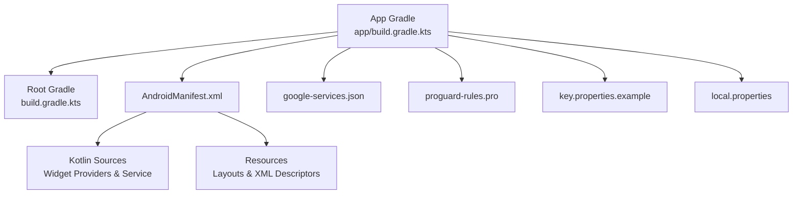
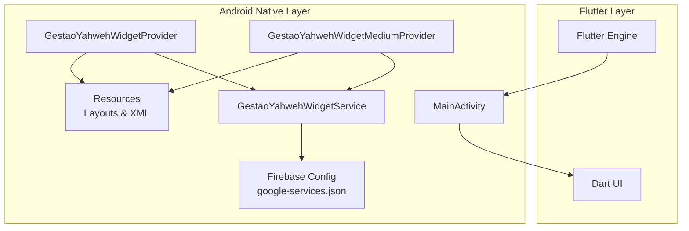
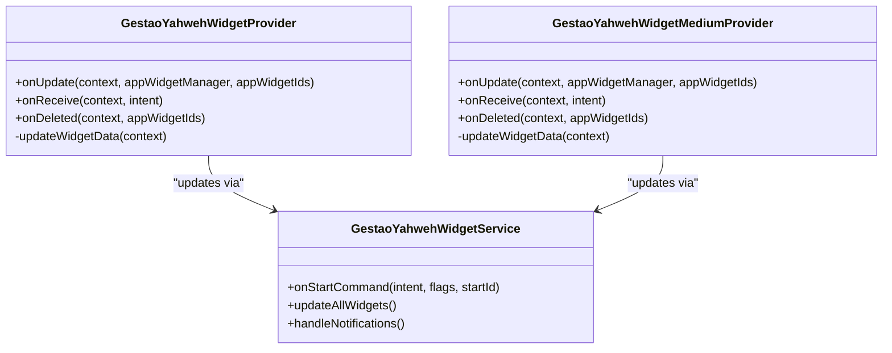
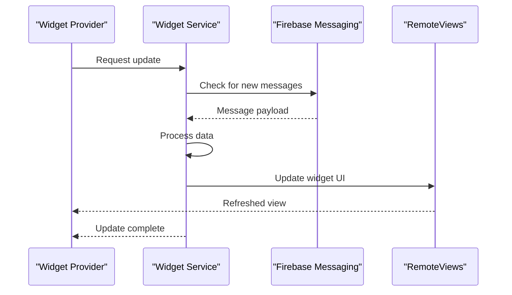
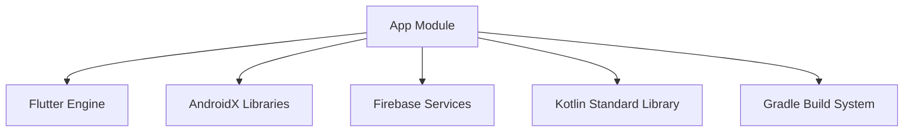

# Android Implementation & Configuration

<cite>
**Referenced Files in This Document**
- [flutter_app/android/app/build.gradle.kts](file://flutter_app/android/app/build.gradle.kts)
- [flutter_app/android/build.gradle.kts](file://flutter_app/android/build.gradle.kts)
- [flutter_app/android/gradle.properties](file://flutter_app/android/gradle.properties)
- [flutter_app/android/settings.gradle.kts](file://flutter_app/android/settings.gradle.kts)
- [flutter_app/android/app/src/main/AndroidManifest.xml](file://flutter_app/android/app/src/main/AndroidManifest.xml)
- [flutter_app/android/app/google-services.json](file://flutter_app/android/app/google-services.json)
- [flutter_app/android/app/proguard-rules.pro](file://flutter_app/android/app/proguard-rules.pro)
- [flutter_app/android/key.properties.example](file://flutter_app/android/key.properties.example)
- [flutter_app/android/local.properties](file://flutter_app/android/local.properties)
- [flutter_app/android/app/src/main/kotlin/com/example/gestao_yahweh/gestaoyahweh/app/GestaoYahwehWidgetProvider.kt](file://flutter_app/android/app/src/main/kotlin/com/example/gestao_yahweh/gestaoyahweh/app/GestaoYahwehWidgetProvider.kt)
- [flutter_app/android/app/src/main/kotlin/com/example/gestao_yahweh/gestaoyahweh/app/GestaoYahwehWidgetMediumProvider.kt](file://flutter_app/android/app/src/main/kotlin/com/example/gestao_yahweh/gestaoyahweh/app/GestaoYahwehWidgetMediumProvider.kt)
- [flutter_app/android/app/src/main/kotlin/com/example/gestao_yahweh/gestaoyahweh/app/GestaoYahwehWidgetService.kt](file://flutter_app/android/app/src/main/kotlin/com/example/gestao_yahweh/gestaoyahweh/app/GestaoYahwehWidgetService.kt)
- [flutter_app/android/app/src/main/res/xml/widget_info.xml](file://flutter_app/android/app/src/main/res/xml/widget_info.xml)
- [flutter_app/android/app/src/main/res/xml/widget_medium_info.xml](file://flutter_app/android/app/src/main/res/xml/widget_medium_info.xml)
- [flutter_app/android/app/src/main/res/layout/widget_layout.xml](file://flutter_app/android/app/src/main/res/layout/widget_layout.xml)
- [flutter_app/android/app/src/main/res/layout/widget_medium_layout.xml](file://flutter_app/android/app/src/main/res/layout/widget_medium_layout.xml)
</cite>

## Table of Contents
1. [Introduction](#introduction)
2. [Project Structure](#project-structure)
3. [Core Components](#core-components)
4. [Architecture Overview](#architecture-overview)
5. [Detailed Component Analysis](#detailed-component-analysis)
6. [Dependency Analysis](#dependency-analysis)
7. [Performance Considerations](#performance-considerations)
8. [Troubleshooting Guide](#troubleshooting-guide)
9. [Conclusion](#conclusion)
10. [Appendices](#appendices)

## Introduction
This document provides comprehensive Android implementation documentation for Gestão Yahweh Premium, focusing on the Flutter Android native layer, Kotlin-based widgets, background services, and platform-specific configurations. It explains how MainActivity integrates with Flutter, how widget providers are implemented, and how Firebase is configured via google-services.json. It also covers build variants, signing configuration, ProGuard rules, performance optimizations, memory management, and debugging techniques specific to Android development.

## Project Structure
The Android project resides under flutter_app/android and follows standard Flutter Android conventions:
- App-level Gradle script defines dependencies, plugins, and signing options.
- Root Gradle script configures repositories and toolchains.
- AndroidManifest declares permissions, components (MainActivity, widgets, services), and Firebase metadata.
- Kotlin sources implement widget providers and a background service.
- Resources define widget layouts and XML descriptors.
- google-services.json configures Firebase integration.
- proguard-rules.pro contains optimization and shrinking rules.
- key.properties.example shows how signing credentials are referenced.
- local.properties points to the Android SDK location.

**Diagram sources**
- [flutter_app/android/app/build.gradle.kts](file://flutter_app/android/app/build.gradle.kts)
- [flutter_app/android/build.gradle.kts](file://flutter_app/android/build.gradle.kts)
- [flutter_app/android/app/src/main/AndroidManifest.xml](file://flutter_app/android/app/src/main/AndroidManifest.xml)
- [flutter_app/android/app/google-services.json](file://flutter_app/android/app/google-services.json)
- [flutter_app/android/app/proguard-rules.pro](file://flutter_app/android/app/proguard-rules.pro)
- [flutter_app/android/key.properties.example](file://flutter_app/android/key.properties.example)
- [flutter_app/android/local.properties](file://flutter_app/android/local.properties)

**Section sources**
- [flutter_app/android/app/build.gradle.kts](file://flutter_app/android/app/build.gradle.kts)
- [flutter_app/android/build.gradle.kts](file://flutter_app/android/build.gradle.kts)
- [flutter_app/android/gradle.properties](file://flutter_app/android/gradle.properties)
- [flutter_app/android/settings.gradle.kts](file://flutter_app/android/settings.gradle.kts)
- [flutter_app/android/app/src/main/AndroidManifest.xml](file://flutter_app/android/app/src/main/AndroidManifest.xml)
- [flutter_app/android/app/google-services.json](file://flutter_app/android/app/google-services.json)
- [flutter_app/android/app/proguard-rules.pro](file://flutter_app/android/app/proguard-rules.pro)
- [flutter_app/android/key.properties.example](file://flutter_app/android/key.properties.example)
- [flutter_app/android/local.properties](file://flutter_app/android/local.properties)

## Core Components
- MainActivity: Entry point that initializes Flutter engine and delegates UI rendering to Flutter.
- Widget Providers: Standalone components that render home screen widgets using RemoteViews and update data via a background service.
- Background Service: Handles periodic updates, notifications, and system integrations required by widgets.
- Firebase Integration: Configured through google-services.json and plugin initialization within the app lifecycle.

Key responsibilities:
- Bridge between Flutter and Android platform features.
- Manage widget lifecycle and data synchronization.
- Ensure proper permission handling and resource usage.
- Integrate Firebase services for analytics, messaging, and authentication where applicable.

**Section sources**
- [flutter_app/android/app/src/main/AndroidManifest.xml](file://flutter_app/android/app/src/main/AndroidManifest.xml)
- [flutter_app/android/app/google-services.json](file://flutter_app/android/app/google-services.json)
- [flutter_app/android/app/src/main/kotlin/com/example/gestao_yahweh/gestaoyahweh/app/GestaoYahwehWidgetProvider.kt](file://flutter_app/android/app/src/main/kotlin/com/example/gestao_yahweh/gestaoyahweh/app/GestaoYahwehWidgetProvider.kt)
- [flutter_app/android/app/src/main/kotlin/com/example/gestao_yahweh/gestaoyahweh/app/GestaoYahwehWidgetMediumProvider.kt](file://flutter_app/android/app/src/main/kotlin/com/example/gestao_yahweh/gestaoyahweh/app/GestaoYahwehWidgetMediumProvider.kt)
- [flutter_app/android/app/src/main/kotlin/com/example/gestao_yahweh/gestaoyahweh/app/GestaoYahwehWidgetService.kt](file://flutter_app/android/app/src/main/kotlin/com/example/gestao_yahweh/gestaoyahweh/app/GestaoYahwehWidgetService.kt)

## Architecture Overview
The Android architecture combines Flutter’s Dart layer with native Android components:
- Flutter Engine runs inside MainActivity.
- Widgets are implemented as Android App Widgets using Kotlin.
- A background service updates widget data and handles notifications.
- Firebase is integrated via google-services.json and plugin initialization.

**Diagram sources**
- [flutter_app/android/app/src/main/AndroidManifest.xml](file://flutter_app/android/app/src/main/AndroidManifest.xml)
- [flutter_app/android/app/google-services.json](file://flutter_app/android/app/google-services.json)
- [flutter_app/android/app/src/main/kotlin/com/example/gestao_yahweh/gestaoyahweh/app/GestaoYahwehWidgetProvider.kt](file://flutter_app/android/app/src/main/kotlin/com/example/gestao_yahweh/gestaoyahweh/app/GestaoYahwehWidgetProvider.kt)
- [flutter_app/android/app/src/main/kotlin/com/example/gestao_yahweh/gestaoyahweh/app/GestaoYahwehWidgetMediumProvider.kt](file://flutter_app/android/app/src/main/kotlin/com/example/gestao_yahweh/gestaoyahweh/app/GestaoYahwehWidgetMediumProvider.kt)
- [flutter_app/android/app/src/main/kotlin/com/example/gestao_yahweh/gestaoyahweh/app/GestaoYahwehWidgetService.kt](file://flutter_app/android/app/src/main/kotlin/com/example/gestao_yahweh/gestaoyahweh/app/GestaoYahwehWidgetService.kt)

## Detailed Component Analysis

### MainActivity and Flutter Integration
- Initializes Flutter engine and sets up platform channels if needed.
- Delegates all UI rendering to Flutter while retaining access to Android lifecycle hooks.
- Ensures proper permission checks before invoking platform-specific features.

Best practices:
- Avoid heavy operations in onCreate; defer to background tasks.
- Use lifecycle-aware components to manage resources efficiently.

**Section sources**
- [flutter_app/android/app/src/main/AndroidManifest.xml](file://flutter_app/android/app/src/main/AndroidManifest.xml)

### Widget Providers (Standard and Medium)
- GestaoYahwehWidgetProvider: Renders the default-sized widget using RemoteViews and updates content via the background service.
- GestaoYahwehWidgetMediumProvider: Provides an alternative layout for medium-sized homescreen widgets.
- Both providers handle click events and request updates from the service.

Implementation patterns:
- Use onUpdate, onReceive, and onDeleted to manage widget lifecycle.
- Update RemoteViews efficiently to minimize memory usage.
- Coordinate with the background service for data refresh and notifications.

**Diagram sources**
- [flutter_app/android/app/src/main/kotlin/com/example/gestao_yahweh/gestaoyahweh/app/GestaoYahwehWidgetProvider.kt](file://flutter_app/android/app/src/main/kotlin/com/example/gestao_yahweh/gestaoyahweh/app/GestaoYahwehWidgetProvider.kt)
- [flutter_app/android/app/src/main/kotlin/com/example/gestao_yahweh/gestaoyahweh/app/GestaoYahwehWidgetMediumProvider.kt](file://flutter_app/android/app/src/main/kotlin/com/example/gestao_yahweh/gestaoyahweh/app/GestaoYahwehWidgetMediumProvider.kt)
- [flutter_app/android/app/src/main/kotlin/com/example/gestao_yahweh/gestaoyahweh/app/GestaoYahwehWidgetService.kt](file://flutter_app/android/app/src/main/kotlin/com/example/gestao_yahweh/gestaoyahweh/app/GestaoYahwehWidgetService.kt)

**Section sources**
- [flutter_app/android/app/src/main/kotlin/com/example/gestao_yahweh/gestaoyahweh/app/GestaoYahwehWidgetProvider.kt](file://flutter_app/android/app/src/main/kotlin/com/example/gestao_yahweh/gestaoyahweh/app/GestaoYahwehWidgetProvider.kt)
- [flutter_app/android/app/src/main/kotlin/com/example/gestao_yahweh/gestaoyahweh/app/GestaoYahwehWidgetMediumProvider.kt](file://flutter_app/android/app/src/main/kotlin/com/example/gestao_yahweh/gestaoyahweh/app/GestaoYahwehWidgetMediumProvider.kt)
- [flutter_app/android/app/src/main/kotlin/com/example/gestao_yahweh/gestaoyahweh/app/GestaoYahwehWidgetService.kt](file://flutter_app/android/app/src/main/kotlin/com/example/gestao_yahweh/gestaoyahweh/app/GestaoYahwehWidgetService.kt)
- [flutter_app/android/app/src/main/res/xml/widget_info.xml](file://flutter_app/android/app/src/main/res/xml/widget_info.xml)
- [flutter_app/android/app/src/main/res/xml/widget_medium_info.xml](file://flutter_app/android/app/src/main/res/xml/widget_medium_info.xml)
- [flutter_app/android/app/src/main/res/layout/widget_layout.xml](file://flutter_app/android/app/src/main/res/layout/widget_layout.xml)
- [flutter_app/android/app/src/main/res/layout/widget_medium_layout.xml](file://flutter_app/android/app/src/main/res/layout/widget_medium_layout.xml)

### Background Service and Notifications
- GestaoYahwehWidgetService performs periodic updates and displays notifications when necessary.
- Uses WorkManager or foreground service patterns depending on update frequency and user experience requirements.
- Integrates with Firebase Messaging to react to push events and update widget state accordingly.

Operational flow:
- Service receives intents from widget providers to refresh data.
- Fetches updated content from local storage or remote APIs.
- Updates RemoteViews across all active widgets.
- Posts notifications for important events.

**Diagram sources**
- [flutter_app/android/app/src/main/kotlin/com/example/gestao_yahweh/gestaoyahweh/app/GestaoYahwehWidgetService.kt](file://flutter_app/android/app/src/main/kotlin/com/example/gestao_yahweh/gestaoyahweh/app/GestaoYahwehWidgetService.kt)
- [flutter_app/android/app/google-services.json](file://flutter_app/android/app/google-services.json)

**Section sources**
- [flutter_app/android/app/src/main/kotlin/com/example/gestao_yahweh/gestaoyahweh/app/GestaoYahwehWidgetService.kt](file://flutter_app/android/app/src/main/kotlin/com/example/gestao_yahweh/gestaoyahweh/app/GestaoYahwehWidgetService.kt)
- [flutter_app/android/app/google-services.json](file://flutter_app/android/app/google-services.json)

### AndroidManifest Configuration and Permissions
- Declares MainActivity as the main entry point.
- Registers widget providers with appropriate intent filters.
- Defines permissions for network access, notifications, and other system features.
- Includes Firebase metadata and configuration references.

Key considerations:
- Minimize permissions to only those required for functionality.
- Ensure widget providers have correct intent actions and categories.
- Validate manifest entries against Google Play policies.

**Section sources**
- [flutter_app/android/app/src/main/AndroidManifest.xml](file://flutter_app/android/app/src/main/AndroidManifest.xml)

### Firebase Integration
- google-services.json contains project-specific configuration for Firebase services.
- Plugins initialize Firebase Auth, Firestore, Cloud Messaging, and Analytics based on declared dependencies.
- Ensure proper initialization order to avoid runtime errors.

Integration steps:
- Add google-services.json to app directory.
- Apply Google Services plugin in Gradle scripts.
- Initialize Firebase in application startup.

**Section sources**
- [flutter_app/android/app/google-services.json](file://flutter_app/android/app/google-services.json)
- [flutter_app/android/app/build.gradle.kts](file://flutter_app/android/app/build.gradle.kts)

### Build Variants and Signing Configuration
- Build variants include debug, profile, and release configurations.
- Signing is configured via key.properties file for release builds.
- ProGuard rules optimize and shrink the APK/AAB for production.

Configuration highlights:
- Define signingConfigs in app-level Gradle script.
- Reference keystore properties securely.
- Enable minification and obfuscation for release builds.

**Section sources**
- [flutter_app/android/app/build.gradle.kts](file://flutter_app/android/app/build.gradle.kts)
- [flutter_app/android/key.properties.example](file://flutter_app/android/key.properties.example)
- [flutter_app/android/app/proguard-rules.pro](file://flutter_app/android/app/proguard-rules.pro)

### Resource Management and Layouts
- Widget layouts define the visual structure for different sizes.
- XML descriptors specify widget dimensions, update intervals, and configuration options.
- Optimize drawable resources for various screen densities.

Best practices:
- Use vector drawables for scalability.
- Implement efficient layout hierarchies to reduce memory footprint.
- Test widget rendering across different Android versions and OEM skins.

**Section sources**
- [flutter_app/android/app/src/main/res/layout/widget_layout.xml](file://flutter_app/android/app/src/main/res/layout/widget_layout.xml)
- [flutter_app/android/app/src/main/res/layout/widget_medium_layout.xml](file://flutter_app/android/app/src/main/res/layout/widget_medium_layout.xml)
- [flutter_app/android/app/src/main/res/xml/widget_info.xml](file://flutter_app/android/app/src/main/res/xml/widget_info.xml)
- [flutter_app/android/app/src/main/res/xml/widget_medium_info.xml](file://flutter_app/android/app/src/main/res/xml/widget_medium_info.xml)

## Dependency Analysis
The Android module depends on Flutter framework, Firebase services, and AndroidX libraries. Dependencies are managed through Gradle scripts and resolved during build time.

**Diagram sources**
- [flutter_app/android/app/build.gradle.kts](file://flutter_app/android/app/build.gradle.kts)
- [flutter_app/android/build.gradle.kts](file://flutter_app/android/build.gradle.kts)

**Section sources**
- [flutter_app/android/app/build.gradle.kts](file://flutter_app/android/app/build.gradle.kts)
- [flutter_app/android/build.gradle.kts](file://flutter_app/android/build.gradle.kts)
- [flutter_app/android/gradle.properties](file://flutter_app/android/gradle.properties)
- [flutter_app/android/settings.gradle.kts](file://flutter_app/android/settings.gradle.kts)

## Performance Considerations
- Memory Management: Use WeakReferences for large objects in widgets to prevent memory leaks.
- Network Optimization: Implement caching strategies and batch requests to reduce API calls.
- Background Processing: Utilize WorkManager for deferrable tasks and foreground services for critical operations.
- UI Rendering: Optimize RemoteViews updates and avoid complex animations in widgets.
- ProGuard Rules: Configure obfuscation and resource shrinking to reduce APK size.

Recommendations:
- Monitor memory usage with Android Profiler.
- Use Jetpack Compose for future UI improvements where applicable.
- Implement proper error handling and fallback mechanisms.

[No sources needed since this section provides general guidance]

## Troubleshooting Guide
Common issues and solutions:
- Widget not updating: Verify broadcast receivers and service registration in manifest.
- Firebase initialization errors: Check google-services.json placement and plugin configuration.
- Permission denied exceptions: Ensure proper runtime permission requests and manifest declarations.
- Build failures: Validate Gradle wrapper version and Android SDK paths in local.properties.

Debugging techniques:
- Use Logcat for detailed logging of widget and service operations.
- Enable verbose logging in Firebase services during development.
- Test on multiple device types and Android versions for compatibility.

**Section sources**
- [flutter_app/android/app/src/main/AndroidManifest.xml](file://flutter_app/android/app/src/main/AndroidManifest.xml)
- [flutter_app/android/app/google-services.json](file://flutter_app/android/app/google-services.json)
- [flutter_app/android/local.properties](file://flutter_app/android/local.properties)

## Conclusion
The Android implementation for Gestão Yahweh Premium demonstrates a well-structured approach to integrating Flutter with native Android components. The widget system provides essential home screen functionality, while Firebase integration enables real-time features and notifications. Proper configuration of build variants, signing, and ProGuard rules ensures optimal performance and security for production releases. Following the outlined best practices will help maintain code quality and user experience across different Android devices and versions.

[No sources needed since this section summarizes without analyzing specific files]

## Appendices

### Build Configuration Examples
- Debug build: Default configuration with debugging enabled.
- Release build: Optimized with signing and ProGuard rules applied.
- Custom variants: Extend existing configurations for specialized use cases.

### Signing Configuration Setup
- Generate keystore file using keytool.
- Create key.properties file with signing details.
- Configure signingConfigs in Gradle script.

### ProGuard Rules Best Practices
- Keep Flutter-related classes and methods intact.
- Preserve Firebase library integrity.
- Optimize third-party dependencies selectively.

[No sources needed since this section provides general guidance]