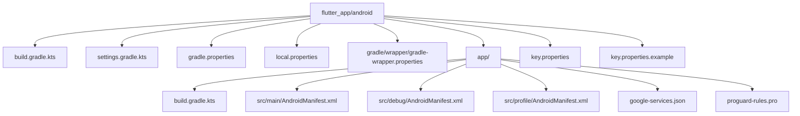
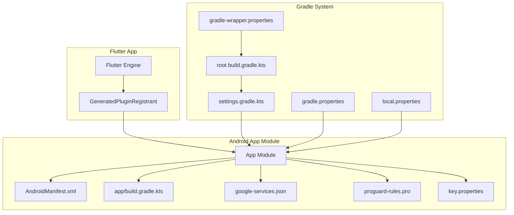
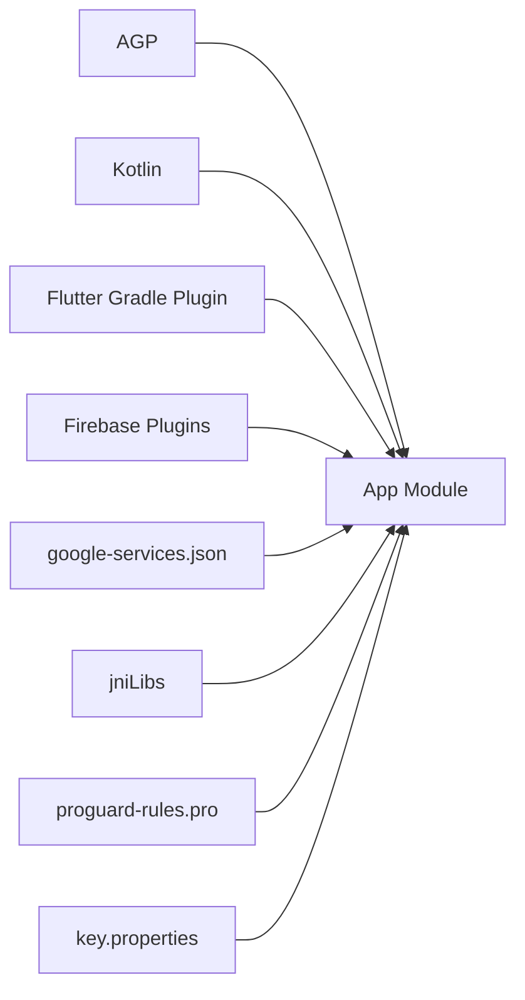

# Android Project Structure

<cite>
**Referenced Files in This Document**
- [flutter_app/android/build.gradle.kts](file://flutter_app/android/build.gradle.kts)
- [flutter_app/android/app/build.gradle.kts](file://flutter_app/android/app/build.gradle.kts)
- [flutter_app/android/settings.gradle.kts](file://flutter_app/android/settings.gradle.kts)
- [flutter_app/android/gradle.properties](file://flutter_app/android/gradle.properties)
- [flutter_app/android/local.properties](file://flutter_app/android/local.properties)
- [flutter_app/android/key.properties](file://flutter_app/android/key.properties)
- [flutter_app/android/key.properties.example](file://flutter_app/android/key.properties.example)
- [flutter_app/android/app/src/main/AndroidManifest.xml](file://flutter_app/android/app/src/main/AndroidManifest.xml)
- [flutter_app/android/app/src/debug/AndroidManifest.xml](file://flutter_app/android/app/src/debug/AndroidManifest.xml)
- [flutter_app/android/app/src/profile/AndroidManifest.xml](file://flutter_app/android/app/src/profile/AndroidManifest.xml)
- [flutter_app/android/app/google-services.json](file://flutter_app/android/app/google-services.json)
- [ANDROID/google-services.json](file://ANDROID/google-services.json)
- [flutter_app/android/app/proguard-rules.pro](file://flutter_app/android/app/proguard-rules.pro)
- [flutter_app/android/gradle/wrapper/gradle-wrapper.properties](file://flutter_app/android/gradle/wrapper/gradle-wrapper.properties)
- [flutter_app/pubspec.yaml](file://flutter_app/pubspec.yaml)
- [scripts/build_android_aab.ps1](file://scripts/build_android_aab.ps1)
- [scripts/build_android_play_store_aab.ps1](file://scripts/build_android_play_store_aab.ps1)
- [scripts/setup_android_release_signing.ps1](file://scripts/setup_android_release_signing.ps1)
- [scripts/sync_android_google_services.ps1](file://scripts/sync_android_google_services.ps1)
</cite>

## Table of Contents
1. [Introduction](#introduction)
2. [Project Structure](#project-structure)
3. [Core Components](#core-components)
4. [Architecture Overview](#architecture-overview)
5. [Detailed Component Analysis](#detailed-component-analysis)
6. [Dependency Analysis](#dependency-analysis)
7. [Performance Considerations](#performance-considerations)
8. [Troubleshooting Guide](#troubleshooting-guide)
9. [Conclusion](#conclusion)
10. [Appendices](#appendices)

## Introduction
This document explains the Android project structure for Gestão Yahweh Premium, a Flutter-based application. It covers directory organization, key configuration files, and build system setup. It also documents the app module structure, Gradle configurations, dependency management, and AndroidManifest.xml configuration including permissions, activities, services, and receivers. Finally, it details project settings, Kotlin version configuration, Flutter plugin integration, and how to customize the build script, add native dependencies, and configure build variants.

## Project Structure
The Android code lives under flutter_app/android, following standard Flutter conventions:
- Root-level Gradle configuration defines toolchain and repository settings.
- The app module contains source code, resources, and manifests for debug, profile, and release builds.
- Gradle wrapper ensures consistent Gradle versions across environments.
- Signing and local properties are managed via dedicated property files.
- Google services configuration is included for Firebase integration.

**Diagram sources**
- [flutter_app/android/build.gradle.kts](file://flutter_app/android/build.gradle.kts)
- [flutter_app/android/settings.gradle.kts](file://flutter_app/android/settings.gradle.kts)
- [flutter_app/android/gradle.properties](file://flutter_app/android/gradle.properties)
- [flutter_app/android/local.properties](file://flutter_app/android/local.properties)
- [flutter_app/android/gradle/wrapper/gradle-wrapper.properties](file://flutter_app/android/gradle/wrapper/gradle-wrapper.properties)
- [flutter_app/android/app/build.gradle.kts](file://flutter_app/android/app/build.gradle.kts)
- [flutter_app/android/app/src/main/AndroidManifest.xml](file://flutter_app/android/app/src/main/AndroidManifest.xml)
- [flutter_app/android/app/src/debug/AndroidManifest.xml](file://flutter_app/android/app/src/debug/AndroidManifest.xml)
- [flutter_app/android/app/src/profile/AndroidManifest.xml](file://flutter_app/android/app/src/profile/AndroidManifest.xml)
- [flutter_app/android/app/google-services.json](file://flutter_app/android/app/google-services.json)
- [flutter_app/android/app/proguard-rules.pro](file://flutter_app/android/app/proguard-rules.pro)
- [flutter_app/android/key.properties](file://flutter_app/android/key.properties)
- [flutter_app/android/key.properties.example](file://flutter_app/android/key.properties.example)

**Section sources**
- [flutter_app/android/build.gradle.kts](file://flutter_app/android/build.gradle.kts)
- [flutter_app/android/settings.gradle.kts](file://flutter_app/android/settings.gradle.kts)
- [flutter_app/android/gradle.properties](file://flutter_app/android/gradle.properties)
- [flutter_app/android/local.properties](file://flutter_app/android/local.properties)
- [flutter_app/android/gradle/wrapper/gradle-wrapper.properties](file://flutter_app/android/gradle/wrapper/gradle-wrapper.properties)
- [flutter_app/android/app/build.gradle.kts](file://flutter_app/android/app/build.gradle.kts)
- [flutter_app/android/app/src/main/AndroidManifest.xml](file://flutter_app/android/app/src/main/AndroidManifest.xml)
- [flutter_app/android/app/src/debug/AndroidManifest.xml](file://flutter_app/android/app/src/debug/AndroidManifest.xml)
- [flutter_app/android/app/src/profile/AndroidManifest.xml](file://flutter_app/android/app/src/profile/AndroidManifest.xml)
- [flutter_app/android/app/google-services.json](file://flutter_app/android/app/google-services.json)
- [flutter_app/android/app/proguard-rules.pro](file://flutter_app/android/app/proguard-rules.pro)
- [flutter_app/android/key.properties](file://flutter_app/android/key.properties)
- [flutter_app/android/key.properties.example](file://flutter_app/android/key.properties.example)

## Core Components
Key Android components and their roles:
- Root build.gradle.kts: Declares Android Gradle Plugin (AGP), Kotlin, and repositories.
- settings.gradle.kts: Includes Flutter-generated modules and plugin registries.
- gradle.properties: Configures Gradle performance and Android build options.
- local.properties: Points to Android SDK and NDK paths.
- app/build.gradle.kts: Defines application ID, compile/target SDK, dependencies, signing, and manifest merging.
- AndroidManifest.xml: Declares app metadata, permissions, activities, services, and receivers.
- google-services.json: Firebase configuration for the app.
- proguard-rules.pro: Obfuscation and shrinking rules for release builds.
- key.properties: Signing credentials for release builds.

**Section sources**
- [flutter_app/android/build.gradle.kts](file://flutter_app/android/build.gradle.kts)
- [flutter_app/android/settings.gradle.kts](file://flutter_app/android/settings.gradle.kts)
- [flutter_app/android/gradle.properties](file://flutter_app/android/gradle.properties)
- [flutter_app/android/local.properties](file://flutter_app/android/local.properties)
- [flutter_app/android/app/build.gradle.kts](file://flutter_app/android/app/build.gradle.kts)
- [flutter_app/android/app/src/main/AndroidManifest.xml](file://flutter_app/android/app/src/main/AndroidManifest.xml)
- [flutter_app/android/app/google-services.json](file://flutter_app/android/app/google-services.json)
- [flutter_app/android/app/proguard-rules.pro](file://flutter_app/android/app/proguard-rules.pro)
- [flutter_app/android/key.properties](file://flutter_app/android/key.properties)

## Architecture Overview
The Android layer integrates with Flutter through generated plugin registrants and native libraries. Firebase is configured via google-services.json. Build variants allow different behaviors for debug, profile, and release.

**Diagram sources**
- [flutter_app/android/app/build.gradle.kts](file://flutter_app/android/app/build.gradle.kts)
- [flutter_app/android/app/src/main/AndroidManifest.xml](file://flutter_app/android/app/src/main/AndroidManifest.xml)
- [flutter_app/android/app/google-services.json](file://flutter_app/android/app/google-services.json)
- [flutter_app/android/app/proguard-rules.pro](file://flutter_app/android/app/proguard-rules.pro)
- [flutter_app/android/key.properties](file://flutter_app/android/key.properties)
- [flutter_app/android/build.gradle.kts](file://flutter_app/android/build.gradle.kts)
- [flutter_app/android/settings.gradle.kts](file://flutter_app/android/settings.gradle.kts)
- [flutter_app/android/gradle.properties](file://flutter_app/android/gradle.properties)
- [flutter_app/android/local.properties](file://flutter_app/android/local.properties)
- [flutter_app/android/gradle/wrapper/gradle-wrapper.properties](file://flutter_app/android/gradle/wrapper/gradle-wrapper.properties)

## Detailed Component Analysis

### Gradle Configuration and Build System
- Root build.gradle.kts configures AGP, Kotlin, and repositories used by all modules.
- settings.gradle.kts includes Flutter-managed modules and plugin registries.
- gradle.properties sets JVM and Android build flags for performance and compatibility.
- local.properties points to Android SDK and NDK locations.
- app/build.gradle.kts defines application metadata, compileSdk/targetSdk, dependencies, signing, and manifest merging.
- gradle-wrapper.properties pins the Gradle version for reproducible builds.

Customization examples:
- Add a new repository or dependency in root build.gradle.kts to share across modules.
- Configure build types and product flavors in app/build.gradle.kts for variant-specific behavior.
- Integrate Firebase by ensuring google-services.json is present and the plugin is applied.

Build variants:
- Debug: minimal optimizations, verbose logging.
- Profile: profiling-friendly instrumentation.
- Release: optimized, obfuscated, signed with key.properties.

**Section sources**
- [flutter_app/android/build.gradle.kts](file://flutter_app/android/build.gradle.kts)
- [flutter_app/android/settings.gradle.kts](file://flutter_app/android/settings.gradle.kts)
- [flutter_app/android/gradle.properties](file://flutter_app/android/gradle.properties)
- [flutter_app/android/local.properties](file://flutter_app/android/local.properties)
- [flutter_app/android/app/build.gradle.kts](file://flutter_app/android/app/build.gradle.kts)
- [flutter_app/android/gradle/wrapper/gradle-wrapper.properties](file://flutter_app/android/gradle/wrapper/gradle-wrapper.properties)

### App Module Structure
- Source sets: main, debug, profile, release.
- Resources: drawables, layouts, values, mipmap icons, XML configs.
- Kotlin code: Widgets, services, and native integrations under kotlin/com/example/gestaoyahweh/app.
- JNI libraries: arm64-v8a, armeabi-v7a, x86, x86_64 for native features.
- GeneratedPluginRegistrant.java bridges Flutter plugins to Android.

Key responsibilities:
- Manifest declares app entry points, permissions, and components.
- Resources define UI assets and platform-specific configurations.
- Kotlin classes implement widget providers and background services.

**Section sources**
- [flutter_app/android/app/src/main/AndroidManifest.xml](file://flutter_app/android/app/src/main/AndroidManifest.xml)
- [flutter_app/android/app/src/main/kotlin/com/example/gestaoyahweh/app](file://flutter_app/android/app/src/main/kotlin/com/example/gestaoyahweh/app)
- [flutter_app/android/app/src/main/jniLibs](file://flutter_app/android/app/src/main/jniLibs)
- [flutter_app/android/app/src/main/res](file://flutter_app/android/app/src/main/res)
- [flutter_app/android/app/src/main/java/io/flutter/plugins/GeneratedPluginRegistrant.java](file://flutter_app/android/app/src/main/java/io/flutter/plugins/GeneratedPluginRegistrant.java)

### AndroidManifest.xml Configuration
- Permissions: network access, storage, notifications, camera, etc., as required by features.
- Activities: main activity entry point and any custom screens.
- Services: background tasks, widget services, and push handling.
- Receivers: boot completion, intent handlers, and system events.
- Application metadata: icon, label, theme, and Firebase initialization flags.

Debug and profile manifests can merge additional entries for development and profiling.

**Section sources**
- [flutter_app/android/app/src/main/AndroidManifest.xml](file://flutter_app/android/app/src/main/AndroidManifest.xml)
- [flutter_app/android/app/src/debug/AndroidManifest.xml](file://flutter_app/android/app/src/debug/AndroidManifest.xml)
- [flutter_app/android/app/src/profile/AndroidManifest.xml](file://flutter_app/android/app/src/profile/AndroidManifest.xml)

### Dependency Management and Flutter Plugin Integration
- Dependencies are declared in app/build.gradle.kts, including Firebase and third-party libraries.
- Flutter plugins are integrated via the Flutter Gradle plugin; generated registrant wires native code.
- Native libraries are included under jniLibs for supported architectures.
- ProGuard rules in proguard-rules.pro manage obfuscation and shrinking.

Kotlin version configuration:
- Defined in root build.gradle.kts and aligned with Flutter’s expectations.

Firebase integration:
- google-services.json provides project-specific configuration.
- Ensure the Google Services plugin is applied in app/build.gradle.kts.

**Section sources**
- [flutter_app/android/app/build.gradle.kts](file://flutter_app/android/app/build.gradle.kts)
- [flutter_app/android/app/src/main/java/io/flutter/plugins/GeneratedPluginRegistrant.java](file://flutter_app/android/app/src/main/java/io/flutter/plugins/GeneratedPluginRegistrant.java)
- [flutter_app/android/app/src/main/jniLibs](file://flutter_app/android/app/src/main/jniLibs)
- [flutter_app/android/app/proguard-rules.pro](file://flutter_app/android/app/proguard-rules.pro)
- [flutter_app/android/app/google-services.json](file://flutter_app/android/app/google-services.json)
- [ANDROID/google-services.json](file://ANDROID/google-services.json)

### Project Settings and Kotlin Version
- settings.gradle.kts includes Flutter modules and plugin registries.
- gradle.properties configures JVM args, AndroidX, and R8/ProGuard flags.
- Kotlin version is set centrally to ensure consistency across modules.

**Section sources**
- [flutter_app/android/settings.gradle.kts](file://flutter_app/android/settings.gradle.kts)
- [flutter_app/android/gradle.properties](file://flutter_app/android/gradle.properties)
- [flutter_app/android/build.gradle.kts](file://flutter_app/android/build.gradle.kts)

### Build Variants and Signing
- Build types: debug, profile, release.
- Product flavors: optional variants for different app configurations.
- Signing: key.properties holds keystore path, alias, and passwords for release builds.
- Scripts automate signing setup and AAB generation.

**Section sources**
- [flutter_app/android/app/build.gradle.kts](file://flutter_app/android/app/build.gradle.kts)
- [flutter_app/android/key.properties](file://flutter_app/android/key.properties)
- [flutter_app/android/key.properties.example](file://flutter_app/android/key.properties.example)
- [scripts/setup_android_release_signing.ps1](file://scripts/setup_android_release_signing.ps1)
- [scripts/build_android_aab.ps1](file://scripts/build_android_aab.ps1)
- [scripts/build_android_play_store_aab.ps1](file://scripts/build_android_play_store_aab.ps1)

### Flutter Plugin Integration Details
- Flutter generates a plugin registrant that initializes native plugins at runtime.
- Plugins requiring Android permissions or components must declare them in AndroidManifest.xml.
- Native dependencies should be added to app/build.gradle.kts and mirrored in pubspec.yaml for Dart-side usage.

**Section sources**
- [flutter_app/android/app/src/main/java/io/flutter/plugins/GeneratedPluginRegistrant.java](file://flutter_app/android/app/src/main/java/io/flutter/plugins/GeneratedPluginRegistrant.java)
- [flutter_app/android/app/src/main/AndroidManifest.xml](file://flutter_app/android/app/src/main/AndroidManifest.xml)
- [flutter_app/pubspec.yaml](file://flutter_app/pubspec.yaml)

## Dependency Analysis
The Android build depends on:
- AGP and Kotlin for compilation.
- Flutter Gradle plugin for bridging Dart code.
- Firebase plugins and google-services.json for backend integration.
- Native libraries under jniLibs for performance-critical features.

**Diagram sources**
- [flutter_app/android/app/build.gradle.kts](file://flutter_app/android/app/build.gradle.kts)
- [flutter_app/android/app/google-services.json](file://flutter_app/android/app/google-services.json)
- [flutter_app/android/app/proguard-rules.pro](file://flutter_app/android/app/proguard-rules.pro)
- [flutter_app/android/key.properties](file://flutter_app/android/key.properties)
- [flutter_app/android/app/src/main/jniLibs](file://flutter_app/android/app/src/main/jniLibs)

**Section sources**
- [flutter_app/android/app/build.gradle.kts](file://flutter_app/android/app/build.gradle.kts)
- [flutter_app/android/app/google-services.json](file://flutter_app/android/app/google-services.json)
- [flutter_app/android/app/proguard-rules.pro](file://flutter_app/android/app/proguard-rules.pro)
- [flutter_app/android/key.properties](file://flutter_app/android/key.properties)
- [flutter_app/android/app/src/main/jniLibs](file://flutter_app/android/app/src/main/jniLibs)

## Performance Considerations
- Enable R8/ProGuard in release builds to reduce APK size and improve startup time.
- Use multidex only if necessary; prefer modern dexing strategies.
- Minimize native library footprint by including only required ABIs.
- Configure Gradle caching and parallel builds via gradle.properties.
- Avoid heavy synchronous operations in main thread; use background services where appropriate.

[No sources needed since this section provides general guidance]

## Troubleshooting Guide
Common issues and resolutions:
- Missing google-services.json: Ensure the file exists in app/ and matches the app ID.
- Signing errors: Validate key.properties and keystore accessibility; use scripts to verify fingerprints.
- Plugin registration failures: Check GeneratedPluginRegistrant.java and ensure plugins are declared in pubspec.yaml.
- Manifest conflicts: Merge debug/profile manifests carefully; avoid duplicate component declarations.
- Build failures due to Kotlin/AGP mismatch: Align versions in root build.gradle.kts and Flutter toolchain.

Automated helpers:
- Setup signing and validate environment using PowerShell scripts.
- Sync google-services.json across environments consistently.

**Section sources**
- [flutter_app/android/app/google-services.json](file://flutter_app/android/app/google-services.json)
- [flutter_app/android/key.properties](file://flutter_app/android/key.properties)
- [flutter_app/android/app/src/main/java/io/flutter/plugins/GeneratedPluginRegistrant.java](file://flutter_app/android/app/src/main/java/io/flutter/plugins/GeneratedPluginRegistrant.java)
- [flutter_app/android/app/src/debug/AndroidManifest.xml](file://flutter_app/android/app/src/debug/AndroidManifest.xml)
- [flutter_app/android/app/src/profile/AndroidManifest.xml](file://flutter_app/android/app/src/profile/AndroidManifest.xml)
- [flutter_app/android/build.gradle.kts](file://flutter_app/android/build.gradle.kts)
- [scripts/setup_android_release_signing.ps1](file://scripts/setup_android_release_signing.ps1)
- [scripts/sync_android_google_services.ps1](file://scripts/sync_android_google_services.ps1)

## Conclusion
The Android project for Gestão Yahweh Premium follows Flutter best practices with clear separation of concerns across Gradle configuration, app module, and manifests. Firebase integration is straightforward via google-services.json, while signing and build variants are managed through dedicated properties and scripts. Properly configuring Kotlin, AGP, and plugin registries ensures reliable builds across environments. For customization, extend app/build.gradle.kts for dependencies and variants, update AndroidManifest.xml for permissions and components, and leverage scripts for automation.

[No sources needed since this section summarizes without analyzing specific files]

## Appendices

### Customizing the Build Script
- Add repositories or shared dependencies in root build.gradle.kts.
- Define product flavors and build types in app/build.gradle.kts.
- Integrate native libraries by placing .so files under jniLibs and declaring ABI filters.

### Adding Native Dependencies
- Include prebuilt binaries in jniLibs for required architectures.
- Update app/build.gradle.kts to specify ABI filters and packaging options.
- Ensure Dart-side bindings exist in pubspec.yaml for plugin interoperability.

### Configuring Build Variants
- Create debug, profile, and release configurations with distinct signing and optimization settings.
- Use key.properties for secure signing in release builds.
- Automate AAB generation and deployment with provided PowerShell scripts.

**Section sources**
- [flutter_app/android/build.gradle.kts](file://flutter_app/android/build.gradle.kts)
- [flutter_app/android/app/build.gradle.kts](file://flutter_app/android/app/build.gradle.kts)
- [flutter_app/android/app/src/main/jniLibs](file://flutter_app/android/app/src/main/jniLibs)
- [flutter_app/pubspec.yaml](file://flutter_app/pubspec.yaml)
- [flutter_app/android/key.properties](file://flutter_app/android/key.properties)
- [scripts/build_android_aab.ps1](file://scripts/build_android_aab.ps1)
- [scripts/build_android_play_store_aab.ps1](file://scripts/build_android_play_store_aab.ps1)
- [scripts/setup_android_release_signing.ps1](file://scripts/setup_android_release_signing.ps1)