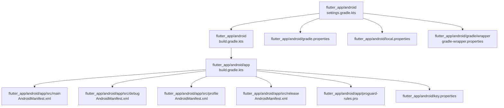
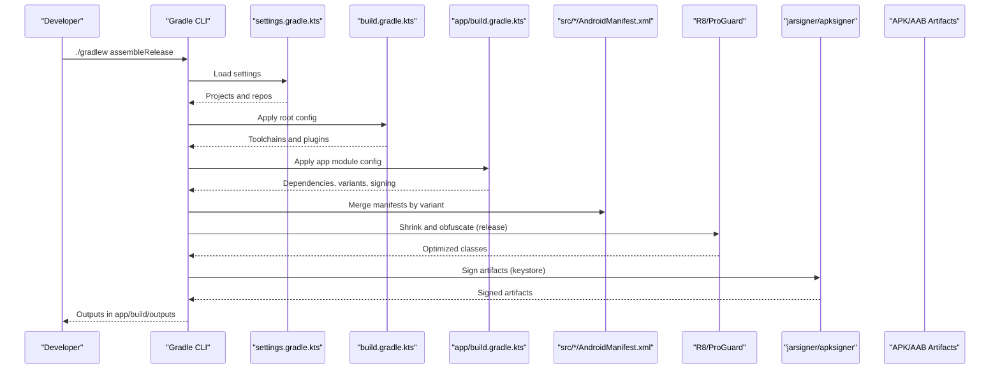
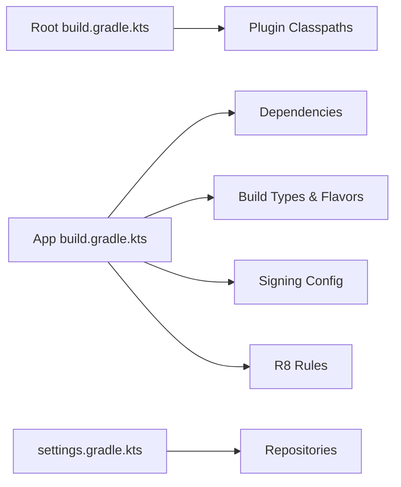

# Build Configuration

<cite>
**Referenced Files in This Document**
- [build.gradle.kts](file://flutter_app/android/build.gradle.kts)
- [app/build.gradle.kts](file://flutter_app/android/app/build.gradle.kts)
- [settings.gradle.kts](file://flutter_app/android/settings.gradle.kts)
- [gradle.properties](file://flutter_app/android/gradle.properties)
- [local.properties](file://flutter_app/android/local.properties)
- [key.properties](file://flutter_app/android/key.properties)
- [key.properties.example](file://flutter_app/android/key.properties.example)
- [proguard-rules.pro](file://flutter_app/android/app/proguard-rules.pro)
- [AndroidManifest.xml](file://flutter_app/android/app/src/main/AndroidManifest.xml)
- [debug/AndroidManifest.xml](file://flutter_app/android/app/src/debug/AndroidManifest.xml)
- [profile/AndroidManifest.xml](file://flutter_app/android/app/src/profile/AndroidManifest.xml)
- [release/AndroidManifest.xml](file://flutter_app/android/app/src/release/AndroidManifest.xml)
- [gradle-wrapper.properties](file://flutter_app/android/gradle/wrapper/gradle-wrapper.properties)
- [build_android_aab.ps1](file://scripts/build_android_aab.ps1)
- [build_android_play_store_aab.ps1](file://scripts/build_android_play_store_aab.ps1)
- [setup_android_release_signing.ps1](file://scripts/setup_android_release_signing.ps1)
</cite>

## Table of Contents
1. [Introduction](#introduction)
2. [Project Structure](#project-structure)
3. [Core Components](#core-components)
4. [Architecture Overview](#architecture-overview)
5. [Detailed Component Analysis](#detailed-component-analysis)
6. [Dependency Analysis](#dependency-analysis)
7. [Performance Considerations](#performance-considerations)
8. [Troubleshooting Guide](#troubleshooting-guide)
9. [Conclusion](#conclusion)
10. [Appendices](#appendices)

## Introduction
This document explains the Android build configuration for Gestão Yahweh Premium. It covers the Gradle build script structure, dependency management, build variants and flavors, signing with key.properties, debug and release builds, ProGuard/R8 rules, local.properties setup, SDK paths, environment variables, build flavor examples, customizing outputs, APK/AAB size optimization, performance tuning, caching strategies, and troubleshooting common issues.

## Project Structure
The Android project is located under flutter_app/android and follows the standard Flutter Android layout:
- Root-level Gradle settings and properties define the build system and global options.
- The app module contains source code, resources, and per-variant manifests (debug, profile, release).
- Signing credentials are externalized via key.properties.
- ProGuard/R8 rules are defined in proguard-rules.pro.
- Wrapper configuration pins the Gradle version used across environments.

**Diagram sources**
- [settings.gradle.kts](file://flutter_app/android/settings.gradle.kts)
- [build.gradle.kts](file://flutter_app/android/build.gradle.kts)
- [app/build.gradle.kts](file://flutter_app/android/app/build.gradle.kts)
- [AndroidManifest.xml](file://flutter_app/android/app/src/main/AndroidManifest.xml)
- [debug/AndroidManifest.xml](file://flutter_app/android/app/src/debug/AndroidManifest.xml)
- [profile/AndroidManifest.xml](file://flutter_app/android/app/src/profile/AndroidManifest.xml)
- [release/AndroidManifest.xml](file://flutter_app/android/app/src/release/AndroidManifest.xml)
- [proguard-rules.pro](file://flutter_app/android/app/proguard-rules.pro)
- [gradle.properties](file://flutter_app/android/gradle.properties)
- [local.properties](file://flutter_app/android/local.properties)
- [gradle-wrapper.properties](file://flutter_app/android/gradle/wrapper/gradle-wrapper.properties)
- [key.properties](file://flutter_app/android/key.properties)

**Section sources**
- [settings.gradle.kts](file://flutter_app/android/settings.gradle.kts)
- [build.gradle.kts](file://flutter_app/android/build.gradle.kts)
- [app/build.gradle.kts](file://flutter_app/android/app/build.gradle.kts)
- [gradle-wrapper.properties](file://flutter_app/android/gradle/wrapper/gradle-wrapper.properties)

## Core Components
- Gradle settings and root build script configure the Android build toolchain, Kotlin version, and shared configurations.
- App module build script defines compileSdk, targetSdk, defaultConfig, signingConfigs, buildTypes, and dependencies.
- Per-variant manifests allow toggling features or permissions for debug, profile, and release builds.
- Signing is configured via key.properties to support both debug and release builds securely.
- ProGuard/R8 rules optimize and obfuscate release builds.
- gradle.properties enables parallelism, daemon, and memory settings for faster builds.
- local.properties points to the Android SDK path.

Key responsibilities:
- Dependency management: centralized versions and plugin declarations.
- Build variants: debug, profile, release; optional productFlavors for different channels.
- Signing: keystore alias, password, and store file resolved from key.properties.
- Optimization: R8 shrinking and obfuscation for release.
- Environment: SDK location and Gradle performance flags.

**Section sources**
- [build.gradle.kts](file://flutter_app/android/build.gradle.kts)
- [app/build.gradle.kts](file://flutter_app/android/app/build.gradle.kts)
- [gradle.properties](file://flutter_app/android/gradle.properties)
- [local.properties](file://flutter_app/android/local.properties)
- [key.properties](file://flutter_app/android/key.properties)
- [proguard-rules.pro](file://flutter_app/android/app/proguard-rules.pro)

## Architecture Overview
The Android build pipeline integrates Flutter’s generated Android module with native Gradle tasks. The flow starts with the wrapper, reads settings and root scripts, then applies the app module configuration, merges manifests, compiles Kotlin/Java, processes resources, runs R8, signs, and produces APK/AAB artifacts.

**Diagram sources**
- [settings.gradle.kts](file://flutter_app/android/settings.gradle.kts)
- [build.gradle.kts](file://flutter_app/android/build.gradle.kts)
- [app/build.gradle.kts](file://flutter_app/android/app/build.gradle.kts)
- [AndroidManifest.xml](file://flutter_app/android/app/src/main/AndroidManifest.xml)
- [debug/AndroidManifest.xml](file://flutter_app/android/app/src/debug/AndroidManifest.xml)
- [profile/AndroidManifest.xml](file://flutter_app/android/app/src/profile/AndroidManifest.xml)
- [release/AndroidManifest.xml](file://flutter_app/android/app/src/release/AndroidManifest.xml)
- [proguard-rules.pro](file://flutter_app/android/app/proguard-rules.pro)

## Detailed Component Analysis

### Gradle Settings and Root Build Script
- settings.gradle.kts declares included modules and repository blocks.
- build.gradle.kts centralizes Android and Kotlin versions, plugin classpaths, and shared tasks.

Best practices:
- Pin versions explicitly for reproducibility.
- Use a single place for shared configurations.

**Section sources**
- [settings.gradle.kts](file://flutter_app/android/settings.gradle.kts)
- [build.gradle.kts](file://flutter_app/android/build.gradle.kts)

### App Module Build Script
- Defines compileSdk, targetSdk, applicationId, versionCode, versionName.
- Configures signingConfigs using key.properties.
- Declares buildTypes (debug, release) and optional productFlavors.
- Manages dependencies and resource processing.

Tips:
- Keep sensitive data out of version control via key.properties.
- Use buildType-specific overrides for logging or feature flags.

**Section sources**
- [app/build.gradle.kts](file://flutter_app/android/app/build.gradle.kts)

### Build Variants and Flavors
- Variants: debug, profile, release each have distinct behavior and manifest merging.
- Flavors: can be added to create multiple app editions (e.g., free vs premium).

Example flavor configuration pattern:
- Define flavor dimensions and specific flavors in the app module.
- Override applicationIdSuffix, versionNameSuffix, and resources per flavor.

**Section sources**
- [app/build.gradle.kts](file://flutter_app/android/app/build.gradle.kts)
- [AndroidManifest.xml](file://flutter_app/android/app/src/main/AndroidManifest.xml)
- [debug/AndroidManifest.xml](file://flutter_app/android/app/src/debug/AndroidManifest.xml)
- [profile/AndroidManifest.xml](file://flutter_app/android/app/src/profile/AndroidManifest.xml)
- [release/AndroidManifest.xml](file://flutter_app/android/app/src/release/AndroidManifest.xml)

### Signing Configuration with key.properties
- key.properties holds keystore path, alias, and passwords.
- The app module loads these values to sign debug/release builds.
- key.properties.example provides a template for developers.

Security guidance:
- Never commit real secrets; use key.properties.example as a reference.
- In CI, inject secrets via environment variables or secure secret stores.

**Section sources**
- [key.properties](file://flutter_app/android/key.properties)
- [key.properties.example](file://flutter_app/android/key.properties.example)
- [app/build.gradle.kts](file://flutter_app/android/app/build.gradle.kts)

### Debug and Release Builds
- Debug builds enable verbose logging and disable optimizations.
- Release builds enable R8 shrinking/obfuscation and signing.
- Profile builds are intended for performance profiling.

Customization:
- Add buildConfigField or resValue entries per build type.
- Toggle features via manifest placeholders or resource overlays.

**Section sources**
- [app/build.gradle.kts](file://flutter_app/android/app/build.gradle.kts)
- [debug/AndroidManifest.xml](file://flutter_app/android/app/src/debug/AndroidManifest.xml)
- [profile/AndroidManifest.xml](file://flutter_app/android/app/src/profile/AndroidManifest.xml)
- [release/AndroidManifest.xml](file://flutter_app/android/app/src/release/AndroidManifest.xml)

### ProGuard/R8 Rules
- proguard-rules.pro contains keep rules and optimizations.
- For release builds, ensure necessary classes and Firebase integrations are preserved.

Guidelines:
- Start with minimal keep rules and add only what is required.
- Test thoroughly after enabling R8 to avoid runtime crashes.

**Section sources**
- [proguard-rules.pro](file://flutter_app/android/app/proguard-rules.pro)
- [app/build.gradle.kts](file://flutter_app/android/app/build.gradle.kts)

### Local Properties and SDK Paths
- local.properties specifies sdk.dir pointing to the Android SDK installation.
- Ensure the path matches your machine or CI environment.

Common pitfalls:
- Incorrect sdk.dir leads to “SDK not found” errors.
- On CI, set ANDROID_HOME or ANDROID_SDK_ROOT instead of local.properties.

**Section sources**
- [local.properties](file://flutter_app/android/local.properties)

### Environment Variables and Gradle Properties
- gradle.properties controls Gradle daemon, parallelism, and memory allocation.
- Recommended flags include org.gradle.parallel, org.gradle.daemon=true, and JVM heap sizing.

Performance tips:
- Increase org.gradle.jvmargs for large projects.
- Enable configuration cache if compatible with your setup.

**Section sources**
- [gradle.properties](file://flutter_app/android/gradle.properties)

### Wrapper and Toolchain
- gradle-wrapper.properties pins the Gradle version for consistent builds.
- Ensure the wrapper is present and executable on all machines.

**Section sources**
- [gradle-wrapper.properties](file://flutter_app/android/gradle/wrapper/gradle-wrapper.properties)

### Build Scripts and Automation
- scripts/build_android_aab.ps1 and scripts/build_android_play_store_aab.ps1 automate AAB creation and Play Store publishing steps.
- scripts/setup_android_release_signing.ps1 prepares signing keys and validates configuration.

Usage:
- Run PowerShell scripts from the repository root to streamline builds.
- Integrate into CI pipelines for automated releases.

**Section sources**
- [build_android_aab.ps1](file://scripts/build_android_aab.ps1)
- [build_android_play_store_aab.ps1](file://scripts/build_android_play_store_aab.ps1)
- [setup_android_release_signing.ps1](file://scripts/setup_android_release_signing.ps1)

## Dependency Analysis
Dependencies are managed centrally in the root and app module Gradle files. Plugins and third-party libraries are declared with explicit versions to ensure deterministic builds.

**Diagram sources**
- [build.gradle.kts](file://flutter_app/android/build.gradle.kts)
- [app/build.gradle.kts](file://flutter_app/android/app/build.gradle.kts)
- [settings.gradle.kts](file://flutter_app/android/settings.gradle.kts)

**Section sources**
- [build.gradle.kts](file://flutter_app/android/build.gradle.kts)
- [app/build.gradle.kts](file://flutter_app/android/app/build.gradle.kts)
- [settings.gradle.kts](file://flutter_app/android/settings.gradle.kts)

## Performance Considerations
- Enable parallel execution and daemon in gradle.properties.
- Increase JVM heap size for larger builds.
- Use incremental builds and clean selectively when needed.
- Avoid unnecessary resource transformations in debug builds.
- Keep dependencies up-to-date to benefit from compiler improvements.

[No sources needed since this section provides general guidance]

## Troubleshooting Guide
Common issues and resolutions:
- SDK not found: Verify sdk.dir in local.properties or ANDROID_HOME/ANDROID_SDK_ROOT in CI.
- Signing failures: Confirm keystore path, alias, and passwords in key.properties; validate fingerprints.
- R8 crashes: Temporarily disable minify to isolate problematic code; add targeted keep rules.
- Slow builds: Enable Gradle daemon, parallelism, and consider configuration cache; prune unused dependencies.
- Manifest merge conflicts: Inspect merged manifest logs; adjust per-variant manifests.

Useful commands:
- ./gradlew clean assembleDebug
- ./gradlew :app:assembleRelease --info
- ./gradlew :app:lintVitalRelease

**Section sources**
- [local.properties](file://flutter_app/android/local.properties)
- [key.properties](file://flutter_app/android/key.properties)
- [proguard-rules.pro](file://flutter_app/android/app/proguard-rules.pro)
- [gradle.properties](file://flutter_app/android/gradle.properties)

## Conclusion
The Android build configuration for Gestão Yahweh Premium is structured around standard Gradle conventions with clear separation of concerns: settings, root build script, app module, per-variant manifests, signing via key.properties, and R8 rules. By following the guidelines here—secure signing, optimized release builds, careful dependency management, and performance tuning—you can maintain reliable, fast, and reproducible builds across development and CI environments.

[No sources needed since this section summarizes without analyzing specific files]

## Appendices

### Example: Adding Build Flavors
- Define flavor dimensions and flavors in the app module build script.
- Override applicationIdSuffix, versionNameSuffix, and resources per flavor.
- Build specific combinations using assemble<Flavor><BuildType>.

**Section sources**
- [app/build.gradle.kts](file://flutter_app/android/app/build.gradle.kts)

### Example: Customizing Build Outputs
- Configure output directories and naming patterns in the app module.
- Generate separate artifacts for QA, staging, and production.

**Section sources**
- [app/build.gradle.kts](file://flutter_app/android/app/build.gradle.kts)

### Example: Optimizing APK/AAB Size
- Enable R8 shrinking and obfuscation for release.
- Remove unused resources and libraries.
- Use vector drawables and compress images.

**Section sources**
- [proguard-rules.pro](file://flutter_app/android/app/proguard-rules.pro)
- [app/build.gradle.kts](file://flutter_app/android/app/build.gradle.kts)

### Example: CI Integration
- Use scripts/build_android_aab.ps1 and scripts/build_android_play_store_aab.ps1 in CI workflows.
- Inject secrets securely and validate signing before upload.

**Section sources**
- [build_android_aab.ps1](file://scripts/build_android_aab.ps1)
- [build_android_play_store_aab.ps1](file://scripts/build_android_play_store_aab.ps1)