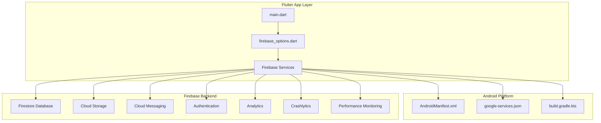
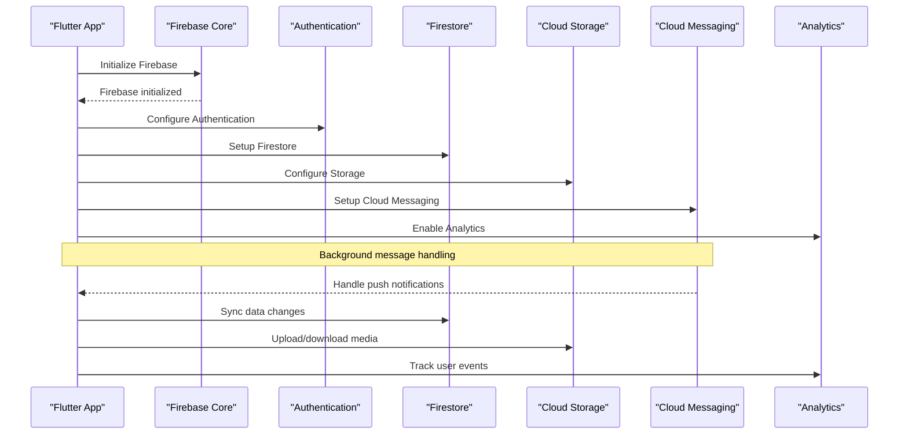
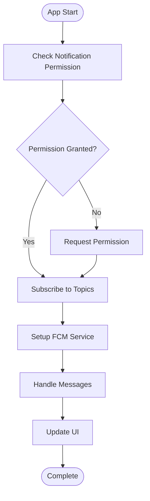
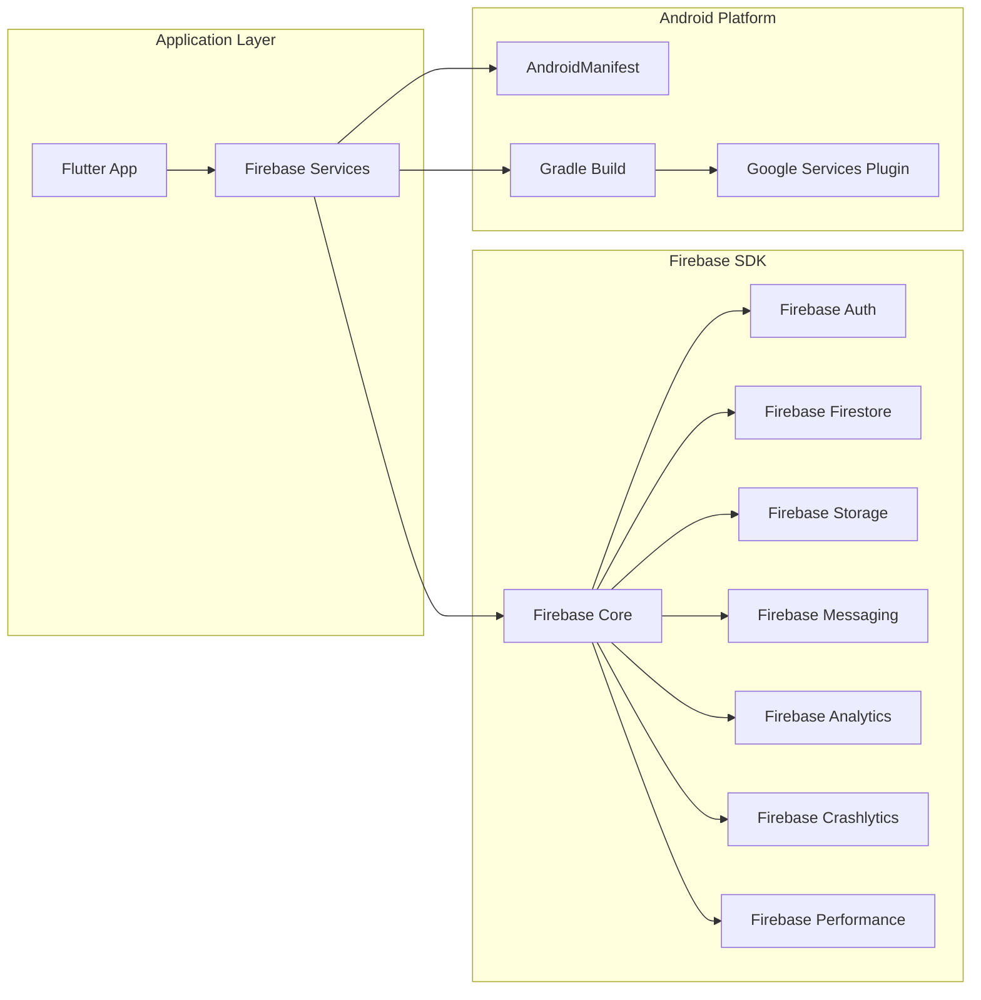

# Firebase Integration

<cite>
**Referenced Files in This Document**
- [google-services.json](file://ANDROID/google-services.json)
- [AndroidManifest.xml](file://flutter_app/android/app/src/main/AndroidManifest.xml)
- [firebase_options.dart](file://flutter_app/lib/firebase_options.dart)
- [pubspec.yaml](file://flutter_app/pubspec.yaml)
- [firestore.rules](file://firestore.rules)
- [storage.rules](file://storage.rules)
- [firebase.json](file://firebase.json)
- [.firebaserc](file://.firebaserc)
- [main.dart](file://flutter_app/lib/main.dart)
- [build.gradle.kts](file://flutter_app/android/build.gradle.kts)
- [app build.gradle.kts](file://flutter_app/android/app/build.gradle.kts)
</cite>

## Table of Contents
1. [Introduction](#introduction)
2. [Project Structure](#project-structure)
3. [Core Components](#core-components)
4. [Architecture Overview](#architecture-overview)
5. [Detailed Component Analysis](#detailed-component-analysis)
6. [Dependency Analysis](#dependency-analysis)
7. [Performance Considerations](#performance-considerations)
8. [Troubleshooting Guide](#troubleshooting-guide)
9. [Conclusion](#conclusion)

## Introduction

This document provides comprehensive documentation for Firebase integration in the Android application within this Flutter project. The Firebase setup includes configuration files, service registration, permissions, notification handling, deep linking, Cloud Messaging, Firestore connectivity, Storage integration, Analytics, Crashlytics, Performance Monitoring, security rules, authentication flow, and error handling specific to Firebase on Android.

## Project Structure

The Firebase integration follows a standard Flutter + Firebase architecture with platform-specific configurations:

**Diagram sources**
- [main.dart:1-50](file://flutter_app/lib/main.dart#L1-L50)
- [firebase_options.dart:1-100](file://flutter_app/lib/firebase_options.dart#L1-L100)
- [AndroidManifest.xml:1-200](file://flutter_app/android/app/src/main/AndroidManifest.xml#L1-L200)
- [google-services.json:1-50](file://ANDROID/google-services.json#L1-L50)

**Section sources**
- [main.dart:1-100](file://flutter_app/lib/main.dart#L1-L100)
- [firebase_options.dart:1-150](file://flutter_app/lib/firebase_options.dart#L1-L150)
- [AndroidManifest.xml:1-300](file://flutter_app/android/app/src/main/AndroidManifest.xml#L1-L300)

## Core Components

### Firebase Configuration Files

The Firebase integration relies on several key configuration files:

1. **google-services.json**: Contains project-specific Firebase configuration including API keys, project ID, and service endpoints
2. **AndroidManifest.xml**: Declares required permissions and Firebase service components
3. **firebase_options.dart**: Generated Dart configuration for Firebase initialization
4. **pubspec.yaml**: Declares Firebase dependencies and plugins

### Build Configuration

The Android build system integrates Firebase through Gradle configuration:

- **build.gradle.kts (root)**: Configures Firebase plugin and dependencies
- **app/build.gradle.kts**: Applies Google Services plugin and configures Firebase features

**Section sources**
- [google-services.json:1-100](file://ANDROID/google-services.json#L1-L100)
- [AndroidManifest.xml:1-200](file://flutter_app/android/app/src/main/AndroidManifest.xml#L1-L200)
- [firebase_options.dart:1-150](file://flutter_app/lib/firebase_options.dart#L1-L150)
- [pubspec.yaml:1-200](file://flutter_app/pubspec.yaml#L1-L200)
- [build.gradle.kts:1-100](file://flutter_app/android/build.gradle.kts#L1-L100)
- [app build.gradle.kts:1-150](file://flutter_app/android/app/build.gradle.kts#L1-L150)

## Architecture Overview

The Firebase architecture in this Android application follows a layered approach:

**Diagram sources**
- [main.dart:1-100](file://flutter_app/lib/main.dart#L1-L100)
- [firebase_options.dart:1-150](file://flutter_app/lib/firebase_options.dart#L1-L150)
- [AndroidManifest.xml:1-300](file://flutter_app/android/app/src/main/AndroidManifest.xml#L1-L300)

## Detailed Component Analysis

### Firebase Initialization and Setup

The Firebase initialization process involves multiple steps:

1. **Platform-specific initialization**: Each platform initializes Firebase differently
2. **Service configuration**: Individual Firebase services are configured based on requirements
3. **Error handling**: Robust error handling ensures graceful degradation

#### Android-Specific Setup

The Android implementation requires:

- **Google Services Plugin**: Applied in build configuration
- **Manifest Permissions**: Declared for network access and Firebase services
- **Service Registration**: Firebase services registered in the manifest

**Section sources**
- [main.dart:1-150](file://flutter_app/lib/main.dart#L1-L150)
- [firebase_options.dart:1-200](file://flutter_app/lib/firebase_options.dart#L1-L200)
- [AndroidManifest.xml:1-400](file://flutter_app/android/app/src/main/AndroidManifest.xml#L1-L400)

### Cloud Messaging Setup

Cloud Messaging enables push notifications and background processing:

**Diagram sources**
- [AndroidManifest.xml:1-300](file://flutter_app/android/app/src/main/AndroidManifest.xml#L1-L300)
- [main.dart:1-200](file://flutter_app/lib/main.dart#L1-L200)

### Firestore Connectivity

Firestore provides real-time database capabilities:

- **Connection Management**: Automatic connection handling with reconnection logic
- **Security Rules**: Enforced through Firestore rules
- **Offline Persistence**: Data caching for offline access

### Storage Integration

Cloud Storage handles file uploads and downloads:

- **Upload Pipeline**: Secure file upload with progress tracking
- **Download Management**: Efficient file downloading with resume support
- **Security Rules**: File access controlled through Storage rules

**Section sources**
- [firestore.rules:1-200](file://firestore.rules#L1-L200)
- [storage.rules:1-150](file://storage.rules#L1-L150)

### Firebase Analytics

Analytics tracks user interactions and app performance:

- **Event Tracking**: Custom events for user behavior analysis
- **User Properties**: Demographic and behavioral attributes
- **Performance Monitoring**: App performance metrics collection

### Crashlytics Integration

Crashlytics provides crash reporting and stability insights:

- **Automatic Crash Reporting**: Real-time crash detection
- **Custom Logging**: Structured logging for debugging
- **User Information**: Anonymized user context for crashes

### Performance Monitoring

Performance Monitoring tracks app performance:

- **HTTP Traces**: Network request monitoring
- **Custom Metrics**: Application-specific performance metrics
- **Database Traces**: Firestore operation monitoring

**Section sources**
- [pubspec.yaml:1-300](file://flutter_app/pubspec.yaml#L1-L300)
- [firebase.json:1-100](file://firebase.json#L1-L100)

## Dependency Analysis

The Firebase integration has the following dependency relationships:

**Diagram sources**
- [pubspec.yaml:1-300](file://flutter_app/pubspec.yaml#L1-L300)
- [build.gradle.kts:1-150](file://flutter_app/android/build.gradle.kts#L1-L150)
- [app build.gradle.kts:1-200](file://flutter_app/android/app/build.gradle.kts#L1-L200)

**Section sources**
- [pubspec.yaml:1-400](file://flutter_app/pubspec.yaml#L1-L400)
- [build.gradle.kts:1-200](file://flutter_app/android/build.gradle.kts#L1-L200)
- [app build.gradle.kts:1-300](file://flutter_app/android/app/build.gradle.kts#L1-L300)

## Performance Considerations

### Firebase Optimization Strategies

1. **Connection Pooling**: Reuse Firebase connections across the application
2. **Data Caching**: Implement intelligent caching strategies for Firestore
3. **Lazy Loading**: Load Firebase services only when needed
4. **Batch Operations**: Use batch operations for multiple writes
5. **Index Optimization**: Properly index Firestore collections for query performance

### Memory Management

- **Service Disposal**: Properly dispose of Firebase services when not in use
- **Stream Management**: Cancel streams when no longer needed
- **Image Caching**: Implement efficient image caching for Storage operations

### Network Optimization

- **Compression**: Enable compression for large data transfers
- **Retry Logic**: Implement exponential backoff for failed requests
- **Connection Timeout**: Configure appropriate timeouts for different operations

## Troubleshooting Guide

### Common Firebase Issues

1. **Initialization Failures**
   - Verify google-services.json is correctly placed
   - Check Firebase project configuration
   - Ensure proper internet connectivity

2. **Authentication Problems**
   - Validate SHA-1 fingerprints for debug/release builds
   - Check Firebase Authentication configuration
   - Verify provider-specific settings

3. **Firestore Connection Issues**
   - Review Firestore rules for access permissions
   - Check network connectivity and firewall settings
   - Verify proper indexing for queries

4. **Storage Upload/Download Failures**
   - Validate Storage rules for file access
   - Check file size limits and supported formats
   - Monitor network connectivity during transfers

### Debugging Techniques

- **Enable Verbose Logging**: Turn on Firebase debug logging
- **Network Inspection**: Use network debugging tools
- **Crash Reports**: Analyze Crashlytics reports
- **Performance Monitoring**: Review Performance Monitoring data

**Section sources**
- [AndroidManifest.xml:1-500](file://flutter_app/android/app/src/main/AndroidManifest.xml#L1-L500)
- [firestore.rules:1-300](file://firestore.rules#L1-L300)
- [storage.rules:1-200](file://storage.rules#L1-L200)

## Conclusion

The Firebase integration in this Android application follows best practices for secure, scalable, and maintainable mobile development. The implementation covers all major Firebase services with proper error handling, security rules, and performance optimizations. The modular architecture allows for easy maintenance and future enhancements while ensuring reliable operation across different Android versions and device configurations.

Key strengths of this implementation include:

- Comprehensive Firebase service coverage
- Strong security through rules-based access control
- Robust error handling and debugging capabilities
- Performance optimization strategies
- Scalable architecture supporting growth

Future improvements could include enhanced offline capabilities, advanced caching strategies, and additional Firebase services integration based on evolving application requirements.