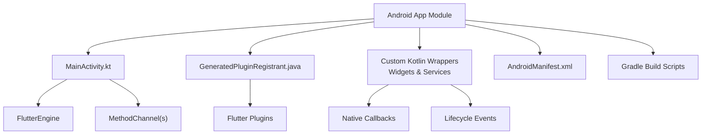
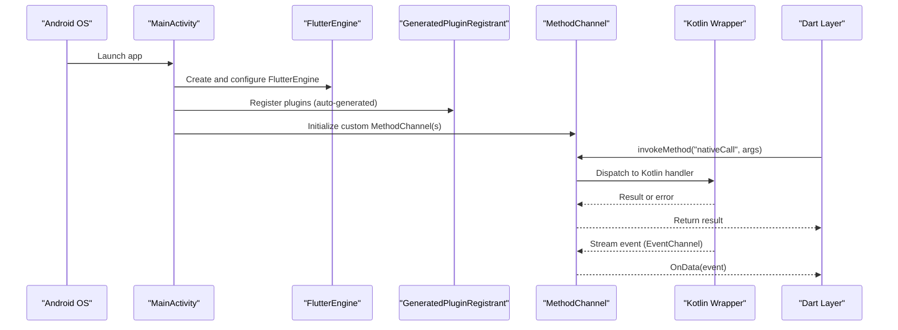
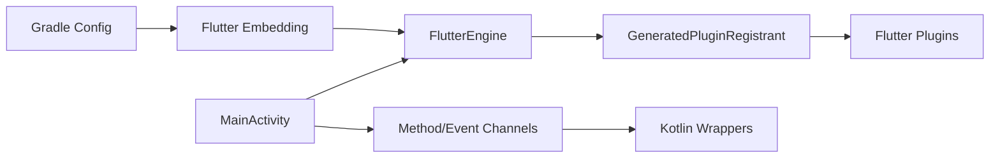

# Native Code Integration

<cite>
**Referenced Files in This Document**
- [MainActivity.kt](file://flutter_app/android/app/src/main/kotlin/com/example/gestao_yahweh/MainActivity.kt)
- [GeneratedPluginRegistrant.java](file://flutter_app/android/app/src/main/java/io/flutter/plugins/GeneratedPluginRegistrant.java)
- [build.gradle.kts](file://flutter_app/android/build.gradle.kts)
- [settings.gradle.kts](file://flutter_app/android/settings.gradle.kts)
- [AndroidManifest.xml](file://flutter_app/android/app/src/main/AndroidManifest.xml)
- [GestaoYahwehWidgetProvider.kt](file://flutter_app/android/app/src/main/kotlin/com/example/gestao_yahweh/gestaoyahweh/app/GestaoYahwehWidgetProvider.kt)
- [GestaoYahwehWidgetService.kt](file://flutter_app/android/app/src/main/kotlin/com/example/gestao_yahweh/gestaoyahweh/app/GestaoYahwehWidgetService.kt)
</cite>

## Table of Contents
1. [Introduction](#introduction)
2. [Project Structure](#project-structure)
3. [Core Components](#core-components)
4. [Architecture Overview](#architecture-overview)
5. [Detailed Component Analysis](#detailed-component-analysis)
6. [Dependency Analysis](#dependency-analysis)
7. [Performance Considerations](#performance considerations)
8. [Troubleshooting Guide](#troubleshooting-guide)
9. [Conclusion](#conclusion)

## Introduction

This document explains how Gestão Yahweh Premium integrates Flutter with Android native code. It covers the MainActivity implementation, FlutterEngine configuration, plugin registration, Kotlin wrapper classes for native functionality, method channel implementations, event handling, and the GeneratedPluginRegistrant class that wires Flutter plugins into the Android app. It also provides practical examples for creating custom platform channels, handling native callbacks, managing lifecycle events, debugging techniques, and common integration patterns used in this project.

## Project Structure

The Android side of the Flutter app lives under flutter_app/android. The key directories and files relevant to native integration include:

- App module source code (Kotlin and Java):
  - MainActivity entry point
  - GeneratedPluginRegistrant for automatic plugin wiring
  - Custom Kotlin wrappers and services (e.g., widgets and background tasks)
- Build configuration:
  - Gradle build scripts for dependencies and compilation
- Manifest:
  - AndroidManifest.xml declares activities, services, permissions, and intent filters

[No sources needed since this diagram shows conceptual workflow, not actual code structure]

## Core Components

- MainActivity: Initializes FlutterEngine, configures the Dart entrypoint, registers any custom MethodChannels, and sets up lifecycle hooks.
- GeneratedPluginRegistrant: Automatically generated by Flutter tooling to register all enabled Flutter plugins with the FlutterEngine at startup.
- Kotlin Wrapper Classes: Provide idiomatic Kotlin APIs over native features and expose them via MethodChannels or direct calls from MainActivity.
- Method Channels: Enable synchronous and asynchronous communication between Dart and Kotlin/Java.
- Event Streams: Use EventChannel to stream events from Android to Dart (e.g., sensor updates, background task progress).
- Lifecycle Management: Bridge Android Activity/Service lifecycle to Dart state where necessary.

Key responsibilities:
- Bootstrap Flutter runtime and ensure plugins are available.
- Expose native capabilities through typed channels.
- Handle Android-specific behaviors (permissions, intents, notifications, widgets).
- Maintain performance by offloading heavy work to native threads and marshaling results back to the UI thread when required.

**Section sources**
- [MainActivity.kt](file://flutter_app/android/app/src/main/kotlin/com/example/gestao_yahweh/MainActivity.kt)
- [GeneratedPluginRegistrant.java](file://flutter_app/android/app/src/main/java/io/flutter/plugins/GeneratedPluginRegistrant.java)
- [AndroidManifest.xml](file://flutter_app/android/app/src/main/AndroidManifest.xml)

## Architecture Overview

At runtime, the Android app starts MainActivity, which creates a FlutterEngine and binds it to the Activity. Flutter plugins are registered automatically via GeneratedPluginRegistrant. Custom Kotlin code exposes native methods through MethodChannels and streams events via EventChannels. Dart code invokes these channels to call native logic and receive responses or event streams.

**Diagram sources**
- [MainActivity.kt](file://flutter_app/android/app/src/main/kotlin/com/example/gestao_yahweh/MainActivity.kt)
- [GeneratedPluginRegistrant.java](file://flutter_app/android/app/src/main/java/io/flutter/plugins/GeneratedPluginRegistrant.java)

## Detailed Component Analysis

### MainActivity Implementation

Responsibilities:
- Create FlutterEngine with appropriate configuration (dart entrypoint, cached engine if applicable).
- Set up any custom MethodChannels and EventChannels.
- Forward lifecycle events (onResume, onPause, onDestroy) to Flutter as needed.
- Optionally handle incoming Intents and push data to Dart via channels.

Common patterns:
- Use a single FlutterEngine instance per process to avoid cold-start overhead.
- Ensure channel names match those used in Dart.
- Perform long-running operations on background threads and marshal results back to the main thread for UI updates.

Best practices:
- Keep MainActivity thin; delegate complex logic to Kotlin services or managers.
- Centralize channel initialization to avoid duplication.
- Guard against nulls and missing permissions before invoking native APIs.

**Section sources**
- [MainActivity.kt](file://flutter_app/android/app/src/main/kotlin/com/example/gestao_yahweh/MainActivity.kt)

### FlutterEngine Configuration

Configuration points:
- Dart entrypoint selection (main.dart by default).
- Cached engine reuse across Activities.
- Initialization flags for enabling/disabling features.
- Optional pre-warming of the engine during app startup.

Considerations:
- Avoid re-initializing the engine frequently; prefer caching.
- Be mindful of memory usage when keeping an engine alive.
- Ensure correct resource cleanup on Activity destruction.

**Section sources**
- [MainActivity.kt](file://flutter_app/android/app/src/main/kotlin/com/example/gestao_yahweh/MainActivity.kt)

### Plugin Registration (GeneratedPluginRegistrant)

What it does:
- Registers all Flutter plugins declared in pubspec.yaml with the FlutterEngine.
- Ensures platform-specific initializations run before Dart code executes.

How it works:
- Generated by the Flutter toolchain during build.
- Invoked automatically by the Flutter embedding when creating the engine.

Implications:
- Adding/removing plugins changes the generated code; rebuild to update.
- Do not edit GeneratedPluginRegistrant manually.

**Section sources**
- [GeneratedPluginRegistrant.java](file://flutter_app/android/app/src/main/java/io/flutter/plugins/GeneratedPluginRegistrant.java)

### Kotlin Wrapper Classes for Native Functionality

Purpose:
- Encapsulate Android SDK calls behind clean Kotlin APIs.
- Expose functionality to Dart via MethodChannels or direct calls from MainActivity.
- Manage permissions, threading, and error propagation.

Typical structure:
- A manager class that holds references to Android components.
- Channel handlers that parse arguments, perform work, and return results.
- Event emitters for streaming data back to Dart.

Examples in this project:
- Widget providers and services that bridge Android widget lifecycles and Flutter states.

**Section sources**
- [GestaoYahwehWidgetProvider.kt](file://flutter_app/android/app/src/main/kotlin/com/example/gestao_yahweh/gestaoyahweh/app/GestaoYahwehWidgetProvider.kt)
- [GestaoYahwehWidgetService.kt](file://flutter_app/android/app/src/main/kotlin/com/example/gestao_yahweh/gestaoyahweh/app/GestaoYahwehWidgetService.kt)

### Method Channel Implementations

Patterns:
- Define a unique channel name in both Dart and Kotlin.
- In Kotlin, set a MethodCallHandler that switches on method names and handles each case.
- Parse arguments safely and return either a result or throw an exception.
- For async operations, use coroutines or background threads and complete the Future on the main thread.

Error handling:
- Use consistent error codes and messages.
- Wrap exceptions to avoid crashes and provide meaningful diagnostics.

Threading:
- Offload CPU-bound work to background threads.
- Post results back to the platform thread for UI-related updates.

**Section sources**
- [MainActivity.kt](file://flutter_app/android/app/src/main/kotlin/com/example/gestao_yahweh/MainActivity.kt)

### Event Handling (EventChannel)

Use cases:
- Streaming sensor data, location updates, or background task progress.
- Pushing periodic updates from native services to Dart.

Implementation tips:
- Create an EventChannel and set an StreamHandler.
- Emit events via sink.add() and close the stream when done.
- Ensure proper cleanup to avoid leaks.

**Section sources**
- [GestaoYahwehWidgetService.kt](file://flutter_app/android/app/src/main/kotlin/com/example/gestao_yahweh/gestaoyahweh/app/GestaoYahwehWidgetService.kt)

### GeneratedPluginRegistrant Class and Flutter Plugins Integration

Integration flow:
- Flutter tool generates GeneratedPluginRegistrant based on active plugins.
- At runtime, the embedding calls the registrar to initialize each plugin.
- Plugins may register channels, observers, or background tasks.

Operational notes:
- Rebuild after changing plugins to regenerate the registrant.
- If a plugin requires Android setup, ensure its manifest entries and dependencies are present.

**Section sources**
- [GeneratedPluginRegistrant.java](file://flutter_app/android/app/src/main/java/io/flutter/plugins/GeneratedPluginRegistrant.java)

### Creating Custom Platform Channels

Steps:
- Choose a unique channel name.
- In Dart, instantiate MethodChannel or EventChannel with that name.
- In Kotlin, register a handler for the same channel name.
- Implement argument parsing, validation, and response formatting.

Example pattern:
- Dart calls a method like "fetchData".
- Kotlin handler validates input, performs network or DB operation, and returns JSON or structured data.
- Errors are propagated back to Dart with clear messages.

**Section sources**
- [MainActivity.kt](file://flutter_app/android/app/src/main/kotlin/com/example/gestao_yahweh/MainActivity.kt)

### Handling Native Callbacks

Approaches:
- Use MethodChannel.Result for one-off responses.
- Use EventChannel.StreamHandler for continuous events.
- For inter-Activity or Service-to-Dart communication, maintain a reference to the engine’s binary messenger and send messages directly.

Best practices:
- Always check thread context before touching UI.
- Debounce or throttle high-frequency events.
- Log important transitions for debugging.

**Section sources**
- [GestaoYahwehWidgetService.kt](file://flutter_app/android/app/src/main/kotlin/com/example/gestao_yahweh/gestaoyahweh/app/GestaoYahwehWidgetService.kt)

### Managing Lifecycle Events

Scenarios:
- Pause/resume background tasks when the Activity is not visible.
- Persist state on destroy and restore on restart.
- Handle configuration changes without losing ongoing operations.

Implementation:
- Override Activity lifecycle methods.
- Notify Dart via channels or shared preferences.
- Coordinate with Flutter’s engine lifecycle to avoid deadlocks.

**Section sources**
- [MainActivity.kt](file://flutter_app/android/app/src/main/kotlin/com/example/gestao_yahweh/MainActivity.kt)

## Dependency Analysis

Build-time and runtime dependencies:
- Gradle scripts define Android SDK version, Kotlin version, and Flutter embedding dependency.
- GeneratedPluginRegistrant depends on all plugins listed in pubspec.yaml.
- Custom Kotlin modules depend on Android SDK and Flutter embedding APIs.

Potential coupling:
- Tight coupling between MainActivity and custom channels increases maintenance cost.
- Overuse of global engine references can cause memory leaks.

Mitigations:
- Keep channel logic modular and testable.
- Use dependency injection for heavy services.
- Prefer interfaces to abstract platform behavior.

**Diagram sources**
- [build.gradle.kts](file://flutter_app/android/build.gradle.kts)
- [settings.gradle.kts](file://flutter_app/android/settings.gradle.kts)
- [MainActivity.kt](file://flutter_app/android/app/src/main/kotlin/com/example/gestao_yahweh/MainActivity.kt)
- [GeneratedPluginRegistrant.java](file://flutter_app/android/app/src/main/java/io/flutter/plugins/GeneratedPluginRegistrant.java)

**Section sources**
- [build.gradle.kts](file://flutter_app/android/build.gradle.kts)
- [settings.gradle.kts](file://flutter_app/android/settings.gradle.kts)

## Performance Considerations

- Engine caching: Reuse FlutterEngine to reduce cold start time.
- Threading: Run heavy computations off the main thread; marshal results back carefully.
- Channel payload size: Minimize data transferred over channels; consider serialization strategies.
- Event frequency: Throttle or batch events to avoid overwhelming Dart.
- Memory management: Avoid holding long-lived references to contexts or engines outside their scope.

[No sources needed since this section provides general guidance]

## Troubleshooting Guide

Common issues and remedies:
- Missing plugin registration: Ensure plugins are added to pubspec.yaml and rebuild to regenerate GeneratedPluginRegistrant.
- Channel mismatch: Verify exact channel names and method signatures in Dart and Kotlin.
- Threading errors: Confirm that UI updates occur on the platform thread; use runOnUiThread or equivalent.
- Permission denied: Check AndroidManifest.xml and runtime permission flows before calling sensitive APIs.
- Lifecycle crashes: Guard against null references and ensure proper cleanup in onDestroy/onStop.

Debugging techniques:
- Use Android Studio logs and logcat filters for your package name.
- Add structured logging around channel invocations and handlers.
- Use Flutter DevTools to inspect Dart-side channel calls and errors.
- Validate JSON payloads and types on both sides.

**Section sources**
- [AndroidManifest.xml](file://flutter_app/android/app/src/main/AndroidManifest.xml)
- [MainActivity.kt](file://flutter_app/android/app/src/main/kotlin/com/example/gestao_yahweh/MainActivity.kt)

## Conclusion

Gestão Yahweh Premium follows established Flutter-Android integration patterns: a thin MainActivity bootstraps FlutterEngine, GeneratedPluginRegistrant wires plugins, and Kotlin wrappers expose native capabilities through well-defined channels. By adhering to best practices for threading, lifecycle management, and error handling, the app achieves reliable cross-platform functionality while leveraging Android’s strengths. Continuous improvements should focus on modularity, performance profiling, and robust testing of native integrations.

[No sources needed since this section summarizes without analyzing specific files]