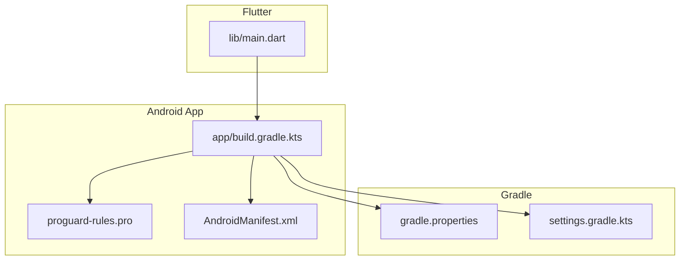
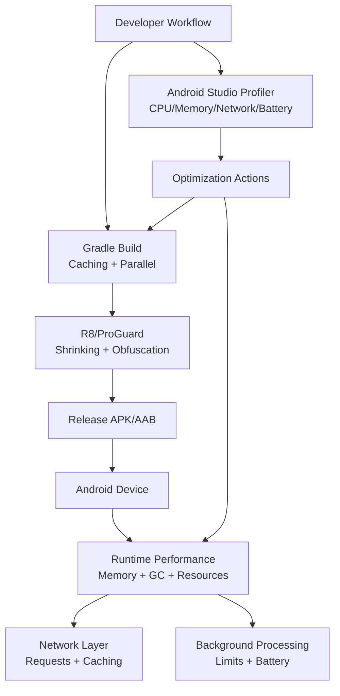
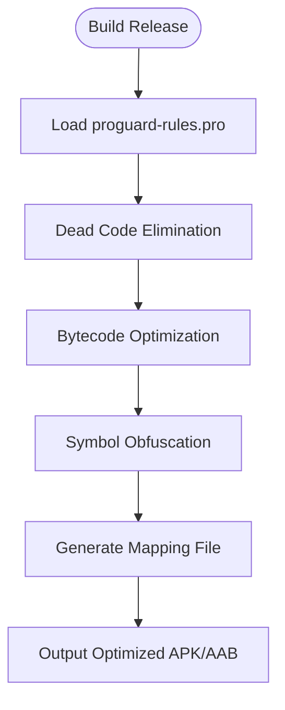
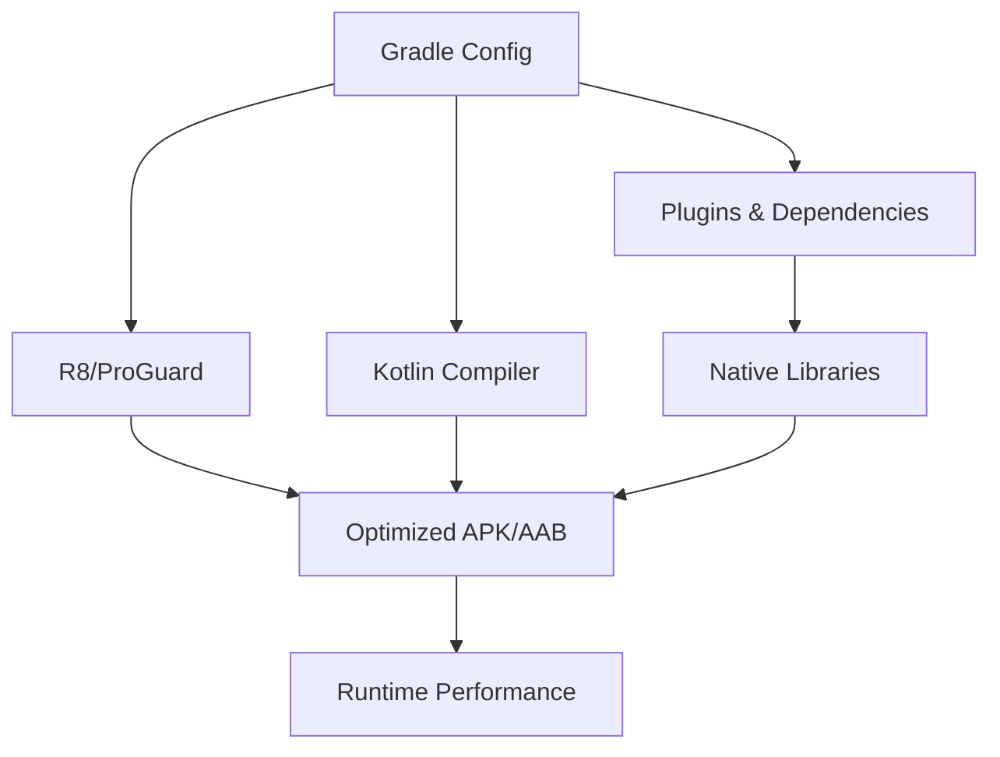

# Performance Optimization

<cite>
**Referenced Files in This Document**
- [build.gradle.kts](file://flutter_app/android/app/build.gradle.kts)
- [proguard-rules.pro](file://flutter_app/android/app/proguard-rules.pro)
- [gradle.properties](file://flutter_app/android/gradle.properties)
- [settings.gradle.kts](file://flutter_app/android/settings.gradle.kts)
- [AndroidManifest.xml](file://flutter_app/android/app/src/main/AndroidManifest.xml)
- [main.dart](file://flutter_app/lib/main.dart)
- [ARCHITECTURE_PERFORMANCE_MULTI_PLATFORM.md](file://docs/ARCHITECTURE_PERFORMANCE_MULTI_PLATFORM.md)
- [PADRONIZACAO_PERFORMANCE_CONTROLE_TOTAL.md](file://docs/PADRONIZACAO_PERFORMANCE_CONTROLE_TOTAL.md)
- [PERFORMANCE_REPORT.md](file://PERFORMANCE_REPORT.md)
</cite>

## Table of Contents
1. [Introduction](#introduction)
2. [Project Structure](#project-structure)
3. [Core Components](#core-components)
4. [Architecture Overview](#architecture-overview)
5. [Detailed Component Analysis](#detailed-component-analysis)
6. [Dependency Analysis](#dependency-analysis)
7. [Performance Considerations](#performance-considerations)
8. [Troubleshooting Guide](#troubleshooting-guide)
9. [Conclusion](#conclusion)

## Introduction
This document provides a comprehensive guide to performance optimization for the Android implementation of Gestão Yahweh Premium. It covers ProGuard/R8 configuration, memory management and garbage collection tuning, resource optimization, build optimizations (incremental compilation, parallel execution, caching), profiling with Android Studio Profiler, identifying memory leaks, optimizing network requests, battery optimization, background processing limits, and system resource management. The guidance is grounded in the project’s Android build files and Flutter/Dart entry points, as well as internal performance documentation.

## Project Structure
The Android implementation resides under flutter_app/android. Key configuration files include:
- App-level Gradle build script for R8/ProGuard rules and build variants
- Global Gradle properties for JVM and Gradle daemon tuning
- Settings file for dependency resolution and plugin management
- Android manifest for permissions and component declarations
- Flutter main entry point that initializes runtime behavior

**Diagram sources**
- [build.gradle.kts](file://flutter_app/android/app/build.gradle.kts)
- [proguard-rules.pro](file://flutter_app/android/app/proguard-rules.pro)
- [gradle.properties](file://flutter_app/android/gradle.properties)
- [settings.gradle.kts](file://flutter_app/android/settings.gradle.kts)
- [AndroidManifest.xml](file://flutter_app/android/app/src/main/AndroidManifest.xml)
- [main.dart](file://flutter_app/lib/main.dart)

**Section sources**
- [build.gradle.kts](file://flutter_app/android/app/build.gradle.kts)
- [proguard-rules.pro](file://flutter_app/android/app/proguard-rules.pro)
- [gradle.properties](file://flutter_app/android/gradle.properties)
- [settings.gradle.kts](file://flutter_app/android/settings.gradle.kts)
- [AndroidManifest.xml](file://flutter_app/android/app/src/main/AndroidManifest.xml)
- [main.dart](file://flutter_app/lib/main.dart)

## Core Components
- R8/ProGuard configuration: Controls code shrinking, dead code elimination, and obfuscation for release builds.
- Gradle properties: Tune JVM heap, parallelism, and Gradle daemon settings to accelerate builds.
- Android manifest: Declares permissions and components that impact runtime memory and background behavior.
- Flutter main initialization: Sets up environment flags and platform-specific configurations affecting performance.

Key areas to review:
- Enable R8 full mode and custom rules for third-party libraries
- Configure minification and resource shrinking
- Set appropriate JVM options for faster incremental builds
- Ensure only necessary permissions are declared

**Section sources**
- [build.gradle.kts](file://flutter_app/android/app/build.gradle.kts)
- [proguard-rules.pro](file://flutter_app/android/app/proguard-rules.pro)
- [gradle.properties](file://flutter_app/android/gradle.properties)
- [AndroidManifest.xml](file://flutter_app/android/app/src/main/AndroidManifest.xml)
- [main.dart](file://flutter_app/lib/main.dart)

## Architecture Overview
At a high level, performance optimization spans three layers:
- Build-time: R8/ProGuard shrinking and obfuscation; Gradle caching and parallelization
- Runtime: Memory management, GC tuning, resource loading, and background processing constraints
- Observability: Profiling, leak detection, and network request optimization

[No sources needed since this diagram shows conceptual workflow, not actual code structure]

## Detailed Component Analysis

### R8/ProGuard Configuration
- Purpose: Reduce app size, remove unused code, and obfuscate symbols for security and performance.
- Typical actions:
  - Enable R8 full mode for release builds
  - Add keep rules for reflection-heavy libraries or plugins
  - Optimize third-party dependencies where safe
  - Generate mapping files for crash analysis

**Diagram sources**
- [build.gradle.kts](file://flutter_app/android/app/build.gradle.kts)
- [proguard-rules.pro](file://flutter_app/android/app/proguard-rules.pro)

**Section sources**
- [build.gradle.kts](file://flutter_app/android/app/build.gradle.kts)
- [proguard-rules.pro](file://flutter_app/android/app/proguard-rules.pro)

### Gradle Build Optimizations
- Incremental compilation: Leverage Kotlin and Java incremental modes; ensure tasks are configured to skip unchanged inputs.
- Parallel execution: Enable parallel task execution and configure worker threads.
- Daemon and JVM tuning: Increase Gradle daemon heap and set optimal JVM options for faster builds.
- Caching: Use local and remote build caches; enable configuration cache where supported.

Recommended checks:
- Verify org.gradle.parallel=true and org.gradle.caching=true
- Adjust org.gradle.jvmargs for sufficient heap space
- Confirm Kotlin incremental compilation is enabled by default in modern Gradle

**Section sources**
- [gradle.properties](file://flutter_app/android/gradle.properties)
- [settings.gradle.kts](file://flutter_app/android/settings.gradle.kts)

### Memory Management and Garbage Collection Tuning
- Avoid large object allocations on hot paths; prefer streaming and pooling where applicable.
- Use weak references for caches to prevent retention; implement explicit cleanup for resources like streams and channels.
- Monitor GC pressure via profiler; reduce frequent short-lived allocations.
- For image/media handling, use efficient decoders and limit bitmap sizes.

Practical steps:
- Profile memory snapshots during UI transitions and list scrolling
- Identify retained objects and break reference cycles
- Prefer immutable data structures and avoid unnecessary copies

**Section sources**
- [main.dart](file://flutter_app/lib/main.dart)
- [ARCHITECTURE_PERFORMANCE_MULTI_PLATFORM.md](file://docs/ARCHITECTURE_PERFORMANCE_MULTI_PLATFORM.md)

### Resource Optimization
- Minimize assets: Compress images, use vector drawables, and remove unused resources.
- Lazy load heavy resources: Defer loading until needed; use placeholders.
- Manage native libraries: Include only required ABIs; strip debug symbols in release.

Actions:
- Audit Android resources and remove duplicates
- Configure asset pipelines to optimize output
- Validate native library inclusion per ABI

**Section sources**
- [AndroidManifest.xml](file://flutter_app/android/app/src/main/AndroidManifest.xml)

### Network Request Optimization
- Implement request caching at the application layer; deduplicate concurrent requests.
- Use connection pooling and HTTP/2 where possible; compress payloads.
- Paginate and lazy-load data; avoid fetching entire datasets upfront.
- Monitor network usage and latency via profiler; identify slow endpoints.

Best practices:
- Cache responses with appropriate TTLs
- Retry with exponential backoff for transient failures
- Cancel in-flight requests when screens are disposed

**Section sources**
- [ARCHITECTURE_PERFORMANCE_MULTI_PLATFORM.md](file://docs/ARCHITECTURE_PERFORMANCE_MULTI_PLATFORM.md)

### Battery Optimization and Background Processing Limits
- Respect Android background execution limits; use WorkManager for deferrable tasks.
- Minimize wake locks; batch operations to reduce CPU wakeups.
- Use foreground services judiciously; provide clear user context.
- Align sync intervals with user expectations and device power state.

Guidelines:
- Prefer Doze-mode-friendly patterns
- Avoid frequent location updates unless necessary
- Use adaptive scheduling based on connectivity and battery level

**Section sources**
- [AndroidManifest.xml](file://flutter_app/android/app/src/main/AndroidManifest.xml)

### Profiling with Android Studio Profiler
- CPU Profiling: Identify hotspots in Dart/Java/Kotlin; look for long-running methods and excessive allocations.
- Memory Profiling: Capture heap dumps; detect leaks and high retention paths.
- Network Profiling: Inspect request/response sizes, latency, and retry behavior.
- Battery Profiling: Correlate CPU/network usage with battery drain; find inefficient loops.

Workflow:
- Run app in profile mode
- Perform typical user flows while recording metrics
- Analyze timelines and snapshots to pinpoint issues
- Iterate fixes and re-profile to validate improvements

**Section sources**
- [PERFORMANCE_REPORT.md](file://PERFORMANCE_REPORT.md)

## Dependency Analysis
Build-time and runtime dependencies influence performance:
- Gradle plugins and Kotlin version affect incremental compilation speed
- R8 rules impact shrink effectiveness and startup time
- Native libraries add to APK size and memory footprint
- Flutter engine and plugins determine runtime overhead

**Diagram sources**
- [settings.gradle.kts](file://flutter_app/android/settings.gradle.kts)
- [build.gradle.kts](file://flutter_app/android/app/build.gradle.kts)

**Section sources**
- [settings.gradle.kts](file://flutter_app/android/settings.gradle.kts)
- [build.gradle.kts](file://flutter_app/android/app/build.gradle.kts)

## Performance Considerations
- Prioritize startup time: Minimize initialization work; defer non-critical tasks.
- Reduce memory churn: Reuse objects; avoid allocations in tight loops.
- Optimize I/O: Batch reads/writes; use buffered streams.
- Keep networks efficient: Cache aggressively; compress payloads; paginate.
- Respect system constraints: Follow background limits; minimize wakeups.

[No sources needed since this section provides general guidance]

## Troubleshooting Guide
Common issues and resolutions:
- R8 removes critical classes: Add keep rules for reflection or dynamic loading
- Slow builds: Increase JVM heap; enable parallelism and caching
- Memory leaks: Use profiler to capture heap dumps; fix retained references
- High battery drain: Identify CPU spikes and frequent network calls; optimize loops and requests
- Background task throttling: Switch to WorkManager; align with Doze and app standby

Diagnostic steps:
- Review R8 mapping files for obfuscated stack traces
- Inspect Gradle build logs for warnings and skipped tasks
- Use Android Studio Profiler to correlate symptoms with metrics
- Validate manifest permissions and service declarations

**Section sources**
- [proguard-rules.pro](file://flutter_app/android/app/proguard-rules.pro)
- [gradle.properties](file://flutter_app/android/gradle.properties)
- [AndroidManifest.xml](file://flutter_app/android/app/src/main/AndroidManifest.xml)

## Conclusion
Optimizing the Android implementation of Gestão Yahweh Premium requires coordinated efforts across build-time, runtime, and observability layers. Proper R8/ProGuard configuration reduces size and improves startup. Gradle tuning accelerates development iterations. Memory and GC strategies enhance responsiveness and stability. Network and background processing optimizations conserve battery and respect system limits. Continuous profiling ensures sustained performance gains aligned with user experience goals.

[No sources needed since this section summarizes without analyzing specific files]