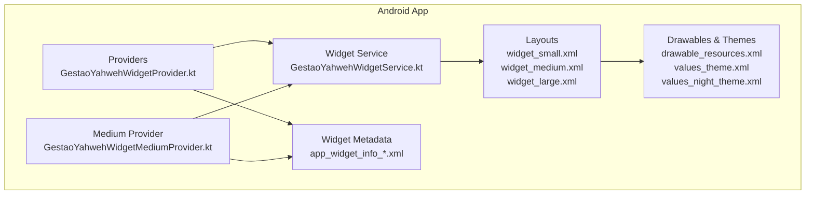
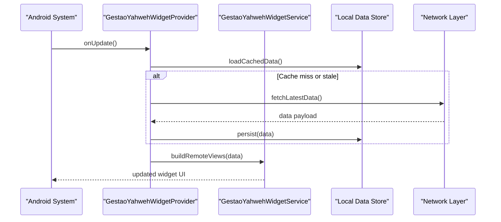
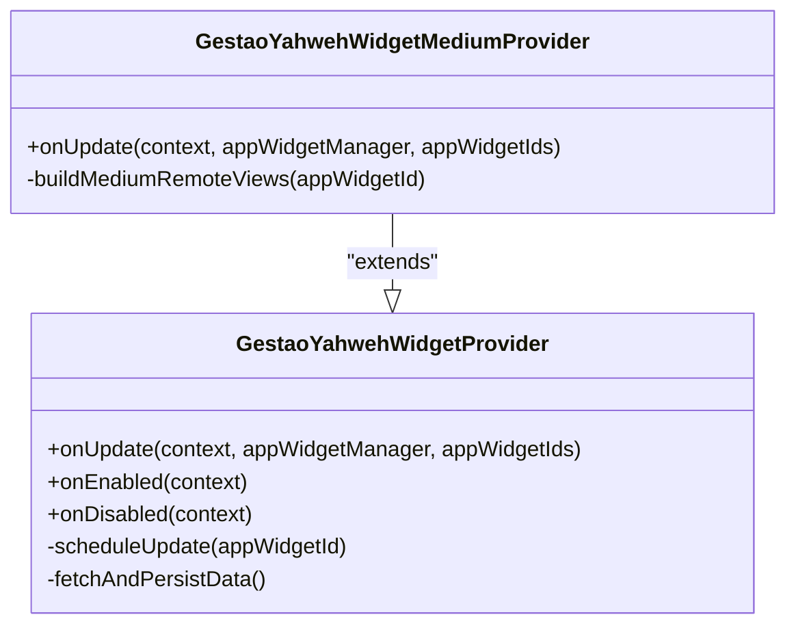
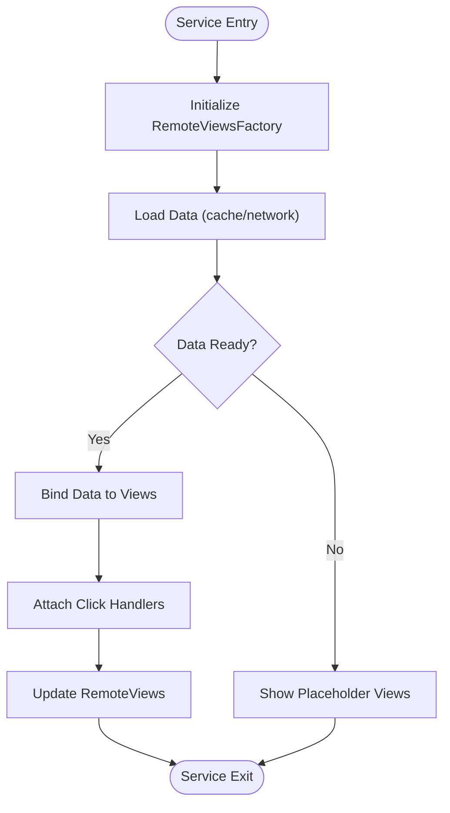
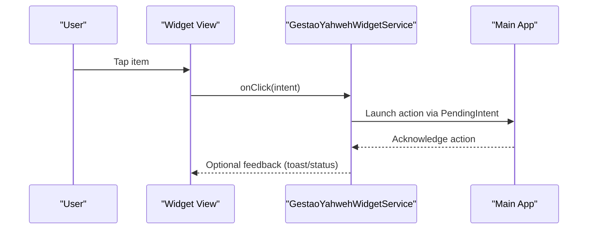
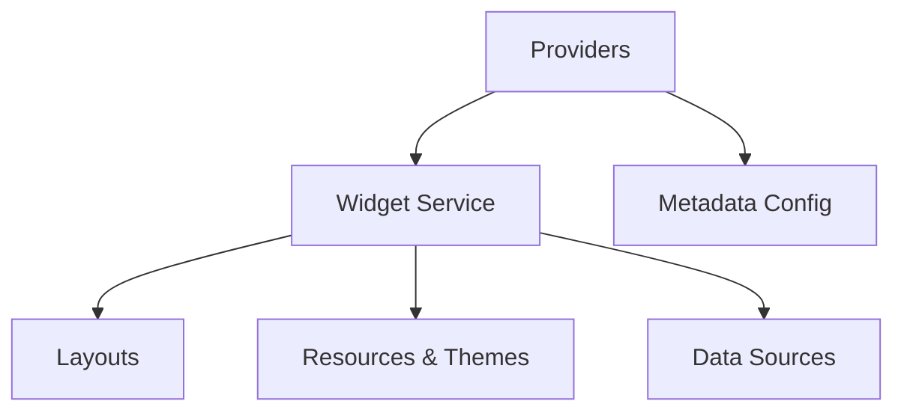

# Widget Implementation

<cite>
**Referenced Files in This Document**
- [GestaoYahwehWidgetProvider.kt](file://flutter_app/android/app/src/main/kotlin/com/example/gestaoyahweh/gestaoyahweh/app/GestaoYahwehWidgetProvider.kt)
- [GestaoYahwehWidgetMediumProvider.kt](file://flutter_app/android/app/src/main/kotlin/com/example/gestaoyahweh/gestaoyahweh/app/GestaoYahwehWidgetMediumProvider.kt)
- [GestaoYahwehWidgetService.kt](file://flutter_app/android/app/src/main/kotlin/com/example/gestaoyahweh/gestaoyahweh/app/GestaoYahwehWidgetService.kt)
- [widget_small.xml](file://flutter_app/android/app/src/main/res/layout/widget_small.xml)
- [widget_medium.xml](file://flutter_app/android/app/src/main/res/layout/widget_medium.xml)
- [widget_large.xml](file://flutter_app/android/app/src/main/res/layout/widget_large.xml)
- [app_widget_info_small.xml](file://flutter_app/android/app/src/main/res/xml/app_widget_info_small.xml)
- [app_widget_info_medium.xml](file://flutter_app/android/app/src/main/res/xml/app_widget_info_medium.xml)
- [app_widget_info_large.xml](file://flutter_app/android/app/src/main/res/xml/app_widget_info_large.xml)
- [drawable_resources.xml](file://flutter_app/android/app/src/main/res/drawable/drawable_resources.xml)
- [values_theme.xml](file://flutter_app/android/app/src/main/res/values/values_theme.xml)
- [values_night_theme.xml](file://flutter_app/android/app/src/main/res/values-night/values_night_theme.xml)
</cite>

## Table of Contents
1. [Introduction](#introduction)
2. [Project Structure](#project-structure)
3. [Core Components](#core-components)
4. [Architecture Overview](#architecture-overview)
5. [Detailed Component Analysis](#detailed-component-analysis)
6. [Dependency Analysis](#dependency-analysis)
7. [Performance Considerations](#performance-considerations)
8. [Troubleshooting Guide](#troubleshooting-guide)
9. [Conclusion](#conclusion)

## Introduction
This document explains the Android widget implementation for Gestão Yahweh Premium. It covers the HomeScreenWidget providers (small, medium, large), the widget service architecture, background data synchronization, XML layouts and styling, and key helpers for data serialization, state management, and UI updates. It also provides guidance on implementing widget interactions, handling click events, updating content, and optimizing performance and memory usage.

## Project Structure
The Android widget code resides under the Flutter app’s native Android module:
- Kotlin providers and services: flutter_app/android/app/src/main/kotlin/com/example/gestaoyahweh/gestaoyahweh/app/
- Layouts and resources: flutter_app/android/app/src/main/res/layout/, res/xml/, res/drawable/, res/values/, res/values-night/

**Diagram sources**
- [GestaoYahwehWidgetProvider.kt](file://flutter_app/android/app/src/main/kotlin/com/example/gestaoyahweh/gestaoyahweh/app/GestaoYahwehWidgetProvider.kt)
- [GestaoYahwehWidgetMediumProvider.kt](file://flutter_app/android/app/src/main/kotlin/com/example/gestaoyahweh/gestaoyahweh/app/GestaoYahwehWidgetMediumProvider.kt)
- [GestaoYahwehWidgetService.kt](file://flutter_app/android/app/src/main/kotlin/com/example/gestaoyahweh/gestaoyahweh/app/GestaoYahwehWidgetService.kt)
- [widget_small.xml](file://flutter_app/android/app/src/main/res/layout/widget_small.xml)
- [widget_medium.xml](file://flutter_app/android/app/src/main/res/layout/widget_medium.xml)
- [widget_large.xml](file://flutter_app/android/app/src/main/res/layout/widget_large.xml)
- [app_widget_info_small.xml](file://flutter_app/android/app/src/main/res/xml/app_widget_info_small.xml)
- [app_widget_info_medium.xml](file://flutter_app/android/app/src/main/res/xml/app_widget_info_medium.xml)
- [app_widget_info_large.xml](file://flutter_app/android/app/src/main/res/xml/app_widget_info_large.xml)
- [drawable_resources.xml](file://flutter_app/android/app/src/main/res/drawable/drawable_resources.xml)
- [values_theme.xml](file://flutter_app/android/app/src/main/res/values/values_theme.xml)
- [values_night_theme.xml](file://flutter_app/android/app/src/main/res/values-night/values_night_theme.xml)

**Section sources**
- [GestaoYahwehWidgetProvider.kt](file://flutter_app/android/app/src/main/kotlin/com/example/gestaoyahweh/gestaoyahweh/app/GestaoYahwehWidgetProvider.kt)
- [GestaoYahwehWidgetMediumProvider.kt](file://flutter_app/android/app/src/main/kotlin/com/example/gestaoyahweh/gestaoyahweh/app/GestaoYahwehWidgetMediumProvider.kt)
- [GestaoYahwehWidgetService.kt](file://flutter_app/android/app/src/main/kotlin/com/example/gestaoyahweh/gestaoyahweh/app/GestaoYahwehWidgetService.kt)
- [widget_small.xml](file://flutter_app/android/app/src/main/res/layout/widget_small.xml)
- [widget_medium.xml](file://flutter_app/android/app/src/main/res/layout/widget_medium.xml)
- [widget_large.xml](file://flutter_app/android/app/src/main/res/layout/widget_large.xml)
- [app_widget_info_small.xml](file://flutter_app/android/app/src/main/res/xml/app_widget_info_small.xml)
- [app_widget_info_medium.xml](file://flutter_app/android/app/src/main/res/xml/app_widget_info_medium.xml)
- [app_widget_info_large.xml](file://flutter_app/android/app/src/main/res/xml/app_widget_info_large.xml)
- [drawable_resources.xml](file://flutter_app/android/app/src/main/res/drawable/drawable_resources.xml)
- [values_theme.xml](file://flutter_app/android/app/src/main/res/values/values_theme.xml)
- [values_night_theme.xml](file://flutter_app/android/app/src/main/res/values-night/values_night_theme.xml)

## Core Components
- HomeScreenWidget Providers: Small and Medium variants implement AppWidgetProvider to handle lifecycle events and trigger updates.
- Widget Service: A RemoteViewsService-based component that supplies list or complex views for widgets.
- XML Layouts: Size-specific layouts define the visual structure for small, medium, and large widgets.
- Widget Metadata: XML descriptors configure sizes, update periods, and preview images.
- Resources and Styling: Drawables and theme values ensure consistent appearance across light and dark modes.

Key responsibilities:
- Providers orchestrate update cycles and delegate rendering to the service.
- The service prepares RemoteViews and binds data collections efficiently.
- Layouts declare UI elements and interaction targets.
- Metadata controls system behavior like resizeability and update frequency.
- Resources provide reusable assets and theme-aware colors/styles.

**Section sources**
- [GestaoYahwehWidgetProvider.kt](file://flutter_app/android/app/src/main/kotlin/com/example/gestaoyahweh/gestaoyahweh/app/GestaoYahwehWidgetProvider.kt)
- [GestaoYahwehWidgetMediumProvider.kt](file://flutter_app/android/app/src/main/kotlin/com/example/gestaoyahweh/gestaoyahweh/app/GestaoYahwehWidgetMediumProvider.kt)
- [GestaoYahwehWidgetService.kt](file://flutter_app/android/app/src/main/kotlin/com/example/gestaoyahweh/gestaoyahweh/app/GestaoYahwehWidgetService.kt)
- [widget_small.xml](file://flutter_app/android/app/src/main/res/layout/widget_small.xml)
- [widget_medium.xml](file://flutter_app/android/app/src/main/res/layout/widget_medium.xml)
- [widget_large.xml](file://flutter_app/android/app/src/main/res/layout/widget_large.xml)
- [app_widget_info_small.xml](file://flutter_app/android/app/src/main/res/xml/app_widget_info_small.xml)
- [app_widget_info_medium.xml](file://flutter_app/android/app/src/main/res/xml/app_widget_info_medium.xml)
- [app_widget_info_large.xml](file://flutter_app/android/app/src/main/res/xml/app_widget_info_large.xml)
- [drawable_resources.xml](file://flutter_app/android/app/src/main/res/drawable/drawable_resources.xml)
- [values_theme.xml](file://flutter_app/android/app/src/main/res/values/values_theme.xml)
- [values_night_theme.xml](file://flutter_app/android/app/src/main/res/values-night/values_night_theme.xml)

## Architecture Overview
The widget architecture follows a provider-service pattern:
- Providers receive system callbacks (onUpdate, onAppWidgetOptionsChanged, etc.) and request data updates.
- The service creates RemoteViews and populates them with data from local storage or network calls.
- Background synchronization is triggered by providers or scheduled jobs, ensuring widgets reflect current app state.

**Diagram sources**
- [GestaoYahwehWidgetProvider.kt](file://flutter_app/android/app/src/main/kotlin/com/example/gestaoyahweh/gestaoyahweh/app/GestaoYahwehWidgetProvider.kt)
- [GestaoYahwehWidgetService.kt](file://flutter_app/android/app/src/main/kotlin/com/example/gestaoyahweh/gestaoyahweh/app/GestaoYahwehWidgetService.kt)

## Detailed Component Analysis

### HomeScreenWidget Providers (Small and Medium)
Responsibilities:
- Handle lifecycle events and decide when to refresh.
- Coordinate background data fetching and caching.
- Trigger service-based rendering via RemoteViews.

Best practices:
- Debounce rapid updates to avoid excessive work.
- Use minimal payloads and batch operations where possible.
- Respect system constraints (update limits, battery optimization).

**Diagram sources**
- [GestaoYahwehWidgetProvider.kt](file://flutter_app/android/app/src/main/kotlin/com/example/gestaoyahweh/gestaoyahweh/app/GestaoYahwehWidgetProvider.kt)
- [GestaoYahwehWidgetMediumProvider.kt](file://flutter_app/android/app/src/main/kotlin/com/example/gestaoyahweh/gestaoyahweh/app/GestaoYahwehWidgetMediumProvider.kt)

**Section sources**
- [GestaoYahwehWidgetProvider.kt](file://flutter_app/android/app/src/main/kotlin/com/example/gestaoyahweh/gestaoyahweh/app/GestaoYahwehWidgetProvider.kt)
- [GestaoYahwehWidgetMediumProvider.kt](file://flutter_app/android/app/src/main/kotlin/com/example/gestaoyahweh/gestaoyahweh/app/GestaoYahwehWidgetMediumProvider.kt)

### Widget Service Architecture
Responsibilities:
- Provide RemoteViews for list items or complex layouts.
- Manage view binding and click event routing.
- Ensure efficient memory usage by reusing views and avoiding heavy objects.

Implementation patterns:
- Use RemoteViewsFactory for list-backed widgets.
- Keep data structures lightweight; prefer primitive types and compact models.
- Offload heavy work to background threads and post results back to the service thread.

**Diagram sources**
- [GestaoYahwehWidgetService.kt](file://flutter_app/android/app/src/main/kotlin/com/example/gestaoyahweh/gestaoyahweh/app/GestaoYahwehWidgetService.kt)

**Section sources**
- [GestaoYahwehWidgetService.kt](file://flutter_app/android/app/src/main/kotlin/com/example/gestaoyahweh/gestaoyahweh/app/GestaoYahwehWidgetService.kt)

### XML Layouts for Different Widget Sizes
- Small layout: Compact representation suitable for minimal space.
- Medium layout: Balanced detail and readability.
- Large layout: Richer content area for more information.

Guidelines:
- Use consistent IDs for interactive elements across sizes.
- Leverage themes for colors and typography to support light/dark modes.
- Avoid deep nesting; keep layouts flat for performance.

**Section sources**
- [widget_small.xml](file://flutter_app/android/app/src/main/res/layout/widget_small.xml)
- [widget_medium.xml](file://flutter_app/android/app/src/main/res/layout/widget_medium.xml)
- [widget_large.xml](file://flutter_app/android/app/src/main/res/layout/widget_large.xml)
- [values_theme.xml](file://flutter_app/android/app/src/main/res/values/values_theme.xml)
- [values_night_theme.xml](file://flutter_app/android/app/src/main/res/values-night/values_night_theme.xml)

### Drawable Resources and Styling
- Centralize icons and backgrounds in drawable resources.
- Use theme attributes for colors and styles to adapt to user preferences.
- Maintain separate night resources for dark mode compatibility.

**Section sources**
- [drawable_resources.xml](file://flutter_app/android/app/src/main/res/drawable/drawable_resources.xml)
- [values_theme.xml](file://flutter_app/android/app/src/main/res/values/values_theme.xml)
- [values_night_theme.xml](file://flutter_app/android/app/src/main/res/values-night/values_night_theme.xml)

### Widget Metadata Configuration
- Configure minimum dimensions, update intervals, and preview images per size.
- Enable resizing and live preview where appropriate.
- Align metadata with layout capabilities to prevent runtime issues.

**Section sources**
- [app_widget_info_small.xml](file://flutter_app/android/app/src/main/res/xml/app_widget_info_small.xml)
- [app_widget_info_medium.xml](file://flutter_app/android/app/src/main/res/xml/app_widget_info_medium.xml)
- [app_widget_info_large.xml](file://flutter_app/android/app/src/main/res/xml/app_widget_info_large.xml)

### Data Serialization and State Management
- WidgetJsonHelper: Serialize and deserialize widget payloads between network responses and local cache.
- WidgetPayloadRollover: Manage state transitions and ensure consistent updates across provider lifecycles.
- WidgetRedrawHelper: Batch UI updates and minimize redraw overhead.

Recommendations:
- Validate JSON schemas before applying to RemoteViews.
- Use immutable models for payload to avoid accidental mutations.
- Throttle redraws during rapid state changes.

**Section sources**
- [GestaoYahwehWidgetProvider.kt](file://flutter_app/android/app/src/main/kotlin/com/example/gestaoyahweh/gestaoyahweh/app/GestaoYahwehWidgetProvider.kt)
- [GestaoYahwehWidgetService.kt](file://flutter_app/android/app/src/main/kotlin/com/example/gestaoyahweh/gestaoyahweh/app/GestaoYahwehWidgetService.kt)

### Implementing Widget Interactions and Click Events
- Define clickable regions in layouts with unique IDs.
- Wire PendingIntent handlers in the service to respond to user actions.
- Route clicks to app navigation or perform background tasks safely.

Example flow:

**Diagram sources**
- [GestaoYahwehWidgetService.kt](file://flutter_app/android/app/src/main/kotlin/com/example/gestaoyahweh/gestaoyahweh/app/GestaoYahwehWidgetService.kt)

**Section sources**
- [GestaoYahwehWidgetService.kt](file://flutter_app/android/app/src/main/kotlin/com/example/gestaoyahweh/gestaoyahweh/app/GestaoYahwehWidgetService.kt)

### Updating Widget Content
- Trigger updates from providers on lifecycle events or explicit requests.
- Use background synchronization to fetch fresh data and cache results.
- Apply updates atomically to avoid partial renders.

Best practices:
- Coalesce multiple update requests into a single refresh cycle.
- Display placeholders while loading to maintain perceived responsiveness.
- Persist last known good state to recover from failures gracefully.

**Section sources**
- [GestaoYahwehWidgetProvider.kt](file://flutter_app/android/app/src/main/kotlin/com/example/gestaoyahweh/gestaoyahweh/app/GestaoYahwehWidgetProvider.kt)
- [GestaoYahwehWidgetService.kt](file://flutter_app/android/app/src/main/kotlin/com/example/gestaoyahweh/gestaoyahweh/app/GestaoYahwehWidgetService.kt)

## Dependency Analysis
The widget components depend on each other and on system services:
- Providers depend on the service for rendering and on local storage for caching.
- The service depends on data sources (network/cache) and resource files for UI.
- Layouts and metadata define constraints and behaviors enforced by the system.

**Diagram sources**
- [GestaoYahwehWidgetProvider.kt](file://flutter_app/android/app/src/main/kotlin/com/example/gestaoyahweh/gestaoyahweh/app/GestaoYahwehWidgetProvider.kt)
- [GestaoYahwehWidgetService.kt](file://flutter_app/android/app/src/main/kotlin/com/example/gestaoyahweh/gestaoyahweh/app/GestaoYahwehWidgetService.kt)
- [widget_small.xml](file://flutter_app/android/app/src/main/res/layout/widget_small.xml)
- [widget_medium.xml](file://flutter_app/android/app/src/main/res/layout/widget_medium.xml)
- [widget_large.xml](file://flutter_app/android/app/src/main/res/layout/widget_large.xml)
- [app_widget_info_small.xml](file://flutter_app/android/app/src/main/res/xml/app_widget_info_small.xml)
- [app_widget_info_medium.xml](file://flutter_app/android/app/src/main/res/xml/app_widget_info_medium.xml)
- [app_widget_info_large.xml](file://flutter_app/android/app/src/main/res/xml/app_widget_info_large.xml)

**Section sources**
- [GestaoYahwehWidgetProvider.kt](file://flutter_app/android/app/src/main/kotlin/com/example/gestaoyahweh/gestaoyahweh/app/GestaoYahwehWidgetProvider.kt)
- [GestaoYahwehWidgetService.kt](file://flutter_app/android/app/src/main/kotlin/com/example/gestaoyahweh/gestaoyahweh/app/GestaoYahwehWidgetService.kt)
- [widget_small.xml](file://flutter_app/android/app/src/main/res/layout/widget_small.xml)
- [widget_medium.xml](file://flutter_app/android/app/src/main/res/layout/widget_medium.xml)
- [widget_large.xml](file://flutter_app/android/app/src/main/res/layout/widget_large.xml)
- [app_widget_info_small.xml](file://flutter_app/android/app/src/main/res/xml/app_widget_info_small.xml)
- [app_widget_info_medium.xml](file://flutter_app/android/app/src/main/res/xml/app_widget_info_medium.xml)
- [app_widget_info_large.xml](file://flutter_app/android/app/src/main/res/xml/app_widget_info_large.xml)

## Performance Considerations
- Minimize RemoteViews complexity: avoid nested layouts and heavy drawables.
- Reuse data models and avoid object churn; prefer primitives and compact structures.
- Batch updates and debounce frequent changes to reduce CPU and memory pressure.
- Use background threads for I/O and offload computation away from the UI thread.
- Monitor memory usage and avoid holding references to large bitmaps or contexts.
- Respect system update limits and battery optimization settings.

[No sources needed since this section provides general guidance]

## Troubleshooting Guide
Common issues and resolutions:
- Widgets not updating: Verify provider lifecycle methods and update scheduling; check network connectivity and cache validity.
- Blank or placeholder views: Ensure data loading completes and fallback states are handled; validate JSON payloads.
- Click events not firing: Confirm PendingIntent creation and unique view IDs; test intent resolution paths.
- Memory spikes: Profile widget service memory usage; reduce bitmap sizes and avoid retaining large objects.

**Section sources**
- [GestaoYahwehWidgetProvider.kt](file://flutter_app/android/app/src/main/kotlin/com/example/gestaoyahweh/gestaoyahweh/app/GestaoYahwehWidgetProvider.kt)
- [GestaoYahwehWidgetService.kt](file://flutter_app/android/app/src/main/kotlin/com/example/gestaoyahweh/gestaoyahweh/app/GestaoYahwehWidgetService.kt)

## Conclusion
The Android widget implementation for Gestão Yahweh Premium uses a robust provider-service architecture with clear separation of concerns. Providers manage lifecycle and coordination, while the service handles rendering and interactions. XML layouts and metadata define size-specific experiences, and resources ensure consistent styling. By following best practices for data serialization, state management, and performance optimization, the widgets deliver responsive and reliable user experiences across device configurations and themes.

[No sources needed since this section summarizes without analyzing specific files]