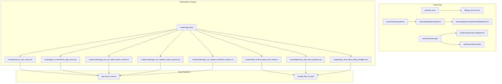
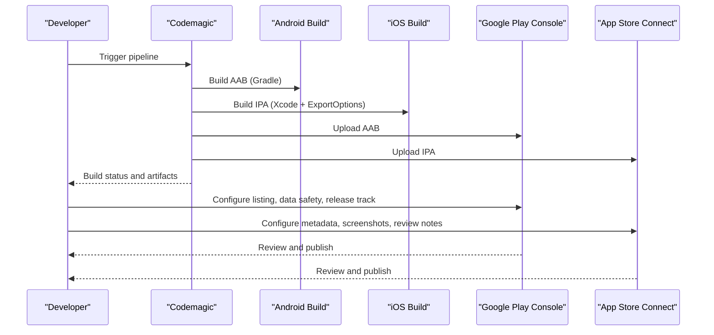
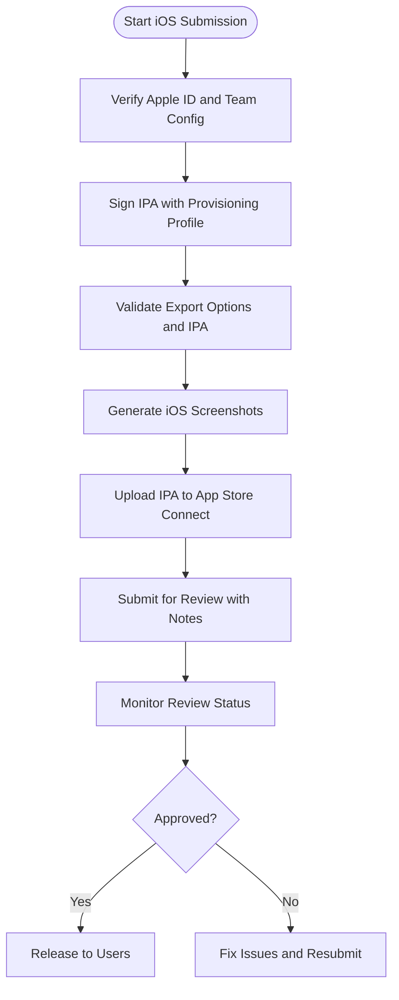
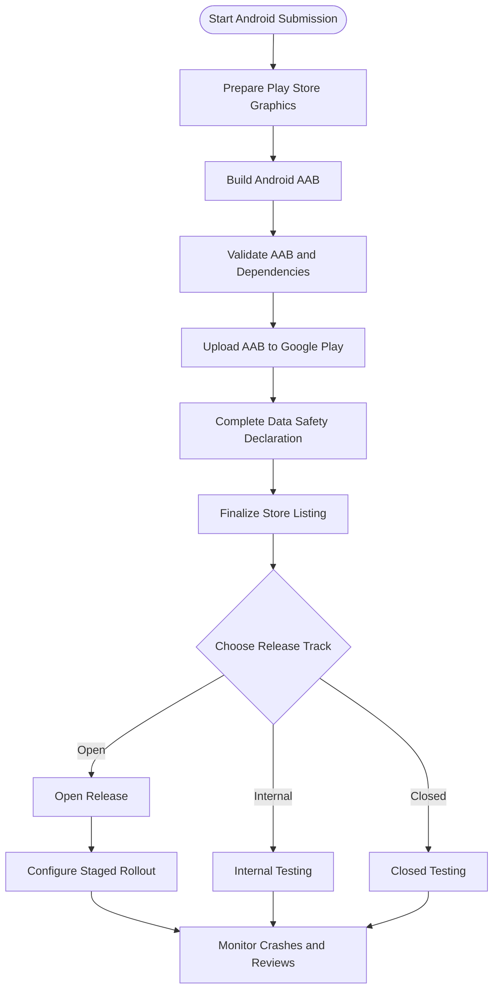
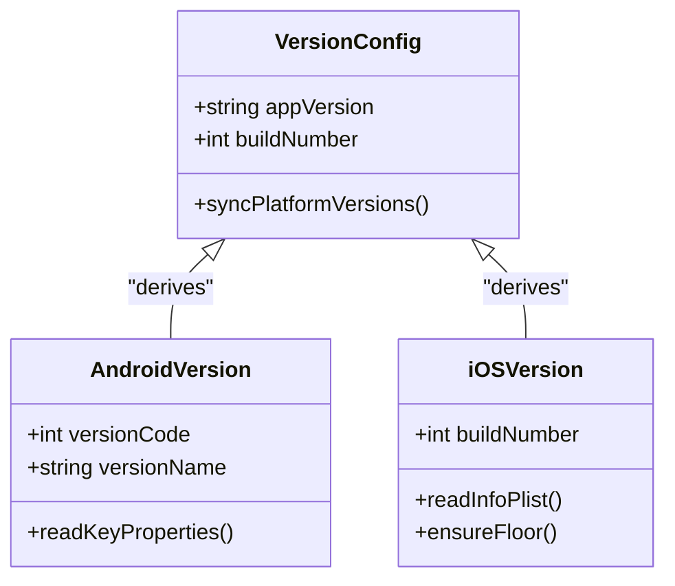
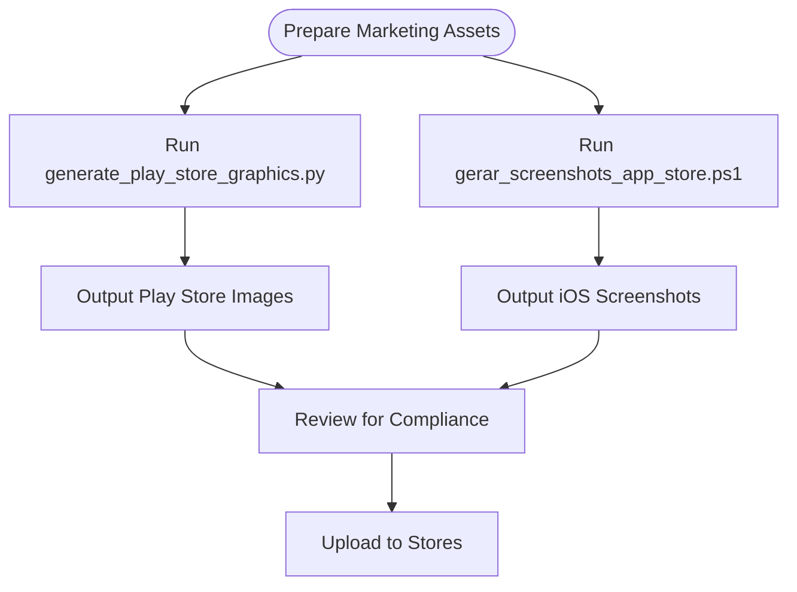
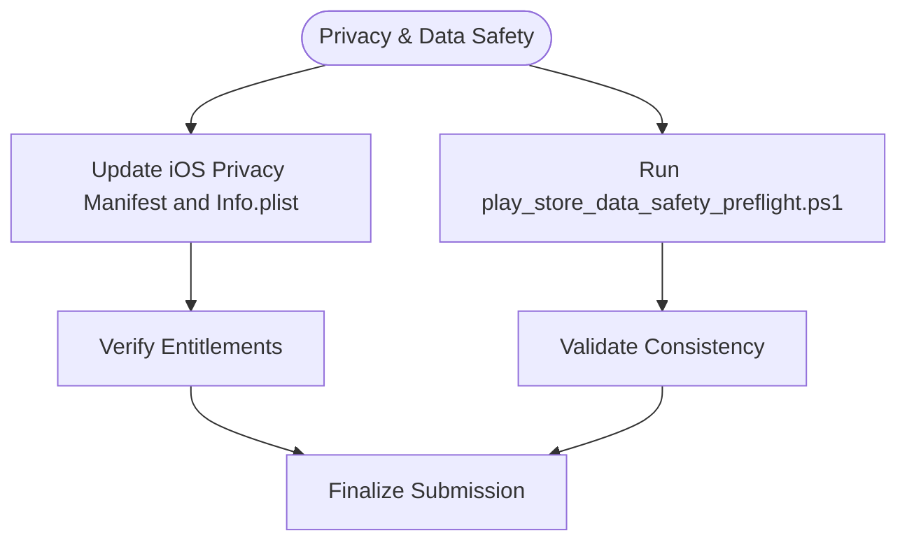
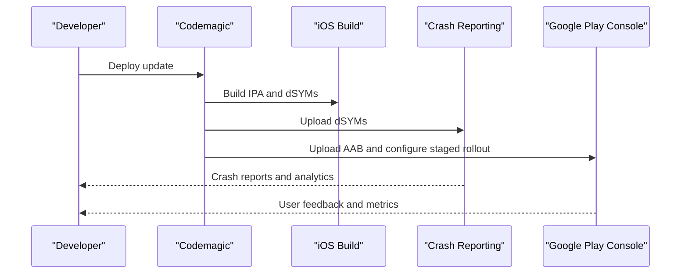
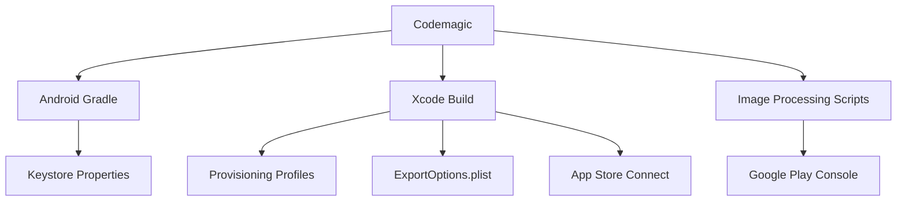

# App Store Submission

<cite>
**Referenced Files in This Document**
- [README.md](file://README.md)
- [codemagic.yaml](file://codemagic.yaml)
- [flutter_app/codemagic.yaml](file://flutter_app/codemagic.yaml)
- [flutter_app/pubspec.yaml](file://flutter_app/pubspec.yaml)
- [flutter_app/CONFIG_VERSAO_APP.md](file://flutter_app/CONFIG_VERSAO_APP.md)
- [flutter_app/android/build.gradle.kts](file://flutter_app/android/build.gradle.kts)
- [flutter_app/android/app/build.gradle.kts](file://flutter_app/android/app/build.gradle.kts)
- [flutter_app/android/key.properties](file://flutter_app/android/key.properties)
- [flutter_app/android/gradle.properties](file://flutter_app/android/gradle.properties)
- [flutter_app/android/local.properties](file://flutter_app/android/local.properties)
- [flutter_app/android/app/src/main/AndroidManifest.xml](file://flutter_app/android/app/src/main/AndroidManifest.xml)
- [flutter_app/ios/Runner/Info.plist](file://flutter_app/ios/Runner/Info.plist)
- [flutter_app/ios/Runner/Runner.entitlements](file://flutter_app/ios/Runner/Runner.entitlements)
- [flutter_app/ios/ExportOptions.plist](file://flutter_app/ios/ExportOptions.plist)
- [flutter_app/ios/asc_build_number_floor.txt](file://flutter_app/ios/asc_build_number_floor.txt)
- [flutter_app/lib/app_version.dart](file://flutter_app/lib/app_version.dart)
- [scripts/generate_play_store_graphics.py](file://scripts/generate_play_store_graphics.py)
- [scripts/gerar_screenshots_app_store.ps1](file://scripts/gerar_screenshots_app_store.ps1)
- [scripts/play_store_data_safety_preflight.ps1](file://scripts/play_store_data_safety_preflight.ps1)
- [ANDROID/README_PLAY_FOTOS_VIDEOS.md](file://ANDROID/README_PLAY_FOTOS_VIDEOS.md)
- [IOS/CODEMAGIC_APP_STORE_INTEGRATION.txt](file://IOS/CODEMAGIC_APP_STORE_INTEGRATION.txt)
- [IOS/CODEMAGIC_INVALID_BINARY.md](file://IOS/CODEMAGIC_INVALID_BINARY.md)
- [IOS/CODEMAGIC_SIGNING_FIX.md](file://IOS/CODEMAGIC_SIGNING_FIX.md)
- [IOS/APP_STORE_3_1_1_ORGANIZATION_SIGNUP.md](file://IOS/APP_STORE_3_1_1_ORGANIZATION_SIGNUP.md)
- [flutter_app/docs/app_store_review_notes.md](file://flutter_app/docs/app_store_review_notes.md)
- [scripts/deploy_release_completo_regras_funcoes_web_aab_ios_zip.ps1](file://scripts/deploy_release_completo_regras_funcoes_web_aab_ios_zip.ps1)
- [scripts/build_android_play_store_aab.ps1](file://scripts/build_android_play_store_aab.ps1)
- [scripts/build_ios_ipa_macos.sh](file://scripts/build_ios_ipa_macos.sh)
- [scripts/codemagic_ios_asc_latest_build_number.sh](file://scripts/codemagic_ios_asc_latest_build_number.sh)
- [scripts/codemagic_ios_validate_export_options.py](file://scripts/codemagic_ios_validate_export_options.py)
- [scripts/codemagic_ios_upload_crashlytics_dsyms.sh](file://scripts/codemagic_ios_upload_crashlytics_dsyms.sh)
</cite>

## Table of Contents
1. Introduction
2. Project Structure
3. Core Components
4. Architecture Overview
5. Detailed Component Analysis
6. Dependency Analysis
7. Performance Considerations
8. Troubleshooting Guide
9. Conclusion
10. Appendices

## Introduction
This document provides a comprehensive guide to submitting the app to iOS App Store and Google Play Store using the repository’s automation, configuration, and tooling. It covers:
- iOS App Store Connect setup, metadata preparation, screenshot generation, and review compliance
- Google Play Store publishing, store listing optimization, and release management
- Versioning strategies, beta testing programs, staged rollouts
- Preparing icons, screenshots, and promotional materials
- Common rejection reasons, privacy policy requirements, and data safety declarations
- Post-launch monitoring, crash reporting, and update deployment strategies

The guidance is grounded in the project’s scripts, build configurations, and documentation files that automate builds, signing, asset generation, and store uploads.

## Project Structure
Key areas relevant to store submission:
- Flutter app configuration and versioning (pubspec, Android Gradle, iOS Info.plist, Dart version file)
- Android build and signing (Gradle, key properties, manifest)
- iOS build and signing (Info.plist, entitlements, ExportOptions, ASC floor number)
- CI/CD and automation (Codemagic YAML, shell/PowerShell scripts for builds, graphics, validation, upload)
- Documentation and checklists for review and data safety

**Diagram sources**
- [flutter_app/pubspec.yaml](file://flutter_app/pubspec.yaml)
- [flutter_app/lib/app_version.dart](file://flutter_app/lib/app_version.dart)
- [flutter_app/android/build.gradle.kts](file://flutter_app/android/build.gradle.kts)
- [flutter_app/android/app/build.gradle.kts](file://flutter_app/android/app/build.gradle.kts)
- [flutter_app/android/app/src/main/AndroidManifest.xml](file://flutter_app/android/app/src/main/AndroidManifest.xml)
- [flutter_app/ios/Runner/Info.plist](file://flutter_app/ios/Runner/Info.plist)
- [flutter_app/ios/Runner/Runner.entitlements](file://flutter_app/ios/Runner/Runner.entitlements)
- [flutter_app/ios/ExportOptions.plist](file://flutter_app/ios/ExportOptions.plist)
- [codemagic.yaml](file://codemagic.yaml)
- [flutter_app/codemagic.yaml](file://flutter_app/codemagic.yaml)
- [scripts/build_android_play_store_aab.ps1](file://scripts/build_android_play_store_aab.ps1)
- [scripts/build_ios_ipa_macos.sh](file://scripts/build_ios_ipa_macos.sh)
- [scripts/generate_play_store_graphics.py](file://scripts/generate_play_store_graphics.py)
- [scripts/gerar_screenshots_app_store.ps1](file://scripts/gerar_screenshots_app_store.ps1)
- [scripts/play_store_data_safety_preflight.ps1](file://scripts/play_store_data_safety_preflight.ps1)
- [scripts/codemagic_ios_asc_latest_build_number.sh](file://scripts/codemagic_ios_asc_latest_build_number.sh)
- [scripts/codemagic_ios_validate_export_options.py](file://scripts/codemagic_ios_validate_export_options.py)
- [scripts/codemagic_ios_upload_crashlytics_dsyms.sh](file://scripts/codemagic_ios_upload_crashlytics_dsyms.sh)

**Section sources**
- [README.md](file://README.md)
- [codemagic.yaml](file://codemagic.yaml)
- [flutter_app/codemagic.yaml](file://flutter_app/codemagic.yaml)

## Core Components
- Versioning strategy:
  - Centralized version definitions in pubspec and Dart file; synchronized with platform-specific configs via scripts.
  - Android uses Gradle properties and build script to derive version code/name.
  - iOS uses Info.plist and ASC build number floor to ensure monotonic build numbers.

- Build artifacts:
  - Android: AAB generated by Gradle and uploaded to Google Play.
  - iOS: IPA generated via Xcode export options and signed with provisioning profiles; uploaded to App Store Connect.

- Graphics and assets:
  - Automated generation of Play Store graphics and iOS screenshots through dedicated scripts.

- Data safety and privacy:
  - Preflight checks for Google Play data safety declarations.
  - iOS privacy manifests and entitlements configured for required permissions.

- Automation:
  - Codemagic orchestrates builds, signing, asset generation, validation, and uploads.

**Section sources**
- [flutter_app/pubspec.yaml](file://flutter_app/pubspec.yaml)
- [flutter_app/lib/app_version.dart](file://flutter_app/lib/app_version.dart)
- [flutter_app/CONFIG_VERSAO_APP.md](file://flutter_app/CONFIG_VERSAO_APP.md)
- [flutter_app/android/build.gradle.kts](file://flutter_app/android/build.gradle.kts)
- [flutter_app/android/app/build.gradle.kts](file://flutter_app/android/app/build.gradle.kts)
- [flutter_app/android/key.properties](file://flutter_app/android/key.properties)
- [flutter_app/android/gradle.properties](file://flutter_app/android/gradle.properties)
- [flutter_app/ios/Runner/Info.plist](file://flutter_app/ios/Runner/Info.plist)
- [flutter_app/ios/ExportOptions.plist](file://flutter_app/ios/ExportOptions.plist)
- [flutter_app/ios/asc_build_number_floor.txt](file://flutter_app/ios/asc_build_number_floor.txt)
- [scripts/generate_play_store_graphics.py](file://scripts/generate_play_store_graphics.py)
- [scripts/gerar_screenshots_app_store.ps1](file://scripts/gerar_screenshots_app_store.ps1)
- [scripts/play_store_data_safety_preflight.ps1](file://scripts/play_store_data_safety_preflight.ps1)

## Architecture Overview
End-to-end submission flow:
- Developer updates version and assets
- CI triggers builds for Android and iOS
- Artifacts are validated and signed
- Assets (screenshots, graphics) are generated
- Upload to respective stores
- Release management (internal, closed, open, staged rollout)

**Diagram sources**
- [codemagic.yaml](file://codemagic.yaml)
- [flutter_app/codemagic.yaml](file://flutter_app/codemagic.yaml)
- [scripts/build_android_play_store_aab.ps1](file://scripts/build_android_play_store_aab.ps1)
- [scripts/build_ios_ipa_macos.sh](file://scripts/build_ios_ipa_macos.sh)
- [scripts/generate_play_store_graphics.py](file://scripts/generate_play_store_graphics.py)
- [scripts/gerar_screenshots_app_store.ps1](file://scripts/gerar_screenshots_app_store.ps1)

## Detailed Component Analysis

### iOS App Store Connect Setup and Submission
- App Store Connect integration:
  - Uses API keys and team identifiers configured in environment variables consumed by Codemagic.
  - Build number floor ensures ascending build numbers for App Store submissions.
- Signing and provisioning:
  - ExportOptions.plist defines distribution method and signing settings.
  - Entitlements include push notifications and app groups if needed.
- Metadata and screenshots:
  - Screenshots generated via PowerShell script aligned with device sizes.
  - Privacy manifest and Info.plist fields must be complete for review.

**Diagram sources**
- [flutter_app/ios/ExportOptions.plist](file://flutter_app/ios/ExportOptions.plist)
- [flutter_app/ios/Runner/Info.plist](file://flutter_app/ios/Runner/Info.plist)
- [flutter_app/ios/Runner/Runner.entitlements](file://flutter_app/ios/Runner/Runner.entitlements)
- [flutter_app/ios/asc_build_number_floor.txt](file://flutter_app/ios/asc_build_number_floor.txt)
- [scripts/gerar_screenshots_app_store.ps1](file://scripts/gerar_screenshots_app_store.ps1)
- [scripts/codemagic_ios_validate_export_options.py](file://scripts/codemagic_ios_validate_export_options.py)
- [scripts/codemagic_ios_asc_latest_build_number.sh](file://scripts/codemagic_ios_asc_latest_build_number.sh)

**Section sources**
- [IOS/CODEMAGIC_APP_STORE_INTEGRATION.txt](file://IOS/CODEMAGIC_APP_STORE_INTEGRATION.txt)
- [IOS/CODEMAGIC_INVALID_BINARY.md](file://IOS/CODEMAGIC_INVALID_BINARY.md)
- [IOS/CODEMAGIC_SIGNING_FIX.md](file://IOS/CODEMAGIC_SIGNING_FIX.md)
- [IOS/APP_STORE_3_1_1_ORGANIZATION_SIGNUP.md](file://IOS/APP_STORE_3_1_1_ORGANIZATION_SIGNUP.md)
- [flutter_app/ios/ExportOptions.plist](file://flutter_app/ios/ExportOptions.plist)
- [flutter_app/ios/Runner/Info.plist](file://flutter_app/ios/Runner/Info.plist)
- [flutter_app/ios/Runner/Runner.entitlements](file://flutter_app/ios/Runner/Runner.entitlements)
- [flutter_app/ios/asc_build_number_floor.txt](file://flutter_app/ios/asc_build_number_floor.txt)
- [scripts/gerar_screenshots_app_store.ps1](file://scripts/gerar_screenshots_app_store.ps1)
- [scripts/codemagic_ios_validate_export_options.py](file://scripts/codemagic_ios_validate_export_options.py)
- [scripts/codemagic_ios_asc_latest_build_number.sh](file://scripts/codemagic_ios_asc_latest_build_number.sh)

### Google Play Store Publishing and Release Management
- Store listing and assets:
  - Graphics generation script produces images sized for Google Play.
  - README documents photos/videos requirements for Play Store.
- Data safety declaration:
  - Preflight script validates data safety inputs and consistency.
- Release tracks and staged rollout:
  - Use internal, closed, and open tracks for progressive rollout.
  - Staged rollout percentages reduce risk during updates.

**Diagram sources**
- [scripts/generate_play_store_graphics.py](file://scripts/generate_play_store_graphics.py)
- [ANDROID/README_PLAY_FOTOS_VIDEOS.md](file://ANDROID/README_PLAY_FOTOS_VIDEOS.md)
- [scripts/play_store_data_safety_preflight.ps1](file://scripts/play_store_data_safety_preflight.ps1)
- [scripts/build_android_play_store_aab.ps1](file://scripts/build_android_play_store_aab.ps1)

**Section sources**
- [ANDROID/README_PLAY_FOTOS_VIDEOS.md](file://ANDROID/README_PLAY_FOTOS_VIDEOS.md)
- [scripts/generate_play_store_graphics.py](file://scripts/generate_play_store_graphics.py)
- [scripts/play_store_data_safety_preflight.ps1](file://scripts/play_store_data_safety_preflight.ps1)
- [scripts/build_android_play_store_aab.ps1](file://scripts/build_android_play_store_aab.ps1)

### Versioning Strategies and Beta Testing
- Versioning:
  - Single source of truth in pubspec and Dart file; platform configs derived at build time.
  - Android version code managed via Gradle and local properties.
  - iOS build number floor ensures monotonic increments.
- Beta testing:
  - Android: Internal/Closed/Open tracks for testers.
  - iOS: TestFlight via App Store Connect.

**Diagram sources**
- [flutter_app/pubspec.yaml](file://flutter_app/pubspec.yaml)
- [flutter_app/lib/app_version.dart](file://flutter_app/lib/app_version.dart)
- [flutter_app/android/build.gradle.kts](file://flutter_app/android/build.gradle.kts)
- [flutter_app/android/key.properties](file://flutter_app/android/key.properties)
- [flutter_app/ios/Runner/Info.plist](file://flutter_app/ios/Runner/Info.plist)
- [flutter_app/ios/asc_build_number_floor.txt](file://flutter_app/ios/asc_build_number_floor.txt)

**Section sources**
- [flutter_app/CONFIG_VERSAO_APP.md](file://flutter_app/CONFIG_VERSAO_APP.md)
- [flutter_app/pubspec.yaml](file://flutter_app/pubspec.yaml)
- [flutter_app/lib/app_version.dart](file://flutter_app/lib/app_version.dart)
- [flutter_app/android/build.gradle.kts](file://flutter_app/android/build.gradle.kts)
- [flutter_app/android/key.properties](file://flutter_app/android/key.properties)
- [flutter_app/ios/Runner/Info.plist](file://flutter_app/ios/Runner/Info.plist)
- [flutter_app/ios/asc_build_number_floor.txt](file://flutter_app/ios/asc_build_number_floor.txt)

### Icons, Screenshots, and Promotional Materials
- Android:
  - Generate Play Store graphics via Python script.
  - Follow size guidelines documented in Android README.
- iOS:
  - Generate screenshots via PowerShell script aligned with device resolutions.
  - Ensure consistent branding across all sizes.

**Diagram sources**
- [scripts/generate_play_store_graphics.py](file://scripts/generate_play_store_graphics.py)
- [ANDROID/README_PLAY_FOTOS_VIDEOS.md](file://ANDROID/README_PLAY_FOTOS_VIDEOS.md)
- [scripts/gerar_screenshots_app_store.ps1](file://scripts/gerar_screenshots_app_store.ps1)

**Section sources**
- [ANDROID/README_PLAY_FOTOS_VIDEOS.md](file://ANDROID/README_PLAY_FOTOS_VIDEOS.md)
- [scripts/generate_play_store_graphics.py](file://scripts/generate_play_store_graphics.py)
- [scripts/gerar_screenshots_app_store.ps1](file://scripts/gerar_screenshots_app_store.ps1)

### Privacy Policy Requirements and Data Safety Declarations
- iOS:
  - Privacy manifest and Info.plist fields must accurately describe data usage.
  - Entitlements should reflect actual capabilities (e.g., push notifications).
- Android:
  - Data safety declaration validated by preflight script.
  - Ensure alignment between declared practices and actual behavior.

**Diagram sources**
- [flutter_app/ios/Runner/Info.plist](file://flutter_app/ios/Runner/Info.plist)
- [flutter_app/ios/Runner/Runner.entitlements](file://flutter_app/ios/Runner/Runner.entitlements)
- [scripts/play_store_data_safety_preflight.ps1](file://scripts/play_store_data_safety_preflight.ps1)

**Section sources**
- [flutter_app/ios/Runner/Info.plist](file://flutter_app/ios/Runner/Info.plist)
- [flutter_app/ios/Runner/Runner.entitlements](file://flutter_app/ios/Runner/Runner.entitlements)
- [scripts/play_store_data_safety_preflight.ps1](file://scripts/play_store_data_safety_preflight.ps1)

### Post-Launch Monitoring, Crash Reporting, and Update Deployment
- Crash reporting:
  - iOS: Upload dSYMs via script to enable symbolicated crashes.
- Update deployment:
  - Use staged rollouts on Google Play to mitigate risks.
  - Monitor reviews and feedback; iterate quickly.

**Diagram sources**
- [scripts/codemagic_ios_upload_crashlytics_dsyms.sh](file://scripts/codemagic_ios_upload_crashlytics_dsyms.sh)
- [scripts/build_android_play_store_aab.ps1](file://scripts/build_android_play_store_aab.ps1)

**Section sources**
- [scripts/codemagic_ios_upload_crashlytics_dsyms.sh](file://scripts/codemagic_ios_upload_crashlytics_dsyms.sh)
- [scripts/build_android_play_store_aab.ps1](file://scripts/build_android_play_store_aab.ps1)

## Dependency Analysis
Key dependencies and relationships:
- Codemagic orchestrates scripts and tools for building, signing, and uploading.
- Android Gradle depends on keystore and properties for signing.
- iOS build depends on provisioning profiles, certificates, and ExportOptions.
- Graphics and screenshots depend on image processing tools invoked by scripts.

**Diagram sources**
- [codemagic.yaml](file://codemagic.yaml)
- [flutter_app/codemagic.yaml](file://flutter_app/codemagic.yaml)
- [flutter_app/android/build.gradle.kts](file://flutter_app/android/build.gradle.kts)
- [flutter_app/android/key.properties](file://flutter_app/android/key.properties)
- [flutter_app/ios/ExportOptions.plist](file://flutter_app/ios/ExportOptions.plist)
- [scripts/generate_play_store_graphics.py](file://scripts/generate_play_store_graphics.py)
- [scripts/gerar_screenshots_app_store.ps1](file://scripts/gerar_screenshots_app_store.ps1)

**Section sources**
- [codemagic.yaml](file://codemagic.yaml)
- [flutter_app/codemagic.yaml](file://flutter_app/codemagic.yaml)
- [flutter_app/android/key.properties](file://flutter_app/android/key.properties)
- [flutter_app/ios/ExportOptions.plist](file://flutter_app/ios/ExportOptions.plist)

## Performance Considerations
- Optimize build times by caching dependencies and artifacts in CI.
- Minimize asset sizes for faster store downloads.
- Use incremental builds where possible to speed up iteration.
- Validate binaries early to catch issues before upload.

[No sources needed since this section provides general guidance]

## Troubleshooting Guide
Common issues and resolutions:
- Invalid binary errors on iOS:
  - Verify signing, provisioning, and export options.
  - Use validation scripts to ensure IPA integrity.
- Signing failures:
  - Ensure profiles match bundle identifiers and entitlements.
- Data safety mismatches on Android:
  - Run preflight checks and align declarations with implementation.
- Review rejections:
  - Consult review notes and adjust metadata or behavior accordingly.

**Section sources**
- [IOS/CODEMAGIC_INVALID_BINARY.md](file://IOS/CODEMAGIC_INVALID_BINARY.md)
- [IOS/CODEMAGIC_SIGNING_FIX.md](file://IOS/CODEMAGIC_SIGNING_FIX.md)
- [flutter_app/docs/app_store_review_notes.md](file://flutter_app/docs/app_store_review_notes.md)
- [scripts/codemagic_ios_validate_export_options.py](file://scripts/codemagic_ios_validate_export_options.py)
- [scripts/play_store_data_safety_preflight.ps1](file://scripts/play_store_data_safety_preflight.ps1)

## Conclusion
This repository provides a robust automation framework for submitting apps to iOS App Store and Google Play Store. By leveraging Codemagic, Gradle, Xcode, and specialized scripts, teams can streamline builds, signing, asset generation, and uploads while maintaining compliance with store policies. Adopting staged rollouts, thorough preflight checks, and post-launch monitoring ensures reliable releases and rapid issue resolution.

[No sources needed since this section summarizes without analyzing specific files]

## Appendices
- End-to-end deployment script:
  - Comprehensive deployment covering rules, functions, web, AAB, iOS ZIP packaging.
- Build scripts:
  - Android AAB build and iOS IPA build scripts for local or CI execution.

**Section sources**
- [scripts/deploy_release_completo_regras_funcoes_web_aab_ios_zip.ps1](file://scripts/deploy_release_completo_regras_funcoes_web_aab_ios_zip.ps1)
- [scripts/build_android_play_store_aab.ps1](file://scripts/build_android_play_store_aab.ps1)
- [scripts/build_ios_ipa_macos.sh](file://scripts/build_ios_ipa_macos.sh)