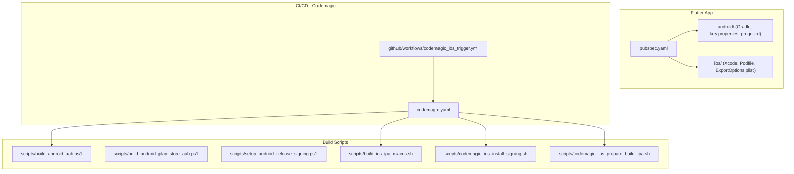
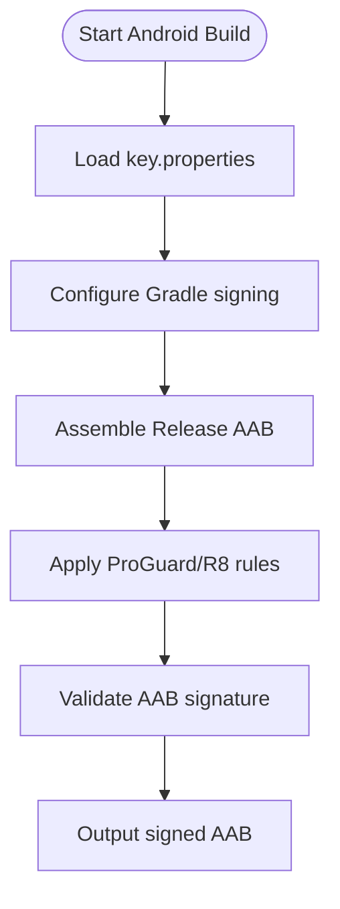
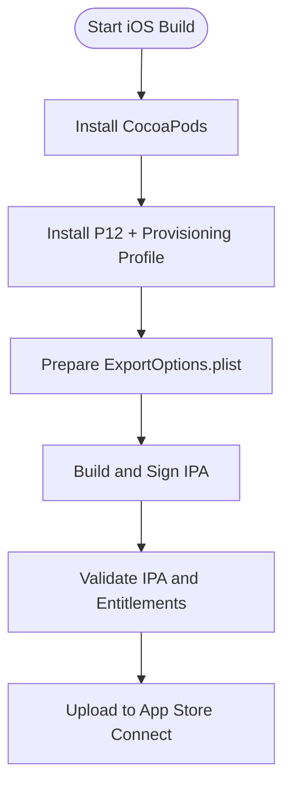
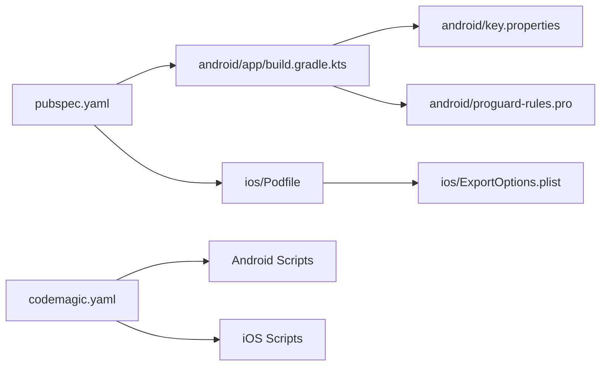

# Build & Signing Process

<cite>
**Referenced Files in This Document**
- [codemagic.yaml](file://codemagic.yaml)
- [build_android_aab.ps1](file://scripts/build_android_aab.ps1)
- [build_android_play_store_aab.ps1](file://scripts/build_android_play_store_aab.ps1)
- [setup_android_release_signing.ps1](file://scripts/setup_android_release_signing.ps1)
- [print_keystore_fingerprints.ps1](file://scripts/print_keystore_fingerprints.ps1)
- [build_ios_ipa_macos.sh](file://scripts/build_ios_ipa_macos.sh)
- [codemagic_ios_install_signing.sh](file://scripts/codemagic_ios_install_signing.sh)
- [codemagic_ios_install_signing_api_only.sh](file://scripts/codemagic_ios_install_signing_api_only.sh)
- [codemagic_ios_prepare_build_ipa.sh](file://scripts/codemagic_ios_prepare_build_ipa.sh)
- [codemagic_ios_validate_export_options.py](file://scripts/codemagic_ios_validate_export_options.py)
- [codemagic_ios_write_export_options.py](file://scripts/codemagic_ios_write_export_options.py)
- [codemagic_ios_verify_env_apple_and_signing.sh](file://scripts/codemagic_ios_verify_env_apple_and_signing.sh)
- [codemagic_ios_fetch_profile_matching_p12.sh](file://scripts/codemagic_ios_fetch_profile_matching_p12.sh)
- [codemagic_ios_ensure_widget_appstore_profile.py](file://scripts/codemagic_ios_ensure_widget_appstore_profile.py)
- [codemagic_ios_enable_push_notifications.py](file://scripts/codemagic_ios_enable_push_notifications.py)
- [codemagic_ios_enable_sign_in_with_apple.py](file://scripts/codemagic_ios_enable_sign_in_with_apple.py)
- [codemagic_ios_upload_crashlytics_dsyms.sh](file://scripts/codemagic_ios_upload_crashlytics_dsyms.sh)
- [codemagic_ios_validate_ipa_before_upload.sh](file://scripts/codemagic_ios_validate_ipa_before_upload.sh)
- [codemagic_ios_normalize_ipa_for_asc.sh](file://scripts/codemagic_ios_normalize_ipa_for_asc.sh)
- [codemagic_ios_bump_pods_deployment_to_14.sh](file://scripts/codemagic_ios_bump_pods_deployment_to_14.sh)
- [codemagic_ios_bump_pods_deployment_to_15.sh](file://scripts/codemagic_ios_bump_pods_deployment_to_15.sh)
- [codemagic_ios_ensure_deployment_target_15.sh](file://scripts/codemagic_ios_ensure_deployment_target_15.sh)
- [codemagic_ios_pod_install.sh](file://scripts/codemagic_ios_pod_install.sh)
- [codemagic_ios_sync_version_from_app_version_dart.sh](file://scripts/codemagic_ios_sync_version_from_app_version_dart.sh)
- [codemagic_ios_read_asc_floor.sh](file://scripts/codemagic_ios_read_asc_floor.sh)
- [codemagic_ios_stamp_asc_floor.sh](file://scripts/codemagic_ios_stamp_asc_floor.sh)
- [codemagic_ios_delete_appstore_profiles.py](file://scripts/codemagic_ios_delete_appstore_profiles.py)
- [codemagic_ios_profile_utils.py](file://scripts/codemagic_ios_profile_utils.py)
- [codemagic_ios_verify_widget_profile.py](file://scripts/codemagic_ios_verify_widget_profile.py)
- [codemagic_ios_team_signing_prepare_exportoptions.sh](file://scripts/codemagic_ios_team_signing_prepare_exportoptions.sh)
- [codemagic_ios_pre_publish_90189_gate.sh](file://scripts/codemagic_ios_pre_publish_90189_gate.sh)
- [codemagic_ios_cp_ipa_safe.sh](file://scripts/codemagic_ios_cp_ipa_safe.sh)
- [codemagic_ios_prepare_api_pem.sh](file://scripts/codemagic_ios_prepare_api_pem.sh)
- [codemagic_ios_p12_password_helpers.sh](file://scripts/codemagic_ios_p12_password_helpers.sh)
- [codemagic_ios_register_app_groups_via_xcode.sh](file://scripts/codemagic_ios_register_app_groups_via_xcode.sh)
- [codemagic_ios_remove_old_appstore_profiles.sh](file://scripts/codemagic_ios_remove_old_appstore_profiles.sh)
- [codemagic_ios_asc_latest_build_number.sh](file://scripts/codemagic_ios_asc_latest_build_number.sh)
- [codemagic_ios_asc_api.py](file://scripts/codemagic_ios_asc_api.py)
- [codemagic_ios_align_push_entitlements.py](file://scripts/codemagic_ios_align_push_entitlements.py)
- [codemagic_ios_align_app_group_entitlements.py](file://scripts/codemagic_ios_align_app_group_entitlements.py)
- [ExportOptions.plist](file://flutter_app/ios/ExportOptions.plist)
- [pubspec.yaml](file://flutter_app/pubspec.yaml)
- [android/app/build.gradle.kts](file://flutter_app/android/app/build.gradle.kts)
- [android/key.properties](file://flutter_app/android/key.properties)
- [android/key.properties.example](file://flutter_app/android/key.properties.example)
- [android/proguard-rules.pro](file://flutter_app/android/proguard-rules.pro)
- [android/local.properties](file://flutter_app/android/local.properties)
- [android/settings.gradle.kts](file://flutter_app/android/settings.gradle.kts)
- [android/gradle.properties](file://flutter_app/android/gradle.properties)
- [ios/Runner/Info.plist](file://flutter_app/ios/Runner/Info.plist)
- [ios/Runner/Runner.entitlements](file://flutter_app/ios/Runner/Runner.entitlements)
- [ios/Podfile](file://flutter_app/ios/Podfile)
- [codemagic_ios_trigger.yml](file://github/workflows/codemagic_ios_trigger.yml)
</cite>

## Table of Contents
1. Introduction
2. Project Structure
3. Core Components
4. Architecture Overview
5. Detailed Component Analysis
6. Dependency Analysis
7. Performance Considerations
8. Troubleshooting Guide
9. Conclusion
10. Appendices

## Introduction
This document explains the end-to-end build and signing process for Android and iOS within this Flutter project, including AAB generation, code signing with keystore files, ProGuard configuration, IPA creation, certificate management, provisioning profiles, and CI/CD integration with Codemagic. It also covers environment setup, build flavors, secrets management, and best practices for security and reproducibility.

## Project Structure
The build and signing system spans several areas:
- Flutter app configuration and platform-specific settings under flutter_app
- Android Gradle build and signing configuration
- iOS Xcode project and signing artifacts
- Codemagic CI/CD orchestration and scripts
- Local and CI automation scripts for Android and iOS builds



**Diagram sources**
- [codemagic.yaml](file://codemagic.yaml)
- [codemagic_ios_trigger.yml](file://github/workflows/codemagic_ios_trigger.yml)
- [build_android_aab.ps1](file://scripts/build_android_aab.ps1)
- [build_ios_ipa_macos.sh](file://scripts/build_ios_ipa_macos.sh)
- [codemagic_ios_install_signing.sh](file://scripts/codemagic_ios_install_signing.sh)
- [codemagic_ios_prepare_build_ipa.sh](file://scripts/codemagic_ios_prepare_build_ipa.sh)

**Section sources**
- [pubspec.yaml](file://flutter_app/pubspec.yaml)
- [android/app/build.gradle.kts](file://flutter_app/android/app/build.gradle.kts)
- [android/key.properties](file://flutter_app/android/key.properties)
- [android/proguard-rules.pro](file://flutter_app/android/proguard-rules.pro)
- [ios/ExportOptions.plist](file://flutter_app/ios/ExportOptions.plist)
- [codemagic.yaml](file://codemagic.yaml)

## Core Components
- Android AAB build pipeline using Gradle and PowerShell scripts
- Android release signing via keystore and key.properties
- ProGuard/R8 rules for Android optimization and shrinking
- iOS IPA build pipeline using shell scripts and Codemagic
- iOS code signing with certificates, provisioning profiles, and export options
- Codemagic CI/CD configuration and GitHub Actions trigger

Key responsibilities:
- Environment preparation and dependency installation
- Secure secret injection (keystore, P12, PEM, API keys)
- Version and build number synchronization
- Artifact validation and upload

**Section sources**
- [build_android_aab.ps1](file://scripts/build_android_aab.ps1)
- [build_android_play_store_aab.ps1](file://scripts/build_android_play_store_aab.ps1)
- [setup_android_release_signing.ps1](file://scripts/setup_android_release_signing.ps1)
- [print_keystore_fingerprints.ps1](file://scripts/print_keystore_fingerprints.ps1)
- [build_ios_ipa_macos.sh](file://scripts/build_ios_ipa_macos.sh)
- [codemagic_ios_install_signing.sh](file://scripts/codemagic_ios_install_signing.sh)
- [codemagic_ios_prepare_build_ipa.sh](file://scripts/codemagic_ios_prepare_build_ipa.sh)
- [codemagic.yaml](file://codemagic.yaml)

## Architecture Overview
The build architecture orchestrates platform-specific pipelines through Codemagic, which is triggered by GitHub Actions or local commands. Each pipeline prepares environment variables, installs dependencies, signs artifacts, validates outputs, and uploads to distribution channels.

```mermaid
sequenceDiagram
participant Dev as "Developer"
participant GH as "GitHub Actions"
participant CM as "Codemagic"
participant AND as "Android Build"
participant IOS as "iOS Build"
participant ASC as "App Store Connect"
participant PS as "Play Store"
Dev->>GH : Push / Trigger workflow
GH->>CM : Trigger codemagic build
CM->>AND : Setup env + install deps
AND->>AND : Sign AAB with keystore
AND-->>CM : Upload AAB artifact
CM->>PS : Publish AAB (optional)
CM->>IOS : Setup env + install pods
IOS->>IOS : Install signing (P12 + profile)
IOS->>IOS : Prepare IPA with ExportOptions
IOS-->>CM : Validate IPA
CM->>ASC : Upload IPA / Metadata
```

**Diagram sources**
- [codemagic.yaml](file://codemagic.yaml)
- [codemagic_ios_trigger.yml](file://github/workflows/codemagic_ios_trigger.yml)
- [build_android_aab.ps1](file://scripts/build_android_aab.ps1)
- [build_ios_ipa_macos.sh](file://scripts/build_ios_ipa_macos.sh)
- [codemagic_ios_install_signing.sh](file://scripts/codemagic_ios_install_signing.sh)
- [codemagic_ios_prepare_build_ipa.sh](file://scripts/codemagic_ios_prepare_build_ipa.sh)

## Detailed Component Analysis

### Android AAB Generation and Signing
- The Android build uses Gradle to assemble an Android App Bundle (AAB).
- Signing is configured via keystore properties and Gradle signing blocks.
- ProGuard/R8 rules are applied to shrink and optimize the release build.

Key steps:
- Read keystore metadata from key.properties
- Configure signing in Gradle
- Execute assembleRelease or playStoreRelease
- Apply ProGuard rules
- Validate output AAB



**Diagram sources**
- [build_android_aab.ps1](file://scripts/build_android_aab.ps1)
- [build_android_play_store_aab.ps1](file://scripts/build_android_play_store_aab.ps1)
- [setup_android_release_signing.ps1](file://scripts/setup_android_release_signing.ps1)
- [android/app/build.gradle.kts](file://flutter_app/android/app/build.gradle.kts)
- [android/key.properties](file://flutter_app/android/key.properties)
- [android/proguard-rules.pro](file://flutter_app/android/proguard-rules.pro)

**Section sources**
- [build_android_aab.ps1](file://scripts/build_android_aab.ps1)
- [build_android_play_store_aab.ps1](file://scripts/build_android_play_store_aab.ps1)
- [setup_android_release_signing.ps1](file://scripts/setup_android_release_signing.ps1)
- [print_keystore_fingerprints.ps1](file://scripts/print_keystore_fingerprints.ps1)
- [android/app/build.gradle.kts](file://flutter_app/android/app/build.gradle.kts)
- [android/key.properties](file://flutter_app/android/key.properties)
- [android/key.properties.example](file://flutter_app/android/key.properties.example)
- [android/proguard-rules.pro](file://flutter_app/android/proguard-rules.pro)
- [android/local.properties](file://flutter_app/android/local.properties)
- [android/settings.gradle.kts](file://flutter_app/android/settings.gradle.kts)
- [android/gradle.properties](file://flutter_app/android/gradle.properties)

### iOS IPA Creation and Code Signing
- The iOS build creates an IPA using xcodebuild or Flutter tooling.
- Signing requires a valid P12 certificate and matching provisioning profile.
- ExportOptions.plist defines signing configuration and bundle identifiers.

Key steps:
- Install CocoaPods dependencies
- Install signing artifacts (P12 and profile) securely
- Generate or validate ExportOptions.plist
- Build and sign IPA
- Validate IPA signatures and entitlements
- Upload to App Store Connect



**Diagram sources**
- [build_ios_ipa_macos.sh](file://scripts/build_ios_ipa_macos.sh)
- [codemagic_ios_install_signing.sh](file://scripts/codemagic_ios_install_signing.sh)
- [codemagic_ios_prepare_build_ipa.sh](file://scripts/codemagic_ios_prepare_build_ipa.sh)
- [codemagic_ios_validate_export_options.py](file://scripts/codemagic_ios_validate_export_options.py)
- [codemagic_ios_write_export_options.py](file://scripts/codemagic_ios_write_export_options.py)
- [codemagic_ios_verify_env_apple_and_signing.sh](file://scripts/codemagic_ios_verify_env_apple_and_signing.sh)
- [codemagic_ios_fetch_profile_matching_p12.sh](file://scripts/codemagic_ios_fetch_profile_matching_p12.sh)
- [ExportOptions.plist](file://flutter_app/ios/ExportOptions.plist)

**Section sources**
- [build_ios_ipa_macos.sh](file://scripts/build_ios_ipa_macos.sh)
- [codemagic_ios_install_signing.sh](file://scripts/codemagic_ios_install_signing.sh)
- [codemagic_ios_install_signing_api_only.sh](file://scripts/codemagic_ios_install_signing_api_only.sh)
- [codemagic_ios_prepare_build_ipa.sh](file://scripts/codemagic_ios_prepare_build_ipa.sh)
- [codemagic_ios_validate_export_options.py](file://scripts/codemagic_ios_validate_export_options.py)
- [codemagic_ios_write_export_options.py](file://scripts/codemagic_ios_write_export_options.py)
- [codemagic_ios_verify_env_apple_and_signing.sh](file://scripts/codemagic_ios_verify_env_apple_and_signing.sh)
- [codemagic_ios_fetch_profile_matching_p12.sh](file://scripts/codemagic_ios_fetch_profile_matching_p12.sh)
- [codemagic_ios_ensure_widget_appstore_profile.py](file://scripts/codemagic_ios_ensure_widget_appstore_profile.py)
- [codemagic_ios_enable_push_notifications.py](file://scripts/codemagic_ios_enable_push_notifications.py)
- [codemagic_ios_enable_sign_in_with_apple.py](file://scripts/codemagic_ios_enable_sign_in_with_apple.py)
- [codemagic_ios_upload_crashlytics_dsyms.sh](file://scripts/codemagic_ios_upload_crashlytics_dsyms.sh)
- [codemagic_ios_validate_ipa_before_upload.sh](file://scripts/codemagic_ios_validate_ipa_before_upload.sh)
- [codemagic_ios_normalize_ipa_for_asc.sh](file://scripts/codemagic_ios_normalize_ipa_for_asc.sh)
- [codemagic_ios_bump_pods_deployment_to_14.sh](file://scripts/codemagic_ios_bump_pods_deployment_to_14.sh)
- [codemagic_ios_bump_pods_deployment_to_15.sh](file://scripts/codemagic_ios_bump_pods_deployment_to_15.sh)
- [codemagic_ios_ensure_deployment_target_15.sh](file://scripts/codemagic_ios_ensure_deployment_target_15.sh)
- [codemagic_ios_pod_install.sh](file://scripts/codemagic_ios_pod_install.sh)
- [codemagic_ios_sync_version_from_app_version_dart.sh](file://scripts/codemagic_ios_sync_version_from_app_version_dart.sh)
- [codemagic_ios_read_asc_floor.sh](file://scripts/codemagic_ios_read_asc_floor.sh)
- [codemagic_ios_stamp_asc_floor.sh](file://scripts/codemagic_ios_stamp_asc_floor.sh)
- [codemagic_ios_delete_appstore_profiles.py](file://scripts/codemagic_ios_delete_appstore_profiles.py)
- [codemagic_ios_profile_utils.py](file://scripts/codemagic_ios_profile_utils.py)
- [codemagic_ios_verify_widget_profile.py](file://scripts/codemagic_ios_verify_widget_profile.py)
- [codemagic_ios_team_signing_prepare_exportoptions.sh](file://scripts/codemagic_ios_team_signing_prepare_exportoptions.sh)
- [codemagic_ios_pre_publish_90189_gate.sh](file://scripts/codemagic_ios_pre_publish_90189_gate.sh)
- [codemagic_ios_cp_ipa_safe.sh](file://scripts/codemagic_ios_cp_ipa_safe.sh)
- [codemagic_ios_prepare_api_pem.sh](file://scripts/codemagic_ios_prepare_api_pem.sh)
- [codemagic_ios_p12_password_helpers.sh](file://scripts/codemagic_ios_p12_password_helpers.sh)
- [codemagic_ios_register_app_groups_via_xcode.sh](file://scripts/codemagic_ios_register_app_groups_via_xcode.sh)
- [codemagic_ios_remove_old_appstore_profiles.sh](file://scripts/codemagic_ios_remove_old_appstore_profiles.sh)
- [codemagic_ios_asc_latest_build_number.sh](file://scripts/codemagic_ios_asc_latest_build_number.sh)
- [codemagic_ios_asc_api.py](file://scripts/codemagic_ios_asc_api.py)
- [codemagic_ios_align_push_entitlements.py](file://scripts/codemagic_ios_align_push_entitlements.py)
- [codemagic_ios_align_app_group_entitlements.py](file://scripts/codemagic_ios_align_app_group_entitlements.py)
- [ExportOptions.plist](file://flutter_app/ios/ExportOptions.plist)
- [ios/Runner/Info.plist](file://flutter_app/ios/Runner/Info.plist)
- [ios/Runner/Runner.entitlements](file://flutter_app/ios/Runner/Runner.entitlements)
- [ios/Podfile](file://flutter_app/ios/Podfile)

### CI/CD Integration with Codemagic
- Codemagic YAML defines workflows for Android and iOS builds, including environment variables, secrets, and build steps.
- GitHub Actions can trigger Codemagic builds on push events.

Key aspects:
- Define jobs for Android and iOS
- Inject secrets securely (keystore, P12, API keys)
- Run build scripts and validations
- Upload artifacts and publish to stores

```mermaid
sequenceDiagram
participant GH as "GitHub Actions"
participant CM as "Codemagic"
participant AND as "Android Job"
participant IOS as "iOS Job"
GH->>CM : Trigger build via API
CM->>AND : Execute Android job
CM->>IOS : Execute iOS job
AND-->>CM : AAB artifact
IOS-->>CM : IPA artifact
CM-->>GH : Status and links
```

**Diagram sources**
- [codemagic.yaml](file://codemagic.yaml)
- [codemagic_ios_trigger.yml](file://github/workflows/codemagic_ios_trigger.yml)

**Section sources**
- [codemagic.yaml](file://codemagic.yaml)
- [codemagic_ios_trigger.yml](file://github/workflows/codemagic_ios_trigger.yml)

### Build Flavors and Environments
- Flutter supports build flavors to differentiate configurations (e.g., debug, staging, production).
- Platform-specific configurations can be set via Gradle and Xcode schemes.
- Environment variables control feature flags and service endpoints.

Recommendations:
- Use pubspec.yaml to define flavor-specific assets and configurations
- Configure Android flavors in Gradle
- Configure iOS schemes and build configurations
- Pass environment variables through Codemagic

**Section sources**
- [pubspec.yaml](file://flutter_app/pubspec.yaml)
- [android/app/build.gradle.kts](file://flutter_app/android/app/build.gradle.kts)
- [android/gradle.properties](file://flutter_app/android/gradle.properties)
- [ios/Runner/Info.plist](file://flutter_app/ios/Runner/Info.plist)

### Secrets Management
- Android keystore and iOS P12/profile must be stored securely in CI/CD environments.
- Use Codemagic secure environment variables or secret managers.
- Avoid committing sensitive files to version control.

Best practices:
- Encrypt keystores and P12 files before storing in CI/CD
- Rotate credentials regularly
- Limit access to signing artifacts

**Section sources**
- [android/key.properties](file://flutter_app/android/key.properties)
- [android/key.properties.example](file://flutter_app/android/key.properties.example)
- [codemagic_ios_install_signing.sh](file://scripts/codemagic_ios_install_signing.sh)
- [codemagic_ios_prepare_api_pem.sh](file://scripts/codemagic_ios_prepare_api_pem.sh)

## Dependency Analysis
The build system has clear separation between platform-specific logic and shared orchestration:
- Android depends on Gradle, keystore, and ProGuard rules
- iOS depends on CocoaPods, Xcode, and signing artifacts
- Codemagic orchestrates both platforms and integrates with store APIs



**Diagram sources**
- [pubspec.yaml](file://flutter_app/pubspec.yaml)
- [android/app/build.gradle.kts](file://flutter_app/android/app/build.gradle.kts)
- [android/key.properties](file://flutter_app/android/key.properties)
- [android/proguard-rules.pro](file://flutter_app/android/proguard-rules.pro)
- [ios/Podfile](file://flutter_app/ios/Podfile)
- [ios/ExportOptions.plist](file://flutter_app/ios/ExportOptions.plist)
- [codemagic.yaml](file://codemagic.yaml)

**Section sources**
- [pubspec.yaml](file://flutter_app/pubspec.yaml)
- [android/app/build.gradle.kts](file://flutter_app/android/app/build.gradle.kts)
- [android/key.properties](file://flutter_app/android/key.properties)
- [android/proguard-rules.pro](file://flutter_app/android/proguard-rules.pro)
- [ios/Podfile](file://flutter_app/ios/Podfile)
- [ios/ExportOptions.plist](file://flutter_app/ios/ExportOptions.plist)
- [codemagic.yaml](file://codemagic.yaml)

## Performance Considerations
- Enable incremental builds and caching in CI/CD
- Use ProGuard/R8 effectively to reduce APK/AAB size
- Optimize iOS pod installations with caching
- Parallelize independent tasks where possible

[No sources needed since this section provides general guidance]

## Troubleshooting Guide
Common issues and resolutions:
- Android signing errors: Verify keystore password, alias, and file paths
- iOS provisioning profile mismatches: Ensure profile matches bundle ID and certificate
- ProGuard crashes: Review rules and exclude necessary classes
- CocoaPods failures: Update Ruby and gem versions, clean cache
- Codemagic build failures: Check logs for environment variable issues

Diagnostic tools:
- Print keystore fingerprints for verification
- Validate IPA entitlements and signatures
- Sync version numbers across platforms

**Section sources**
- [print_keystore_fingerprints.ps1](file://scripts/print_keystore_fingerprints.ps1)
- [codemagic_ios_validate_ipa_before_upload.sh](file://scripts/codemagic_ios_validate_ipa_before_upload.sh)
- [codemagic_ios_verify_env_apple_and_signing.sh](file://scripts/codemagic_ios_verify_env_apple_and_signing.sh)
- [codemagic_ios_sync_version_from_app_version_dart.sh](file://scripts/codemagic_ios_sync_version_from_app_version_dart.sh)

## Conclusion
This build and signing system provides a robust foundation for Android and iOS releases through automated CI/CD pipelines. By following the documented processes and best practices, teams can maintain security, reproducibility, and efficiency in their deployment workflows.

[No sources needed since this section summarizes without analyzing specific files]

## Appendices
- Environment setup checklist for developers
- Secret rotation procedures
- Deployment validation steps

[No sources needed since this section provides general guidance]