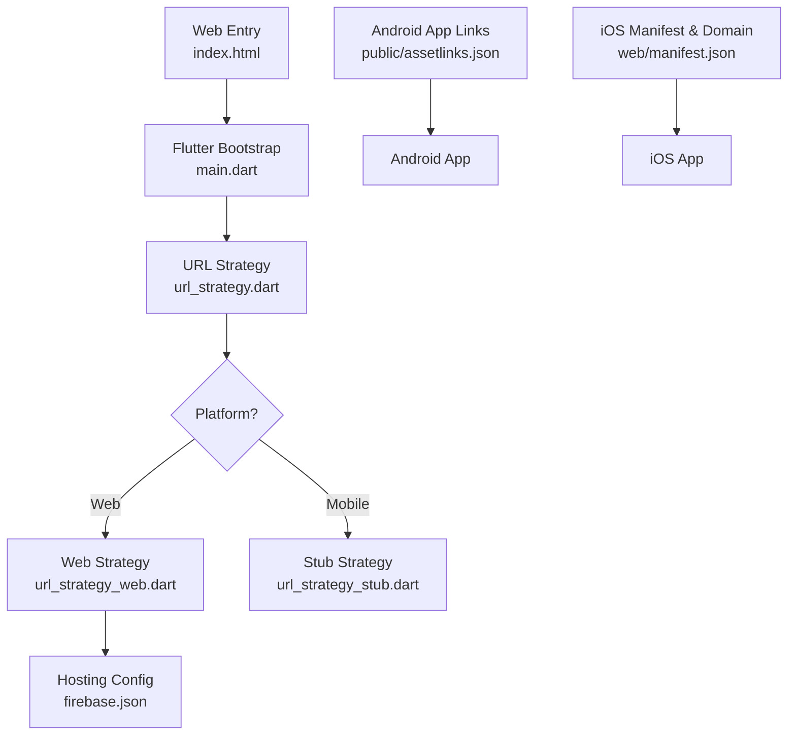
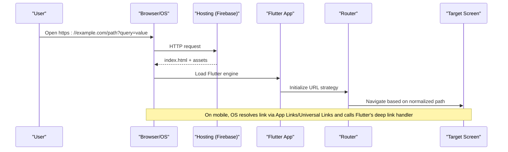
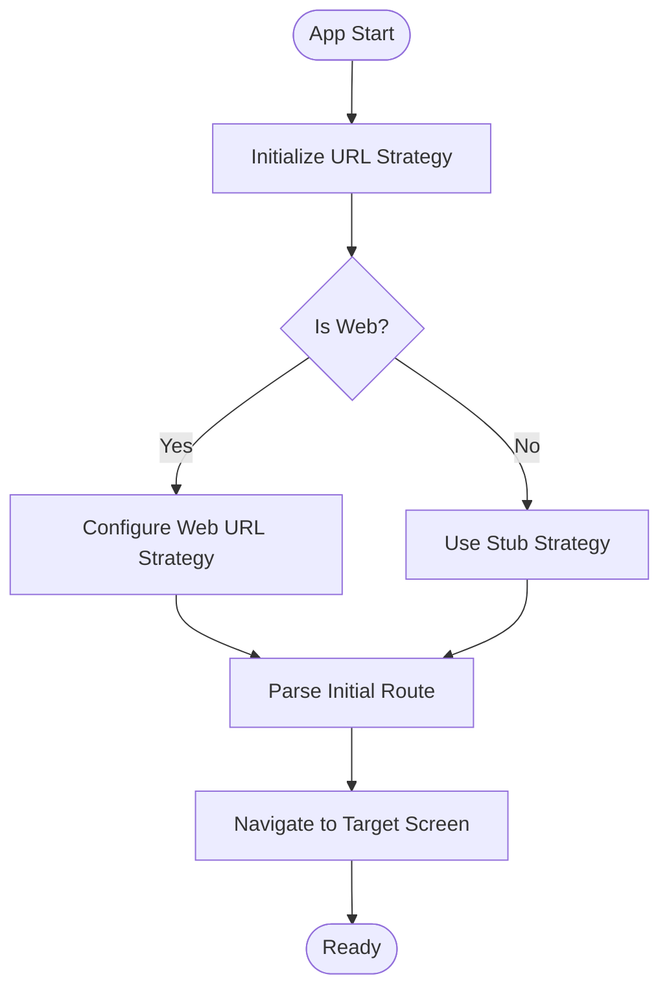
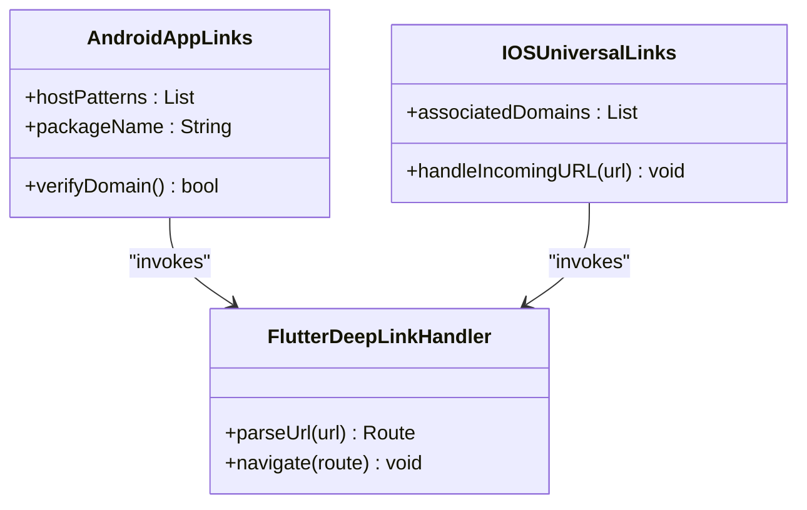
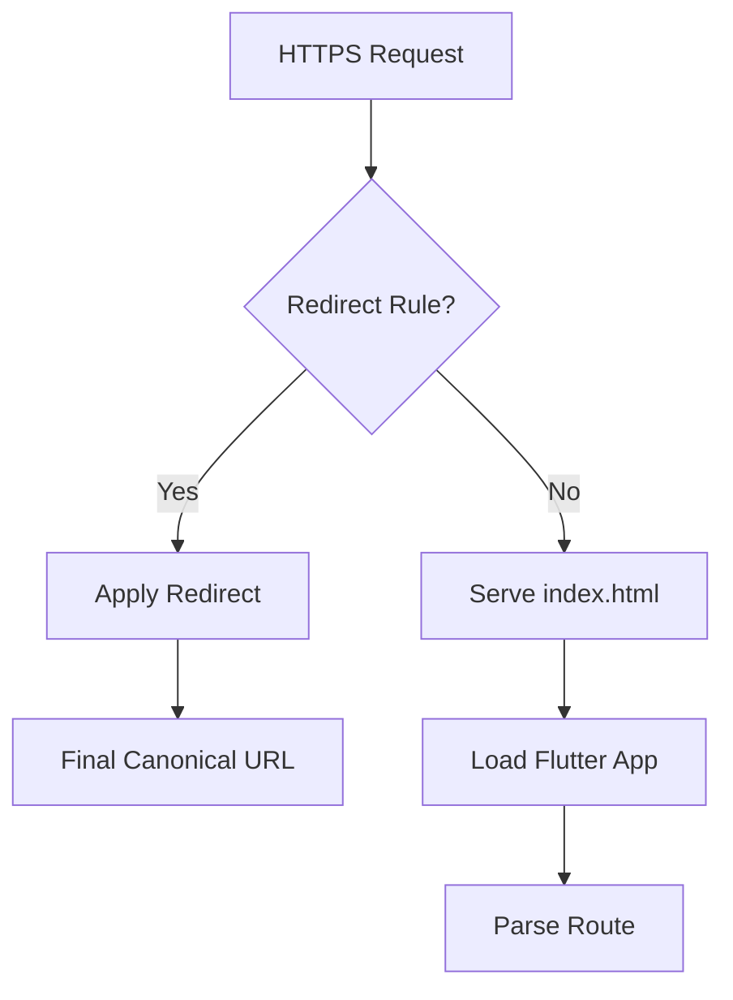
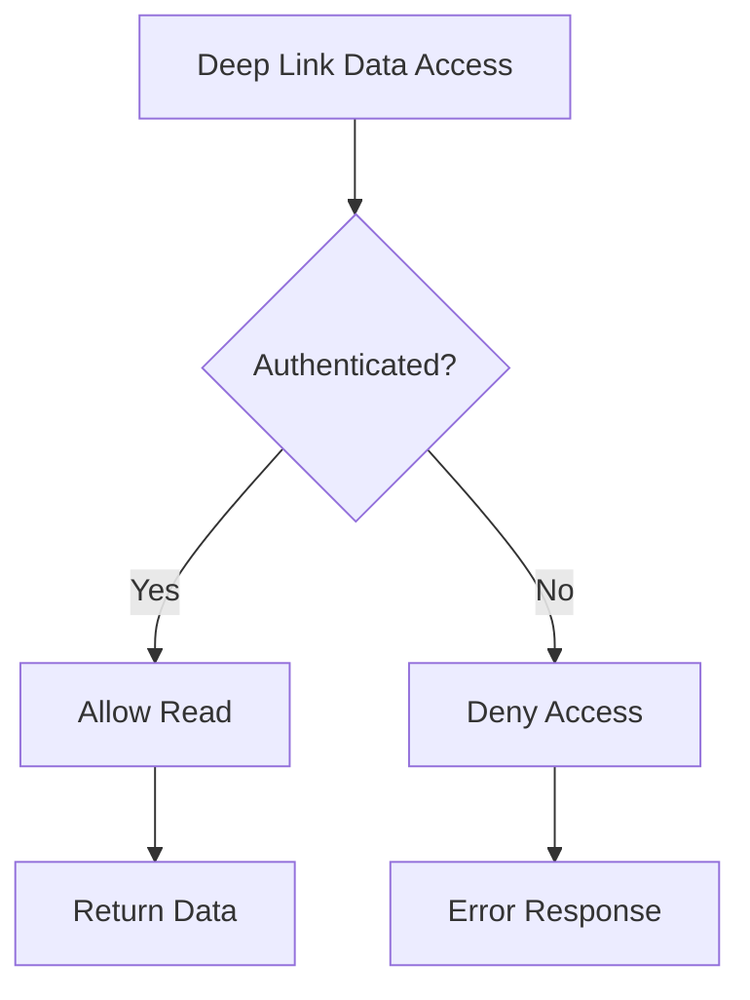
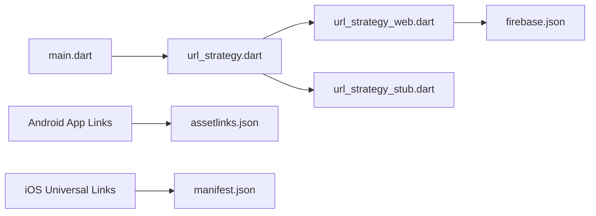

# Deep Linking System

<cite>
**Referenced Files in This Document**
- [main.dart](file://flutter_app/lib/main.dart)
- [url_strategy.dart](file://flutter_app/lib/url_strategy.dart)
- [url_strategy_web.dart](file://flutter_app/lib/url_strategy_web.dart)
- [url_strategy_stub.dart](file://flutter_app/lib/url_strategy_stub.dart)
- [index.html](file://flutter_app/web/index.html)
- [assetlinks.json](file://flutter_app/public/assetlinks.json)
- [manifest.json](file://flutter_app/web/manifest.json)
- [firebase.json](file://flutter_app/firebase.json)
- [storage.rules](file://storage.rules)
- [firestore.rules](file://firestore.rules)
</cite>

## Table of Contents
1. [Introduction](#introduction)
2. [Project Structure](#project-structure)
3. [Core Components](#core-components)
4. [Architecture Overview](#architecture-overview)
5. [Detailed Component Analysis](#detailed-component-analysis)
6. [Dependency Analysis](#dependency-analysis)
7. [Performance Considerations](#performance-considerations)
8. [Troubleshooting Guide](#troubleshooting-guide)
9. [Conclusion](#conclusion)
10. [Appendices](#appendices)

## Introduction
This document explains the Deep Linking System implemented across the Flutter web and mobile targets. It covers how URLs are normalized, routed, and transformed into platform-specific deep links (Android App Links and iOS Universal Links), and how hosting and asset configuration enable seamless navigation from external sources to app screens or actions.

## Project Structure
Deep linking spans multiple layers:
- Web entry point and URL strategy initialization
- Platform-specific URL strategies for web vs. non-web
- Hosting configuration for canonical domains and redirects
- Android App Links association via assetlinks.json
- iOS Universal Links via domain association and manifest settings

**Diagram sources**
- [index.html](file://flutter_app/web/index.html)
- [main.dart](file://flutter_app/lib/main.dart)
- [url_strategy.dart](file://flutter_app/lib/url_strategy.dart)
- [url_strategy_web.dart](file://flutter_app/lib/url_strategy_web.dart)
- [url_strategy_stub.dart](file://flutter_app/lib/url_strategy_stub.dart)
- [firebase.json](file://flutter_app/firebase.json)
- [assetlinks.json](file://flutter_app/public/assetlinks.json)
- [manifest.json](file://flutter_app/web/manifest.json)

**Section sources**
- [main.dart](file://flutter_app/lib/main.dart)
- [url_strategy.dart](file://flutter_app/lib/url_strategy.dart)
- [url_strategy_web.dart](file://flutter_app/lib/url_strategy_web.dart)
- [url_strategy_stub.dart](file://flutter_app/lib/url_strategy_stub.dart)
- [index.html](file://flutter_app/web/index.html)
- [firebase.json](file://flutter_app/firebase.json)
- [assetlinks.json](file://flutter_app/public/assetlinks.json)
- [manifest.json](file://flutter_app/web/manifest.json)

## Core Components
- Web bootstrap and routing initialization: The application initializes URL handling early in the main entry point to ensure consistent behavior before any routes are built.
- URL strategy abstraction: A single strategy file selects the appropriate implementation per platform (web vs. non-web).
- Web-specific strategy: Normalizes URLs and configures the Flutter web router for clean paths.
- Non-web stub: Provides a no-op or minimal behavior on mobile where native deep link handlers take over.
- Hosting configuration: Ensures canonical domains, redirects, and SPA fallbacks so that deep links resolve correctly on the web.
- Android App Links: Declares supported host patterns and package identity to allow direct app opening from HTTPS URLs.
- iOS Universal Links: Uses domain association and app manifest to route HTTPS links to the app when available.

**Section sources**
- [main.dart](file://flutter_app/lib/main.dart)
- [url_strategy.dart](file://flutter_app/lib/url_strategy.dart)
- [url_strategy_web.dart](file://flutter_app/lib/url_strategy_web.dart)
- [url_strategy_stub.dart](file://flutter_app/lib/url_strategy_stub.dart)
- [firebase.json](file://flutter_app/firebase.json)
- [assetlinks.json](file://flutter_app/public/assetlinks.json)
- [manifest.json](file://flutter_app/web/manifest.json)

## Architecture Overview
The deep linking flow starts with an external URL resolving to the hosted web app. On web, the URL strategy normalizes the path and hands it to the Flutter router. On mobile, the OS resolves the link using App Links or Universal Links and invokes the app’s deep link handler, which then maps to the same logical route.

**Diagram sources**
- [index.html](file://flutter_app/web/index.html)
- [main.dart](file://flutter_app/lib/main.dart)
- [url_strategy.dart](file://flutter_app/lib/url_strategy.dart)
- [url_strategy_web.dart](file://flutter_app/lib/url_strategy_web.dart)
- [firebase.json](file://flutter_app/firebase.json)

## Detailed Component Analysis

### Web URL Strategy
- Purpose: Normalize URLs, configure prefix/base path, and ensure consistent routing on web.
- Behavior: Sets up the Flutter web router to use clean URLs without hash fragments and handles initial route parsing.
- Integration: Called during app startup to ensure all subsequent navigations respect the configured strategy.

**Diagram sources**
- [url_strategy.dart](file://flutter_app/lib/url_strategy.dart)
- [url_strategy_web.dart](file://flutter_app/lib/url_strategy_web.dart)
- [url_strategy_stub.dart](file://flutter_app/lib/url_strategy_stub.dart)

**Section sources**
- [url_strategy.dart](file://flutter_app/lib/url_strategy.dart)
- [url_strategy_web.dart](file://flutter_app/lib/url_strategy_web.dart)
- [url_strategy_stub.dart](file://flutter_app/lib/url_strategy_stub.dart)

### Mobile Deep Link Handling
- Android App Links: The system associates HTTPS URLs with the app package via assetlinks.json, enabling direct app launch when the domain is verified.
- iOS Universal Links: The app declares associated domains; when the user taps a matching HTTPS URL, iOS opens the app if installed.
- Routing inside the app: Once opened, the app parses the incoming link and navigates to the intended screen, mirroring the web behavior.

**Diagram sources**
- [assetlinks.json](file://flutter_app/public/assetlinks.json)
- [manifest.json](file://flutter_app/web/manifest.json)

**Section sources**
- [assetlinks.json](file://flutter_app/public/assetlinks.json)
- [manifest.json](file://flutter_app/web/manifest.json)

### Hosting Configuration
- Firebase Hosting ensures that deep links resolve to the correct domain and that SPA fallback serves index.html for client-side routing.
- Redirect rules can enforce canonical domains and normalize paths.

**Diagram sources**
- [firebase.json](file://flutter_app/firebase.json)
- [index.html](file://flutter_app/web/index.html)

**Section sources**
- [firebase.json](file://flutter_app/firebase.json)
- [index.html](file://flutter_app/web/index.html)

### Security Rules Impact
- Firestore and Storage rules may gate access to data referenced by deep-linked screens. Ensure rules allow read access for authenticated users or public endpoints as needed.

**Diagram sources**
- [firestore.rules](file://firestore.rules)
- [storage.rules](file://storage.rules)

**Section sources**
- [firestore.rules](file://firestore.rules)
- [storage.rules](file://storage.rules)

## Dependency Analysis
Deep linking depends on coordinated configuration across web hosting, Flutter routing, and platform associations.

**Diagram sources**
- [main.dart](file://flutter_app/lib/main.dart)
- [url_strategy.dart](file://flutter_app/lib/url_strategy.dart)
- [url_strategy_web.dart](file://flutter_app/lib/url_strategy_web.dart)
- [url_strategy_stub.dart](file://flutter_app/lib/url_strategy_stub.dart)
- [firebase.json](file://flutter_app/firebase.json)
- [assetlinks.json](file://flutter_app/public/assetlinks.json)
- [manifest.json](file://flutter_app/web/manifest.json)

**Section sources**
- [main.dart](file://flutter_app/lib/main.dart)
- [url_strategy.dart](file://flutter_app/lib/url_strategy.dart)
- [url_strategy_web.dart](file://flutter_app/lib/url_strategy_web.dart)
- [url_strategy_stub.dart](file://flutter_app/lib/url_strategy_stub.dart)
- [firebase.json](file://flutter_app/firebase.json)
- [assetlinks.json](file://flutter_app/public/assetlinks.json)
- [manifest.json](file://flutter_app/web/manifest.json)

## Performance Considerations
- Keep URL normalization lightweight to avoid startup delays.
- Avoid heavy computations during initial route parsing; defer to background tasks when possible.
- Ensure hosting CDN caches static assets aggressively while serving dynamic routing logic efficiently.
- Minimize payload size for deep-linked content by lazy-loading features and images.

[No sources needed since this section provides general guidance]

## Troubleshooting Guide
Common issues and resolutions:
- Deep links open the web instead of the app on mobile:
  - Verify Android App Links assetlinks.json is deployed under the correct domain and matches package name and SHA.
  - Confirm iOS Associated Domains includes the correct domain and the app is installed.
- Routes not recognized on web:
  - Ensure URL strategy is initialized before building routes.
  - Check hosting SPA fallback and redirect rules.
- Data access denied after deep link:
  - Review Firestore and Storage rules for required authentication or public read permissions.

**Section sources**
- [assetlinks.json](file://flutter_app/public/assetlinks.json)
- [manifest.json](file://flutter_app/web/manifest.json)
- [firebase.json](file://flutter_app/firebase.json)
- [firestore.rules](file://firestore.rules)
- [storage.rules](file://storage.rules)

## Conclusion
The Deep Linking System integrates web routing, hosting configuration, and platform-specific associations to deliver a consistent experience across devices. By aligning URL strategies, hosting rules, and platform declarations, the app reliably navigates users to the intended content whether they arrive via web or native deep links.

[No sources needed since this section summarizes without analyzing specific files]

## Appendices
- Best practices:
  - Use canonical domains and enforce HTTPS everywhere.
  - Keep deep link payloads small and idempotent.
  - Test deep links on both platforms and in incognito/private modes.
  - Monitor analytics for deep link success rates and errors.

[No sources needed since this section provides general guidance]