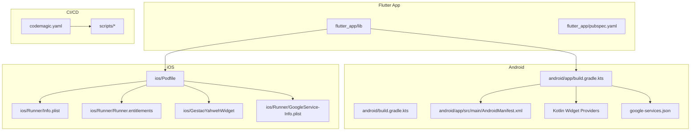
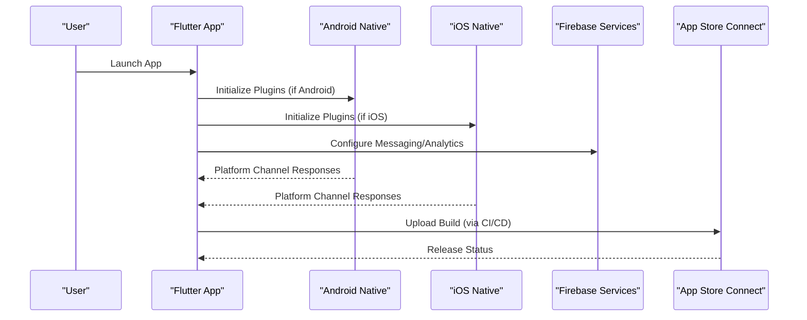
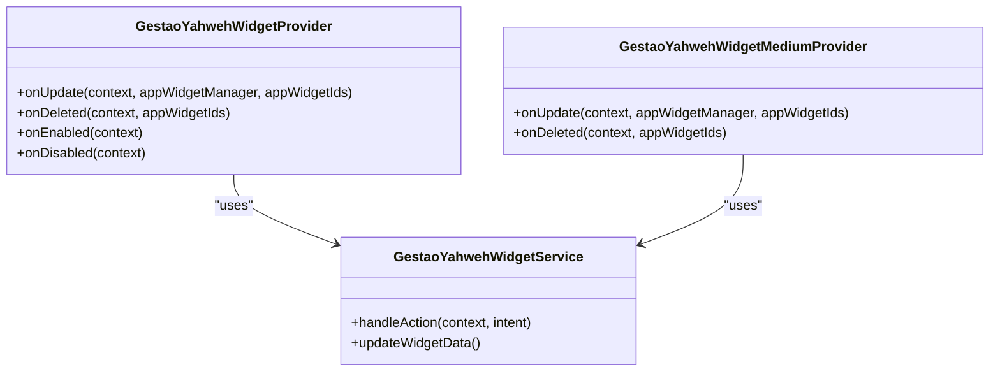
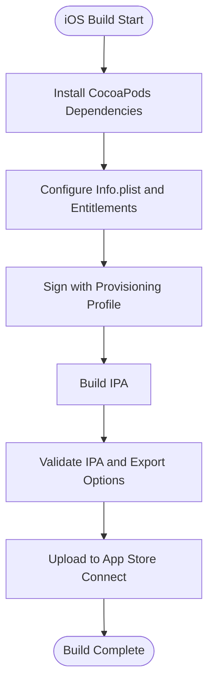
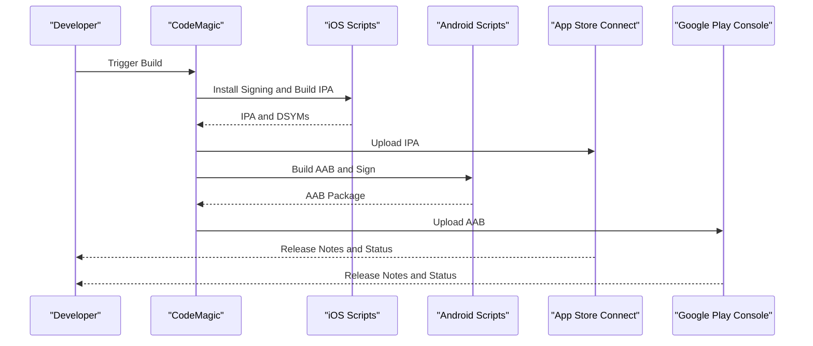
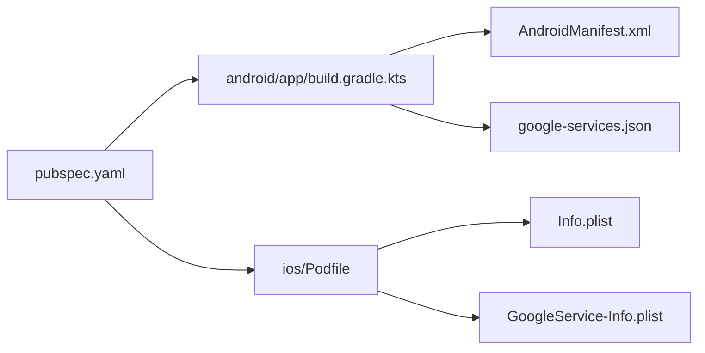

# Mobile Platforms (iOS & Android)

<cite>
**Referenced Files in This Document**
- [pubspec.yaml](file://flutter_app/pubspec.yaml)
- [main.dart](file://flutter_app/lib/main.dart)
- [android/build.gradle.kts](file://flutter_app/android/build.gradle.kts)
- [android/app/build.gradle.kts](file://flutter_app/android/app/build.gradle.kts)
- [android/gradle.properties](file://flutter_app/android/gradle.properties)
- [android/key.properties](file://flutter_app/android/key.properties)
- [android/local.properties](file://flutter_app/android/local.properties)
- [android/app/src/main/AndroidManifest.xml](file://flutter_app/android/app/src/main/AndroidManifest.xml)
- [android/app/src/main/kotlin/com/example/gestao_yahweh/gestaoyahweh/app/GestaoYahwehWidgetProvider.kt](file://flutter_app/android/app/src/main/kotlin/com/example/gestao_yahweh/gestaoyahweh/app/GestaoYahwehWidgetProvider.kt)
- [android/app/src/main/kotlin/com/example/gestao_yahweh/gestaoyahweh/app/GestaoYahwehWidgetMediumProvider.kt](file://flutter_app/android/app/src/main/kotlin/com/example/gestao_yahweh/gestaoyahweh/app/GestaoYahwehWidgetMediumProvider.kt)
- [android/app/src/main/kotlin/com/example/gestao_yahweh/gestaoyahweh/app/GestaoYahwehWidgetService.kt](file://flutter_app/android/app/src/main/kotlin/com/example/gestao_yahweh/gestaoyahweh/app/GestaoYahwehWidgetService.kt)
- [android/app/google-services.json](file://flutter_app/android/app/google-services.json)
- [android/client_secret_1016005755294-mk13oro3h4j89oqlufhqgs93hiu4d4jg.apps.googleusercontent.com.json](file://ANDROID/client_secret_1016005755294-mk13oro3h4j89oqlufhqgs93hiu4d4jg.apps.googleusercontent.com.json)
- [ios/Podfile](file://flutter_app/ios/Podfile)
- [ios/Runner/Info.plist](file://flutter_app/ios/Runner/Info.plist)
- [ios/Runner/GoogleService-Info.plist](file://flutter_app/ios/Runner/GoogleService-Info.plist)
- [ios/Runner/AppDelegate.swift](file://flutter_app/ios/Runner/AppDelegate.swift)
- [ios/Runner/Runner.entitlements](file://flutter_app/ios/Runner/Runner.entitlements)
- [ios/GestaoYahwehWidget/GestaoYahwehWidget.swift](file://flutter_app/ios/GestaoYahwehWidget/GestaoYahwehWidget.swift)
- [ios/GestaoYahwehWidget/Info.plist](file://flutter_app/ios/GestaoYahwehWidget/Info.plist)
- [codemagic.yaml](file://codemagic.yaml)
- [scripts/codemagic_ios_install_signing.sh](file://scripts/codemagic_ios_install_signing.sh)
- [scripts/codemagic_ios_prepare_build_ipa.sh](file://scripts/codemagic_ios_prepare_build_ipa.sh)
- [scripts/codemagic_ios_validate_export_options.py](file://scripts/codemagic_ios_validate_export_options.py)
- [scripts/codemagic_ios_write_export_options.py](file://scripts/codemagic_ios_write_export_options.py)
- [scripts/codemagic_ios_enable_push_notifications.py](file://scripts/codemagic_ios_enable_push_notifications.py)
- [scripts/codemagic_ios_enable_app_groups.py](file://scripts/codemagic_ios_enable_app_groups.py)
- [scripts/codemagic_ios_register_app_groups_via_xcode.sh](file://scripts/codemagic_ios_register_app_groups_via_xcode.sh)
- [scripts/codemagic_ios_verify_profile_matches_p12.sh](file://scripts/codemagic_ios_verify_profile_matches_p12.sh)
- [scripts/codemagic_ios_fetch_profile_matching_p12.sh](file://scripts/codemagic_ios_fetch_profile_matching_p12.sh)
- [scripts/codemagic_ios_upload_crashlytics_dsyms.sh](file://scripts/codemagic_ios_upload_crashlytics_dsyms.sh)
- [scripts/codemagic_ios_sync_version_from_app_version_dart.sh](file://scripts/codemagic_ios_sync_version_from_app_version_dart.sh)
- [scripts/codemagic_ios_bump_pods_deployment_to_15.sh](file://scripts/codemagic_ios_bump_pods_deployment_to_15.sh)
- [scripts/codemagic_ios_ensure_deployment_target_15.sh](file://scripts/codemagic_ios_ensure_deployment_target_15.sh)
- [scripts/codemagic_ios_pod_install.sh](file://scripts/codemagic_ios_pod_install.sh)
- [scripts/codemagic_ios_normalize_ipa_for_asc.sh](file://scripts/codemagic_ios_normalize_ipa_for_asc.sh)
- [scripts/codemagic_ios_validate_ipa_before_upload.sh](file://scripts/codemagic_ios_validate_ipa_before_upload.sh)
- [scripts/codemagic_ios_read_asc_floor.sh](file://scripts/codemagic_ios_read_asc_floor.sh)
- [scripts/codemagic_ios_stamp_asc_floor.sh](file://scripts/codemagic_ios_stamp_asc_floor.sh)
- [scripts/codemagic_ios_pre_publish_90189_gate.sh](file://scripts/codemagic_ios_pre_publish_90189_gate.sh)
- [scripts/codemagic_ios_team_signing_prepare_exportoptions.sh](file://scripts/codemagic_ios_team_signing_prepare_exportoptions.sh)
- [scripts/codemagic_ios_remove_old_appstore_profiles.sh](file://scripts/codemagic_ios_remove_old_appstore_profiles.sh)
- [scripts/codemagic_ios_cp_ipa_safe.sh](file://scripts/codemagic_ios_cp_ipa_safe.sh)
- [scripts/codemagic_ios_p12_password_helpers.sh](file://scripts/codemagic_ios_p12_password_helpers.sh)
- [scripts/codemagic_ios_prepare_api_pem.sh](file://scripts/codemagic_ios_prepare_api_pem.sh)
- [scripts/codemagic_ios_verify_env_apple_and_signing.sh](file://scripts/codemagic_ios_verify_env_apple_and_signing.sh)
- [scripts/codemagic_ios_delete_appstore_profiles.py](file://scripts/codemagic_ios_delete_appstore_profiles.py)
- [scripts/codemagic_ios_profile_utils.py](file://scripts/codemagic_ios_profile_utils.py)
- [scripts/codemagic_ios_ensure_widget_appstore_profile.py](file://scripts/codemagic_ios_ensure_widget_appstore_profile.py)
- [scripts/codemagic_ios_verify_widget_profile.py](file://scripts/codemagic_ios_verify_widget_profile.py)
- [scripts/codemagic_ios_enable_sign_in_with_apple.py](file://scripts/codemagic_ios_enable_sign_in_with_apple.py)
- [scripts/codemagic_ios_bump_pods_deployment_to_14.sh](file://scripts/codemagic_ios_bump_pods_deployment_to_14.sh)
- [scripts/codemagic_ios_sync_version_from_app_version_dart.sh](file://scripts/codemagic_ios_sync_version_from_app_version_dart.sh)
- [scripts/build_android_aab.ps1](file://scripts/build_android_aab.ps1)
- [scripts/build_android_play_store_aab.ps1](file://scripts/build_android_play_store_aab.ps1)
- [scripts/setup_android_release_signing.ps1](file://scripts/setup_android_release_signing.ps1)
- [scripts/sync_android_google_services.ps1](file://scripts/sync_android_google_services.ps1)
- [scripts/print_keystore_fingerprints.ps1](file://scripts/print_keystore_fingerprints.ps1)
- [scripts/encode_ios_codemagic_secrets.ps1](file://scripts/encode_ios_codemagic_secrets.ps1)
- [scripts/export_app_store_connect_secrets_to_d_temporarios.ps1](file://scripts/export_app_store_connect_secrets_to_d_temporarios.ps1)
- [scripts/gen_ios_distribution_csr_private_key_pem.ps1](file://scripts/gen_ios_distribution_csr_private_key_pem.ps1)
- [scripts/gen_ios_distribution_csr_private_key_pem.sh](file://scripts/gen_ios_distribution_csr_private_key_pem.sh)
- [scripts/ios_verify_profile_p12.py](file://scripts/ios_verify_profile_p12.py)
- [scripts/ios_verificar_perfil_com_p12.ps1](file://scripts/ios_verificar_perfil_com_p12.ps1)
- [scripts/codemagic_ios_cp_ipa_safe.sh](file://scripts/codemagic_ios_cp_ipa_safe.sh)
- [scripts/codemagic_ios_validate_export_options.py](file://scripts/codemagic_ios_validate_export_options.py)
- [scripts/codemagic_ios_write_export_options.py](file://scripts/codemagic_ios_write_export_options.py)
- [scripts/codemagic_ios_enable_push_notifications.py](file://scripts/codemagic_ios_enable_push_notifications.py)
- [scripts/codemagic_ios_enable_app_groups.py](file://scripts/codemagic_ios_enable_app_groups.py)
- [scripts/codemagic_ios_register_app_groups_via_xcode.sh](file://scripts/codemagic_ios_register_app_groups_via_xcode.sh)
- [scripts/codemagic_ios_verify_profile_matches_p12.sh](file://scripts/codemagic_ios_verify_profile_matches_p12.sh)
- [scripts/codemagic_ios_fetch_profile_matching_p12.sh](file://scripts/codemagic_ios_fetch_profile_matching_p12.sh)
- [scripts/codemagic_ios_upload_crashlytics_dsyyms.sh](file://scripts/codemagic_ios_upload_crashlytics_dsyms.sh)
- [scripts/codemagic_ios_sync_version_from_app_version_dart.sh](file://scripts/codemagic_ios_sync_version_from_app_version_dart.sh)
- [scripts/codemagic_ios_bump_pods_deployment_to_15.sh](file://scripts/codemagic_ios_bump_pods_deployment_to_15.sh)
- [scripts/codemagic_ios_ensure_deployment_target_15.sh](file://scripts/codemagic_ios_ensure_deployment_target_15.sh)
- [scripts/codemagic_ios_pod_install.sh](file://scripts/codemagic_ios_pod_install.sh)
- [scripts/codemagic_ios_normalize_ipa_for_asc.sh](file://scripts/codemagic_ios_normalize_ipa_for_asc.sh)
- [scripts/codemagic_ios_validate_ipa_before_upload.sh](file://scripts/codemagic_ios_validate_ipa_before_upload.sh)
- [scripts/codemagic_ios_read_asc_floor.sh](file://scripts/codemagic_ios_read_asc_floor.sh)
- [scripts/codemagic_ios_stamp_asc_floor.sh](file://scripts/codemagic_ios_stamp_asc_floor.sh)
- [scripts/codemagic_ios_pre_publish_90189_gate.sh](file://scripts/codemagic_ios_pre_publish_90189_gate.sh)
- [scripts/codemagic_ios_team_signing_prepare_exportoptions.sh](file://scripts/codemagic_ios_team_signing_prepare_exportoptions.sh)
- [scripts/codemagic_ios_remove_old_appstore_profiles.sh](file://scripts/codemagic_ios_remove_old_appstore_profiles.sh)
- [scripts/codemagic_ios_cp_ipa_safe.sh](file://scripts/codemagic_ios_cp_ipa_safe.sh)
- [scripts/codemagic_ios_p12_password_helpers.sh](file://scripts/codemagic_ios_p12_password_helpers.sh)
- [scripts/codemagic_ios_prepare_api_pem.sh](file://scripts/codemagic_ios_prepare_api_pem.sh)
- [scripts/codemagic_ios_verify_env_apple_and_signing.sh](file://scripts/codemagic_ios_verify_env_app apple_and_signing.sh)
- [scripts/codemagic_ios_delete_appstore_profiles.py](file://scripts/codemagic_ios_delete_appstore_profiles.py)
- [scripts/codemagic_ios_profile_utils.py](file://scripts/codemagic_ios_profile_utils.py)
- [scripts/codemagic_ios_ensure_widget_appstore_profile.py](file://scripts/codemagic_ios_ensure_widget_appstore_profile.py)
- [scripts/codemagic_ios_verify_widget_profile.py](file://scripts/codemagic_ios_verify_widget_profile.py)
- [scripts/codemagic_ios_enable_sign_in_with_apple.py](file://scripts/codemagic_ios_enable_sign_in_with_apple.py)
- [scripts/codemagic_ios_bump_pods_deployment_to_14.sh](file://scripts/codemagic_ios_bump_pods_deployment_to_14.sh)
</cite>

## Table of Contents
1. Introduction
2. Project Structure
3. Core Components
4. Architecture Overview
5. Detailed Component Analysis
6. Dependency Analysis
7. Performance Considerations
8. Troubleshooting Guide
9. Conclusion

## Introduction
This document provides comprehensive mobile platform documentation for iOS and Android implementations of Gestão Yahweh Premium. It covers native code integration, platform-specific configurations, widget implementations, build processes, signing and provisioning, app store submission requirements, and platform optimizations. It also explains push notifications, deep linking, background tasks, and native feature access with practical examples for configuring builds, handling platform differences, and debugging native code.

## Project Structure
The project is a Flutter application with native platform modules:
- Flutter core under flutter_app/lib and shared assets
- Android native module under flutter_app/android with Gradle configuration, manifest, and Kotlin widget providers
- iOS native module under flutter_app/ios with Xcode project files, Podfile, Info.plist, entitlements, and a Widget extension
- CI/CD and automation scripts under scripts/ and codemagic.yaml for CodeMagic builds
- Firebase and Google services configuration files for both platforms

**Diagram sources**
- [pubspec.yaml](file://flutter_app/pubspec.yaml)
- [android/build.gradle.kts](file://flutter_app/android/build.gradle.kts)
- [android/app/build.gradle.kts](file://flutter_app/android/app/build.gradle.kts)
- [android/app/src/main/AndroidManifest.xml](file://flutter_app/android/app/src/main/AndroidManifest.xml)
- [android/app/src/main/kotlin/com/example/gestao_yahweh/gestaoyahweh/app/GestaoYahwehWidgetProvider.kt](file://flutter_app/android/app/src/main/kotlin/com/example/gestao_yahweh/gestaoyahweh/app/GestaoYahwehWidgetProvider.kt)
- [android/app/src/main/kotlin/com/example/gestao_yahweh/gestaoyahweh/app/GestaoYahwehWidgetMediumProvider.kt](file://flutter_app/android/app/src/main/kotlin/com/example/gestao_yahweh/gestaoyahweh/app/GestaoYahwehWidgetMediumProvider.kt)
- [android/app/src/main/kotlin/com/example/gestao_yahweh/gestaoyahweh/app/GestaoYahwehWidgetService.kt](file://flutter_app/android/app/src/main/kotlin/com/example/gestao_yahweh/gestaoyahweh/app/GestaoYahwehWidgetService.kt)
- [android/app/google-services.json](file://flutter_app/android/app/google-services.json)
- [ios/Podfile](file://flutter_app/ios/Podfile)
- [ios/Runner/Info.plist](file://flutter_app/ios/Runner/Info.plist)
- [ios/Runner/Runner.entitlements](file://flutter_app/ios/Runner/Runner.entitlements)
- [ios/GestaoYahwehWidget/GestaoYahwehWidget.swift](file://flutter_app/ios/GestaoYahwehWidget/GestaoYahwehWidget.swift)
- [ios/Runner/GoogleService-Info.plist](file://flutter_app/ios/Runner/GoogleService-Info.plist)
- [codemagic.yaml](file://codemagic.yaml)

**Section sources**
- [pubspec.yaml](file://flutter_app/pubspec.yaml)
- [android/build.gradle.kts](file://flutter_app/android/build.gradle.kts)
- [android/app/build.gradle.kts](file://flutter_app/android/app/build.gradle.kts)
- [android/app/src/main/AndroidManifest.xml](file://flutter_app/android/app/src/main/AndroidManifest.xml)
- [ios/Podfile](file://flutter_app/ios/Podfile)
- [ios/Runner/Info.plist](file://flutter_app/ios/Runner/Info.plist)
- [codemagic.yaml](file://codemagic.yaml)

## Core Components
- Flutter entry point and configuration:
  - Main application initialization and URL strategy are defined in the Flutter entry point file.
  - Platform-specific URL strategies are implemented via stubs and web-specific implementations.
- Android native integration:
  - Gradle build configuration and dependencies are managed in the app-level build script.
  - AndroidManifest declares permissions, activities, and widget components.
  - Kotlin widget providers implement home screen widgets and update logic.
- iOS native integration:
  - CocoaPods manages native dependencies via Podfile.
  - Runner Info.plist and entitlements configure capabilities like Push Notifications and App Groups.
  - Widget extension implements iOS home screen widgets.
- CI/CD and automation:
  - CodeMagic orchestrates builds, signing, and uploads using shell scripts and Python utilities.

**Section sources**
- [main.dart](file://flutter_app/lib/main.dart)
- [android/app/build.gradle.kts](file://flutter_app/android/app/build.gradle.kts)
- [android/app/src/main/AndroidManifest.xml](file://flutter_app/android/app/src/main/AndroidManifest.xml)
- [android/app/src/main/kotlin/com/example/gestao_yahweh/gestaoyahweh/app/GestaoYahwehWidgetProvider.kt](file://flutter_app/android/app/src/main/kotlin/com/example/gestao_yahweh/gestaoyahweh/app/GestaoYahwehWidgetProvider.kt)
- [android/app/src/main/kotlin/com/example/gestao_yahweh/gestaoyahweh/app/GestaoYahwehWidgetMediumProvider.kt](file://flutter_app/android/app/src/main/kotlin/com/example/gestao_yahweh/gestaoyahweh/app/GestaoYahwehWidgetMediumProvider.kt)
- [android/app/src/main/kotlin/com/example/gestao_yahweh/gestaoyahweh/app/GestaoYahwehWidgetService.kt](file://flutter_app/android/app/src/main/kotlin/com/example/gestao_yahweh/gestaoyahweh/app/GestaoYahwehWidgetService.kt)
- [ios/Podfile](file://flutter_app/ios/Podfile)
- [ios/Runner/Info.plist](file://flutter_app/ios/Runner/Info.plist)
- [ios/Runner/Runner.entitlements](file://flutter_app/ios/Runner/Runner.entitlements)
- [ios/GestaoYahwehWidget/GestaoYahwehWidget.swift](file://flutter_app/ios/GestaoYahwehWidget/GestaoYahwehWidget.swift)

## Architecture Overview
The mobile architecture integrates Flutter with native platform features:
- Flutter handles UI and business logic, communicating with native modules via platform channels or plugins.
- Android uses Kotlin for widget providers and services; Firebase and Google services are configured via JSON.
- iOS uses Swift for widgets and CocoaPods for dependency management; Firebase and Apple capabilities are configured via plist and entitlements.
- CI/CD automates building, signing, and publishing through CodeMagic scripts.

**Diagram sources**
- [main.dart](file://flutter_app/lib/main.dart)
- [android/app/build.gradle.kts](file://flutter_app/android/app/build.gradle.kts)
- [android/app/google-services.json](file://flutter_app/android/app/google-services.json)
- [ios/Podfile](file://flutter_app/ios/Podfile)
- [ios/Runner/GoogleService-Info.plist](file://flutter_app/ios/Runner/GoogleService-Info.plist)
- [codemagic.yaml](file://codemagic.yaml)

## Detailed Component Analysis

### Android Implementation
- Build configuration:
  - The app-level Gradle script configures dependencies, signing, and build variants.
  - Global Gradle properties define SDK paths and version catalogs.
  - Key properties for release signing are stored securely and referenced by the build script.
- Manifest and permissions:
  - AndroidManifest declares required permissions, activities, and widget components.
  - Widgets are registered with intents and layouts for home screen updates.
- Widget implementation:
  - Kotlin providers handle widget lifecycle, data binding, and remote views.
  - A service coordinates background updates and interactions.
- Firebase and Google services:
  - google-services.json configures Firebase services for Android.
  - Google client secrets are included for OAuth flows.

**Diagram sources**
- [android/app/src/main/kotlin/com/example/gestao_yahweh/gestaoyahweh/app/GestaoYahwehWidgetProvider.kt](file://flutter_app/android/app/src/main/kotlin/com/example/gestao_yahweh/gestaoyahweh/app/GestaoYahwehWidgetProvider.kt)
- [android/app/src/main/kotlin/com/example/gestao_yahweh/gestaoyahweh/app/GestaoYahwehWidgetMediumProvider.kt](file://flutter_app/android/app/src/main/kotlin/com/example/gestao_yahweh/gestaoyahweh/app/GestaoYahwehWidgetMediumProvider.kt)
- [android/app/src/main/kotlin/com/example/gestao_yahweh/gestaoyahweh/app/GestaoYahwehWidgetService.kt](file://flutter_app/android/app/src/main/kotlin/com/example/gestao_yahweh/gestaoyahweh/app/GestaoYahwehWidgetService.kt)

**Section sources**
- [android/app/build.gradle.kts](file://flutter_app/android/app/build.gradle.kts)
- [android/gradle.properties](file://flutter_app/android/gradle.properties)
- [android/key.properties](file://flutter_app/android/key.properties)
- [android/local.properties](file://flutter_app/android/local.properties)
- [android/app/src/main/AndroidManifest.xml](file://flutter_app/android/app/src/main/AndroidManifest.xml)
- [android/app/google-services.json](file://flutter_app/android/app/google-services.json)
- [android/client_secret_1016005755294-mk13oro3h4j89oqlufhqgs93hiu4d4jg.apps.googleusercontent.com.json](file://ANDROID/client_secret_1016005755294-mk13oro3h4j89oqlufhqgs93hiu4d4jg.apps.googleusercontent.com.json)

### iOS Implementation
- Dependency management:
  - CocoaPods manages native libraries and frameworks via Podfile.
  - Deployment targets and platform versions are configured in podspecs and xcconfigs.
- Configuration and capabilities:
  - Info.plist defines app metadata, bundle identifiers, and custom URL schemes.
  - Entitlements enable Push Notifications, App Groups, and other capabilities.
- Widget extension:
  - Swift-based widget extension implements timeline entries and user interactions.
  - Shared resources and assets are organized within the widget target.
- Firebase and Apple services:
  - GoogleService-Info.plist configures Firebase services for iOS.
  - Signing and provisioning are handled via CodeMagic scripts and Xcode workspace settings.

**Diagram sources**
- [ios/Podfile](file://flutter_app/ios/Podfile)
- [ios/Runner/Info.plist](file://flutter_app/ios/Runner/Info.plist)
- [ios/Runner/Runner.entitlements](file://flutter_app/ios/Runner/Runner.entitlements)
- [ios/GestaoYahwehWidget/GestaoYahwehWidget.swift](file://flutter_app/ios/GestaoYahwehWidget/GestaoYahwehWidget.swift)
- [ios/Runner/GoogleService-Info.plist](file://flutter_app/ios/Runner/GoogleService-Info.plist)

**Section sources**
- [ios/Podfile](file://flutter_app/ios/Podfile)
- [ios/Runner/Info.plist](file://flutter_app/ios/Runner/Info.plist)
- [ios/Runner/Runner.entitlements](file://flutter_app/ios/Runner/Runner.entitlements)
- [ios/GestaoYahwehWidget/GestaoYahwehWidget.swift](file://flutter_app/ios/GestaoYahwehWidget/GestaoYahwehWidget.swift)
- [ios/Runner/GoogleService-Info.plist](file://flutter_app/ios/Runner/GoogleService-Info.plist)

### CI/CD and Automation
- CodeMagic pipeline:
  - codemagic.yaml defines workflows for iOS and Android builds, testing, and deployment.
  - Shell scripts automate signing, provisioning, and validation steps.
- iOS automation:
  - Scripts install signing certificates, profiles, and prepare export options.
  - Validation ensures IPA compatibility and correct entitlements.
  - Crashlytics symbols are uploaded for crash reporting.
- Android automation:
  - PowerShell scripts build AAB packages and manage signing keys.
  - Google services synchronization ensures consistent configuration.

**Diagram sources**
- [codemagic.yaml](file://codemagic.yaml)
- [scripts/codemagic_ios_install_signing.sh](file://scripts/codemagic_ios_install_signing.sh)
- [scripts/codemagic_ios_prepare_build_ipa.sh](file://scripts/codemagic_ios_prepare_build_ipa.sh)
- [scripts/codemagic_ios_validate_export_options.py](file://scripts/codemagic_ios_validate_export_options.py)
- [scripts/codemagic_ios_write_export_options.py](file://scripts/codemagic_ios_write_export_options.py)
- [scripts/codemagic_ios_upload_crashlytics_dsyms.sh](file://scripts/codemagic_ios_upload_crashlytics_dsyms.sh)
- [scripts/build_android_aab.ps1](file://scripts/build_android_aab.ps1)
- [scripts/build_android_play_store_aab.ps1](file://scripts/build_android_play_store_aab.ps1)

**Section sources**
- [codemagic.yaml](file://codemagic.yaml)
- [scripts/codemagic_ios_install_signing.sh](file://scripts/codemagic_ios_install_signing.sh)
- [scripts/codemagic_ios_prepare_build_ipa.sh](file://scripts/codemagic_ios_prepare_build_ipa.sh)
- [scripts/codemagic_ios_validate_export_options.py](file://scripts/codemagic_ios_validate_export_options.py)
- [scripts/codemagic_ios_write_export_options.py](file://scripts/codemagic_ios_write_export_options.py)
- [scripts/codemagic_ios_upload_crashlytics_dsyms.sh](file://scripts/codemagic_ios_upload_crashlytics_dsyms.sh)
- [scripts/build_android_aab.ps1](file://scripts/build_android_aab.ps1)
- [scripts/build_android_play_store_aab.ps1](file://scripts/build_android_play_store_aab.ps1)

## Dependency Analysis
- Flutter dependencies are declared in pubspec.yaml, including platform-specific plugins.
- Android dependencies are managed via Gradle, with Firebase and Google services integrated.
- iOS dependencies are managed via CocoaPods, with native libraries and frameworks linked.
- CI/CD scripts depend on external tools like xcrun, fastlane, and gcloud CLI.

**Diagram sources**
- [pubspec.yaml](file://flutter_app/pubspec.yaml)
- [android/app/build.gradle.kts](file://flutter_app/android/app/build.gradle.kts)
- [android/app/src/main/AndroidManifest.xml](file://flutter_app/android/app/src/main/AndroidManifest.xml)
- [android/app/google-services.json](file://flutter_app/android/app/google-services.json)
- [ios/Podfile](file://flutter_app/ios/Podfile)
- [ios/Runner/Info.plist](file://flutter_app/ios/Runner/Info.plist)
- [ios/Runner/GoogleService-Info.plist](file://flutter_app/ios/Runner/GoogleService-Info.plist)

**Section sources**
- [pubspec.yaml](file://flutter_app/pubspec.yaml)
- [android/app/build.gradle.kts](file://flutter_app/android/app/build.gradle.kts)
- [android/app/src/main/AndroidManifest.xml](file://flutter_app/android/app/src/main/AndroidManifest.xml)
- [android/app/google-services.json](file://flutter_app/android/app/google-services.json)
- [ios/Podfile](file://flutter_app/ios/Podfile)
- [ios/Runner/Info.plist](file://flutter_app/ios/Runner/Info.plist)
- [ios/Runner/GoogleService-Info.plist](file://flutter_app/ios/Runner/GoogleService-Info.plist)

## Performance Considerations
- Android:
  - Optimize Gradle builds with parallel execution and caching.
  - Use ProGuard/R8 rules to reduce APK size and improve startup time.
  - Leverage background services efficiently for widget updates.
- iOS:
  - Minimize framework sizes and avoid unnecessary pods.
  - Use App Groups for efficient data sharing between app and widgets.
  - Optimize widget timelines for minimal memory usage.
- Cross-platform:
  - Implement lazy loading and caching strategies in Flutter.
  - Use platform channels judiciously to avoid overhead.
  - Monitor memory and CPU usage with profiling tools.

[No sources needed since this section provides general guidance]

## Troubleshooting Guide
- Android:
  - Verify keystore fingerprints and signing configurations.
  - Check AndroidManifest permissions and widget registrations.
  - Debug widget updates using Logcat and Android Studio.
- iOS:
  - Validate provisioning profiles and entitlements.
  - Ensure Info.plist and GoogleService-Info.plist are correctly configured.
  - Use Xcode console and Instruments for performance analysis.
- CI/CD:
  - Inspect CodeMagic logs for build failures.
  - Verify environment variables and secret encoding.
  - Test signing and provisioning locally before CI runs.

**Section sources**
- [scripts/print_keystore_fingerprints.ps1](file://scripts/print_keystore_fingerprints.ps1)
- [scripts/encode_ios_codemagic_secrets.ps1](file://scripts/encode_ios_codemagic_secrets.ps1)
- [scripts/codemagic_ios_verify_env_apple_and_signing.sh](file://scripts/codemagic_ios_verify_env_apple_and_signing.sh)

## Conclusion
Gestão Yahweh Premium’s mobile implementation leverages Flutter for cross-platform development while integrating native features for Android and iOS. Robust CI/CD automation ensures reliable builds, signing, and deployment. Proper configuration of Firebase, widgets, and platform capabilities enables rich user experiences. Following the guidelines in this document will help maintain high performance, reliability, and smooth app store submissions.

[No sources needed since this section summarizes without analyzing specific files]