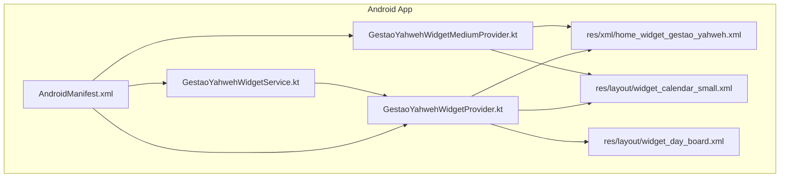
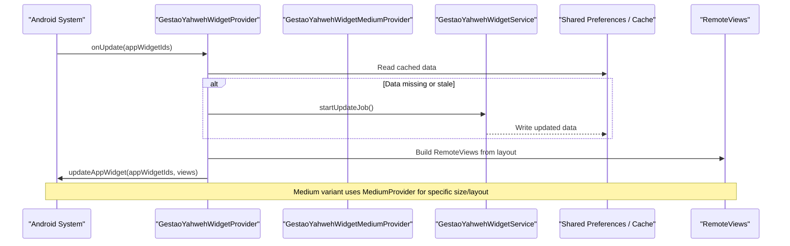
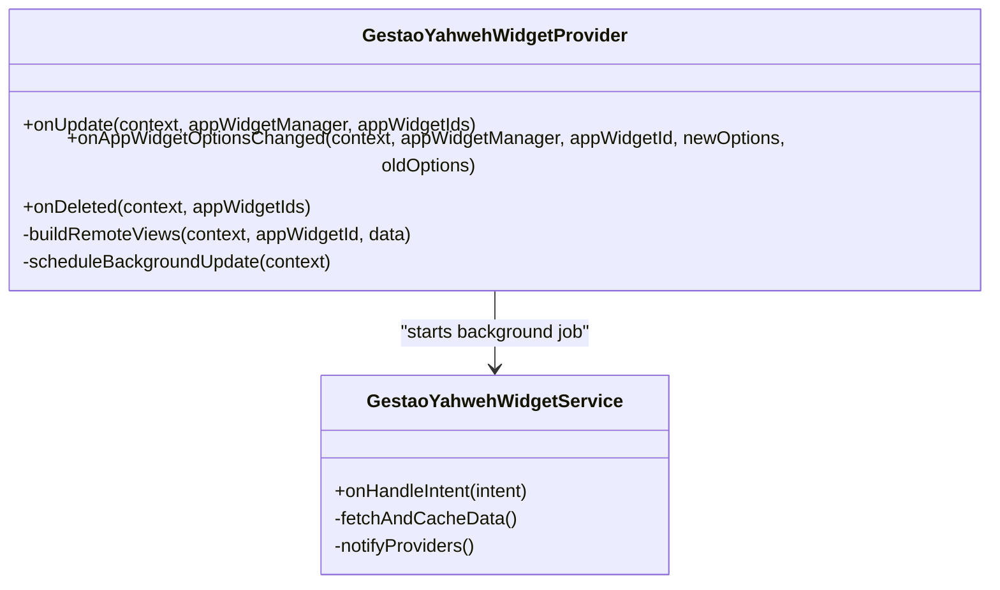
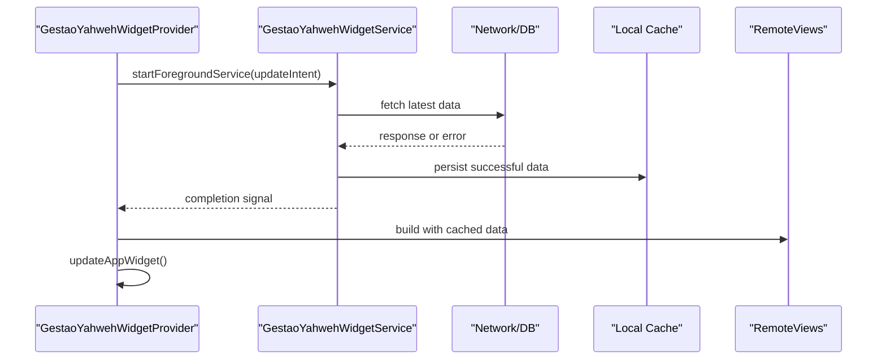
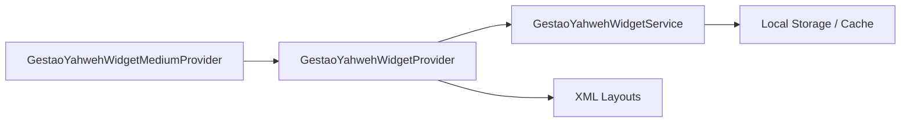

# Android Home Screen Widgets

<cite>
**Referenced Files in This Document**
- [GestaoYahwehWidgetProvider.kt](file://flutter_app/android/app/src/main/kotlin/com/example/gestao_yahweh/gestaoyahweh/app/GestaoYahwehWidgetProvider.kt)
- [GestaoYahwehWidgetMediumProvider.kt](file://flutter_app/android/app/src/main/kotlin/com/example/gestao_yahweh/gestaoyahweh/app/GestaoYahwehWidgetMediumProvider.kt)
- [GestaoYahwehWidgetService.kt](file://flutter_app/android/app/src/main/kotlin/com/example/gestao_yahweh/gestaoyahweh/app/GestaoYahwehWidgetService.kt)
- [AndroidManifest.xml](file://flutter_app/android/app/src/main/AndroidManifest.xml)
- [home_widget_gestao_yahweh.xml](file://flutter_app/android/app/src/main/res/xml/home_widget_gestao_yahweh.xml)
- [widget_calendar_small.xml](file://flutter_app/android/app/src/main/res/layout/widget_calendar_small.xml)
- [widget_day_board.xml](file://flutter_app/android/app/src/main/res/layout/widget_day_board.xml)
</cite>

## Table of Contents
1. [Introduction](#introduction)
2. [Project Structure](#project-structure)
3. [Core Components](#core-components)
4. [Architecture Overview](#architecture-overview)
5. [Detailed Component Analysis](#detailed-component-analysis)
6. [Dependency Analysis](#dependency-analysis)
7. [Performance Considerations](#performance-considerations)
8. [Troubleshooting Guide](#troubleshooting-guide)
9. [Conclusion](#conclusion)
10. [Appendices](#appendices)

## Introduction
This document explains the Android home screen widget implementation for the Gestao Yahweh app. It focuses on the Kotlin classes that manage widget lifecycle and updates, the background service used for data synchronization, and the XML layouts defining small, medium, and large widget variants. It also provides guidance on implementing interactions (user taps), updating content efficiently with RemoteViews, optimizing performance and memory usage, and testing/debugging widgets.

## Project Structure
The Android widget code resides under the Flutter Android module:
- Kotlin sources for providers and services are located in the main source set.
- Widget XML resources include layout definitions and provider metadata.
- The Android manifest registers the widget components and their intents.

**Diagram sources**
- [AndroidManifest.xml](file://flutter_app/android/app/src/main/AndroidManifest.xml)
- [GestaoYahwehWidgetProvider.kt](file://flutter_app/android/app/src/main/kotlin/com/example/gestao_yahweh/gestaoyahweh/app/GestaoYahwehWidgetProvider.kt)
- [GestaoYahwehWidgetMediumProvider.kt](file://flutter_app/android/app/src/main/kotlin/com/example/gestao_yahweh/gestaoyahweh/app/GestaoYahwehWidgetMediumProvider.kt)
- [GestaoYahwehWidgetService.kt](file://flutter_app/android/app/src/main/kotlin/com/example/gestao_yahweh/gestaoyahweh/app/GestaoYahwehWidgetService.kt)
- [home_widget_gestao_yahweh.xml](file://flutter_app/android/app/src/main/res/xml/home_widget_gestao_yahweh.xml)
- [widget_calendar_small.xml](file://flutter_app/android/app/src/main/res/layout/widget_calendar_small.xml)
- [widget_day_board.xml](file://flutter_app/android/app/src/main/res/layout/widget_day_board.xml)

**Section sources**
- [AndroidManifest.xml](file://flutter_app/android/app/src/main/AndroidManifest.xml)
- [home_widget_gestao_yahweh.xml](file://flutter_app/android/app/src/main/res/xml/home_widget_gestao_yahweh.xml)

## Core Components
- GestaoYahwehWidgetProvider: The primary AppWidgetProvider responsible for handling widget lifecycle events such as onUpdate, onAppWidgetOptionsChanged, and onDeleted. It coordinates RemoteViews updates and triggers background work via the widget service.
- GestaoYahwehWidgetMediumProvider: A specialized provider variant for medium-sized widgets, typically overriding update behavior to use a different layout or configuration.
- GestaoYahwehWidgetService: An IntentService or JobIntentService subclass used to perform background processing, data fetching, and synchronization required to populate widget content without blocking the UI thread.

Key responsibilities:
- Lifecycle management: Responding to system-triggered callbacks for widget creation, updates, and deletion.
- Data synchronization: Fetching or refreshing data needed by the widget through the service.
- UI updates: Building and applying RemoteViews to reflect current state efficiently.

**Section sources**
- [GestaoYahwehWidgetProvider.kt](file://flutter_app/android/app/src/main/kotlin/com/example/gestao_yahweh/gestaoyahweh/app/GestaoYahwehWidgetProvider.kt)
- [GestaoYahwehWidgetMediumProvider.kt](file://flutter_app/android/app/src/main/kotlin/com/example/gestao_yahweh/gestaoyahweh/app/GestaoYahwehWidgetMediumProvider.kt)
- [GestaoYahwehWidgetService.kt](file://flutter_app/android/app/src/main/kotlin/com/example/gestao_yahweh/gestaoyahweh/app/GestaoYahwehWidgetService.kt)

## Architecture Overview
The widget architecture follows the standard Android AppWidgets pattern:
- Providers receive lifecycle events from the system.
- A background service performs heavy operations and writes results to shared storage or in-memory caches.
- Providers build RemoteViews using layouts defined in XML resources and apply them to the widget instances.

**Diagram sources**
- [GestaoYahwehWidgetProvider.kt](file://flutter_app/android/app/src/main/kotlin/com/example/gestao_yahweh/gestaoyahweh/app/GestaoYahwehWidgetProvider.kt)
- [GestaoYahwehWidgetMediumProvider.kt](file://flutter_app/android/app/src/main/kotlin/com/example/gestao_yahweh/gestaoyahweh/app/GestaoYahwehWidgetMediumProvider.kt)
- [GestaoYahwehWidgetService.kt](file://flutter_app/android/app/src/main/kotlin/com/example/gestao_yahweh/gestaoyahweh/app/GestaoYahwehWidgetService.kt)

## Detailed Component Analysis

### GestaoYahwehWidgetProvider
Responsibilities:
- Handles onUpdate, onAppWidgetOptionsChanged, and onDeleted.
- Determines which layout to use based on widget size options.
- Coordinates background updates via the service and applies RemoteViews.

Implementation patterns:
- Uses AppWidgetManager to target multiple widget IDs.
- Builds RemoteViews from XML layouts and sets click handlers via PendingIntent for user interactions.
- Delegates data fetching to GestaoYahwehWidgetService to avoid blocking.

Optimization tips:
- Batch updates across all widget IDs to minimize I/O.
- Use minimal RemoteViews operations per update cycle.
- Avoid heavy computations inside onUpdate; offload to the service.

**Section sources**
- [GestaoYahwehWidgetProvider.kt](file://flutter_app/android/app/src/main/kotlin/com/example/gestao_yahweh/gestaoyahweh/app/GestaoYahwehWidgetProvider.kt)

#### Class Diagram

**Diagram sources**
- [GestaoYahwehWidgetProvider.kt](file://flutter_app/android/app/src/main/kotlin/com/example/gestao_yahweh/gestaoyahweh/app/GestaoYahwehWidgetProvider.kt)
- [GestaoYahwehWidgetService.kt](file://flutter_app/android/app/src/main/kotlin/com/example/gestao_yahweh/gestaoyahweh/app/GestaoYahwehWidgetService.kt)

### GestaoYahwehWidgetMediumProvider
Responsibilities:
- Extends or overrides update logic for medium-sized widgets.
- May select a different layout or configuration compared to the default provider.

Implementation patterns:
- Overrides onUpdate to apply medium-specific RemoteViews.
- Reuses common update logic where possible to reduce duplication.

Best practices:
- Keep size detection logic centralized in the provider base class if available.
- Ensure consistent UX across sizes by reusing shared data models.

**Section sources**
- [GestaoYahwehWidgetMediumProvider.kt](file://flutter_app/android/app/src/main/kotlin/com/example/gestao_yahweh/gestaoyahweh/app/GestaoYahwehWidgetMediumProvider.kt)

### GestaoYahwehWidgetService
Responsibilities:
- Performs background tasks such as network requests, database queries, or cache refreshes.
- Updates shared storage or caches so providers can quickly render RemoteViews.
- Optionally broadcasts updates to trigger provider refresh cycles.

Processing flow:
- Receives an intent indicating the type of update needed.
- Executes data synchronization logic.
- Notifies providers to rebuild RemoteViews with fresh data.

Error handling:
- Gracefully handles network failures and partial data states.
- Logs errors and falls back to cached data when available.

**Section sources**
- [GestaoYahwehWidgetService.kt](file://flutter_app/android/app/src/main/kotlin/com/example/gestao_yahweh/gestaoyahweh/app/GestaoYahwehWidgetService.kt)

#### Sequence Diagram: Update Flow

**Diagram sources**
- [GestaoYahwehWidgetProvider.kt](file://flutter_app/android/app/src/main/kotlin/com/example/gestao_yahweh/gestaoyahweh/app/GestaoYahwehWidgetProvider.kt)
- [GestaoYahwehWidgetService.kt](file://flutter_app/android/app/src/main/kotlin/com/example/gestao_yahweh/gestaoyahweh/app/GestaoYahwehWidgetService.kt)

### XML Layout Configurations
- home_widget_gestao_yahweh.xml: Defines the AppWidget provider metadata including supported dimensions, update intervals, and initial layout references.
- widget_calendar_small.xml: Layout for the small widget variant, optimized for compact display of calendar-related information.
- widget_day_board.xml: Layout for day-focused content, suitable for daily summaries or schedules.

Size variants:
- Small: Uses widget_calendar_small.xml for concise information display.
- Medium: Typically handled by GestaoYahwehWidgetMediumProvider with a balanced layout.
- Large: Uses more space for detailed views; may share layouts with medium or have dedicated resources.

Layout best practices:
- Keep hierarchies shallow to improve RemoteViews rendering performance.
- Use ViewStub for conditional elements to reduce memory footprint.
- Avoid complex animations or heavy drawables in widget layouts.

**Section sources**
- [home_widget_gestao_yahweh.xml](file://flutter_app/android/app/src/main/res/xml/home_widget_gestao_yahweh.xml)
- [widget_calendar_small.xml](file://flutter_app/android/app/src/main/res/layout/widget_calendar_small.xml)
- [widget_day_board.xml](file://flutter_app/android/app/src/main/res/layout/widget_day_board.xml)

## Dependency Analysis
The widget components have clear separation of concerns:
- Providers depend on the service for background work.
- Providers depend on XML layouts for UI structure.
- The service depends on local storage or network layers for data.

**Diagram sources**
- [GestaoYahwehWidgetProvider.kt](file://flutter_app/android/app/src/main/kotlin/com/example/gestao_yahweh/gestaoyahweh/app/GestaoYahwehWidgetProvider.kt)
- [GestaoYahwehWidgetMediumProvider.kt](file://flutter_app/android/app/src/main/kotlin/com/example/gestao_yahweh/gestaoyahweh/app/GestaoYahwehWidgetMediumProvider.kt)
- [GestaoYahwehWidgetService.kt](file://flutter_app/android/app/src/main/kotlin/com/example/gestao_yahweh/gestaoyahweh/app/GestaoYahwehWidgetService.kt)

**Section sources**
- [GestaoYahwehWidgetProvider.kt](file://flutter_app/android/app/src/main/kotlin/com/example/gestao_yahweh/gestaoyahweh/app/GestaoYahwehWidgetProvider.kt)
- [GestaoYahwehWidgetService.kt](file://flutter_app/android/app/src/main/kotlin/com/example/gestao_yahweh/gestaoyahweh/app/GestaoYahwehWidgetService.kt)

## Performance Considerations
- RemoteViews efficiency: Minimize view operations, reuse layouts, and avoid heavy drawables.
- Background processing: Offload network and I/O to the service; never block onUpdate.
- Memory management: Clear unused references, avoid holding large objects in memory during updates.
- Update frequency: Respect system constraints and user preferences for update intervals.
- Caching: Store frequently accessed data locally to reduce redundant fetches.

[No sources needed since this section provides general guidance]

## Troubleshooting Guide
Common issues and solutions:
- Widget not updating: Verify onUpdate is called and service completes successfully. Check logs for exceptions.
- Stale data: Ensure cache invalidation logic runs before building RemoteViews.
- Click handlers not working: Confirm PendingIntent flags and action strings match between provider and receiver.
- Memory leaks: Avoid retaining Context or large objects in static fields.

Debugging techniques:
- Use Logcat filters for widget-related tags.
- Test with different device sizes and API levels.
- Simulate network failures to verify fallback behavior.

**Section sources**
- [GestaoYahwehWidgetProvider.kt](file://flutter_app/android/app/src/main/kotlin/com/example/gestao_yahweh/gestaoyahweh/app/GestaoYahwehWidgetProvider.kt)
- [GestaoYahwehWidgetService.kt](file://flutter_app/android/app/src/main/kotlin/com/example/gestao_yahweh/gestaoyahweh/app/GestaoYahwehWidgetService.kt)

## Conclusion
The Gestao Yahweh Android widget implementation follows established patterns for efficient and responsive home screen widgets. By separating concerns between providers, services, and layouts, the system maintains performance while delivering timely updates. Adhering to best practices for RemoteViews, background processing, and memory management ensures a smooth user experience across device sizes and configurations.

[No sources needed since this section summarizes without analyzing specific files]

## Appendices
- Testing approaches: Unit test provider logic with mocked services; instrumented tests for UI interactions.
- Debugging tools: Android Studio Layout Inspector for RemoteViews, Logcat for runtime logs.
- Monitoring: Track update frequencies and memory usage during development.

[No sources needed since this section provides general guidance]