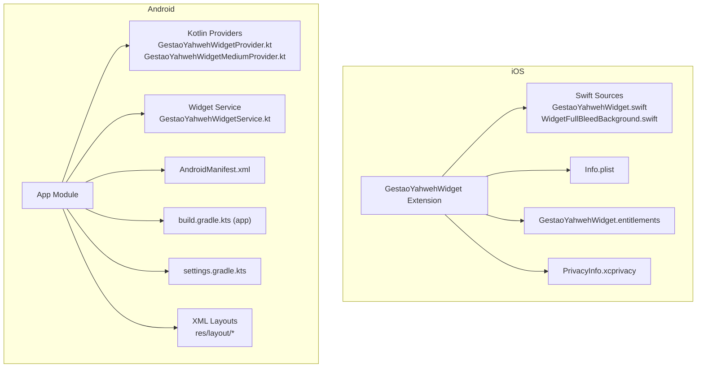
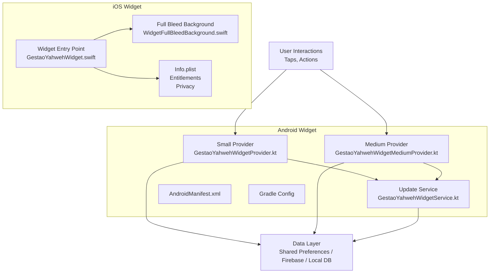
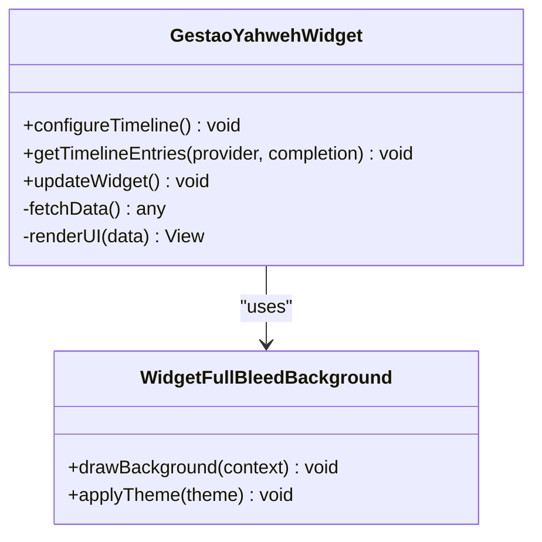
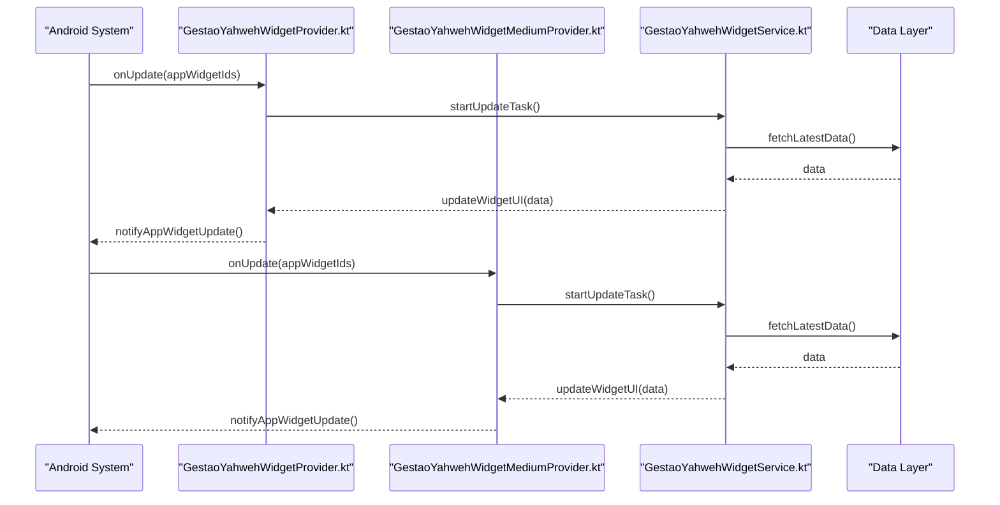
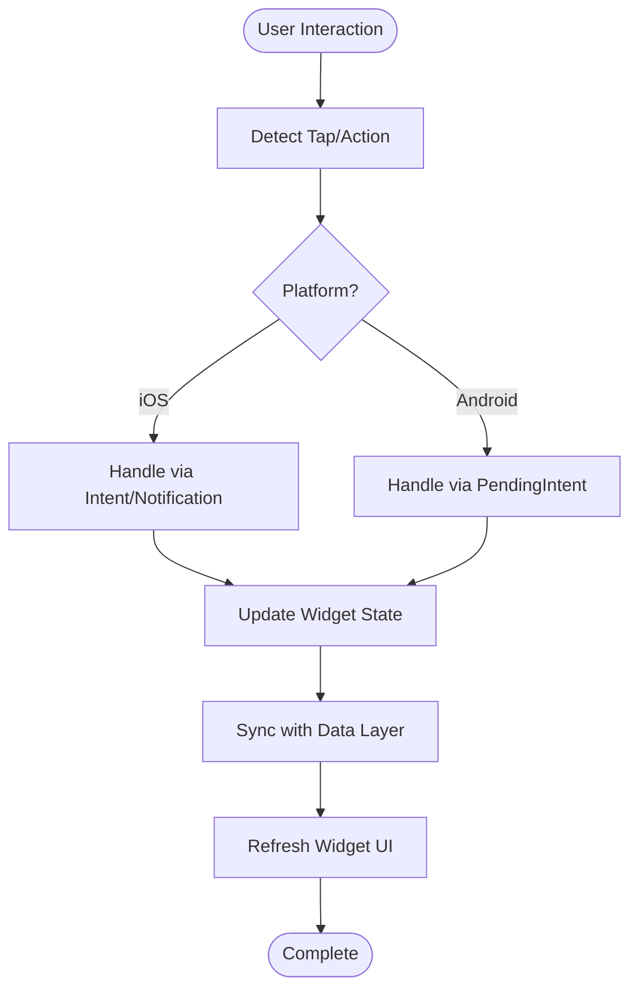
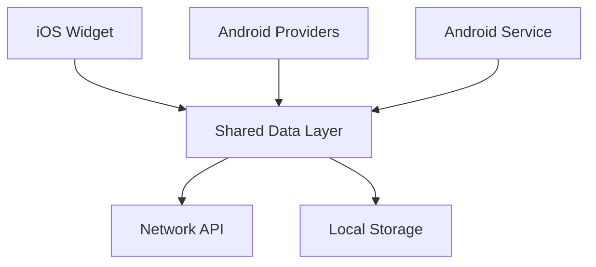

# Native Widgets & Extensions

<cite>
**Referenced Files in This Document**
- [GestaoYahwehWidget.swift](file://flutter_app/ios/GestaoYahwehWidget/GestaoYahwehWidget.swift)
- [WidgetFullBleedBackground.swift](file://flutter_app/ios/GestaoYahwehWidget/WidgetFullBleedBackground.swift)
- [Info.plist](file://flutter_app/ios/GestaoYahwehWidget/Info.plist)
- [GestaoYahwehWidget.entitlements](file://flutter_app/ios/GestaoYahwehWidget/GestaoYahwehWidget.entitlements)
- [PrivacyInfo.xcprivacy](file://flutter_app/ios/GestaoYahwehWidget/PrivacyInfo.xcprivacy)
- [GestaoYahwehWidgetProvider.kt](file://flutter_app/android/app/src/main/kotlin/com/example/gestao_yahweh/gestaoyahweh/app/GestaoYahwehWidgetProvider.kt)
- [GestaoYahwehWidgetMediumProvider.kt](file://flutter_app/android/app/src/main/kotlin/com/example/gestao_yahweh/gestaoyahweh/app/GestaoYahwehWidgetMediumProvider.kt)
- [GestaoYahwehWidgetService.kt](file://flutter_app/android/app/src/main/kotlin/com/example/gestao_yahweh/gestaoyahweh/app/GestaoYahwehWidgetService.kt)
- [AndroidManifest.xml](file://flutter_app/android/app/src/main/AndroidManifest.xml)
- [build.gradle.kts (app)](file://flutter_app/android/app/build.gradle.kts)
- [settings.gradle.kts](file://flutter_app/android/settings.gradle.kts)
- [LEIA-ME-WIDGET-IOS.md](file://widget/LEIA-ME-WIDGET-IOS.md)
</cite>

## Table of Contents
1. Introduction
2. Project Structure
3. Core Components
4. Architecture Overview
5. Detailed Component Analysis
6. Dependency Analysis
7. Performance Considerations
8. Troubleshooting Guide
9. Conclusion

## Introduction
This document provides comprehensive guidance for native widget implementations on iOS and Android within the Gestao Yahweh project. It covers:
- iOS: The GestaoYahwehWidget extension, Swift implementation, lifecycle, data synchronization, and background updates.
- Android: Home screen widgets using Kotlin providers, layout configurations, update mechanisms, user interactions, and state management.
- Cross-platform considerations: Data binding strategies, performance optimization, memory usage, battery efficiency, testing, and debugging approaches.

The goal is to help developers understand how widgets are structured, updated, and maintained efficiently on both platforms while integrating with the Flutter app’s data layer.

## Project Structure
The widget-related code resides in two primary locations:
- iOS: A dedicated widget extension under ios/GestaoYahwehWidget containing Swift sources, assets, and configuration files.
- Android: Native widget providers and services under android/app/src/main/kotlin and associated XML layouts and manifests.

**Diagram sources**
- [GestaoYahwehWidget.swift](file://flutter_app/ios/GestaoYahwehWidget/GestaoYahwehWidget.swift)
- [WidgetFullBleedBackground.swift](file://flutter_app/ios/GestaoYahwehWidget/WidgetFullBleedBackground.swift)
- [Info.plist](file://flutter_app/ios/GestaoYahwehWidget/Info.plist)
- [GestaoYahwehWidget.entitlements](file://flutter_app/ios/GestaoYahwehWidget/GestaoYahwehWidget.entitlements)
- [PrivacyInfo.xcprivacy](file://flutter_app/ios/GestaoYahwehWidget/PrivacyInfo.xcprivacy)
- [GestaoYahwehWidgetProvider.kt](file://flutter_app/android/app/src/main/kotlin/com/example/gestao_yahweh/gestaoyahweh/app/GestaoYahwehWidgetProvider.kt)
- [GestaoYahwehWidgetMediumProvider.kt](file://flutter_app/android/app/src/main/kotlin/com/example/gestao_yahweh/gestaoyahweh/app/GestaoYahwehWidgetMediumProvider.kt)
- [GestaoYahwehWidgetService.kt](file://flutter_app/android/app/src/main/kotlin/com/example/gestao_yahweh/gestaoyahweh/app/GestaoYahwehWidgetService.kt)
- [AndroidManifest.xml](file://flutter_app/android/app/src/main/AndroidManifest.xml)
- [build.gradle.kts (app)](file://flutter_app/android/app/build.gradle.kts)
- [settings.gradle.kts](file://flutter_app/android/settings.gradle.kts)

**Section sources**
- [LEIA-ME-WIDGET-IOS.md](file://widget/LEIA-ME-WIDGET-IOS.md)

## Core Components
Key components include:
- iOS Widget Extension: Swift-based widget providing UI rendering and lifecycle management.
- Android Widget Providers: Kotlin classes implementing AppWidgetProvider for different sizes/layouts.
- Android Widget Service: Background service handling updates and data fetching.
- Configuration Files: Info.plist, AndroidManifest.xml, Gradle settings, and entitlements that define capabilities and permissions.

These components collaborate to render widget UI, handle user interactions, and synchronize data from the app or backend.

**Section sources**
- [GestaoYahwehWidget.swift](file://flutter_app/ios/GestaoYahwehWidget/GestaoYahwehWidget.swift)
- [WidgetFullBleedBackground.swift](file://flutter_app/ios/GestaoYahwehWidget/WidgetFullBleedBackground.swift)
- [GestaoYahwehWidgetProvider.kt](file://flutter_app/android/app/src/main/kotlin/com/example/gestao_yahweh/gestaoyahweh/app/GestaoYahwehWidgetProvider.kt)
- [GestaoYahwehWidgetMediumProvider.kt](file://flutter_app/android/app/src/main/kotlin/com/example/gestao_yahweh/gestaoyahweh/app/GestaoYahwehWidgetMediumProvider.kt)
- [GestaoYahwehWidgetService.kt](file://flutter_app/android/app/src/main/kotlin/com/example/gestao_yahweh/gestaoyahweh/app/GestaoYahwehWidgetService.kt)
- [AndroidManifest.xml](file://flutter_app/android/app/src/main/AndroidManifest.xml)
- [build.gradle.kts (app)](file://flutter_app/android/app/build.gradle.kts)
- [settings.gradle.kts](file://flutter_app/android/settings.gradle.kts)

## Architecture Overview
The widget architecture separates UI rendering, data synchronization, and system integration across platforms.

**Diagram sources**
- [GestaoYahwehWidget.swift](file://flutter_app/ios/GestaoYahwehWidget/GestaoYahwehWidget.swift)
- [WidgetFullBleedBackground.swift](file://flutter_app/ios/GestaoYahwehWidget/WidgetFullBleedBackground.swift)
- [Info.plist](file://flutter_app/ios/GestaoYahwehWidget/Info.plist)
- [GestaoYahwehWidgetProvider.kt](file://flutter_app/android/app/src/main/kotlin/com/example/gestao_yahweh/gestaoyahweh/app/GestaoYahwehWidgetProvider.kt)
- [GestaoYahwehWidgetMediumProvider.kt](file://flutter_app/android/app/src/main/kotlin/com/example/gestao_yahweh/gestaoyahweh/app/GestaoYahwehWidgetMediumProvider.kt)
- [GestaoYahwehWidgetService.kt](file://flutter_app/android/app/src/main/kotlin/com/example/gestao_yahweh/gestaoyahweh/app/GestaoYahwehWidgetService.kt)
- [AndroidManifest.xml](file://flutter_app/android/app/src/main/AndroidManifest.xml)

## Detailed Component Analysis

### iOS Widget Extension: GestaoYahwehWidget
The iOS widget is implemented as a Swift extension that manages the widget lifecycle, renders UI, and synchronizes data. Key aspects include:
- Lifecycle Management: Handles widget timeline entries, updates, and background refreshes.
- Data Synchronization: Fetches and caches data from shared storage or network sources.
- UI Rendering: Uses SwiftUI or UIKit components to display dynamic content.
- Background Updates: Leverages iOS scheduling APIs to refresh widget content periodically.

**Diagram sources**
- [GestaoYahwehWidget.swift](file://flutter_app/ios/GestaoYahwehWidget/GestaoYahwehWidget.swift)
- [WidgetFullBleedBackground.swift](file://flutter_app/ios/GestaoYahwehWidget/WidgetFullBleedBackground.swift)

**Section sources**
- [GestaoYahwehWidget.swift](file://flutter_app/ios/GestaoYahwehWidget/GestaoYahwehWidget.swift)
- [WidgetFullBleedBackground.swift](file://flutter_app/ios/GestaoYahwehWidget/WidgetFullBleedBackground.swift)
- [Info.plist](file://flutter_app/ios/GestaoYahwehWidget/Info.plist)
- [GestaoYahwehWidget.entitlements](file://flutter_app/ios/GestaoYahwehWidget/GestaoYahwehWidget.entitlements)
- [PrivacyInfo.xcprivacy](file://flutter_app/ios/GestaoYahwehWidget/PrivacyInfo.xcprivacy)

### Android Widget Providers and Service
Android widgets use Kotlin providers to manage UI and updates. The service handles background tasks and data synchronization.

**Diagram sources**
- [GestaoYahwehWidgetProvider.kt](file://flutter_app/android/app/src/main/kotlin/com/example/gestao_yahweh/gestaoyahweh/app/GestaoYahwehWidgetProvider.kt)
- [GestaoYahwehWidgetMediumProvider.kt](file://flutter_app/android/app/src/main/kotlin/com/example/gestao_yahweh/gestaoyahweh/app/GestaoYahwehWidgetMediumProvider.kt)
- [GestaoYahwehWidgetService.kt](file://flutter_app/android/app/src/main/kotlin/com/example/gestao_yahweh/gestaoyahweh/app/GestaoYahwehWidgetService.kt)

**Section sources**
- [GestaoYahwehWidgetProvider.kt](file://flutter_app/android/app/src/main/kotlin/com/example/gestao_yahweh/gestaoyahweh/app/GestaoYahwehWidgetProvider.kt)
- [GestaoYahwehWidgetMediumProvider.kt](file://flutter_app/android/app/src/main/kotlin/com/example/gestao_yahweh/gestaoyahweh/app/GestaoYahwehWidgetMediumProvider.kt)
- [GestaoYahwehWidgetService.kt](file://flutter_app/android/app/src/main/kotlin/com/example/gestao_yahweh/gestaoyahweh/app/GestaoYahwehWidgetService.kt)
- [AndroidManifest.xml](file://flutter_app/android/app/src/main/AndroidManifest.xml)

### Widget Data Binding and User Interactions
Both platforms support data binding and user interaction handling:
- iOS: Uses SwiftUI bindings or UIKit delegates to update UI based on data changes and handle taps via intent URLs or notifications.
- Android: Implements PendingIntent for button clicks and uses RemoteViews to update widget UI dynamically.

**Section sources**
- [GestaoYahwehWidget.swift](file://flutter_app/ios/GestaoYahwehWidget/GestaoYahwehWidget.swift)
- [GestaoYahwehWidgetProvider.kt](file://flutter_app/android/app/src/main/kotlin/com/example/gestao_yahweh/gestaoyahweh/app/GestaoYahwehWidgetProvider.kt)

### Custom Widget Layouts and State Management
- iOS: Define custom layouts using SwiftUI views or XIB files, manage state with @State or ViewModel patterns.
- Android: Create XML layouts for different widget sizes, use SharedPreferences or Room database for persistent state.

**Section sources**
- [WidgetFullBleedBackground.swift](file://flutter_app/ios/GestaoYahwehWidget/WidgetFullBleedBackground.swift)
- [build.gradle.kts (app)](file://flutter_app/android/app/build.gradle.kts)

## Dependency Analysis
Widget components depend on shared data layers and system APIs for updates and interactions.

**Diagram sources**
- [GestaoYahwehWidget.swift](file://flutter_app/ios/GestaoYahwehWidget/GestaoYahwehWidget.swift)
- [GestaoYahwehWidgetProvider.kt](file://flutter_app/android/app/src/main/kotlin/com/example/gestao_yahweh/gestaoyahweh/app/GestaoYahwehWidgetProvider.kt)
- [GestaoYahwehWidgetService.kt](file://flutter_app/android/app/src/main/kotlin/com/example/gestao_yahweh/gestaoyahweh/app/GestaoYahwehWidgetService.kt)

**Section sources**
- [settings.gradle.kts](file://flutter_app/android/settings.gradle.kts)
- [build.gradle.kts (app)](file://flutter_app/android/app/build.gradle.kts)

## Performance Considerations
Optimize widget performance by:
- Minimizing data fetches and caching results locally.
- Using efficient UI rendering techniques (e.g., SwiftUI view reuse, RemoteViews optimization).
- Implementing background updates judiciously to conserve battery.
- Avoiding heavy computations during widget updates; offload to background threads.

[No sources needed since this section provides general guidance]

## Troubleshooting Guide
Common issues and solutions:
- iOS: Widget not updating due to missing entitlements or incorrect Info.plist configuration. Verify permissions and bundle identifiers.
- Android: Widget crashes on update due to null data or missing layouts. Ensure proper error handling and fallback UI.
- Debugging: Use Xcode Instruments for iOS and Android Studio Profiler for Android to monitor memory and CPU usage.

**Section sources**
- [Info.plist](file://flutter_app/ios/GestaoYahwehWidget/Info.plist)
- [AndroidManifest.xml](file://flutter_app/android/app/src/main/AndroidManifest.xml)

## Conclusion
This documentation outlines the structure, implementation, and best practices for native widgets on iOS and Android. By following these guidelines, developers can create efficient, responsive widgets that enhance user experience while maintaining optimal performance and battery life.

[No sources needed since this section summarizes without analyzing specific files]