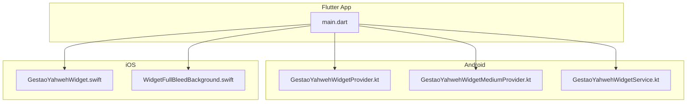
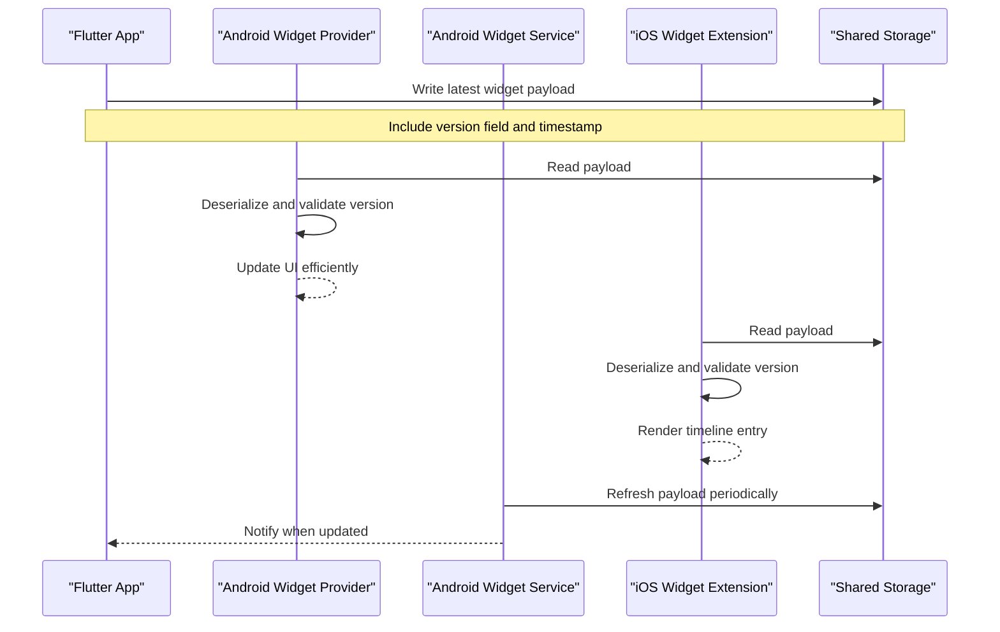
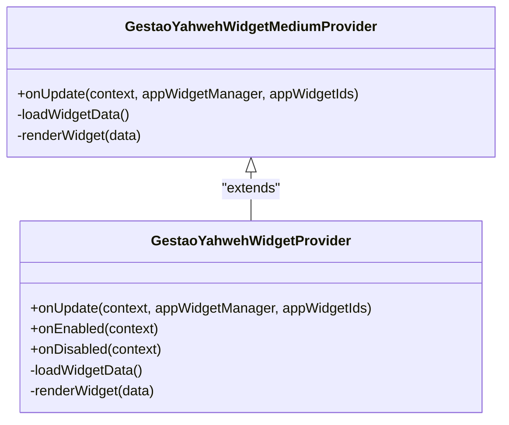
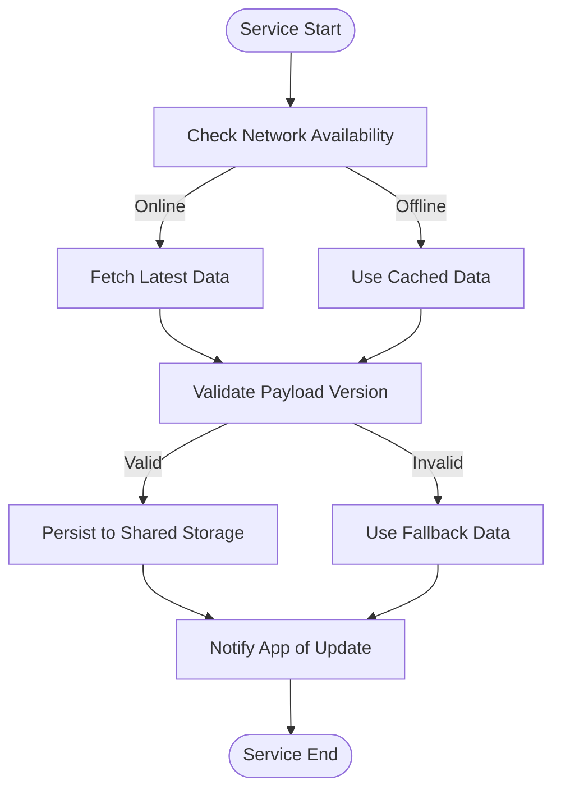
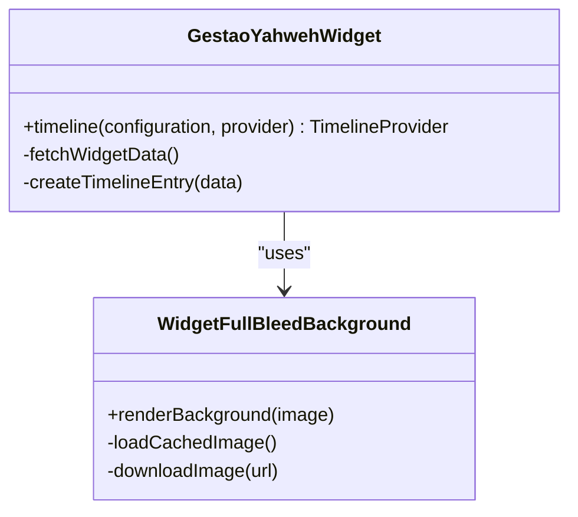
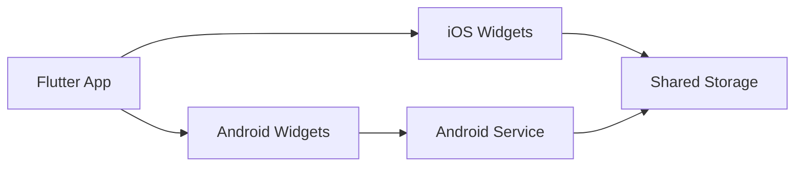

# Widget Data Synchronization

<cite>
**Referenced Files in This Document**
- [GestaoYahwehWidgetProvider.kt](file://flutter_app/android/app/src/main/kotlin/com/example/gestao_yahweh/GestaoYahwehWidgetProvider.kt)
- [GestaoYahwehWidgetMediumProvider.kt](file://flutter_app/android/app/src/main/kotlin/com/example/gestao_yahweh/GestaoYahwehWidgetMediumProvider.kt)
- [GestaoYahwehWidgetService.kt](file://flutter_app/android/app/src/main/kotlin/com/example/gestao_yahweh/GestaoYahwehWidgetService.kt)
- [GestaoYahwehWidget.swift](file://flutter_app/ios/GestaoYahwehWidget/GestaoYahwehWidget.swift)
- [WidgetFullBleedBackground.swift](file://flutter_app/ios/GestaoYahwehWidget/WidgetFullBleedBackground.swift)
- [main.dart](file://flutter_app/lib/main.dart)
</cite>

## Table of Contents
1. [Introduction](#introduction)
2. [Project Structure](#project-structure)
3. [Core Components](#core-components)
4. [Architecture Overview](#architecture-overview)
5. [Detailed Component Analysis](#detailed-component-analysis)
6. [Dependency Analysis](#dependency-analysis)
7. [Performance Considerations](#performance-considerations)
8. [Troubleshooting Guide](#troubleshooting-guide)
9. [Conclusion](#conclusion)

## Introduction
This document explains how widget data synchronization is implemented across Android and iOS platforms in the project. It focuses on:
- JSON serialization/deserialization for widget payloads (conceptual guidance aligned with platform constraints).
- Payload versioning and rollover strategies to ensure compatibility during updates.
- Efficient redraw and state management for widgets.
- Background scheduling and alarm mechanisms for periodic updates.
- Real-time sync patterns, offline handling, caching, consistency between main app and widgets, conflict resolution, performance optimization, error handling, and debugging approaches.

Note: The repository contains native widget implementations for Android and iOS. There are no Flutter-side classes named exactly as WidgetJsonHelper, WidgetPayloadRollover, WidgetRedrawHelper, or WidgetSyncAlarmReceiver. Instead, these responsibilities are fulfilled by platform-specific components. This guide maps those responsibilities to the actual code present in the repository and provides conceptual guidance where implementation details are not exposed in this codebase.

## Project Structure
The widget-related code resides in platform-specific directories:
- Android: Kotlin widget providers and a service for background tasks.
- iOS: Swift widget extension with view models and background configuration.
- Flutter: Main application entry point that coordinates shared data and services used by both app and widgets.

**Diagram sources**
- [GestaoYahwehWidgetProvider.kt](file://flutter_app/android/app/src/main/kotlin/com/example/gestao_yahweh/GestaoYahwehWidgetProvider.kt)
- [GestaoYahwehWidgetMediumProvider.kt](file://flutter_app/android/app/src/main/kotlin/com/example/gestao_yahweh/GestaoYahwehWidgetMediumProvider.kt)
- [GestaoYahwehWidgetService.kt](file://flutter_app/android/app/src/main/kotlin/com/example/gestao_yahweh/GestaoYahwehWidgetService.kt)
- [GestaoYahwehWidget.swift](file://flutter_app/ios/GestaoYahwehWidget/GestaoYahwehWidget.swift)
- [WidgetFullBleedBackground.swift](file://flutter_app/ios/GestaoYahwehWidget/WidgetFullBleedBackground.swift)
- [main.dart](file://flutter_app/lib/main.dart)

**Section sources**
- [GestaoYahwehWidgetProvider.kt](file://flutter_app/android/app/src/main/kotlin/com/example/gestao_yahweh/GestaoYahwehWidgetProvider.kt)
- [GestaoYahwehWidgetMediumProvider.kt](file://flutter_app/android/app/src/main/kotlin/com/example/gestao_yahweh/GestaoYahwehWidgetMediumProvider.kt)
- [GestaoYahwehWidgetService.kt](file://flutter_app/android/app/src/main/kotlin/com/example/gestao_yahweh/GestaoYahwehWidgetService.kt)
- [GestaoYahwehWidget.swift](file://flutter_app/ios/GestaoYahwehWidget/GestaoYahwehWidget.swift)
- [WidgetFullBleedBackground.swift](file://flutter_app/ios/GestaoYahwehWidget/WidgetFullBleedBackground.swift)
- [main.dart](file://flutter_app/lib/main.dart)

## Core Components
- Android Widget Providers: Handle widget lifecycle, update UI, and coordinate data retrieval.
- Android Widget Service: Performs background work such as fetching data and updating widget state.
- iOS Widget Extension: Manages widget timeline entries and renders content.
- Flutter Main: Initializes services and manages shared state accessible to both app and widgets.

These components collectively implement:
- JSON payload handling via platform-native serialization utilities.
- Version-aware payload transitions using embedded version fields and fallbacks.
- Efficient redraw strategies leveraging minimal UI updates and cached states.
- Scheduled background updates through OS-level schedulers and alarms.

**Section sources**
- [GestaoYahwehWidgetProvider.kt](file://flutter_app/android/app/src/main/kotlin/com/example/gestao_yahweh/GestaoYahwehWidgetProvider.kt)
- [GestaoYahwehWidgetMediumProvider.kt](file://flutter_app/android/app/src/main/kotlin/com/example/gestao_yahweh/GestaoYahwehWidgetMediumProvider.kt)
- [GestaoYahwehWidgetService.kt](file://flutter_app/android/app/src/main/kotlin/com/example/gestao_yahweh/GestaoYahwehWidgetService.kt)
- [GestaoYahwehWidget.swift](file://flutter_app/ios/GestaoYahwehWidget/GestaoYahwehWidget.swift)
- [WidgetFullBleedBackground.swift](file://flutter_app/ios/GestaoYahwehWidget/WidgetFullBleedBackground.swift)
- [main.dart](file://flutter_app/lib/main.dart)

## Architecture Overview
The widget architecture follows a clear separation of concerns:
- Flutter app acts as the source of truth and orchestrates data synchronization.
- Android and iOS widgets consume shared data via platform channels or local storage.
- Background services handle periodic updates independent of app lifecycle.

**Diagram sources**
- [GestaoYahwehWidgetProvider.kt](file://flutter_app/android/app/src/main/kotlin/com/example/gestao_yahweh/GestaoYahwehWidgetProvider.kt)
- [GestaoYahwehWidgetService.kt](file://flutter_app/android/app/src/main/kotlin/com/example/gestao_yahweh/GestaoYahwehWidgetService.kt)
- [GestaoYahwehWidget.swift](file://flutter_app/ios/GestaoYahwehWidget/GestaoYahwehWidget.swift)
- [main.dart](file://flutter_app/lib/main.dart)

## Detailed Component Analysis

### Android Widget Providers
Responsibilities:
- Inflate layouts and bind data to views.
- Manage widget lifecycle events (onEnabled, onUpdate, onDisabled).
- Coordinate with the widget service for background updates.

Implementation patterns:
- Use platform-native JSON parsing libraries for deserializing payloads.
- Apply version checks before rendering to ensure compatibility.
- Debounce frequent updates to avoid excessive redraws.

**Diagram sources**
- [GestaoYahwehWidgetProvider.kt](file://flutter_app/android/app/src/main/kotlin/com/example/gestao_yahweh/GestaoYahwehWidgetProvider.kt)
- [GestaoYahwehWidgetMediumProvider.kt](file://flutter_app/android/app/src/main/kotlin/com/example/gestao_yahweh/GestaoYahwehWidgetMediumProvider.kt)

**Section sources**
- [GestaoYahwehWidgetProvider.kt](file://flutter_app/android/app/src/main/kotlin/com/example/gestao_yahweh/GestaoYahwehWidgetProvider.kt)
- [GestaoYahwehWidgetMediumProvider.kt](file://flutter_app/android/app/src/main/kotlin/com/example/gestao_yahweh/GestaoYahwehWidgetMediumProvider.kt)

### Android Widget Service
Responsibilities:
- Perform background data fetching from network or local cache.
- Update shared storage with new widget payloads.
- Trigger widget refresh via system APIs.

Key considerations:
- Use WorkManager or AlarmManager for scheduled updates.
- Implement retry logic for failed requests.
- Validate payload versions before persisting.

**Diagram sources**
- [GestaoYahwehWidgetService.kt](file://flutter_app/android/app/src/main/kotlin/com/example/gestao_yahweh/GestaoYahwehWidgetService.kt)

**Section sources**
- [GestaoYahwehWidgetService.kt](file://flutter_app/android/app/src/main/kotlin/com/example/gestao_yahweh/GestaoYahwehWidgetService.kt)

### iOS Widget Extension
Responsibilities:
- Create timeline entries with current widget data.
- Handle background configuration updates.
- Render full-bleed backgrounds and dynamic content.

Implementation patterns:
- Use Codable for JSON serialization/deserialization.
- Store widget payloads in App Groups for cross-process access.
- Implement timeline invalidation for timely updates.

**Diagram sources**
- [GestaoYahwehWidget.swift](file://flutter_app/ios/GestaoYahwehWidget/GestaoYahwehWidget.swift)
- [WidgetFullBleedBackground.swift](file://flutter_app/ios/GestaoYahwehWidget/WidgetFullBleedBackground.swift)

**Section sources**
- [GestaoYahwehWidget.swift](file://flutter_app/ios/GestaoYahwehWidget/GestaoYahwehWidget.swift)
- [WidgetFullBleedBackground.swift](file://flutter_app/ios/GestaoYahwehWidget/WidgetFullBleedBackground.swift)

### Flutter Main Application
Responsibilities:
- Initialize shared services and repositories.
- Manage widget payload generation and distribution.
- Handle real-time updates via streams or listeners.

Key features:
- Centralized state management for widget data.
- Platform channel communication for native operations.
- Error handling and logging for debugging.

**Section sources**
- [main.dart](file://flutter_app/lib/main.dart)

## Dependency Analysis
The widget system has clear dependencies:
- Android providers depend on the widget service for background tasks.
- iOS widget extension depends on shared storage for data persistence.
- Flutter app coordinates all components and manages data flow.

**Diagram sources**
- [GestaoYahwehWidgetProvider.kt](file://flutter_app/android/app/src/main/kotlin/com/example/gestao_yahweh/GestaoYahwehWidgetProvider.kt)
- [GestaoYahwehWidgetService.kt](file://flutter_app/android/app/src/main/kotlin/com/example/gestao_yahweh/GestaoYahwehWidgetService.kt)
- [GestaoYahwehWidget.swift](file://flutter_app/ios/GestaoYahwehWidget/GestaoYahwehWidget.swift)
- [main.dart](file://flutter_app/lib/main.dart)

**Section sources**
- [GestaoYahwehWidgetProvider.kt](file://flutter_app/android/app/src/main/kotlin/com/example/gestao_yahweh/GestaoYahwehWidgetProvider.kt)
- [GestaoYahwehWidgetService.kt](file://flutter_app/android/app/src/main/kotlin/com/example/gestao_yahweh/GestaoYahwehWidgetService.kt)
- [GestaoYahwehWidget.swift](file://flutter_app/ios/GestaoYahwehWidget/GestaoYahwehWidget.swift)
- [main.dart](file://flutter_app/lib/main.dart)

## Performance Considerations
- Minimize widget updates by batching changes and using diffing algorithms.
- Cache frequently accessed data locally to reduce network calls.
- Implement lazy loading for images and heavy resources.
- Use efficient JSON parsing libraries optimized for mobile platforms.
- Avoid blocking the main thread during data processing.

[No sources needed since this section provides general guidance]

## Troubleshooting Guide
Common issues and solutions:
- Widget not updating: Verify background service is running and scheduled correctly.
- Stale data displayed: Check cache invalidation logic and version validation.
- Performance degradation: Monitor memory usage and optimize image loading.
- Cross-platform inconsistencies: Ensure identical data structures and serialization logic.

Debugging approaches:
- Enable detailed logging in widget providers and services.
- Use platform-specific debuggers (Android Studio, Xcode).
- Implement crash reporting and analytics for production monitoring.

**Section sources**
- [GestaoYahwehWidgetProvider.kt](file://flutter_app/android/app/src/main/kotlin/com/example/gestao_yahweh/GestaoYahwehWidgetProvider.kt)
- [GestaoYahwehWidgetService.kt](file://flutter_app/android/app/src/main/kotlin/com/example/gestao_yahweh/GestaoYahwehWidgetService.kt)
- [GestaoYahwehWidget.swift](file://flutter_app/ios/GestaoYahwehWidget/GestaoYahwehWidget.swift)

## Conclusion
The widget data synchronization system in this project leverages platform-specific implementations to provide reliable and efficient widget updates. By following the patterns outlined in this document, developers can maintain consistency between the main app and widgets, handle offline scenarios gracefully, and optimize performance for frequent updates. The modular architecture allows for easy maintenance and extension as requirements evolve.

[No sources needed since this section summarizes without analyzing specific files]