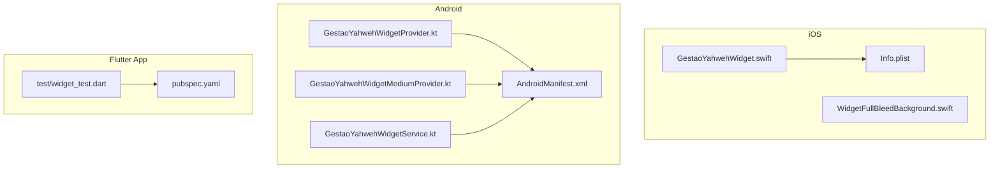
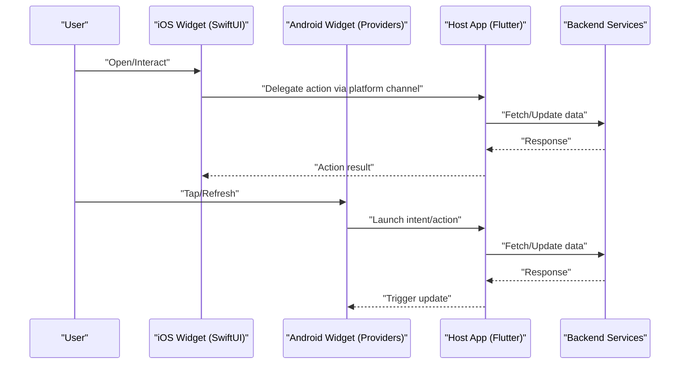
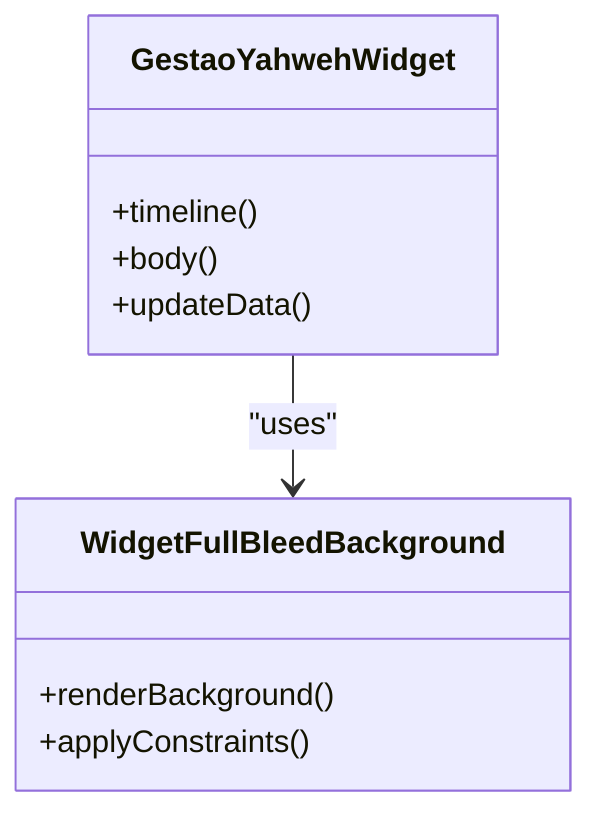
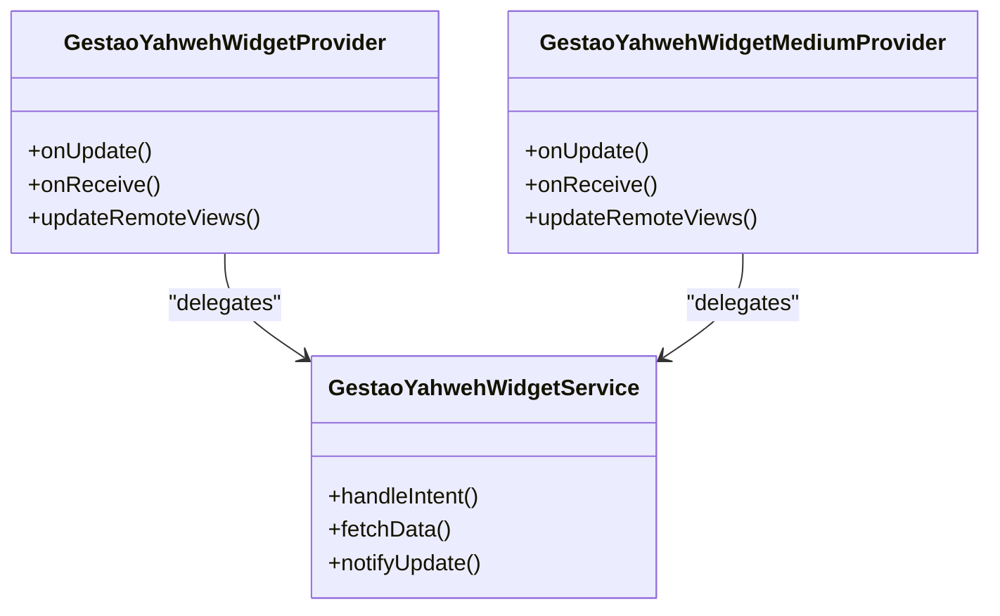
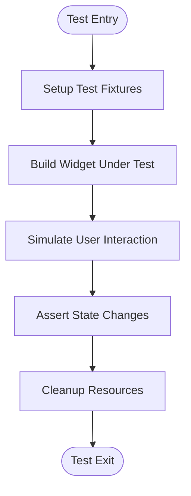
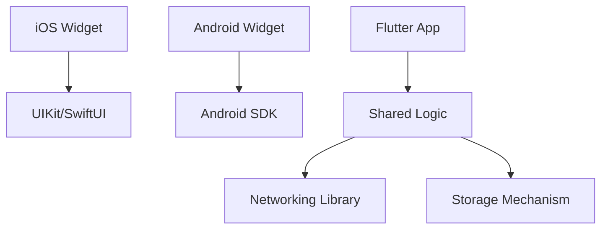

# Widget Testing & Debugging

<cite>
**Referenced Files in This Document**
- [GestaoYahwehWidget.swift](file://flutter_app/ios/GestaoYahwehWidget/GestaoYahwehWidget.swift)
- [WidgetFullBleedBackground.swift](file://flutter_app/ios/GestaoYahwehWidget/WidgetFullBleedBackground.swift)
- [Info.plist](file://flutter_app/ios/GestaoYahwehWidget/Info.plist)
- [GestaoYahwehWidgetProvider.kt](file://flutter_app/android/app/src/main/kotlin/com/example/gestao_yahweh/gestaoyahweh/app/GestaoYahwehWidgetProvider.kt)
- [GestaoYahwehWidgetMediumProvider.kt](file://flutter_app/android/app/src/main/kotlin/com/example/gestao_yahweh/gestaoyahweh/app/GestaoYahwehWidgetMediumProvider.kt)
- [GestaoYahwehWidgetService.kt](file://flutter_app/android/app/src/main/kotlin/com/example/gestao_yahweh/gestaoyahweh/app/GestaoYahwehWidgetService.kt)
- [AndroidManifest.xml](file://flutter_app/android/app/src/main/AndroidManifest.xml)
- [test/widget_test.dart](file://flutter_app/test/widget_test.dart)
- [pubspec.yaml](file://flutter_app/pubspec.yaml)
- [LEIA-ME-WIDGET-IOS.md](file://widget/LEIA-ME-WIDGET-IOS.md)
</cite>

## Table of Contents
1. [Introduction](#introduction)
2. [Project Structure](#project-structure)
3. [Core Components](#core-components)
4. [Architecture Overview](#architecture-overview)
5. [Detailed Component Analysis](#detailed-component-analysis)
6. [Dependency Analysis](#dependency-analysis)
7. [Performance Considerations](#performance-considerations)
8. [Troubleshooting Guide](#troubleshooting-guide)
9. [Conclusion](#conclusion)
10. [Appendices](#appendices)

## Introduction
This document provides a comprehensive guide to testing and debugging widgets on iOS and Android within the project. It covers unit testing for widget logic, view testing for UI components, integration testing for widget-app communication, and platform-specific debugging with Xcode and Android Studio. It also includes strategies for simulating user gestures, verifying behavior across states, performance profiling, memory leak detection, battery usage analysis, test fixtures, mocking external dependencies, automation in CI/CD, and common issues such as stale data, incorrect layouts, and performance bottlenecks.

## Project Structure
The widget implementation spans both native platforms:
- iOS: Swift-based widget extension with assets and configuration.
- Android: Kotlin-based widget providers and service with XML layouts and manifest declarations.
- Flutter app: Contains tests and configuration that interact with or reference widget functionality.

**Diagram sources**
- [GestaoYahwehWidget.swift](file://flutter_app/ios/GestaoYahwehWidget/GestaoYahwehWidget.swift)
- [WidgetFullBleedBackground.swift](file://flutter_app/ios/GestaoYahwehWidget/WidgetFullBleedBackground.swift)
- [Info.plist](file://flutter_app/ios/GestaoYahwehWidget/Info.plist)
- [GestaoYahwehWidgetProvider.kt](file://flutter_app/android/app/src/main/kotlin/com/example/gestao_yahweh/gestaoyahweh/app/GestaoYahwehWidgetProvider.kt)
- [GestaoYahwehWidgetMediumProvider.kt](file://flutter_app/android/app/src/main/kotlin/com/example/gestao_yahweh/gestaoyahweh/app/GestaoYahwehWidgetMediumProvider.kt)
- [GestaoYahwehWidgetService.kt](file://flutter_app/android/app/src/main/kotlin/com/example/gestao_yahweh/gestaoyahweh/app/GestaoYahwehWidgetService.kt)
- [AndroidManifest.xml](file://flutter_app/android/app/src/main/AndroidManifest.xml)
- [test/widget_test.dart](file://flutter_app/test/widget_test.dart)
- [pubspec.yaml](file://flutter_app/pubspec.yaml)

**Section sources**
- [GestaoYahwehWidget.swift](file://flutter_app/ios/GestaoYahwehWidget/GestaoYahwehWidget.swift)
- [WidgetFullBleedBackground.swift](file://flutter_app/ios/GestaoYahwehWidget/WidgetFullBleedBackground.swift)
- [Info.plist](file://flutter_app/ios/GestaoYahwehWidget/Info.plist)
- [GestaoYahwehWidgetProvider.kt](file://flutter_app/android/app/src/main/kotlin/com/example/gestao_yahweh/gestaoyahweh/app/GestaoYahwehWidgetProvider.kt)
- [GestaoYahwehWidgetMediumProvider.kt](file://flutter_app/android/app/src/main/kotlin/com/example/gestao_yahweh/gestaoyahweh/app/GestaoYahwehWidgetMediumProvider.kt)
- [GestaoYahwehWidgetService.kt](file://flutter_app/android/app/src/main/kotlin/com/example/gestao_yahweh/gestaoyahweh/app/GestaoYahwehWidgetService.kt)
- [AndroidManifest.xml](file://flutter_app/android/app/src/main/AndroidManifest.xml)
- [test/widget_test.dart](file://flutter_app/test/widget_test.dart)
- [pubspec.yaml](file://flutter_app/pubspec.yaml)

## Core Components
- iOS Widget Extension: Implements widget lifecycle and rendering using SwiftUI.
- Android Widget Providers and Service: Manages widget updates and interactions via RemoteViews and background tasks.
- Flutter Tests: Unit and widget tests under the Flutter test directory validate logic and UI behavior.

Key responsibilities:
- Data fetching and caching for widget content.
- Rendering static or dynamic views within platform constraints.
- Handling user interactions and delegating actions to the host app.

**Section sources**
- [GestaoYahwehWidget.swift](file://flutter_app/ios/GestaoYahwehWidget/GestaoYahwehWidget.swift)
- [WidgetFullBleedBackground.swift](file://flutter_app/ios/GestaoYahwehWidget/WidgetFullBleedBackground.swift)
- [GestaoYahwehWidgetProvider.kt](file://flutter_app/android/app/src/main/kotlin/com/example/gestao_yahweh/gestaoyahweh/app/GestaoYahwehWidgetProvider.kt)
- [GestaoYahwehWidgetMediumProvider.kt](file://flutter_app/android/app/src/main/kotlin/com/example/gestao_yahweh/gestaoyahweh/app/GestaoYahwehWidgetMediumProvider.kt)
- [GestaoYahwehWidgetService.kt](file://flutter_app/android/app/src/main/kotlin/com/example/gestao_yahweh/gestaoyahweh/app/GestaoYahwehWidgetService.kt)
- [test/widget_test.dart](file://flutter_app/test/widget_test.dart)

## Architecture Overview
The widget architecture separates platform-specific implementations from shared Flutter logic. Widgets fetch data through services and update their UI accordingly. Interactions are routed back to the main app via platform channels or intents/deep links.

[No sources needed since this diagram shows conceptual workflow, not actual code structure]

## Detailed Component Analysis

### iOS Widget Component Analysis
The iOS widget is implemented in Swift and uses SwiftUI for layout and state management. The widget extension defines entry points, timelines, and background updates.

**Diagram sources**
- [GestaoYahwehWidget.swift](file://flutter_app/ios/GestaoYahwehWidget/GestaoYahwehWidget.swift)
- [WidgetFullBleedBackground.swift](file://flutter_app/ios/GestaoYahwehWidget/WidgetFullBleedBackground.swift)

Testing approach:
- Unit tests for widget logic: Validate data transformations, timeline entries, and state changes without rendering UI.
- View tests for UI components: Use XCTest and SwiftUI testing utilities to assert layout and interactions.
- Integration tests: Simulate widget refresh cycles and verify data consistency with mock services.

Debugging techniques:
- Xcode Preview: Iterate quickly on SwiftUI layouts.
- Xcode Instruments: Profile CPU, GPU, and memory during widget updates.
- Logging and breakpoints: Inspect lifecycle methods and data flows.

Common issues:
- Stale data: Ensure proper cache invalidation and timeline updates.
- Incorrect layouts: Verify constraints and safe area handling.
- Performance bottlenecks: Optimize heavy computations and network calls.

**Section sources**
- [GestaoYahwehWidget.swift](file://flutter_app/ios/GestaoYahwehWidget/GestaoYahwehWidget.swift)
- [WidgetFullBleedBackground.swift](file://flutter_app/ios/GestaoYahwehWidget/WidgetFullBleedBackground.swift)
- [Info.plist](file://flutter_app/ios/GestaoYahwehWidget/Info.plist)

### Android Widget Component Analysis
Android widgets use Kotlin providers and a service to manage updates and interactions. Layouts are defined in XML, and updates are applied via RemoteViews.

**Diagram sources**
- [GestaoYahwehWidgetProvider.kt](file://flutter_app/android/app/src/main/kotlin/com/example/gestao_yahweh/gestaoyahweh/app/GestaoYahwehWidgetProvider.kt)
- [GestaoYahwehWidgetMediumProvider.kt](file://flutter_app/android/app/src/main/kotlin/com/example/gestao_yahweh/gestaoyahweh/app/GestaoYahwehWidgetMediumProvider.kt)
- [GestaoYahwehWidgetService.kt](file://flutter_app/android/app/src/main/kotlin/com/example/gestao_yahweh/gestaoyahweh/app/GestaoYahwehWidgetService.kt)

Testing approach:
- Unit tests for provider logic: Validate update cycles and intent handling.
- View tests for RemoteViews: Use Espresso or Robolectric to simulate widget rendering and interactions.
- Integration tests: Test widget-app communication via intents and shared preferences.

Debugging techniques:
- Android Studio Debugger: Set breakpoints in providers and service.
- Logcat: Monitor widget lifecycle and errors.
- Layout Inspector: Verify RemoteViews hierarchy and properties.

Common issues:
- Stale data: Implement robust caching and periodic updates.
- Incorrect layouts: Check XML constraints and density-independent scaling.
- Performance bottlenecks: Minimize work in onUpdate and offload to background threads.

**Section sources**
- [GestaoYahwehWidgetProvider.kt](file://flutter_app/android/app/src/main/kotlin/com/example/gestao_yahweh/gestaoyahweh/app/GestaoYahwehWidgetProvider.kt)
- [GestaoYahwehWidgetMediumProvider.kt](file://flutter_app/android/app/src/main/kotlin/com/example/gestao_yahweh/gestaoyahweh/app/GestaoYahwehWidgetMediumProvider.kt)
- [GestaoYahwehWidgetService.kt](file://flutter_app/android/app/src/main/kotlin/com/example/gestao_yahweh/gestaoyahweh/app/GestaoYahwehWidgetService.kt)
- [AndroidManifest.xml](file://flutter_app/android/app/src/main/AndroidManifest.xml)

### Flutter Widget Tests
Flutter tests under the test directory validate widget logic and UI behavior. These tests can simulate user interactions and verify state changes.

**Diagram sources**
- [test/widget_test.dart](file://flutter_app/test/widget_test.dart)
- [pubspec.yaml](file://flutter_app/pubspec.yaml)

Testing approach:
- Unit tests: Isolate business logic and data transformations.
- Widget tests: Render widgets in isolation and assert UI elements.
- Integration tests: Test full widget flow including backend interactions.

Debugging techniques:
- Flutter DevTools: Inspect widget tree and performance.
- Logging: Add debug prints to trace execution paths.
- Mocking: Use packages like Mockito or Mocktail to simulate dependencies.

Common issues:
- Stale data: Ensure proper state management and reactivity.
- Incorrect layouts: Use responsive design patterns and assertions.
- Performance bottlenecks: Optimize rebuilds and avoid unnecessary computations.

**Section sources**
- [test/widget_test.dart](file://flutter_app/test/widget_test.dart)
- [pubspec.yaml](file://flutter_app/pubspec.yaml)

## Dependency Analysis
Widgets depend on platform-specific frameworks and shared Flutter logic. Dependencies include networking libraries, storage mechanisms, and UI frameworks.

[No sources needed since this diagram shows conceptual workflow, not actual code structure]

**Section sources**
- [GestaoYahwehWidget.swift](file://flutter_app/ios/GestaoYahwehWidget/GestaoYahwehWidget.swift)
- [GestaoYahwehWidgetProvider.kt](file://flutter_app/android/app/src/main/kotlin/com/example/gestao_yahweh/gestaoyahweh/app/GestaoYahwehWidgetProvider.kt)
- [test/widget_test.dart](file://flutter_app/test/widget_test.dart)

## Performance Considerations
- iOS: Use Instruments to profile CPU, GPU, and memory. Optimize SwiftUI rendering by minimizing recompositions.
- Android: Monitor widget updates with Android Studio Profiler. Avoid heavy operations in onUpdate.
- Flutter: Use DevTools to analyze widget rebuilds and memory usage. Implement efficient state management.

Best practices:
- Cache data locally to reduce network calls.
- Use background tasks for long-running operations.
- Optimize images and resources for faster loading.

[No sources needed since this section provides general guidance]

## Troubleshooting Guide
Common issues and solutions:
- Stale data: Implement cache invalidation and periodic updates.
- Incorrect layouts: Verify constraints and responsive design.
- Performance bottlenecks: Profile and optimize critical paths.
- Memory leaks: Use memory profilers and fix retain cycles.
- Battery usage: Minimize frequent updates and optimize network calls.

Debugging tools:
- Xcode: Breakpoints, logs, and Instruments.
- Android Studio: Debugger, Logcat, and Profiler.
- Flutter: DevTools and logging.

**Section sources**
- [GestaoYahwehWidget.swift](file://flutter_app/ios/GestaoYahwehWidget/GestaoYahwehWidget.swift)
- [GestaoYahwehWidgetProvider.kt](file://flutter_app/android/app/src/main/kotlin/com/example/gestao_yahweh/gestaoyahweh/app/GestaoYahwehWidgetProvider.kt)
- [test/widget_test.dart](file://flutter_app/test/widget_test.dart)

## Conclusion
Effective widget testing and debugging require a combination of unit, view, and integration tests across platforms. Utilize platform-specific tools like Xcode and Android Studio for debugging and profiling. Implement robust caching, error handling, and performance optimizations to ensure reliable widget behavior. Automate tests in CI/CD pipelines to maintain quality and catch issues early.

[No sources needed since this section summarizes without analyzing specific files]

## Appendices
- Best practices for CI/CD: Integrate automated tests and builds for widgets.
- Examples of test fixtures: Create reusable data and mock services.
- Automation strategies: Use scripts to run tests and generate reports.

**Section sources**
- [LEIA-ME-WIDGET-IOS.md](file://widget/LEIA-ME-WIDGET-IOS.md)