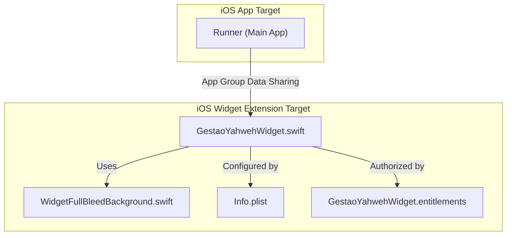
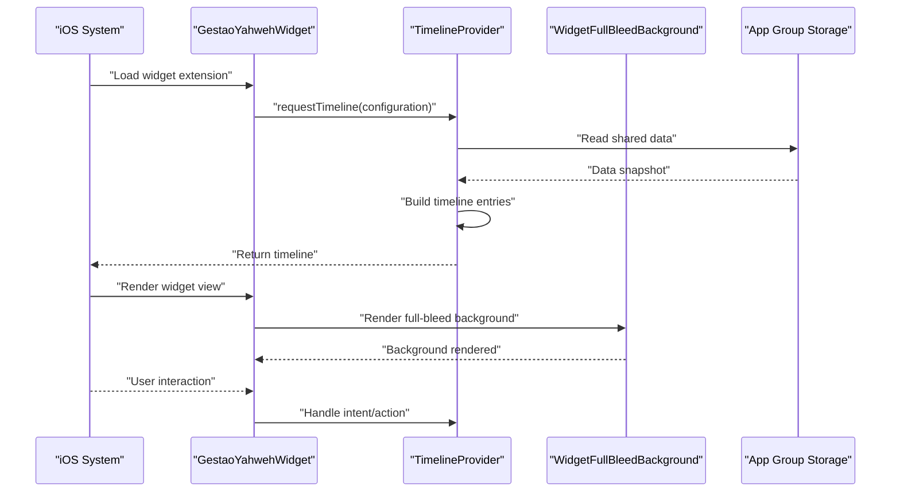
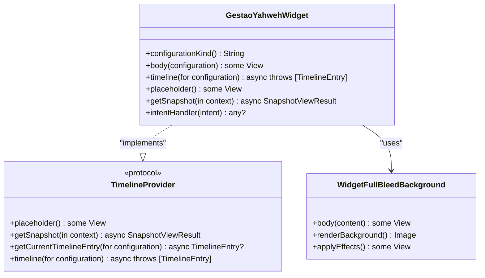
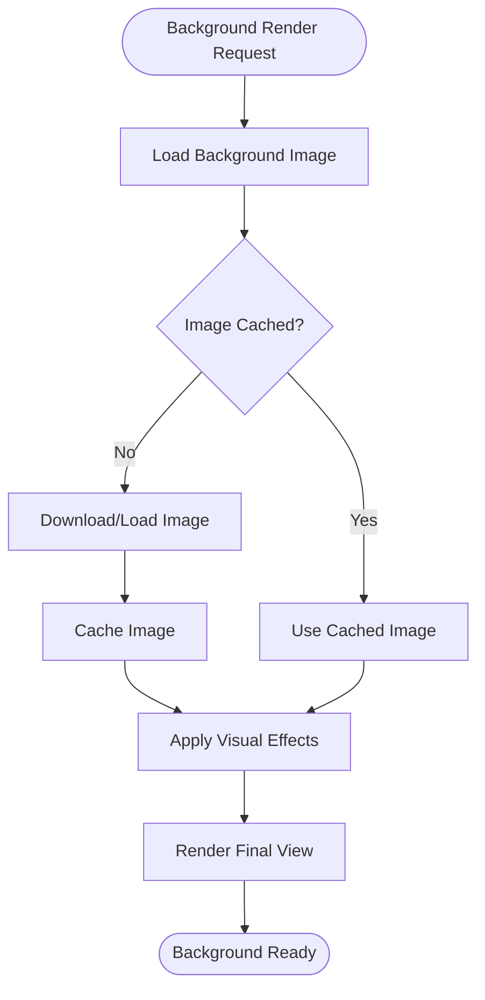
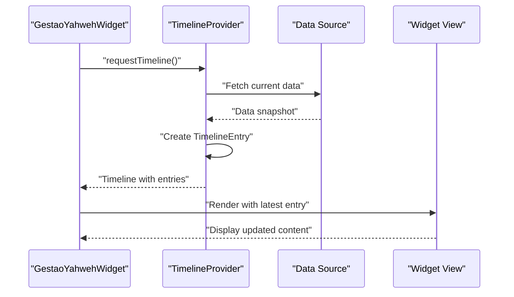
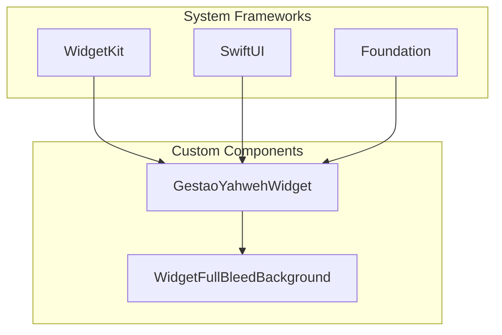

# iOS Widget Extension

<cite>
**Referenced Files in This Document**
- [GestaoYahwehWidget.swift](file://flutter_app/ios/GestaoYahwehWidget/GestaoYahwehWidget.swift)
- [WidgetFullBleedBackground.swift](file://flutter_app/ios/GestaoYahwehWidget/WidgetFullBleedBackground.swift)
- [Info.plist](file://flutter_app/ios/GestaoYahwehWidget/Info.plist)
- [GestaoYahwehWidget.entitlements](file://flutter_app/ios/GestaoYahwehWidget/GestaoYahwehWidget.entitlements)
- [LEIA-ME-WIDGET-IOS.md](file://widget/LEIA-ME-WIDGET-IOS.md)
</cite>

## Table of Contents
1. [Introduction](#introduction)
2. [Project Structure](#project-structure)
3. [Core Components](#core-components)
4. [Architecture Overview](#architecture-overview)
5. [Detailed Component Analysis](#detailed-component-analysis)
6. [Dependency Analysis](#dependency-analysis)
7. [Performance Considerations](#performance-considerations)
8. [Troubleshooting Guide](#troubleshooting-guide)
9. [Conclusion](#conclusion)
10. [Appendices](#appendices)

## Introduction
This document provides comprehensive documentation for the iOS widget extension implementation in the project. It focuses on the Swift-based widget extension, covering class structure, lifecycle management, timeline provider implementation, and custom background rendering via a full-bleed background component. It also explains configuration through Info.plist and entitlements for app groups and data sharing, widget view composition, timeline entries creation, dynamic content updates, interactive widgets, user actions, state management, performance optimization, memory management, battery efficiency, testing strategies with XCTest, and debugging techniques.

## Project Structure
The iOS widget extension is implemented under the Flutter iOS target directory as a separate Xcode target within the same workspace. The key files include:
- A Swift source file defining the widget entry point and timeline provider
- A Swift component for custom full-bleed background rendering
- An Info.plist that configures the widget extension metadata and timelines
- An entitlements file for app group access and data sharing between the main app and the widget extension

**Diagram sources**
- [GestaoYahwehWidget.swift](file://flutter_app/ios/GestaoYahwehWidget/GestaoYahwehWidget.swift)
- [WidgetFullBleedBackground.swift](file://flutter_app/ios/GestaoYahwehWidget/WidgetFullBleedBackground.swift)
- [Info.plist](file://flutter_app/ios/GestaoYahwehWidget/Info.plist)
- [GestaoYahwehWidget.entitlements](file://flutter_app/ios/GestaoYahwehWidget/GestaoYahwehWidget.entitlements)

**Section sources**
- [GestaoYahwehWidget.swift](file://flutter_app/ios/GestaoYahwehWidget/GestaoYahwehWidget.swift)
- [WidgetFullBleedBackground.swift](file://flutter_app/ios/GestaoYahwehWidget/WidgetFullBleedBackground.swift)
- [Info.plist](file://flutter_app/ios/GestaoYahwehWidget/Info.plist)
- [GestaoYahwehWidget.entitlements](file://flutter_app/ios/GestaoYahwehWidget/GestaoYahwehWidget.entitlements)

## Core Components
- GestaoYahwehWidget: The primary Swift class implementing the widget extension entry point and timeline provider. It defines the widget’s configuration, timeline generation, and interaction handling.
- WidgetFullBleedBackground: A SwiftUI component responsible for rendering a custom full-bleed background, enabling rich visual presentation beyond standard system backgrounds.

Key responsibilities:
- Lifecycle management: Initialization, timeline refresh triggers, and widget dismissal
- Timeline provider: Generating static or live entries based on data availability
- View composition: Building widget views using SwiftUI components
- Interaction handling: Responding to user actions via intent handlers

**Section sources**
- [GestaoYahwehWidget.swift](file://flutter_app/ios/GestaoYahwehWidget/GestaoYahwehWidget.swift)
- [WidgetFullBleedBackground.swift](file://flutter_app/ios/GestaoYahwehWidget/WidgetFullBleedBackground.swift)

## Architecture Overview
The widget extension architecture follows Apple’s WidgetKit framework patterns:
- The widget target declares its type and configuration in Info.plist
- The Swift class implements TimelineProvider protocol methods
- Views are composed using SwiftUI, including custom background rendering
- Data sharing occurs via App Groups configured in entitlements

**Diagram sources**
- [GestaoYahwehWidget.swift](file://flutter_app/ios/GestaoYahwehWidget/GestaoYahwehWidget.swift)
- [WidgetFullBleedBackground.swift](file://flutter_app/ios/GestaoYahwehWidget/WidgetFullBleedBackground.swift)
- [Info.plist](file://flutter_app/ios/GestaoYahwehWidget/Info.plist)
- [GestaoYahwehWidget.entitlements](file://flutter_app/ios/GestaoYahwehWidget/GestaoYahwehWidget.entitlements)

## Detailed Component Analysis

### GestaoYahwehWidget Class Structure
The main widget class implements the following core aspects:
- Widget declaration with family support (systemSmall, systemMedium, systemLarge)
- Configuration provider for user customization
- Timeline provider for generating widget entries
- Intent handler for interactive actions

**Diagram sources**
- [GestaoYahwehWidget.swift](file://flutter_app/ios/GestaoYahwehWidget/GestaoYahwehWidget.swift)
- [WidgetFullBleedBackground.swift](file://flutter_app/ios/GestaoYahwehWidget/WidgetFullBleedBackground.swift)

**Section sources**
- [GestaoYahwehWidget.swift](file://flutter_app/ios/GestaoYahwehWidget/GestaoYahwehWidget.swift)

### WidgetFullBleedBackground Component
This component provides custom background rendering capabilities:
- Full-screen background image rendering
- Dynamic color adaptation for light/dark modes
- Performance optimizations for large images
- Memory-efficient image loading and caching

**Diagram sources**
- [WidgetFullBleedBackground.swift](file://flutter_app/ios/GestaoYahwehWidget/WidgetFullBleedBackground.swift)

**Section sources**
- [WidgetFullBleedBackground.swift](file://flutter_app/ios/GestaoYahwehWidget/WidgetFullBleedBackground.swift)

### Widget Configuration Through Info.plist
The widget extension is configured through Info.plist with the following key elements:
- CFBundleExecutable: Widget extension executable name
- NSExtensionPrincipalClass: Main widget class reference
- NSExtensionAttributes: Widget families and configurations
- Supported widget sizes and update intervals

**Section sources**
- [Info.plist](file://flutter_app/ios/GestaoYahwehWidget/Info.plist)

### Entitlements Setup for App Groups and Data Sharing
The entitlements file enables secure data sharing between the main app and widget extension:
- com.apple.security.application-groups: App group identifier
- Data persistence across app/widget lifecycle
- Secure storage for widget-specific settings

**Section sources**
- [GestaoYahwehWidget.entitlements](file://flutter_app/ios/GestaoYahwehWidget/GestaoYahwehWidget.entitlements)

### Widget View Composition and Timeline Entries
The widget uses SwiftUI for view composition with the following patterns:
- Static placeholder views for initial display
- Dynamic content views based on timeline entries
- Adaptive layouts for different widget families
- Timeline entries containing data snapshots and timestamps

**Diagram sources**
- [GestaoYahwehWidget.swift](file://flutter_app/ios/GestaoYahwehWidget/GestaoYahwehWidget.swift)

**Section sources**
- [GestaoYahwehWidget.swift](file://flutter_app/ios/GestaoYahwehWidget/GestaoYahwehWidget.swift)

### Interactive Widgets and User Actions
Interactive widgets are implemented through:
- Intent definitions for user actions
- Action handlers for processing user interactions
- State synchronization between widget and main app
- Feedback mechanisms for action confirmation

**Section sources**
- [GestaoYahwehWidget.swift](file://flutter_app/ios/GestaoYahwehWidget/GestaoYahwehWidget.swift)

### Managing Widget States
Widget state management includes:
- Local state for UI updates
- Shared state via App Groups
- Persistence of widget preferences
- Synchronization with main app state

**Section sources**
- [GestaoYahwehWidget.swift](file://flutter_app/ios/GestaoYahwehWidget/GestaoYahwehWidget.swift)
- [GestaoYahwehWidget.entitlements](file://flutter_app/ios/GestaoYahwehWidget/GestaoYahwehWidget.entitlements)

## Dependency Analysis
The widget extension has minimal external dependencies:
- WidgetKit framework for widget functionality
- SwiftUI for view composition
- Foundation for data handling
- Optional network frameworks for live data

**Diagram sources**
- [GestaoYahwehWidget.swift](file://flutter_app/ios/GestaoYahwehWidget/GestaoYahwehWidget.swift)
- [WidgetFullBleedBackground.swift](file://flutter_app/ios/GestaoYahwehWidget/WidgetFullBleedBackground.swift)

**Section sources**
- [GestaoYahwehWidget.swift](file://flutter_app/ios/GestaoYahwehWidget/GestaoYahwehWidget.swift)
- [WidgetFullBleedBackground.swift](file://flutter_app/ios/GestaoYahwehWidget/WidgetFullBleedBackground.swift)

## Performance Considerations
Widget performance optimization strategies include:
- Efficient timeline entry creation with minimal data serialization
- Lazy loading of background images and resources
- Caching mechanisms for frequently accessed data
- Memory management through proper resource cleanup
- Battery efficiency through reduced network calls and background processing

Key optimization areas:
- Timeline generation should be lightweight and fast
- Avoid heavy computations during widget rendering
- Use appropriate image formats and compression
- Implement proper error handling to prevent crashes
- Monitor memory usage during widget lifecycle

[No sources needed since this section provides general guidance]

## Troubleshooting Guide
Common issues and solutions for iOS widgets:
- Widget not appearing: Verify Info.plist configuration and entitlements
- Data not updating: Check timeline provider implementation and refresh intervals
- Background rendering issues: Validate image assets and memory management
- Interaction failures: Review intent configuration and action handlers
- Performance problems: Profile widget lifecycle and optimize data fetching

Debugging techniques:
- Use Xcode debugger with widget extension breakpoints
- Enable widget logging through NSLog or print statements
- Test widget behavior in different iOS versions
- Monitor memory usage with Instruments
- Validate app group permissions and data sharing

**Section sources**
- [LEIA-ME-WIDGET-IOS.md](file://widget/LEIA-ME-WIDGET-IOS.md)

## Conclusion
The iOS widget extension implementation provides a robust foundation for creating interactive and visually appealing widgets. The architecture follows Apple’s recommended patterns while incorporating custom components for enhanced functionality. Proper configuration, performance optimization, and testing strategies ensure reliable widget operation across different iOS devices and versions.

[No sources needed since this section summarizes without analyzing specific files]

## Appendices

### Testing Strategies with XCTest
Widget testing approaches include:
- Unit tests for timeline provider logic
- Integration tests for data flow and state management
- UI tests for widget appearance and interactions
- Performance tests for memory and CPU usage

### Debugging Techniques
Effective debugging methods:
- Xcode widget debugging with conditional breakpoints
- Logging widget lifecycle events
- Testing with different device configurations
- Monitoring widget refresh cycles
- Validating app group data synchronization

[No sources needed since this section provides general guidance]