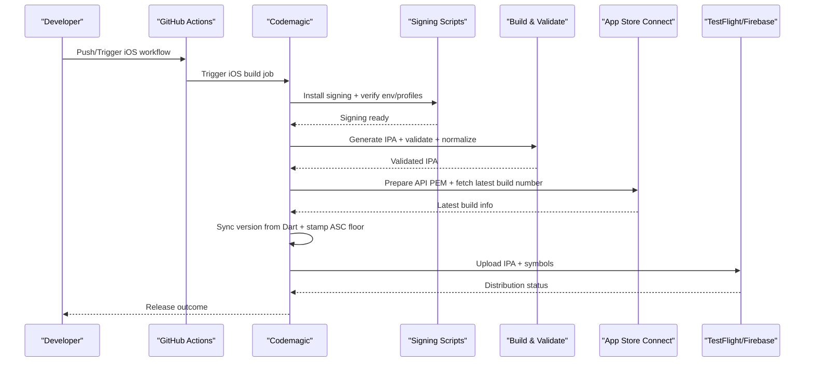
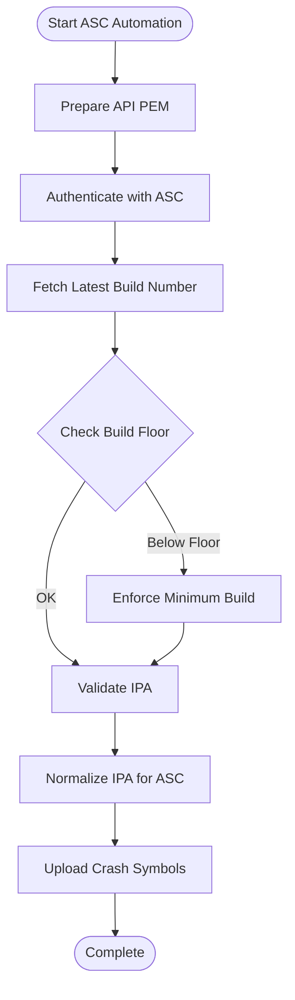
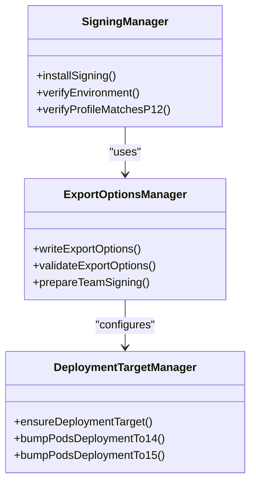
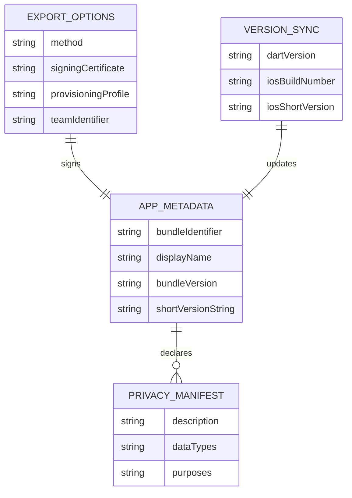
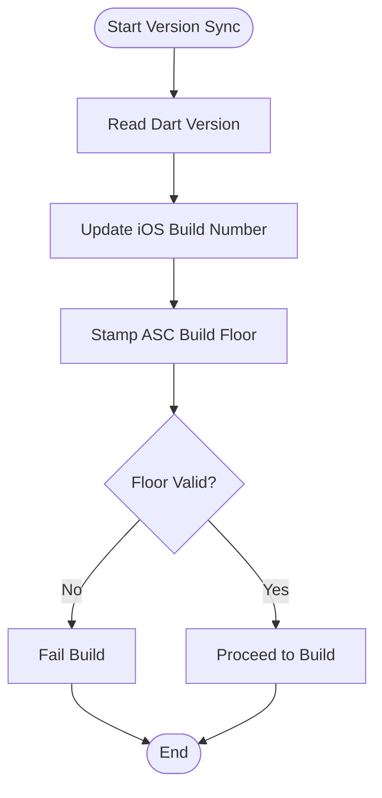
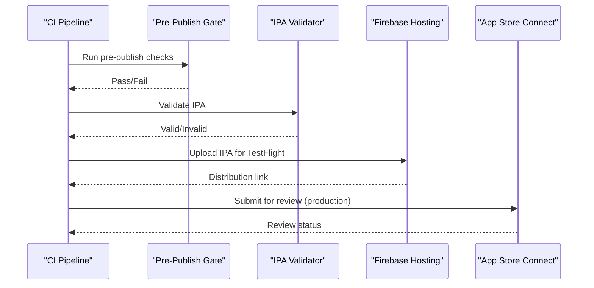
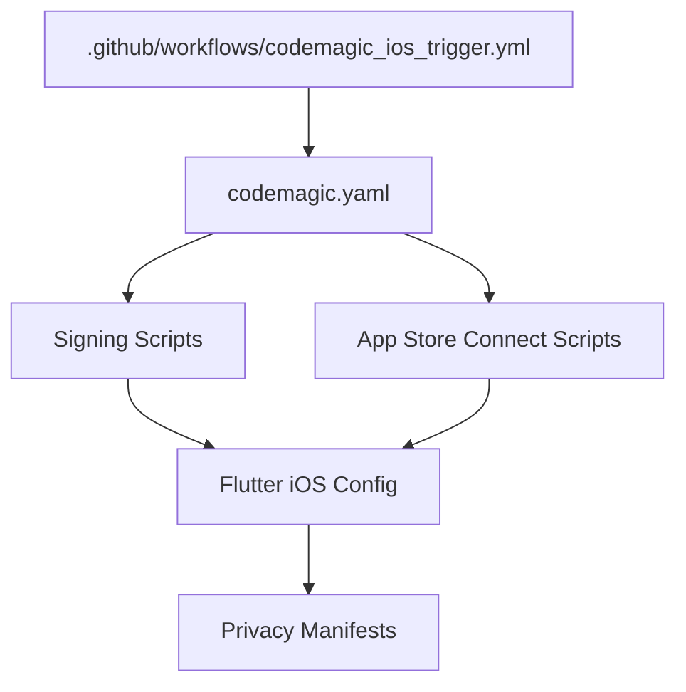

# App Store Integration

<cite>
**Referenced Files in This Document**
- [codemagic.yaml](file://codemagic.yaml)
- [flutter_app/codemagic.yaml](file://flutter_app/codemagic.yaml)
- [.github/workflows/codemagic_ios_trigger.yml](file://.github/workflows/codemagic_ios_trigger.yml)
- [IOS/CODEMAGIC_APP_STORE_INTEGRATION.txt](file://IOS/CODEMAGIC_APP_STORE_INTEGRATION.txt)
- [IOS/CODEMAGIC_FETCH_CONFIG.txt](file://IOS/CODEMAGIC_FETCH_CONFIG.txt)
- [IOS/APP_STORE_3_1_1_ORGANIZATION_SIGNUP.md](file://IOS/APP_STORE_3_1_1_ORGANIZATION_SIGNUP.md)
- [IOS/app_store_connect_issuer_id.txt](file://IOS/app_store_connect_issuer_id.txt)
- [IOS/CREDENCIAIS_APPLE_ATUAL.txt](file://IOS/CREDENCIAIS_APPLE_ATUAL.txt)
- [IOS/prepare_codemagic_paste_from_bootstrap.ps1](file://IOS/prepare_codemagic_paste_from_bootstrap.ps1)
- [scripts/codemagic_ios_asc_api.py](file://scripts/codemagic_ios_asc_api.py)
- [scripts/codemagic_ios_asc_latest_build_number.sh](file://scripts/codemagic_ios_asc_latest_build_number.sh)
- [scripts/codemagic_ios_read_asc_floor.sh](file://scripts/codemagic_ios_read_asc_floor.sh)
- [scripts/codemagic_ios_stamp_asc_floor.sh](file://scripts/codemagic_ios_stamp_asc_floor.sh)
- [scripts/codemagic_ios_prepare_api_pem.sh](file://scripts/codemagic_ios_prepare_api_pem.sh)
- [scripts/codemagic_ios_install_signing.sh](file://scripts/codemagic_ios_install_signing.sh)
- [scripts/codemagic_ios_install_signing_api_only.sh](file://scripts/codemagic_ios_install_signing_api_only.sh)
- [scripts/codemagic_ios_validate_export_options.py](file://scripts/codemagic_ios_validate_export_options.py)
- [scripts/codemagic_ios_write_export_options.py](file://scripts/codemagic_ios_write_export_options.py)
- [scripts/codemagic_ios_verify_env_apple_and_signing.sh](file://scripts/codemagic_ios_verify_env_apple_and_signing.sh)
- [scripts/codemagic_ios_verify_profile_matches_p12.sh](file://scripts/codemagic_ios_verify_profile_matches_p12.sh)
- [scripts/codemagic_ios_upload_crashlytics_dsyms.sh](file://scripts/codemagic_ios_upload_crashlytics_dsyms.sh)
- [scripts/codemagic_ios_sync_version_from_app_version_dart.sh](file://scripts/codemagic_ios_sync_version_from_app_version_dart.sh)
- [scripts/codemagic_ios_normalize_ipa_for_asc.sh](file://scripts/codemagic_ios_normalize_ipa_for_asc.sh)
- [scripts/codemagic_ios_pre_publish_90189_gate.sh](file://scripts/codemagic_ios_pre_publish_90189_gate.sh)
- [scripts/codemagic_ios_enable_push_notifications.py](file://scripts/codemagic_ios_enable_push_notifications.py)
- [scripts/codemagic_ios_enable_sign_in_with_apple.py](file://scripts/codemagic_ios_enable_sign_in_with_apple.py)
- [scripts/codemagic_ios_enable_app_groups.py](file://scripts/codemagic_ios_enable_app_groups.py)
- [scripts/codemagic_ios_ensure_widget_appstore_profile.py](file://scripts/codemagic_ios_ensure_widget_appstore_profile.py)
- [scripts/codemagic_ios_delete_appstore_profiles.py](file://scripts/codemagic_ios_delete_appstore_profiles.py)
- [scripts/codemagic_ios_profile_utils.py](file://scripts/codemagic_ios_profile_utils.py)
- [scripts/codemagic_ios_fetch_profile_matching_p12.sh](file://scripts/codemagic_ios_fetch_profile_matching_p12.sh)
- [scripts/codemagic_ios_remove_old_appstore_profiles.sh](file://scripts/codemagic_ios_remove_old_appstore_profiles.sh)
- [scripts/codemagic_ios_bump_pods_deployment_to_14.sh](file://scripts/codemagic_ios_bump_pods_deployment_to_14.sh)
- [scripts/codemagic_ios_bump_pods_deployment_to_15.sh](file://scripts/codemagic_ios_bump_pods_deployment_to_15.sh)
- [scripts/codemagic_ios_ensure_deployment_target_15.sh](file://scripts/codemagic_ios_ensure_deployment_target_15.sh)
- [scripts/codemagic_ios_cp_ipa_safe.sh](file://scripts/codemagic_ios_cp_ipa_safe.sh)
- [scripts/codemagic_ios_pod_install.sh](file://scripts/codemagic_ios_pod_install.sh)
- [scripts/codemagic_ios_team_signing_prepare_exportoptions.sh](file://scripts/codemagic_ios_team_signing_prepare_exportoptions.sh)
- [scripts/codemagic_ios_validate_ipa_before_upload.sh](file://scripts/codemagic_ios_validate_ipa_before_upload.sh)
- [scripts/codemagic_ios_p12_password_helpers.sh](file://scripts/codemagic_ios_p12_password_helpers.sh)
- [scripts/codemagic_ios_register_app_groups_via_xcode.sh](file://scripts/codemagic_ios_register_app_groups_via_xcode.sh)
- [scripts/codemagic_ios_verify_widget_profile.py](file://scripts/codemagic_ios_verify_widget_profile.py)
- [scripts/codemagic_publish_ipa_to_firebase.js](file://scripts/codemagic_publish_ipa_to_firebase.js)
- [flutter_app/ios/Runner/Info.plist](file://flutter_app/ios/Runner/Info.plist)
- [flutter_app/ios/Runner/PrivacyInfo.xcprivacy](file://flutter_app/ios/Runner/PrivacyInfo.xcprivacy)
- [flutter_app/ios/GestaoYahwehWidget/PrivacyInfo.xcprivacy](file://flutter_app/ios/GestaoYahwehWidget/PrivacyInfo.xcprivacy)
- [flutter_app/ios/ExportOptions.plist](file://flutter_app/ios/ExportOptions.plist)
- [flutter_app/ios/asc_build_number_floor.txt](file://flutter_app/ios/asc_build_number_floor.txt)
- [flutter_app/lib/app_version.dart](file://flutter_app/lib/app_version.dart)
- [flutter_app/pubspec.yaml](file://flutter_app/pubspec.yaml)
</cite>

## Table of Contents
1. [Introduction](#introduction)
2. [Project Structure](#project-structure)
3. [Core Components](#core-components)
4. [Architecture Overview](#architecture-overview)
5. [Detailed Component Analysis](#detailed-component-analysis)
6. [Dependency Analysis](#dependency-analysis)
7. [Performance Considerations](#performance-considerations)
8. [Troubleshooting Guide](#troubleshooting-guide)
9. [Conclusion](#conclusion)
10. [Appendices](#appendices)

## Introduction
This document explains how the project integrates with Apple App Store Connect and automates iOS builds, signing, metadata updates, TestFlight distribution, and production releases. It also covers privacy manifest configuration, data safety declarations, compliance requirements, and automation patterns for versioning and submission workflows. The content is grounded in the repository’s CI/CD scripts, Apple-related configuration files, and Flutter app settings.

## Project Structure
The iOS/App Store integration spans several areas:
- CI orchestration at the repository root and within the Flutter app directory
- GitHub Actions trigger for iOS builds
- A comprehensive set of scripts under scripts/ to manage App Store Connect API, signing, export options, and publishing
- iOS-specific configuration and privacy manifests inside flutter_app/ios
- Version synchronization between Dart code and build artifacts

```mermaid
graph TB
subgraph "CI Orchestration"
CM["codemagic.yaml"]
GHA[".github/workflows/codemagic_ios_trigger.yml"]
end
subgraph "App Store Connect Automation"
ASC_API["scripts/codemagic_ios_asc_api.py"]
ASC_BUILD["scripts/codemagic_ios_asc_latest_build_number.sh"]
ASC_FLOOR_READ["scripts/codemagic_ios_read_asc_floor.sh"]
ASC_FLOOR_STAMP["scripts/codemagic_ios_stamp_asc_floor.sh"]
ASC_PREP_PEM["scripts/codemagic_ios_prepare_api_pem.sh"]
ASC_VALIDATE_IPA["scripts/codemagic_ios_validate_ipa_before_upload.sh"]
ASC_NORMALIZE_IPA["scripts/codemagic_ios_normalize_ipa_for_asc.sh"]
ASC_UPLOAD_CRASHLYTICS["scripts/codemagic_ios_upload_crashlytics_dsyms.sh"]
end
subgraph "Signing & Export"
INSTALL_SIGNING["scripts/codemagic_ios_install_signing.sh"]
INSTALL_SIGNING_API["scripts/codemagic_ios_install_signing_api_only.sh"]
VERIFY_ENV["scripts/codemagic_ios_verify_env_apple_and_signing.sh"]
VERIFY_PROFILE["scripts/codemagic_ios_verify_profile_matches_p12.sh"]
WRITE_EXPORT["scripts/codemagic_ios_write_export_options.py"]
VALIDATE_EXPORT["scripts/codemagic_ios_validate_export_options.py"]
TEAM_EXPORT["scripts/codemagic_ios_team_signing_prepare_exportoptions.sh"]
end
subgraph "Flutter iOS App"
INFO_PLIST["flutter_app/ios/Runner/Info.plist"]
PRIVACY_RUNNER["flutter_app/ios/Runner/PrivacyInfo.xcprivacy"]
PRIVACY_WIDGET["flutter_app/ios/GestaoYahwehWidget/PrivacyInfo.xcprivacy"]
EXPORT_OPTIONS["flutter_app/ios/ExportOptions.plist"]
ASC_FLOOR_FILE["flutter_app/ios/asc_build_number_floor.txt"]
APP_VERSION_DART["flutter_app/lib/app_version.dart"]
PUBSPEC["flutter_app/pubspec.yaml"]
end
CM --> GHA
CM --> INSTALL_SIGNING
CM --> INSTALL_SIGNING_API
CM --> VERIFY_ENV
CM --> VERIFY_PROFILE
CM --> WRITE_EXPORT
CM --> VALIDATE_EXPORT
CM --> TEAM_EXPORT
CM --> ASC_PREP_PEM
CM --> ASC_API
CM --> ASC_BUILD
CM --> ASC_FLOOR_READ
CM --> ASC_FLOOR_STAMP
CM --> ASC_VALIDATE_IPA
CM --> ASC_NORMALIZE_IPA
CM --> ASC_UPLOAD_CRASHLYTICS
INSTALL_SIGNING --> EXPORT_OPTIONS
WRITE_EXPORT --> EXPORT_OPTIONS
VALIDATE_EXPORT --> EXPORT_OPTIONS
ASC_PREP_PEM --> ASC_API
ASC_API --> ASC_BUILD
ASC_BUILD --> ASC_FLOOR_READ
ASC_FLOOR_READ --> ASC_FLOOR_STAMP
ASC_FLOOR_STAMP --> ASC_FLOOR_FILE
ASC_VALIDATE_IPA --> ASC_NORMALIZE_IPA
ASC_NORMALIZE_IPA --> ASC_UPLOAD_CRASHLYTICS
INFO_PLIST --> EXPORT_OPTIONS
PRIVACY_RUNNER --> EXPORT_OPTIONS
PRIVACY_WIDGET --> EXPORT_OPTIONS
PUBSPEC --> APP_VERSION_DART
APP_VERSION_DART --> EXPORT_OPTIONS
```

**Diagram sources**
- [codemagic.yaml](file://codemagic.yaml)
- [.github/workflows/codemagic_ios_trigger.yml](file://.github/workflows/codemagic_ios_trigger.yml)
- [scripts/codemagic_ios_asc_api.py](file://scripts/codemagic_ios_asc_api.py)
- [scripts/codemagic_ios_asc_latest_build_number.sh](file://scripts/codemagic_ios_asc_latest_build_number.sh)
- [scripts/codemagic_ios_read_asc_floor.sh](file://scripts/codemagic_ios_read_asc_floor.sh)
- [scripts/codemagic_ios_stamp_asc_floor.sh](file://scripts/codemagic_ios_stamp_asc_floor.sh)
- [scripts/codemagic_ios_prepare_api_pem.sh](file://scripts/codemagic_ios_prepare_api_pem.sh)
- [scripts/codemagic_ios_install_signing.sh](file://scripts/codemagic_ios_install_signing.sh)
- [scripts/codemagic_ios_install_signing_api_only.sh](file://scripts/codemagic_ios_install_signing_api_only.sh)
- [scripts/codemagic_ios_validate_export_options.py](file://scripts/codemagic_ios_validate_export_options.py)
- [scripts/codemagic_ios_write_export_options.py](file://scripts/codemagic_ios_write_export_options.py)
- [scripts/codemagic_ios_verify_env_apple_and_signing.sh](file://scripts/codemagic_ios_verify_env_apple_and_signing.sh)
- [scripts/codemagic_ios_verify_profile_matches_p12.sh](file://scripts/codemagic_ios_verify_profile_matches_p12.sh)
- [scripts/codemagic_ios_upload_crashlytics_dsyms.sh](file://scripts/codemagic_ios_upload_crashlytics_dsyms.sh)
- [scripts/codemagic_ios_sync_version_from_app_version_dart.sh](file://scripts/codemagic_ios_sync_version_from_app_version_dart.sh)
- [scripts/codemagic_ios_normalize_ipa_for_asc.sh](file://scripts/codemagic_ios_normalize_ipa_for_asc.sh)
- [scripts/codemagic_ios_pre_publish_90189_gate.sh](file://scripts/codemagic_ios_pre_publish_90189_gate.sh)
- [flutter_app/ios/Runner/Info.plist](file://flutter_app/ios/Runner/Info.plist)
- [flutter_app/ios/Runner/PrivacyInfo.xcprivacy](file://flutter_app/ios/Runner/PrivacyInfo.xcprivacy)
- [flutter_app/ios/GestaoYahwehWidget/PrivacyInfo.xcprivacy](file://flutter_app/ios/GestaoYahwehWidget/PrivacyInfo.xcprivacy)
- [flutter_app/ios/ExportOptions.plist](file://flutter_app/ios/ExportOptions.plist)
- [flutter_app/ios/asc_build_number_floor.txt](file://flutter_app/ios/asc_build_number_floor.txt)
- [flutter_app/lib/app_version.dart](file://flutter_app/lib/app_version.dart)
- [flutter_app/pubspec.yaml](file://flutter_app/pubspec.yaml)

**Section sources**
- [codemagic.yaml](file://codemagic.yaml)
- [flutter_app/codemagic.yaml](file://flutter_app/codemagic.yaml)
- [.github/workflows/codemagic_ios_trigger.yml](file://.github/workflows/codemagic_ios_trigger.yml)

## Core Components
- CI orchestration: Codemagic YAML defines build, test, and publish stages; GitHub Actions triggers Codemagic jobs for iOS.
- App Store Connect API automation: Python and shell scripts prepare API credentials, fetch latest build numbers, enforce floor constraints, validate IPAs, normalize artifacts, and upload symbols.
- Signing and export: Scripts install signing assets (API-only or full), verify environment and profile matching, generate and validate ExportOptions, and ensure deployment targets.
- Flutter app configuration: Info.plist, PrivacyInfo.xcprivacy files define app metadata and privacy declarations; ExportOptions.plist controls signing/export behavior; version sync aligns Dart version with build artifacts.

Key responsibilities:
- Ensure consistent versioning across Dart and iOS artifacts
- Automate App Store Connect interactions securely via API keys and profiles
- Validate IPA integrity and compliance before upload
- Manage privacy manifests and data safety declarations

**Section sources**
- [codemagic.yaml](file://codemagic.yaml)
- [flutter_app/codemagic.yaml](file://flutter_app/codemagic.yaml)
- [scripts/codemagic_ios_asc_api.py](file://scripts/codemagic_ios_asc_api.py)
- [scripts/codemagic_ios_install_signing.sh](file://scripts/codemagic_ios_install_signing.sh)
- [scripts/codemagic_ios_write_export_options.py](file://scripts/codemagic_ios_write_export_options.py)
- [flutter_app/ios/Runner/Info.plist](file://flutter_app/ios/Runner/Info.plist)
- [flutter_app/ios/Runner/PrivacyInfo.xcprivacy](file://flutter_app/ios/Runner/PrivacyInfo.xcprivacy)
- [flutter_app/ios/ExportOptions.plist](file://flutter_app/ios/ExportOptions.plist)
- [flutter_app/lib/app_version.dart](file://flutter_app/lib/app_version.dart)

## Architecture Overview
The iOS release pipeline orchestrates multiple phases:
- Trigger: GitHub Actions invokes Codemagic for iOS builds
- Setup: Install signing assets, prepare API PEM, verify environment and profiles
- Build: Generate IPA using ExportOptions, validate artifact, normalize for App Store Connect
- Metadata: Sync version from Dart, read/stamp ASC build number floor, update metadata as needed
- Distribution: Upload to Firebase/TestFlight, push symbols, gate pre-publish checks
- Compliance: Ensure privacy manifests are present and correct

**Diagram sources**
- [.github/workflows/codemagic_ios_trigger.yml](file://.github/workflows/codemagic_ios_trigger.yml)
- [codemagic.yaml](file://codemagic.yaml)
- [scripts/codemagic_ios_install_signing.sh](file://scripts/codemagic_ios_install_signing.sh)
- [scripts/codemagic_ios_verify_env_apple_and_signing.sh](file://scripts/codemagic_ios_verify_env_apple_and_signing.sh)
- [scripts/codemagic_ios_validate_ipa_before_upload.sh](file://scripts/codemagic_ios_validate_ipa_before_upload.sh)
- [scripts/codemagic_ios_normalize_ipa_for_asc.sh](file://scripts/codemagic_ios_normalize_ipa_for_asc.sh)
- [scripts/codemagic_ios_prepare_api_pem.sh](file://scripts/codemagic_ios_prepare_api_pem.sh)
- [scripts/codemagic_ios_asc_latest_build_number.sh](file://scripts/codemagic_ios_asc_latest_build_number.sh)
- [scripts/codemagic_ios_sync_version_from_app_version_dart.sh](file://scripts/codemagic_ios_sync_version_from_app_version_dart.sh)
- [scripts/codemagic_ios_upload_crashlytics_dsyms.sh](file://scripts/codemagic_ios_upload_crashlytics_dsyms.sh)

## Detailed Component Analysis

### App Store Connect API Automation
Purpose:
- Securely authenticate with App Store Connect using API keys
- Fetch latest build numbers and enforce minimum build floors
- Validate and normalize IPAs for upload
- Upload crash symbols

Key scripts:
- Prepare API PEM: Converts secrets into a usable PEM format for API calls
- ASC API client: Interacts with App Store Connect endpoints
- Latest build number: Retrieves current build metadata
- Floor management: Reads and stamps minimum build constraints
- Validation and normalization: Ensures IPA integrity and compatibility
- Symbol upload: Sends dSYM files for crash reporting

**Diagram sources**
- [scripts/codemagic_ios_prepare_api_pem.sh](file://scripts/codemagic_ios_prepare_api_pem.sh)
- [scripts/codemagic_ios_asc_api.py](file://scripts/codemagic_ios_asc_api.py)
- [scripts/codemagic_ios_asc_latest_build_number.sh](file://scripts/codemagic_ios_asc_latest_build_number.sh)
- [scripts/codemagic_ios_read_asc_floor.sh](file://scripts/codemagic_ios_read_asc_floor.sh)
- [scripts/codemagic_ios_stamp_asc_floor.sh](file://scripts/codemagic_ios_stamp_asc_floor.sh)
- [scripts/codemagic_ios_validate_ipa_before_upload.sh](file://scripts/codemagic_ios_validate_ipa_before_upload.sh)
- [scripts/codemagic_ios_normalize_ipa_for_asc.sh](file://scripts/codemagic_ios_normalize_ipa_for_asc.sh)
- [scripts/codemagic_ios_upload_crashlytics_dsyms.sh](file://scripts/codemagic_ios_upload_crashlytics_dsyms.sh)

**Section sources**
- [scripts/codemagic_ios_asc_api.py](file://scripts/codemagic_ios_asc_api.py)
- [scripts/codemagic_ios_asc_latest_build_number.sh](file://scripts/codemagic_ios_asc_latest_build_number.sh)
- [scripts/codemagic_ios_read_asc_floor.sh](file://scripts/codemagic_ios_read_asc_floor.sh)
- [scripts/codemagic_ios_stamp_asc_floor.sh](file://scripts/codemagic_ios_stamp_asc_floor.sh)
- [scripts/codemagic_ios_prepare_api_pem.sh](file://scripts/codemagic_ios_prepare_api_pem.sh)
- [scripts/codemagic_ios_validate_ipa_before_upload.sh](file://scripts/codemagic_ios_validate_ipa_before_upload.sh)
- [scripts/codemagic_ios_normalize_ipa_for_asc.sh](file://scripts/codemagic_ios_normalize_ipa_for_asc.sh)
- [scripts/codemagic_ios_upload_crashlytics_dsyms.sh](file://scripts/codemagic_ios_upload_crashlytics_dsyms.sh)

### Signing and Export Options Management
Purpose:
- Install and verify signing assets (profiles, certificates, API keys)
- Generate and validate ExportOptions.plist for consistent builds
- Ensure deployment targets and pod configurations meet requirements

Key scripts:
- Install signing (full or API-only mode)
- Verify environment and profile matching against P12
- Write and validate ExportOptions
- Team signing preparation
- Deployment target enforcement and pod bumps

**Diagram sources**
- [scripts/codemagic_ios_install_signing.sh](file://scripts/codemagic_ios_install_signing.sh)
- [scripts/codemagic_ios_install_signing_api_only.sh](file://scripts/codemagic_ios_install_signing_api_only.sh)
- [scripts/codemagic_ios_verify_env_apple_and_signing.sh](file://scripts/codemagic_ios_verify_env_apple_and_signing.sh)
- [scripts/codemagic_ios_verify_profile_matches_p12.sh](file://scripts/codemagic_ios_verify_profile_matches_p12.sh)
- [scripts/codemagic_ios_write_export_options.py](file://scripts/codemagic_ios_write_export_options.py)
- [scripts/codemagic_ios_validate_export_options.py](file://scripts/codemagic_ios_validate_export_options.py)
- [scripts/codemagic_ios_team_signing_prepare_exportoptions.sh](file://scripts/codemagic_ios_team_signing_prepare_exportoptions.sh)
- [scripts/codemagic_ios_ensure_deployment_target_15.sh](file://scripts/codemagic_ios_ensure_deployment_target_15.sh)
- [scripts/codemagic_ios_bump_pods_deployment_to_14.sh](file://scripts/codemagic_ios_bump_pods_deployment_to_14.sh)
- [scripts/codemagic_ios_bump_pods_deployment_to_15.sh](file://scripts/codemagic_ios_bump_pods_deployment_to_15.sh)

**Section sources**
- [scripts/codemagic_ios_install_signing.sh](file://scripts/codemagic_ios_install_signing.sh)
- [scripts/codemagic_ios_install_signing_api_only.sh](file://scripts/codemagic_ios_install_signing_api_only.sh)
- [scripts/codemagic_ios_verify_env_apple_and_signing.sh](file://scripts/codemagic_ios_verify_env_apple_and_signing.sh)
- [scripts/codemagic_ios_verify_profile_matches_p12.sh](file://scripts/codemagic_ios_verify_profile_matches_p12.sh)
- [scripts/codemagic_ios_write_export_options.py](file://scripts/codemagic_ios_write_export_options.py)
- [scripts/codemagic_ios_validate_export_options.py](file://scripts/codemagic_ios_validate_export_options.py)
- [scripts/codemagic_ios_team_signing_prepare_exportoptions.sh](file://scripts/codemagic_ios_team_signing_prepare_exportoptions.sh)
- [scripts/codemagic_ios_ensure_deployment_target_15.sh](file://scripts/codemagic_ios_ensure_deployment_target_15.sh)
- [scripts/codemagic_ios_bump_pods_deployment_to_14.sh](file://scripts/codemagic_ios_bump_pods_deployment_to_14.sh)
- [scripts/codemagic_ios_bump_pods_deployment_to_15.sh](file://scripts/codemagic_ios_bump_pods_deployment_to_15.sh)

### Flutter App Configuration and Privacy Manifests
Purpose:
- Define app metadata, capabilities, and privacy declarations
- Align versioning between Dart and iOS artifacts
- Configure export options for signing and distribution

Key files:
- Info.plist: App identifier, display name, bundle versioning, capabilities
- PrivacyInfo.xcprivacy (Runner and Widget): Data collection and usage declarations
- ExportOptions.plist: Signing configuration for builds
- asc_build_number_floor.txt: Minimum build constraint for App Store Connect
- app_version.dart: Centralized version source synced to build artifacts

**Diagram sources**
- [flutter_app/ios/Runner/Info.plist](file://flutter_app/ios/Runner/Info.plist)
- [flutter_app/ios/Runner/PrivacyInfo.xcprivacy](file://flutter_app/ios/Runner/PrivacyInfo.xcprivacy)
- [flutter_app/ios/GestaoYahwehWidget/PrivacyInfo.xcprivacy](file://flutter_app/ios/GestaoYahwehWidget/PrivacyInfo.xcprivacy)
- [flutter_app/ios/ExportOptions.plist](file://flutter_app/ios/ExportOptions.plist)
- [flutter_app/ios/asc_build_number_floor.txt](file://flutter_app/ios/asc_build_number_floor.txt)
- [flutter_app/lib/app_version.dart](file://flutter_app/lib/app_version.dart)
- [flutter_app/pubspec.yaml](file://flutter_app/pubspec.yaml)

**Section sources**
- [flutter_app/ios/Runner/Info.plist](file://flutter_app/ios/Runner/Info.plist)
- [flutter_app/ios/Runner/PrivacyInfo.xcprivacy](file://flutter_app/ios/Runner/PrivacyInfo.xcprivacy)
- [flutter_app/ios/GestaoYahwehWidget/PrivacyInfo.xcprivacy](file://flutter_app/ios/GestaoYahwehWidget/PrivacyInfo.xcprivacy)
- [flutter_app/ios/ExportOptions.plist](file://flutter_app/ios/ExportOptions.plist)
- [flutter_app/ios/asc_build_number_floor.txt](file://flutter_app/ios/asc_build_number_floor.txt)
- [flutter_app/lib/app_version.dart](file://flutter_app/lib/app_version.dart)
- [flutter_app/pubspec.yaml](file://flutter_app/pubspec.yaml)

### Version Synchronization and Build Number Management
Purpose:
- Keep Dart version and iOS build numbers aligned
- Enforce minimum build floors to prevent regressions
- Automate version stamping during CI

Key scripts and files:
- Sync version from Dart to iOS build artifacts
- Read and stamp ASC build number floor
- Maintain floor file for validation

**Diagram sources**
- [scripts/codemagic_ios_sync_version_from_app_version_dart.sh](file://scripts/codemagic_ios_sync_version_from_app_version_dart.sh)
- [scripts/codemagic_ios_read_asc_floor.sh](file://scripts/codemagic_ios_read_asc_floor.sh)
- [scripts/codemagic_ios_stamp_asc_floor.sh](file://scripts/codemagic_ios_stamp_asc_floor.sh)
- [flutter_app/ios/asc_build_number_floor.txt](file://flutter_app/ios/asc_build_number_floor.txt)
- [flutter_app/lib/app_version.dart](file://flutter_app/lib/app_version.dart)

**Section sources**
- [scripts/codemagic_ios_sync_version_from_app_version_dart.sh](file://scripts/codemagic_ios_sync_version_from_app_version_dart.sh)
- [scripts/codemagic_ios_read_asc_floor.sh](file://scripts/codemagic_ios_read_asc_floor.sh)
- [scripts/codemagic_ios_stamp_asc_floor.sh](file://scripts/codemagic_ios_stamp_asc_floor.sh)
- [flutter_app/ios/asc_build_number_floor.txt](file://flutter_app/ios/asc_build_number_floor.txt)
- [flutter_app/lib/app_version.dart](file://flutter_app/lib/app_version.dart)

### TestFlight Distribution and Production Releases
Purpose:
- Distribute beta builds via TestFlight
- Gate pre-publish checks for production readiness
- Publish artifacts to Firebase for internal testing

Key scripts:
- Pre-publish gate for App Store Connect checks
- Publish IPA to Firebase for TestFlight/internal distribution
- Validate IPA before upload

**Diagram sources**
- [scripts/codemagic_ios_pre_publish_90189_gate.sh](file://scripts/codemagic_ios_pre_publish_90189_gate.sh)
- [scripts/codemagic_publish_ipa_to_firebase.js](file://scripts/codemagic_publish_ipa_to_firebase.js)
- [scripts/codemagic_ios_validate_ipa_before_upload.sh](file://scripts/codemagic_ios_validate_ipa_before_upload.sh)

**Section sources**
- [scripts/codemagic_ios_pre_publish_90189_gate.sh](file://scripts/codemagic_ios_pre_publish_90189_gate.sh)
- [scripts/codemagic_publish_ipa_to_firebase.js](file://scripts/codemagic_publish_ipa_to_firebase.js)
- [scripts/codemagic_ios_validate_ipa_before_upload.sh](file://scripts/codemagic_ios_validate_ipa_before_upload.sh)

### In-App Purchases and Subscriptions
Purpose:
- Enable Sign in with Apple and Push Notifications via automation
- Manage widget app store profiles for IAP-related features

Key scripts:
- Enable Sign in with Apple
- Enable Push Notifications
- Ensure widget app store profile for IAP/widget functionality

Note: IAP product setup and subscription management typically occur in App Store Connect UI; this project provides automation helpers for related capabilities.

**Section sources**
- [scripts/codemagic_ios_enable_sign_in_with_apple.py](file://scripts/codemagic_ios_enable_sign_in_with_apple.py)
- [scripts/codemagic_ios_enable_push_notifications.py](file://scripts/codemagic_ios_enable_push_notifications.py)
- [scripts/codemagic_ios_ensure_widget_appstore_profile.py](file://scripts/codemagic_ios_ensure_widget_appstore_profile.py)

### Privacy Manifests and Data Safety Declarations
Purpose:
- Declare data types and purposes used by the app
- Ensure compliance with Apple’s privacy requirements

Key files:
- Runner PrivacyInfo.xcprivacy
- Widget PrivacyInfo.xcprivacy

These files must accurately reflect data collection practices and be kept up-to-date with feature changes.

**Section sources**
- [flutter_app/ios/Runner/PrivacyInfo.xcprivacy](file://flutter_app/ios/Runner/PrivacyInfo.xcprivacy)
- [flutter_app/ios/GestaoYahwehWidget/PrivacyInfo.xcprivacy](file://flutter_app/ios/GestaoYahwehWidget/PrivacyInfo.xcprivacy)

## Dependency Analysis
The iOS release pipeline has clear dependencies:
- CI orchestration depends on GitHub Actions and Codemagic YAML
- Signing and export depend on environment variables and stored secrets
- App Store Connect automation depends on valid API keys and profiles
- Flutter app configuration must align with export options and privacy manifests

**Diagram sources**
- [.github/workflows/codemagic_ios_trigger.yml](file://.github/workflows/codemagic_ios_trigger.yml)
- [codemagic.yaml](file://codemagic.yaml)
- [scripts/codemagic_ios_install_signing.sh](file://scripts/codemagic_ios_install_signing.sh)
- [scripts/codemagic_ios_asc_api.py](file://scripts/codemagic_ios_asc_api.py)
- [flutter_app/ios/Runner/Info.plist](file://flutter_app/ios/Runner/Info.plist)
- [flutter_app/ios/Runner/PrivacyInfo.xcprivacy](file://flutter_app/ios/Runner/PrivacyInfo.xcprivacy)

**Section sources**
- [.github/workflows/codemagic_ios_trigger.yml](file://.github/workflows/codemagic_ios_trigger.yml)
- [codemagic.yaml](file://codemagic.yaml)
- [scripts/codemagic_ios_install_signing.sh](file://scripts/codemagic_ios_install_signing.sh)
- [scripts/codemagic_ios_asc_api.py](file://scripts/codemagic_ios_asc_api.py)
- [flutter_app/ios/Runner/Info.plist](file://flutter_app/ios/Runner/Info.plist)
- [flutter_app/ios/Runner/PrivacyInfo.xcprivacy](file://flutter_app/ios/Runner/PrivacyInfo.xcprivacy)

## Performance Considerations
- Caching signing assets and pods reduces build times
- Parallelizing validation and normalization steps improves throughput
- Minimizing unnecessary re-signing by validating ExportOptions early
- Using API-only signing where possible reduces overhead

[No sources needed since this section provides general guidance]

## Troubleshooting Guide
Common issues and resolutions:
- Invalid binary errors: Validate IPA structure and ensure proper signing
- Profile mismatch: Verify profile matches P12 certificate and entitlements
- Environment misconfiguration: Ensure Apple ID, team ID, and API keys are set correctly
- Privacy manifest errors: Update PrivacyInfo.xcprivacy to match data usage
- Build number conflicts: Enforce minimum build floors and sync versions

Relevant diagnostics:
- Validate IPA before upload
- Verify environment and signing
- Check profile matching against P12
- Review pre-publish gate outputs

**Section sources**
- [scripts/codemagic_ios_validate_ipa_before_upload.sh](file://scripts/codemagic_ios_validate_ipa_before_upload.sh)
- [scripts/codemagic_ios_verify_env_apple_and_signing.sh](file://scripts/codemagic_ios_verify_env_apple_and_signing.sh)
- [scripts/codemagic_ios_verify_profile_matches_p12.sh](file://scripts/codemagic_ios_verify_profile_matches_p12.sh)
- [scripts/codemagic_ios_pre_publish_90189_gate.sh](file://scripts/codemagic_ios_pre_publish_90189_gate.sh)

## Conclusion
This project implements a robust, automated iOS release pipeline integrating with App Store Connect. It ensures consistent versioning, secure signing, privacy compliance, and streamlined distribution through TestFlight and production channels. The modular script architecture enables maintainability and extensibility for future enhancements.

[No sources needed since this section summarizes without analyzing specific files]

## Appendices
- App Store Connect setup references: Organization signup and credential management
- Codemagic configuration examples and fetch instructions
- Additional automation helpers for widgets, app groups, and profile management

**Section sources**
- [IOS/APP_STORE_3_1_1_ORGANIZATION_SIGNUP.md](file://IOS/APP_STORE_3_1_1_ORGANIZATION_SIGNUP.md)
- [IOS/CODEMAGIC_APP_STORE_INTEGRATION.txt](file://IOS/CODEMAGIC_APP_STORE_INTEGRATION.txt)
- [IOS/CODEMAGIC_FETCH_CONFIG.txt](file://IOS/CODEMAGIC_FETCH_CONFIG.txt)
- [IOS/app_store_connect_issuer_id.txt](file://IOS/app_store_connect_issuer_id.txt)
- [IOS/CREDENCIAIS_APPLE_ATUAL.txt](file://IOS/CREDENCIAIS_APPLE_ATUAL.txt)
- [IOS/prepare_codemagic_paste_from_bootstrap.ps1](file://IOS/prepare_codemagic_paste_from_bootstrap.ps1)