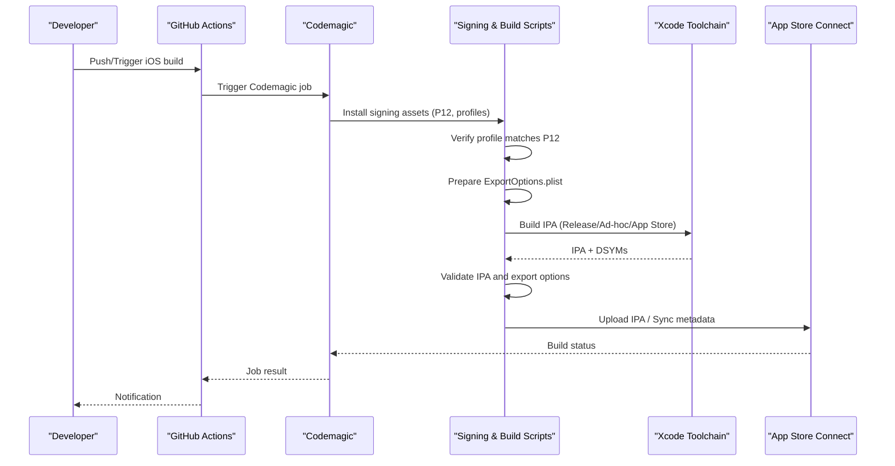
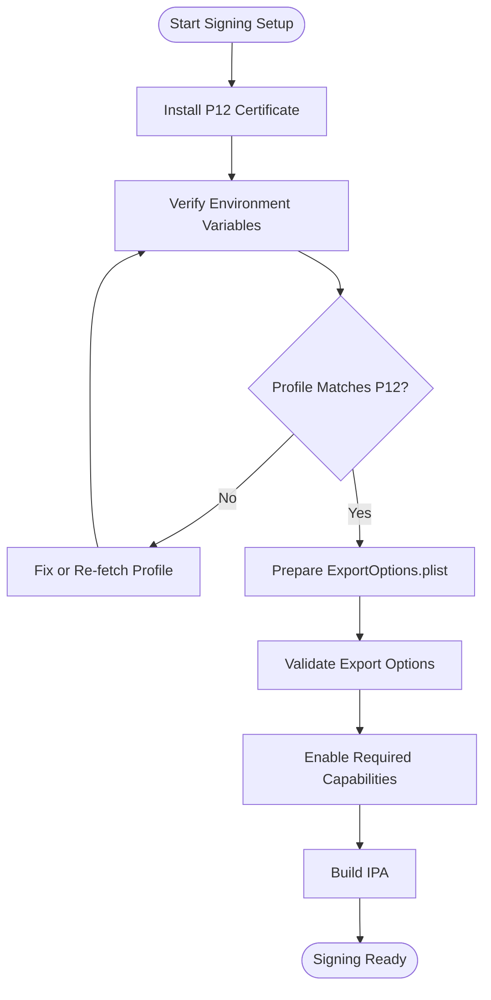
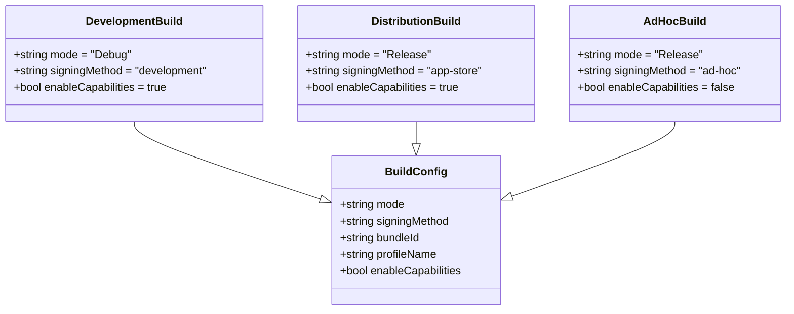
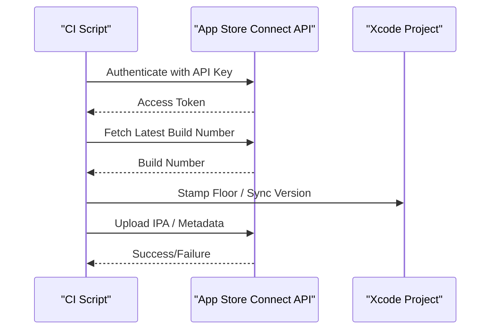
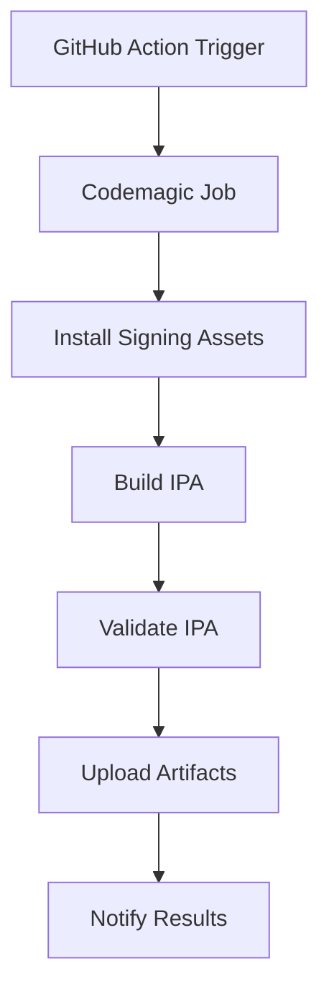
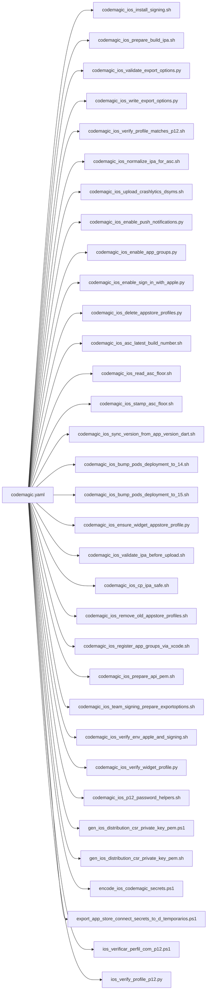

# Build & Signing Configuration

<cite>
**Referenced Files in This Document**
- [codemagic.yaml](file://codemagic.yaml)
- [CODEMAGIC_APP_STORE_INTEGRATION.txt](file://IOS/CODEMAGIC_APP_STORE_INTEGRATION.txt)
- [CODEMAGIC_INVALID_BINARY.md](file://IOS/CODEMAGIC_INVALID_BINARY.md)
- [CODEMAGIC_SIGNING_FIX.md](file://IOS/CODEMAGIC_SIGNING_FIX.md)
- [CREDENCIAIS_APPLE_ATUAL.txt](file://IOS/CREDENCIAIS_APPLE_ATUAL.txt)
- [APP_STORE_3_1_1_ORGANIZATION_SIGNUP.md](file://IOS/APP_STORE_3_1_1_ORGANIZATION_SIGNUP.md)
- [ExportOptions.plist](file://flutter_app/ios/ExportOptions.plist)
- [Runner.entitlements](file://flutter_app/ios/Runner/Runner.entitlements)
- [GestaoYahwehWidget.entitlements](file://flutter_app/ios/GestaoYahwehWidget/GestaoYahwehWidget.entitlements)
- [Podfile](file://flutter_app/ios/Podfile)
- [build_ios_ipa_macos.sh](file://scripts/build_ios_ipa_macos.sh)
- [codemagic_ios_install_signing.sh](file://scripts/codemagic_ios_install_signing.sh)
- [codemagic_ios_install_signing_api_only.sh](file://scripts/codemagic_ios_install_signing_api_only.sh)
- [codemagic_ios_prepare_build_ipa.sh](file://scripts/codemagic_ios_prepare_build_ipa.sh)
- [codemagic_ios_validate_export_options.py](file://scripts/codemagic_ios_validate_export_options.py)
- [codemagic_ios_write_export_options.py](file://scripts/codemagic_ios_write_export_options.py)
- [codemagic_ios_verify_profile_matches_p12.sh](file://scripts/codemagic_ios_verify_profile_matches_p12.sh)
- [codemagic_ios_fetch_profile_matching_p12.sh](file://scripts/codemagic_ios_fetch_profile_matching_p12.sh)
- [codemagic_ios_normalize_ipa_for_asc.sh](file://scripts/codemagic_ios_normalize_ipa_for_asc.sh)
- [codemagic_ios_upload_crashlytics_dsyms.sh](file://scripts/codemagic_ios_upload_crashlytics_dsyms.sh)
- [codemagic_ios_enable_push_notifications.py](file://scripts/codemagic_ios_enable_push_notifications.py)
- [codemagic_ios_enable_app_groups.py](file://scripts/codemagic_ios_enable_app_groups.py)
- [codemagic_ios_enable_sign_in_with_apple.py](file://scripts/codemagic_ios_enable_sign_in_with_apple.py)
- [codemagic_ios_delete_appstore_profiles.py](file://scripts/codemagic_ios_delete_appstore_profiles.py)
- [codemagic_ios_asc_latest_build_number.sh](file://scripts/codemagic_ios_asc_latest_build_number.sh)
- [codemagic_ios_read_asc_floor.sh](file://scripts/codemagic_ios_read_asc_floor.sh)
- [codemagic_ios_stamp_asc_floor.sh](file://scripts/codemagic_ios_stamp_asc_floor.sh)
- [codemagic_ios_sync_version_from_app_version_dart.sh](file://scripts/codemagic_ios_sync_version_from_app_version_dart.sh)
- [codemagic_ios_bump_pods_deployment_to_14.sh](file://scripts/codemagic_ios_bump_pods_deployment_to_14.sh)
- [codemagic_ios_bump_pods_deployment_to_15.sh](file://scripts/codemagic_ios_bump_pods_deployment_to_15.sh)
- [codemagic_ios_ensure_widget_appstore_profile.py](file://scripts/codemagic_ios_ensure_widget_appstore_profile.py)
- [codemagic_ios_validate_ipa_before_upload.sh](file://scripts/codemagic_ios_validate_ipa_before_upload.sh)
- [codemagic_ios_cp_ipa_safe.sh](file://scripts/codemagic_ios_cp_ipa_safe.sh)
- [codemagic_ios_remove_old_appstore_profiles.sh](file://scripts/codemagic_ios_remove_old_appstore_profiles.sh)
- [codemagic_ios_register_app_groups_via_xcode.sh](file://scripts/codemagic_ios_register_app_groups_via_xcode.sh)
- [codemagic_ios_prepare_api_pem.sh](file://scripts/codemagic_ios_prepare_api_pem.sh)
- [codemagic_ios_team_signing_prepare_exportoptions.sh](file://scripts/codemagic_ios_team_signing_prepare_exportoptions.sh)
- [codemagic_ios_verify_env_apple_and_signing.sh](file://scripts/codemagic_ios_verify_env_apple_and_signing.sh)
- [codemagic_ios_verify_widget_profile.py](file://scripts/codemagic_ios_verify_widget_profile.py)
- [codemagic_ios_p12_password_helpers.sh](file://scripts/codemagic_ios_p12_password_helpers.sh)
- [gen_ios_distribution_csr_private_key_pem.ps1](file://scripts/gen_ios_distribution_csr_private_key_pem.ps1)
- [gen_ios_distribution_csr_private_key_pem.sh](file://scripts/gen_ios_distribution_csr_private_key_pem.sh)
- [encode_ios_codemagic_secrets.ps1](file://scripts/encode_ios_codemagic_secrets.ps1)
- [export_app_store_connect_secrets_to_d_temporarios.ps1](file://scripts/export_app_store_connect_secrets_to_d_temporarios.ps1)
- [ios_verificar_perfil_com_p12.ps1](file://scripts/ios_verificar_perfil_com_p12.ps1)
- [ios_verify_profile_p12.py](file://scripts/ios_verify_profile_p12.py)
- [codemagic_ios_trigger.yml](file://.github/workflows/codemagic_ios_trigger.yml)
- [deploy-web.yml](file://.github/workflows/deploy-web.yml)
</cite>

## Table of Contents
1. Introduction
2. Project Structure
3. Core Components
4. Architecture Overview
5. Detailed Component Analysis
6. Dependency Analysis
7. Performance Considerations
8. Troubleshooting Guide
9. Conclusion
10. Appendices

## Introduction
This document provides comprehensive guidance for iOS build and signing configuration within this Flutter project. It covers certificate management, provisioning profiles, code signing processes, development vs distribution builds, ad-hoc distribution, App Store Connect integration, Xcode signing configuration, command-line tools usage, and automated signing workflows. It also includes keychain access, certificate rotation, troubleshooting common signing issues, CI/CD pipeline setup, automation examples, and multi-developer environment management.

## Project Structure
The iOS signing and build automation is implemented across several areas:
- iOS native configuration files under flutter_app/ios (ExportOptions, entitlements, Podfile).
- CI/CD orchestration via codemagic.yaml and GitHub Actions workflow triggers.
- Extensive shell and Python scripts under scripts/ to install signing assets, prepare IPA, validate export options, manage App Store Connect metadata, and upload artifacts.
- Documentation and credential references under IOS/.

```mermaid
graph TB
subgraph "iOS Native"
EO["ExportOptions.plist"]
ENT_R["Runner.entitlements"]
ENT_W["GestaoYahwehWidget.entitlements"]
POD["Podfile"]
end
subgraph "CI/CD Orchestration"
CM["codemagic.yaml"]
GH["codemagic_ios_trigger.yml"]
end
subgraph "Signing & Build Scripts"
S1["codemagic_ios_install_signing.sh"]
S2["codemagic_ios_prepare_build_ipa.sh"]
S3["codemagic_ios_validate_export_options.py"]
S4["codemagic_ios_write_export_options.py"]
S5["codemagic_ios_verify_profile_matches_p12.sh"]
S6["codemagic_ios_normalize_ipa_for_asc.sh"]
S7["codemagic_ios_upload_crashlytics_dsyms.sh"]
S8["codemagic_ios_enable_push_notifications.py"]
S9["codemagic_ios_enable_app_groups.py"]
S10["codemagic_ios_enable_sign_in_with_apple.py"]
S11["codemagic_ios_delete_appstore_profiles.py"]
S12["codemagic_ios_asc_latest_build_number.sh"]
S13["codemagic_ios_read_asc_floor.sh"]
S14["codemagic_ios_stamp_asc_floor.sh"]
S15["codemagic_ios_sync_version_from_app_version_dart.sh"]
S16["codemagic_ios_bump_pods_deployment_to_14.sh"]
S17["codemagic_ios_bump_pods_deployment_to_15.sh"]
S18["codemagic_ios_ensure_widget_appstore_profile.py"]
S19["codemagic_ios_validate_ipa_before_upload.sh"]
S20["codemagic_ios_cp_ipa_safe.sh"]
S21["codemagic_ios_remove_old_appstore_profiles.sh"]
S22["codemagic_ios_register_app_groups_via_xcode.sh"]
S23["codemagic_ios_prepare_api_pem.sh"]
S24["codemmagic_ios_team_signing_prepare_exportoptions.sh"]
S25["codemagic_ios_verify_env_apple_and_signing.sh"]
S26["codemagic_ios_verify_widget_profile.py"]
S27["codemagic_ios_p12_password_helpers.sh"]
S28["gen_ios_distribution_csr_private_key_pem.ps1"]
S29["gen_ios_distribution_csr_private_key_pem.sh"]
S30["encode_ios_codemagic_secrets.ps1"]
S31["export_app_store_connect_secrets_to_d_temporarios.ps1"]
S32["ios_verificar_perfil_com_p12.ps1"]
S33["ios_verify_profile_p12.py"]
end
subgraph "Documentation & Credentials"
DOC1["CODEMAGIC_APP_STORE_INTEGRATION.txt"]
DOC2["CODEMAGIC_INVALID_BINARY.md"]
DOC3["CODEMAGIC_SIGNING_FIX.md"]
DOC4["CREDENCIAIS_APPLE_ATUAL.txt"]
DOC5["APP_STORE_3_1_1_ORGANIZATION_SIGNUP.md"]
end
CM --> S1
CM --> S2
CM --> S3
CM --> S4
CM --> S5
CM --> S6
CM --> S7
CM --> S8
CM --> S9
CM --> S10
CM --> S11
CM --> S12
CM --> S13
CM --> S14
CM --> S15
CM --> S16
CM --> S17
CM --> S18
CM --> S19
CM --> S20
CM --> S21
CM --> S22
CM --> S23
CM --> S24
CM --> S25
CM --> S26
CM --> S27
CM --> S28
CM --> S29
CM --> S30
CM --> S31
CM --> S32
CM --> S33
EO --> S2
ENT_R --> S2
ENT_W --> S2
POD --> S2
GH --> CM
```

**Diagram sources**
- [codemagic.yaml](file://codemagic.yaml)
- [ExportOptions.plist](file://flutter_app/ios/ExportOptions.plist)
- [Runner.entitlements](file://flutter_app/ios/Runner/Runner.entitlements)
- [GestaoYahwehWidget.entitlements](file://flutter_app/ios/GestaoYahwehWidget/GestaoYahwehWidget.entitlements)
- [Podfile](file://flutter_app/ios/Podfile)
- [codemagic_ios_install_signing.sh](file://scripts/codemagic_ios_install_signing.sh)
- [codemagic_ios_prepare_build_ipa.sh](file://scripts/codemagic_ios_prepare_build_ipa.sh)
- [codemagic_ios_validate_export_options.py](file://scripts/codemagic_ios_validate_export_options.py)
- [codemagic_ios_write_export_options.py](file://scripts/codemagic_ios_write_export_options.py)
- [codemagic_ios_verify_profile_matches_p12.sh](file://scripts/codemagic_ios_verify_profile_matches_p12.sh)
- [codemagic_ios_normalize_ipa_for_asc.sh](file://scripts/codemagic_ios_normalize_ipa_for_asc.sh)
- [codemagic_ios_upload_crashlytics_dsyms.sh](file://scripts/codemagic_ios_upload_crashlytics_dsyms.sh)
- [codemagic_ios_enable_push_notifications.py](file://scripts/codemagic_ios_enable_push_notifications.py)
- [codemagic_ios_enable_app_groups.py](file://scripts/codemagic_ios_enable_app_groups.py)
- [codemagic_ios_enable_sign_in_with_apple.py](file://scripts/codemagic_ios_enable_sign_in_with_apple.py)
- [codemagic_ios_delete_appstore_profiles.py](file://scripts/codemagic_ios_delete_appstore_profiles.py)
- [codemagic_ios_asc_latest_build_number.sh](file://scripts/codemagic_ios_asc_latest_build_number.sh)
- [codemagic_ios_read_asc_floor.sh](file://scripts/codemagic_ios_read_asc_floor.sh)
- [codemagic_ios_stamp_asc_floor.sh](file://scripts/codemagic_ios_stamp_asc_floor.sh)
- [codemagic_ios_sync_version_from_app_version_dart.sh](file://scripts/codemagic_ios_sync_version_from_app_version_dart.sh)
- [codemagic_ios_bump_pods_deployment_to_14.sh](file://scripts/codemagic_ios_bump_pods_deployment_to_14.sh)
- [codemagic_ios_bump_pods_deployment_to_15.sh](file://scripts/codemagic_ios_bump_pods_deployment_to_15.sh)
- [codemagic_ios_ensure_widget_appstore_profile.py](file://scripts/codemagic_ios_ensure_widget_appstore_profile.py)
- [codemagic_ios_validate_ipa_before_upload.sh](file://scripts/codemagic_ios_validate_ipa_before_upload.sh)
- [codemagic_ios_cp_ipa_safe.sh](file://scripts/codemagic_ios_cp_ipa_safe.sh)
- [codemagic_ios_remove_old_appstore_profiles.sh](file://scripts/codemagic_ios_remove_old_appstore_profiles.sh)
- [codemagic_ios_register_app_groups_via_xcode.sh](file://scripts/codemagic_ios_register_app_groups_via_xcode.sh)
- [codemagic_ios_prepare_api_pem.sh](file://scripts/codemagic_ios_prepare_api_pem.sh)
- [codemagic_ios_team_signing_prepare_exportoptions.sh](file://scripts/codemagic_ios_team_signing_prepare_exportoptions.sh)
- [codemagic_ios_verify_env_apple_and_signing.sh](file://scripts/codemagic_ios_verify_env_apple_and_signing.sh)
- [codemagic_ios_verify_widget_profile.py](file://scripts/codemagic_ios_verify_widget_profile.py)
- [codemagic_ios_p12_password_helpers.sh](file://scripts/codemagic_ios_p12_password_helpers.sh)
- [gen_ios_distribution_csr_private_key_pem.ps1](file://scripts/gen_ios_distribution_csr_private_key_pem.ps1)
- [gen_ios_distribution_csr_private_key_pem.sh](file://scripts/gen_ios_distribution_csr_private_key_pem.sh)
- [encode_ios_codemagic_secrets.ps1](file://scripts/encode_ios_codemagic_secrets.ps1)
- [export_app_store_connect_secrets_to_d_temporarios.ps1](file://scripts/export_app_store_connect_secrets_to_d_temporarios.ps1)
- [ios_verificar_perfil_com_p12.ps1](file://scripts/ios_verificar_perfil_com_p12.ps1)
- [ios_verify_profile_p12.py](file://scripts/ios_verify_profile_p12.py)
- [codemagic_ios_trigger.yml](file://.github/workflows/codemagic_ios_trigger.yml)

**Section sources**
- [codemagic.yaml](file://codemagic.yaml)
- [ExportOptions.plist](file://flutter_app/ios/ExportOptions.plist)
- [Runner.entitlements](file://flutter_app/ios/Runner/Runner.entitlements)
- [GestaoYahwehWidget.entitlements](file://flutter_app/ios/GestaoYahwehWidget/GestaoYahwehWidget.entitlements)
- [Podfile](file://flutter_app/ios/Podfile)
- [CODEMAGIC_APP_STORE_INTEGRATION.txt](file://IOS/CODEMAGIC_APP_STORE_INTEGRATION.txt)
- [CODEMAGIC_INVALID_BINARY.md](file://IOS/CODEMAGIC_INVALID_BINARY.md)
- [CODEMAGIC_SIGNING_FIX.md](file://IOS/CODEMAGIC_SIGNING_FIX.md)
- [CREDENCIAIS_APPLE_ATUAL.txt](file://IOS/CREDENCIAIS_APPLE_ATUAL.txt)
- [APP_STORE_3_1_1_ORGANIZATION_SIGNUP.md](file://IOS/APP_STORE_3_1_1_ORGANIZATION_SIGNUP.md)

## Core Components
- Export Options and Entitlements: The IPA export and signing behavior are controlled by ExportOptions.plist and the app/widget entitlements files. These define capabilities such as push notifications, app groups, and Sign In with Apple.
- CI/CD Orchestration: codemagic.yaml defines build stages, signing asset installation, IPA preparation, validation, and upload flows. GitHub Actions trigger Codemagic jobs for iOS builds.
- Signing Asset Management: Shell and Python scripts handle P12 installation, profile matching, export options generation/validation, API key preparation, and App Store Connect metadata synchronization.
- Version and Deployment Target Alignment: Scripts ensure consistent deployment targets, pod versions, and version alignment between Dart app version and iOS build metadata.

Key responsibilities:
- Install and verify signing assets securely on CI agents.
- Generate or validate ExportOptions.plist for target-specific builds.
- Validate IPA integrity and compatibility before upload.
- Manage App Store Connect integrations (API keys, profiles, build numbers).
- Enable required capabilities programmatically.

**Section sources**
- [ExportOptions.plist](file://flutter_app/ios/ExportOptions.plist)
- [Runner.entitlements](file://flutter_app/ios/Runner/Runner.entitlements)
- [GestaoYahwehWidget.entitlements](file://flutter_app/ios/GestaoYahwehWidget/GestaoYahwehWidget.entitlements)
- [codemagic.yaml](file://codemagic.yaml)
- [codemagic_ios_install_signing.sh](file://scripts/codemagic_ios_install_signing.sh)
- [codemagic_ios_prepare_build_ipa.sh](file://scripts/codemagic_ios_prepare_build_ipa.sh)
- [codemagic_ios_validate_export_options.py](file://scripts/codemagic_ios_validate_export_options.py)
- [codemagic_ios_write_export_options.py](file://scripts/codemagic_ios_write_export_options.py)
- [codemagic_ios_verify_profile_matches_p12.sh](file://scripts/codemagic_ios_verify_profile_matches_p12.sh)
- [codemagic_ios_normalize_ipa_for_asc.sh](file://scripts/codemagic_ios_normalize_ipa_for_asc.sh)
- [codemagic_ios_upload_crashlytics_dsyms.sh](file://scripts/codemagic_ios_upload_crashlytics_dsyms.sh)
- [codemagic_ios_enable_push_notifications.py](file://scripts/codemagic_ios_enable_push_notifications.py)
- [codemagic_ios_enable_app_groups.py](file://scripts/codemagic_ios_enable_app_groups.py)
- [codemagic_ios_enable_sign_in_with_apple.py](file://scripts/codemagic_ios_enable_sign_in_with_apple.py)
- [codemagic_ios_delete_appstore_profiles.py](file://scripts/codemagic_ios_delete_appstore_profiles.py)
- [codemagic_ios_asc_latest_build_number.sh](file://scripts/codemagic_ios_asc_latest_build_number.sh)
- [codemagic_ios_read_asc_floor.sh](file://scripts/codemagic_ios_read_asc_floor.sh)
- [codemagic_ios_stamp_asc_floor.sh](file://scripts/codemagic_ios_stamp_asc_floor.sh)
- [codemagic_ios_sync_version_from_app_version_dart.sh](file://scripts/codemagic_ios_sync_version_from_app_version_dart.sh)
- [codemagic_ios_bump_pods_deployment_to_14.sh](file://scripts/codemagic_ios_bump_pods_deployment_to_14.sh)
- [codemagic_ios_bump_pods_deployment_to_15.sh](file://scripts/codemagic_ios_bump_pods_deployment_to_15.sh)
- [codemagic_ios_ensure_widget_appstore_profile.py](file://scripts/codemagic_ios_ensure_widget_appstore_profile.py)
- [codemagic_ios_validate_ipa_before_upload.sh](file://scripts/codemagic_ios_validate_ipa_before_upload.sh)
- [codemagic_ios_cp_ipa_safe.sh](file://scripts/codemagic_ios_cp_ipa_safe.sh)
- [codemagic_ios_remove_old_appstore_profiles.sh](file://scripts/codemagic_ios_remove_old_appstore_profiles.sh)
- [codemagic_ios_register_app_groups_via_xcode.sh](file://scripts/codemagic_ios_register_app_groups_via_xcode.sh)
- [codemagic_ios_prepare_api_pem.sh](file://scripts/codemagic_ios_prepare_api_pem.sh)
- [codemagic_ios_team_signing_prepare_exportoptions.sh](file://scripts/codemagic_ios_team_signing_prepare_exportoptions.sh)
- [codemagic_ios_verify_env_apple_and_signing.sh](file://scripts/codemagic_ios_verify_env_apple_and_signing.sh)
- [codemagic_ios_verify_widget_profile.py](file://scripts/codemagic_ios_verify_widget_profile.py)
- [codemagic_ios_p12_password_helpers.sh](file://scripts/codemagic_ios_p12_password_helpers.sh)
- [gen_ios_distribution_csr_private_key_pem.ps1](file://scripts/gen_ios_distribution_csr_private_key_pem.ps1)
- [gen_ios_distribution_csr_private_key_pem.sh](file://scripts/gen_ios_distribution_csr_private_key_pem.sh)
- [encode_ios_codemagic_secrets.ps1](file://scripts/encode_ios_codemagic_secrets.ps1)
- [export_app_store_connect_secrets_to_d_temporarios.ps1](file://scripts/export_app_store_connect_secrets_to_d_temporarios.ps1)
- [ios_verificar_perfil_com_p12.ps1](file://scripts/ios_verificar_perfil_com_p12.ps1)
- [ios_verify_profile_p12.py](file://scripts/ios_verify_profile_p12.py)

## Architecture Overview
The iOS build and signing architecture integrates Xcode tooling, Apple services, and CI/CD automation:
- Local development uses Xcode with manual or automatic signing based on team settings.
- CI builds use Codemagic orchestrated by codemagic.yaml, which installs signing assets, prepares IPA, validates export options, and uploads artifacts.
- GitHub Actions can trigger Codemagic iOS builds via a workflow file.
- Scripts manage App Store Connect API keys, provisioning profiles, and capability toggles.

**Diagram sources**
- [codemagic.yaml](file://codemagic.yaml)
- [codemagic_ios_install_signing.sh](file://scripts/codemagic_ios_install_signing.sh)
- [codemagic_ios_verify_profile_matches_p12.sh](file://scripts/codemagic_ios_verify_profile_matches_p12.sh)
- [codemagic_ios_write_export_options.py](file://scripts/codemagic_ios_write_export_options.py)
- [codemagic_ios_prepare_build_ipa.sh](file://scripts/codemagic_ios_prepare_build_ipa.sh)
- [codemagic_ios_validate_export_options.py](file://scripts/codemagic_ios_validate_export_options.py)
- [codemagic_ios_validate_ipa_before_upload.sh](file://scripts/codemagic_ios_validate_ipa_before_upload.sh)
- [codemagic_ios_normalize_ipa_for_asc.sh](file://scripts/codemagic_ios_normalize_ipa_for_asc.sh)
- [codemagic_ios_upload_crashlytics_dsyms.sh](file://scripts/codemagic_ios_upload_crashlytics_dsyms.sh)
- [codemagic_ios_trigger.yml](file://.github/workflows/codemagic_ios_trigger.yml)

## Detailed Component Analysis

### Certificate and Provisioning Profile Management
- P12 Installation and Verification: Scripts install P12 certificates into the CI agent’s keychain and verify that the installed profile matches the certificate.
- Profile Matching: Validation ensures the provisioning profile corresponds to the correct bundle identifier and certificate type.
- API Key Preparation: App Store Connect API key PEM files are prepared for programmatic interactions.
- Capability Enablement: Scripts enable push notifications, app groups, and Sign In with Apple through Xcode project modifications.

**Diagram sources**
- [codemagic_ios_install_signing.sh](file://scripts/codemagic_ios_install_signing.sh)
- [codemagic_ios_verify_env_apple_and_signing.sh](file://scripts/codemagic_ios_verify_env_apple_and_signing.sh)
- [codemagic_ios_verify_profile_matches_p12.sh](file://scripts/codemagic_ios_verify_profile_matches_p12.sh)
- [codemagic_ios_write_export_options.py](file://scripts/codemagic_ios_write_export_options.py)
- [codemagic_ios_validate_export_options.py](file://scripts/codemagic_ios_validate_export_options.py)
- [codemagic_ios_enable_push_notifications.py](file://scripts/codemagic_ios_enable_push_notifications.py)
- [codemagic_ios_enable_app_groups.py](file://scripts/codemagic_ios_enable_app_groups.py)
- [codemagic_ios_enable_sign_in_with_apple.py](file://scripts/codemagic_ios_enable_sign_in_with_apple.py)

**Section sources**
- [codemagic_ios_install_signing.sh](file://scripts/codemagic_ios_install_signing.sh)
- [codemagic_ios_verify_env_apple_and_signing.sh](file://scripts/codemagic_ios_verify_env_apple_and_signing.sh)
- [codemagic_ios_verify_profile_matches_p12.sh](file://scripts/codemagic_ios_verify_profile_matches_p12.sh)
- [codemagic_ios_write_export_options.py](file://scripts/codemagic_ios_write_export_options.py)
- [codemagic_ios_validate_export_options.py](file://scripts/codemagic_ios_validate_export_options.py)
- [codemagic_ios_enable_push_notifications.py](file://scripts/codemagic_ios_enable_push_notifications.py)
- [codemagic_ios_enable_app_groups.py](file://scripts/codemagic_ios_enable_app_groups.py)
- [codemagic_ios_enable_sign_in_with_apple.py](file://scripts/codemagic_ios_enable_sign_in_with_apple.py)

### Development vs Distribution Builds
- Development Builds: Typically use Debug configurations with developer certificates and ad-hoc or development provisioning profiles. Suitable for local testing and internal QA.
- Distribution Builds: Use Release configurations with distribution certificates and App Store or Ad-hoc provisioning profiles. Ad-hoc is for limited device distribution; App Store is for public release.
- Export Options: ExportOptions.plist controls signing mode, method, and bundle identifiers for different targets.

**Diagram sources**
- [ExportOptions.plist](file://flutter_app/ios/ExportOptions.plist)
- [codemagic_ios_write_export_options.py](file://scripts/codemagic_ios_write_export_options.py)
- [codemagic_ios_prepare_build_ipa.sh](file://scripts/codemagic_ios_prepare_build_ipa.sh)

**Section sources**
- [ExportOptions.plist](file://flutter_app/ios/ExportOptions.plist)
- [codemagic_ios_write_export_options.py](file://scripts/codemagic_ios_write_export_options.py)
- [codemagic_ios_prepare_build_ipa.sh](file://scripts/codemagic_ios_prepare_build_ipa.sh)

### App Store Connect Integration
- API Key Management: Prepare and store API key PEM files securely for programmatic operations like fetching latest build numbers and syncing metadata.
- Profile Management: Scripts can delete old App Store profiles and ensure widget-specific profiles exist.
- Build Number Alignment: Read and stamp floor values, sync version from Dart app version, and bump pods deployment targets.

**Diagram sources**
- [codemagic_ios_prepare_api_pem.sh](file://scripts/codemagic_ios_prepare_api_pem.sh)
- [codemagic_ios_asc_latest_build_number.sh](file://scripts/codemagic_ios_asc_latest_build_number.sh)
- [codemagic_ios_read_asc_floor.sh](file://scripts/codemagic_ios_read_asc_floor.sh)
- [codemagic_ios_stamp_asc_floor.sh](file://scripts/codemagic_ios_stamp_asc_floor.sh)
- [codemagic_ios_sync_version_from_app_version_dart.sh](file://scripts/codemagic_ios_sync_version_from_app_version_dart.sh)
- [codemagic_ios_delete_appstore_profiles.py](file://scripts/codemagic_ios_delete_appstore_profiles.py)
- [codemagic_ios_ensure_widget_appstore_profile.py](file://scripts/codemagic_ios_ensure_widget_appstore_profile.py)

**Section sources**
- [codemagic_ios_prepare_api_pem.sh](file://scripts/codemagic_ios_prepare_api_pem.sh)
- [codemagic_ios_asc_latest_build_number.sh](file://scripts/codemagic_ios_asc_latest_build_number.sh)
- [codemagic_ios_read_asc_floor.sh](file://scripts/codemagic_ios_read_asc_floor.sh)
- [codemmagic_ios_stamp_asc_floor.sh](file://scripts/codemagic_ios_stamp_asc_floor.sh)
- [codemagic_ios_sync_version_from_app_version_dart.sh](file://scripts/codemagic_ios_sync_version_from_app_version_dart.sh)
- [codemagic_ios_delete_appstore_profiles.py](file://scripts/codemagic_ios_delete_appstore_profiles.py)
- [codemagic_ios_ensure_widget_appstore_profile.py](file://scripts/codemagic_ios_ensure_widget_appstore_profile.py)

### Command-Line Tools Usage
- Xcode Build Commands: Used to build IPA with specific schemes, configurations, and export options.
- CodeSign Utility: Invoked indirectly via Xcode toolchain during IPA creation.
- Security CLI: For managing keychain items and importing P12 files securely.

Usage patterns:
- Install signing assets using security commands.
- Build IPA with xcodebuild specifying scheme, configuration, and export options.
- Validate IPA using altool or xcrun tools where applicable.

**Section sources**
- [codemagic_ios_prepare_build_ipa.sh](file://scripts/codemagic_ios_prepare_build_ipa.sh)
- [codemagic_ios_validate_ipa_before_upload.sh](file://scripts/codemagic_ios_validate_ipa_before_upload.sh)
- [codemagic_ios_install_signing.sh](file://scripts/codemagic_ios_install_signing.sh)

### Automated Signing Workflows
- CI Orchestration: codemagic.yaml defines stages for installing signing assets, building IPA, validating outputs, and uploading artifacts.
- GitHub Actions Trigger: codemagic_ios_trigger.yml initiates Codemagic builds from repository events.
- Secret Encoding: encode_ios_codemagic_secrets.ps1 and export_app_store_connect_secrets_to_d_temporarios.ps1 manage secure secrets for CI environments.

**Diagram sources**
- [codemagic_ios_trigger.yml](file://.github/workflows/codemagic_ios_trigger.yml)
- [codemagic.yaml](file://codemagic.yaml)
- [encode_ios_codemagic_secrets.ps1](file://scripts/encode_ios_codemagic_secrets.ps1)
- [export_app_store_connect_secrets_to_d_temporarios.ps1](file://scripts/export_app_store_connect_secrets_to_d_temporarios.ps1)

**Section sources**
- [codemagic_ios_trigger.yml](file://.github/workflows/codemagic_ios_trigger.yml)
- [codemagic.yaml](file://codemagic.yaml)
- [encode_ios_codemagic_secrets.ps1](file://scripts/encode_ios_codemagic_secrets.ps1)
- [export_app_store_connect_secrets_to_d_temporarios.ps1](file://scripts/export_app_store_connect_secrets_to_d_temporarios.ps1)

### Keychain Access and Certificate Rotation
- Keychain Management: Scripts import P12 files into the CI agent’s keychain and set appropriate permissions.
- Certificate Rotation: Generate new CSR/private key pairs and update provisioning profiles accordingly.
- Verification: Validate profile-certificate matching and ensure no stale profiles remain.

Best practices:
- Rotate certificates periodically and update CI secrets.
- Remove old profiles to avoid conflicts.
- Ensure keychain access is scoped to CI agents only.

**Section sources**
- [codemagic_ios_install_signing.sh](file://scripts/codemagic_ios_install_signing.sh)
- [gen_ios_distribution_csr_private_key_pem.ps1](file://scripts/gen_ios_distribution_csr_private_key_pem.ps1)
- [gen_ios_distribution_csr_private_key_pem.sh](file://scripts/gen_ios_distribution_csr_private_key_pem.sh)
- [codemagic_ios_remove_old_appstore_profiles.sh](file://scripts/codemagic_ios_remove_old_appstore_profiles.sh)
- [ios_verificar_perfil_com_p12.ps1](file://scripts/ios_verificar_perfil_com_p12.ps1)
- [ios_verify_profile_p12.py](file://scripts/ios_verify_profile_p12.py)

### Xcode Signing Configuration
- Automatic vs Manual Signing: Developers can choose automatic signing with team selection or manual configuration using explicit profiles and certificates.
- Entitlements: Runner and widget entitlements must align with enabled capabilities.
- ExportOptions: Define signing method, bundle IDs, and output paths for different build types.

Recommendations:
- Use automatic signing for development to reduce friction.
- Pin profiles and certificates for distribution builds.
- Validate entitlements against backend services (e.g., Firebase).

**Section sources**
- [ExportOptions.plist](file://flutter_app/ios/ExportOptions.plist)
- [Runner.entitlements](file://flutter_app/ios/Runner/Runner.entitlements)
- [GestaoYahwehWidget.entitlements](file://flutter_app/ios/GestaoYahwehWidget/GestaoYahwehWidget.entitlements)

### CI/CD Pipeline Examples
- Codemagic Workflow: Orchestrates signing, building, validation, and upload steps.
- GitHub Actions: Triggers Codemagic jobs and handles post-build tasks.
- Secret Management: Encodes and exports secrets securely for CI environments.

Implementation highlights:
- Use environment variables for sensitive data.
- Cache dependencies to speed up builds.
- Implement retry logic for transient failures.

**Section sources**
- [codemagic.yaml](file://codemagic.yaml)
- [codemagic_ios_trigger.yml](file://.github/workflows/codemagic_ios_trigger.yml)
- [encode_ios_codemagic_secrets.ps1](file://scripts/encode_ios_codemagic_secrets.ps1)
- [export_app_store_connect_secrets_to_d_temporarios.ps1](file://scripts/export_app_store_connect_secrets_to_d_temporarios.ps1)

### Multi-Developer Environment Management
- Team Sharing: Share provisioning profiles and certificates securely via team accounts.
- Local Setup: Provide scripts to bootstrap development machines with necessary tools and credentials.
- Consistency: Enforce deployment targets and pod versions across environments.

Guidelines:
- Use shared keychains for team members when necessary.
- Document setup steps clearly.
- Automate environment checks to prevent drift.

**Section sources**
- [setup_dev_machine_windows.ps1](file://scripts/setup_dev_machine_windows.ps1)
- [codemagic_ios_bump_pods_deployment_to_14.sh](file://scripts/codemagic_ios_bump_pods_deployment_to_14.sh)
- [codemagic_ios_bump_pods_deployment_to_15.sh](file://scripts/codemagic_ios_bump_pods_deployment_to_15.sh)

## Dependency Analysis
The iOS signing and build system has clear dependencies:
- codemagic.yaml depends on shell and Python scripts for signing, building, and validation.
- ExportOptions.plist and entitlements influence build outcomes.
- App Store Connect API scripts depend on valid API keys and permissions.
- GitHub Actions trigger Codemagic jobs and coordinate post-build tasks.

**Diagram sources**
- [codemagic.yaml](file://codemagic.yaml)
- [codemagic_ios_install_signing.sh](file://scripts/codemagic_ios_install_signing.sh)
- [codemagic_ios_prepare_build_ipa.sh](file://scripts/codemagic_ios_prepare_build_ipa.sh)
- [codemagic_ios_validate_export_options.py](file://scripts/codemagic_ios_validate_export_options.py)
- [codemagic_ios_write_export_options.py](file://scripts/codemagic_ios_write_export_options.py)
- [codemagic_ios_verify_profile_matches_p12.sh](file://scripts/codemagic_ios_verify_profile_matches_p12.sh)
- [codemagic_ios_normalize_ipa_for_asc.sh](file://scripts/codemagic_ios_normalize_ipa_for_asc.sh)
- [codemagic_ios_upload_crashlytics_dsyms.sh](file://scripts/codemagic_ios_upload_crashlytics_dsyms.sh)
- [codemagic_ios_enable_push_notifications.py](file://scripts/codemagic_ios_enable_push_notifications.py)
- [codemagic_ios_enable_app_groups.py](file://scripts/codemagic_ios_enable_app_groups.py)
- [codemagic_ios_enable_sign_in_with_apple.py](file://scripts/codemagic_ios_enable_sign_in_with_apple.py)
- [codemagic_ios_delete_appstore_profiles.py](file://scripts/codemagic_ios_delete_appstore_profiles.py)
- [codemagic_ios_asc_latest_build_number.sh](file://scripts/codemagic_ios_asc_latest_build_number.sh)
- [codemagic_ios_read_asc_floor.sh](file://scripts/codemagic_ios_read_asc_floor.sh)
- [codemagic_ios_stamp_asc_floor.sh](file://scripts/codemagic_ios_stamp_asc_floor.sh)
- [codemagic_ios_sync_version_from_app_version_dart.sh](file://scripts/codemagic_ios_sync_version_from_app_version_dart.sh)
- [codemagic_ios_bump_pods_deployment_to_14.sh](file://scripts/codemagic_ios_bump_pods_deployment_to_14.sh)
- [codemagic_ios_bump_pods_deployment_to_15.sh](file://scripts/codemagic_ios_bump_pods_deployment_to_15.sh)
- [codemagic_ios_ensure_widget_appstore_profile.py](file://scripts/codemagic_ios_ensure_widget_appstore_profile.py)
- [codemagic_ios_validate_ipa_before_upload.sh](file://scripts/codemagic_ios_validate_ipa_before_upload.sh)
- [codemagic_ios_cp_ipa_safe.sh](file://scripts/codemagic_ios_cp_ipa_safe.sh)
- [codemagic_ios_remove_old_appstore_profiles.sh](file://scripts/codemagic_ios_remove_old_appstore_profiles.sh)
- [codemagic_ios_register_app_groups_via_xcode.sh](file://scripts/codemagic_ios_register_app_groups_via_xcode.sh)
- [codemagic_ios_prepare_api_pem.sh](file://scripts/codemagic_ios_prepare_api_pem.sh)
- [codemagic_ios_team_signing_prepare_exportoptions.sh](file://scripts/codemagic_ios_team_signing_prepare_exportoptions.sh)
- [codemagic_ios_verify_env_apple_and_signing.sh](file://scripts/codemagic_ios_verify_env_apple_and_signing.sh)
- [codemagic_ios_verify_widget_profile.py](file://scripts/codemagic_ios_verify_widget_profile.py)
- [codemagic_ios_p12_password_helpers.sh](file://scripts/codemagic_ios_p12_password_helpers.sh)
- [gen_ios_distribution_csr_private_key_pem.ps1](file://scripts/gen_ios_distribution_csr_private_key_pem.ps1)
- [gen_ios_distribution_csr_private_key_pem.sh](file://scripts/gen_ios_distribution_csr_private_key_pem.sh)
- [encode_ios_codemagic_secrets.ps1](file://scripts/encode_ios_codemagic_secrets.ps1)
- [export_app_store_connect_secrets_to_d_temporarios.ps1](file://scripts/export_app_store_connect_secrets_to_d_temporarios.ps1)
- [ios_verificar_perfil_com_p12.ps1](file://scripts/ios_verificar_perfil_com_p12.ps1)
- [ios_verify_profile_p12.py](file://scripts/ios_verify_profile_p12.py)

**Section sources**
- [codemagic.yaml](file://codemagic.yaml)

## Performance Considerations
- Caching Dependencies: Cache CocoaPods and other dependencies to reduce build times.
- Parallelization: Where possible, parallelize independent tasks like validation and artifact preparation.
- Minimal Logging: Avoid excessive logging to reduce I/O overhead.
- Incremental Builds: Leverage Xcode’s incremental build capabilities.

[No sources needed since this section provides general guidance]

## Troubleshooting Guide
Common issues and resolutions:
- Invalid Binary Errors: Review CODEMAGIC_INVALID_BINARY.md for known causes and fixes.
- Signing Failures: Consult CODEMAGIC_SIGNING_FIX.md for step-by-step resolution.
- Credential Mismatches: Ensure CREDENCIAIS_APPLE_ATUAL.txt reflects current team credentials.
- Organization Setup: Follow APP_STORE_3_1_1_ORGANIZATION_SIGNUP.md for proper App Store Connect organization setup.

Diagnostic steps:
- Verify profile-certificate matching using verification scripts.
- Check export options validity before building.
- Inspect CI logs for detailed error messages.

**Section sources**
- [CODEMAGIC_INVALID_BINARY.md](file://IOS/CODEMAGIC_INVALID_BINARY.md)
- [CODEMAGIC_SIGNING_FIX.md](file://IOS/CODEMAGIC_SIGNING_FIX.md)
- [CREDENCIAIS_APPLE_ATUAL.txt](file://IOS/CREDENCIAIS_APPLE_ATUAL.txt)
- [APP_STORE_3_1_1_ORGANIZATION_SIGNUP.md](file://IOS/APP_STORE_3_1_1_ORGANIZATION_SIGNUP.md)
- [codemagic_ios_verify_profile_matches_p12.sh](file://scripts/codemagic_ios_verify_profile_matches_p12.sh)
- [codemagic_ios_validate_export_options.py](file://scripts/codemagic_ios_validate_export_options.py)

## Conclusion
This documentation outlines a robust iOS build and signing configuration tailored for Flutter projects. By leveraging Codemagic, GitHub Actions, and extensive automation scripts, teams can achieve reliable, repeatable builds with secure certificate management and seamless App Store Connect integration. Following the guidelines here will help maintain consistency across development and production environments while minimizing signing-related issues.

[No sources needed since this section summarizes without analyzing specific files]

## Appendices
- Additional References: Explore codemagic.yaml for detailed stage definitions and script invocations.
- Best Practices: Regularly rotate certificates, audit permissions, and keep documentation updated.

[No sources needed since this section provides general guidance]