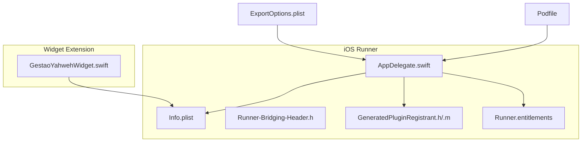
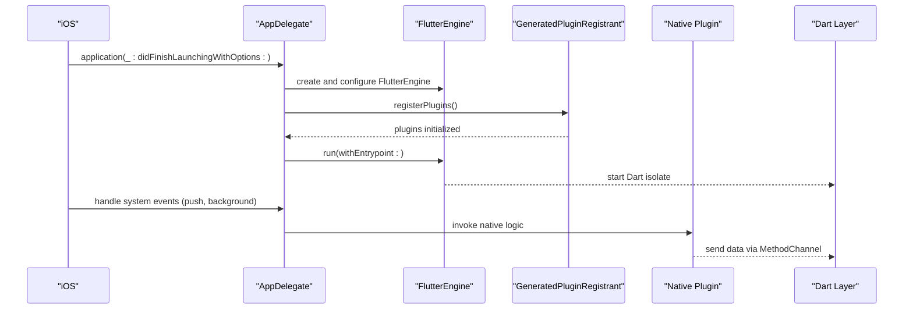
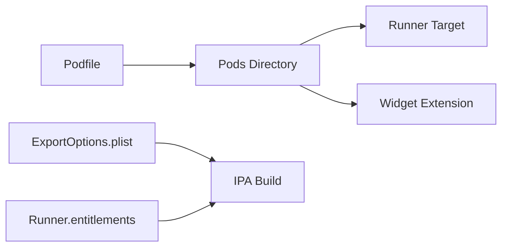
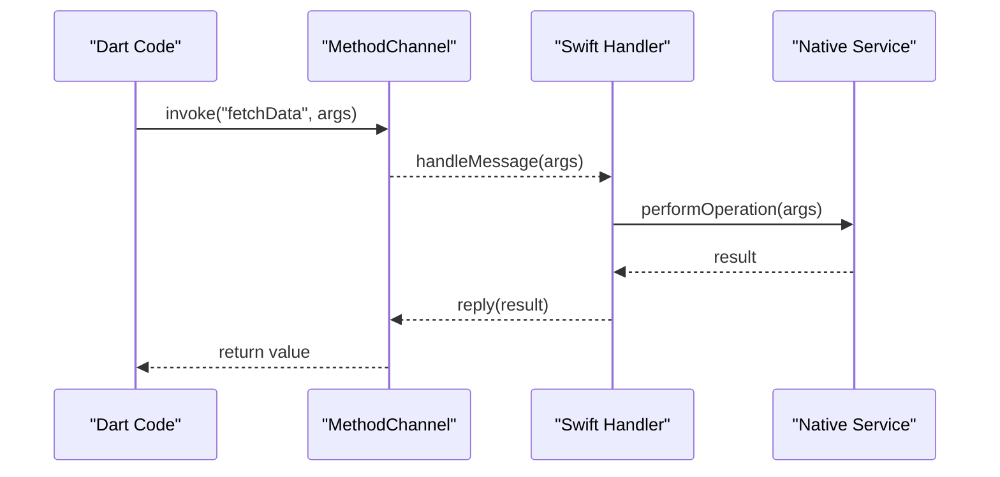

# Native Code Integration

<cite>
**Referenced Files in This Document**
- [AppDelegate.swift](file://flutter_app/ios/Runner/AppDelegate.swift)
- [Info.plist](file://flutter_app/ios/Runner/Info.plist)
- [Runner-Bridging-Header.h](file://flutter_app/ios/Runner/Runner-Bridging-Header.h)
- [GeneratedPluginRegistrant.h](file://flutter_app/ios/Runner/GeneratedPluginRegistrant.h)
- [GeneratedPluginRegistrant.m](file://flutter_app/ios/Runner/GeneratedPluginRegistrant.m)
- [GestaoYahwehWidget.swift](file://flutter_app/ios/GestaoYahwehWidget/GestaoYahwehWidget.swift)
- [Podfile](file://flutter_app/ios/Podfile)
- [ExportOptions.plist](file://flutter_app/ios/ExportOptions.plist)
- [Runner.entitlements](file://flutter_app/ios/Runner/Runner.entitlements)
</cite>

## Table of Contents
1. [Introduction](#introduction)
2. [Project Structure](#project-structure)
3. [Core Components](#core-components)
4. [Architecture Overview](#architecture-overview)
5. [Detailed Component Analysis](#detailed-component-analysis)
6. [Dependency Analysis](#dependency-analysis)
7. [Performance Considerations](#performance-considerations)
8. [Troubleshooting Guide](#troubleshooting-guide)
9. [Conclusion](#conclusion)
10. [Appendices](#appendices)

## Introduction
This document explains how native Swift code integrates with the Flutter iOS implementation. It covers AppDelegate lifecycle, Flutter plugin initialization, Info.plist configuration for permissions and capabilities, Objective-C bridging header setup, background task registration, system notifications handling, and native service integration. It also provides guidance for creating custom plugins, implementing platform channels, and handling native events from Flutter.

## Project Structure
The iOS implementation is located under flutter_app/ios. Key directories and files:
- Runner: The main app target containing AppDelegate, Info.plist, bridging header, and generated plugin registrant.
- GestaoYahwehWidget: A widget extension (SwiftUI) that can interact with the host app via App Groups.
- Podfile: CocoaPods configuration for native dependencies.
- ExportOptions.plist and Runner.entitlements: Signing and capability settings used during build and distribution.

**Diagram sources**
- [AppDelegate.swift](file://flutter_app/ios/Runner/AppDelegate.swift)
- [Info.plist](file://flutter_app/ios/Runner/Info.plist)
- [Runner-Bridging-Header.h](file://flutter_app/ios/Runner/Runner-Bridging-Header.h)
- [GeneratedPluginRegistrant.h](file://flutter_app/ios/Runner/GeneratedPluginRegistrant.h)
- [GeneratedPluginRegistrant.m](file://flutter_app/ios/Runner/GeneratedPluginRegistrant.m)
- [GestaoYahwehWidget.swift](file://flutter_app/ios/GestaoYahwehWidget/GestaoYahwehWidget.swift)
- [Podfile](file://flutter_app/ios/Podfile)
- [ExportOptions.plist](file://flutter_app/ios/ExportOptions.plist)
- [Runner.entitlements](file://flutter_app/ios/Runner/Runner.entitlements)

**Section sources**
- [AppDelegate.swift](file://flutter_app/ios/Runner/AppDelegate.swift)
- [Info.plist](file://flutter_app/ios/Runner/Info.plist)
- [Runner-Bridging-Header.h](file://flutter_app/ios/Runner/Runner-Bridging-Header.h)
- [GeneratedPluginRegistrant.h](file://flutter_app/ios/Runner/GeneratedPluginRegistrant.h)
- [GeneratedPluginRegistrant.m](file://flutter_app/ios/Runner/GeneratedPluginRegistrant.m)
- [GestaoYahwehWidget.swift](file://flutter_app/ios/GestaoYahwehWidget/GestaoYahwehWidget.swift)
- [Podfile](file://flutter_app/ios/Podfile)
- [ExportOptions.plist](file://flutter_app/ios/ExportOptions.plist)
- [Runner.entitlements](file://flutter_app/ios/Runner/Runner.entitlements)

## Core Components
- AppDelegate: Initializes Flutter engine, registers plugins, and handles application lifecycle events such as launch, foreground/background transitions, and push notification callbacks.
- GeneratedPluginRegistrant: Automatically generated by Flutter to register all plugins declared in pubspec.yaml at runtime.
- Info.plist: Declares app metadata, required permissions, and capabilities (e.g., push notifications, background modes).
- Bridging Header: Enables Swift code to call Objective-C APIs when needed.
- Widget Extension: Optional SwiftUI extension sharing data with the host app via App Groups.

Key responsibilities:
- Flutter engine bootstrapping and plugin registration.
- System event routing to Flutter (lifecycle, notifications, background tasks).
- Capability and permission declarations for iOS services.

**Section sources**
- [AppDelegate.swift](file://flutter_app/ios/Runner/AppDelegate.swift)
- [GeneratedPluginRegistrant.h](file://flutter_app/ios/Runner/GeneratedPluginRegistrant.h)
- [GeneratedPluginRegistrant.m](file://flutter_app/ios/Runner/GeneratedPluginRegistrant.m)
- [Info.plist](file://flutter_app/ios/Runner/Info.plist)
- [Runner-Bridging-Header.h](file://flutter_app/ios/Runner/Runner-Bridging-Header.h)
- [GestaoYahwehWidget.swift](file://flutter_app/ios/GestaoYahwehWidget/GestaoYahwehWidget.swift)

## Architecture Overview
At runtime, iOS launches the Runner target, which instantiates AppDelegate. AppDelegate initializes FlutterEngine, sets up method channels, and delegates system events to Flutter through the plugin infrastructure. Plugins registered via GeneratedPluginRegistrant provide native functionality exposed to Dart via platform channels.

**Diagram sources**
- [AppDelegate.swift](file://flutter_app/ios/Runner/AppDelegate.swift)
- [GeneratedPluginRegistrant.h](file://flutter_app/ios/Runner/GeneratedPluginRegistrant.h)
- [GeneratedPluginRegistrant.m](file://flutter_app/ios/Runner/GeneratedPluginRegistrant.m)

## Detailed Component Analysis

### AppDelegate Lifecycle and Flutter Initialization
Responsibilities:
- Configure Firebase or other SDKs if required before Flutter starts.
- Initialize FlutterEngine and ensure plugins are registered.
- Handle lifecycle callbacks: didBecomeActive, applicationWillResignActive, etc.
- Integrate push notifications and background tasks by forwarding events to Flutter.

Implementation patterns:
- Use a single entry point to initialize Flutter once per process lifetime.
- Defer heavy work until after Flutter is ready to avoid blocking startup.
- Centralize capability checks (permissions) before invoking native features.

Best practices:
- Avoid long-running operations in didFinishLaunching; offload to background queues.
- Ensure thread safety when interacting with UI or shared state.
- Keep plugin registration automatic via GeneratedPluginRegistrant.

**Section sources**
- [AppDelegate.swift](file://flutter_app/ios/Runner/AppDelegate.swift)

### Info.plist Configuration for Permissions, Capabilities, and Metadata
Common keys to review:
- CFBundleName, CFBundleDisplayName, CFBundleVersion, CFBundleShortVersionString for app identity and versioning.
- NSCameraUsageDescription, NSMicrophoneUsageDescription, NSPhotoLibraryUsageDescription for user-facing permissions.
- UIBackgroundModes for background fetch, audio, location, or remote notifications.
- NSLocalNetworkUsageDescription for network access descriptions.
- NSUserTrackingUsageDescription for IDFA tracking consent.
- NSBonjourServices for local network discovery if applicable.

Guidelines:
- Only request permissions you actually use; keep descriptions clear and concise.
- Align background modes with actual usage to pass App Store review.
- Ensure version strings match Flutter’s pubspec versioning strategy.

**Section sources**
- [Info.plist](file://flutter_app/ios/Runner/Info.plist)

### Objective-C Bridging Header Setup
Purpose:
- Allow Swift code to import Objective-C headers when integrating third-party libraries or legacy code.

Setup steps:
- Create or edit Runner-Bridging-Header.h to include necessary Objective-C headers.
- Ensure Build Settings “Objective-C Bridging Header” points to this file.
- Keep imports minimal to reduce compile time and coupling.

Considerations:
- Prefer Swift wrappers around Objective-C APIs where possible.
- Avoid circular imports between Swift and Objective-C.

**Section sources**
- [Runner-Bridging-Header.h](file://flutter_app/ios/Runner/Runner-Bridging-Header.h)

### Background Task Registration and System Notifications
Background tasks:
- Register background modes in Info.plist.
- Use BGTaskScheduler for periodic tasks and BGProcessingTask for long-running jobs.
- Request appropriate permissions and inform users about background usage.

Notifications:
- Implement UNUserNotificationCenterDelegate methods in AppDelegate.
- Forward notification payloads to Flutter via platform channels or event streams.
- Handle actions and deep links consistently across foreground/background states.

Integration flow:
- On launch, set up notification center delegate and request authorization.
- When a notification arrives, parse payload and dispatch to Flutter.
- For background processing, schedule tasks and update UI upon completion.

**Section sources**
- [Info.plist](file://flutter_app/ios/Runner/Info.plist)
- [AppDelegate.swift](file://flutter_app/ios/Runner/AppDelegate.swift)

### Native Service Integration and Widget Extension
Widget extension:
- GestaoYahwehWidget.swift provides a SwiftUI-based widget that can read/write shared data via App Groups.
- Ensure App Group entitlements are configured in Runner and Widget targets.
- Use UserDefaults(suite:) or FileProvider to synchronize data between host and extension.

Service integration:
- Expose native services through platform channels or event streams.
- Cache results locally and invalidate on relevant changes.
- Provide fallback behavior when native services are unavailable.

**Section sources**
- [GestaoYahwehWidget.swift](file://flutter_app/ios/GestaoYahwehWidget/GestaoYahwehWidget.swift)
- [Runner.entitlements](file://flutter_app/ios/Runner/Runner.entitlements)

### Creating Custom Plugins and Platform Channels
Steps:
- Define a Dart interface using MethodChannel or EventChannel.
- Implement the corresponding Swift/Objective-C handler in the plugin.
- Register the plugin in GeneratedPluginRegistrant (usually automatic).
- Test both success and error paths, including threading and cancellation.

Patterns:
- Use consistent channel names and message formats.
- Return structured responses with status codes and messages.
- Handle exceptions gracefully and propagate meaningful errors to Dart.

**Section sources**
- [GeneratedPluginRegistrant.h](file://flutter_app/ios/Runner/GeneratedPluginRegistrant.h)
- [GeneratedPluginRegistrant.m](file://flutter_app/ios/Runner/GeneratedPluginRegistrant.m)

### Handling Native Events from Flutter
Approaches:
- EventChannel for continuous streams (e.g., sensor data, location updates).
- MethodChannel for one-off requests (e.g., file I/O, device info).
- Broadcast notifications via NotificationCenter and forward to Flutter.

Best practices:
- Debounce high-frequency events.
- Throttle CPU-intensive operations to the main thread only when updating UI.
- Maintain backpressure and cancel subscriptions appropriately.

**Section sources**
- [AppDelegate.swift](file://flutter_app/ios/Runner/AppDelegate.swift)

## Dependency Analysis
CocoaPods manages native dependencies via Podfile. Review:
- Target-specific pods for Runner and extensions.
- Version constraints and post-install hooks.
- Any custom podspecs (e.g., YahwehTdjsonStatic.podspec) for static libraries.

Build artifacts:
- ExportOptions.plist controls signing and export settings for IPA generation.
- Runner.entitlements defines capabilities like Push Notifications, App Groups, and In-App Purchase.

**Diagram sources**
- [Podfile](file://flutter_app/ios/Podfile)
- [ExportOptions.plist](file://flutter_app/ios/ExportOptions.plist)
- [Runner.entitlements](file://flutter_app/ios/Runner/Runner.entitlements)

**Section sources**
- [Podfile](file://flutter_app/ios/Podfile)
- [ExportOptions.plist](file://flutter_app/ios/ExportOptions.plist)
- [Runner.entitlements](file://flutter_app/ios/Runner/Runner.entitlements)

## Performance Considerations
- Minimize work in AppDelegate lifecycle methods; defer heavy initialization.
- Use background queues for I/O and network calls; marshal results to main thread for UI updates.
- Avoid unnecessary allocations in hot paths; reuse objects where safe.
- Profile memory and CPU usage with Instruments; watch for retain cycles.
- Keep plugin interfaces lean; batch messages over platform channels when possible.

[No sources needed since this section provides general guidance]

## Troubleshooting Guide
Common issues:
- Permission denied: Verify Info.plist keys and user prompts; ensure descriptions are present.
- Background tasks not running: Check UIBackgroundModes and task scheduling; confirm entitlements.
- Notification not delivered: Validate APNs configuration; test both development and production certificates.
- Plugin not found: Ensure GeneratedPluginRegistrant includes your plugin; re-run pod install and clean build.
- Widget data not syncing: Confirm App Group entitlements and suite name consistency.

Debugging tips:
- Add logging in AppDelegate and plugin handlers.
- Use Xcode console logs and Activity Monitor for performance insights.
- Validate Info.plist and entitlements with PlistBuddy or Xcode editor.

**Section sources**
- [Info.plist](file://flutter_app/ios/Runner/Info.plist)
- [Runner.entitlements](file://flutter_app/ios/Runner/Runner.entitlements)
- [GeneratedPluginRegistrant.h](file://flutter_app/ios/Runner/GeneratedPluginRegistrant.h)
- [GeneratedPluginRegistrant.m](file://flutter_app/ios/Runner/GeneratedPluginRegistrant.m)

## Conclusion
Integrating native Swift code with Flutter on iOS requires careful management of AppDelegate lifecycle, plugin registration, permissions, and system integrations. By following the patterns outlined here—clear separation of concerns, robust error handling, and efficient platform channels—you can build reliable native features that seamlessly communicate with your Flutter layer.

[No sources needed since this section summarizes without analyzing specific files]

## Appendices

### Example: Platform Channel Flow

[No sources needed since this diagram shows conceptual workflow, not actual code structure]