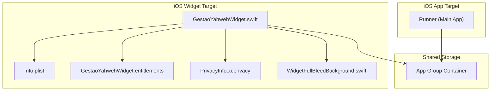
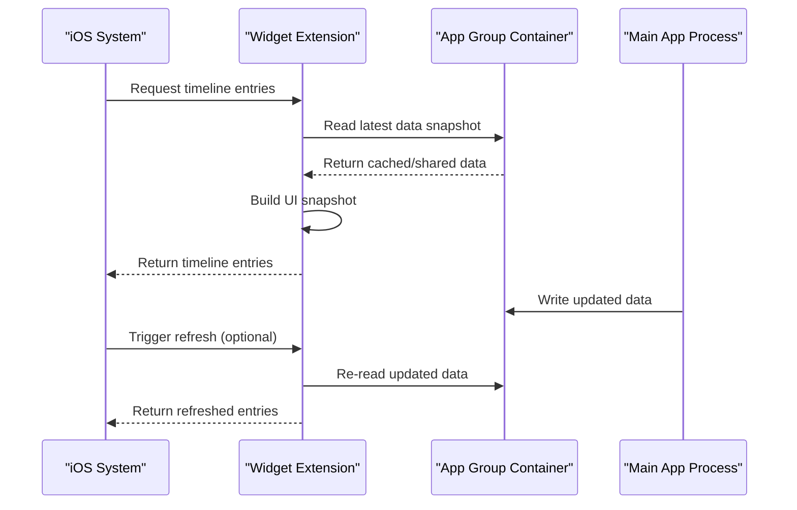
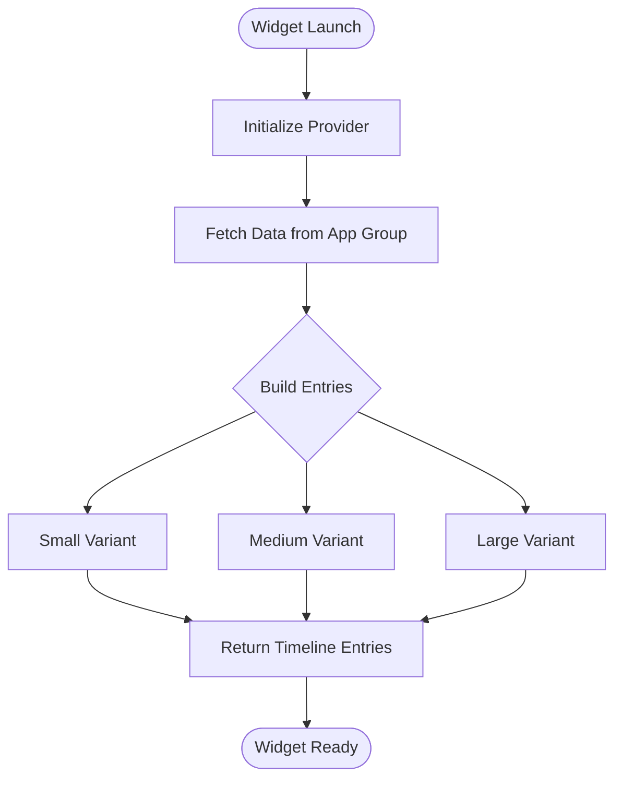
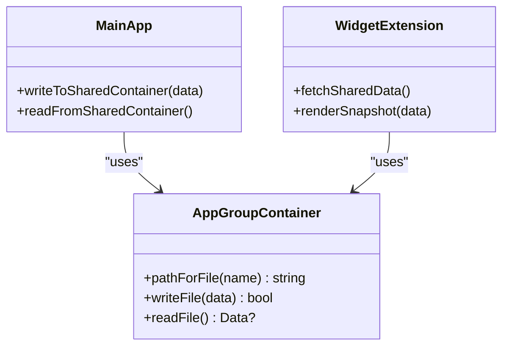
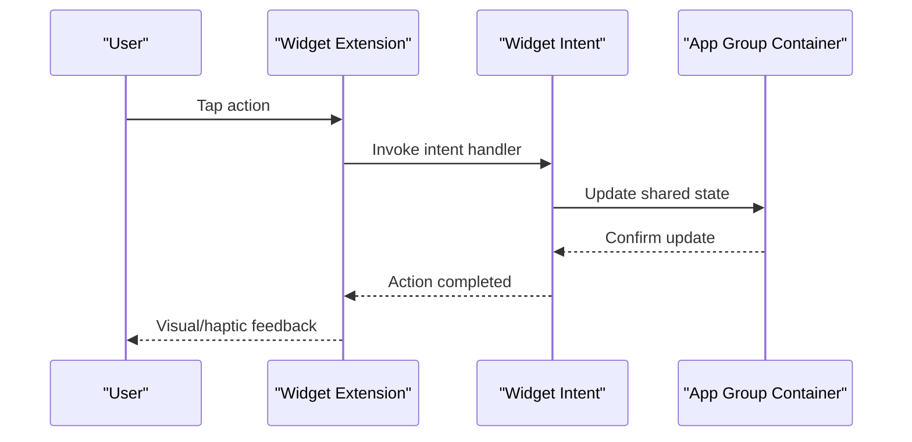
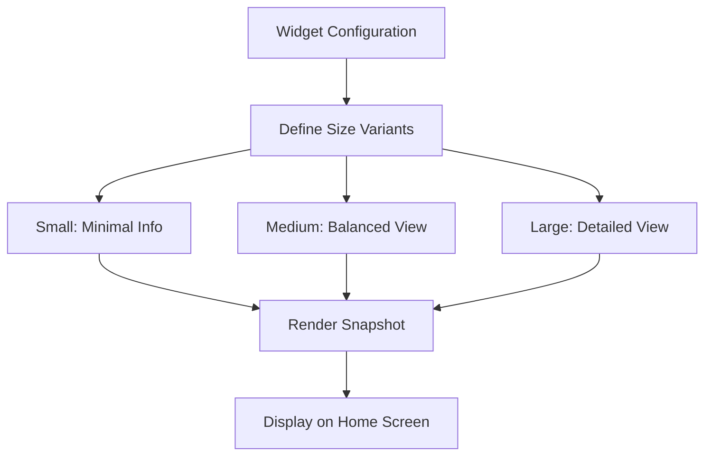
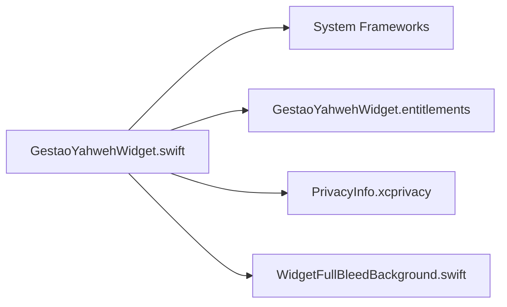

# Widget Extensions

<cite>
**Referenced Files in This Document**
- [LEIA-ME-WIDGET-IOS.md](file://widget/LEIA-ME-WIDGET-IOS.md)
- [GestaoYahwehWidget.swift](file://flutter_app/ios/GestaoYahwehWidget/GestaoYahwehWidget.swift)
- [Info.plist](file://flutter_app/ios/GestaoYahwehWidget/Info.plist)
- [GestaoYahwehWidget.entitlements](file://flutter_app/ios/GestaoYahwehWidget/GestaoYahwehWidget.entitlements)
- [PrivacyInfo.xcprivacy](file://flutter_app/ios/GestaoYahwehWidget/PrivacyInfo.xcprivacy)
- [WidgetFullBleedBackground.swift](file://flutter_app/ios/GestaoYahwehWidget/WidgetFullBleedBackground.swift)
</cite>

## Table of Contents
1. [Introduction](#introduction)
2. [Project Structure](#project-structure)
3. [Core Components](#core-components)
4. [Architecture Overview](#architecture-overview)
5. [Detailed Component Analysis](#detailed-component-analysis)
6. [Dependency Analysis](#dependency-analysis)
7. [Performance Considerations](#performance-considerations)
8. [Troubleshooting Guide](#troubleshooting-guide)
9. [Conclusion](#conclusion)
10. [Appendices](#appendices)

## Introduction
This document explains the iOS widget extension implementation for the project, focusing on the widget target structure, Swift implementation for home screen widgets, and data synchronization with the main app. It covers widget lifecycle, timeline updates, user interaction handling, configuration, size variants (small, medium, large), dynamic content updates, and communication via app groups and shared containers. It also includes guidance for implementing widget intents, handling user actions, and optimizing widget performance.

## Project Structure
The iOS widget is implemented as a separate Xcode target within the Flutter iOS project:
- Widget target directory: flutter_app/ios/GestaoYahwehWidget
- Key files:
  - Swift entry point and timeline provider
  - Info.plist for widget metadata
  - Entitlements for App Groups access
  - Privacy manifest for permissions
  - Optional full-bleed background support

**Diagram sources**
- [GestaoYahwehWidget.swift](file://flutter_app/ios/GestaoYahwehWidget/GestaoYahwehWidget.swift)
- [Info.plist](file://flutter_app/ios/GestaoYahwehWidget/Info.plist)
- [GestaoYahwehWidget.entitlements](file://flutter_app/ios/GestaoYahwehWidget/GestaoYahwehWidget.entitlements)
- [PrivacyInfo.xcprivacy](file://flutter_app/ios/GestaoYahwehWidget/PrivacyInfo.xcprivacy)
- [WidgetFullBleedBackground.swift](file://flutter_app/ios/GestaoYahwehWidget/WidgetFullBleedBackground.swift)

**Section sources**
- [LEIA-ME-WIDGET-IOS.md](file://widget/LEIA-ME-WIDGET-IOS.md)
- [GestaoYahwehWidget.swift](file://flutter_app/ios/GestaoYahwehWidget/GestaoYahwehWidget.swift)
- [Info.plist](file://flutter_app/ios/GestaoYahwehWidget/Info.plist)
- [GestaoYahwehWidget.entitlements](file://flutter_app/ios/GestaoYahwehWidget/GestaoYahwehWidget.entitlements)
- [PrivacyInfo.xcprivacy](file://flutter_app/ios/GestaoYahwehWidget/PrivacyInfo.xcprivacy)
- [WidgetFullBleedBackground.swift](file://flutter_app/ios/GestaoYahwehWidget/WidgetFullBleedBackground.swift)

## Core Components
- Widget Entry Point and Timeline Provider: The Swift file defines the widget’s entry point and implements the timeline provider responsible for generating widget snapshots based on current data.
- Widget Configuration: The Info.plist contains widget metadata, supported configurations, and size variants.
- App Groups Entitlements: The entitlements file grants the widget access to shared storage for synchronizing data with the main app.
- Privacy Manifest: Declares any required privacy attributes for the widget extension.
- Full-Bleed Background: Optional support for full-bleed backgrounds in certain widget sizes.

Key responsibilities:
- Provide timeline entries for small, medium, and large sizes
- Read shared data from App Groups container
- Render UI using SwiftUI or UIKit components
- Handle user interactions via widget intents and actions

**Section sources**
- [GestaoYahwehWidget.swift](file://flutter_app/ios/GestaoYahwehWidget/GestaoYahwehWidget.swift)
- [Info.plist](file://flutter_app/ios/GestaoYahwehWidget/Info.plist)
- [GestaoYahwehWidget.entitlements](file://flutter_app/ios/GestaoYahwehWidget/GestaoYahwehWidget.entitlements)
- [PrivacyInfo.xcprivacy](file://flutter_app/ios/GestaoYahwehWidget/PrivacyInfo.xcprivacy)
- [WidgetFullBleedBackground.swift](file://flutter_app/ios/GestaoYahwehWidget/WidgetFullBleedBackground.swift)

## Architecture Overview
The widget operates as an isolated process that shares data with the main app through an App Group container. The widget reads cached or synchronized data to render timely snapshots without blocking the UI thread. Updates are driven by the timeline provider, which generates entries at specified intervals or upon data changes.

**Diagram sources**
- [GestaoYahwehWidget.swift](file://flutter_app/ios/GestaoYahwehWidget/GestaoYahwehWidget.swift)
- [GestaoYahwehWidget.entitlements](file://flutter_app/ios/GestaoYahwehWidget/GestaoYahwehWidget.entitlements)

## Detailed Component Analysis

### Widget Lifecycle and Timeline Updates
- Initialization: The widget extension initializes its timeline provider and configuration.
- Timeline Generation: The provider creates entries for each supported size variant, embedding necessary data for rendering.
- Refresh Triggers: The system may request new entries based on time intervals or explicit refresh requests.

**Diagram sources**
- [GestaoYahwehWidget.swift](file://flutter_app/ios/GestaoYahwehWidget/GestaoYahwehWidget.swift)

**Section sources**
- [GestaoYahwehWidget.swift](file://flutter_app/ios/GestaoYahwehWidget/GestaoYahwehWidget.swift)

### Data Synchronization with Main App
- Shared Container: Both the main app and widget use the same App Group identifier to read/write shared data.
- Data Format: Typically JSON or structured data stored in a known path within the container.
- Consistency: Ensure atomic writes and versioning to avoid partial reads during updates.

**Diagram sources**
- [GestaoYahwehWidget.entitlements](file://flutter_app/ios/GestaoYahwehWidget/GestaoYahwehWidget.entitlements)

**Section sources**
- [GestaoYahwehWidget.entitlements](file://flutter_app/ios/GestaoYahwehWidget/GestaoYahwehWidget.entitlements)

### User Interaction Handling
- Widget Intents: Define custom intents to handle user actions such as toggling settings or navigating to specific screens.
- Action Handlers: Implement handlers to process intents and update shared data accordingly.
- Feedback: Provide immediate feedback through UI updates or haptic responses where applicable.

**Diagram sources**
- [GestaoYahwehWidget.swift](file://flutter_app/ios/GestaoYahwehWidget/GestaoYahwehWidget.swift)

**Section sources**
- [GestaoYahwehWidget.swift](file://flutter_app/ios/GestaoYahwehWidget/GestaoYahwehWidget.swift)

### Size Variants and Dynamic Content
- Supported Sizes: Small, medium, and large variants are configured in the widget’s metadata.
- Dynamic Content: Each variant renders tailored content based on available space and data relevance.
- Adaptive Layouts: Use responsive layouts to ensure optimal display across all sizes.

**Diagram sources**
- [Info.plist](file://flutter_app/ios/GestaoYahwehWidget/Info.plist)

**Section sources**
- [Info.plist](file://flutter_app/ios/GestaoYahwehWidget/Info.plist)

### Full-Bleed Background Support
- Optional Feature: Enables full-bleed backgrounds for enhanced visual appeal in supported sizes.
- Implementation: Utilizes provided background component to apply images or gradients behind widget content.

**Section sources**
- [WidgetFullBleedBackground.swift](file://flutter_app/ios/GestaoYahwehWidget/WidgetFullBleedBackground.swift)

## Dependency Analysis
The widget extension depends on:
- App Group entitlements for shared data access
- System frameworks for UI rendering and timeline management
- Optional background support for enhanced visuals

**Diagram sources**
- [GestaoYahwehWidget.swift](file://flutter_app/ios/GestaoYahwehWidget/GestaoYahwehWidget.swift)
- [GestaoYahwehWidget.entitlements](file://flutter_app/ios/GestaoYahwehWidget/GestaoYahwehWidget.entitlements)
- [PrivacyInfo.xcprivacy](file://flutter_app/ios/GestaoYahwehWidget/PrivacyInfo.xcprivacy)
- [WidgetFullBleedBackground.swift](file://flutter_app/ios/GestaoYahwehWidget/WidgetFullBleedBackground.swift)

**Section sources**
- [GestaoYahwehWidget.swift](file://flutter_app/ios/GestaoYahwehWidget/GestaoYahwehWidget.swift)
- [GestaoYahwehWidget.entitlements](file://flutter_app/ios/GestaoYahwehWidget/GestaoYahwehWidget.entitlements)
- [PrivacyInfo.xcprivacy](file://flutter_app/ios/GestaoYahwehWidget/PrivacyInfo.xcprivacy)
- [WidgetFullBleedBackground.swift](file://flutter_app/ios/GestaoYahwehWidget/WidgetFullBleedBackground.swift)

## Performance Considerations
- Minimize Data Fetching: Cache data in the App Group container to reduce I/O operations.
- Efficient Rendering: Avoid heavy computations during timeline generation; pre-process data when possible.
- Memory Management: Release unused resources promptly to prevent memory pressure.
- Network Calls: Prefer background sync mechanisms to avoid blocking the widget process.

[No sources needed since this section provides general guidance]

## Troubleshooting Guide
Common issues and resolutions:
- App Group Access Denied: Verify entitlements configuration and ensure both targets share the same group identifier.
- Stale Data: Implement versioning and invalidation strategies to keep shared data consistent.
- Slow Timeline Updates: Profile widget execution and optimize data loading and rendering paths.
- Privacy Violations: Review privacy manifest declarations and ensure compliance with Apple guidelines.

**Section sources**
- [GestaoYahwehWidget.entitlements](file://flutter_app/ios/GestaoYahwehWidget/GestaoYahwehWidget.entitlements)
- [PrivacyInfo.xcprivacy](file://flutter_app/ios/GestaoYahwehWidget/PrivacyInfo.xcprivacy)

## Conclusion
The iOS widget extension integrates seamlessly with the main app through App Groups, providing timely and relevant information on the home screen. By adhering to best practices for data synchronization, user interaction handling, and performance optimization, the widget delivers a robust and engaging user experience.

[No sources needed since this section summarizes without analyzing specific files]

## Appendices
- Additional references and setup instructions can be found in the widget documentation file.

**Section sources**
- [LEIA-ME-WIDGET-IOS.md](file://widget/LEIA-ME-WIDGET-IOS.md)