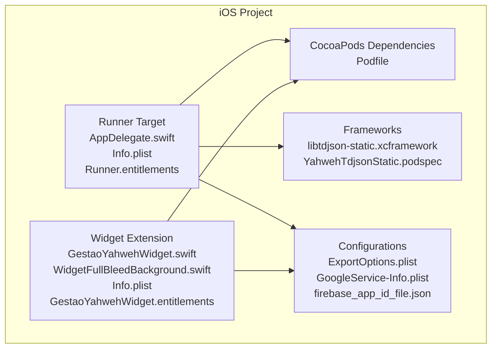
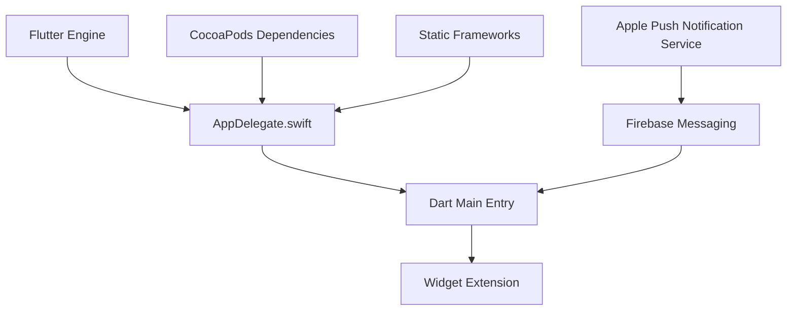
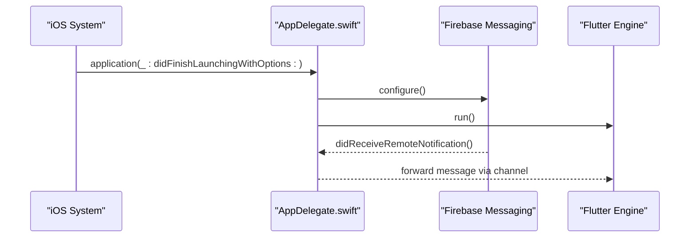
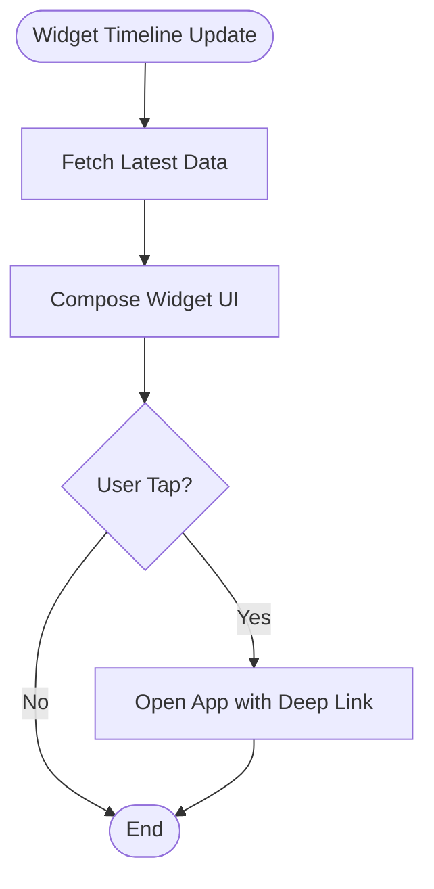
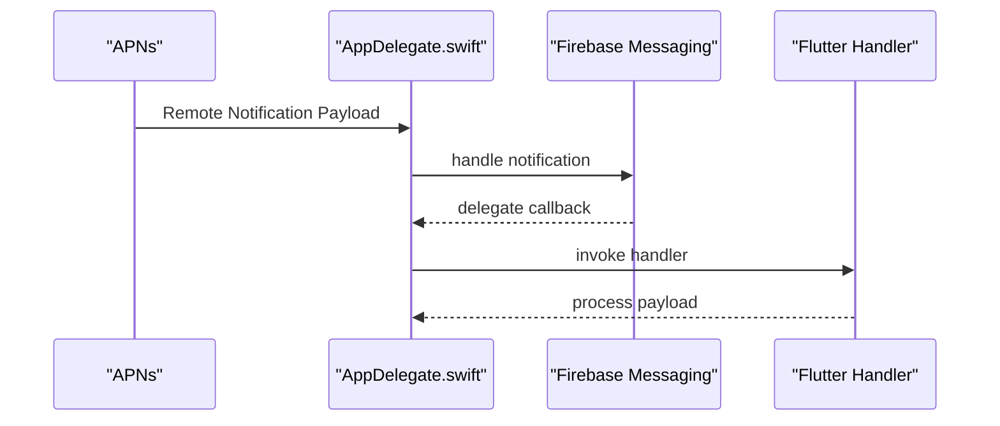
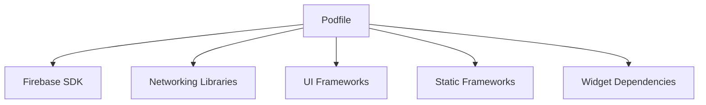

# iOS Implementation & Configuration

<cite>
**Referenced Files in This Document**
- [AppDelegate.swift](file://flutter_app/ios/Runner/AppDelegate.swift)
- [Info.plist](file://flutter_app/ios/Runner/Info.plist)
- [Runner.entitlements](file://flutter_app/ios/Runner/Runner.entitlements)
- [Podfile](file://flutter_app/ios/Podfile)
- [GestaoYahwehWidget.swift](file://flutter_app/ios/GestaoYahwehWidget/GestaoYahwehWidget.swift)
- [WidgetFullBleedBackground.swift](file://flutter_app/ios/GestaoYahwehWidget/WidgetFullBleedBackground.swift)
- [Info.plist (Widget)](file://flutter_app/ios/GestaoYahwehWidget/Info.plist)
- [GestaoYahwehWidget.entitlements](file://flutter_app/ios/GestaoYahwehWidget/GestaoYahwehWidget.entitlements)
- [ExportOptions.plist](file://flutter_app/ios/ExportOptions.plist)
- [GoogleService-Info.plist](file://flutter_app/ios/Runner/GoogleService-Info.plist)
- [firebase_app_id_file.json](file://flutter_app/ios/firebase_app_id_file.json)
- [codemagic_ios_install_signing.sh](file://scripts/codemagic_ios_install_signing.sh)
- [codemagic_ios_prepare_build_ipa.sh](file://scripts/codemagic_ios_prepare_build_ipa.sh)
- [codemagic_ios_validate_export_options.py](file://scripts/codemagic_ios_validate_export_options.py)
- [codemagic_ios_enable_push_notifications.py](file://scripts/codemagic_ios_enable_push_notifications.py)
- [codemagic_ios_ensure_widget_appstore_profile.py](file://scripts/codemagic_ios_ensure_widget_appstore_profile.py)
- [codemagic_ios_write_export_options.py](file://scripts/codemagic_ios_write_export_options.py)
- [build_ios_ipa_macos.sh](file://scripts/build_ios_ipa_macos.sh)
- [LEIA-ME-APNS.md](file://IOS/apn/LEIA-ME-APNS.md)
- [CODEMAGIC_APP_STORE_INTEGRATION.txt](file://IOS/CODEMAGIC_APP_STORE_INTEGRATION.txt)
- [CREDENCIAIS APPLE ATUAL.txt](file://IOS/CREDENCIAIS_APPLE_ATUAL.txt)
- [APP_STORE_3_1_1_ORGANIZATION_SIGNUP.md](file://IOS/APP_STORE_3_1_1_ORGANIZATION_SIGNUP.md)
- [README.md](file://flutter_app/README.md)
</cite>

## Table of Contents
1. [Introduction](#introduction)
2. [Project Structure](#project-structure)
3. [Core Components](#core-components)
4. [Architecture Overview](#architecture-overview)
5. [Detailed Component Analysis](#detailed-component-analysis)
6. [Dependency Analysis](#dependency-analysis)
7. [Performance Considerations](#performance-considerations)
8. [Troubleshooting Guide](#troubleshooting-guide)
9. [Conclusion](#conclusion)
10. [Appendices](#appendices)

## Introduction
This document provides comprehensive iOS implementation and configuration guidance for Gestão Yahweh Premium. It covers the Flutter-based iOS project structure, Swift native integration points, widget extensions, background task handling, dependency management via CocoaPods, and App Store Connect deployment workflows. It also includes build scheme configuration, code signing, performance optimizations, memory management, debugging techniques, and CI/CD considerations using CodeMagic.

## Project Structure
The iOS portion of the project resides under flutter_app/ios and follows standard Flutter conventions:
- Runner target: main app entry point, Info.plist, entitlements, and Firebase configuration.
- Widget extension: a separate target for home screen widgets with its own Info.plist and entitlements.
- Frameworks directory: static frameworks and podspecs for native integrations.
- Podfile: CocoaPods configuration for third-party dependencies.
- Export options and auxiliary files for distribution and signing.

**Diagram sources**
- [AppDelegate.swift](file://flutter_app/ios/Runner/AppDelegate.swift)
- [Info.plist](file://flutter_app/ios/Runner/Info.plist)
- [Runner.entitlements](file://flutter_app/ios/Runner/Runner.entitlements)
- [GestaoYahwehWidget.swift](file://flutter_app/ios/GestaoYahwehWidget/GestaoYahwehWidget.swift)
- [WidgetFullBleedBackground.swift](file://flutter_app/ios/GestaoYahwehWidget/WidgetFullBleedBackground.swift)
- [Info.plist (Widget)](file://flutter_app/ios/GestaoYahwehWidget/Info.plist)
- [GestaoYahwehWidget.entitlements](file://flutter_app/ios/GestaoYahwehWidget/GestaoYahwehWidget.entitlements)
- [Podfile](file://flutter_app/ios/Podfile)
- [ExportOptions.plist](file://flutter_app/ios/ExportOptions.plist)
- [GoogleService-Info.plist](file://flutter_app/ios/Runner/GoogleService-Info.plist)
- [firebase_app_id_file.json](file://flutter_app/ios/firebase_app_id_file.json)

**Section sources**
- [README.md](file://flutter_app/README.md)

## Core Components
Key iOS components include:
- AppDelegate: initializes platform services and bridges to Flutter plugins.
- Widget extension: renders dynamic content on the home screen and handles user interactions.
- Background tasks: managed via system APIs and plugin channels to perform periodic work.
- Push notifications: configured through APNs and Firebase Messaging.
- Signing and provisioning: handled via entitlements, profiles, and export options.

**Section sources**
- [AppDelegate.swift](file://flutter_app/ios/Runner/AppDelegate.swift)
- [GestaoYahwehWidget.swift](file://flutter_app/ios/GestaoYahwehWidget/GestaoYahwehWidget.swift)
- [WidgetFullBleedBackground.swift](file://flutter_app/ios/GestaoYahwehWidget/WidgetFullBleedBackground.swift)
- [Info.plist](file://flutter_app/ios/Runner/Info.plist)
- [Info.plist (Widget)](file://flutter_app/ios/GestaoYahwehWidget/Info.plist)
- [Runner.entitlements](file://flutter_app/ios/Runner/Runner.entitlements)
- [GestaoYahwehWidget.entitlements](file://flutter_app/ios/GestaoYahwehWidget/GestaoYahwehWidget.entitlements)

## Architecture Overview
The iOS architecture integrates Flutter’s Dart layer with native Swift components and platform services:
- Flutter engine initializes via AppDelegate and loads the main Dart entry point.
- Widgets are implemented as a separate extension target, sharing data via App Groups or shared storage.
- Push notifications flow from APNs to Firebase Messaging and then to Flutter handlers.
- CocoaPods manages third-party libraries and static frameworks.

**Diagram sources**
- [AppDelegate.swift](file://flutter_app/ios/Runner/AppDelegate.swift)
- [GestaoYahwehWidget.swift](file://flutter_app/ios/GestaoYahwehWidget/GestaoYahwehWidget.swift)
- [Podfile](file://flutter_app/ios/Podfile)
- [GoogleService-Info.plist](file://flutter_app/ios/Runner/GoogleService-Info.plist)

## Detailed Component Analysis

### AppDelegate Implementation
- Initializes Firebase and other platform services before Flutter engine starts.
- Registers notification delegates and configures push notification capabilities.
- Bridges plugin registration and lifecycle events to Flutter.

**Diagram sources**
- [AppDelegate.swift](file://flutter_app/ios/Runner/AppDelegate.swift)
- [GoogleService-Info.plist](file://flutter_app/ios/Runner/GoogleService-Info.plist)

**Section sources**
- [AppDelegate.swift](file://flutter_app/ios/Runner/AppDelegate.swift)

### Widget Extensions
- Implements UI composition and data fetching for home screen widgets.
- Uses SwiftUI or UIKit depending on implementation; shares state via App Groups or shared containers.
- Handles user taps to open the main app and deep-link into specific features.

**Diagram sources**
- [GestaoYahwehWidget.swift](file://flutter_app/ios/GestaoYahwehWidget/GestaoYahwehWidget.swift)
- [WidgetFullBleedBackground.swift](file://flutter_app/ios/GestaoYahwehWidget/WidgetFullBleedBackground.swift)
- [Info.plist (Widget)](file://flutter_app/ios/GestaoYahwehWidget/Info.plist)
- [GestaoYahwehWidget.entitlements](file://flutter_app/ios/GestaoYahwehWidget/GestaoYahwehWidget.entitlements)

**Section sources**
- [GestaoYahwehWidget.swift](file://flutter_app/ios/GestaoYahwehWidget/GestaoYahwehWidget.swift)
- [WidgetFullBleedBackground.swift](file://flutter_app/ios/GestaoYahwehWidget/WidgetFullBleedBackground.swift)
- [Info.plist (Widget)](file://flutter_app/ios/GestaoYahwehWidget/Info.plist)
- [GestaoYahwehWidget.entitlements](file://flutter_app/ios/GestaoYahwehWidget/GestaoYahwehWidget.entitlements)

### Background Task Handling
- Utilizes system background modes declared in Info.plist and entitlements.
- Coordinates with Flutter plugins to execute periodic tasks without blocking the main thread.
- Ensures compliance with iOS background execution limits and battery optimization policies.

**Section sources**
- [Info.plist](file://flutter_app/ios/Runner/Info.plist)
- [Runner.entitlements](file://flutter_app/ios/Runner/Runner.entitlements)

### Push Notifications
- Configured via GoogleService-Info.plist and Firebase setup in AppDelegate.
- Requires APNs certificate and proper entitlements for receiving remote notifications.
- Integrates with Flutter messaging handlers for in-app processing.

**Diagram sources**
- [AppDelegate.swift](file://flutter_app/ios/Runner/AppDelegate.swift)
- [GoogleService-Info.plist](file://flutter_app/ios/Runner/GoogleService-Info.plist)
- [LEIA-ME-APNS.md](file://IOS/apn/LEIA-ME-APNS.md)

**Section sources**
- [GoogleService-Info.plist](file://flutter_app/ios/Runner/GoogleService-Info.plist)
- [LEIA-ME-APNS.md](file://IOS/apn/LEIA-ME-APNS.md)

### Dependency Management with CocoaPods
- Podfile defines all third-party dependencies and static frameworks.
- Ensures consistent builds across environments by locking versions.
- Supports custom podspecs for internal libraries like YahwehTdjsonStatic.

**Section sources**
- [Podfile](file://flutter_app/ios/Podfile)

### Framework Integrations
- Static frameworks such as libtdjson-static.xcframework are included for advanced functionality.
- Custom podspecs manage packaging and distribution of internal libraries.

**Section sources**
- [YahwehTdjsonStatic.podspec](file://flutter_app/ios/Frameworks/YahwehTdjsonStatic.podspec)

## Dependency Analysis
Dependencies are managed through CocoaPods and structured into logical groups:
- Core dependencies for Firebase, networking, and UI.
- Static frameworks for specialized features.
- Widget-specific dependencies isolated in the extension target.

**Diagram sources**
- [Podfile](file://flutter_app/ios/Podfile)

**Section sources**
- [Podfile](file://flutter_app/ios/Podfile)

## Performance Considerations
- Minimize main thread work in AppDelegate and widget updates.
- Use background queues for network requests and data processing.
- Optimize widget refresh intervals to reduce battery usage.
- Leverage caching strategies for frequently accessed data.
- Profile memory usage with Instruments to detect leaks and overallocations.

[No sources needed since this section provides general guidance]

## Troubleshooting Guide
Common issues and resolutions:
- Build failures due to missing certificates or profiles: verify signing configurations and entitlements.
- Push notifications not received: ensure APNs certificate is valid and Firebase configuration matches bundle ID.
- Widget not updating: check App Group permissions and data synchronization mechanisms.
- CocoaPods installation errors: clean derived data and reinstall pods.

**Section sources**
- [CODEMAGIC_APP_STORE_INTEGRATION.txt](file://IOS/CODEMAGIC_APP_STORE_INTEGRATION.txt)
- [CREDENCIAIS APPLE ATUAL.txt](file://IOS/CREDENCIAIS_APPLE_ATUAL.txt)
- [APP_STORE_3_1_1_ORGANIZATION_SIGNUP.md](file://IOS/APP_STORE_3_1_1_ORGANIZATION_SIGNUP.md)

## Conclusion
This document outlined the iOS implementation for Gestão Yahweh Premium, covering project structure, Swift integration, widget extensions, background tasks, dependency management, and deployment processes. By following these guidelines, developers can maintain a robust, performant, and secure iOS application that integrates seamlessly with Flutter and platform services.

[No sources needed since this section summarizes without analyzing specific files]

## Appendices

### Build Schemes and Code Signing
- Configure build schemes in Xcode for Debug, Release, and Distribution targets.
- Set up signing certificates and provisioning profiles for both app and widget targets.
- Use ExportOptions.plist for App Store Connect uploads.

**Section sources**
- [ExportOptions.plist](file://flutter_app/ios/ExportOptions.plist)
- [Runner.entitlements](file://flutter_app/ios/Runner/Runner.entitlements)
- [GestaoYahwehWidget.entitlements](file://flutter_app/ios/GestaoYahwehWidget/GestaoYahwehWidget.entitlements)

### App Store Connect Integration
- Follow steps in APP_STORE_3_1_1_ORGANIZATION_SIGNUP.md for organization setup.
- Use CODEMAGIC_APP_STORE_INTEGRATION.txt for CI/CD pipeline configuration.
- Ensure correct bundle identifiers and versioning align with App Store requirements.

**Section sources**
- [APP_STORE_3_1_1_ORGANIZATION_SIGNUP.md](file://IOS/APP_STORE_3_1_1_ORGANIZATION_SIGNUP.md)
- [CODEMAGIC_APP_STORE_INTEGRATION.txt](file://IOS/CODEMAGIC_APP_STORE_INTEGRATION.txt)

### CI/CD with CodeMagic
- Scripts automate signing, building, and uploading IPA files.
- Validate export options and profiles before upload.
- Enable push notifications and App Groups programmatically during build.

**Section sources**
- [codemagic_ios_install_signing.sh](file://scripts/codemagic_ios_install_signing.sh)
- [codemagic_ios_prepare_build_ipa.sh](file://scripts/codemagic_ios_prepare_build_ipa.sh)
- [codemagic_ios_validate_export_options.py](file://scripts/codemagic_ios_validate_export_options.py)
- [codemagic_ios_enable_push_notifications.py](file://scripts/codemagic_ios_enable_push_notifications.py)
- [codemagic_ios_ensure_widget_appstore_profile.py](file://scripts/codemagic_ios_ensure_widget_appstore_profile.py)
- [codemagic_ios_write_export_options.py](file://scripts/codemagic_ios_write_export_options.py)
- [build_ios_ipa_macos.sh](file://scripts/build_ios_ipa_macos.sh)