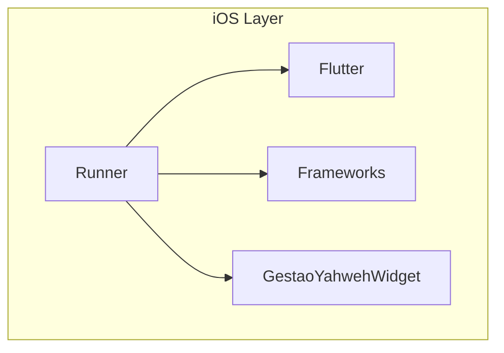
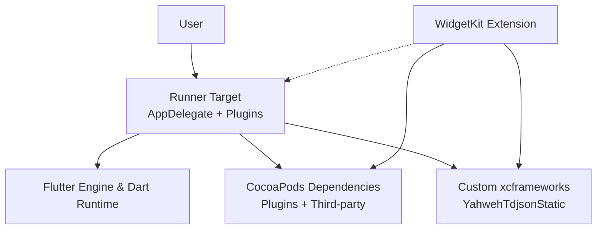
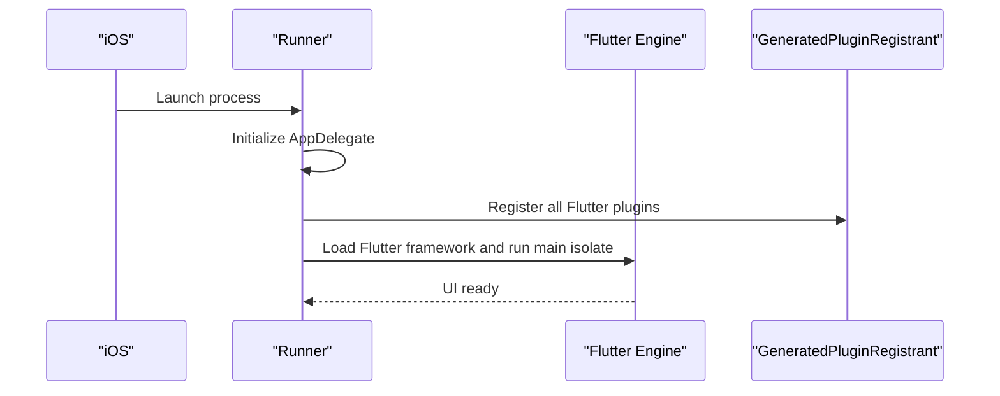
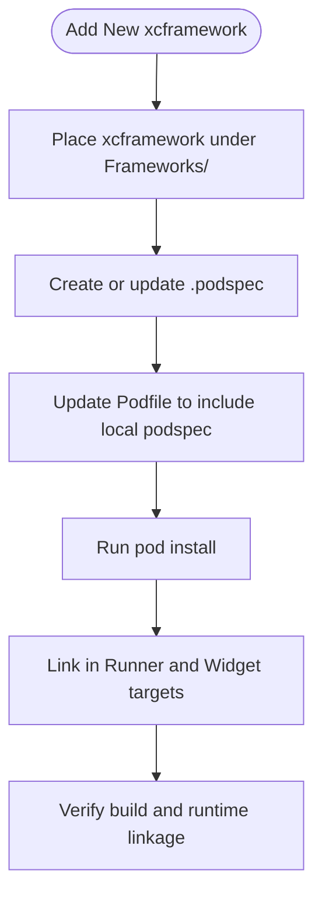
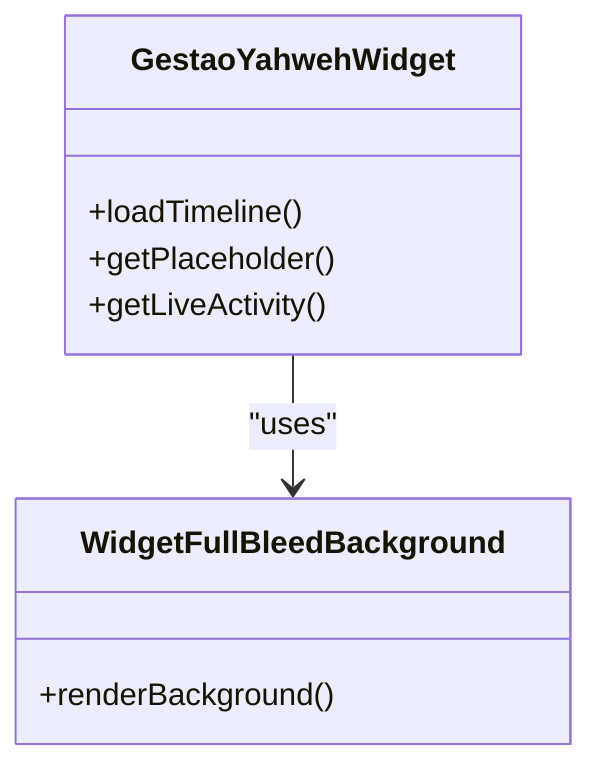
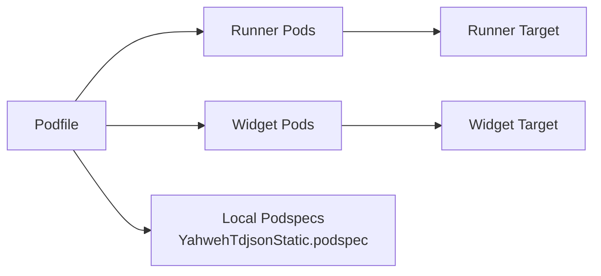

# iOS Project Structure

<cite>
**Referenced Files in This Document**
- [Podfile](file://flutter_app/ios/Podfile)
- [AppFrameworkInfo.plist](file://flutter_app/ios/Flutter/AppFrameworkInfo.plist)
- [Debug.xcconfig](file://flutter_app/ios/Flutter/Debug.xcconfig)
- [Release.xcconfig](file://flutter_app/ios/Flutter/Release.xcconfig)
- [Generated.xcconfig](file://flutter_app/ios/Flutter/Generated.xcconfig)
- [flutter_export_environment.sh](file://flutter_app/ios/Flutter/flutter_export_environment.sh)
- [Runner.entitlements](file://flutter_app/ios/Runner/Runner.entitlements)
- [GoogleService-Info.plist](file://flutter_app/ios/Runner/GoogleService-Info.plist)
- [Info.plist](file://flutter_app/ios/Runner/Info.plist)
- [PrivacyInfo.xcprivacy](file://flutter_app/ios/Runner/PrivacyInfo.xcprivacy)
- [AppDelegate.swift](file://flutter_app/ios/Runner/AppDelegate.swift)
- [GeneratedPluginRegistrant.h](file://flutter_app/ios/Runner/GeneratedPluginRegistrant.h)
- [GeneratedPluginRegistrant.m](file://flutter_app/ios/Runner/GeneratedPluginRegistrant.m)
- [Runner-Bridging-Header.h](file://flutter_app/ios/Runner/Runner-Bridging-Header.h)
- [contents.xcworkspacedata](file://flutter_app/ios/Runner.xcworkspace/contents.xcworkspacedata)
- [WorkspaceSettings.xcsettings](file://flutter_app/ios/Runner.xcworkspace/xcshareddata/WorkspaceSettings.xcsettings)
- [IDEWorkspaceChecks.plist](file://flutter_app/ios/Runner.xcworkspace/xcshareddata/IDEWorkspaceChecks.plist)
- [YahwehTdjsonStatic.podspec](file://flutter_app/ios/Frameworks/YahwehTdjsonStatic.podspec)
- [libtdjson-static.xcframework Info.plist](file://flutter_app/ios/Frameworks/libtdjson-static.xcframework/Info.plist)
- [GestaoYahwehWidget.swift](file://flutter_app/ios/GestaoYahwehWidget/GestaoYahwehWidget.swift)
- [WidgetFullBleedBackground.swift](file://flutter_app/ios/GestaoYahwehWidget/WidgetFullBleedBackground.swift)
- [Info.plist (Widget)](file://flutter_app/ios/GestaoYahwehWidget/Info.plist)
- [GestaoYahwehWidget.entitlements](file://flutter_app/ios/GestaoYahwehWidget/GestaoYahwehWidget.entitlements)
- [ExportOptions.plist](file://flutter_app/ios/ExportOptions.plist)
- [firebase_app_id_file.json](file://flutter_app/ios/firebase_app_id_file.json)
- [asc_build_number_floor.txt](file://flutter_app/ios/asc_build_number_floor.txt)
</cite>

## Table of Contents
1. Introduction
2. Project Structure
3. Core Components
4. Architecture Overview
5. Detailed Component Analysis
6. Dependency Analysis
7. Performance Considerations
8. Troubleshooting Guide
9. Conclusion

## Introduction
This document explains the iOS project structure for Gestão Yahweh Premium, focusing on the Flutter iOS wrapper organization, Runner app configuration, and Flutter framework integration. It covers directory layout (Runner, Flutter, Frameworks, widget extensions), Podfile configuration for dependency management, platform targets, custom pod specifications, generated files, build configurations, and Xcode workspace setup. It also includes practical guidance for adding new frameworks, modifying build settings, and managing iOS-specific dependencies.

## Project Structure
The iOS portion lives under flutter_app/ios and follows standard Flutter conventions:
- Runner: The native iOS application target that hosts the Flutter engine and plugins.
- Flutter: Generated and shared configuration files used by the Flutter toolchain and Xcode.
- Frameworks: Custom or vendored frameworks and xcframeworks integrated into the app.
- GestaoYahwehWidget: A WidgetKit extension providing home screen widgets.
- Root-level iOS assets: Export options, Firebase identifiers, and App Store Connect helpers.

**Diagram sources**
- [contents.xcworkspacedata](file://flutter_app/ios/Runner.xcworkspace/contents.xcworkspacedata)
- [AppFrameworkInfo.plist](file://flutter_app/ios/Flutter/AppFrameworkInfo.plist)
- [YahwehTdjsonStatic.podspec](file://flutter_app/ios/Frameworks/YahwehTdjsonStatic.podspec)
- [GestaoYahwehWidget.swift](file://flutter_app/ios/GestaoYahwehWidget/GestaoYahwehWidget.swift)

**Section sources**
- [contents.xcworkspacedata](file://flutter_app/ios/Runner.xcworkspace/contents.xcworkspacedata)
- [AppFrameworkInfo.plist](file://flutter_app/ios/Flutter/AppFrameworkInfo.plist)
- [YahwehTdjsonStatic.podspec](file://flutter_app/ios/Frameworks/YahwehTdjsonStatic.podspec)
- [GestaoYahwehWidget.swift](file://flutter_app/ios/GestaoYahwehWidget/GestaoYahwehWidget.swift)

## Core Components
- Runner target: Entry point for the iOS app, integrates Flutter via AppDelegate and plugin registrants.
- Flutter config layer: xcconfig files and environment scripts generated by Flutter to wire build settings and paths.
- Custom frameworks: Vendored libraries packaged as xcframeworks with a local podspec for CocoaPods consumption.
- Widget extension: A separate target for WidgetKit, sharing code and resources with the main app.

Key responsibilities:
- Runner: Bootstraps Flutter, initializes plugins, and manages lifecycle.
- Flutter: Provides consistent build settings across Debug/Release and exports environment variables.
- Frameworks: Encapsulates third-party or internal binaries; exposed through a podspec.
- Widget: Implements WidgetKit components and shares data with the main app via app groups.

**Section sources**
- [AppDelegate.swift](file://flutter_app/ios/Runner/AppDelegate.swift)
- [GeneratedPluginRegistrant.h](file://flutter_app/ios/Runner/GeneratedPluginRegistrant.h)
- [GeneratedPluginRegistrant.m](file://flutter_app/ios/Runner/GeneratedPluginRegistrant.m)
- [Debug.xcconfig](file://flutter_app/ios/Flutter/Debug.xcconfig)
- [Release.xcconfig](file://flutter_app/ios/Flutter/Release.xcconfig)
- [Generated.xcconfig](file://flutter_app/ios/Flutter/Generated.xcconfig)
- [flutter_export_environment.sh](file://flutter_app/ios/Flutter/flutter_export_environment.sh)
- [YahwehTdjsonStatic.podspec](file://flutter_app/ios/Frameworks/YahwehTdjsonStatic.podspec)
- [GestaoYahwehWidget.swift](file://flutter_app/ios/GestaoYahwehWidget/GestaoYahwehWidget.swift)

## Architecture Overview
The iOS architecture layers the native Runner around the Flutter engine, integrating plugins and custom frameworks, while exposing a WidgetKit extension for home screen widgets. CocoaPods manages dependencies and links them into both Runner and Widget targets.

**Diagram sources**
- [AppDelegate.swift](file://flutter_app/ios/Runner/AppDelegate.swift)
- [GeneratedPluginRegistrant.m](file://flutter_app/ios/Runner/GeneratedPluginRegistrant.m)
- [Podfile](file://flutter_app/ios/Podfile)
- [YahwehTdjsonStatic.podspec](file://flutter_app/ios/Frameworks/YahwehTdjsonStatic.podspec)
- [GestaoYahwehWidget.swift](file://flutter_app/ios/GestaoYahwehWidget/GestaoYahwehWidget.swift)

## Detailed Component Analysis

### Runner Target
The Runner is the primary iOS application target. It initializes Flutter, registers plugins, and loads the Flutter view controller. It also contains app metadata, entitlements, and Firebase configuration.

Key elements:
- AppDelegate: Bootstraps Flutter and handles app lifecycle events.
- GeneratedPluginRegistrant: Auto-generated registration of Flutter plugins at runtime.
- Info.plist: App metadata, permissions, and bundle identifiers.
- GoogleService-Info.plist: Firebase configuration for services like Analytics and Messaging.
- PrivacyInfo.xcprivacy: Privacy manifest required by modern iOS versions.
- Runner.entitlements: Capabilities such as Push Notifications, App Groups, etc.

**Diagram sources**
- [AppDelegate.swift](file://flutter_app/ios/Runner/AppDelegate.swift)
- [GeneratedPluginRegistrant.m](file://flutter_app/ios/Runner/GeneratedPluginRegistrant.m)

**Section sources**
- [AppDelegate.swift](file://flutter_app/ios/Runner/AppDelegate.swift)
- [GeneratedPluginRegistrant.h](file://flutter_app/ios/Runner/GeneratedPluginRegistrant.h)
- [GeneratedPluginRegistrant.m](file://flutter_app/ios/Runner/GeneratedPluginRegistrant.m)
- [Info.plist](file://flutter_app/ios/Runner/Info.plist)
- [GoogleService-Info.plist](file://flutter_app/ios/Runner/GoogleService-Info.plist)
- [PrivacyInfo.xcprivacy](file://flutter_app/ios/Runner/PrivacyInfo.xcprivacy)
- [Runner.entitlements](file://flutter_app/ios/Runner/Runner.entitlements)

### Flutter Configuration Layer
The Flutter layer provides build-time and runtime configuration for the iOS target.

- AppFrameworkInfo.plist: Describes the Flutter framework bundle metadata.
- Debug.xcconfig / Release.xcconfig: Build settings for each configuration.
- Generated.xcconfig: Generated by Flutter tooling to link paths and flags.
- flutter_export_environment.sh: Exports environment variables needed by the build.

These files ensure consistent linking of the Flutter framework and correct deployment targets across environments.

**Section sources**
- [AppFrameworkInfo.plist](file://flutter_app/ios/Flutter/AppFrameworkInfo.plist)
- [Debug.xcconfig](file://flutter_app/ios/Flutter/Debug.xcconfig)
- [Release.xcconfig](file://flutter_app/ios/Flutter/Release.xcconfig)
- [Generated.xcconfig](file://flutter_app/ios/Flutter/Generated.xcconfig)
- [flutter_export_environment.sh](file://flutter_app/ios/Flutter/flutter_export_environment.sh)

### Custom Frameworks and Local Podspecs
Vendored libraries are packaged as xcframeworks and consumed via a local podspec. This enables CocoaPods to manage versioning and linking consistently.

- libtdjson-static.xcframework: Static library for TDLib functionality, multi-architecture support.
- YahwehTdjsonStatic.podspec: Defines how to include the xcframework in the build.

**Diagram sources**
- [libtdjson-static.xcframework Info.plist](file://flutter_app/ios/Frameworks/libtdjson-static.xcframework/Info.plist)
- [YahwehTdjsonStatic.podspec](file://flutter_app/ios/Frameworks/YahwehTdjsonStatic.podspec)

**Section sources**
- [libtdjson-static.xcframework Info.plist](file://flutter_app/ios/Frameworks/libtdjson-static.xcframework/Info.plist)
- [YahwehTdjsonStatic.podspec](file://flutter_app/ios/Frameworks/YahwehTdjsonStatic.podspec)

### WidgetKit Extension
The GestaoYahwehWidget target implements WidgetKit components and shares data with the main app.

- GestaoYahwehWidget.swift: Main widget implementation.
- WidgetFullBleedBackground.swift: Background rendering logic for full-bleed widgets.
- Info.plist (Widget): Widget metadata and supported families.
- GestaoYahwehWidget.entitlements: Capabilities required by the extension (e.g., App Groups).

**Diagram sources**
- [GestaoYahwehWidget.swift](file://flutter_app/ios/GestaoYahwehWidget/GestaoYahwehWidget.swift)
- [WidgetFullBleedBackground.swift](file://flutter_app/ios/GestaoYahwehWidget/WidgetFullBleedBackground.swift)

**Section sources**
- [GestaoYahwehWidget.swift](file://flutter_app/ios/GestaoYahwehWidget/GestaoYahwehWidget.swift)
- [WidgetFullBleedBackground.swift](file://flutter_app/ios/GestaoYahwehWidget/WidgetFullBleedBackground.swift)
- [Info.plist (Widget)](file://flutter_app/ios/GestaoYahwehWidget/Info.plist)
- [GestaoYahwehWidget.entitlements](file://flutter_app/ios/GestaoYahwehWidget/GestaoYahwehWidget.entitlements)

### Xcode Workspace Setup
The workspace aggregates targets and configurations:
- contents.xcworkspacedata: Declares included projects and schemes.
- IDEWorkspaceChecks.plist: Ensures workspace consistency checks.
- WorkspaceSettings.xcsettings: Shared workspace preferences.

Open the workspace file in Xcode to build and test both Runner and Widget targets together.

**Section sources**
- [contents.xcworkspacedata](file://flutter_app/ios/Runner.xcworkspace/contents.xcworkspacedata)
- [IDEWorkspaceChecks.plist](file://flutter_app/ios/Runner.xcworkspace/xcshareddata/IDEWorkspaceChecks.plist)
- [WorkspaceSettings.xcsettings](file://flutter_app/ios/Runner.xcworkspace/xcshareddata/WorkspaceSettings.xcsettings)

## Dependency Analysis
CocoaPods is used to manage dependencies for both Runner and Widget targets. The Podfile defines source repositories, platform targets, and includes local podspecs for custom frameworks.

Key aspects:
- Platform declaration sets minimum iOS version.
- Targets specify pods for Runner and Widget.
- Local podspec references vendor xcframeworks.
- Post-install hooks may configure build settings or copy resources.

**Diagram sources**
- [Podfile](file://flutter_app/ios/Podfile)
- [YahwehTdjsonStatic.podspec](file://flutter_app/ios/Frameworks/YahwehTdjsonStatic.podspec)

**Section sources**
- [Podfile](file://flutter_app/ios/Podfile)
- [YahwehTdjsonStatic.podspec](file://flutter_app/ios/Frameworks/YahwehTdjsonStatic.podspec)

## Performance Considerations
- Prefer static xcframeworks where possible to reduce dynamic loading overhead.
- Keep plugin registrations minimal; avoid unnecessary native modules.
- Use appropriate deployment targets to balance compatibility and performance.
- Enable bitcode and strip symbols in release builds to reduce binary size.
- Profile widget timelines to avoid heavy computations during timeline updates.

[No sources needed since this section provides general guidance]

## Troubleshooting Guide
Common issues and resolutions:
- CocoaPods failures: Ensure platform versions match Podfile and installed SDKs; run pod repo update and reinstall.
- Missing headers for xcframeworks: Verify podspec paths and architectures; confirm inclusion in both Runner and Widget targets.
- Entitlements mismatches: Align Runner and Widget entitlements for shared capabilities (e.g., App Groups, Push Notifications).
- Firebase configuration errors: Validate GoogleService-Info.plist and ensure it is linked in Runner.
- Privacy manifest warnings: Confirm PrivacyInfo.xcprivacy exists and lists required keys.

**Section sources**
- [Podfile](file://flutter_app/ios/Podfile)
- [YahwehTdjsonStatic.podspec](file://flutter_app/ios/Frameworks/YahwehTdjsonStatic.podspec)
- [Runner.entitlements](file://flutter_app/ios/Runner/Runner.entitlements)
- [GoogleService-Info.plist](file://flutter_app/ios/Runner/GoogleService-Info.plist)
- [PrivacyInfo.xcprivacy](file://flutter_app/ios/Runner/PrivacyInfo.xcprivacy)

## Conclusion
The iOS project for Gestão Yahweh Premium follows Flutter’s standard structure with clear separation between Runner, Flutter configuration, custom frameworks, and WidgetKit extension. CocoaPods centralizes dependency management, while local podspecs encapsulate vendored libraries. Proper configuration of entitlements, privacy manifests, and Firebase settings ensures a robust build pipeline. Following the guidance here will streamline adding new frameworks, updating build settings, and maintaining iOS-specific dependencies.

[No sources needed since this section summarizes without analyzing specific files]