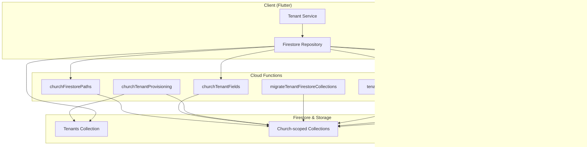
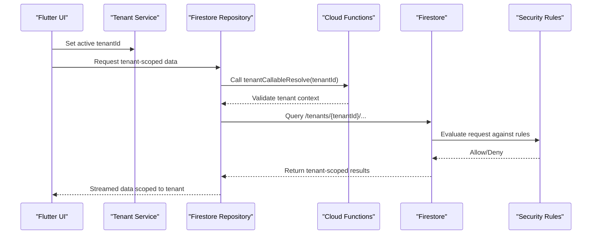
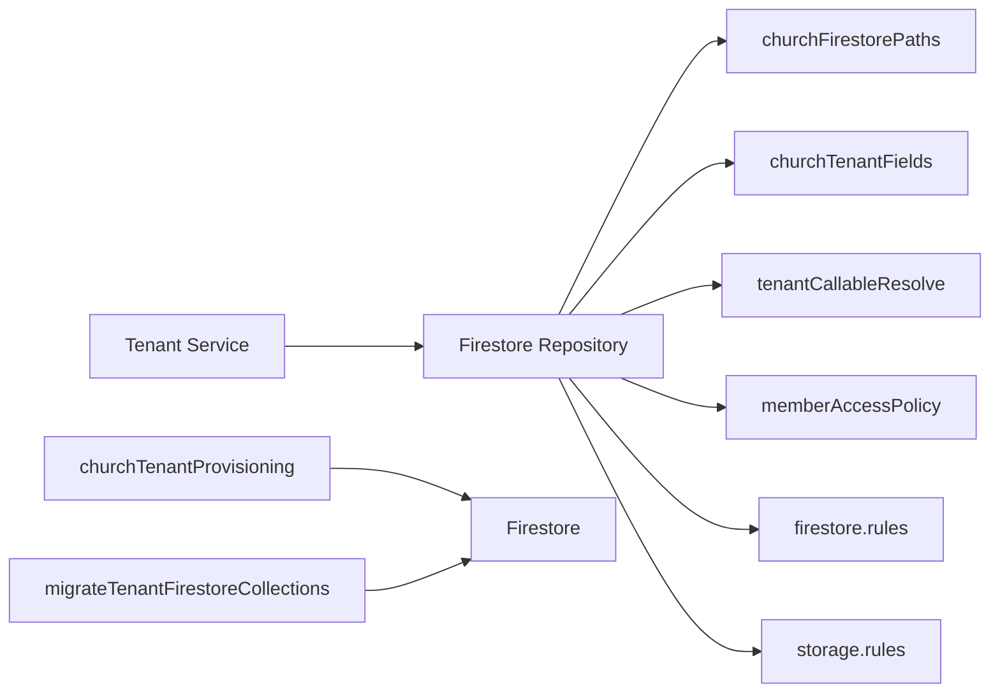

# Data Isolation Strategies

<cite>
**Referenced Files in This Document**
- [firestore.rules](file://firestore.rules)
- [storage.rules](file://storage.rules)
- [functions/src/churchFirestorePaths.ts](file://functions/src/churchFirestorePaths.ts)
- [functions/src/churchTenantFields.ts](file://functions/src/churchTenantFields.ts)
- [functions/src/churchTenantProvisioning.ts](file://functions/src/churchTenantProvisioning.ts)
- [functions/src/migrateTenantFirestoreCollections.ts](file://functions/src/migrateTenantFirestoreCollections.ts)
- [functions/src/tenantCallableResolve.ts](file://functions/src/tenantCallableResolve.ts)
- [functions/src/memberAccessPolicy.ts](file://functions/src/memberAccessPolicy.ts)
- [flutter_app/lib/repositories/firestore_repository.dart](file://flutter_app/lib/repositories/firestore_repository.dart)
- [flutter_app/lib/services/tenant_service.dart](file://flutter_app/lib/services/tenant_service.dart)
- [flutter_app/lib/models/church_model.dart](file://flutter_app/lib/models/church_model.dart)
- [scripts/deploy_firebase_rules.ps1](file://scripts/deploy_firebase_rules.ps1)
</cite>

## Table of Contents
1. [Introduction](#introduction)
2. [Project Structure](#project-structure)
3. [Core Components](#core-components)
4. [Architecture Overview](#architecture-overview)
5. [Detailed Component Analysis](#detailed-component-analysis)
6. [Dependency Analysis](#dependency-analysis)
7. [Performance Considerations](#performance-considerations)
8. [Troubleshooting Guide](#troubleshooting-guide)
9. [Conclusion](#conclusion)

## Introduction
This document explains the multi-tenant data isolation strategy implemented for Firestore and Cloud Storage. It covers how tenant boundaries are enforced at the database level, collection organization, document naming conventions, path-based isolation, security rules, access control policies, and cross-tenant protection. It also details tenant-scoped queries, filtering mechanisms, data partitioning strategies, secure access patterns, query optimization, performance considerations, shared vs isolated resources, common data models, and tenant context propagation across application layers.

## Project Structure
The project implements a multi-tenant architecture with:
- Firestore security rules defining tenant-scoped access.
- Cloud Functions that manage tenant provisioning, field normalization, and migration to tenant-isolated paths.
- Flutter client code that propagates tenant context and constructs tenant-scoped queries.
- Deployment scripts to publish updated rules.

**Diagram sources**
- [functions/src/churchFirestorePaths.ts](file://functions/src/churchFirestorePaths.ts)
- [functions/src/churchTenantFields.ts](file://functions/src/churchTenantFields.ts)
- [functions/src/churchTenantProvisioning.ts](file://functions/src/churchTenantProvisioning.ts)
- [functions/src/migrateTenantFirestoreCollections.ts](file://functions/src/migrateTenantFirestoreCollections.ts)
- [functions/src/tenantCallableResolve.ts](file://functions/src/tenantCallableResolve.ts)
- [functions/src/memberAccessPolicy.ts](file://functions/src/memberAccessPolicy.ts)
- [firestore.rules](file://firestore.rules)
- [storage.rules](file://storage.rules)
- [flutter_app/lib/repositories/firestore_repository.dart](file://flutter_app/lib/repositories/firestore_repository.dart)
- [flutter_app/lib/services/tenant_service.dart](file://flutter_app/lib/services/tenant_service.dart)
- [flutter_app/lib/models/church_model.dart](file://flutter_app/lib/models/church_model.dart)

**Section sources**
- [firestore.rules](file://firestore.rules)
- [storage.rules](file://storage.rules)
- [functions/src/churchFirestorePaths.ts](file://functions/src/churchFirestorePaths.ts)
- [functions/src/churchTenantFields.ts](file://functions/src/churchTenantFields.ts)
- [functions/src/churchTenantProvisioning.ts](file://functions/src/churchTenantProvisioning.ts)
- [functions/src/migrateTenantFirestoreCollections.ts](file://functions/src/migrateTenantFirestoreCollections.ts)
- [functions/src/tenantCallableResolve.ts](file://functions/src/tenantCallableResolve.ts)
- [functions/src/memberAccessPolicy.ts](file://functions/src/memberAccessPolicy.ts)
- [flutter_app/lib/repositories/firestore_repository.dart](file://flutter_app/lib/repositories/firestore_repository.dart)
- [flutter_app/lib/services/tenant_service.dart](file://flutter_app/lib/services/tenant_service.dart)
- [flutter_app/lib/models/church_model.dart](file://flutter_app/lib/models/church_model.dart)

## Core Components
- Firestore Security Rules: Enforce tenant-scoped read/write operations based on authenticated user membership and tenant ownership.
- Cloud Functions:
  - churchFirestorePaths: Centralizes tenant-aware path construction and validation.
  - churchTenantFields: Normalizes tenant fields across documents and backfills missing attributes.
  - churchTenantProvisioning: Creates tenant roots, indexes, and default structures.
  - migrateTenantFirestoreCollections: Migrates legacy data into tenant-scoped collections.
  - tenantCallableResolve: Resolves tenant context from callable requests.
  - memberAccessPolicy: Encapsulates role-based access within a tenant.
- Client-side Context Propagation:
  - Tenant Service: Holds and propagates current tenant ID across UI and data layers.
  - Firestore Repository: Builds tenant-scoped queries and writes using normalized paths.
  - Church Model: Represents tenant metadata and relationships.

**Section sources**
- [firestore.rules](file://firestore.rules)
- [functions/src/churchFirestorePaths.ts](file://functions/src/churchFirestorePaths.ts)
- [functions/src/churchTenantFields.ts](file://functions/src/churchTenantFields.ts)
- [functions/src/churchTenantProvisioning.ts](file://functions/src/churchTenantProvisioning.ts)
- [functions/src/migrateTenantFirestoreCollections.ts](file://functions/src/migrateTenantFirestoreCollections.ts)
- [functions/src/tenantCallableResolve.ts](file://functions/src/tenantCallableResolve.ts)
- [functions/src/memberAccessPolicy.ts](file://functions/src/memberAccessPolicy.ts)
- [flutter_app/lib/repositories/firestore_repository.dart](file://flutter_app/lib/repositories/firestore_repository.dart)
- [flutter_app/lib/services/tenant_service.dart](file://flutter_app/lib/services/tenant_service.dart)
- [flutter_app/lib/models/church_model.dart](file://flutter_app/lib/models/church_model.dart)

## Architecture Overview
The system enforces tenant isolation through layered controls:
- Path-based isolation: All tenant-specific data resides under a tenant root path.
- Rule-based enforcement: Firestore rules validate tenant membership and roles before allowing access.
- Function-mediated operations: Cloud Functions ensure consistent schema and tenant field presence.
- Client-driven scoping: The Flutter app always includes the active tenant context when querying or writing data.

**Diagram sources**
- [functions/src/tenantCallableResolve.ts](file://functions/src/tenantCallableResolve.ts)
- [flutter_app/lib/repositories/firestore_repository.dart](file://flutter_app/lib/repositories/firestore_repository.dart)
- [flutter_app/lib/services/tenant_service.dart](file://flutter_app/lib/services/tenant_service.dart)
- [firestore.rules](file://firestore.rules)

## Detailed Component Analysis

### Firestore Security Rules
- Tenant boundary checks: Reads/writes must match the authenticated user’s tenant membership.
- Role-based access: Admins can manage tenant resources; members have restricted scopes.
- Cross-tenant protection: Global reads/writes without explicit tenant context are denied.
- Storage integration: Storage rules mirror Firestore tenant paths to prevent unauthorized media access.

Key behaviors:
- Require tenantId in all write paths.
- Validate user belongs to the target tenant via membership records.
- Restrict admin-only operations to designated roles.
- Deny wildcard or unscoped operations.

**Section sources**
- [firestore.rules](file://firestore.rules)
- [storage.rules](file://storage.rules)

### Cloud Functions: Tenant Provisioning and Field Normalization
- churchTenantProvisioning: Initializes tenant roots, default collections, and indexes.
- churchTenantFields: Ensures every document contains required tenant identifiers and normalizes them consistently.
- migrateTenantFirestoreCollections: Moves legacy documents into tenant-scoped paths and updates references.
- memberAccessPolicy: Provides reusable logic for checking roles and permissions within a tenant.

Operational flow:
- On tenant creation, provision baseline structure and seed minimal data.
- On document mutations, enforce tenant field presence and normalize values.
- On migration tasks, batch-update legacy datasets to include tenant IDs and relocate under tenant roots.

**Section sources**
- [functions/src/churchTenantProvisioning.ts](file://functions/src/churchTenantProvisioning.ts)
- [functions/src/churchTenantFields.ts](file://functions/src/churchTenantFields.ts)
- [functions/src/migrateTenantFirestoreCollections.ts](file://functions/src/migrateTenantFirestoreCollections.ts)
- [functions/src/memberAccessPolicy.ts](file://functions/src/memberAccessPolicy.ts)

### Cloud Functions: Path Resolution and Callable Context
- churchFirestorePaths: Centralizes building and validating tenant-scoped paths, preventing path traversal and ensuring consistency.
- tenantCallableResolve: Extracts and validates tenant context from callable function calls, returning safe tenant identifiers.

Usage patterns:
- Always construct paths via churchFirestorePaths to avoid manual concatenation errors.
- Use tenantCallableResolve to derive tenantId securely from client requests.

**Section sources**
- [functions/src/churchFirestorePaths.ts](file://functions/src/churchFirestorePaths.ts)
- [functions/src/tenantCallableResolve.ts](file://functions/src/tenantCallableResolve.ts)

### Client-Side Tenant Context Propagation
- Tenant Service: Maintains the active tenantId and exposes it to repositories and UI components.
- Firestore Repository: Uses tenantId to build queries and writes scoped to the current tenant.
- Church Model: Encapsulates tenant metadata and relationships used by the UI and services.

Best practices:
- Never hardcode tenantId; always resolve from Tenant Service.
- Ensure repository methods accept and propagate tenantId for all operations.
- Validate tenant membership before performing sensitive actions.

**Section sources**
- [flutter_app/lib/repositories/firestore_repository.dart](file://flutter_app/lib/repositories/firestore_repository.dart)
- [flutter_app/lib/services/tenant_service.dart](file://flutter_app/lib/services/tenant_service.dart)
- [flutter_app/lib/models/church_model.dart](file://flutter_app/lib/models/church_model.dart)

### Data Models and Partitioning Strategy
- Tenants collection: Stores tenant metadata and membership indices.
- Church-scoped collections: Each tenant has its own set of collections under a dedicated root path.
- Common data models: Documents include tenantId and role fields to support rule evaluation and client-side filtering.

Partitioning approach:
- Logical partitioning by tenantId in document paths.
- Indexes optimized for tenant-scoped queries (e.g., composite indexes on tenantId + status).
- Shared resources (if any) are explicitly separated and guarded by stricter rules.

**Section sources**
- [functions/src/churchTenantFields.ts](file://functions/src/churchTenantFields.ts)
- [functions/src/churchTenantProvisioning.ts](file://functions/src/churchTenantProvisioning.ts)
- [flutter_app/lib/models/church_model.dart](file://flutter_app/lib/models/church_model.dart)

### Secure Access Patterns and Query Optimization
- Tenant-scoped queries: Always filter by tenantId first to minimize read costs and improve performance.
- Path-based reads: Use direct document paths when possible instead of broad collection scans.
- Composite indexes: Define indexes for frequent query patterns (tenantId + timestamp, tenantId + status).
- Avoid cross-tenant joins: Normalize data within tenant scope and use functions for cross-tenant analytics only when necessary.

Example patterns:
- Stream data under /tenants/{tenantId}/... with real-time listeners.
- Batch writes within a transaction scoped to a single tenant.
- Use callable functions to perform server-side aggregations while preserving tenant boundaries.

**Section sources**
- [firestore.rules](file://firestore.rules)
- [functions/src/churchFirestorePaths.ts](file://functions/src/churchFirestorePaths.ts)
- [flutter_app/lib/repositories/firestore_repository.dart](file://flutter_app/lib/repositories/firestore_repository.dart)

## Dependency Analysis
The following diagram shows key dependencies between client, functions, and storage/rules:

**Diagram sources**
- [flutter_app/lib/services/tenant_service.dart](file://flutter_app/lib/services/tenant_service.dart)
- [flutter_app/lib/repositories/firestore_repository.dart](file://flutter_app/lib/repositories/firestore_repository.dart)
- [functions/src/churchFirestorePaths.ts](file://functions/src/churchFirestorePaths.ts)
- [functions/src/churchTenantFields.ts](file://functions/src/churchTenantFields.ts)
- [functions/src/tenantCallableResolve.ts](file://functions/src/tenantCallableResolve.ts)
- [functions/src/memberAccessPolicy.ts](file://functions/src/memberAccessPolicy.ts)
- [functions/src/churchTenantProvisioning.ts](file://functions/src/churchTenantProvisioning.ts)
- [functions/src/migrateTenantFirestoreCollections.ts](file://functions/src/migrateTenantFirestoreCollections.ts)
- [firestore.rules](file://firestore.rules)
- [storage.rules](file://storage.rules)

**Section sources**
- [flutter_app/lib/services/tenant_service.dart](file://flutter_app/lib/services/tenant_service.dart)
- [flutter_app/lib/repositories/firestore_repository.dart](file://flutter_app/lib/repositories/firestore_repository.dart)
- [functions/src/churchFirestorePaths.ts](file://functions/src/churchFirestorePaths.ts)
- [functions/src/churchTenantFields.ts](file://functions/src/churchTenantFields.ts)
- [functions/src/tenantCallableResolve.ts](file://functions/src/tenantCallableResolve.ts)
- [functions/src/memberAccessPolicy.ts](file://functions/src/memberAccessPolicy.ts)
- [functions/src/churchTenantProvisioning.ts](file://functions/src/churchTenantProvisioning.ts)
- [functions/src/migrateTenantFirestoreCollections.ts](file://functions/src/migrateTenantFirestoreCollections.ts)
- [firestore.rules](file://firestore.rules)
- [storage.rules](file://storage.rules)

## Performance Considerations
- Prefer direct path reads over collection scans to reduce read costs and latency.
- Use composite indexes aligned with tenant-scoped query patterns.
- Limit real-time listeners to necessary subsets; paginate where appropriate.
- Batch writes within transactions scoped to a single tenant to maintain consistency.
- Offload heavy cross-tenant analytics to Cloud Functions to avoid client-side overhead.
- Cache frequently accessed tenant metadata locally to reduce repeated lookups.

[No sources needed since this section provides general guidance]

## Troubleshooting Guide
Common issues and resolutions:
- Permission denied on tenant-scoped reads: Verify tenant membership and ensure tenantId is correctly propagated.
- Unexpected cross-tenant access: Confirm that all paths are constructed via churchFirestorePaths and rules deny unscoped operations.
- Missing tenant fields: Run churchTenantFields normalization or backfill scripts to add required attributes.
- Migration inconsistencies: Execute migrateTenantFirestoreCollections to align legacy data with tenant-scoped paths.
- Rule deployment failures: Re-run deploy_firebase_rules.ps1 to publish updated rules safely.

**Section sources**
- [functions/src/churchTenantFields.ts](file://functions/src/churchTenantFields.ts)
- [functions/src/migrateTenantFirestoreCollections.ts](file://functions/src/migrateTenantFirestoreCollections.ts)
- [scripts/deploy_firebase_rules.ps1](file://scripts/deploy_firebase_rules.ps1)
- [firestore.rules](file://firestore.rules)

## Conclusion
The multi-tenant architecture enforces strict data isolation through path-based scoping, robust Firestore rules, and centralized Cloud Functions for provisioning, normalization, and migration. Client-side tenant context propagation ensures all queries and writes remain scoped to the active tenant. By adhering to these patterns—using churchFirestorePaths, enforcing tenant fields, and optimizing queries—the system achieves secure, scalable, and efficient tenant isolation across Firestore and Cloud Storage.

[No sources needed since this section summarizes without analyzing specific files]