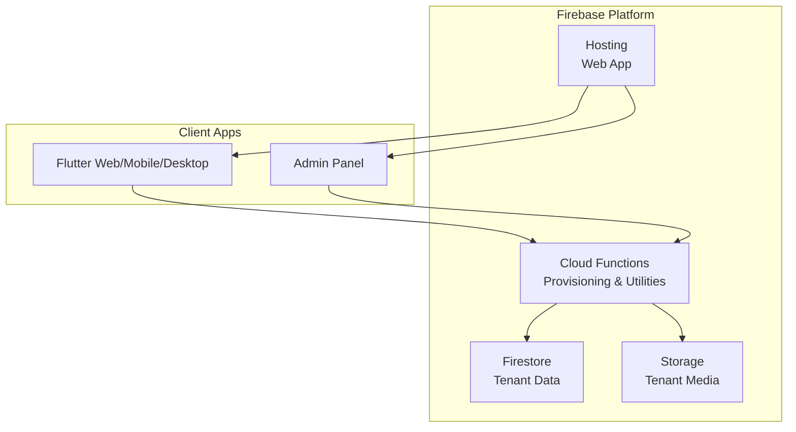
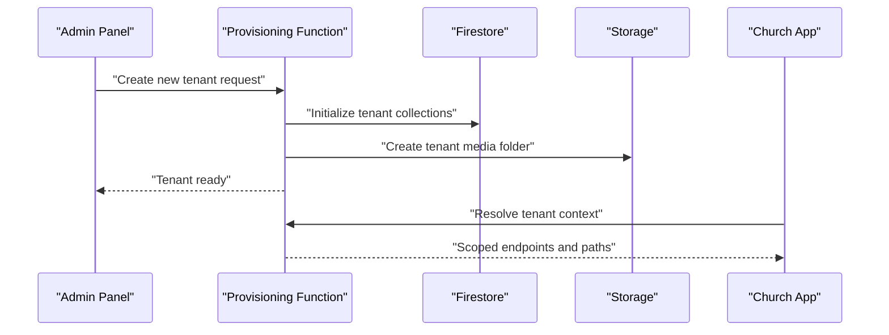
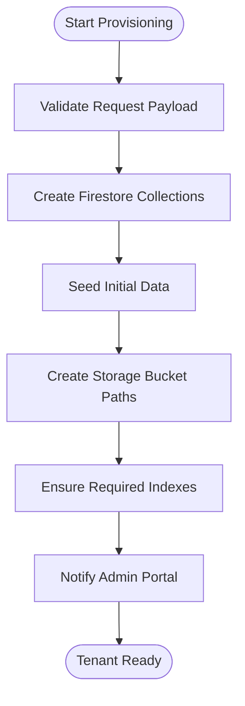
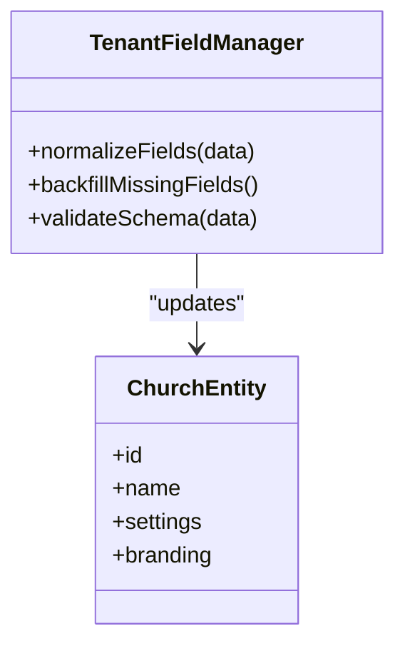
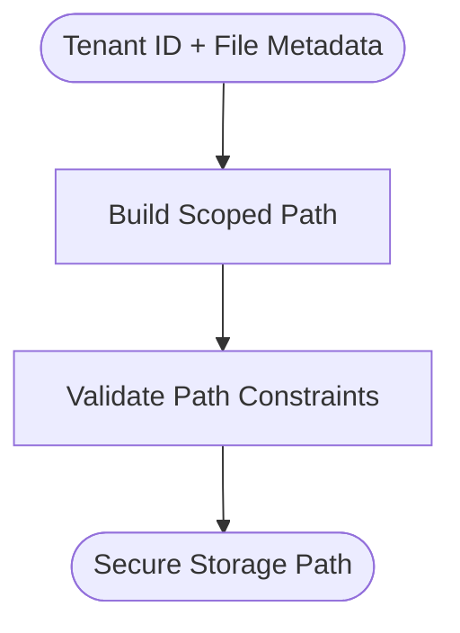
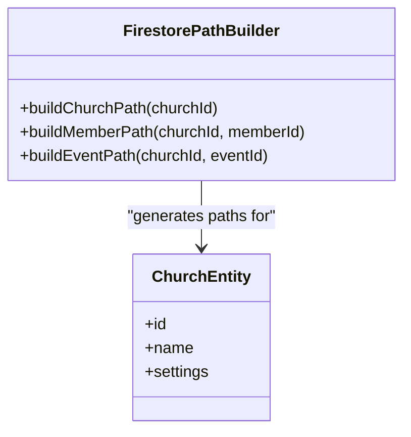
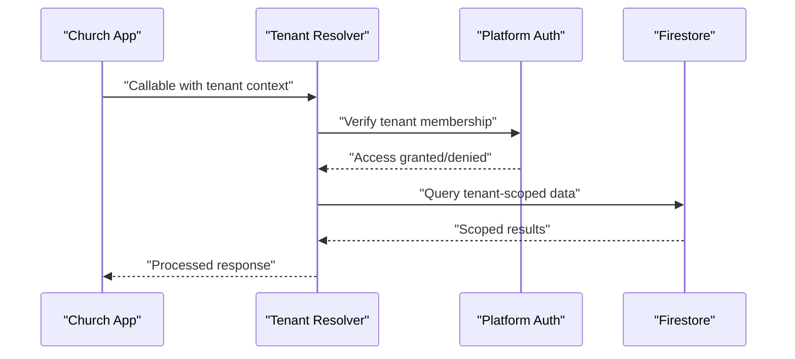
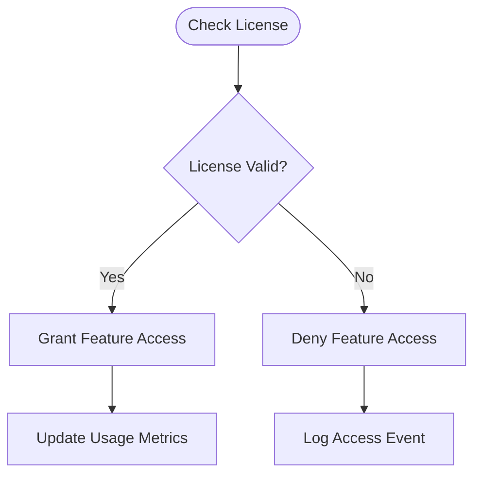
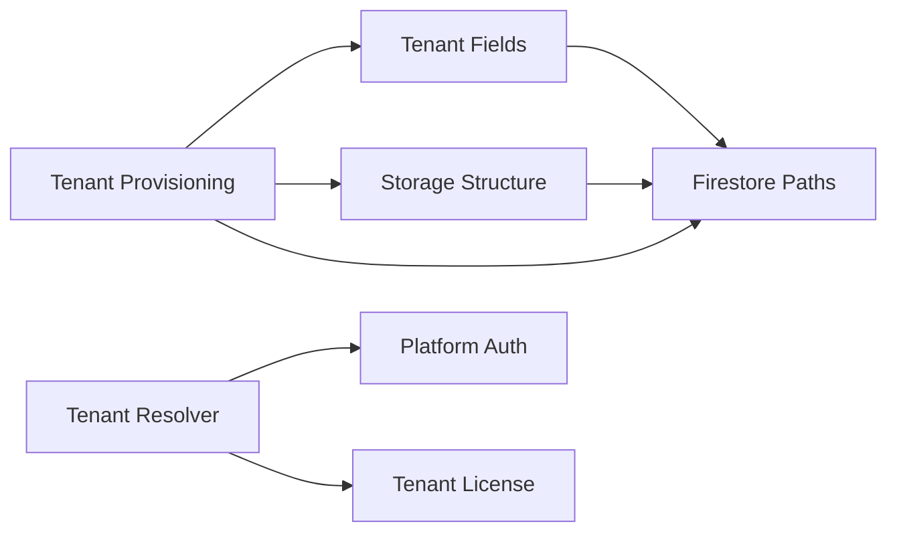

# Multi-Tenant System

<cite>
**Referenced Files in This Document**
- [churchTenantProvisioning.ts](file://functions/src/churchTenantProvisioning.ts)
- [churchTenantFields.ts](file://functions/src/churchTenantFields.ts)
- [churchStorageStructure.ts](file://functions/src/churchStorageStructure.ts)
- [churchFirestorePaths.ts](file://functions/src/churchFirestorePaths.ts)
- [tenantCallableResolve.ts](file://functions/src/tenantCallableResolve.ts)
- [masterPlatformAuth.ts](file://functions/src/masterPlatformAuth.ts)
- [masterTenantLicense.ts](file://functions/src/masterTenantLicense.ts)
- [firestore.rules](file://firestore.rules)
- [storage.rules](file://storage.rules)
- [firebase.json](file://firebase.json)
- [README.md](file://README.md)
</cite>

## Table of Contents
1. [Introduction](#introduction)
2. [Project Structure](#project-structure)
3. [Core Components](#core-components)
4. [Architecture Overview](#architecture-overview)
5. [Detailed Component Analysis](#detailed-component-analysis)
6. [Dependency Analysis](#dependency-analysis)
7. [Performance Considerations](#performance-considerations)
8. [Troubleshooting Guide](#troubleshooting-guide)
9. [Conclusion](#conclusion)

## Introduction
This document explains the multi-tenant architecture for Gestão Yahweh Premium, focusing on how multiple church organizations are provisioned, isolated, and configured within a single platform instance. It covers tenant lifecycle management, data isolation strategies, configuration and branding customization, resource allocation, and operational considerations such as scalability, performance, and security boundaries.

## Project Structure
The multi-tenant system is implemented primarily through Cloud Functions (TypeScript), Firebase Security Rules, and platform configuration files:
- Provisioning and lifecycle automation live in functions that create and initialize tenant resources.
- Path helpers define consistent Firestore and Storage namespaces per tenant.
- Security rules enforce strict tenant-scoped access at both Firestore and Storage layers.
- Platform configuration centralizes hosting and function deployment settings.

[No sources needed since this diagram shows conceptual workflow, not actual code structure]

## Core Components
- Tenant provisioning engine: automates creation of Firestore collections, indexes, and initial seed data for each new church organization.
- Tenant field utilities: normalize and backfill tenant-specific metadata to ensure consistent schema across tenants.
- Storage path builder: constructs secure, tenant-scoped Storage paths for media assets.
- Firestore path builder: generates canonical document paths scoped by tenant ID.
- Callable resolver: resolves tenant context from client calls to ensure correct scoping.
- Master platform auth and license: manages platform-level authentication and tenant licensing checks.
- Security rules: enforce tenant isolation at database and storage levels.

**Section sources**
- [churchTenantProvisioning.ts](file://functions/src/churchTenantProvisioning.ts)
- [churchTenantFields.ts](file://functions/src/churchTenantFields.ts)
- [churchStorageStructure.ts](file://functions/src/churchStorageStructure.ts)
- [churchFirestorePaths.ts](file://functions/src/churchFirestorePaths.ts)
- [tenantCallableResolve.ts](file://functions/src/tenantCallableResolve.ts)
- [masterPlatformAuth.ts](file://functions/src/masterPlatformAuth.ts)
- [masterTenantLicense.ts](file://functions/src/masterTenantLicense.ts)
- [firestore.rules](file://firestore.rules)
- [storage.rules](file://storage.rules)

## Architecture Overview
The multi-tenant architecture uses a shared application runtime with strict logical isolation via tenant IDs. Each church organization is represented by a unique tenant identifier used consistently across Firestore documents, Storage paths, and function invocations.

**Diagram sources**
- [churchTenantProvisioning.ts](file://functions/src/churchTenantProvisioning.ts)
- [tenantCallableResolve.ts](file://functions/src/tenantCallableResolve.ts)

**Section sources**
- [firebase.json](file://firebase.json)
- [firestore.rules](file://firestore.rules)
- [storage.rules](file://storage.rules)

## Detailed Component Analysis

### Tenant Provisioning Engine
Automates the creation of tenant resources including Firestore collections, required indexes, and initial seed data. Ensures consistent baseline configuration for every new church organization.

**Diagram sources**
- [churchTenantProvisioning.ts](file://functions/src/churchTenantProvisioning.ts)

**Section sources**
- [churchTenantProvisioning.ts](file://functions/src/churchTenantProvisioning.ts)

### Tenant Field Management
Normalizes tenant metadata fields and performs backfills to maintain schema consistency across tenants. Supports adding new fields without breaking existing tenants.

**Diagram sources**
- [churchTenantFields.ts](file://functions/src/churchTenantFields.ts)

**Section sources**
- [churchTenantFields.ts](file://functions/src/churchTenantFields.ts)

### Storage Path Builder
Constructs secure, tenant-scoped Storage paths to isolate media assets between churches. Prevents cross-tenant file access.

**Diagram sources**
- [churchStorageStructure.ts](file://functions/src/churchStorageStructure.ts)

**Section sources**
- [churchStorageStructure.ts](file://functions/src/churchStorageStructure.ts)

### Firestore Path Builder
Generates canonical document paths scoped by tenant ID, ensuring consistent data organization and query patterns across all church entities.

**Diagram sources**
- [churchFirestorePaths.ts](file://functions/src/churchFirestorePaths.ts)

**Section sources**
- [churchFirestorePaths.ts](file://functions/src/churchFirestorePaths.ts)

### Tenant Context Resolver
Resolves tenant context from client calls to ensure operations are scoped to the correct church organization. Validates tenant permissions before processing requests.

**Diagram sources**
- [tenantCallableResolve.ts](file://functions/src/tenantCallableResolve.ts)
- [masterPlatformAuth.ts](file://functions/src/masterPlatformAuth.ts)

**Section sources**
- [tenantCallableResolve.ts](file://functions/src/tenantCallableResolve.ts)
- [masterPlatformAuth.ts](file://functions/src/masterPlatformAuth.ts)

### License Management
Manages tenant licensing to control feature availability and resource allocation per church organization.

**Diagram sources**
- [masterTenantLicense.ts](file://functions/src/masterTenantLicense.ts)

**Section sources**
- [masterTenantLicense.ts](file://functions/src/masterTenantLicense.ts)

## Dependency Analysis
The multi-tenant system has clear dependency relationships between components:

**Diagram sources**
- [churchTenantProvisioning.ts](file://functions/src/churchTenantProvisioning.ts)
- [churchTenantFields.ts](file://functions/src/churchTenantFields.ts)
- [churchStorageStructure.ts](file://functions/src/churchStorageStructure.ts)
- [churchFirestorePaths.ts](file://functions/src/churchFirestorePaths.ts)
- [tenantCallableResolve.ts](file://functions/src/tenantCallableResolve.ts)
- [masterPlatformAuth.ts](file://functions/src/masterPlatformAuth.ts)
- [masterTenantLicense.ts](file://functions/src/masterTenantLicense.ts)

**Section sources**
- [churchTenantProvisioning.ts](file://functions/src/churchTenantProvisioning.ts)
- [churchTenantFields.ts](file://functions/src/churchTenantFields.ts)
- [churchStorageStructure.ts](file://functions/src/churchStorageStructure.ts)
- [churchFirestorePaths.ts](file://functions/src/churchFirestorePaths.ts)
- [tenantCallableResolve.ts](file://functions/src/tenantCallableResolve.ts)
- [masterPlatformAuth.ts](file://functions/src/masterPlatformAuth.ts)
- [masterTenantLicense.ts](file://functions/src/masterTenantLicense.ts)

## Performance Considerations
- **Data Isolation**: Use tenant-scoped queries to minimize data scanning and improve performance.
- **Caching**: Implement caching strategies for frequently accessed tenant configurations and branding data.
- **Resource Allocation**: Monitor tenant usage patterns to optimize resource allocation and prevent noisy neighbor issues.
- **Index Optimization**: Ensure proper Firestore indexes for common tenant-scoped queries.
- **Storage Efficiency**: Use appropriate media compression and CDN caching for tenant-specific assets.

## Troubleshooting Guide
Common issues and their resolutions:
- **Tenant Resolution Failures**: Verify tenant context is correctly passed in callable functions and validate membership permissions.
- **Storage Access Denied**: Check storage rules for proper tenant-scoped path validation.
- **Data Inconsistency**: Use field backfill utilities to ensure schema consistency across tenants.
- **License Issues**: Verify tenant license status and feature entitlements.

**Section sources**
- [firestore.rules](file://firestore.rules)
- [storage.rules](file://storage.rules)
- [churchTenantFields.ts](file://functions/src/churchTenantFields.ts)
- [masterTenantLicense.ts](file://functions/src/masterTenantLicense.ts)

## Conclusion
The multi-tenant architecture in Gestão Yahweh Premium provides robust isolation, scalable provisioning, and flexible configuration management for multiple church organizations. By leveraging Firebase's security model and structured path conventions, the system ensures data privacy while maintaining operational efficiency. The modular design allows for easy extension and customization of tenant-specific features while preserving core platform integrity.