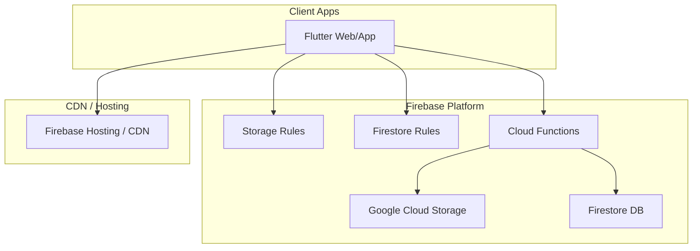
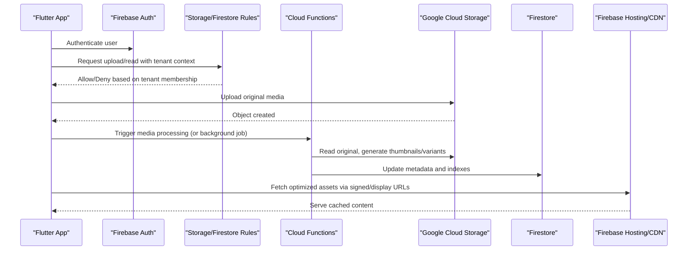
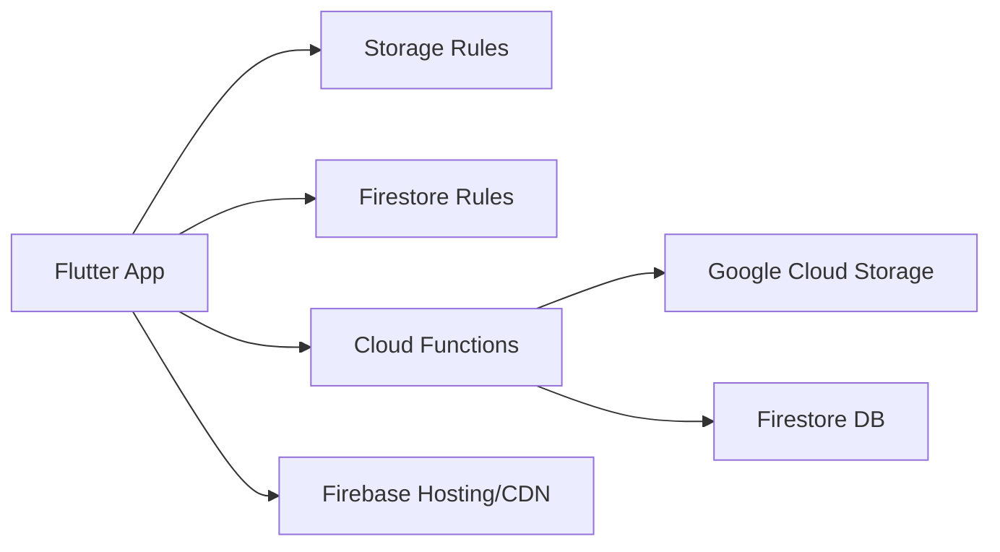
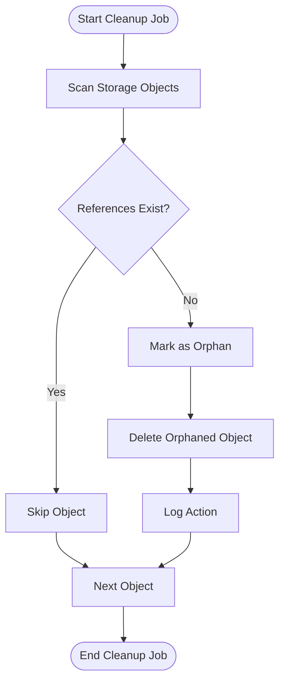

# Resource Management

<cite>
**Referenced Files in This Document**
- [storage.rules](file://storage.rules)
- [firestore.rules](file://firestore.rules)
- [functions/index.js](file://functions/index.js)
- [functions/cleanupOrphanFiles.js](file://functions/cleanupOrphanFiles.js)
- [functions/storageCleanupOnFirestoreDelete.js](file://functions/storageCleanupOnFirestoreDelete.js)
- [functions/processChurchStorageMedia.js](file://functions/processChurchStorageMedia.js)
- [functions/migrateStorageConsolidated.js](file://functions/migrateStorageConsolidated.js)
- [functions/churchStorageStructure.js](file://functions/churchStorageStructure.js)
- [flutter_app/MIDIA_STORAGE_PADRAO_ECOFIRE.md](file://flutter_app/MIDIA_STORAGE_PADRAO_ECOFIRE.md)
- [flutter_app/STORAGE_CORS_README.txt](file://flutter_app/STORAGE_CORS_README.txt)
- [flutter_app/storage_cors.json](file://flutter_app/storage_cors.json)
- [scripts/apply_storage_cors.ps1](file://scripts/apply_storage_cors.ps1)
- [scripts/cleanup_storage_legacy.ps1](file://scripts/cleanup_storage_legacy.ps1)
- [scripts/purge_yahweh_chat_old_media.cjs](file://scripts/purge_yahweh_chat_old_media.cjs)
</cite>

## Table of Contents
1. [Introduction](#introduction)
2. [Project Structure](#project-structure)
3. [Core Components](#core-components)
4. [Architecture Overview](#architecture-overview)
5. [Detailed Component Analysis](#detailed-component-analysis)
6. [Dependency Analysis](#dependency-analysis)
7. [Performance Considerations](#performance-considerations)
8. [Troubleshooting Guide](#troubleshooting-guide)
9. [Conclusion](#conclusion)
10. [Appendices](#appendices)

## Introduction
This document explains how storage resources are organized and managed for a multi-tenant environment, focusing on per-tenant isolation, folder structures, naming conventions, quotas, cleanup processes, media processing pipelines, CDN integration, security policies, and operational procedures such as backup and disaster recovery. It synthesizes the implementation across Firebase Storage rules, Cloud Functions, and Flutter app documentation to provide a comprehensive guide for engineers and operators.

## Project Structure
The resource management system spans several layers:
- Security and access control via Firebase Storage and Firestore rules
- Server-side automation via Cloud Functions for cleanup, media processing, and tenant-aware path resolution
- App-level conventions and configuration for CORS and CDN behavior
- Operational scripts for maintenance, migration, and cleanup

**Diagram sources**
- [storage.rules](file://storage.rules)
- [firestore.rules](file://firestore.rules)
- [functions/index.js](file://functions/index.js)

**Section sources**
- [flutter_app/MIDIA_STORAGE_PADRAO_ECOFIRE.md](file://flutter_app/MIDIA_STORAGE_PADRAO_ECOFIRE.md)
- [flutter_app/STORAGE_CORS_README.txt](file://flutter_app/STORAGE_CORS_README.txt)

## Core Components
- Tenant-aware storage paths and naming conventions
- Storage rules enforcing per-tenant isolation and access control
- Cloud Functions orchestrating cleanup, media processing, and metadata synchronization
- CORS and CDN configuration for secure, performant content delivery
- Operational scripts for legacy cleanup and maintenance

Key responsibilities:
- Organize files under tenant-scoped prefixes (e.g., churches/<churchId>/...)
- Enforce read/write permissions based on authenticated user context and tenant membership
- Maintain consistent file naming and structure for thumbnails, processed assets, and originals
- Automate orphan detection and cleanup when references are deleted
- Provide display URLs and CDN-friendly caching headers where applicable

**Section sources**
- [functions/churchStorageStructure.js](file://functions/churchStorageStructure.js)
- [functions/processChurchStorageMedia.js](file://functions/processChurchStorageMedia.js)
- [functions/cleanupOrphanFiles.js](file://functions/cleanupOrphanFiles.js)
- [functions/storageCleanupOnFirestoreDelete.js](file://functions/storageCleanupOnFirestoreDelete.js)
- [flutter_app/MIDIA_STORAGE_PADRAO_ECOFIRE.md](file://flutter_app/MIDIA_STORAGE_PADRAO_ECOFIRE.md)

## Architecture Overview
The storage architecture centers on tenant isolation at both data and storage layers, with serverless automation ensuring consistency and cleanliness.

**Diagram sources**
- [storage.rules](file://storage.rules)
- [firestore.rules](file://firestore.rules)
- [functions/processChurchStorageMedia.js](file://functions/processChurchStorageMedia.js)

## Detailed Component Analysis

### Tenant-Aware Storage Paths and Naming Conventions
- All tenant-specific content is scoped under a tenant identifier, typically a church ID, to ensure strict isolation.
- Common patterns include:
  - Originals: churches/<churchId>/media/originals/<entityType>/<objectId>.<ext>
  - Thumbnails: churches/<churchId>/media/thumbnails/<entityType>/<objectId>_thumb.<ext>
  - Processed variants: churches/<churchId>/media/processed/<entityType>/<objectId>_v<version>.<ext>
- File naming includes entity type, object ID, and versioning or variant suffixes to support multiple renditions.
- Metadata in Firestore mirrors storage paths and tracks status, sizes, and CDN URLs.

Operational guidance:
- Always derive storage paths from canonical functions to avoid drift.
- Use deterministic naming to enable idempotent operations and cache keys.

**Section sources**
- [functions/churchStorageStructure.js](file://functions/churchStorageStructure.js)
- [flutter_app/MIDIA_STORAGE_PADRAO_ECOFIRE.md](file://flutter_app/MIDIA_STORAGE_PADRAO_ECOFIRE.md)

### Storage Rules and Access Control
- Storage rules enforce tenant scoping by validating that requested paths contain the correct tenant prefix derived from the authenticated user’s claims or profile.
- Firestore rules complement storage rules by restricting reads/writes to documents owned by the current tenant.
- Public endpoints (e.g., thumbnails) may be exposed through signed URLs or allow-listed paths while keeping originals private.

Security highlights:
- Deny cross-tenant access by default.
- Validate operation types (read/write/delete) against role-based permissions.
- Restrict metadata updates to authorized roles.

**Section sources**
- [storage.rules](file://storage.rules)
- [firestore.rules](file://firestore.rules)

### Media Processing Pipeline
- On upload or explicit trigger, Cloud Functions process media to generate thumbnails and optimized variants.
- The pipeline:
  - Validates input format and size
  - Generates thumbnails and resized images/videos
  - Stores variants under tenant-scoped processed directories
  - Updates Firestore metadata and indexes
  - Emits events for downstream tasks (e.g., prefetching)

Optimization notes:
- Use efficient codecs and formats suitable for web/mobile.
- Cache aggressively via CDN; set appropriate TTLs.
- Implement retries and dead-letter handling for failed jobs.

**Section sources**
- [functions/processChurchStorageMedia.js](file://functions/processChurchStorageMedia.js)

### Cleanup Processes and Orphan Detection
- Orphan detection scans storage objects without corresponding Firestore references and marks them for deletion.
- Deletion triggers in Firestore initiate cascading cleanup of associated storage objects.
- Scheduled jobs purge stale pending uploads and old chat media beyond retention windows.

Maintenance routines:
- Periodic scans to identify and remove orphaned files
- Automated cleanup on document deletion
- Retention policies for ephemeral content (e.g., chat attachments)

**Section sources**
- [functions/cleanupOrphanFiles.js](file://functions/cleanupOrphanFiles.js)
- [functions/storageCleanupOnFirestoreDelete.js](file://functions/storageCleanupOnFirestoreDelete.js)
- [scripts/purge_yahweh_chat_old_media.cjs](file://scripts/purge_yahweh_chat_old_media.cjs)

### Migration and Consolidation
- Migration utilities consolidate legacy storage layouts into the canonical tenant-scoped structure.
- Backfillers update Firestore metadata to reflect new paths and statuses.
- Rollback strategies preserve originals until validation succeeds.

Operational steps:
- Run migrations in dry-run mode first
- Validate counts and checksums
- Execute finalization and cleanup

**Section sources**
- [functions/migrateStorageConsolidated.js](file://functions/migrateStorageConsolidated.js)

### CDN Integration and CORS Configuration
- Firebase Hosting serves static assets and can proxy optimized media with proper caching headers.
- CORS settings restrict origins and methods to trusted domains, preventing misuse.
- Signed URLs or display URLs provide controlled access to protected resources.

Best practices:
- Configure CORS to allow only application domains
- Use cache-busting query parameters for updated assets
- Enable compression and HTTP/2 where supported

**Section sources**
- [flutter_app/STORAGE_CORS_README.txt](file://flutter_app/STORAGE_CORS_README.txt)
- [flutter_app/storage_cors.json](file://flutter_app/storage_cors.json)
- [scripts/apply_storage_cors.ps1](file://scripts/apply_storage_cors.ps1)

### Quota Management and Usage Monitoring
- Track per-tenant storage usage via Firestore counters and periodic audits.
- Enforce quotas at the application layer and alert on near-limit conditions.
- Monitor function execution and storage operations for cost anomalies.

Monitoring recommendations:
- Dashboards for per-tenant usage trends
- Alerts for spikes in upload volume or failed processing
- Cost attribution by tenant and feature

[No sources needed since this section provides general guidance]

### Backup Strategies and Disaster Recovery
- Regular snapshots of Firestore collections and critical metadata
- Immutable backups of storage buckets with lifecycle policies
- Restore procedures validated by periodic drills

Recovery playbook:
- Identify scope of failure (tenant-wide vs. global)
- Restore metadata first, then rehydrate storage if necessary
- Verify integrity and reindex searchables

[No sources needed since this section provides general guidance]

## Dependency Analysis
The storage subsystem depends on coordinated interactions between rules, functions, and app configurations.

**Diagram sources**
- [functions/index.js](file://functions/index.js)
- [storage.rules](file://storage.rules)
- [firestore.rules](file://firestore.rules)

**Section sources**
- [functions/index.js](file://functions/index.js)

## Performance Considerations
- Prefer CDN caching for thumbnails and processed assets
- Batch metadata updates to reduce Firestore writes
- Use resumable uploads for large files
- Limit concurrent processing jobs per tenant to avoid throttling
- Optimize image/video codecs and dimensions for target devices

[No sources needed since this section provides general guidance]

## Troubleshooting Guide
Common issues and resolutions:
- Access denied errors: verify tenant membership and rule expressions
- Missing thumbnails: check processing job logs and retry mechanisms
- Stale references: run orphan detection and cleanup jobs
- CORS failures: confirm allowed origins and preflight responses
- High costs: audit function invocations and storage operations

Operational checks:
- Validate storage paths using canonical functions
- Inspect Firestore metadata for inconsistencies
- Review function error logs and dead-letter queues

**Section sources**
- [functions/cleanupOrphanFiles.js](file://functions/cleanupOrphanFiles.js)
- [functions/storageCleanupOnFirestoreDelete.js](file://functions/storageCleanupOnFirestoreDelete.js)
- [scripts/cleanup_storage_legacy.ps1](file://scripts/cleanup_storage_legacy.ps1)

## Conclusion
The multi-tenant storage system enforces strict isolation through tenant-scoped paths and robust rules, while serverless automation ensures data consistency, performance, and maintainability. By following the documented conventions, leveraging the provided tools, and adhering to security and operational best practices, teams can scale storage efficiently across tenants with confidence.

[No sources needed since this section summarizes without analyzing specific files]

## Appendices

### Storage Cleanup Flow

**Diagram sources**
- [functions/cleanupOrphanFiles.js](file://functions/cleanupOrphanFiles.js)